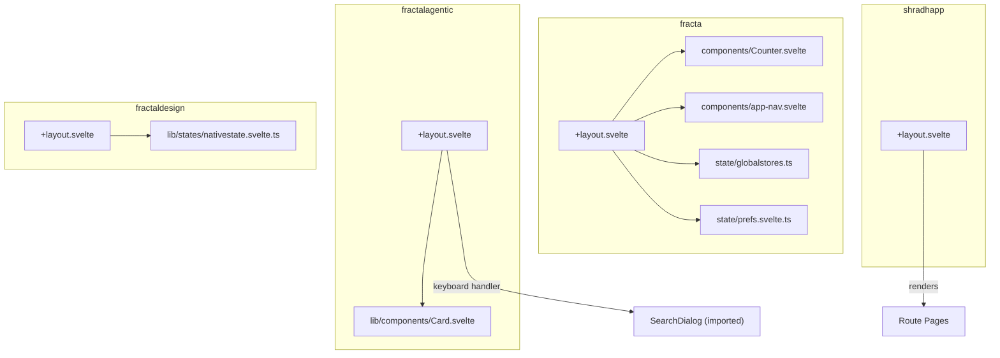
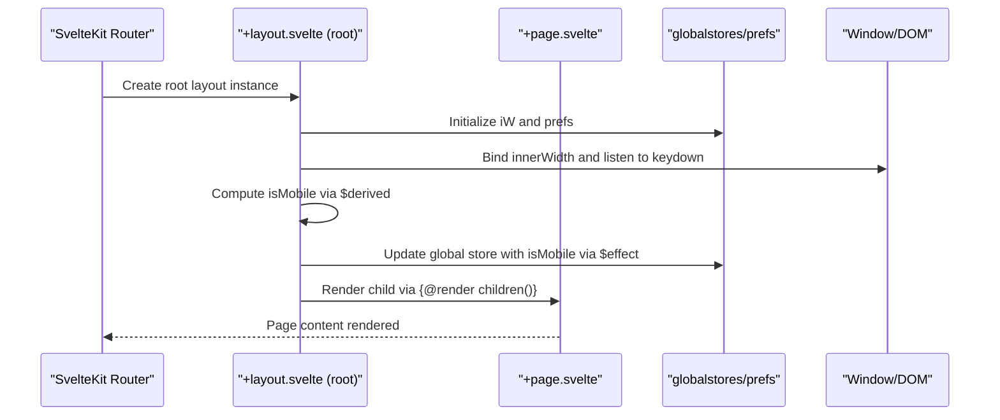
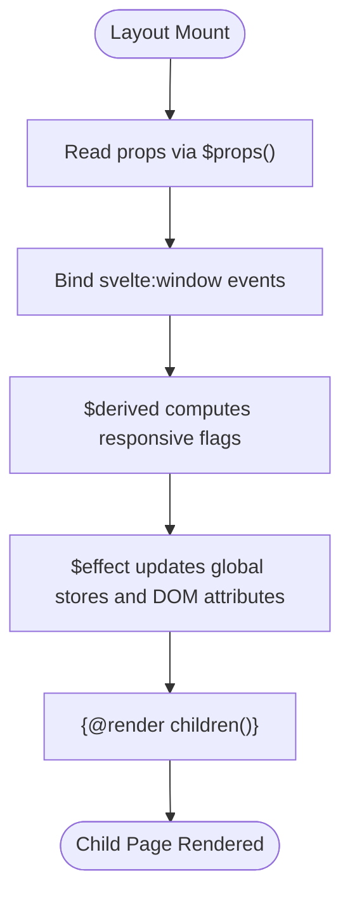
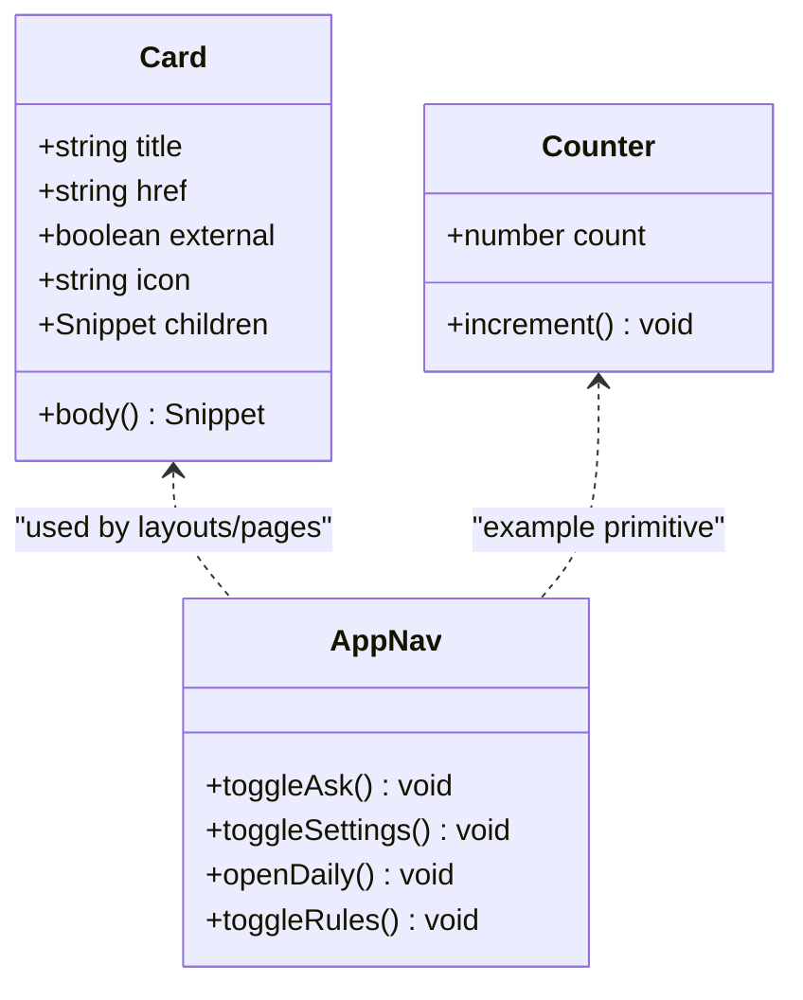
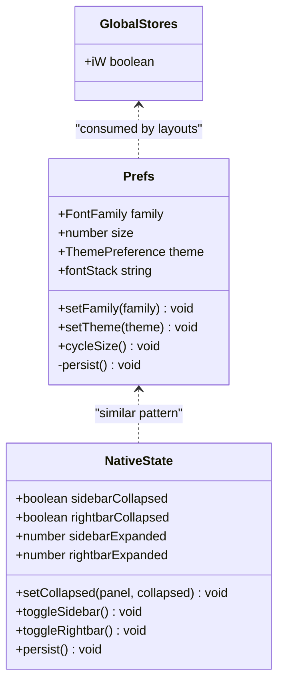
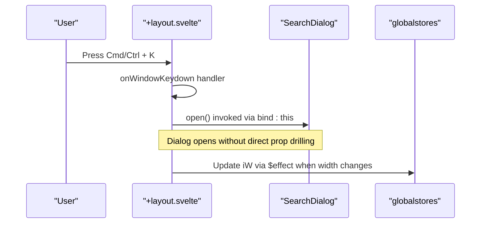
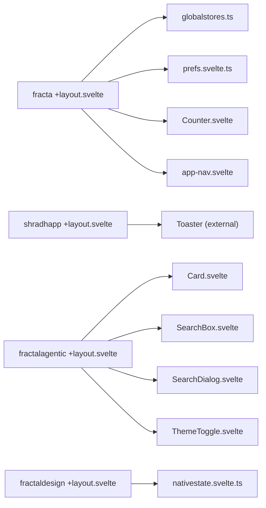

<cite>
**Referenced Files in This Document**
- `apps/fracta/src/routes/+layout.svelte`
- `apps/shradhapp/src/routes/+layout.svelte`
- `sites/fractalagentic/src/routes/+layout.svelte`
- `sites/fractaldesign/src/routes/+layout.svelte`
- `apps/fracta/src/lib/state/globalstores.ts`
- `apps/fracta/src/lib/state/prefs.svelte.ts`
- `apps/fracta/src/lib/components/Counter.svelte`
- `apps/fracta/src/lib/components/app-nav.svelte`
- `sites/fractalagentic/src/lib/components/Card.svelte`
- `sites/fractaldesign/src/lib/states/nativestate.svelte.ts`
</cite>

## Table of Contents
1. Introduction
2. Project Structure
3. Core Components
4. Architecture Overview
5. Detailed Component Analysis
6. Dependency Analysis
7. Performance Considerations
8. Troubleshooting Guide
9. Conclusion

## Introduction
This document explains the SvelteKit component system architecture across the monorepo’s Svelte applications, focusing on:
- Svelte 5 runes for state and reactivity ($state, $derived, $effect, $props)
- Snippet-based layouts and child rendering patterns via +layout.svelte files
- Prop interfaces and reusable component composition
- Responsive design implementation using window width and derived state
- Event handling, lifecycle management, and accessibility patterns
- Testing strategies, performance optimization through component splitting, and best practices for organization

The examples are grounded in actual layout and component files from apps/fracta, apps/shradhapp, sites/fractalagentic, and sites/fractaldesign.

## Project Structure
Each SvelteKit application follows a consistent structure:
- Route-level layouts (+layout.svelte) define shared chrome, global styles, and render children via snippets
- Shared components live under src/lib/components
- Global or app-scoped state is kept in src/lib/state or src/lib/states modules
- Styling uses single-tab indented SASS (.sass) exclusively

**Diagram sources**
- `apps/fracta/src/routes/+layout.svelte#L1-L29`
- `apps/fracta/src/lib/components/Counter.svelte#L1-L6`
- `apps/fracta/src/lib/components/app-nav.svelte#L1-L47`
- `apps/fracta/src/lib/state/globalstores.ts#L1-L4`
- `apps/fracta/src/lib/state/prefs.svelte.ts#L1-L75`
- `apps/shradhapp/src/routes/+layout.svelte#L1-L16`
- `sites/fractalagentic/src/routes/+layout.svelte#L1-L126`
- `sites/fractalagentic/src/lib/components/Card.svelte#L1-L108`
- `sites/fractaldesign/src/routes/+layout.svelte#L1-L62`
- `sites/fractaldesign/src/lib/states/nativestate.svelte.ts#L1-L68`

**Section sources**
- `apps/fracta/src/routes/+layout.svelte#L1-L29`
- `apps/shradhapp/src/routes/+layout.svelte#L1-L16`
- `sites/fractalagentic/src/routes/+layout.svelte#L1-L126`
- `sites/fractaldesign/src/routes/+layout.svelte#L1-L62`

## Core Components
Key building blocks demonstrate Svelte 5 runes, snippet-based composition, and prop interfaces:
- Layouts use $props to accept children as Snippets and render them with {@render children()}
- Stateful primitives like counters show $state usage
- Global stores and preferences encapsulate cross-cutting concerns with reactive classes
- Reusable UI components expose typed props and optional snippet slots

Examples:
- Counter demonstrates minimal local state with $state and event handling
- Card shows typed props, conditional rendering, and snippet slot usage
- Layouts illustrate responsive behavior and theme/data attribute updates via $derived and $effect

**Section sources**
- `apps/fracta/src/lib/components/Counter.svelte#L1-L6`
- `sites/fractalagentic/src/lib/components/Card.svelte#L1-L108`
- `apps/fracta/src/lib/state/prefs.svelte.ts#L1-L75`

## Architecture Overview
The layout hierarchy composes pages through +layout.svelte files. Each layout:
- Declares props via $props()
- Computes derived values (e.g., mobile breakpoint)
- Binds to window events for responsive state
- Applies global styles and sets data attributes for themes
- Renders child routes with {@render children()}

**Diagram sources**
- `apps/fracta/src/routes/+layout.svelte#L1-L29`
- `apps/fracta/src/lib/state/globalstores.ts#L1-L4`
- `apps/fracta/src/lib/state/prefs.svelte.ts#L1-L75`
- `sites/fractalagentic/src/routes/+layout.svelte#L1-L126`

## Detailed Component Analysis

### Layout Composition and Child Rendering
- All layouts accept children as Snippets and render them with {@render children()}, enabling flexible composition of page content within shared chrome.
- The fracta layout binds window.innerWidth to compute isMobile and syncs it into a global store; it also applies theme data attributes based on user preferences.
- The shradhapp layout injects global styles and a toast container, then renders children.
- The fractalagentic layout wires keyboard shortcuts, SEO meta tags, and renders header/main/footer around children.
- The fractaldesign layout manages drawer state and toggles native panels, rendering children inside a themed wrapper.

**Diagram sources**
- `apps/fracta/src/routes/+layout.svelte#L1-L29`
- `apps/shradhapp/src/routes/+layout.svelte#L1-L16`
- `sites/fractalagentic/src/routes/+layout.svelte#L1-L126`
- `sites/fractaldesign/src/routes/+layout.svelte#L1-L62`

**Section sources**
- `apps/fracta/src/routes/+layout.svelte#L1-L29`
- `apps/shradhapp/src/routes/+layout.svelte#L1-L16`
- `sites/fractalagentic/src/routes/+layout.svelte#L1-L126`
- `sites/fractaldesign/src/routes/+layout.svelte#L1-L62`

### Reusable Components and Snippet Slots
- The Card component demonstrates typed props and an internal snippet body that can be reused across anchor and div variants. It conditionally renders external link indicators and supports optional children content.
- The Counter component illustrates minimal local state and click handling.
- The app-nav component integrates with global UI state and exposes accessible labels and titles for actions.

**Diagram sources**
- `sites/fractalagentic/src/lib/components/Card.svelte#L1-L108`
- `apps/fracta/src/lib/components/Counter.svelte#L1-L6`
- `apps/fracta/src/lib/components/app-nav.svelte#L1-L47`

**Section sources**
- `sites/fractalagentic/src/lib/components/Card.svelte#L1-L108`
- `apps/fracta/src/lib/components/Counter.svelte#L1-L6`
- `apps/fracta/src/lib/components/app-nav.svelte#L1-L47`

### State Management with Runes
- Reactive classes encapsulate persisted preferences and native layout state using $state fields and methods. They load from localStorage on construction and persist changes automatically.
- Global stores provide lightweight cross-component signals (e.g., isMobile flag).

**Diagram sources**
- `apps/fracta/src/lib/state/prefs.svelte.ts#L1-L75`
- `sites/fractaldesign/src/lib/states/nativestate.svelte.ts#L1-L68`
- `apps/fracta/src/lib/state/globalstores.ts#L1-L4`

**Section sources**
- `apps/fracta/src/lib/state/prefs.svelte.ts#L1-L75`
- `sites/fractaldesign/src/lib/states/nativestate.svelte.ts#L1-L68`
- `apps/fracta/src/lib/state/globalstores.ts#L1-L4`

### Event Handling and Lifecycle Patterns
- Window binding and keyboard listeners are used to trigger dialogs and update state reactively.
- Effects synchronize computed values with global stores and DOM attributes.
- Theme toggling and responsive flags are updated via effects when dependencies change.

**Diagram sources**
- `sites/fractalagentic/src/routes/+layout.svelte#L1-L126`
- `apps/fracta/src/lib/state/globalstores.ts#L1-L4`

**Section sources**
- `sites/fractalagentic/src/routes/+layout.svelte#L1-L126`
- `apps/fracta/src/routes/+layout.svelte#L1-L29`

### Accessibility Patterns
- Skip-to-content links improve keyboard navigation.
- aria-label attributes describe navigation regions.
- External links include rel="noreferrer" where appropriate.
- Hidden decorative elements use aria-hidden="true".

**Section sources**
- `sites/fractalagentic/src/routes/+layout.svelte#L1-L126`
- `apps/fracta/src/lib/components/app-nav.svelte#L1-L47`
- `sites/fractalagentic/src/lib/components/Card.svelte#L1-L108`

## Dependency Analysis
Component and module relationships across the applications:

**Diagram sources**
- `apps/fracta/src/routes/+layout.svelte#L1-L29`
- `apps/fracta/src/lib/state/globalstores.ts#L1-L4`
- `apps/fracta/src/lib/state/prefs.svelte.ts#L1-L75`
- `apps/fracta/src/lib/components/Counter.svelte#L1-L6`
- `apps/fracta/src/lib/components/app-nav.svelte#L1-L47`
- `apps/shradhapp/src/routes/+layout.svelte#L1-L16`
- `sites/fractalagentic/src/routes/+layout.svelte#L1-L126`
- `sites/fractalagentic/src/lib/components/Card.svelte#L1-L108`
- `sites/fractaldesign/src/routes/+layout.svelte#L1-L62`
- `sites/fractaldesign/src/lib/states/nativestate.svelte.ts#L1-L68`

**Section sources**
- `apps/fracta/src/routes/+layout.svelte#L1-L29`
- `apps/shradhapp/src/routes/+layout.svelte#L1-L16`
- `sites/fractalagentic/src/routes/+layout.svelte#L1-L126`
- `sites/fractaldesign/src/routes/+layout.svelte#L1-L62`

## Performance Considerations
- Prefer $derived for computed values to avoid unnecessary recalculations and manual subscriptions.
- Use $effect only for side effects; keep pure logic in $derived or functions.
- Split large components into smaller, focused ones to reduce render scope and improve maintainability.
- Avoid deep reactivity on large immutable datasets; consider $state.raw() where appropriate.
- Keep layout responsibilities minimal; offload heavy computations to modules or workers if needed.
- Use CSS transitions sparingly and leverage hardware-accelerated properties for smooth interactions.

[No sources needed since this section provides general guidance]

## Troubleshooting Guide
Common issues and resolutions:
- Theme not applying: Ensure the effect updates document.documentElement.dataset.theme and that styles reference these attributes.
- Mobile flag not updating: Verify svelte:window binding and that $effect writes to the global store consistently.
- Keyboard shortcut not triggering: Confirm event listener registration and preventDefault behavior.
- LocalStorage failures: Wrap persistence calls in try/catch and fall back to defaults.

**Section sources**
- `apps/fracta/src/routes/+layout.svelte#L1-L29`
- `apps/fracta/src/lib/state/prefs.svelte.ts#L1-L75`
- `sites/fractalagentic/src/routes/+layout.svelte#L1-L126`
- `sites/fractaldesign/src/lib/states/nativestate.svelte.ts#L1-L68`

## Conclusion
The SvelteKit component system in this monorepo leverages Svelte 5 runes for clean, fine-grained reactivity, snippet-based layouts for flexible composition, and typed props for robust interfaces. Layouts centralize global concerns while delegating page-specific logic to child components. By following the patterns shown—reactive classes for state, effects for side effects, derived values for computations, and accessible markup—you can build scalable, performant, and maintainable applications.

[No sources needed since this section summarizes without analyzing specific files]