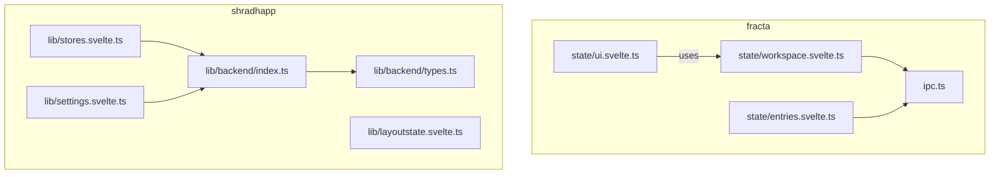
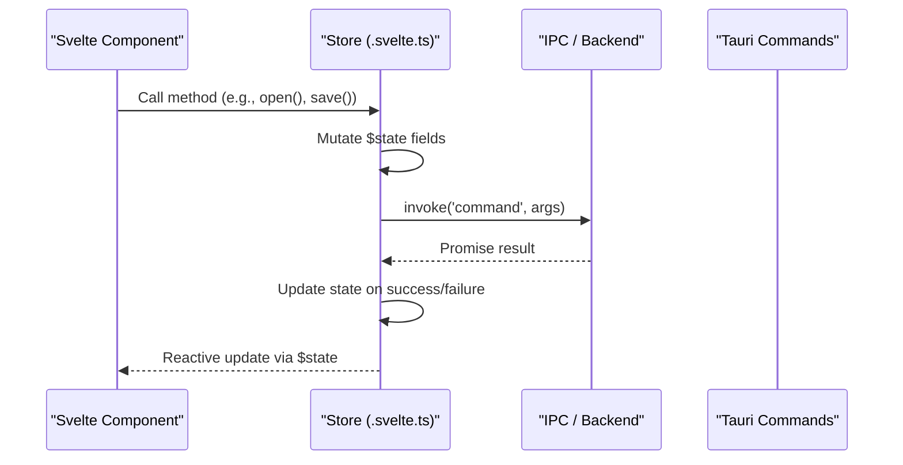
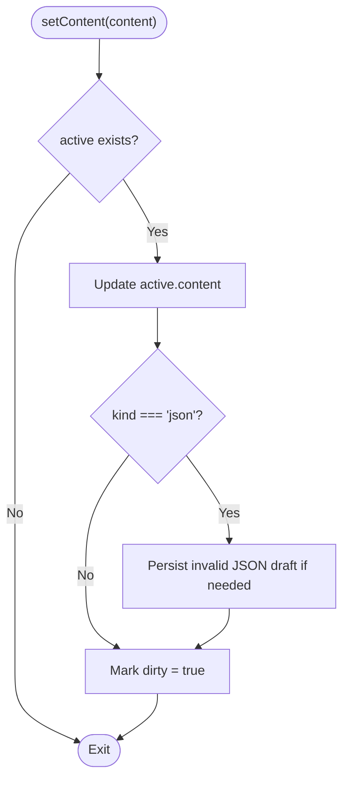
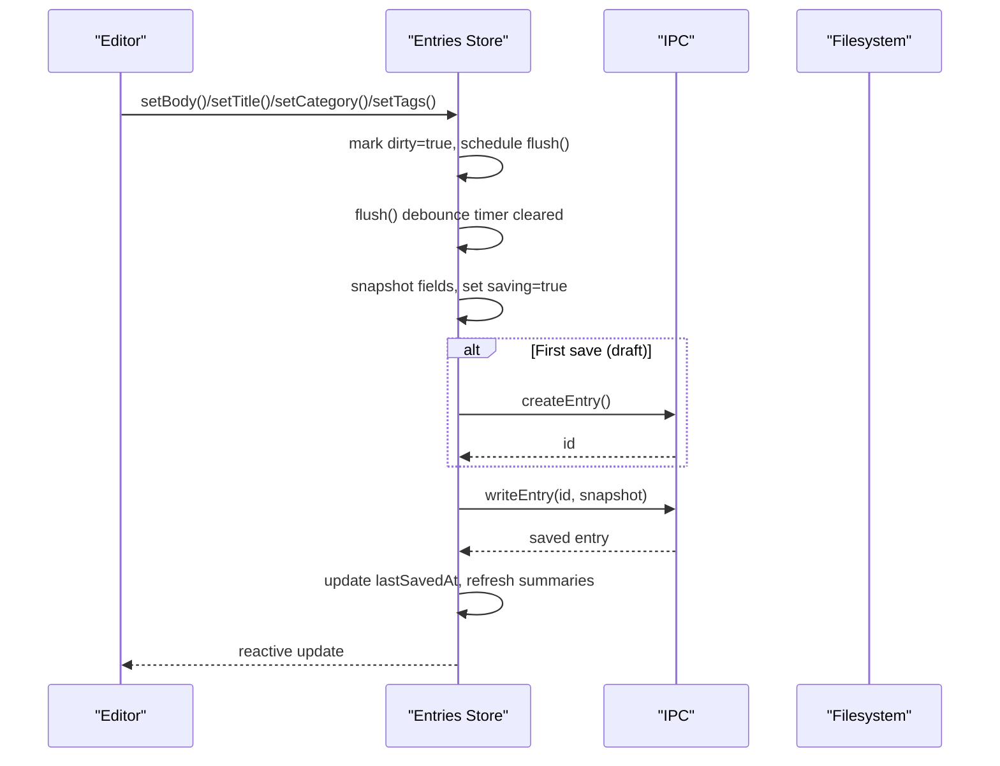
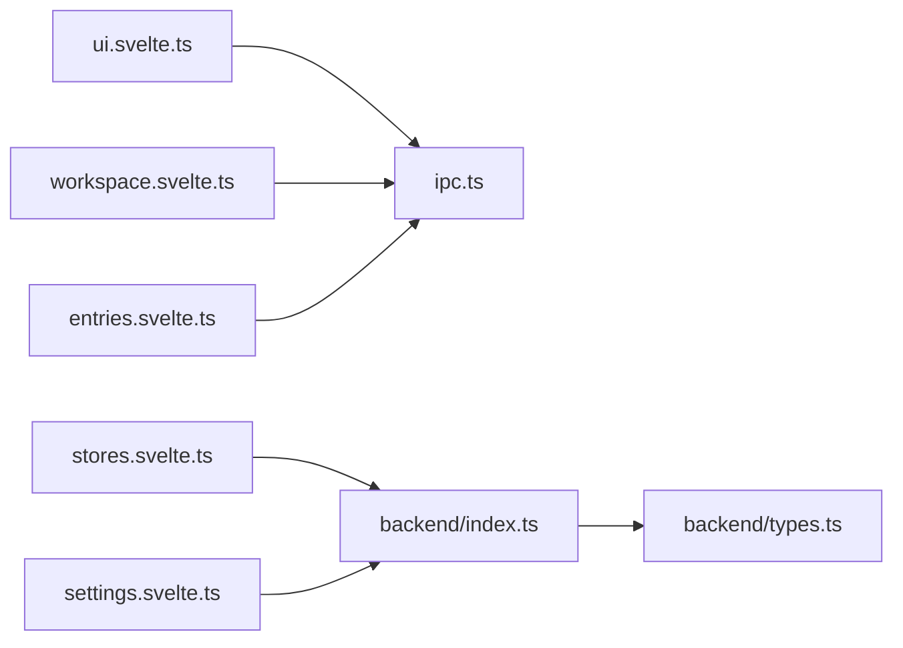

<cite>
**Referenced Files in This Document**
- `apps/fracta/src/lib/state/workspace.svelte.ts`
- `apps/fracta/src/lib/state/entries.svelte.ts`
- `apps/fracta/src/lib/state/ui.svelte.ts`
- `apps/fracta/src/lib/ipc.ts`
- `apps/shradhapp/src/lib/stores.svelte.ts`
- `apps/shradhapp/src/lib/layoutstate.svelte.ts`
- `apps/shradhapp/src/lib/settings.svelte.ts`
- `apps/shradhapp/src/lib/backend/index.ts`
- `apps/shradhapp/src/lib/backend/types.ts`
</cite>

## Table of Contents
1. [Introduction](#introduction)
2. [Project Structure](#project-structure)
3. [Core Components](#core-components)
4. [Architecture Overview](#architecture-overview)
5. [Detailed Component Analysis](#detailed-component-analysis)
6. [Dependency Analysis](#dependency-analysis)
7. [Performance Considerations](#performance-considerations)
8. [Troubleshooting Guide](#troubleshooting-guide)
9. [Conclusion](#conclusion)
10. [Appendices](#appendices)

## Introduction
This document explains how state is managed across the SvelteKit + Svelte 5 + Tauri applications in this repository using Svelte 5 runes. It focuses on:
- Reactive state with $state
- Derived values with $derived (where applicable)
- Effects with $effect (patterns and guidance)
- Global stores vs local component state
- Persistence patterns (localStorage, backend-backed settings)
- Integration with Tauri backend commands
- Real-time updates and synchronization strategies across windows
- Complex state transformations, error handling in reactive contexts
- Performance optimization techniques
- Debugging strategies, serialization, and migration from traditional store patterns

The examples are grounded in actual code from the fracta and shradhapp apps.

## Project Structure
State management is implemented as TypeScript modules that export singleton classes or objects. Each module encapsulates a domain of state, exposes methods to mutate it, and persists where appropriate. The key locations are:
- apps/fracta/src/lib/state — workspace, entries, UI, and other feature stores
- apps/fracta/src/lib/ipc.ts — Tauri command wrappers
- apps/shradhapp/src/lib — media store, layout state, settings store, and backend abstraction

**Diagram sources**
- `apps/fracta/src/lib/state/workspace.svelte.ts#L1-L321`
- `apps/fracta/src/lib/state/entries.svelte.ts#L1-L288`
- `apps/fracta/src/lib/state/ui.svelte.ts#L1-L130`
- `apps/fracta/src/lib/ipc.ts#L1-L237`
- `apps/shradhapp/src/lib/stores.svelte.ts#L1-L26`
- `apps/shradhapp/src/lib/layoutstate.svelte.ts#L1-L91`
- `apps/shradhapp/src/lib/settings.svelte.ts#L1-L124`
- `apps/shradhapp/src/lib/backend/index.ts#L1-L10`
- `apps/shradhapp/src/lib/backend/types.ts#L1-L173`

**Section sources**
- `apps/fracta/src/lib/state/workspace.svelte.ts#L1-L321`
- `apps/fracta/src/lib/state/entries.svelte.ts#L1-L288`
- `apps/fracta/src/lib/state/ui.svelte.ts#L1-L130`
- `apps/fracta/src/lib/ipc.ts#L1-L237`
- `apps/shradhapp/src/lib/stores.svelte.ts#L1-L26`
- `apps/shradhapp/src/lib/layoutstate.svelte.ts#L1-L91`
- `apps/shradhapp/src/lib/settings.svelte.ts#L1-L124`
- `apps/shradhapp/src/lib/backend/index.ts#L1-L10`
- `apps/shradhapp/src/lib/backend/types.ts#L1-L173`

## Core Components
- Workspace store (fracta): Encapsulates file tree, active file, search, graph, preview, and persistence via Tauri IPC. Uses $state for all fields and async methods to interact with the backend.
- Entries store (fracta): Single source of truth for vault entries and the active draft. Implements autosave with debouncing and write chaining to avoid races.
- UI store (fracta): Transient app shell state persisted to localStorage.
- Media store (shradhapp): Holds media items and loading/error states; loads from backend.
- Layout state (shradhapp): Resizable panel sizes and collapsed states persisted to localStorage.
- Settings store (shradhapp): App settings and runtime info loaded from backend (Tauri) or localStorage in preview mode.

Key rune usage patterns:
- $state for reactive primitives and objects
- Class-based stores exposing imperative methods
- Async operations wrapped in try/catch with explicit error fields
- LocalStorage for lightweight persistence
- IPC layer for Tauri integration

**Section sources**
- `apps/fracta/src/lib/state/workspace.svelte.ts#L1-L321`
- `apps/fracta/src/lib/state/entries.svelte.ts#L1-L288`
- `apps/fracta/src/lib/state/ui.svelte.ts#L1-L130`
- `apps/shradhapp/src/lib/stores.svelte.ts#L1-L26`
- `apps/shradhapp/src/lib/layoutstate.svelte.ts#L1-L91`
- `apps/shradhapp/src/lib/settings.svelte.ts#L1-L124`

## Architecture Overview
The application uses a layered approach:
- UI components consume stores exported from .svelte.ts modules
- Stores use $state for reactivity and expose methods to mutate state
- Stores call into an IPC or backend abstraction to communicate with Tauri commands
- Some stores persist to localStorage for transient or user preferences

**Diagram sources**
- `apps/fracta/src/lib/state/workspace.svelte.ts#L1-L321`
- `apps/fracta/src/lib/state/entries.svelte.ts#L1-L288`
- `apps/fracta/src/lib/ipc.ts#L1-L237`
- `apps/shradhapp/src/lib/backend/index.ts#L1-L10`

## Detailed Component Analysis

### Workspace Store (fracta)
Responsibilities:
- Manage workspace item list, active file, links, graph, preview, search
- Persist invalid JSON drafts locally for recovery
- Interact with Tauri commands for filesystem operations
- Provide safe refresh-from-disk behavior that never overwrites unsaved edits

Reactive state:
- All fields are declared with $state
- Computed getters like visibleItems derive from query and items

Persistence:
- Invalid JSON drafts stored under a unique key in localStorage
- Successful saves clear recovery drafts

Error handling:
- Each async operation sets error messages and clears them on retry
- Non-Tauri environments gracefully fallback to mock data

**Diagram sources**
- `apps/fracta/src/lib/state/workspace.svelte.ts#L154-L177`

**Section sources**
- `apps/fracta/src/lib/state/workspace.svelte.ts#L1-L321`
- `apps/fracta/src/lib/ipc.ts#L144-L187`

### Entries Store (fracta)
Responsibilities:
- Maintain vault status, entry summaries, and the active draft
- Debounced autosave with write chaining to prevent race conditions
- Auto-tagging by merging clipboard source tags idempotently
- Daily note convenience and bookmarking support

Reactive state:
- Fields such as title, category, tags, body, dirty, saving, lastSavedAt are $state
- resetToken ensures editor reloads only when switching entries

Autosave flow:
- Any edit marks dirty and schedules flush after a delay
- flush serializes writes via #writeChain and handles errors without losing dirty state

**Diagram sources**
- `apps/fracta/src/lib/state/entries.svelte.ts#L157-L277`
- `apps/fracta/src/lib/ipc.ts#L32-L50`

**Section sources**
- `apps/fracta/src/lib/state/entries.svelte.ts#L1-L288`
- `apps/fracta/src/lib/ipc.ts#L1-L237`

### UI Store (fracta)
Responsibilities:
- Manage app mode, organize tab, and overlay toggles
- Persist mode and organizeTab to localStorage

Reactive state:
- All UI flags are $state
- Methods toggle state and call private #persist()

Persistence:
- Snapshot written to localStorage on changes

**Section sources**
- `apps/fracta/src/lib/state/ui.svelte.ts#L1-L130`

### Media Store (shradhapp)
Responsibilities:
- Load media items from backend
- Track loading and error states
- Provide lookup by id

Reactive state:
- items, loaded, error are $state

Backend integration:
- Calls backend.listMedia() which routes to Tauri commands

**Section sources**
- `apps/shradhapp/src/lib/stores.svelte.ts#L1-L26`
- `apps/shradhapp/src/lib/backend/index.ts#L1-L10`
- `apps/shradhapp/src/lib/backend/types.ts#L114-L173`

### Layout State (shradhapp)
Responsibilities:
- Manage resizable panel widths and collapsed states
- Clamp widths within min/max bounds
- Persist layout to localStorage

Reactive state:
- sidebar1W, sidebar2W, sidebar1Collapsed, sidebar2Collapsed are $state

Persistence:
- On resize/toggle, snapshot is serialized and stored

**Section sources**
- `apps/shradhapp/src/lib/layoutstate.svelte.ts#L1-L91`

### Settings Store (shradhapp)
Responsibilities:
- Load and update app settings and runtime info
- Support preview mode using localStorage when not running in Tauri
- Migrate legacy theme setting from localStorage to new settings structure

Reactive state:
- settings, runtimeInfo, loaded, saving, error are $state

Backend integration:
- In Tauri, calls backend.getAppSettings/updateAppSettings/resetAppSettings/getRuntimeInfo
- In preview, reads/writes localStorage

**Section sources**
- `apps/shradhapp/src/lib/settings.svelte.ts#L1-L124`
- `apps/shradhapp/src/lib/backend/index.ts#L1-L10`
- `apps/shradhapp/src/lib/backend/types.ts#L52-L88`

## Dependency Analysis
- Stores depend on IPC or backend abstractions for cross-process communication
- IPC functions wrap Tauri invoke calls and define typed interfaces
- Stores encapsulate persistence logic (localStorage) and error handling
- No circular dependencies observed among stores; IPC is a leaf dependency

**Diagram sources**
- `apps/fracta/src/lib/state/ui.svelte.ts#L1-L130`
- `apps/fracta/src/lib/state/workspace.svelte.ts#L1-L321`
- `apps/fracta/src/lib/state/entries.svelte.ts#L1-L288`
- `apps/fracta/src/lib/ipc.ts#L1-L237`
- `apps/shradhapp/src/lib/stores.svelte.ts#L1-L26`
- `apps/shradhapp/src/lib/settings.svelte.ts#L1-L124`
- `apps/shradhapp/src/lib/backend/index.ts#L1-L10`
- `apps/shradhapp/src/lib/backend/types.ts#L1-L173`

**Section sources**
- `apps/fracta/src/lib/ipc.ts#L1-L237`
- `apps/shradhapp/src/lib/backend/index.ts#L1-L10`
- `apps/shradhapp/src/lib/backend/types.ts#L1-L173`

## Performance Considerations
- Debounced autosave: Entries store batches rapid edits to reduce IPC calls and disk writes
- Write chaining: Serializes concurrent writes to prevent race conditions and corruption
- Minimal persistence: Only necessary fields are persisted (e.g., UI mode, layout, settings)
- Avoid unnecessary re-renders: Use resetToken to force controlled reloads rather than reacting to every keystroke
- Defensive checks: isTauri guards skip IPC in browser previews to avoid overhead
- Efficient filtering: visibleItems computed getter avoids recomputation unless query changes

[No sources needed since this section provides general guidance]

## Troubleshooting Guide
Common issues and remedies:
- IPC failures: Stores set error fields; check these in UI and retry operations
- Lost drafts: Invalid JSON drafts are recovered from localStorage; correct content and save to clear recovery
- Autosave conflicts: Ensure only one writer per entry; Entries store enforces this via #writeChain
- Preview vs desktop: isTauri determines whether to call IPC; verify environment detection
- Storage quota: localStorage writes are wrapped in try/catch; failures are ignored gracefully

Debugging strategies:
- Log error messages from catch blocks
- Inspect localStorage keys used by stores (e.g., invalid JSON draft key, layout, settings)
- Verify Tauri command signatures match IPC definitions
- Use console.error for failed autosaves and network-like operations

**Section sources**
- `apps/fracta/src/lib/state/workspace.svelte.ts#L162-L177`
- `apps/fracta/src/lib/state/entries.svelte.ts#L266-L277`
- `apps/shradhapp/src/lib/settings.svelte.ts#L65-L93`
- `apps/fracta/src/lib/ipc.ts#L1-L237`

## Conclusion
The codebase demonstrates robust state management with Svelte 5 runes:
- $state provides fine-grained reactivity for both simple and complex structures
- Class-based stores encapsulate business logic, persistence, and error handling
- IPC and backend abstractions cleanly separate frontend state from Tauri commands
- Patterns like debounced autosave, write chaining, and guarded localStorage usage ensure reliability and performance
- Clear separation between transient UI state and persistent settings supports maintainability

[No sources needed since this section summarizes without analyzing specific files]

## Appendices

### Migration from Traditional Store Patterns
- Replace writable/readable stores with $state fields inside classes or modules
- Expose imperative methods to mutate state instead of subscribing to stores
- Keep derived values as getters or compute them inline in components
- Persist selectively to localStorage or backend; avoid serializing large transient state

### Real-Time Updates and Window Synchronization
- For real-time updates, consider Tauri events emitted from the backend and listened to in stores
- Use a central event bus or IPC channels to broadcast state changes across windows
- Coalesce frequent updates to minimize IPC traffic and UI thrash

### Error Handling in Reactive Contexts
- Always wrap async operations in try/catch and update error fields
- Re-arm dirty flags on failure so retries can proceed
- Provide user-visible notices for recoverable errors (e.g., invalid JSON draft recovery)

### State Serialization
- Serialize only stable, serializable fields to localStorage
- Guard against storage exceptions and provide defaults on parse failures
- Version your persisted schemas to enable migrations

[No sources needed since this section provides general guidance]