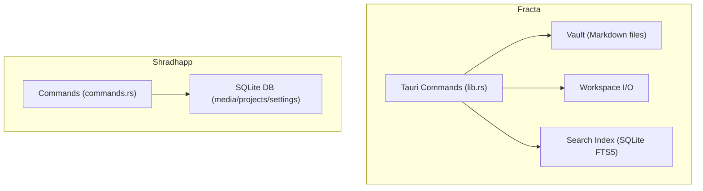
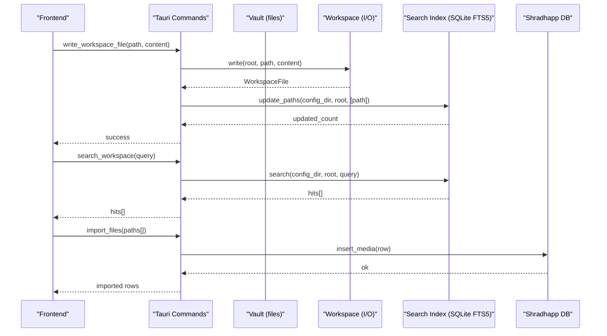
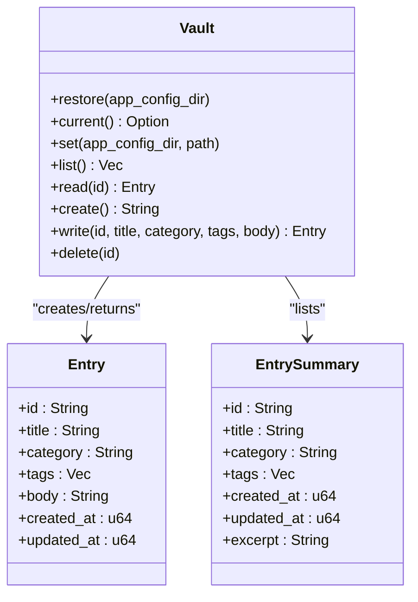
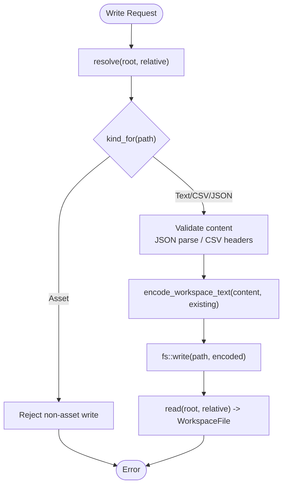
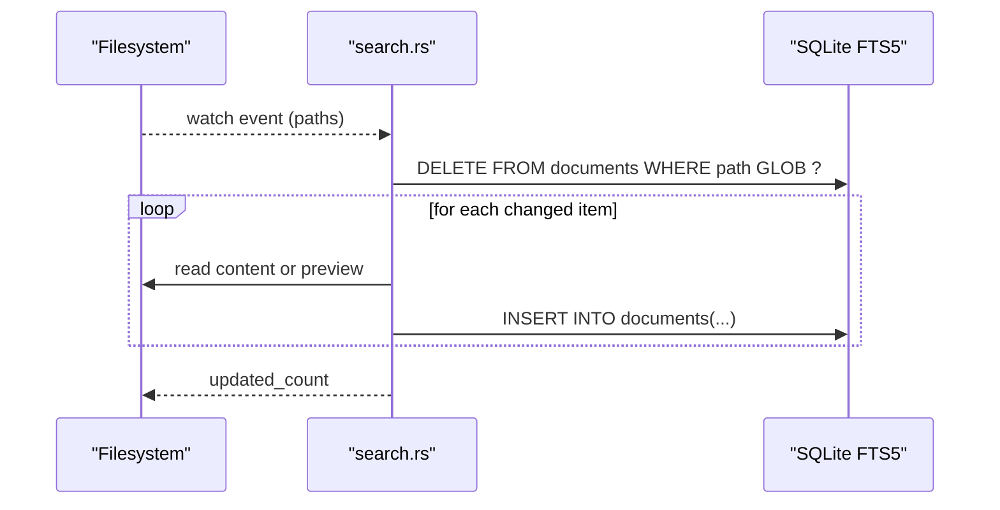
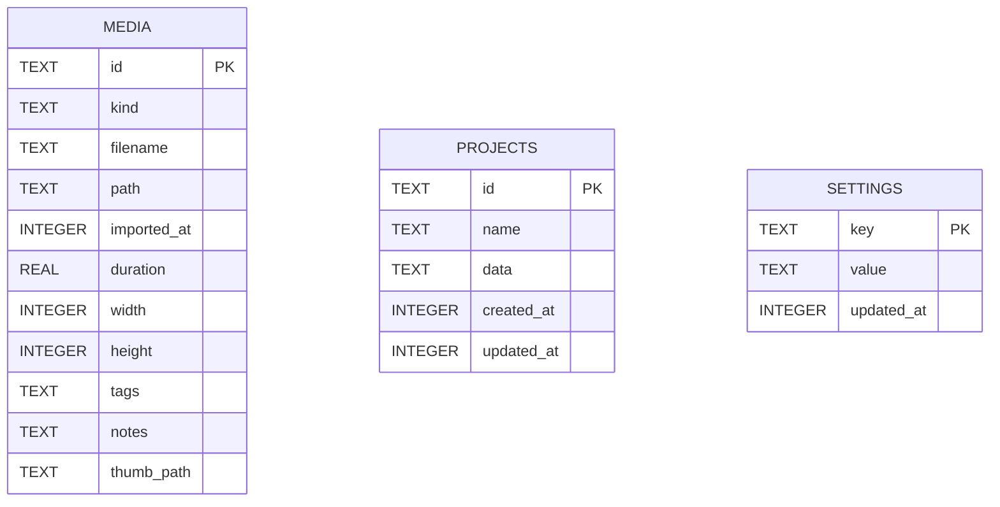
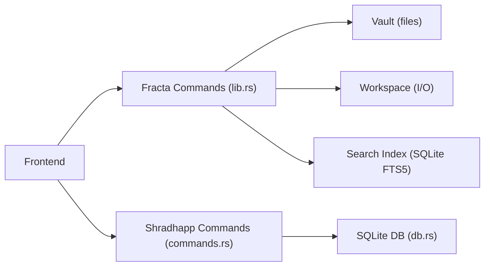
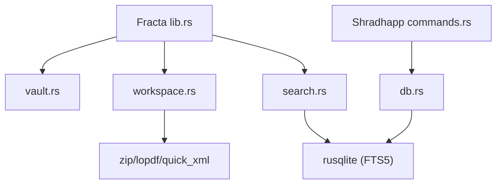

<cite>
**Referenced Files in This Document**
- `apps/shradhapp/src-tauri/src/db.rs`
- `apps/shradhapp/src-tauri/src/commands.rs`
- `apps/fracta/src-tauri/src/vault.rs`
- `apps/fracta/src-tauri/src/workspace.rs`
- `apps/fracta/src-tauri/src/search.rs`
- `apps/fracta/src-tauri/src/lib.rs`
- `apps/fracta/src-tauri/Cargo.toml`
- `apps/shradhapp/src-tauri/Cargo.toml`
</cite>

## Table of Contents
1. Introduction
2. Project Structure
3. Core Components
4. Architecture Overview
5. Detailed Component Analysis
6. Dependency Analysis
7. Performance Considerations
8. Troubleshooting Guide
9. Conclusion

## Introduction
This document explains the data persistence layer built with SQLite and on-disk file storage across two Tauri applications:
- Fracta: a note-taking and workspace app using an on-disk vault of Markdown files, a search index backed by SQLite FTS5, and strict path containment for safe workspace operations.
- Shradhapp: a media-centric app storing media metadata, projects, and settings in SQLite, with thumbnails and assets stored alongside the database under the app-data directory.

The documentation covers schema design, connection management, query patterns, CRUD operations, transactions, migration strategies, backup/restore, integrity checks, and performance tuning for large datasets.

## Project Structure
At a high level:
- Fracta uses:
  - On-disk vault for notes (Markdown files).
  - SQLite FTS5 index for fast search, persisted under the app config directory.
  - Workspace utilities to safely read/write files within a chosen root.
- Shradhapp uses:
  - A single SQLite database for media, projects, and settings.
  - Filesystem storage for media and thumbnails under app-data directories.

**Diagram sources**
- `apps/fracta/src-tauri/src/lib.rs`
- `apps/fracta/src-tauri/src/vault.rs`
- `apps/fracta/src-tauri/src/workspace.rs`
- `apps/fracta/src-tauri/src/search.rs`
- `apps/shradhapp/src-tauri/src/commands.rs`
- `apps/shradhapp/src-tauri/src/db.rs`

**Section sources**
- `apps/fracta/src-tauri/src/lib.rs`
- `apps/shradhapp/src-tauri/src/commands.rs`

## Core Components
- Fracta Vault: Manages a user-selected folder of .md entries with frontmatter metadata, safe id-to-path resolution, and basic CRUD operations.
- Fracta Workspace: Provides path-safe recursive filesystem operations, encoding preservation, CSV/JSON validation, and preview extraction for PDF/DOCX.
- Fracta Search: Maintains a per-vault SQLite FTS5 index for full-text search with incremental updates and rebuilds.
- Shradhapp Database: Encapsulates SQLite schema and CRUD for media, projects, and settings; used via typed Tauri commands.

Key responsibilities:
- Connection management: Single Connection instances per Db instance; WAL mode enabled for concurrency.
- Query optimization: Prepared statements, parameterized queries, FTS5 BM25 ranking, targeted updates.
- Safety: Path containment, symlink checks, extension allowlists, size limits for inline assets.

**Section sources**
- `apps/fracta/src-tauri/src/vault.rs`
- `apps/fracta/src-tauri/src/workspace.rs`
- `apps/fracta/src-tauri/src/search.rs`
- `apps/shradhapp/src-tauri/src/db.rs`

## Architecture Overview
The persistence architecture separates concerns between file-based content and structured metadata:
- Notes live as Markdown files with frontmatter; indexes are derived state stored separately.
- Media metadata is relational; binary assets remain on disk with references in the DB.

**Diagram sources**
- `apps/fracta/src-tauri/src/lib.rs`
- `apps/fracta/src-tauri/src/workspace.rs`
- `apps/fracta/src-tauri/src/search.rs`
- `apps/shradhapp/src-tauri/src/commands.rs`
- `apps/shradhapp/src-tauri/src/db.rs`

## Detailed Component Analysis

### Fracta Vault: Note Storage
Responsibilities:
- Manage a vault directory and persist its location in a small config file.
- Provide safe id-to-path mapping that prevents traversal attacks.
- Create, read, update, delete entries with frontmatter timestamps and titles.

Data model highlights:
- Entry fields include id, title, category, tags, body, created_at, updated_at.
- EntrySummary excludes body for efficient listing.

Safety and UX:
- Ids validated to prevent path traversal or invalid characters.
- Titles auto-derived from body when blank; explicit titles override derivation.
- Deletion attempts OS trash first, then hard delete fallback.

**Diagram sources**
- `apps/fracta/src-tauri/src/vault.rs`

**Section sources**
- `apps/fracta/src-tauri/src/vault.rs`

### Fracta Workspace: Safe File Operations
Responsibilities:
- Enumerate workspace contents recursively with ignore rules.
- Read/write text files preserving encoding and newline conventions.
- Validate CSV and JSON writes; extract previews for PDF and DOCX.
- Enforce path containment and size limits for inline assets.

Key behaviors:
- resolve() ensures paths stay within the selected root and rejects symlinks outside it.
- write() validates content types and preserves original encoding.
- media_asset() enforces allowed extensions and maximum sizes.

**Diagram sources**
- `apps/fracta/src-tauri/src/workspace.rs`

**Section sources**
- `apps/fracta/src-tauri/src/workspace.rs`

### Fracta Search: SQLite FTS5 Index
Responsibilities:
- Maintain a per-vault FTS5 virtual table for fast full-text search.
- Rebuild index over the entire workspace or incrementally update affected paths.
- Rank results using BM25 and return snippets.

Index lifecycle:
- open() creates a hashed filename based on canonical vault path; schema check allows upgrades.
- rebuild() clears documents and re-indexes all items.
- update_paths() deletes stale records and re-indexes changed files/dirs.

Query pattern:
- Uses FTS5 MATCH with tokenized terms and snippet generation.

**Diagram sources**
- `apps/fracta/src-tauri/src/search.rs`

**Section sources**
- `apps/fracta/src-tauri/src/search.rs`

### Shradhapp Database: Media, Projects, Settings
Responsibilities:
- Store media metadata, project definitions, and application settings in SQLite.
- Provide typed CRUD methods for each entity.
- Use WAL journaling for better concurrency and durability.

Schema overview:
- media: id, kind, filename, path, imported_at, duration, width, height, tags (JSON), notes, thumb_path.
- projects: id, name, data (versioned JSON), created_at, updated_at.
- settings: key (PK), value (JSON), updated_at.

CRUD examples:
- Insert media, list, get by id, rename, set tags/notes, delete.
- Upsert project with conflict handling; get/delete project.
- Get/upsert setting with timestamp tracking.

**Diagram sources**
- `apps/shradhapp/src-tauri/src/db.rs`

**Section sources**
- `apps/shradhapp/src-tauri/src/db.rs`

### Tauri Command Integration
- Fracta exposes commands for vault status, entry CRUD, workspace operations, search, and terminal execution. It manages a global workspace watcher to keep the search index fresh on changes.
- Shradhapp exposes commands for settings, media import, audio processing, and project management, all delegating to the Db abstraction.

**Diagram sources**
- `apps/fracta/src-tauri/src/lib.rs`
- `apps/shradhapp/src-tauri/src/commands.rs`

**Section sources**
- `apps/fracta/src-tauri/src/lib.rs`
- `apps/shradhapp/src-tauri/src/commands.rs`

## Dependency Analysis
External dependencies relevant to persistence:
- rusqlite with bundled feature for both apps.
- serde_json for serializing arrays and JSON blobs.
- notify for filesystem watching (Fracta).
- zip/lopdf/quick_xml for DOCX/PDF preview (Fracta).

**Diagram sources**
- `apps/fracta/src-tauri/src/lib.rs`
- `apps/fracta/src-tauri/src/vault.rs`
- `apps/fracta/src-tauri/src/workspace.rs`
- `apps/fracta/src-tauri/src/search.rs`
- `apps/shradhapp/src-tauri/src/commands.rs`
- `apps/shradhapp/src-tauri/src/db.rs`
- `apps/fracta/src-tauri/Cargo.toml`
- `apps/shradhapp/src-tauri/Cargo.toml`

**Section sources**
- `apps/fracta/src-tauri/Cargo.toml`
- `apps/shradhapp/src-tauri/Cargo.toml`

## Performance Considerations
- WAL mode: Enabled in Shradhapp’s Db::open for concurrent reads/writes without blocking.
- Prepared statements: Used throughout for repeated queries (e.g., list_media, upsert_project).
- FTS5 indexing: Full-text search leverages BM25 scoring and snippet generation; incremental updates avoid full rebuilds unless necessary.
- Listing efficiency: EntrySummary excludes bodies; sorting by updated_at keeps recent items first.
- Asset size limits: Inline media capped at 256 MB to prevent memory pressure.
- Encoding preservation: Avoids unnecessary conversions; only supported encodings are written back.

Recommendations:
- For very large vaults, prefer incremental updates and consider batching rebuilds during off-hours.
- Use targeted queries and limit result sets where possible (e.g., LIMIT 50 in search).
- Monitor SQLite PRAGMAs if needed (e.g., cache_size, mmap_size) based on workload.

[No sources needed since this section provides general guidance]

## Troubleshooting Guide
Common issues and resolutions:
- No vault configured: Ensure a vault path is set and persisted; restore() will ignore missing directories.
- Path traversal errors: Invalid ids containing separators or “..” are rejected; use simple stems.
- Symlink escapes: resolve() rejects paths escaping the workspace root; ensure links point inside the vault.
- Unsupported encodings: Non-UTF-8/UTF-16 files are read-only; convert to supported encodings before editing.
- FTS5 unavailable: If FTS5 initialization fails, the error propagates; verify SQLite build includes FTS5.
- Large media files: Inline media limited to 256 MB; open externally for larger files.

Operational tips:
- Rebuild search index when .fractaignore changes or after major renames/deletes.
- Verify settings roundtrip by reading and writing known keys.
- Check thumbnail generation failures and ffmpeg availability in Shradhapp runtime info.

**Section sources**
- `apps/fracta/src-tauri/src/vault.rs`
- `apps/fracta/src-tauri/src/workspace.rs`
- `apps/fracta/src-tauri/src/search.rs`
- `apps/shradhapp/src-tauri/src/commands.rs`
- `apps/shradhapp/src-tauri/src/db.rs`

## Conclusion
The persistence layer combines robust file-based storage with SQLite-backed metadata and search:
- Fracta’s vault and workspace provide secure, predictable access to Markdown content and related assets, while FTS5 enables fast, incremental search.
- Shradhapp centralizes media and project metadata in a well-structured SQLite schema with clear CRUD boundaries and safe defaults.
Together, they deliver reliable, performant, and maintainable data persistence suitable for large datasets and complex workflows.

[No sources needed since this section summarizes without analyzing specific files]