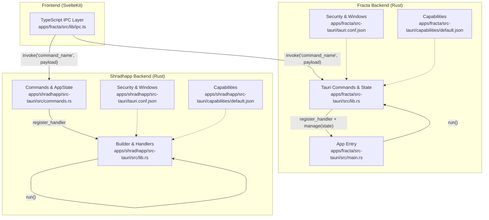
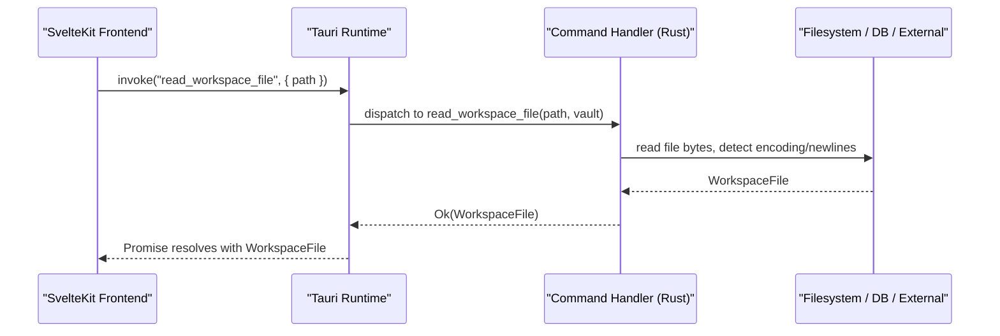
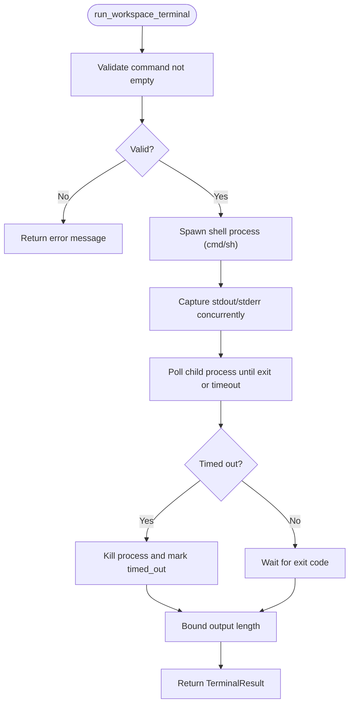
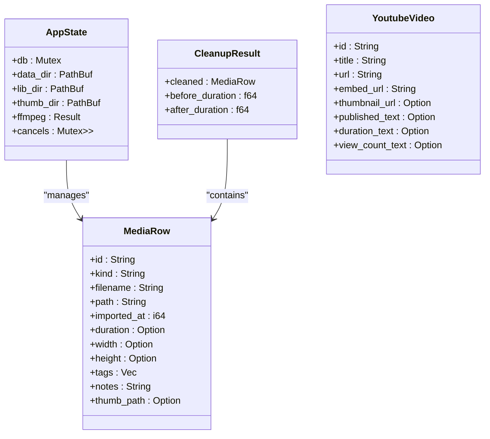
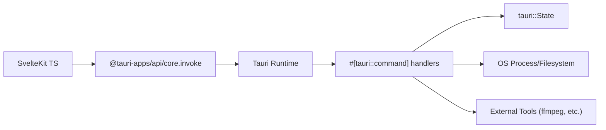

<cite>
**Referenced Files in This Document**
- `apps/fracta/src/lib/ipc.ts`
- `apps/fracta/src-tauri/src/lib.rs`
- `apps/fracta/src-tauri/src/main.rs`
- `apps/fracta/src-tauri/tauri.conf.json`
- `apps/fracta/src-tauri/capabilities/default.json`
- `apps/shradhapp/src-tauri/src/commands.rs`
- `apps/shradhapp/src-tauri/src/lib.rs`
- `apps/shradhapp/src-tauri/tauri.conf.json`
- `apps/shradhapp/src-tauri/capabilities/default.json`
</cite>

## Table of Contents
1. [Introduction](#introduction)
2. [Project Structure](#project-structure)
3. [Core Components](#core-components)
4. [Architecture Overview](#architecture-overview)
5. [Detailed Component Analysis](#detailed-component-analysis)
6. [Dependency Analysis](#dependency-analysis)
7. [Performance Considerations](#performance-considerations)
8. [Troubleshooting Guide](#troubleshooting-guide)
9. [Conclusion](#conclusion)

## Introduction
This document explains the Tauri command system architecture used by the SvelteKit frontends and Rust backends in this repository. It covers how commands are defined and registered in Rust, how they are invoked from TypeScript via Tauri’s invoke API, parameter validation patterns, return types, error handling strategies, and async execution models. It also provides concrete examples for file system operations, database queries, and background task management, along with security considerations, permission models, and debugging techniques.

## Project Structure
Two Tauri applications demonstrate the command system:
- Fracta: A vault/workspace editor with rich file operations, search indexing, and a local GGUF engine.
- Shradhapp: A media bank and video editor backend exposing commands for media import, project management, audio processing, and YouTube metadata retrieval.

**Diagram sources**
- `apps/fracta/src/lib/ipc.ts#L1-L237`
- `apps/fracta/src-tauri/src/lib.rs#L1-L498`
- `apps/fracta/src-tauri/src/main.rs#L1-L7`
- `apps/fracta/src-tauri/tauri.conf.json#L1-L48`
- `apps/fracta/src-tauri/capabilities/default.json#L1-L15`
- `apps/shradhapp/src-tauri/src/commands.rs#L1-L800`
- `apps/shradhapp/src-tauri/src/lib.rs#L1-L67`
- `apps/shradhapp/src-tauri/tauri.conf.json#L1-L44`
- `apps/shradhapp/src-tauri/capabilities/default.json#L1-L18`

**Section sources**
- `apps/fracta/src/lib/ipc.ts#L1-L237`
- `apps/fracta/src-tauri/src/lib.rs#L1-L498`
- `apps/shradhapp/src-tauri/src/commands.rs#L1-L800`
- `apps/shradhapp/src-tauri/src/lib.rs#L1-L67`

## Core Components
- Frontend IPC layer (TypeScript):
  - Centralized functions that call Tauri’s invoke with typed payloads and return strongly typed results.
  - Examples include workspace listing, file read/write, terminal execution, search, and GGUF engine control.
- Backend command handlers (Rust):
  - Functions annotated with #[tauri::command] exposed to the frontend.
  - Use tauri::State for shared app state (e.g., Vault, AutoTag, GgufEngine, AppState).
  - Return Result<T, String> or custom result wrappers for consistent error propagation.
- App builder and registration:
  - Builder manages plugins, state, setup hooks, and registers all commands via generate_handler! macro.
- Configuration and capabilities:
  - CSP and asset protocol settings define runtime security.
  - Capabilities declare allowed core/window/dialog permissions per window.

Key responsibilities:
- Parameter validation occurs at command boundaries (type coercion, empty checks, sanitization).
- Error handling uses Result types and descriptive messages; some commands wrap errors in domain-specific result types.
- Async execution is achieved using spawn_blocking for CPU/network-bound work and event emission for filesystem watchers.

**Section sources**
- `apps/fracta/src/lib/ipc.ts#L1-L237`
- `apps/fracta/src-tauri/src/lib.rs#L1-L498`
- `apps/shradhapp/src-tauri/src/commands.rs#L1-L800`
- `apps/shradhapp/src-tauri/src/lib.rs#L1-L67`

## Architecture Overview
The command flow follows a strict separation:
- SvelteKit calls invoke with a command name and JSON-serializable arguments.
- Tauri routes the call to the corresponding #[tauri::command] function.
- The handler validates inputs, accesses shared state, performs I/O or computation, and returns a Result.
- Errors are propagated as strings or domain-specific error types; success values are serialized back to the frontend.

**Diagram sources**
- `apps/fracta/src/lib/ipc.ts#L149-L150`
- `apps/fracta/src-tauri/src/lib.rs#L105-L108`

## Detailed Component Analysis

### Fracta: Workspace and Vault Commands
- Command definitions:
  - Vault status, pick vault, CRUD entries, recursive workspace operations, terminal execution, print dialog, preview documents, link/graph analysis, search index rebuild, CSV/JSON conversion, auto-tag rules, clipboard source detection, and GGUF engine lifecycle.
- Parameter validation:
  - Empty command guard for terminal execution; path normalization handled by workspace utilities; optional delimiter inference for CSV/JSON converters.
- Return types:
  - Strongly typed structs (WorkspaceFile, TerminalResult, LinkReport, GraphReport, CsvConversion, GgufStatus) mapped to frontend interfaces.
- Error handling:
  - Consistent use of Result<T, String> or domain-specific result wrappers; descriptive error messages for IO, process spawning, and timeouts.
- Async execution:
  - File watcher events emitted asynchronously; GGUF load runs on a blocking thread via spawn_blocking; terminal execution bounded by timeout and output size limits.

**Diagram sources**
- `apps/fracta/src-tauri/src/lib.rs#L170-L267`

**Section sources**
- `apps/fracta/src-tauri/src/lib.rs#L42-L498`
- `apps/fracta/src/lib/ipc.ts#L32-L237`

### Shradhapp: Media, Projects, and Background Tasks
- Command definitions:
  - Settings management, runtime info, media import/rename/tags/notes/delete, voiceover recording save, audio cleanup/tick repair, projects CRUD, export/cancel exports, YouTube channel videos list.
- Parameter validation:
  - Name sanitization, extension classification, base64 decoding with corruption checks, non-empty recording validation, tag normalization.
- Return types:
  - Structs like MediaRow, CleanupResult, YoutubeVideo, AppSettings, RuntimeInfo ensure strong typing across the IPC boundary.
- Error handling:
  - All commands return Result<T, String>; failures aggregate multiple errors where appropriate (e.g., batch imports).
- Async execution:
  - Network-bound YouTube fetch runs via spawn_blocking to avoid blocking the async runtime; cancellations managed through AtomicBool flags stored in AppState.

**Diagram sources**
- `apps/shradhapp/src-tauri/src/commands.rs#L21-L34`
- `apps/shradhapp/src-tauri/src/commands.rs#L277-L321`
- `apps/shradhapp/src-tauri/src/commands.rs#L694-L743`
- `apps/shradhapp/src-tauri/src/commands.rs#L327-L337`

**Section sources**
- `apps/shradhapp/src-tauri/src/commands.rs#L1-L800`
- `apps/shradhapp/src-tauri/src/lib.rs#L1-L67`

### Conceptual Overview
- Command invocation pattern:
  - Frontend defines typed functions wrapping invoke with command names and payloads.
  - Backend exposes #[tauri::command] functions returning Result<T, E>.
  - Shared state is injected via tauri::State and initialized in setup.
- Security model:
  - CSP restricts script/style/image/connect sources.
  - Asset protocol scoping limits access to $APPDATA/** where enabled.
  - Capabilities whitelist specific core APIs per window.

[No sources needed since this section doesn't analyze specific files]

## Dependency Analysis
- Frontend dependencies:
  - @tauri-apps/api/core invoke function is the sole bridge to backend commands.
- Backend dependencies:
  - Tauri runtime for command dispatch, state management, and plugin initialization.
  - OS-specific process spawning and file watching libraries.
  - Optional external tools (e.g., ffmpeg) located at runtime.

**Diagram sources**
- `apps/fracta/src/lib/ipc.ts#L1-L10`
- `apps/fracta/src-tauri/src/lib.rs#L431-L498`
- `apps/shradhapp/src-tauri/src/lib.rs#L11-L66`

**Section sources**
- `apps/fracta/src/lib/ipc.ts#L1-L237`
- `apps/fracta/src-tauri/src/lib.rs#L1-L498`
- `apps/shradhapp/src-tauri/src/lib.rs#L1-L67`

## Performance Considerations
- Asynchronous execution:
  - Use spawn_blocking for CPU-intensive tasks (GGUF loading, network requests) to keep the async runtime responsive.
- Output bounding:
  - Terminal output is truncated to prevent memory spikes; timeouts prevent runaway processes.
- Event-driven updates:
  - File watchers emit change events; frontend re-lists data rather than relying solely on events for consistency.
- Resource management:
  - Library directories and thumbnails are created lazily; ffmpeg availability is probed once and cached.

[No sources needed since this section provides general guidance]

## Troubleshooting Guide
- Debugging command execution:
  - Ensure devtools are configured appropriately in tauri.conf.json during development.
  - Inspect console logs in the webview and backend stderr for error messages returned by commands.
- Permission issues:
  - Verify capabilities allow required core APIs (window, dialog, event, webview).
  - Confirm CSP allows necessary connect-src endpoints (IPC, localhost, https).
- Common errors:
  - Empty command input leads to explicit error messages.
  - Base64 decoding failures indicate corrupted payloads.
  - Missing external tools (ffmpeg) produce warnings and fallback behavior.

**Section sources**
- `apps/fracta/src-tauri/tauri.conf.json#L32-L34`
- `apps/fracta/src-tauri/capabilities/default.json#L1-L15`
- `apps/shradhapp/src-tauri/tauri.conf.json#L31-L36`
- `apps/shradhapp/src-tauri/capabilities/default.json#L1-L18`
- `apps/shradhapp/src-tauri/src/commands.rs#L658-L692`
- `apps/fracta/src-tauri/src/lib.rs#L170-L178`

## Conclusion
The Tauri command system in this repository provides a robust, type-safe bridge between SvelteKit frontends and Rust backends. Commands are clearly defined, validated, and executed with strong error handling and asynchronous patterns. Security is enforced via CSP, asset protocol scoping, and capability whitelisting. The two applications demonstrate practical patterns for file system operations, database interactions, and background task management, offering a solid foundation for building secure and performant desktop apps.