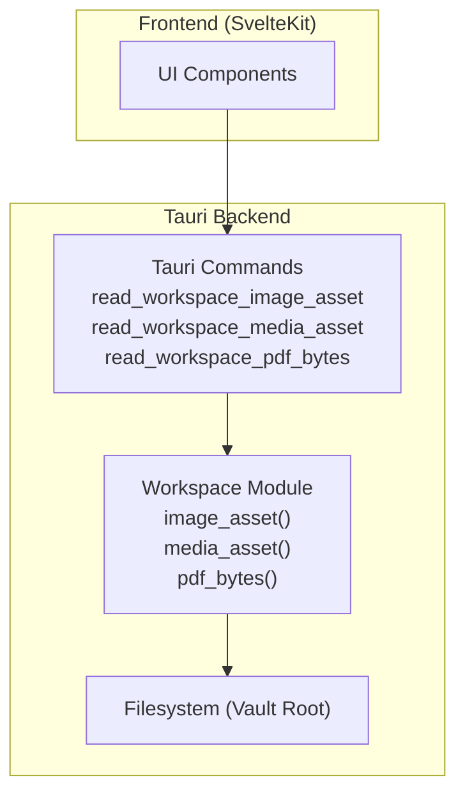
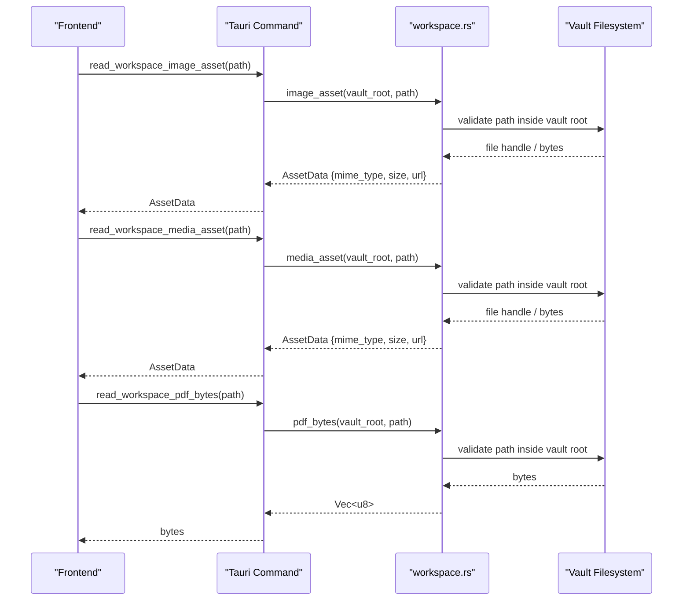
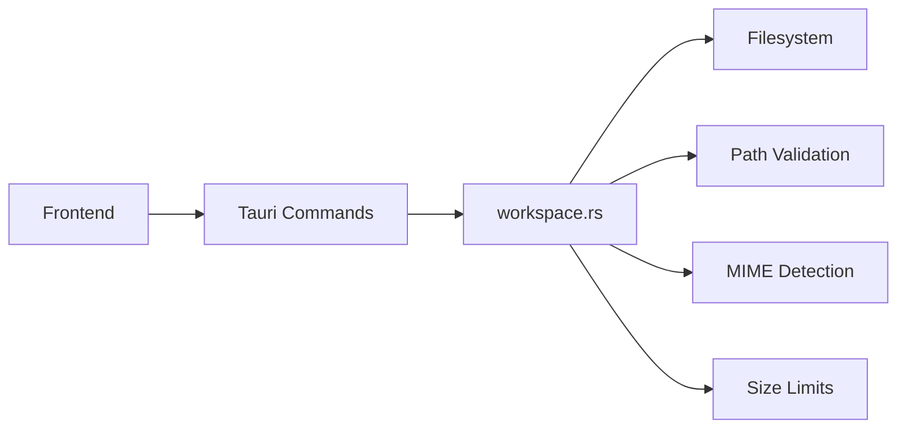

<cite>
**Referenced Files in This Document**
- [lib.rs](../../apps/fracta/src-tauri/src/lib.rs)
- [workspace.rs](../../apps/fracta/src-tauri/src/workspace.rs)
</cite>

## Table of Contents
1. [Introduction](#introduction)
2. [Project Structure](#project-structure)
3. [Core Components](#core-components)
4. [Architecture Overview](#architecture-overview)
5. [Detailed Component Analysis](#detailed-component-analysis)
6. [Dependency Analysis](#dependency-analysis)
7. [Performance Considerations](#performance-considerations)
8. [Troubleshooting Guide](#troubleshooting-guide)
9. [Conclusion](#conclusion)

## Introduction
This document explains how Fracta handles assets for preview and rendering within the workspace. It covers:
- PDF rendering via raw bytes
- Image assets (PNG, JPEG, GIF, WebP, SVG)
- Media files (audio/video)
- The AssetData structure used to deliver asset metadata and content
- MIME type detection and size limitations
- Inline rendering patterns and object URL generation
- Secure access patterns including vault containment and extension whitelisting
- Performance optimization strategies for large media and caching approaches

## Project Structure
Asset handling is implemented in the Tauri backend and exposed to the SvelteKit frontend through commands. The key Rust modules are:
- lib.rs: Declares Tauri commands that expose asset reading operations to the UI
- workspace.rs: Implements the actual logic for reading images, media, PDFs, and extracting embedded images from DOCX archives

**Diagram sources**
- [lib.rs:105-132](../../apps/fracta/src-tauri/src/lib.rs#L105-L132)
- [workspace.rs](../../apps/fracta/src-tauri/src/workspace.rs)

**Section sources**
- [lib.rs:105-132](../../apps/fracta/src-tauri/src/lib.rs#L105-L132)

## Core Components
- read_workspace_image_asset(path): Returns an AssetData object for image files located under the vault root.
- read_workspace_media_asset(path): Returns an AssetData object for audio/video files located under the vault root.
- read_workspace_pdf_bytes(path): Returns raw bytes for PDF files located under the vault root.
- AssetData: A structured response containing at least:
  - mime_type: Detected MIME type string
  - size: File size in bytes
  - url: A safe URL or data URI suitable for inline rendering
- pdf_bytes: Raw byte payload for direct PDF rendering in a viewer or iframe

These commands ensure assets are served only from the configured vault root and return typed responses for predictable client-side handling.

**Section sources**
- [lib.rs:115-132](../../apps/fracta/src-tauri/src/lib.rs#L115-L132)

## Architecture Overview
The asset pipeline enforces secure, controlled access to files while providing efficient delivery formats for different asset types.

**Diagram sources**
- [lib.rs:115-132](../../apps/fracta/src-tauri/src/lib.rs#L115-L132)
- [workspace.rs](../../apps/fracta/src-tauri/src/workspace.rs)

## Detailed Component Analysis

### AssetData Structure
AssetData encapsulates the minimal metadata required by the UI to render assets safely and efficiently:
- mime_type: String indicating the detected MIME type (e.g., image/png, video/mp4, application/pdf)
- size: Number representing file size in bytes
- url: A safe URL or data URI suitable for inline rendering; may be a blob URL, object URL, or data URI depending on asset size and type

This structure standardizes how the frontend consumes assets regardless of source (images, media, or PDF bytes).

**Section sources**
- [lib.rs:115-132](../../apps/fracta/src-tauri/src/lib.rs#L115-L132)

### MIME Type Detection
MIME type detection is performed server-side before returning AssetData. The process typically involves:
- Inspecting file extension to infer MIME type
- Optionally validating with magic bytes for robustness
- Normalizing MIME strings for consistent client behavior

This ensures the UI can select appropriate renderers (img, video, audio, or PDF viewers) based on the returned mime_type.

**Section sources**
- [workspace.rs](../../apps/fracta/src-tauri/src/workspace.rs)

### Size Limitations
Size limits protect against memory pressure and slow rendering:
- Small images may be converted to data URIs for inline rendering
- Larger images/media should use object URLs or streaming to avoid loading entire payloads into memory
- PDF bytes are returned directly; clients should stream or paginate when possible

Clients should implement checks using AssetData.size to decide between inline vs. streamed rendering.

**Section sources**
- [lib.rs:115-132](../../apps/fracta/src-tauri/src/lib.rs#L115-L132)

### Inline Asset Rendering
Inline rendering is ideal for small assets:
- Images: Convert to base64 data URIs for 
- Audio/Video: For very small files, consider data URIs; otherwise prefer object URLs
- PDFs: Render bytes directly in a PDF viewer component

Use AssetData.url to determine if a data URI is provided or if you need to generate one.

**Section sources**
- [lib.rs:115-132](../../apps/fracta/src-tauri/src/lib.rs#L115-L132)

### Object URL Generation
For larger assets, generate object URLs to avoid bloating memory:
- Create a Blob from the asset bytes
- Generate a URL via URL.createObjectURL(blob)
- Revoke the URL when no longer needed to free memory

This approach is recommended for images and media files exceeding a threshold size.

**Section sources**
- [lib.rs:115-132](../../apps/fracta/src-tauri/src/lib.rs#L115-L132)

### Secure Asset Access Patterns
Security is enforced through:
- Vault containment: All paths must resolve within the configured vault root
- Extension whitelisting: Only allowed extensions are processed (e.g., png, jpg, gif, webp, svg, mp4, mp3, pdf)
- Path validation: Reject traversal attempts (..), absolute paths, and invalid characters

These measures prevent unauthorized file access and mitigate injection risks.

**Section sources**
- [workspace.rs](../../apps/fracta/src-tauri/src/workspace.rs)

### PDF Rendering
PDF support is provided via raw bytes:
- Use read_workspace_pdf_bytes to fetch bytes
- Render in a PDF viewer component or iframe
- Consider pagination or lazy loading for large documents

This avoids embedding entire PDFs as data URIs and improves performance.

**Section sources**
- [lib.rs:111-113](../../apps/fracta/src-tauri/src/lib.rs#L111-L113)

### Image Assets (PNG, JPEG, GIF, WebP, SVG)
Image handling includes:
- MIME detection for supported formats
- Size-based decisions for inline vs. object URL rendering
- Safe path resolution within vault root

Clients can display images using  tags with either data URIs or object URLs.

**Section sources**
- [lib.rs:115-118](../../apps/fracta/src-tauri/src/lib.rs#L115-L118)

### Media Files (Audio/Video)
Media handling supports:
- MIME detection for audio/video formats
- Streaming-friendly object URLs for large files
- Appropriate HTML elements (<audio>, <video>) with controls

Clients should implement buffering and error handling for network-like scenarios even with local assets.

**Section sources**
- [lib.rs:120-123](../../apps/fracta/src-tauri/src/lib.rs#L120-L123)

## Dependency Analysis
The asset handling system has clear dependencies:
- Frontend depends on Tauri commands for secure asset access
- Tauri commands depend on workspace module for file operations
- Workspace module depends on filesystem with strict path validation

**Diagram sources**
- [lib.rs:115-132](../../apps/fracta/src-tauri/src/lib.rs#L115-L132)
- [workspace.rs](../../apps/fracta/src-tauri/src/workspace.rs)

**Section sources**
- [lib.rs:115-132](../../apps/fracta/src-tauri/src/lib.rs#L115-L132)

## Performance Considerations
Optimization strategies for large media files:
- Use object URLs instead of data URIs for files > 1MB
- Implement lazy loading for images and media
- Cache object URLs in memory to avoid recreation
- Stream PDF content when possible
- Debounce rapid asset requests
- Use request cancellation for abandoned previews

Caching strategies:
- Client-side cache for recently accessed assets
- In-memory cache for object URLs
- Browser cache headers for static assets
- LRU eviction for large caches

Memory management:
- Revoke object URLs when assets are no longer needed
- Monitor memory usage for large PDFs
- Implement graceful degradation for low-memory scenarios

## Troubleshooting Guide
Common issues and solutions:
- Invalid path errors: Ensure paths are relative to vault root and don't contain traversal sequences
- MIME type mismatches: Verify file extensions match actual content
- Memory issues: Switch from data URIs to object URLs for large files
- CORS/security errors: Use Tauri commands instead of direct file access
- Slow rendering: Implement lazy loading and caching

Debugging steps:
- Check AssetData.mime_type and AssetData.size values
- Verify file existence in vault root
- Test with smaller files first
- Monitor browser memory usage during asset loading

**Section sources**
- [lib.rs:115-132](../../apps/fracta/src-tauri/src/lib.rs#L115-L132)

## Conclusion
Fracta's asset handling provides a secure, efficient foundation for rendering images, media, and PDFs within the workspace. The AssetData structure standardizes asset delivery, while vault containment and extension whitelisting ensure security. Performance optimizations like object URLs and caching strategies enable smooth handling of large media files. By following the patterns outlined in this document, developers can build robust asset-rich applications within Fracta's secure environment.
