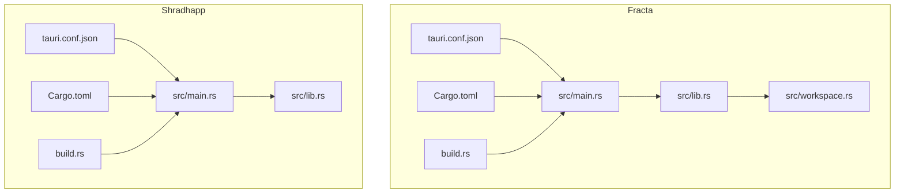
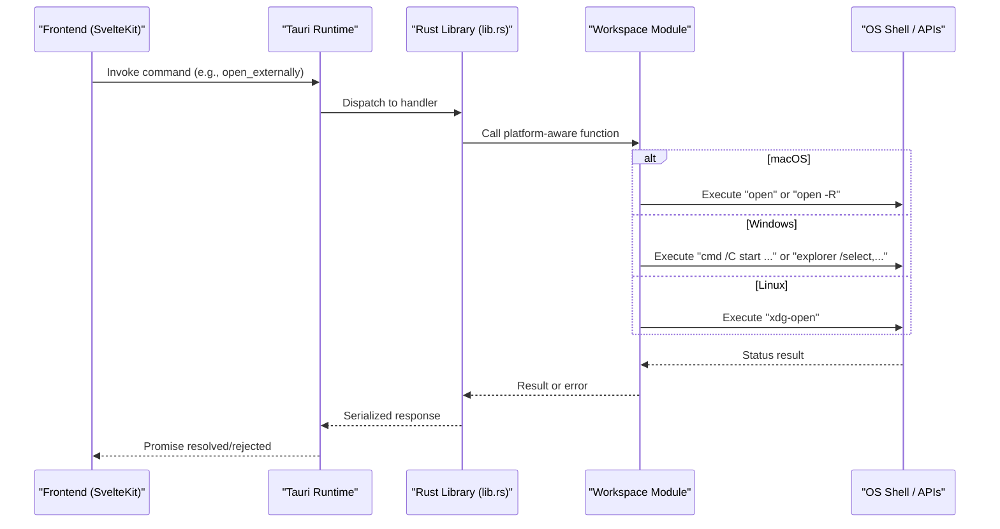
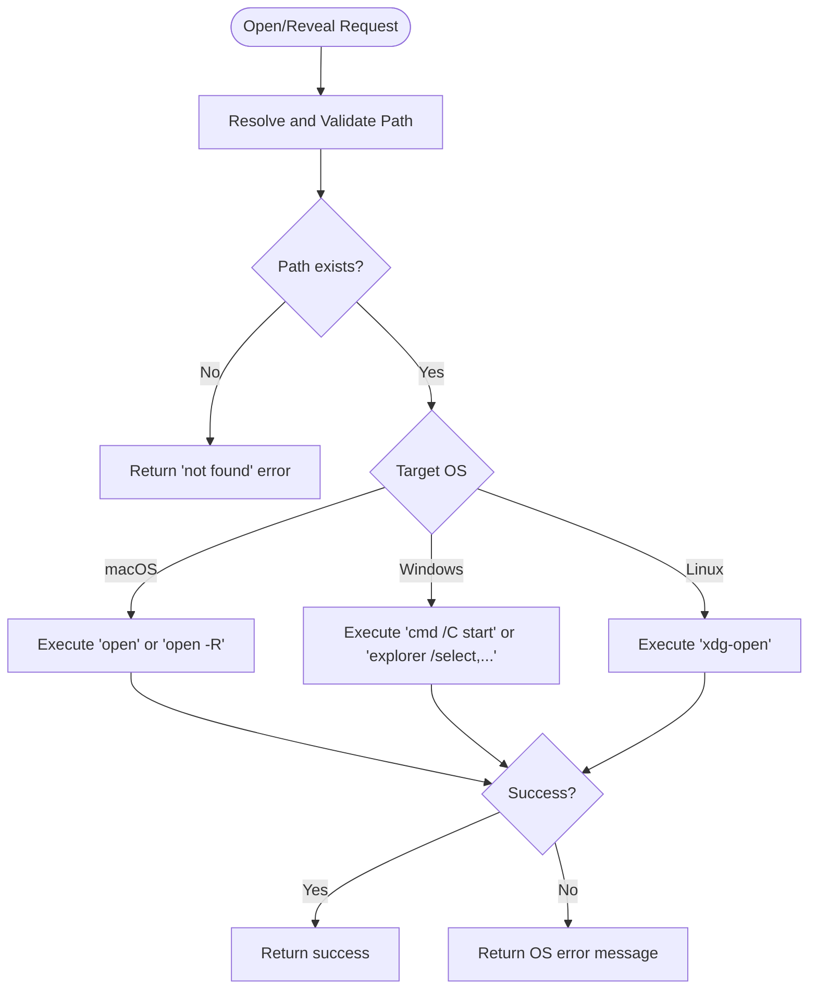
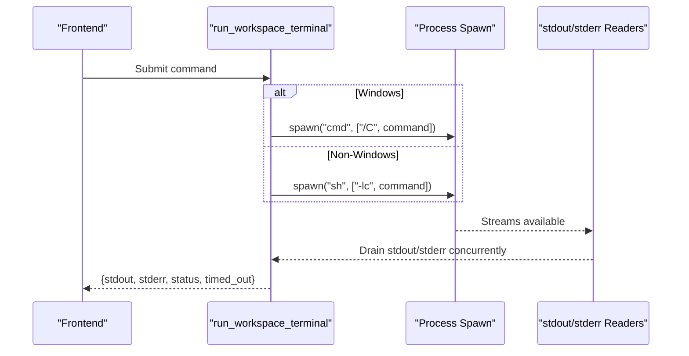
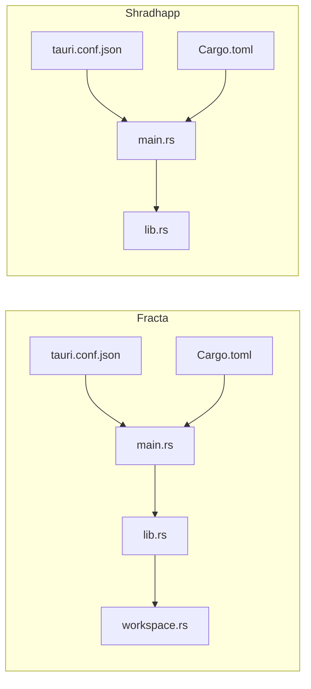

<cite>
**Referenced Files in This Document**
- `apps/fracta/src-tauri/tauri.conf.json`
- `apps/shradhapp/src-tauri/tauri.conf.json`
- `apps/fracta/src-tauri/Cargo.toml`
- `apps/shradhapp/src-tauri/Cargo.toml`
- `apps/fracta/src-tauri/build.rs`
- `apps/shradhapp/src-tauri/build.rs`
- `apps/fracta/src-tauri/src/main.rs`
- `apps/shradhapp/src-tauri/src/main.rs`
- `apps/fracta/src-tauri/src/lib.rs`
- `apps/shradhapp/src-tauri/src/lib.rs`
- `apps/fracta/src-tauri/src/workspace.rs`
</cite>

## Table of Contents
1. [Introduction](#introduction)
2. [Project Structure](#project-structure)
3. [Core Components](#core-components)
4. [Architecture Overview](#architecture-overview)
5. [Detailed Component Analysis](#detailed-component-analysis)
6. [Dependency Analysis](#dependency-analysis)
7. [Performance Considerations](#performance-considerations)
8. [Troubleshooting Guide](#troubleshooting-guide)
9. [Conclusion](#conclusion)
10. [Appendices](#appendices)

## Introduction
This document explains how the Tauri applications in this monorepo achieve cross-platform compatibility across Windows, macOS, and Linux. It covers platform-specific code handling with Rust cfg attributes, conditional compilation via Cargo features, build configuration differences, file system path strategies, native API integration patterns, feature flags, graceful degradation, testing approaches, deployment considerations, and troubleshooting tips for platform-specific issues.

## Project Structure
Two Tauri apps are present:
- Fracta: A vault and workspace editor with rich file operations, search indexing, and local LLM support.
- Shradhapp: A personal video assembly app with media library management and FFmpeg-based processing.

Each app follows a consistent structure:
- Frontend built by SvelteKit (paths configured in tauri.conf.json).
- Rust backend under src-tauri with Cargo.toml, build.rs, and src files.
- Platform-specific behavior is implemented using Rust cfg(target_os = "...") and Cargo target-specific dependencies.

**Diagram sources**
- `apps/fracta/src-tauri/tauri.conf.json#L1-L48`
- `apps/shradhapp/src-tauri/tauri.conf.json#L1-L44`
- `apps/fracta/src-tauri/Cargo.toml#L1-L44`
- `apps/shradhapp/src-tauri/Cargo.toml#L1-L27`
- `apps/fracta/src-tauri/build.rs#L1-L4`
- `apps/shradhapp/src-tauri/build.rs#L1-L4`
- `apps/fracta/src-tauri/src/main.rs#L1-L7`
- `apps/shradhapp/src-tauri/src/main.rs#L1-L7`
- `apps/fracta/src-tauri/src/lib.rs#L1-L498`
- `apps/shradhapp/src-tauri/src/lib.rs#L1-L67`
- `apps/fracta/src-tauri/src/workspace.rs#L1-L800`

**Section sources**
- `apps/fracta/src-tauri/tauri.conf.json#L1-L48`
- `apps/shradhapp/src-tauri/tauri.conf.json#L1-L44`
- `apps/fracta/src-tauri/Cargo.toml#L1-L44`
- `apps/shradhapp/src-tauri/Cargo.toml#L1-L27`
- `apps/fracta/src-tauri/build.rs#L1-L4`
- `apps/shradhapp/src-tauri/build.rs#L1-L4`
- `apps/fracta/src-tauri/src/main.rs#L1-L7`
- `apps/shradhapp/src-tauri/src/main.rs#L1-L7`
- `apps/fracta/src-tauri/src/lib.rs#L1-L498`
- `apps/shradhapp/src-tauri/src/lib.rs#L1-L67`
- `apps/fracta/src-tauri/src/workspace.rs#L1-L800`

## Core Components
- Tauri configuration: Defines window settings, security policies, asset protocol scoping, and bundle targets per app.
- Rust entry points: Suppress console windows on Windows release builds; delegate to library run functions.
- Library initialization: Register plugins, manage state, set up directories, and expose commands to the frontend.
- Workspace operations: Centralized, safe filesystem access with vault containment, encoding preservation, and platform-specific shell invocations.

Key cross-platform techniques used:
- Conditional compilation with #[cfg(target_os = "...")] for OS-specific logic.
- Target-specific dependencies in Cargo.toml for platform-only crates.
- Feature flags for optional capabilities (e.g., asset protocol).
- Graceful fallbacks when platform features are unavailable.

**Section sources**
- `apps/fracta/src-tauri/tauri.conf.json#L1-L48`
- `apps/shradhapp/src-tauri/tauri.conf.json#L1-L44`
- `apps/fracta/src-tauri/Cargo.toml#L1-L44`
- `apps/shradhapp/src-tauri/Cargo.toml#L1-L27`
- `apps/fracta/src-tauri/src/main.rs#L1-L7`
- `apps/shradhapp/src-tauri/src/main.rs#L1-L7`
- `apps/fracta/src-tauri/src/lib.rs#L1-L498`
- `apps/shradhapp/src-tauri/src/lib.rs#L1-L67`
- `apps/fracta/src-tauri/src/workspace.rs#L1-L800`

## Architecture Overview
The runtime architecture separates UI (SvelteKit) from the native layer (Tauri + Rust). The frontend invokes Tauri commands that execute Rust functions. Platform-specific behaviors are encapsulated within Rust modules and invoked conditionally at compile time.

**Diagram sources**
- `apps/fracta/src-tauri/src/lib.rs#L454-L494`
- `apps/fracta/src-tauri/src/workspace.rs#L661-L682`

## Detailed Component Analysis

### Tauri Configuration and Security
- Fracta configures window properties, CSP, and bundle targets. Uses Overlay title bar and traffic light positioning for macOS.
- Shradhapp enables global Tauri and asset protocol scoped to $APPDATA/**, allowing secure access to user data paths.

Implications:
- Asset protocol scoping ensures only allowed directories are accessible from the webview.
- CSP restricts resource loading to trusted origins, improving security posture.

**Section sources**
- `apps/fracta/src-tauri/tauri.conf.json#L1-L48`
- `apps/shradhapp/src-tauri/tauri.conf.json#L1-L44`

### Rust Entry Points and Conditional Compilation
- Both apps suppress console windows on Windows release builds using cfg_attr.
- Entry points delegate to library run functions, enabling mobile entry point annotations where applicable.

Cross-platform benefits:
- Consistent behavior across platforms while hiding platform artifacts (console windows).
- Mobile-ready entry points allow future expansion without changing main logic.

**Section sources**
- `apps/fracta/src-tauri/src/main.rs#L1-L7`
- `apps/shradhapp/src-tauri/src/main.rs#L1-L7`

### Library Initialization and Plugin Management
- Fracta initializes window-state plugin conditionally for non-mobile platforms and manages Vault, AutoTag, and GGUF engine states.
- Shradhapp initializes dialog plugin, sets up data/library/thumbnail directories, opens SQLite DB, locates FFmpeg, and registers AppState.

Graceful degradation:
- If FFmpeg is not found, warnings are logged but the app continues; commands can fail gracefully with informative messages.

**Section sources**
- `apps/fracta/src-tauri/src/lib.rs#L431-L497`
- `apps/shradhapp/src-tauri/src/lib.rs#L10-L66`

### Workspace Operations and Path Handling
- All workspace operations go through a resolve function that enforces vault containment, prevents traversal, and validates symlinks.
- Text encoding is preserved (UTF-8, UTF-8 BOM, UTF-16LE/BE), and newline conventions are detected and retained.
- Media assets are validated by extension and size limits before being exposed to the webview.

Path strategy:
- Relative paths are normalized to forward slashes internally.
- Absolute or parent traversal attempts are rejected.
- Symlinked paths are canonicalized against the root to prevent escape.

**Section sources**
- `apps/fracta/src-tauri/src/workspace.rs#L143-L173`
- `apps/fracta/src-tauri/src/workspace.rs#L257-L285`
- `apps/fracta/src-tauri/src/workspace.rs#L300-L364`

### Platform-Specific Shell Invocations
- Reveal and open operations use OS-specific commands:
  - macOS: "open" and "open -R"
  - Windows: "cmd /C start" and "explorer /select,..."
  - Linux: "xdg-open"

Error handling:
- Commands return status codes; failures are converted into descriptive errors for the frontend.

**Diagram sources**
- `apps/fracta/src-tauri/src/workspace.rs#L638-L682`

**Section sources**
- `apps/fracta/src-tauri/src/workspace.rs#L638-L682`

### Terminal Command Execution Across Platforms
- On Windows, commands run via cmd with /C flag.
- On other platforms, sh -lc is used to execute commands.
- Output streams are drained concurrently, with bounded output size and timeout enforcement.

**Diagram sources**
- `apps/fracta/src-tauri/src/lib.rs#L193-L267`

**Section sources**
- `apps/fracta/src-tauri/src/lib.rs#L193-L267`

### Conditional Dependencies and Features
- Fracta includes window-state plugin only for non-mobile platforms.
- macOS-specific dependencies (objc2, foundation, app-kit) are gated by target_os = "macos".
- Shradhapp enables protocol-asset feature for Tauri to allow asset protocol usage.

Benefits:
- Smaller binaries on platforms that do not need certain features.
- Avoids linking unnecessary libraries.

**Section sources**
- `apps/fracta/src-tauri/Cargo.toml#L30-L44`
- `apps/shradhapp/src-tauri/Cargo.toml#L1-L27`

### Build Scripts
- Both apps use tauri_build::build() in build.rs to generate context and integrate with Tauri CLI.

**Section sources**
- `apps/fracta/src-tauri/build.rs#L1-L4`
- `apps/shradhapp/src-tauri/build.rs#L1-L4`

## Dependency Analysis

**Diagram sources**
- `apps/fracta/src-tauri/tauri.conf.json#L1-L48`
- `apps/shradhapp/src-tauri/tauri.conf.json#L1-L44`
- `apps/fracta/src-tauri/Cargo.toml#L1-L44`
- `apps/shradhapp/src-tauri/Cargo.toml#L1-L27`
- `apps/fracta/src-tauri/src/main.rs#L1-L7`
- `apps/shradhapp/src-tauri/src/main.rs#L1-L7`
- `apps/fracta/src-tauri/src/lib.rs#L1-L498`
- `apps/shradhapp/src-tauri/src/lib.rs#L1-L67`
- `apps/fracta/src-tauri/src/workspace.rs#L1-L800`

**Section sources**
- `apps/fracta/src-tauri/Cargo.toml#L1-L44`
- `apps/shradhapp/src-tauri/Cargo.toml#L1-L27`

## Performance Considerations
- Workspace watchers emit events; the frontend should re-list rather than rely solely on events for consistency.
- Terminal command outputs are bounded to prevent memory spikes.
- Media asset inline loading enforces size limits to avoid large payloads over IPC.
- Search index updates are triggered selectively on relevant file changes to reduce overhead.

[No sources needed since this section provides general guidance]

## Troubleshooting Guide
Common platform-specific issues and resolutions:
- Asset protocol scope: Ensure $APPDATA/** is correctly configured if accessing user data from the webview.
- Shell availability: Verify "xdg-open" is installed on Linux systems; otherwise, reveal/open operations will fail.
- FFmpeg detection: If FFmpeg is missing, commands that depend on it will log warnings and fail gracefully; install FFmpeg or adjust workflow.
- Window state plugin: Only available on desktop platforms; ensure mobile builds exclude it.

**Section sources**
- `apps/shradhapp/src-tauri/tauri.conf.json#L31-L36`
- `apps/fracta/src-tauri/src/workspace.rs#L638-L682`
- `apps/shradhapp/src-tauri/src/lib.rs#L24-L36`

## Conclusion
The Tauri applications implement robust cross-platform compatibility through careful use of Rust cfg attributes, target-specific dependencies, and well-defined path handling strategies. By centralizing platform-specific logic and providing graceful fallbacks, both apps maintain consistent behavior across Windows, macOS, and Linux while preserving security and performance.

[No sources needed since this section summarizes without analyzing specific files]

## Appendices

### Testing Strategies Across Platforms
- Unit tests in Rust can be written for workspace operations and command handlers.
- Integration tests should validate platform-specific commands (e.g., shell invocation outcomes) using mocks or environment checks.
- End-to-end tests can verify Tauri command responses and UI interactions across platforms.

[No sources needed since this section provides general guidance]

### Deployment Considerations
- Bundle targets set to "all" produce platform-native packages.
- Icons include multiple formats for different platforms (ico, icns, png).
- Security policies (CSP, asset protocol) must be reviewed per deployment environment.

**Section sources**
- `apps/fracta/src-tauri/tauri.conf.json#L36-L46`
- `apps/shradhapp/src-tauri/tauri.conf.json#L38-L43`