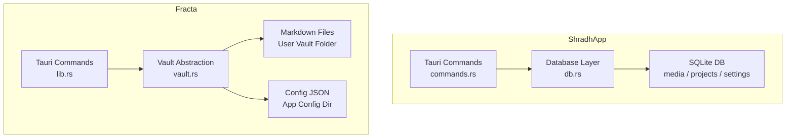
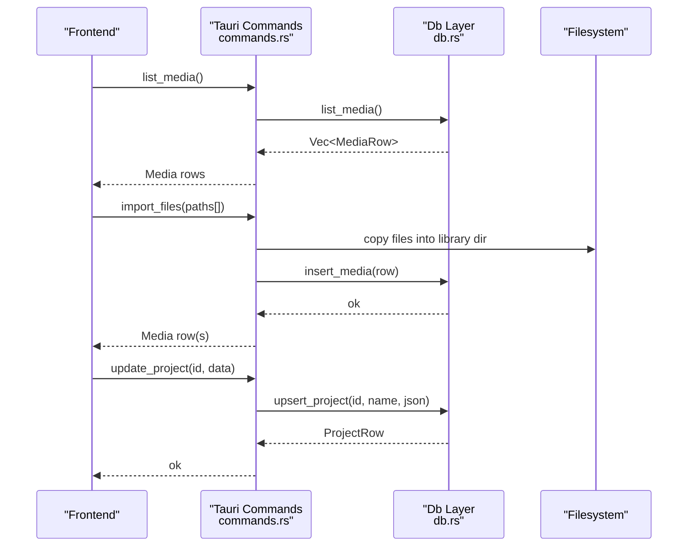
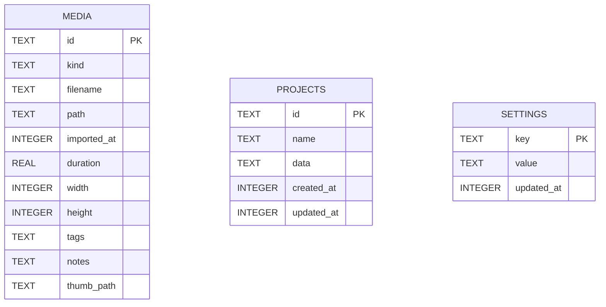
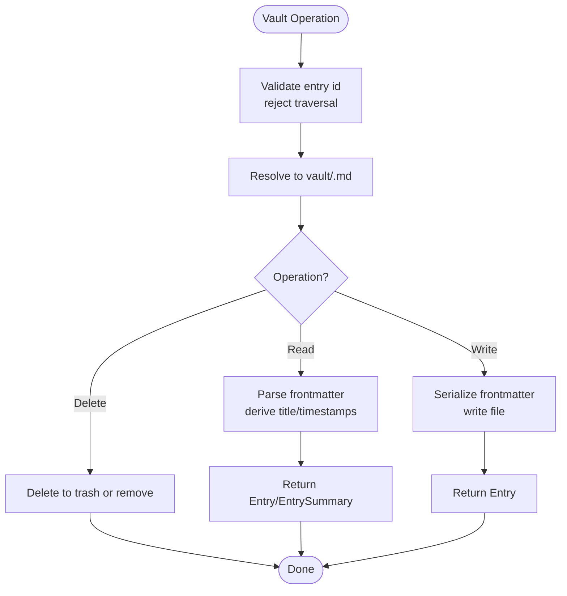
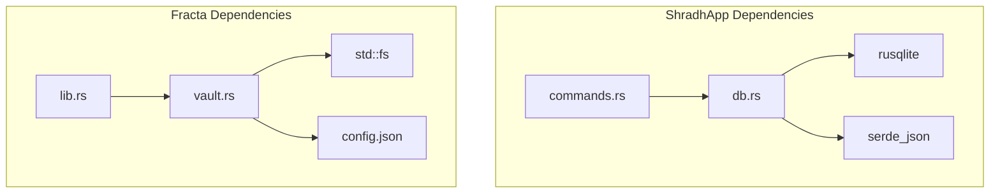

<cite>
**Referenced Files in This Document**
- `apps/shradhapp/src-tauri/src/db.rs`
- `apps/shradhapp/src-tauri/src/commands.rs`
- `apps/shradhapp/src-tauri/Cargo.toml`
- `apps/fracta/src-tauri/src/lib.rs`
- `apps/fracta/src-tauri/src/vault.rs`
- `apps/fracta/src-tauri/Cargo.toml`
</cite>

## Table of Contents
1. Introduction
2. Project Structure
3. Core Components
4. Architecture Overview
5. Detailed Component Analysis
6. Dependency Analysis
7. Performance Considerations
8. Troubleshooting Guide
9. Conclusion

## Introduction
This document explains the SQLite database schema design and data modeling used in the Tauri-based Fracta and ShradhApp projects. It covers entity relationships, table structures, indexing strategies, migration patterns, query optimization techniques, transaction management, backup strategies, data integrity constraints, and performance tuning for local database operations. Where applicable, it also contrasts ShradhApp’s relational model with Fracta’s file-backed vault approach to provide a complete picture of how each app persists and retrieves data.

## Project Structure
- ShradhApp uses an embedded SQLite database via rusqlite to persist media metadata, project definitions, and application settings. The schema is created on first run and lives under the app’s data directory.
- Fracta does not use a relational database for its primary content; instead, it stores entries as Markdown files in a user-selected vault folder, with minimal configuration persisted in a small JSON config file.

**Diagram sources**
- `apps/shradhapp/src-tauri/src/commands.rs#L1-L120`
- `apps/shradhapp/src-tauri/src/db.rs#L1-L82`
- `apps/fracta/src-tauri/src/lib.rs#L431-L498`
- `apps/fracta/src-tauri/src/vault.rs#L1-L110`

**Section sources**
- `apps/shradhapp/src-tauri/src/db.rs#L1-L82`
- `apps/fracta/src-tauri/src/lib.rs#L431-L498`
- `apps/fracta/src-tauri/src/vault.rs#L1-L110`

## Core Components
- ShradhApp database layer (rusqlite):
  - Tables: media, projects, settings
  - Primary keys: id (TEXT PRIMARY KEY), key (TEXT PRIMARY KEY)
  - Timestamps: imported_at, created_at, updated_at (INTEGER epoch millis)
  - JSON fields: tags (media), data (projects), value (settings)
- Fracta vault abstraction:
  - Entry model persisted as Markdown with frontmatter
  - Configuration stored in a small JSON file under the app config directory

Key responsibilities:
- ShradhApp: CRUD over media items, versioned project storage, and typed settings persistence.
- Fracta: File-safe entry creation/read/write/delete, listing summaries, and workspace operations.

**Section sources**
- `apps/shradhapp/src-tauri/src/db.rs#L1-L82`
- `apps/shradhapp/src-tauri/src/db.rs#L84-L193`
- `apps/shradhapp/src-tauri/src/db.rs#L194-L305`
- `apps/fracta/src-tauri/src/vault.rs#L1-L110`
- `apps/fracta/src-tauri/src/vault.rs#L128-L278`

## Architecture Overview
The ShradhApp backend exposes typed Tauri commands that interact with the SQLite database through a thin Db wrapper. Media assets are stored on disk, while their metadata is persisted in SQLite. Projects are stored as versioned JSON blobs alongside timestamps. Settings are key-value pairs serialized as JSON.

**Diagram sources**
- `apps/shradhapp/src-tauri/src/commands.rs#L594-L647`
- `apps/shradhapp/src-tauri/src/commands.rs#L914-L978`
- `apps/shradhapp/src-tauri/src/db.rs#L84-L193`
- `apps/shradhapp/src-tauri/src/db.rs#L194-L267`

## Detailed Component Analysis

### ShradhApp: SQLite Schema and Data Model
- media table
  - Columns: id (PK), kind, filename, path, imported_at, duration, width, height, tags (JSON array), notes, thumb_path
  - Purpose: Stores metadata for imported media assets. Thumbnails and actual media live on disk; paths are referenced here.
- projects table
  - Columns: id (PK), name, data (versioned JSON), created_at, updated_at
  - Purpose: Stores project definitions. Versioning allows evolution of the project format without breaking older data.
- settings table
  - Columns: key (PK), value (JSON), updated_at
  - Purpose: Application-level settings keyed by string.

Indexing strategy:
- Primary keys provide efficient lookups by id and key.
- Ordering queries rely on imported_at and updated_at columns; consider adding indexes if lists grow large or filtering becomes frequent.

Data validation rules:
- kind is constrained to known values ("video", "image", "audio") at the application layer.
- tags are normalized and stored as JSON arrays.
- Project data is validated and normalized before persistence.

Migration patterns:
- Projects include a version field; conversion utilities map v1 to v2 formats when needed.
- Settings normalization ensures defaults and allowed values are enforced on read/update.

Query optimization techniques:
- Use parameterized statements to avoid SQL injection and improve plan reuse.
- Select only required columns where possible.
- Batch writes when importing multiple files.

Transaction management:
- Wrap multi-step operations (e.g., bulk imports, project updates) in transactions to ensure atomicity and consistency.

Backup strategies:
- Back up the SQLite file along with the library directory containing media assets and thumbnails.
- For consistency, perform backups during idle periods or after completing long-running operations.

Performance tuning:
- WAL mode is enabled for better concurrency and crash recovery.
- Keep PRAGMA journal_mode=WAL and consider synchronous=normal for write-heavy workloads.
- Add indexes on frequently filtered columns (e.g., kind, imported_at).

**Diagram sources**
- `apps/shradhapp/src-tauri/src/db.rs#L52-L82`

**Section sources**
- `apps/shradhapp/src-tauri/src/db.rs#L1-L82`
- `apps/shradhapp/src-tauri/src/db.rs#L84-L193`
- `apps/shradhapp/src-tauri/src/db.rs#L194-L305`
- `apps/shradhapp/src-tauri/src/commands.rs#L914-L978`

### Fracta: File-Based Vault vs Relational Storage
Fracta models entries as Markdown files with frontmatter metadata. The vault abstraction enforces safe path resolution and provides CRUD operations. Configuration is stored in a small JSON file under the app config directory.

Key characteristics:
- Entries are identified by stable file stems.
- Listing returns lightweight summaries (no body) for performance.
- Creation writes a file immediately to support autosave from the first keystroke.
- Deletion prefers OS trash with fallback to hard delete.

Security considerations:
- Entry IDs are validated to prevent path traversal attacks.
- All I/O is confined to the chosen vault directory.

**Diagram sources**
- `apps/fracta/src-tauri/src/vault.rs#L113-L127`
- `apps/fracta/src-tauri/src/vault.rs#L128-L157`
- `apps/fracta/src-tauri/src/vault.rs#L159-L278`

**Section sources**
- `apps/fracta/src-tauri/src/vault.rs#L1-L110`
- `apps/fracta/src-tauri/src/vault.rs#L113-L127`
- `apps/fracta/src-tauri/src/vault.rs#L128-L157`
- `apps/fracta/src-tauri/src/vault.rs#L159-L278`

### Complex Queries and Relationship Mapping
- Media queries:
  - List all media ordered by most recent import.
  - Filter by kind or tags using JSON functions (if indexed appropriately).
- Projects:
  - Upsert with conflict handling to preserve created_at and set updated_at.
  - Map between versioned project formats (v1 to v2) for compatibility.
- Settings:
  - Get or initialize default settings; normalize values on read/update.

Example patterns:
- Upsert pattern for projects and settings ensures idempotent updates.
- Tag normalization converts raw inputs into canonical lowercase strings without leading hashes.

**Section sources**
- `apps/shradhapp/src-tauri/src/db.rs#L194-L267`
- `apps/shradhapp/src-tauri/src/db.rs#L269-L305`
- `apps/shradhapp/src-tauri/src/commands.rs#L624-L636`
- `apps/shradhapp/src-tauri/src/commands.rs#L914-L978`

## Dependency Analysis
ShradhApp depends on rusqlite for SQLite access and serde_json for serialization. Fracta depends on filesystem APIs and optional rusqlite for other features but primarily relies on Markdown files for content.

**Diagram sources**
- `apps/shradhapp/src-tauri/Cargo.toml#L1-L27`
- `apps/fracta/src-tauri/Cargo.toml#L1-L44`
- `apps/shradhapp/src-tauri/src/commands.rs#L1-L120`
- `apps/shradhapp/src-tauri/src/db.rs#L1-L82`
- `apps/fracta/src-tauri/src/lib.rs#L431-L498`
- `apps/fracta/src-tauri/src/vault.rs#L1-L110`

**Section sources**
- `apps/shradhapp/src-tauri/Cargo.toml#L1-L27`
- `apps/fracta/src-tauri/Cargo.toml#L1-L44`

## Performance Considerations
- Enable and maintain WAL mode for concurrent reads and safer writes.
- Use parameterized queries and prepared statements to reduce parsing overhead.
- Limit column selection to necessary fields for listing operations.
- Normalize and validate inputs early to avoid expensive rework.
- For large media libraries, add indexes on frequently queried columns (kind, imported_at).
- Batch inserts for bulk imports to minimize transaction overhead.
- Prefer streaming or chunked processing for large exports or conversions.

[No sources needed since this section provides general guidance]

## Troubleshooting Guide
Common issues and resolutions:
- Missing ffmpeg: Ensure ffmpeg and ffprobe are installed and discoverable via PATH or platform-specific locations.
- Export failures: Check temporary directories and permissions; review progress logs emitted during export.
- Database errors: Inspect connection initialization and schema creation; verify WAL mode and permissions.
- Filesystem errors: Confirm vault directory exists and is writable; check for path traversal protections.

Operational tips:
- Use runtime info endpoints to diagnose environment setup (paths, ffmpeg availability).
- Validate settings normalization and defaults when encountering unexpected values.

**Section sources**
- `apps/shradhapp/src-tauri/src/commands.rs#L204-L216`
- `apps/shradhapp/src-tauri/src/db.rs#L50-L82`
- `apps/fracta/src-tauri/src/vault.rs#L113-L127`

## Conclusion
ShradhApp employs a clear, versioned SQLite schema optimized for media metadata and project persistence, with robust command-layer validation and normalization. Fracta adopts a file-centric model that prioritizes portability and simplicity, enforcing strict path safety and efficient listing semantics. Together, these approaches illustrate complementary strategies for local data persistence in Tauri applications: relational storage for structured, query-heavy workloads and file-based storage for human-readable, portable content.

[No sources needed since this section summarizes without analyzing specific files]