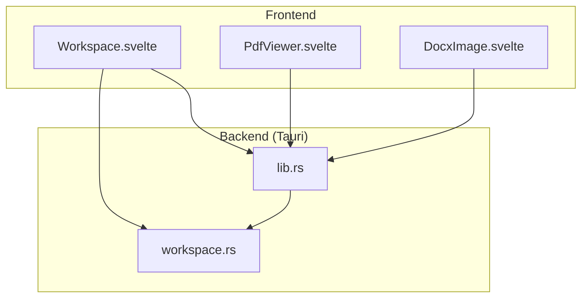
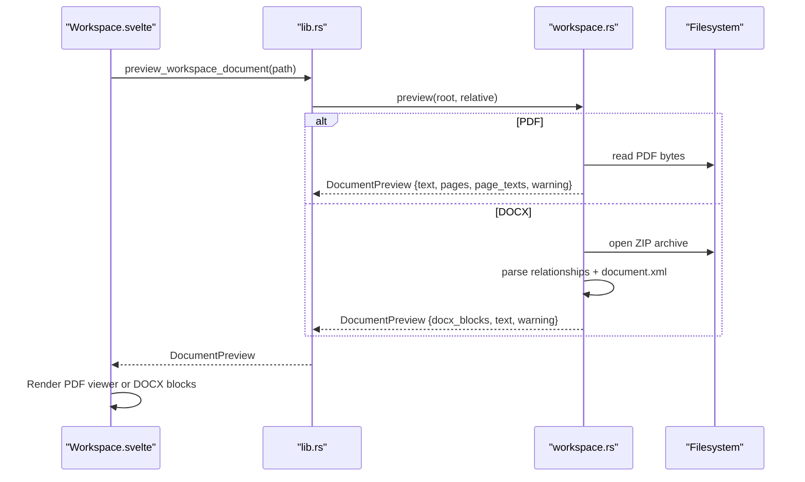
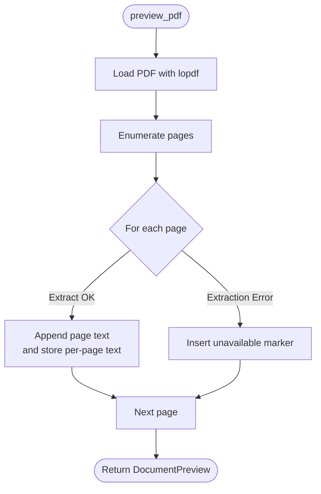
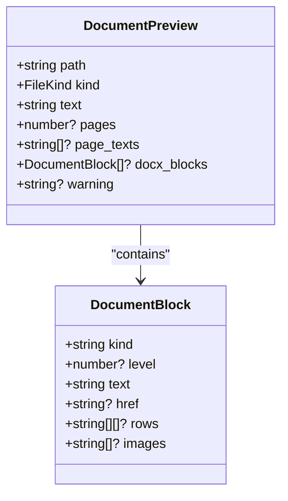
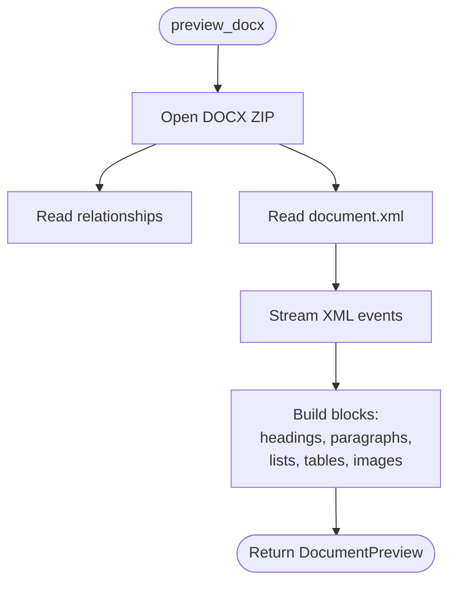
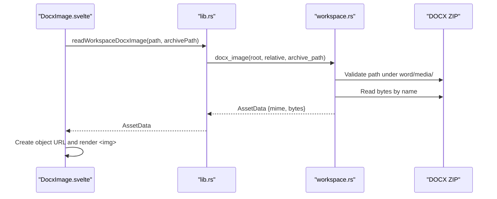
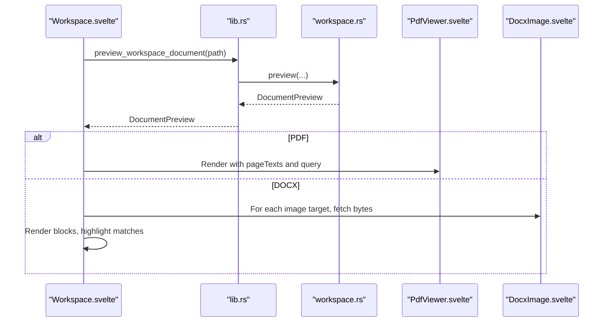
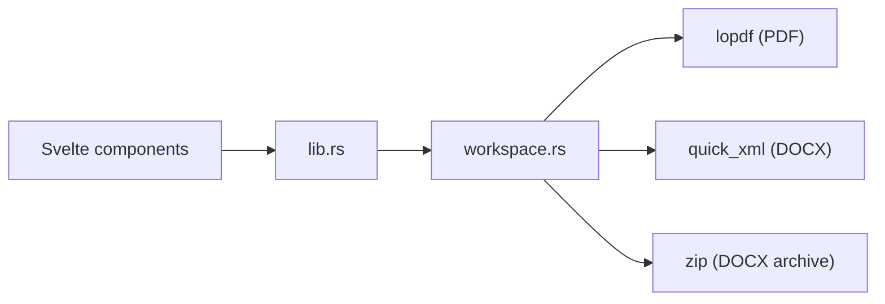

<cite>
**Referenced Files in This Document**
- `apps/fracta/src-tauri/src/lib.rs`
- `apps/fracta/src-tauri/src/workspace.rs`
- `apps/fracta/src/lib/components/PdfViewer.svelte`
- `apps/fracta/src/lib/components/DocxImage.svelte`
- `apps/fracta/src/lib/components/Workspace.svelte`
</cite>

## Table of Contents
1. [Introduction](#introduction)
2. [Project Structure](#project-structure)
3. [Core Components](#core-components)
4. [Architecture Overview](#architecture-overview)
5. [Detailed Component Analysis](#detailed-component-analysis)
6. [Dependency Analysis](#dependency-analysis)
7. [Performance Considerations](#performance-considerations)
8. [Troubleshooting Guide](#troubleshooting-guide)
9. [Conclusion](#conclusion)

## Introduction
This document explains the document preview functionality in Fracta, focusing on how PDF and DOCX files are parsed and rendered locally. It covers:
- PDF text extraction using lopdf
- DOCX parsing with XML processing and structured block extraction
- The DocumentPreview structure and block-based content organization
- Embedded media handling for DOCX images
- Preview generation flow, warning systems, and fallbacks
- Performance considerations for large documents, memory management, and rendering optimization
- Security measures for archive traversal and content sanitization

## Project Structure
The preview feature spans a Tauri backend (Rust) and Svelte frontend components:
- Backend commands expose workspace operations and preview extraction
- Frontend components render PDF pages and DOCX blocks/images safely within the webview

**Diagram sources**
- `apps/fracta/src-tauri/src/lib.rs`
- `apps/fracta/src-tauri/src/workspace.rs`
- `apps/fracta/src/lib/components/Workspace.svelte`
- `apps/fracta/src/lib/components/PdfViewer.svelte`
- `apps/fracta/src/lib/components/DocxImage.svelte`

**Section sources**
- `apps/fracta/src-tauri/src/lib.rs`
- `apps/fracta/src-tauri/src/workspace.rs`
- `apps/fracta/src/lib/components/Workspace.svelte`
- `apps/fracta/src/lib/components/PdfViewer.svelte`
- `apps/fracta/src/lib/components/DocxImage.svelte`

## Core Components
- DocumentPreview: A unified result returned by the preview command containing path, kind, extracted text, optional page metadata, and DOCX blocks.
- FileKind: Enumerates supported file types including Pdf and Docx.
- DocumentBlock: Represents a semantic unit from DOCX such as heading, paragraph, list_item, or table, optionally carrying href and embedded image targets.
- AssetData: Binary payload with mime type used to deliver embedded images/media safely to the frontend.

Key responsibilities:
- Securely resolve paths within the workspace root
- Extract text from PDFs and parse DOCX XML into blocks
- Provide warnings when features cannot be fully reproduced
- Return structured data for safe frontend rendering

**Section sources**
- `apps/fracta/src-tauri/src/workspace.rs`

## Architecture Overview
The preview pipeline is driven by Tauri commands that call workspace functions. The frontend requests previews and renders them without exposing raw filesystem paths to JavaScript.

**Diagram sources**
- `apps/fracta/src-tauri/src/lib.rs`
- `apps/fracta/src-tauri/src/workspace.rs`
- `apps/fracta/src/lib/components/Workspace.svelte`

## Detailed Component Analysis

### PDF Preview with lopdf
- Text extraction: Each page’s text is extracted and concatenated; per-page text is retained for search and navigation.
- Rendering: The frontend uses pdfjs-dist to draw pages onto canvas and build a selectable text layer.
- Fallback: If extraction fails on a page, a placeholder message is inserted.

**Diagram sources**
- `apps/fracta/src-tauri/src/workspace.rs`

**Section sources**
- `apps/fracta/src-tauri/src/workspace.rs`
- `apps/fracta/src/lib/components/PdfViewer.svelte`

### DOCX Parsing with XML Processing
- Archive access: DOCX is a ZIP; the backend opens it and reads word/document.xml and relationships.
- Block extraction: An event-driven XML reader walks paragraphs, styles, hyperlinks, lists, tables, and embedded images.
- Structured output: Blocks include kind, level (for headings), text, href (external links), rows (tables), and images (archive-relative paths).

**Diagram sources**
- `apps/fracta/src-tauri/src/workspace.rs`

**Diagram sources**
- `apps/fracta/src-tauri/src/workspace.rs`

**Section sources**
- `apps/fracta/src-tauri/src/workspace.rs`

### Embedded Media Handling
- DOCX images: The backend validates archive-relative paths under word/media/ and returns bytes with MIME type.
- Frontend: Creates an object URL from the bytes and displays the image; cleans up URLs on destroy.

**Diagram sources**
- `apps/fracta/src/lib/components/DocxImage.svelte`
- `apps/fracta/src-tauri/src/workspace.rs`
- `apps/fracta/src-tauri/src/lib.rs`

**Section sources**
- `apps/fracta/src/lib/components/DocxImage.svelte`
- `apps/fracta/src-tauri/src/workspace.rs`

### Frontend Rendering and Search
- PDF viewer: Renders pages via pdfjs-dist, builds a text layer, supports zoom, thumbnails, and page search.
- DOCX preview: Groups blocks into sections (paragraphs, headings, lists, tables), highlights matches, and embeds images.
- Workspace integration: Calls preview_workspace_document and displays warnings and extracted content.

**Diagram sources**
- `apps/fracta/src/lib/components/Workspace.svelte`
- `apps/fracta/src/lib/components/PdfViewer.svelte`
- `apps/fracta/src/lib/components/DocxImage.svelte`
- `apps/fracta/src-tauri/src/lib.rs`
- `apps/fracta/src-tauri/src/workspace.rs`

**Section sources**
- `apps/fracta/src/lib/components/Workspace.svelte`
- `apps/fracta/src/lib/components/PdfViewer.svelte`
- `apps/fracta/src/lib/components/DocxImage.svelte`

## Dependency Analysis
- lib.rs exposes tauri commands that delegate to workspace.rs for all preview-related logic.
- workspace.rs depends on lopdf for PDF text extraction and quick_xml for streaming DOCX XML parsing.
- Frontend components depend on Tauri IPC to request assets and preview data.

**Diagram sources**
- `apps/fracta/src-tauri/src/lib.rs`
- `apps/fracta/src-tauri/src/workspace.rs`

**Section sources**
- `apps/fracta/src-tauri/src/lib.rs`
- `apps/fracta/src-tauri/src/workspace.rs`

## Performance Considerations
- Streaming XML parsing: DOCX parsing uses an event-driven XML reader to avoid loading entire DOM into memory.
- Page-level processing: PDF text extraction iterates pages individually; per-page text is stored for search but not full layout.
- Memory hygiene:
  - PDFJS worker and document instances are destroyed on component lifecycle changes.
  - Object URLs for DOCX images are revoked on unmount.
- Large documents:
  - Prefer lazy rendering of thumbnails and virtualized views where applicable.
  - Avoid loading entire archives at once; stream only needed entries.
- Rendering optimization:
  - Use device pixel ratio scaling for crisp rendering while controlling canvas sizes.
  - Debounce or throttle heavy operations if user input triggers re-renders.

[No sources needed since this section provides general guidance]

## Troubleshooting Guide
Common issues and resolutions:
- PDF text extraction unavailable: Some scanned or complex PDFs may not yield text; the preview inserts placeholders and warns users.
- DOCX unsupported features: Drawing canvases, tracked changes, and advanced Word layouts are not shown; a warning indicates limitations.
- Embedded images missing: Ensure the archive path is under word/media/ and exists; invalid paths return errors.
- Path traversal protection: All workspace paths are validated against the root; symlinks outside the workspace are rejected.

Operational checks:
- Verify the file kind matches expected extensions (.pdf, .docx).
- Confirm the workspace root is correctly set and accessible.
- Inspect warnings in the inspector panel for details about extraction limits.

**Section sources**
- `apps/fracta/src-tauri/src/workspace.rs`
- `apps/fracta/src/lib/components/Workspace.svelte`

## Conclusion
Fracta’s document preview combines secure, local parsing with safe rendering:
- PDFs are processed with lopdf for text extraction and pdfjs-dist for rendering.
- DOCX files are parsed via quick_xml into structured blocks, with embedded images fetched through a strict archive-path policy.
- Warnings and fallbacks ensure transparency about unsupported features.
- Security and performance are prioritized through path validation, streaming parsers, and careful memory management.

[No sources needed since this section summarizes without analyzing specific files]