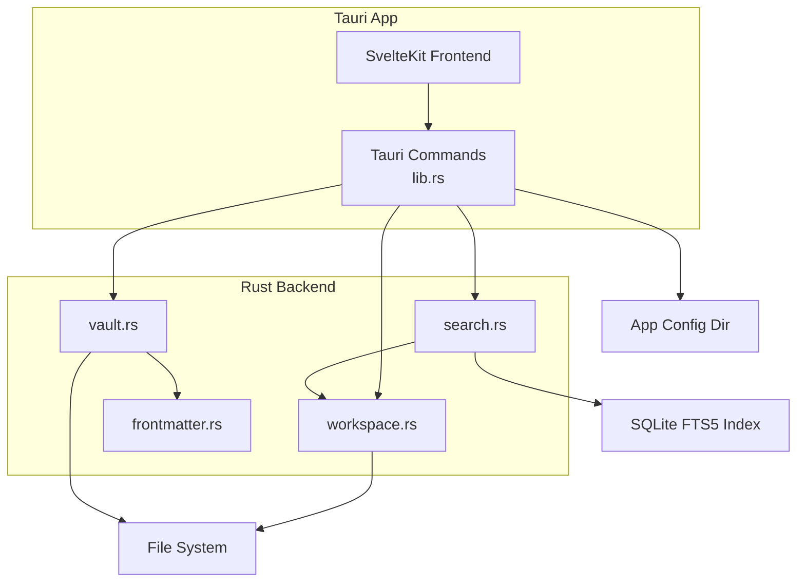
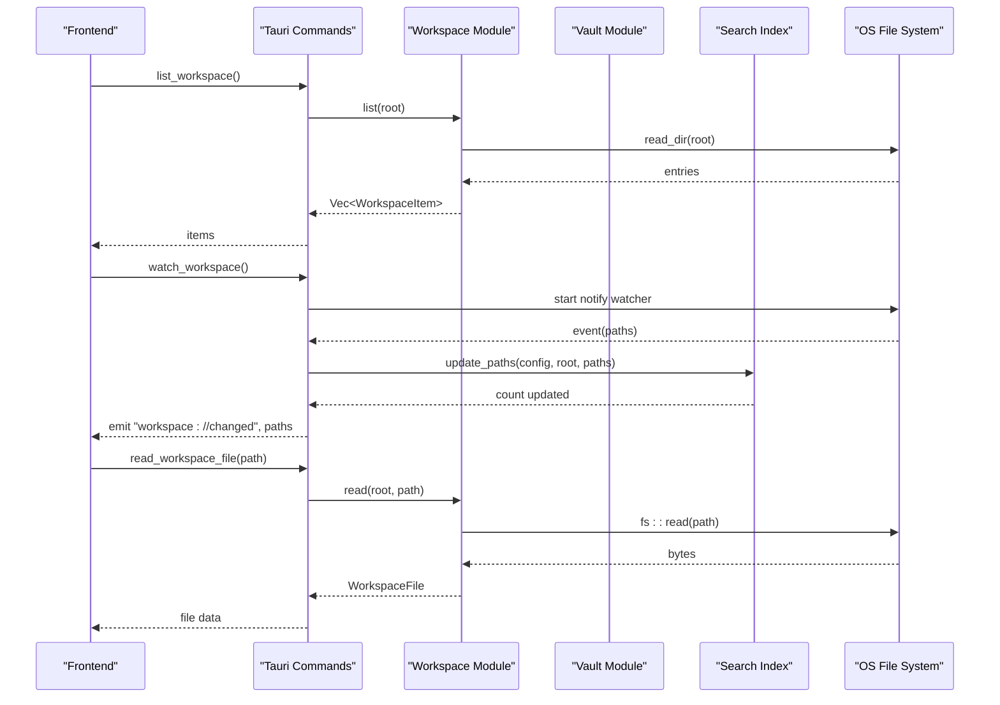
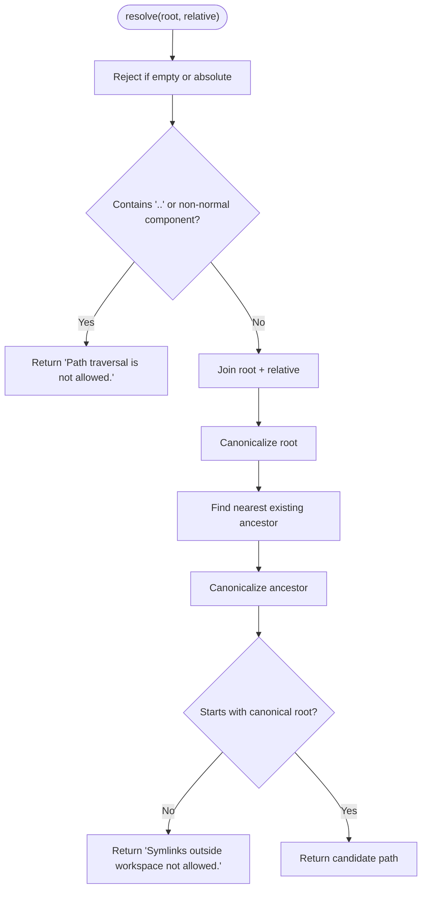
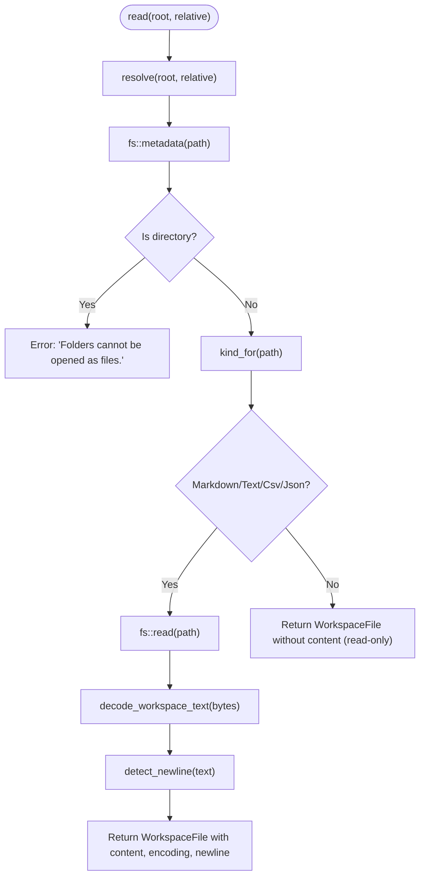
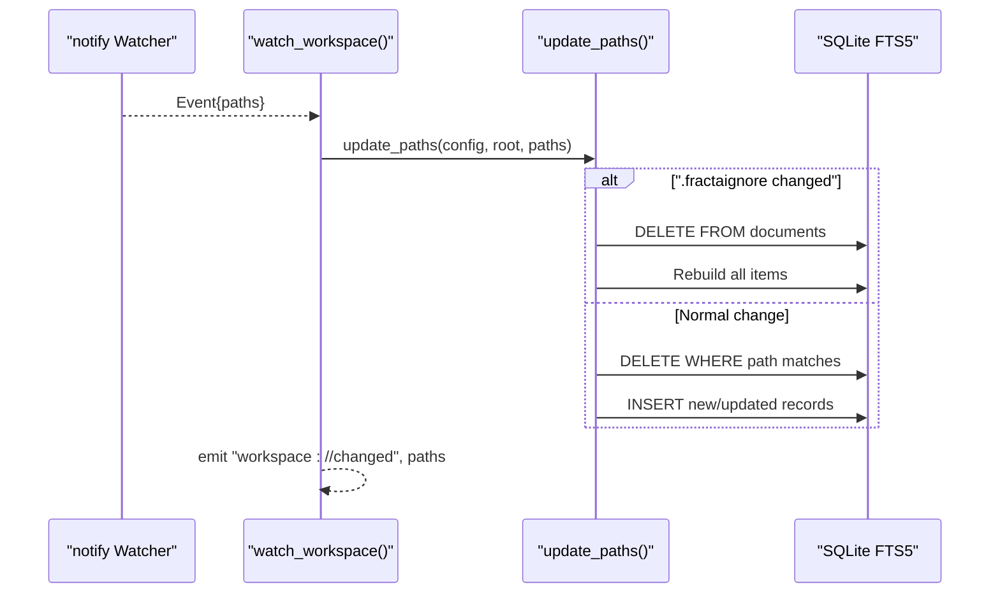
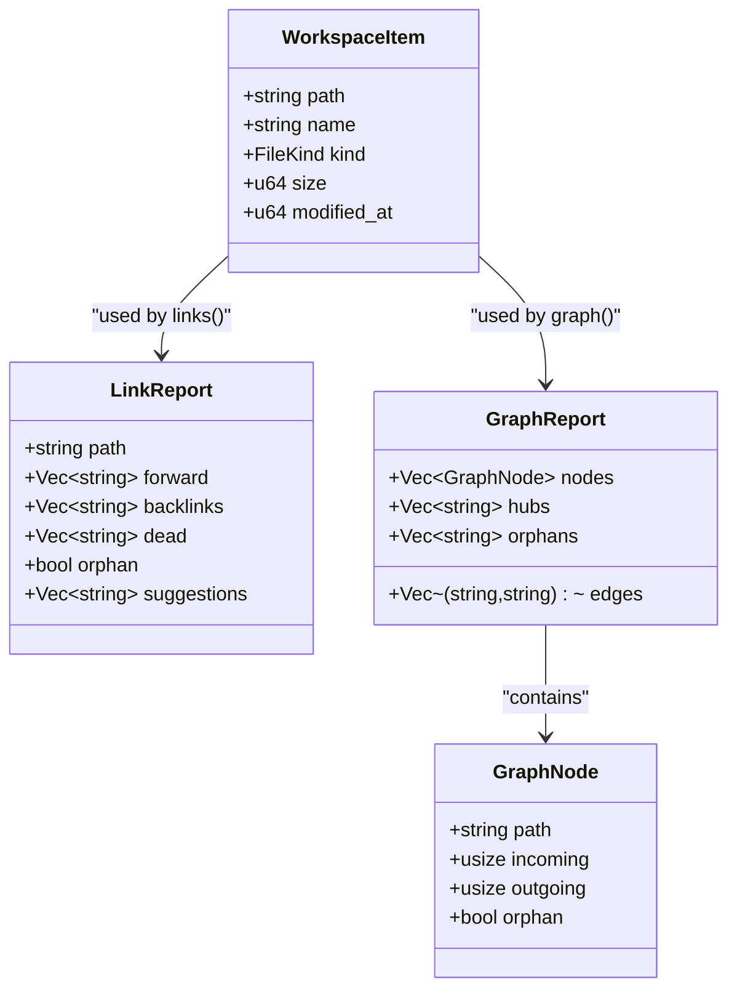
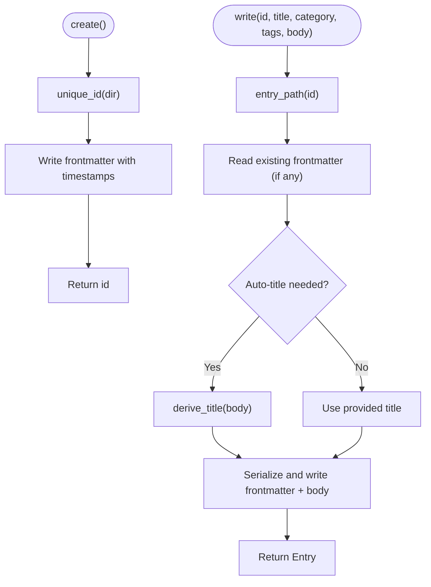
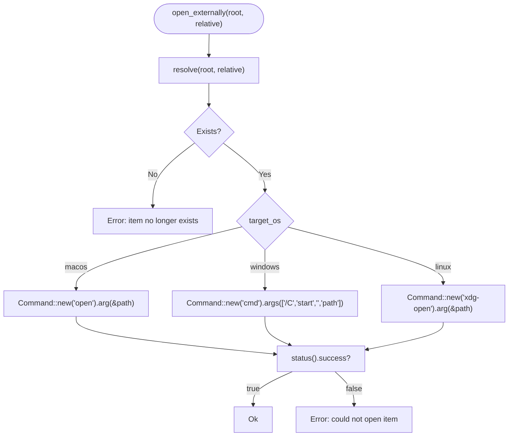
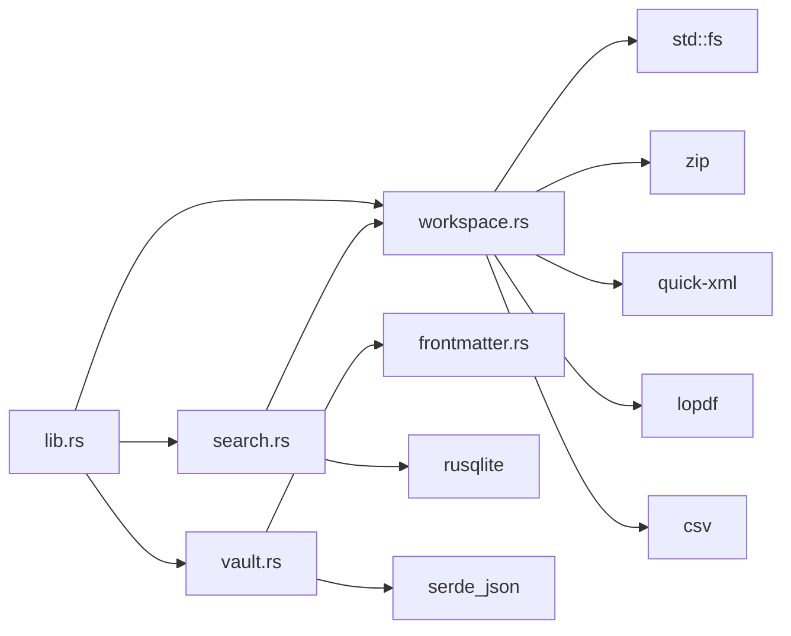

<cite>
**Referenced Files in This Document**
- `apps/fracta/src-tauri/src/workspace.rs`
- `apps/fracta/src-tauri/src/vault.rs`
- `apps/fracta/src-tauri/src/lib.rs`
- `apps/fracta/src-tauri/src/search.rs`
- `apps/fracta/src-tauri/src/frontmatter.rs`
- `apps/fracta/src-tauri/Cargo.toml`
- `apps/fracta/src-tauri/tauri.conf.json`
- `apps/fracta/src-tauri/capabilities/default.json`
</cite>

## Table of Contents
1. [Introduction](#introduction)
2. [Project Structure](#project-structure)
3. [Core Components](#core-components)
4. [Architecture Overview](#architecture-overview)
5. [Detailed Component Analysis](#detailed-component-analysis)
6. [Dependency Analysis](#dependency-analysis)
7. [Performance Considerations](#performance-considerations)
8. [Troubleshooting Guide](#troubleshooting-guide)
9. [Conclusion](#conclusion)
10. [Appendices](#appendices)

## Introduction
This document explains how Fracta performs file system operations within a Tauri application. It focuses on secure file access patterns, directory traversal, file watching, cross-platform path handling, workspace management, vault organization, and indexing strategies. It also provides guidance for safe file operations, error handling for permission issues, performance optimization for large file sets, security best practices, sandboxing considerations, and platform-specific differences across Windows, macOS, and Linux.

## Project Structure
Fracta’s Rust backend exposes Tauri commands that encapsulate all file system interactions. The key modules are:
- Workspace module: recursive, safe operations over a user-selected project root (list, read, write, preview, assets, links/graph).
- Vault module: a simple folder of .md entries with frontmatter metadata, persisted configuration, and CRUD operations.
- Search module: SQLite FTS5 index stored under the app config directory, updated incrementally via filesystem events.
- Frontmatter module: lightweight YAML frontmatter parsing and serialization for .md entries.
- Tauri command layer: binds frontend calls to backend functions, manages watchers, and coordinates state.

**Diagram sources**
- `apps/fracta/src-tauri/src/lib.rs#L1-L498`
- `apps/fracta/src-tauri/src/workspace.rs#L1-L1553`
- `apps/fracta/src-tauri/src/vault.rs#L1-L495`
- `apps/fracta/src-tauri/src/search.rs#L1-L346`
- `apps/fracta/src-tauri/src/frontmatter.rs#L1-L425`

**Section sources**
- `apps/fracta/src-tauri/src/lib.rs#L1-L498`
- `apps/fracta/src-tauri/src/workspace.rs#L1-L1553`
- `apps/fracta/src-tauri/src/vault.rs#L1-L495`
- `apps/fracta/src-tauri/src/search.rs#L1-L346`
- `apps/fracta/src-tauri/src/frontmatter.rs#L1-L425`

## Core Components
- Secure path resolution: All workspace operations validate paths against the selected root, reject traversal sequences, and enforce symlink containment.
- Safe content I/O: Text files preserve encoding and newline conventions; binary assets are restricted by extension and size limits.
- Watcher-driven updates: A notify watcher triggers incremental search updates and emits events to the frontend.
- Indexed search: SQLite FTS5 index is kept in the app config directory and rebuilt or updated based on filesystem events.
- Vault model: Entries are plain .md files with frontmatter; IDs are stable stems and never contain path separators.

Key responsibilities:
- Path safety and containment: resolve(), entry_path()
- Content reading/writing: read(), write(), pdf_bytes(), image_asset(), media_asset()
- Asset handling: docx_image(), write_asset()
- Workspace listing and traversal: list(), walk(), ignores()
- Link analysis and graph: links(), graph()
- Search indexing: rebuild(), update_paths(), search()
- Vault CRUD: list(), read(), create(), write(), delete()

**Section sources**
- `apps/fracta/src-tauri/src/workspace.rs#L143-L173`
- `apps/fracta/src-tauri/src/workspace.rs#L175-L231`
- `apps/fracta/src-tauri/src/workspace.rs#L257-L285`
- `apps/fracta/src-tauri/src/workspace.rs#L290-L364`
- `apps/fracta/src-tauri/src/workspace.rs#L384-L430`
- `apps/fracta/src-tauri/src/workspace.rs#L573-L682`
- `apps/fracta/src-tauri/src/workspace.rs#L687-L767`
- `apps/fracta/src-tauri/src/workspace.rs#L769-L923`
- `apps/fracta/src-tauri/src/workspace.rs#L971-L1010`
- `apps/fracta/src-tauri/src/workspace.rs#L1012-L1058`
- `apps/fracta/src-tauri/src/workspace.rs#L1138-L1230`
- `apps/fracta/src-tauri/src/vault.rs#L115-L126`
- `apps/fracta/src-tauri/src/vault.rs#L128-L157`
- `apps/fracta/src-tauri/src/vault.rs#L159-L189`
- `apps/fracta/src-tauri/src/vault.rs#L193-L267`
- `apps/fracta/src-tauri/src/vault.rs#L269-L277`
- `apps/fracta/src-tauri/src/search.rs#L24-L36`
- `apps/fracta/src-tauri/src/search.rs#L42-L86`
- `apps/fracta/src-tauri/src/search.rs#L157-L193`
- `apps/fracta/src-tauri/src/search.rs#L195-L219`

## Architecture Overview
The architecture separates concerns between the webview (frontend), Tauri commands (API boundary), and Rust modules (domain logic). All file system access is centralized behind validated commands, ensuring the webview never receives raw host paths except through controlled, sanitized channels.

**Diagram sources**
- `apps/fracta/src-tauri/src/lib.rs#L100-L165`
- `apps/fracta/src-tauri/src/workspace.rs#L175-L231`
- `apps/fracta/src-tauri/src/search.rs#L42-L86`

## Detailed Component Analysis

### Secure Path Resolution and Directory Traversal
- Path validation: resolve() rejects empty or absolute inputs, disallows parent components (“..”), and enforces canonical root containment. Symlinked targets outside the root are rejected.
- Walk behavior: walk() skips symlinks to avoid recursion and escapes, filters hidden/system folders, and applies ignore rules from .fractaignore.
- Cross-platform normalization: relative paths use forward slashes consistently; backslashes are normalized during processing.

**Diagram sources**
- `apps/fracta/src-tauri/src/workspace.rs#L143-L173`

**Section sources**
- `apps/fracta/src-tauri/src/workspace.rs#L143-L173`
- `apps/fracta/src-tauri/src/workspace.rs#L183-L231`

### Safe File Reading and Writing
- Text files: read() detects encoding (UTF-8, UTF-8 BOM, UTF-16LE/BE) and newline style; writes preserve original encoding and newline conventions.
- Binary assets: image_asset() and media_asset() restrict allowed MIME types and enforce size limits; PDF bytes are returned only after kind checks.
- Structured formats: JSON is validated on write; CSV headers and quoting are validated; delimiter detection supports common dialects.

**Diagram sources**
- `apps/fracta/src-tauri/src/workspace.rs#L257-L285`
- `apps/fracta/src-tauri/src/workspace.rs#L470-L512`
- `apps/fracta/src-tauri/src/workspace.rs#L514-L539`

**Section sources**
- `apps/fracta/src-tauri/src/workspace.rs#L257-L285`
- `apps/fracta/src-tauri/src/workspace.rs#L290-L364`
- `apps/fracta/src-tauri/src/workspace.rs#L384-L430`
- `apps/fracta/src-tauri/src/workspace.rs#L434-L464`
- `apps/fracta/src-tauri/src/workspace.rs#L470-L539`

### File Watching and Incremental Indexing
- Watcher lifecycle: watch_workspace() starts a recommended watcher on the vault root, emits “workspace://changed” with affected paths, and updates the search index incrementally.
- Incremental updates: update_paths() deletes stale records for changed paths, re-indexes affected items, and falls back to full rebuild when necessary (e.g., .fractaignore changes).
- Full rebuild: rebuild() clears the documents table and indexes all workspace items.

**Diagram sources**
- `apps/fracta/src-tauri/src/lib.rs#L138-L165`
- `apps/fracta/src-tauri/src/search.rs#L42-L86`
- `apps/fracta/src-tauri/src/search.rs#L24-L36`

**Section sources**
- `apps/fracta/src-tauri/src/lib.rs#L138-L165`
- `apps/fracta/src-tauri/src/search.rs#L42-L86`
- `apps/fracta/src-tauri/src/search.rs#L24-L36`

### Workspace Management and Link Graph
- Listing and filtering: list() walks recursively, applies ignore rules, and returns sorted items with metadata.
- Links and graph: links() extracts wiki-style [[link]] and markdown [text](path) references, computes forward/backlinks, dead links, and suggestions; graph() builds nodes, edges, hubs, and orphans.

**Diagram sources**
- `apps/fracta/src-tauri/src/workspace.rs#L34-L41`
- `apps/fracta/src-tauri/src/workspace.rs#L66-L89`
- `apps/fracta/src-tauri/src/workspace.rs#L971-L1010`
- `apps/fracta/src-tauri/src/workspace.rs#L1012-L1058`

**Section sources**
- `apps/fracta/src-tauri/src/workspace.rs#L175-L231`
- `apps/fracta/src-tauri/src/workspace.rs#L971-L1010`
- `apps/fracta/src-tauri/src/workspace.rs#L1012-L1058`

### Vault Organization and Entry Lifecycle
- Configuration: Vault stores the chosen folder in a small config.json under the app config directory.
- Entry model: Each entry is a .md file with frontmatter; id is a stable stem derived at creation time.
- CRUD: list() enumerates summaries, read() parses frontmatter and body, create() writes initial frontmatter, write() persists metadata and body, delete() moves to trash or removes directly.

**Diagram sources**
- `apps/fracta/src-tauri/src/vault.rs#L193-L208`
- `apps/fracta/src-tauri/src/vault.rs#L212-L267`
- `apps/fracta/src-tauri/src/vault.rs#L336-L353`

**Section sources**
- `apps/fracta/src-tauri/src/vault.rs#L15-L24`
- `apps/fracta/src-tauri/src/vault.rs#L115-L126`
- `apps/fracta/src-tauri/src/vault.rs#L128-L157`
- `apps/fracta/src-tauri/src/vault.rs#L159-L189`
- `apps/fracta/src-tauri/src/vault.rs#L193-L267`
- `apps/fracta/src-tauri/src/vault.rs#L269-L277`

### Cross-Platform Path Handling and External Tools
- Reveal/open externally: Uses native commands per platform:
  - macOS: open -R / open
  - Windows: explorer /select, / cmd /C start
  - Linux: xdg-open
- Terminal execution: Spawns sh -lc on Unix-like systems and cmd /C on Windows, with bounded output and timeout.

**Diagram sources**
- `apps/fracta/src-tauri/src/workspace.rs#L661-L682`
- `apps/fracta/src-tauri/src/lib.rs#L193-L267`

**Section sources**
- `apps/fracta/src-tauri/src/workspace.rs#L638-L682`
- `apps/fracta/src-tauri/src/lib.rs#L193-L267`

## Dependency Analysis
- Tauri commands bind frontend requests to backend functions, managing state like Vault and AutoTag, and orchestrating watchers and search updates.
- Workspace depends on std::fs, serde_json, csv, quick_xml, lopdf, zip, and trash for robust file operations and previews.
- Search uses rusqlite for FTS5 indexing; Vault uses serde_json for config persistence.
- Frontmatter is a minimal parser tailored to the fixed schema, avoiding heavy YAML dependencies.

**Diagram sources**
- `apps/fracta/src-tauri/src/lib.rs#L1-L498`
- `apps/fracta/src-tauri/src/workspace.rs#L1-L1553`
- `apps/fracta/src-tauri/src/vault.rs#L1-L495`
- `apps/fracta/src-tauri/src/search.rs#L1-L346`
- `apps/fracta/src-tauri/src/frontmatter.rs#L1-L425`

**Section sources**
- `apps/fracta/src-tauri/Cargo.toml#L17-L29`

## Performance Considerations
- Efficient listing: list() avoids symlinks and hidden directories, sorts results once, and respects .fractaignore to reduce traversal cost.
- Incremental indexing: update_paths() minimizes database churn by deleting and re-inserting only affected records; full rebuild is reserved for critical cases like .fractaignore edits.
- Large asset handling: media_asset() enforces a 256 MB limit to prevent memory pressure; images and PDFs are processed in streaming or limited contexts where possible.
- Output bounding: terminal command outputs are capped to avoid excessive memory usage.

[No sources needed since this section provides general guidance]

## Troubleshooting Guide
Common errors and resolutions:
- Permission denied: Ensure the selected vault root has read/write permissions; check OS-level restrictions and antivirus exclusions.
- Path traversal blocked: Validate relative paths do not include “..” or absolute prefixes; ensure correct working directory.
- Symlink escape: Confirm symlinks point inside the workspace; external symlinks are intentionally rejected.
- Invalid JSON/CSV: Validate JSON structure and CSV headers/quoting; use convert_csv_to_json/json_to_csv helpers to normalize formats.
- Watcher failures: If the watcher fails to start, fall back to polling; verify the OS allows file notifications for the target directory.
- External tool invocation: On Linux, ensure xdg-open is installed; on Windows, confirm shell associations for file types.

**Section sources**
- `apps/fracta/src-tauri/src/workspace.rs#L143-L173`
- `apps/fracta/src-tauri/src/workspace.rs#L384-L430`
- `apps/fracta/src-tauri/src/workspace.rs#L638-L682`
- `apps/fracta/src-tauri/src/lib.rs#L138-L165`

## Conclusion
Fracta’s file system operations are designed around strict security boundaries, predictable behavior across platforms, and efficient indexing. By centralizing all I/O behind validated commands, enforcing path containment, and using incremental updates, the application maintains both safety and performance. The vault and workspace models provide clear separation between structured notes and broader project content, while the search index ensures fast retrieval. Following the best practices outlined here will help maintain robustness and security as the codebase evolves.

[No sources needed since this section summarizes without analyzing specific files]

## Appendices

### Security Best Practices and Sandboxing
- CSP and capabilities: tauri.conf.json defines a restrictive CSP; default.json enables only necessary window-related permissions.
- Command surface: Only explicitly exposed Tauri commands are available to the frontend; no direct FS access from JS.
- Input validation: All paths are validated; text encodings are preserved; binary assets are whitelisted by extension and size.

**Section sources**
- `apps/fracta/src-tauri/tauri.conf.json#L32-L34`
- `apps/fracta/src-tauri/capabilities/default.json#L8-L13`

### Platform-Specific Differences
- macOS: Uses open for reveal/open; clipboard source detection leverages NSPasteboard and NSWorkspace.
- Windows: Uses explorer and cmd for external tools; handles CRLF frontmatter gracefully.
- Linux: Uses xdg-open; notify watcher behavior may vary by desktop environment.

**Section sources**
- `apps/fracta/src-tauri/src/workspace.rs#L638-L682`
- `apps/fracta/src-tauri/src/frontmatter.rs#L42-L49`
- `apps/fracta/src-tauri/Cargo.toml#L36-L43`