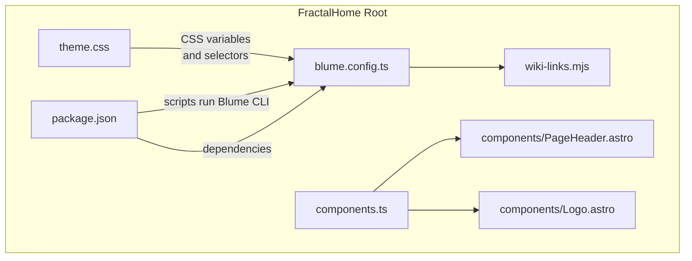
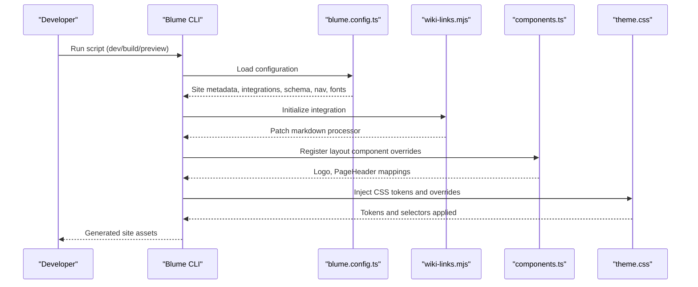
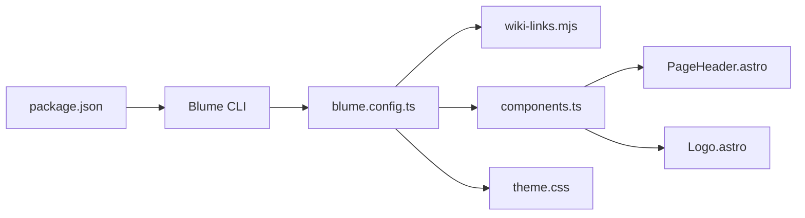

<cite>
**Referenced Files in This Document**
- [blume.config.ts](../../sites/fractalhome/blume.config.ts)
- [components.ts](../../sites/fractalhome/components.ts)
- [theme.css](../../sites/fractalhome/theme.css)
- [package.json](../../sites/fractalhome/package.json)
- [wiki-links.mjs](../../sites/fractalhome/wiki-links.mjs)
- [PageHeader.astro](../../sites/fractalhome/components/PageHeader.astro)
- [Logo.astro](../../sites/fractalhome/components/Logo.astro)
- [BLUME-CUSTOMIZATION-BACKEND.md](../../sites/fractalhome/BLUME-CUSTOMIZATION-BACKEND.md)
</cite>

## Table of Contents
1. [Introduction](#introduction)
2. [Project Structure](#project-structure)
3. [Core Components](#core-components)
4. [Architecture Overview](#architecture-overview)
5. [Detailed Component Analysis](#detailed-component-analysis)
6. [Dependency Analysis](#dependency-analysis)
7. [Performance Considerations](#performance-considerations)
8. [Troubleshooting Guide](#troubleshooting-guide)
9. [Conclusion](#conclusion)
10. [Appendices](#appendices)

## Introduction
This document explains how to configure and customize the Blume framework within FractalHome. It covers configuration via blume.config.ts, component registration through components.ts, theme customization with theme.css, build pipeline scripts, and extension patterns for adding custom components and modifying rendering behavior. It also includes performance tips and troubleshooting guidance based on the project’s setup.

## Project Structure
FractalHome uses a small set of configuration files to control Blume:
- blume.config.ts: Site metadata, integrations, frontmatter schema, navigation, and theme fonts.
- components.ts: Registration of Astro components that override Blume layout slots (e.g., Logo, PageHeader).
- theme.css: Global design tokens and CSS overrides for light/dark themes and UI regions.
- package.json: Build/dev scripts and dependencies for Blume and related tooling.
- wiki-links.mjs: A Blume integration that transforms wiki-style links during Markdown processing.
- components/*.astro: Custom Astro components used by Blume layout slots.

**Diagram sources**
- [blume.config.ts:1-67](../../sites/fractalhome/blume.config.ts#L1-L67)
- [components.ts:1-12](../../sites/fractalhome/components.ts#L1-L12)
- [theme.css:1-673](../../sites/fractalhome/theme.css#L1-L673)
- [package.json:1-19](../../sites/fractalhome/package.json#L1-L19)
- [wiki-links.mjs:1-125](../../sites/fractalhome/wiki-links.mjs#L1-L125)
- [PageHeader.astro:1-31](../../sites/fractalhome/components/PageHeader.astro#L1-L31)
- [Logo.astro:1-48](../../sites/fractalhome/components/Logo.astro#L1-L48)

**Section sources**
- [blume.config.ts:1-67](../../sites/fractalhome/blume.config.ts#L1-L67)
- [components.ts:1-12](../../sites/fractalhome/components.ts#L1-L12)
- [theme.css:1-673](../../sites/fractalhome/theme.css#L1-L673)
- [package.json:1-19](../../sites/fractalhome/package.json#L1-L19)
- [wiki-links.mjs:1-125](../../sites/fractalhome/wiki-links.mjs#L1-L125)
- [PageHeader.astro:1-31](../../sites/fractalhome/components/PageHeader.astro#L1-L31)
- [Logo.astro:1-48](../../sites/fractalhome/components/Logo.astro#L1-L48)

## Core Components
- blume.config.ts
  - Defines site title, description, integrations, frontmatter schema extensions, navigation tabs, sidebar display mode, and font configuration.
  - Integrates the wiki-links plugin to transform wiki-style links at build time.
- components.ts
  - Registers Astro components into Blume’s layout slot system (e.g., Logo and PageHeader).
- theme.css
  - Declares design tokens (colors, radii, content width), dark mode variants, typography, and region-specific styles for header, sidebar, TOC, content, search, pagination, tags, and footer.
- package.json
  - Provides Blume CLI scripts for development, building, preview, checking, validation, and doctor diagnostics.
- wiki-links.mjs
  - Scans docs, builds a title-to-route map, and rewrites [[wiki]] syntax into standard Markdown links during rendering.
- PageHeader.astro
  - Renders a tag row above article content using data from Blume’s content collection.
- Logo.astro
  - Renders brand imagery with theme-aware wordmark switching via CSS.

**Section sources**
- [blume.config.ts:1-67](../../sites/fractalhome/blume.config.ts#L1-L67)
- [components.ts:1-12](../../sites/fractalhome/components.ts#L1-L12)
- [theme.css:1-673](../../sites/fractalhome/theme.css#L1-L673)
- [package.json:1-19](../../sites/fractalhome/package.json#L1-L19)
- [wiki-links.mjs:1-125](../../sites/fractalhome/wiki-links.mjs#L1-L125)
- [PageHeader.astro:1-31](../../sites/fractalhome/components/PageHeader.astro#L1-L31)
- [Logo.astro:1-48](../../sites/fractalhome/components/Logo.astro#L1-L48)

## Architecture Overview
Blume composes the site at build time using configuration, integrations, and component overrides. The flow is:
- Blume reads blume.config.ts to initialize site metadata, integrations, frontmatter schema, navigation, and fonts.
- The wiki-links integration hooks into Astro’s markdown processor to rewrite wiki links before rendering.
- components.ts registers Astro components that replace default Blume layout slots.
- theme.css provides global tokens and targeted selectors that style Blume-generated markup.
- package.json scripts invoke the Blume CLI for dev/build/preview/check/validate/doctor.

**Diagram sources**
- [blume.config.ts:1-67](../../sites/fractalhome/blume.config.ts#L1-L67)
- [wiki-links.mjs:1-125](../../sites/fractalhome/wiki-links.mjs#L1-L125)
- [components.ts:1-12](../../sites/fractalhome/components.ts#L1-L12)
- [theme.css:1-673](../../sites/fractalhome/theme.css#L1-L673)
- [package.json:1-19](../../sites/fractalhome/package.json#L1-L19)

## Detailed Component Analysis

### blume.config.ts
- Purpose: Central configuration for Blume.
- Key options:
  - title, description: Site identity.
  - integrations: Array of plugins; currently includes wikiLinks().
  - frontmatter.extend: Zod schemas for additional fields like knowledge-bank, tags, sources, related, timestamp, source, created, updated, project, boss, group, supergroup, links.
  - navigation.featured/tabs/sidebar.display: Controls top-level navigation and sidebar grouping.
  - theme.fonts: Defines display/body/mono fonts with weights/styles and src paths.

Common customization patterns:
- Add new frontmatter fields by extending the schema.
- Adjust navigation structure by editing featured items or tabs.
- Configure fonts by providing woff2 sources and weight ranges.

**Section sources**
- [blume.config.ts:1-67](../../sites/fractalhome/blume.config.ts#L1-L67)

### components.ts
- Purpose: Register Astro components to override Blume layout slots.
- Current registrations:
  - layout.Logo: Brand logo component.
  - layout.PageHeader: Tag row rendered above content.

How to extend:
- Create a new Astro component under components/.
- Import it in components.ts and add it to the layout object.
- Ensure props and accessibility attributes match Blume expectations when overriding core slots.

**Section sources**
- [components.ts:1-12](../../sites/fractalhome/components.ts#L1-L12)
- [PageHeader.astro:1-31](../../sites/fractalhome/components/PageHeader.astro#L1-L31)
- [Logo.astro:1-48](../../sites/fractalhome/components/Logo.astro#L1-L48)

### theme.css
- Purpose: Global design tokens and CSS overrides for Blume-generated markup.
- Highlights:
  - Light and dark token sets via :root and :root[data-theme="dark"].
  - Typography scale, link styles, code blocks, blockquotes, tables, kbd, hr.
  - Region styling for header, left sidebar, right TOC, central content, search dialog, page actions, pagination, buttons, tags, footer.
  - Reduced motion support.

How to customize:
- Change tokens for global effects (background, foreground, accent, border, radius, content width).
- Target specific regions with attribute selectors provided by Blume (e.g., [data-blume-header], [data-blume-doc-grid]).
- Keep both light and dark variants consistent.

**Section sources**
- [theme.css:1-673](../../sites/fractalhome/theme.css#L1-L673)

### wiki-links.mjs
- Purpose: Integration that converts wiki-style links [[Page|Label]] into standard Markdown links during rendering.
- Behavior:
  - Builds a map of titles to routes by scanning docs directory.
  - Wraps markdown renderers to transform content before output.
  - Falls back to a slugified route if no exact match is found.

How to extend:
- Modify docsRoot to point to a different content directory.
- Adjust slugify logic or fallback routing rules.
- Extend the regex to support additional wiki syntax if needed.

**Section sources**
- [wiki-links.mjs:1-125](../../sites/fractalhome/wiki-links.mjs#L1-L125)

### Package Scripts and Build Pipeline
- Scripts:
  - dev: Start Blume development server.
  - build: Generate production assets.
  - preview: Preview built output locally.
  - check: Type-check and validate configuration.
  - validate: Validate content and configuration.
  - doctor: Diagnose environment and configuration issues.

Best practices:
- Use check and validate early in development to catch errors.
- Use doctor to troubleshoot environment problems.
- Avoid editing generated directories (.blume/, .blume-verify/, dist/).

**Section sources**
- [package.json:1-19](../../sites/fractalhome/package.json#L1-L19)

### PageHeader.astro
- Purpose: Displays a tag row above article content.
- Data source: Uses Blume’s data.routes and Astro’s getCollection("docs") to find the current entry and its tags.
- Rendering: Maps tags to /tags/[tag] URLs.

Customization ideas:
- Add more metadata rows (e.g., sources, related).
- Style tag pills consistently with theme tokens.

**Section sources**
- [PageHeader.astro:1-31](../../sites/fractalhome/components/PageHeader.astro#L1-L31)

### Logo.astro
- Purpose: Renders brand logo with theme-aware wordmark images.
- Behavior: Shows black wordmark in light mode and white variant in dark mode via CSS toggling.

Customization ideas:
- Replace images with SVGs for scalability.
- Add alt text improvements or aria labels as needed.

**Section sources**
- [Logo.astro:1-48](../../sites/fractalhome/components/Logo.astro#L1-L48)

## Dependency Analysis
The following diagram shows how configuration, integrations, and components interact during build:

**Diagram sources**
- [package.json:1-19](../../sites/fractalhome/package.json#L1-L19)
- [blume.config.ts:1-67](../../sites/fractalhome/blume.config.ts#L1-L67)
- [wiki-links.mjs:1-125](../../sites/fractalhome/wiki-links.mjs#L1-L125)
- [components.ts:1-12](../../sites/fractalhome/components.ts#L1-L12)
- [PageHeader.astro:1-31](../../sites/fractalhome/components/PageHeader.astro#L1-L31)
- [Logo.astro:1-48](../../sites/fractalhome/components/Logo.astro#L1-L48)
- [theme.css:1-673](../../sites/fractalhome/theme.css#L1-L673)

**Section sources**
- [package.json:1-19](../../sites/fractalhome/package.json#L1-L19)
- [blume.config.ts:1-67](../../sites/fractalhome/blume.config.ts#L1-L67)
- [wiki-links.mjs:1-125](../../sites/fractalhome/wiki-links.mjs#L1-L125)
- [components.ts:1-12](../../sites/fractalhome/components.ts#L1-L12)
- [theme.css:1-673](../../sites/fractalhome/theme.css#L1-L673)

## Performance Considerations
- Prefer CSS tokens over one-off selectors to minimize specificity wars and reduce repaint/reflow overhead.
- Use reduced-motion media queries to respect user preferences and avoid unnecessary animations.
- Keep image assets optimized; use appropriate formats and sizes.
- Limit heavy runtime logic in components; prefer build-time transformations (like wiki-links) to keep client bundles lean.
- Use Blume’s check/validate/doctor scripts to identify bottlenecks and misconfigurations early.

[No sources needed since this section provides general guidance]

## Troubleshooting Guide
Common issues and resolutions:
- Frontmatter validation errors:
  - Ensure all extended fields are defined in blume.config.ts frontmatter.extend with correct Zod types.
- Wiki links not resolving:
  - Verify docsRoot points to the correct directory and that pages have valid titles/frontmatter.
  - Check slugify fallback behavior and ensure file names do not conflict.
- Component overrides not applying:
  - Confirm components.ts imports and registers the correct Astro components under the layout object.
  - Ensure you are not editing generated files under .blume/, .blume-verify/, or dist/.
- Theme inconsistencies between light and dark modes:
  - Always define both :root and :root[data-theme="dark"] tokens and selectors.
- Build failures:
  - Run blume check and blume validate to surface configuration and content issues.
  - Use blume doctor to diagnose environment problems.

Verification checklist:
- Run isolated checks and builds.
- Test normal pages, tag pages, long sidebars, and TOC-heavy pages.
- Toggle themes and test responsive layouts.
- Confirm keyboard focus visibility and navigation functionality.

**Section sources**
- [BLUME-CUSTOMIZATION-BACKEND.md:1-524](../../sites/fractalhome/BLUME-CUSTOMIZATION-BACKEND.md#L1-L524)
- [package.json:1-19](../../sites/fractalhome/package.json#L1-L19)

## Conclusion
FractalHome’s Blume setup is intentionally minimal and extensible. Use blume.config.ts for site configuration and schema, components.ts for layout overrides, theme.css for global styling, and wiki-links.mjs for content transformation. Follow the verification checklist and leverage Blume’s CLI tools to maintain a healthy, performant documentation site.

[No sources needed since this section summarizes without analyzing specific files]

## Appendices

### Common Customization Patterns
- Add a new frontmatter field:
  - Extend the schema in blume.config.ts and update components that consume it.
- Override a layout slot:
  - Create an Astro component and register it in components.ts under the appropriate slot key.
- Customize a region’s appearance:
  - Add or adjust selectors in theme.css targeting Blume’s data attributes (e.g., [data-blume-header]).
- Integrate a new plugin:
  - Export a function returning a Blume integration object and add it to the integrations array in blume.config.ts.

[No sources needed since this section provides general guidance]
