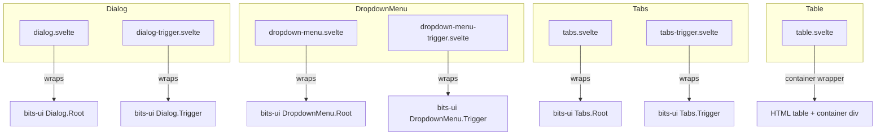
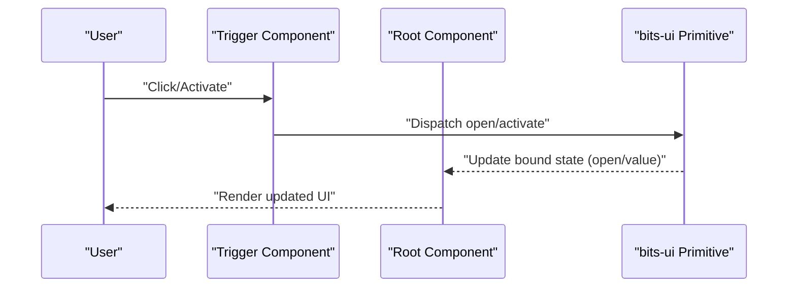
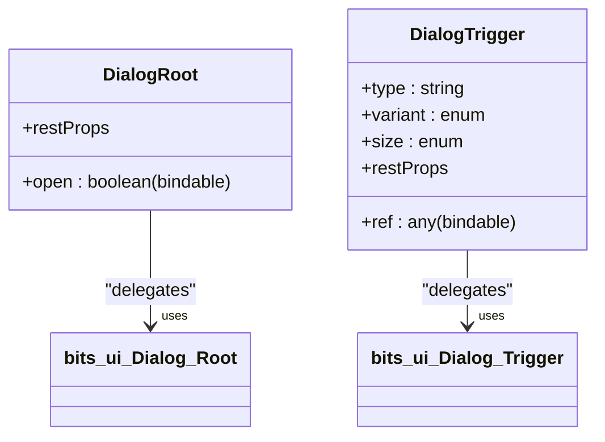
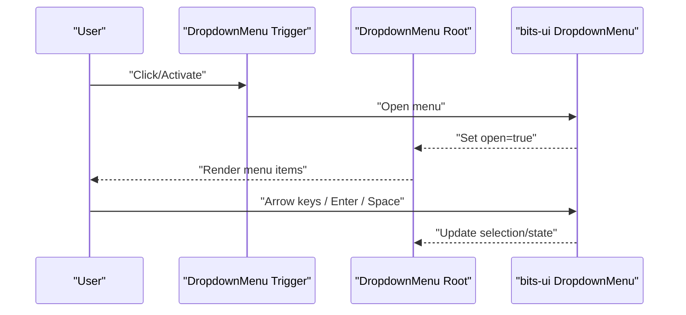
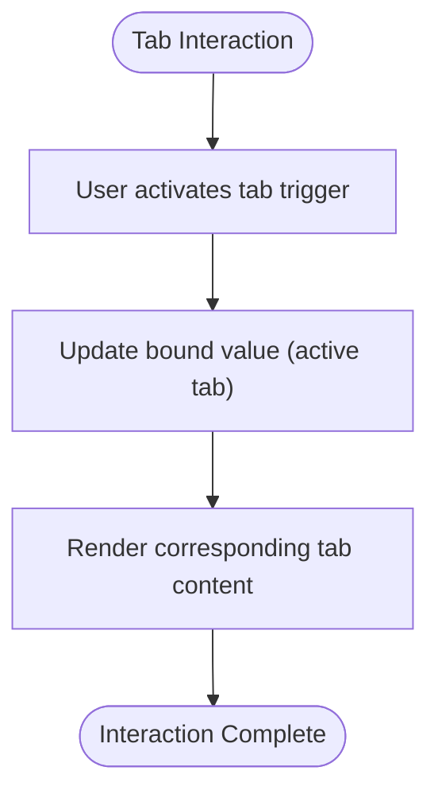
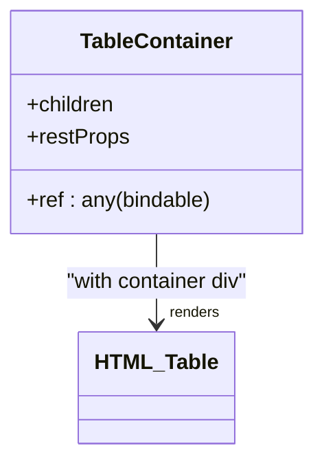
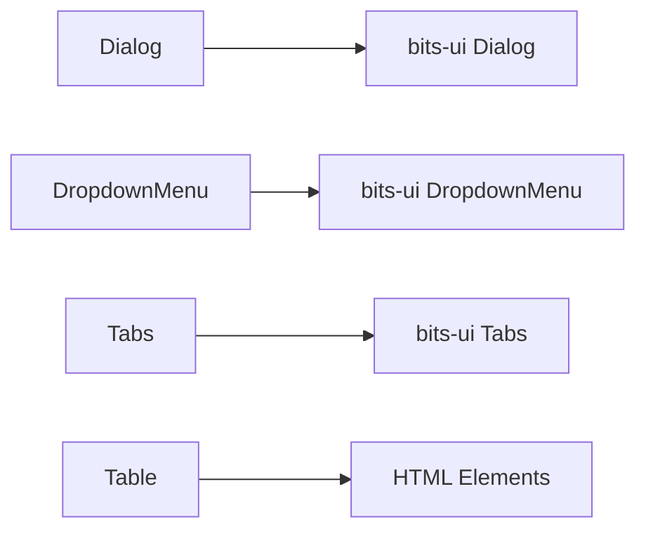

<cite>
**Referenced Files in This Document**
- [dialog.svelte](../../packages/fractalsvelte/src/lib/components/dialog/dialog.svelte)
- [dialog-trigger.svelte](../../packages/fractalsvelte/src/lib/components/dialog/dialog-trigger.svelte)
- [dropdown-menu.svelte](../../packages/fractalsvelte/src/lib/components/dropdown-menu/dropdown-menu.svelte)
- [dropdown-menu-trigger.svelte](../../packages/fractalsvelte/src/lib/components/dropdown-menu/dropdown-menu-trigger.svelte)
- [tabs.svelte](../../packages/fractalsvelte/src/lib/components/tabs/tabs.svelte)
- [tabs-trigger.svelte](../../packages/fractalsvelte/src/lib/components/tabs/tabs-trigger.svelte)
- [table.svelte](../../packages/fractalsvelte/src/lib/components/table/table.svelte)
</cite>

## Table of Contents
1. [Introduction](#introduction)
2. [Project Structure](#project-structure)
3. [Core Components](#core-components)
4. [Architecture Overview](#architecture-overview)
5. [Detailed Component Analysis](#detailed-component-analysis)
6. [Dependency Analysis](#dependency-analysis)
7. [Performance Considerations](#performance-considerations)
8. [Troubleshooting Guide](#troubleshooting-guide)
9. [Conclusion](#conclusion)

## Introduction
This document provides comprehensive guidance for complex interaction components in Fractalsvelte, focusing on Dialog, DropdownMenu, Tabs, and Table. It explains event handling, keyboard navigation, focus management, and accessibility compliance. It also includes practical patterns for modal workflows, navigation flows, data tables with sorting/filtering, and performance considerations for large datasets and smooth animations.

## Project Structure
The relevant components are implemented as thin wrappers around primitives from bits-ui, providing a consistent API surface and leveraging built-in accessibility features. Each component exposes props for state binding (e.g., open, value), element references, and slot rendering for children.

**Diagram sources**
- [dialog.svelte:1-12](../../packages/fractalsvelte/src/lib/components/dialog/dialog.svelte#L1-L12)
- [dialog-trigger.svelte:1-31](../../packages/fractalsvelte/src/lib/components/dialog/dialog-trigger.svelte#L1-L31)
- [dropdown-menu.svelte:1-12](../../packages/fractalsvelte/src/lib/components/dropdown-menu/dropdown-menu.svelte#L1-L12)
- [dropdown-menu-trigger.svelte:1-12](../../packages/fractalsvelte/src/lib/components/dropdown-menu/dropdown-menu-trigger.svelte#L1-L12)
- [tabs.svelte:1-20](../../packages/fractalsvelte/src/lib/components/tabs/tabs.svelte#L1-L20)
- [tabs-trigger.svelte:1-15](../../packages/fractalsvelte/src/lib/components/tabs/tabs-trigger.svelte#L1-L15)
- [table.svelte:1-18](../../packages/fractalsvelte/src/lib/components/table/table.svelte#L1-L18)

**Section sources**
- [dialog.svelte:1-12](../../packages/fractalsvelte/src/lib/components/dialog/dialog.svelte#L1-L12)
- [dialog-trigger.svelte:1-31](../../packages/fractalsvelte/src/lib/components/dialog/dialog-trigger.svelte#L1-L31)
- [dropdown-menu.svelte:1-12](../../packages/fractalsvelte/src/lib/components/dropdown-menu/dropdown-menu.svelte#L1-L12)
- [dropdown-menu-trigger.svelte:1-12](../../packages/fractalsvelte/src/lib/components/dropdown-menu/dropdown-menu-trigger.svelte#L1-L12)
- [tabs.svelte:1-20](../../packages/fractalsvelte/src/lib/components/tabs/tabs.svelte#L1-L20)
- [tabs-trigger.svelte:1-15](../../packages/fractalsvelte/src/lib/components/tabs/tabs-trigger.svelte#L1-L15)
- [table.svelte:1-18](../../packages/fractalsvelte/src/lib/components/table/table.svelte#L1-L18)

## Core Components
- Dialog: A modal overlay primitive wrapper exposing an open prop for two-way binding and delegating behavior to bits-ui.
- DropdownMenu: A menu primitive wrapper exposing an open prop for two-way binding and delegating behavior to bits-ui.
- Tabs: A tabbed interface primitive wrapper exposing a value prop for active tab selection and delegating behavior to bits-ui.
- Table: A responsive table container that ensures horizontal scrolling by wrapping the table in a container div.

Key implementation patterns:
- State binding via $bindable props (open, value).
- Element reference binding via ref for programmatic control.
- Slot-based composition using children rendering.
- Delegation to bits-ui primitives for accessibility and keyboard interactions.

**Section sources**
- [dialog.svelte:1-12](../../packages/fractalsvelte/src/lib/components/dialog/dialog.svelte#L1-L12)
- [dropdown-menu.svelte:1-12](../../packages/fractalsvelte/src/lib/components/dropdown-menu/dropdown-menu.svelte#L1-L12)
- [tabs.svelte:1-20](../../packages/fractalsvelte/src/lib/components/tabs/tabs.svelte#L1-L20)
- [table.svelte:1-18](../../packages/fractalsvelte/src/lib/components/table/table.svelte#L1-L18)

## Architecture Overview
The components follow a consistent architecture:
- Root components bind state and forward props to bits-ui primitives.
- Trigger components provide accessible activation points.
- Composition is achieved through slots for flexible content.
- Accessibility and keyboard navigation are handled by bits-ui primitives.

**Diagram sources**
- [dialog-trigger.svelte:1-31](../../packages/fractalsvelte/src/lib/components/dialog/dialog-trigger.svelte#L1-L31)
- [dialog.svelte:1-12](../../packages/fractalsvelte/src/lib/components/dialog/dialog.svelte#L1-L12)
- [dropdown-menu-trigger.svelte:1-12](../../packages/fractalsvelte/src/lib/components/dropdown-menu/dropdown-menu-trigger.svelte#L1-L12)
- [dropdown-menu.svelte:1-12](../../packages/fractalsvelte/src/lib/components/dropdown-menu/dropdown-menu.svelte#L1-L12)
- [tabs-trigger.svelte:1-15](../../packages/fractalsvelte/src/lib/components/tabs/tabs-trigger.svelte#L1-L15)
- [tabs.svelte:1-20](../../packages/fractalsvelte/src/lib/components/tabs/tabs.svelte#L1-L20)

## Detailed Component Analysis

### Dialog
- Purpose: Modal dialog with accessible overlay and focus management.
- Props: open (two-way binding), restProps forwarded to bits-ui.
- Triggers: Exposes trigger variant and size attributes; delegates activation to bits-ui.
- Accessibility: bits-ui handles focus trapping, Escape key dismissal, and ARIA roles.

**Diagram sources**
- [dialog.svelte:1-12](../../packages/fractalsvelte/src/lib/components/dialog/dialog.svelte#L1-L12)
- [dialog-trigger.svelte:1-31](../../packages/fractalsvelte/src/lib/components/dialog/dialog-trigger.svelte#L1-L31)

Modal workflow example:
- Open dialog via trigger click or programmatic open change.
- Focus moves into dialog; Escape closes it.
- Close triggers update open state; parent reacts accordingly.

Keyboard navigation:
- Activation via Enter/Space on trigger.
- Dismiss via Escape key.
- Focus management handled by bits-ui.

Accessibility compliance:
- ARIA roles and states managed by bits-ui primitives.
- Ensure proper labeling for dialog title and description when composing full dialogs.

**Section sources**
- [dialog.svelte:1-12](../../packages/fractalsvelte/src/lib/components/dialog/dialog.svelte#L1-L12)
- [dialog-trigger.svelte:1-31](../../packages/fractalsvelte/src/lib/components/dialog/dialog-trigger.svelte#L1-L31)

### DropdownMenu
- Purpose: Contextual menu with keyboard navigation and focus management.
- Props: open (two-way binding), restProps forwarded to bits-ui.
- Triggers: Accessible activation point delegating to bits-ui.
- Accessibility: bits-ui manages arrow key navigation, Enter/Space activation, and focus cycling.

**Diagram sources**
- [dropdown-menu-trigger.svelte:1-12](../../packages/fractalsvelte/src/lib/components/dropdown-menu/dropdown-menu-trigger.svelte#L1-L12)
- [dropdown-menu.svelte:1-12](../../packages/fractalsvelte/src/lib/components/dropdown-menu/dropdown-menu.svelte#L1-L12)

Navigation pattern:
- Activate trigger to open menu.
- Navigate items with arrow keys.
- Confirm selection with Enter/Space.
- Close via Escape or clicking outside.

Accessibility compliance:
- ARIA roles and keyboard behaviors provided by bits-ui.
- Ensure menu items are semantically correct and labeled appropriately.

**Section sources**
- [dropdown-menu.svelte:1-12](../../packages/fractalsvelte/src/lib/components/dropdown-menu/dropdown-menu.svelte#L1-L12)
- [dropdown-menu-trigger.svelte:1-12](../../packages/fractalsvelte/src/lib/components/dropdown-menu/dropdown-menu-trigger.svelte#L1-L12)

### Tabs
- Purpose: Tabbed interface for organizing content into selectable panels.
- Props: value (two-way binding) indicates active tab; ref for element access; children render tab content.
- Triggers: Accessible tab buttons delegating to bits-ui.
- Accessibility: bits-ui manages focus movement between tabs and panel association.

**Diagram sources**
- [tabs.svelte:1-20](../../packages/fractalsvelte/src/lib/components/tabs/tabs.svelte#L1-L20)
- [tabs-trigger.svelte:1-15](../../packages/fractalsvelte/src/lib/components/tabs/tabs-trigger.svelte#L1-L15)

Keyboard navigation:
- Arrow keys move focus between tabs.
- Enter/Space activates selected tab.
- bits-ui ensures correct ARIA relationships.

Best practices:
- Keep tab labels concise and descriptive.
- Ensure each tab has unique content associated via bits-ui primitives.

**Section sources**
- [tabs.svelte:1-20](../../packages/fractalsvelte/src/lib/components/tabs/tabs.svelte#L1-L20)
- [tabs-trigger.svelte:1-15](../../packages/fractalsvelte/src/lib/components/tabs/tabs-trigger.svelte#L1-L15)

### Table
- Purpose: Responsive table container enabling horizontal scrolling while preventing table shrinkage.
- Props: ref for element access; children render table structure; restProps forwarded to table element.
- Implementation: Wraps table in a container div to manage overflow behavior.

**Diagram sources**
- [table.svelte:1-18](../../packages/fractalsvelte/src/lib/components/table/table.svelte#L1-L18)

Data table patterns:
- Sorting: Manage sort state in parent; re-render rows based on sorted data.
- Filtering: Apply filters to dataset before rendering; debounce input changes.
- Pagination: Slice data per page; update bindings for current page index.

Performance considerations:
- Virtualize rows for large datasets to avoid DOM overload.
- Use memoization for computed columns and derived values.
- Debounce search inputs to reduce re-renders.

Accessibility compliance:
- Use semantic table elements (thead, tbody, tfoot) for structure.
- Provide captions and headers for clarity.
- Ensure keyboard navigability within interactive cells.

**Section sources**
- [table.svelte:1-18](../../packages/fractalsvelte/src/lib/components/table/table.svelte#L1-L18)

## Dependency Analysis
Components depend on bits-ui primitives for core functionality and accessibility. The wrappers expose a simplified API while preserving robust behavior.

**Diagram sources**
- [dialog.svelte:1-12](../../packages/fractalsvelte/src/lib/components/dialog/dialog.svelte#L1-L12)
- [dropdown-menu.svelte:1-12](../../packages/fractalsvelte/src/lib/components/dropdown-menu/dropdown-menu.svelte#L1-L12)
- [tabs.svelte:1-20](../../packages/fractalsvelte/src/lib/components/tabs/tabs.svelte#L1-L20)
- [table.svelte:1-18](../../packages/fractalsvelte/src/lib/components/table/table.svelte#L1-L18)

**Section sources**
- [dialog.svelte:1-12](../../packages/fractalsvelte/src/lib/components/dialog/dialog.svelte#L1-L12)
- [dropdown-menu.svelte:1-12](../../packages/fractalsvelte/src/lib/components/dropdown-menu/dropdown-menu.svelte#L1-L12)
- [tabs.svelte:1-20](../../packages/fractalsvelte/src/lib/components/tabs/tabs.svelte#L1-L20)
- [table.svelte:1-18](../../packages/fractalsvelte/src/lib/components/table/table.svelte#L1-L18)

## Performance Considerations
- Large datasets: Implement virtual scrolling or pagination to limit DOM nodes.
- Animations: Prefer CSS transitions and GPU-accelerated properties; avoid heavy JS animations.
- Re-renders: Minimize unnecessary updates by using stable references and memoization.
- Event handling: Debounce frequent events (e.g., search input) to reduce processing overhead.

[No sources needed since this section provides general guidance]

## Troubleshooting Guide
Common issues and resolutions:
- Dialog not closing: Ensure Escape key is not intercepted; verify open state binding.
- DropdownMenu not navigating: Check that trigger is correctly associated; confirm focus is within menu.
- Tabs not switching: Verify value binding matches tab identifiers; ensure content renders based on value.
- Table overflow issues: Confirm container div allows horizontal scroll; ensure table width does not shrink.

Debugging tips:
- Log state changes for open/value props to track updates.
- Inspect ARIA attributes to validate accessibility.
- Use browser dev tools to monitor re-renders and identify bottlenecks.

**Section sources**
- [dialog.svelte:1-12](../../packages/fractalsvelte/src/lib/components/dialog/dialog.svelte#L1-L12)
- [dropdown-menu.svelte:1-12](../../packages/fractalsvelte/src/lib/components/dropdown-menu/dropdown-menu.svelte#L1-L12)
- [tabs.svelte:1-20](../../packages/fractalsvelte/src/lib/components/tabs/tabs.svelte#L1-L20)
- [table.svelte:1-18](../../packages/fractalsvelte/src/lib/components/table/table.svelte#L1-L18)

## Conclusion
Fractalsvelte’s complex interaction components provide a consistent, accessible, and performant foundation for building sophisticated UIs. By leveraging bits-ui primitives and adhering to best practices for event handling, keyboard navigation, and focus management, developers can create robust modal workflows, navigation patterns, and data tables. For large datasets and smooth animations, prioritize virtualization, memoization, and efficient styling techniques.

[No sources needed since this section summarizes without analyzing specific files]
