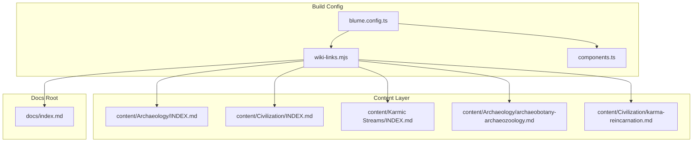
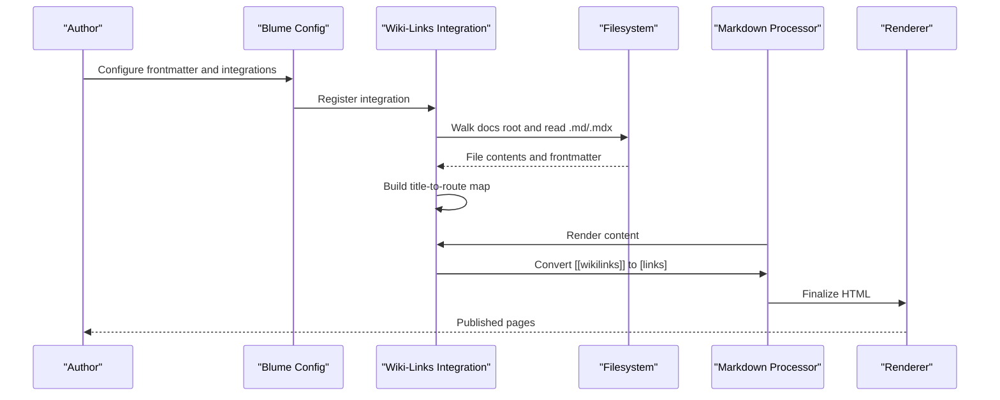
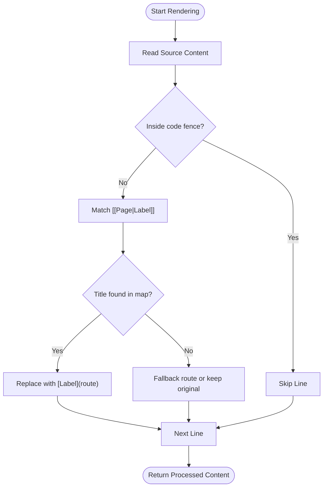
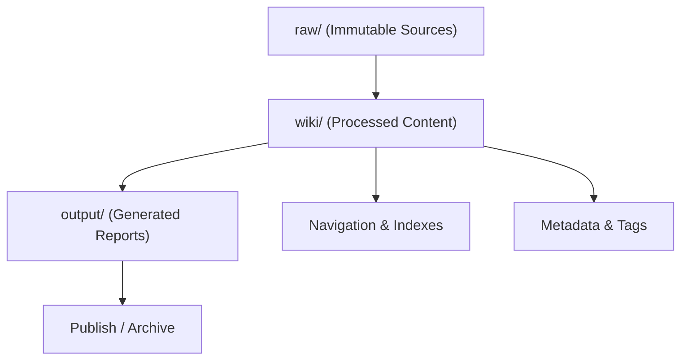
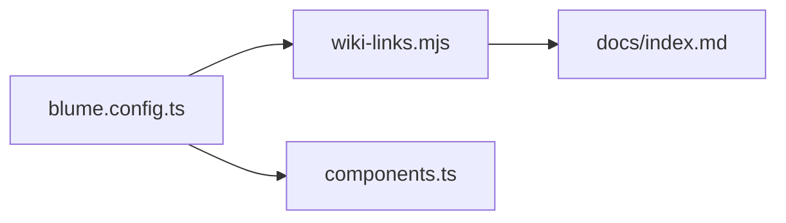

<cite>
**Referenced Files in This Document**
- [blume.config.ts](../../sites/fractalhome/blume.config.ts)
- [wiki-links.mjs](../../sites/fractalhome/wiki-links.mjs)
- [components.ts](../../sites/fractalhome/components.ts)
- [Archaeology INDEX.md](../../sites/fractalhome/content/Archaeology/INDEX.md)
- [Civilization INDEX.md](../../sites/fractalhome/content/Civilization/INDEX.md)
- [Karmic Streams INDEX.md](../../sites/fractalhome/content/Karmic Streams/INDEX.md)
- [archaeobotany-archaeozoology.md](../../sites/fractalhome/content/Archaeology/archaeobotany-archaeozoology.md)
- [karma-reincarnation.md](../../sites/fractalhome/content/Civilization/karma-reincarnation.md)
- [docs index.md](../../sites/fractalhome/docs/index.md)
</cite>

## Table of Contents
1. [Introduction](#introduction)
2. [Project Structure](#project-structure)
3. [Core Components](#core-components)
4. [Architecture Overview](#architecture-overview)
5. [Detailed Component Analysis](#detailed-component-analysis)
6. [Dependency Analysis](#dependency-analysis)
7. [Performance Considerations](#performance-considerations)
8. [Troubleshooting Guide](#troubleshooting-guide)
9. [Conclusion](#conclusion)
10. [Appendices](#appendices)

## Introduction
This document explains FractalHome’s content management system and its three-layer architecture:
- raw/ directory for immutable sources (external source material, reference documents, and canonical texts)
- wiki/ directory for processed content with index.md and log.md files (curated, structured knowledge pages)
- output/ directory for generated reports (rendered artifacts, indexes, and exports)

It also covers content organization across categories such as Archaeology, Civilization, History, Karmic Streams, and Writings; the wiki-link system for cross-referencing; metadata management; and migration workflows from external sources into the wiki layer.

## Project Structure
FractalHome is a Blume-powered documentation site built on Astro/Vite. The repository includes:
- A configuration file that defines frontmatter schema, navigation, theme, and integrations
- A custom integration that implements the wiki-link system
- Category-based content directories with index pages and topic pages
- A docs root used by the build pipeline to resolve links and render content

**Diagram sources**
- [blume.config.ts:1-67](../../sites/fractalhome/blume.config.ts#L1-L67)
- [wiki-links.mjs:1-125](../../sites/fractalhome/wiki-links.mjs#L1-L125)
- [components.ts:1-12](../../sites/fractalhome/components.ts#L1-L12)
- [Archaeology INDEX.md:1-88](../../sites/fractalhome/content/Archaeology/INDEX.md#L1-L88)
- [Civilization INDEX.md:1-19](../../sites/fractalhome/content/Civilization/INDEX.md#L1-L19)
- [Karmic Streams INDEX.md:1-61](../../sites/fractalhome/content/Karmic Streams/INDEX.md#L1-L61)
- [archaeobotany-archaeozoology.md:1-62](../../sites/fractalhome/content/Archaeology/archaeobotany-archaeozoology.md#L1-L62)
- [karma-reincarnation.md:1-68](../../sites/fractalhome/content/Civilization/karma-reincarnation.md#L1-L68)
- [docs index.md:1-9](../../sites/fractalhome/docs/index.md#L1-L9)

**Section sources**
- [blume.config.ts:1-67](../../sites/fractalhome/blume.config.ts#L1-L67)
- [wiki-links.mjs:1-125](../../sites/fractalhome/wiki-links.mjs#L1-L125)
- [components.ts:1-12](../../sites/fractalhome/components.ts#L1-L12)
- [docs index.md:1-9](../../sites/fractalhome/docs/index.md#L1-L9)

## Core Components
- Blume configuration: Defines title, description, integrations, frontmatter schema, navigation, and theme settings. It registers the wiki-links integration and extends frontmatter fields for tags, sources, related items, timestamps, and more.
- Wiki-links integration: Scans the docs root to build a title-to-route map, converts wiki-style links into standard markdown links at render time, and patches the Markdown processor so all renderers see the transformation.
- Components registry: Declares layout components exposed to Blume/Astro.

Key responsibilities:
- Frontmatter validation and extension
- Link resolution and conversion
- Renderer patching to ensure consistent behavior across components

**Section sources**
- [blume.config.ts:1-67](../../sites/fractalhome/blume.config.ts#L1-L67)
- [wiki-links.mjs:1-125](../../sites/fractalhome/wiki-links.mjs#L1-L125)
- [components.ts:1-12](../../sites/fractalhome/components.ts#L1-L12)

## Architecture Overview
The content pipeline follows a clear flow:
- Authors write in the content layer (category folders with index and topic pages).
- The wiki-links integration scans the docs root to build a mapping of page titles to routes.
- During rendering, wiki-style links are converted to standard markdown links using the resolved routes.
- Blume renders the final pages using the configured theme and components.

**Diagram sources**
- [blume.config.ts:1-67](../../sites/fractalhome/blume.config.ts#L1-L67)
- [wiki-links.mjs:1-125](../../sites/fractalhome/wiki-links.mjs#L1-L125)

## Detailed Component Analysis

### Wiki-Links System
The wiki-link system enables author-friendly internal references using a simple syntax. It:
- Parses frontmatter to extract titles
- Builds a map from titles (and normalized filenames) to routes
- Converts wiki-style links into standard markdown links during rendering
- Patches both regular and MDX renderers to ensure consistency

**Diagram sources**
- [wiki-links.mjs:1-125](../../sites/fractalhome/wiki-links.mjs#L1-L125)

**Section sources**
- [wiki-links.mjs:1-125](../../sites/fractalhome/wiki-links.mjs#L1-L125)

### Frontmatter Schema and Metadata
Frontmatter fields are extended via the Blume configuration to support rich metadata:
- Tags: categorization and filtering
- Sources: provenance identifiers (e.g., volume codes)
- Related: cross-references between topics
- Timestamps and creation/update dates
- Links: external resources with names and URLs

These fields enable robust indexing, navigation, and traceability across the knowledge base.

**Section sources**
- [blume.config.ts:9-25](../../sites/fractalhome/blume.config.ts#L9-L25)

### Category Index Pages
Each category contains an index page that:
- Provides a high-level overview
- Lists key topics with links
- Includes metadata like knowledge-bank identifiers, tags, sources, related topics, and timestamps

Examples include:
- Archaeology Knowledge Bank index
- Civilization index
- Karmic Streams index

These pages serve as entry points and navigational hubs within each domain.

**Section sources**
- [Archaeology INDEX.md:1-88](../../sites/fractalhome/content/Archaeology/INDEX.md#L1-L88)
- [Civilization INDEX.md:1-19](../../sites/fractalhome/content/Civilization/INDEX.md#L1-L19)
- [Karmic Streams INDEX.md:1-61](../../sites/fractalhome/content/Karmic Streams/INDEX.md#L1-L61)

### Topic Pages and Cross-References
Topic pages follow a consistent structure:
- Title and description in frontmatter
- Tags for discoverability
- Sources referencing volumes or works
- Related entries linking to adjacent topics
- Timestamps indicating last update

Example topics include archaeobotany/archaeozoology studies and karma/reincarnation discussions, demonstrating how metadata and cross-references tie together the knowledge graph.

**Section sources**
- [archaeobotany-archaeozoology.md:1-62](../../sites/fractalhome/content/Archaeology/archaeobotany-archaeozoology.md#L1-L62)
- [karma-reincarnation.md:1-68](../../sites/fractalhome/content/Civilization/karma-reincarnation.md#L1-L68)

### Conceptual Overview
The three-layer architecture separates concerns:
- raw/: Immutable sources (external documents, reference materials)
- wiki/: Processed content (index.md and log.md per category, curated pages)
- output/: Generated reports (rendered artifacts, indexes, exports)

This separation ensures immutability of sources, clarity of processed content, and reproducibility of outputs.

[No sources needed since this diagram shows conceptual workflow, not actual code structure]

## Dependency Analysis
The build-time dependencies among core modules:
- blume.config.ts imports and registers the wiki-links integration
- wiki-links.mjs reads the docs root to build the title-to-route map
- components.ts exposes layout components to Blume

**Diagram sources**
- [blume.config.ts:1-67](../../sites/fractalhome/blume.config.ts#L1-L67)
- [wiki-links.mjs:1-125](../../sites/fractalhome/wiki-links.mjs#L1-L125)
- [components.ts:1-12](../../sites/fractalhome/components.ts#L1-L12)
- [docs index.md:1-9](../../sites/fractalhome/docs/index.md#L1-L9)

**Section sources**
- [blume.config.ts:1-67](../../sites/fractalhome/blume.config.ts#L1-L67)
- [wiki-links.mjs:1-125](../../sites/fractalhome/wiki-links.mjs#L1-L125)
- [components.ts:1-12](../../sites/fractalhome/components.ts#L1-L12)

## Performance Considerations
- Title-to-route map construction: Scanning the docs root occurs once at config setup; ensure the docs directory remains organized to minimize traversal overhead.
- Renderer patching: Wrapping renderers adds minimal overhead but ensures consistent link conversion across all markdown processing paths.
- Large content sets: Keep index pages concise and avoid excessive nested lists to reduce render time.
- Caching: If integrating with caching layers, ensure the title map and rendered content are invalidated when docs change.

[No sources needed since this section provides general guidance]

## Troubleshooting Guide
Common issues and resolutions:
- Broken wiki links: Ensure titles in [[wikilinks]] match frontmatter titles exactly (case-insensitive fallback exists). Verify the docs root path used by the integration.
- Missing routes: Confirm that index.md files exist for categories and that topic pages have valid frontmatter titles.
- Code fences: Wiki-link conversion skips fenced code blocks; if links inside code fences are expected, adjust expectations or escape them appropriately.
- Frontmatter validation errors: Validate fields against the extended schema defined in the configuration.

**Section sources**
- [wiki-links.mjs:1-125](../../sites/fractalhome/wiki-links.mjs#L1-L125)
- [blume.config.ts:9-25](../../sites/fractalhome/blume.config.ts#L9-L25)

## Conclusion
FractalHome’s content management system leverages a clean three-layer architecture and a powerful wiki-link system to maintain a scalable, cross-referenced knowledge base. With robust frontmatter metadata, consistent category organization, and a reliable build-time pipeline, it supports comprehensive coverage across domains like Archaeology, Civilization, History, Karmic Streams, and Writings.

[No sources needed since this section summarizes without analyzing specific files]

## Appendices

### Migration Workflow from External Sources
Recommended steps to migrate content from raw sources into the wiki layer:
- Ingest raw sources into raw/ (immutable)
- Extract key facts and synthesize into wiki/ topic pages with proper frontmatter
- Create or update category index.md files to reflect new content
- Add log.md entries to track changes and provenance
- Generate output/ reports and indexes for publishing

[No sources needed since this section provides general guidance]
