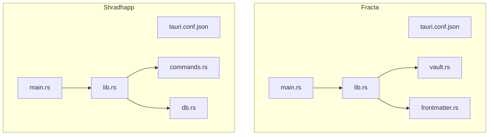
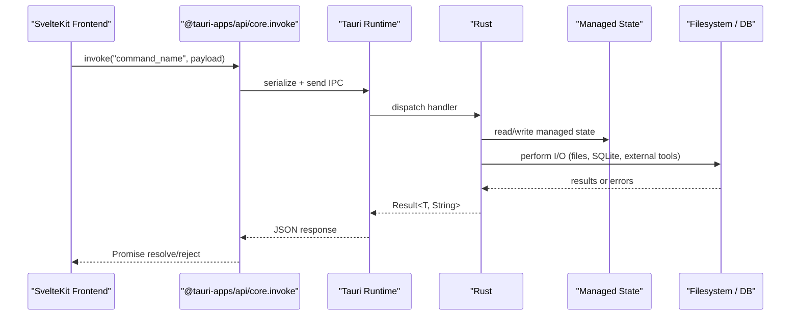
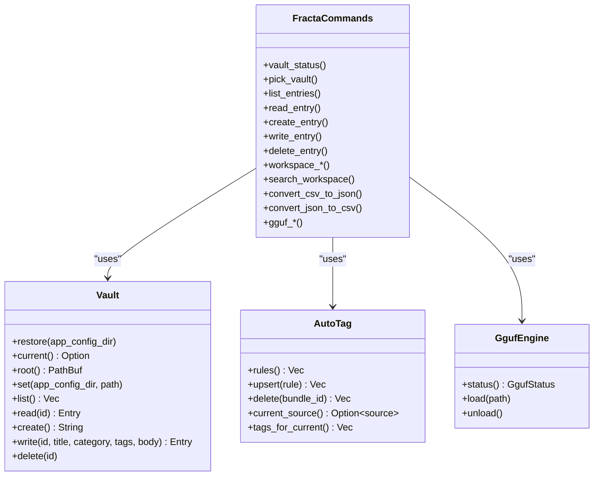
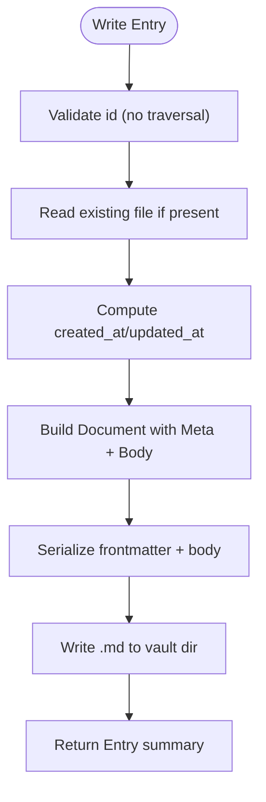
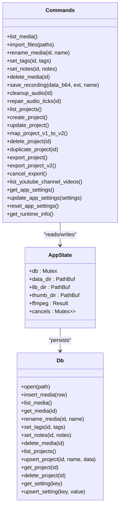
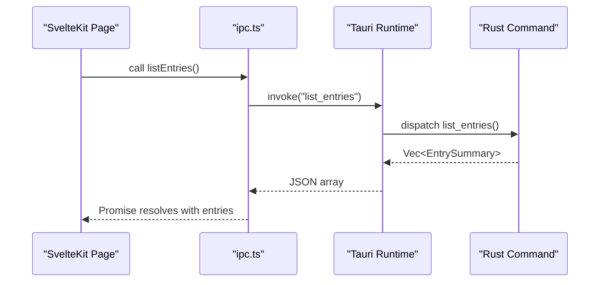
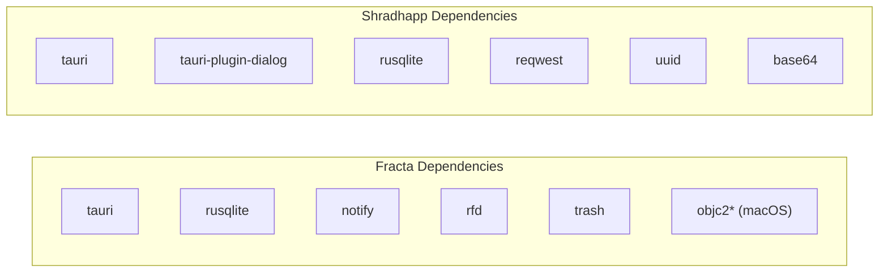

<cite>
**Referenced Files in This Document**
- [apps/fracta/src-tauri/Cargo.toml](../../apps/fracta/src-tauri/Cargo.toml)
- [apps/shradhapp/src-tauri/Cargo.toml](../../apps/shradhapp/src-tauri/Cargo.toml)
- [apps/fracta/src-tauri/src/main.rs](../../apps/fracta/src-tauri/src/main.rs)
- [apps/shradhapp/src-tauri/src/main.rs](../../apps/shradhapp/src-tauri/src/main.rs)
- [apps/fracta/src-tauri/tauri.conf.json](../../apps/fracta/src-tauri/tauri.conf.json)
- [apps/shradhapp/src-tauri/tauri.conf.json](../../apps/shradhapp/src-tauri/tauri.conf.json)
- [apps/fracta/src-tauri/src/lib.rs](../../apps/fracta/src-tauri/src/lib.rs)
- [apps/shradhapp/src-tauri/src/lib.rs](../../apps/shradhapp/src-tauri/src/lib.rs)
- [apps/fracta/src-tauri/src/frontmatter.rs](../../apps/fracta/src-tauri/src/frontmatter.rs)
- [apps/fracta/src-tauri/src/vault.rs](../../apps/fracta/src-tauri/src/vault.rs)
- [apps/shradhapp/src-tauri/src/commands.rs](../../apps/shradhapp/src-tauri/src/commands.rs)
- [apps/shradhapp/src-tauri/src/db.rs](../../apps/shradhapp/src-tauri/src/db.rs)
- [apps/fracta/src/lib/ipc.ts](../../apps/fracta/src/lib/ipc.ts)
</cite>

## Table of Contents
1. Introduction
2. Project Structure
3. Core Components
4. Architecture Overview
5. Detailed Component Analysis
6. Dependency Analysis
7. Performance Considerations
8. Troubleshooting Guide
9. Conclusion

## Introduction
This document explains the core Tauri architecture patterns used across two applications in the monorepo: Fracta (a knowledge vault and workspace editor) and Shradhapp (a personal video assembly app). It covers Rust-based backend initialization, command registration, IPC between SvelteKit frontend and Rust backend, application lifecycle, error handling strategies, cross-platform considerations, configuration management, security model, and the separation between Fracta and Shradhapp backends with shared library patterns.

## Project Structure
Each Tauri app follows a consistent layout:
- Frontend built by SvelteKit (Vite), served during development or bundled into the app binary.
- Backend implemented in Rust under src-tauri, with a minimal main.rs delegating to a library crate’s run() entry point.
- Configuration via tauri.conf.json for windowing, security, and bundling.
- Commands exposed to the frontend via #[tauri::command] macros and registered through tauri::generate_handler!.

**Diagram sources**
- [apps/fracta/src-tauri/src/main.rs](../../apps/fracta/src-tauri/src/main.rs)
- [apps/fracta/src-tauri/src/lib.rs](../../apps/fracta/src-tauri/src/lib.rs)
- [apps/fracta/src-tauri/src/vault.rs](../../apps/fracta/src-tauri/src/vault.rs)
- [apps/fracta/src-tauri/src/frontmatter.rs](../../apps/fracta/src-tauri/src/frontmatter.rs)
- [apps/shradhapp/src-tauri/src/main.rs](../../apps/shradhapp/src-tauri/src/main.rs)
- [apps/shradhapp/src-tauri/src/lib.rs](../../apps/shradhapp/src-tauri/src/lib.rs)
- [apps/shradhapp/src-tauri/src/commands.rs](../../apps/shradhapp/src-tauri/src/commands.rs)
- [apps/shradhapp/src-tauri/src/db.rs](../../apps/shradhapp/src-tauri/src/db.rs)

**Section sources**
- [apps/fracta/src-tauri/Cargo.toml](../../apps/fracta/src-tauri/Cargo.toml)
- [apps/shradhapp/src-tauri/Cargo.toml](../../apps/shradhapp/src-tauri/Cargo.toml)
- [apps/fracta/src-tauri/tauri.conf.json](../../apps/fracta/src-tauri/tauri.conf.json)
- [apps/shradhapp/src-tauri/tauri.conf.json](../../apps/shradhapp/src-tauri/tauri.conf.json)

## Core Components
- Application entry points:
  - Fracta: main.rs delegates to fracta_lib::run().
  - Shradhapp: main.rs delegates to mom_video_studio_lib::run().
- Tauri builder setup:
  - Plugins (window-state, dialog).
  - State management (Vault, AutoTag, GgufEngine; AppState for Shradhapp).
  - Setup hooks for persistence and background tasks.
  - Command registration using tauri::generate_handler! with typed functions.
- IPC surface:
  - Fracta exposes commands for vault operations, workspace file I/O, search, terminal execution, auto-tagging, and GGUF engine control.
  - Shradhapp exposes commands for media bank CRUD, project management, audio processing, YouTube listing, and settings.

**Section sources**
- [apps/fracta/src-tauri/src/main.rs](../../apps/fracta/src-tauri/src/main.rs)
- [apps/shradhapp/src-tauri/src/main.rs](../../apps/shradhapp/src-tauri/src/main.rs)
- [apps/fracta/src-tauri/src/lib.rs](../../apps/fracta/src-tauri/src/lib.rs)
- [apps/shradhapp/src-tauri/src/lib.rs](../../apps/shradhapp/src-tauri/src/lib.rs)

## Architecture Overview
The runtime flow is:
- The OS launches the native binary.
- main.rs calls the library’s run() function.
- Tauri::Builder configures plugins, manages state, runs setup, registers commands, and starts the webview.
- The SvelteKit frontend invokes commands via @tauri-apps/api/core invoke(), which routes to the corresponding Rust #[tauri::command].

**Diagram sources**
- [apps/fracta/src-tauri/src/lib.rs](../../apps/fracta/src-tauri/src/lib.rs)
- [apps/shradhapp/src-tauri/src/lib.rs](../../apps/shradhapp/src-tauri/src/lib.rs)
- [apps/fracta/src/lib/ipc.ts](../../apps/fracta/src/lib/ipc.ts)

## Detailed Component Analysis

### Fracta Backend: Initialization and Command Registration
- Entry point: main.rs calls fracta_lib::run().
- Builder:
  - Adds window-state plugin on desktop platforms.
  - Manages Vault, AutoTag, and GgufEngine states.
  - Setup restores persisted vault path and initializes autotag watcher.
  - Registers a comprehensive set of commands covering vault, workspace, search, terminal, printing, auto-tagging, and GGUF engine.
- Error handling:
  - Commands return Result types with descriptive strings on failure.
  - Filesystem operations are guarded against traversal attacks and invalid IDs.
  - Long-running shell commands are bounded by timeouts and output size limits.

**Diagram sources**
- [apps/fracta/src-tauri/src/lib.rs](../../apps/fracta/src-tauri/src/lib.rs)
- [apps/fracta/src-tauri/src/vault.rs](../../apps/fracta/src-tauri/src/vault.rs)

**Section sources**
- [apps/fracta/src-tauri/src/lib.rs](../../apps/fracta/src-tauri/src/lib.rs)

### Fracta Data Layer: Frontmatter and Vault
- Frontmatter parser:
  - Minimal YAML-like parser for title, category, tags, timestamps.
  - Permissive on read, strict on write; handles edge cases like BOM, CRLF, quoted scalars, and flow sequences.
  - Derives titles from body when needed and supports legacy auto-title migration.
- Vault:
  - Persists entries as .md files within a user-selected folder.
  - Enforces safe ID-to-path mapping to prevent traversal.
  - Maintains created_at/updated_at using both frontmatter and filesystem metadata.
  - Provides list/read/create/write/delete operations with robust error messages.

**Diagram sources**
- [apps/fracta/src-tauri/src/vault.rs](../../apps/fracta/src-tauri/src/vault.rs)
- [apps/fracta/src-tauri/src/frontmatter.rs](../../apps/fracta/src-tauri/src/frontmatter.rs)

**Section sources**
- [apps/fracta/src-tauri/src/frontmatter.rs](../../apps/fracta/src-tauri/src/frontmatter.rs)
- [apps/fracta/src-tauri/src/vault.rs](../../apps/fracta/src-tauri/src/vault.rs)

### Shradhapp Backend: Initialization and Command Surface
- Entry point: main.rs calls mom_video_studio_lib::run().
- Builder:
  - Initializes dialog plugin.
  - Creates data/library/thumbnail directories under app data.
  - Opens SQLite database and locates ffmpeg.
  - Manages AppState containing db, paths, ffmpeg result, and cancellation map.
  - Registers commands for media, projects, settings, and utilities.
- Error handling:
  - All commands return Result<T, String>.
  - Database operations wrap rusqlite errors into user-friendly messages.
  - External tool availability is captured at startup and surfaced via runtime info.

**Diagram sources**
- [apps/shradhapp/src-tauri/src/lib.rs](../../apps/shradhapp/src-tauri/src/lib.rs)
- [apps/shradhapp/src-tauri/src/commands.rs](../../apps/shradhapp/src-tauri/src/commands.rs)
- [apps/shradhapp/src-tauri/src/db.rs](../../apps/shradhapp/src-tauri/src/db.rs)

**Section sources**
- [apps/shradhapp/src-tauri/src/lib.rs](../../apps/shradhapp/src-tauri/src/lib.rs)
- [apps/shradhapp/src-tauri/src/commands.rs](../../apps/shradhapp/src-tauri/src/commands.rs)
- [apps/shradhapp/src-tauri/src/db.rs](../../apps/shradhapp/src-tauri/src/db.rs)

### IPC Between SvelteKit and Rust
- Fracta frontend uses @tauri-apps/api/core.invoke to call commands defined in lib.rs.
- Types are mirrored in TypeScript (ipc.ts) to ensure compile-time safety.
- Example flows:
  - Vault status check and selection.
  - Workspace file read/write and preview.
  - Terminal execution with bounded output and timeout.
  - Search index rebuild and query.
  - Auto-tag rules management and clipboard source detection.
  - GGUF model load/unload.

**Diagram sources**
- [apps/fracta/src/lib/ipc.ts](../../apps/fracta/src/lib/ipc.ts)
- [apps/fracta/src-tauri/src/lib.rs](../../apps/fracta/src-tauri/src/lib.rs)

**Section sources**
- [apps/fracta/src/lib/ipc.ts](../../apps/fracta/src/lib/ipc.ts)

### Configuration Management
- Fracta:
  - tauri.conf.json defines window properties, CSP, and bundle icons.
  - App config stored under app config directory (config.json) persists vault path.
- Shradhapp:
  - tauri.conf.json enables asset protocol scoped to $APPDATA.
  - Settings persisted in SQLite settings table with normalization and defaults.

**Section sources**
- [apps/fracta/src-tauri/tauri.conf.json](../../apps/fracta/src-tauri/tauri.conf.json)
- [apps/shradhapp/src-tauri/tauri.conf.json](../../apps/shradhapp/src-tauri/tauri.conf.json)
- [apps/fracta/src-tauri/src/vault.rs](../../apps/fracta/src-tauri/src/vault.rs)
- [apps/shradhapp/src-tauri/src/commands.rs](../../apps/shradhapp/src-tauri/src/commands.rs)
- [apps/shradhapp/src-tauri/src/db.rs](../../apps/shradhapp/src-tauri/src/db.rs)

### Security Model
- Content Security Policy:
  - Fracta sets a restrictive CSP allowing self, ipc, localhost, and https connections.
- Asset Protocol:
  - Shradhapp enables asset protocol restricted to $APPDATA/** for secure local assets.
- Input Validation:
  - Fracta validates entry ids to prevent path traversal.
  - Shell commands are user-supplied but executed with bounded runtime and output limits.
- Platform-specific dependencies:
  - macOS-only clipboard/source detection via objc2 crates; other platforms get no-op watchers.

**Section sources**
- [apps/fracta/src-tauri/tauri.conf.json](../../apps/fracta/src-tauri/tauri.conf.json)
- [apps/shradhapp/src-tauri/tauri.conf.json](../../apps/shradhapp/src-tauri/tauri.conf.json)
- [apps/fracta/src-tauri/src/vault.rs](../../apps/fracta/src-tauri/src/vault.rs)
- [apps/fracta/src-tauri/Cargo.toml](../../apps/fracta/src-tauri/Cargo.toml)

### Cross-Platform Considerations
- Conditional compilation:
  - Windows hides console in release builds.
  - Window-state plugin only on non-mobile targets.
  - macOS-specific dependencies for clipboard monitoring.
- Shell invocation:
  - Uses cmd on Windows and sh -lc elsewhere.
- Paths and storage:
  - Uses platform-provided app config/data directories via tauri::path APIs.

**Section sources**
- [apps/fracta/src-tauri/src/main.rs](../../apps/fracta/src-tauri/src/main.rs)
- [apps/shradhapp/src-tauri/src/main.rs](../../apps/shradhapp/src-tauri/src/main.rs)
- [apps/fracta/src-tauri/Cargo.toml](../../apps/fracta/src-tauri/Cargo.toml)
- [apps/fracta/src-tauri/src/lib.rs](../../apps/fracta/src-tauri/src/lib.rs)

### Separation Between Fracta and Shradhapp Backends
- Fracta:
  - Library crate fracta_lib exposes run() and domain modules (vault, frontmatter, workspace, search, gguf).
  - Focuses on markdown vault, recursive workspace, search indexing, and optional local LLM server integration.
- Shradhapp:
  - Library crate mom_video_studio_lib exposes run() and command handlers backed by SQLite and ffmpeg.
  - Focuses on media import, thumbnails, voiceover recording, project management, and export workflows.
- Shared patterns:
  - Both use tauri::Builder, manage state, register commands, and persist data securely.

**Section sources**
- [apps/fracta/src-tauri/Cargo.toml](../../apps/fracta/src-tauri/Cargo.toml)
- [apps/shradhapp/src-tauri/Cargo.toml](../../apps/shradhapp/src-tauri/Cargo.toml)
- [apps/fracta/src-tauri/src/lib.rs](../../apps/fracta/src-tauri/src/lib.rs)
- [apps/shradhapp/src-tauri/src/lib.rs](../../apps/shradhapp/src-tauri/src/lib.rs)

## Dependency Analysis
- Fracta dependencies include serde, serde_json, rusqlite, csv, lopdf, quick-xml, zip, tauri, rfd, trash, notify, and macOS-specific objc2 crates.
- Shradhapp dependencies include tauri, tauri-plugin-dialog, serde, serde_json, rusqlite, uuid, base64, and reqwest for HTTP requests.

**Diagram sources**
- [apps/fracta/src-tauri/Cargo.toml](../../apps/fracta/src-tauri/Cargo.toml)
- [apps/shradhapp/src-tauri/Cargo.toml](../../apps/shradhapp/src-tauri/Cargo.toml)

**Section sources**
- [apps/fracta/src-tauri/Cargo.toml](../../apps/fracta/src-tauri/Cargo.toml)
- [apps/shradhapp/src-tauri/Cargo.toml](../../apps/shradhapp/src-tauri/Cargo.toml)

## Performance Considerations
- Fracta:
  - Workspace watcher emits events for incremental updates; frontend re-lists via commands as fallback.
  - Terminal command outputs are bounded and truncated to avoid memory spikes.
  - Search index rebuild is explicit to avoid blocking UI.
- Shradhapp:
  - Thumbnails and waveforms generated lazily and cached under thumbnail directory.
  - SQLite WAL mode improves concurrency and durability.
  - Heavy operations (ffmpeg, network) run off the async runtime thread pool.

[No sources needed since this section provides general guidance]

## Troubleshooting Guide
- Common issues:
  - No vault configured: Fracta prompts to pick a folder on first launch.
  - Missing ffmpeg: Shradhapp logs a warning and disables media processing features.
  - Database errors: Wrapped into user-friendly messages; check permissions and disk space.
  - CSP errors: Ensure URLs match allowed connect-src and default-src policies.
- Diagnostics:
  - Fracta: Use workspace graph and link reports to validate structure.
  - Shradhapp: Use get_runtime_info to verify directories and ffmpeg availability.

**Section sources**
- [apps/fracta/src-tauri/src/lib.rs](../../apps/fracta/src-tauri/src/lib.rs)
- [apps/shradhapp/src-tauri/src/lib.rs](../../apps/shradhapp/src-tauri/src/lib.rs)
- [apps/shradhapp/src-tauri/src/commands.rs](../../apps/shradhapp/src-tauri/src/commands.rs)

## Conclusion
Both Fracta and Shradhapp demonstrate robust Tauri patterns: clear separation of concerns, strong typing across IPC, secure configuration, and resilient error handling. Fracta emphasizes file-based knowledge management with rich workspace capabilities, while Shradhapp focuses on media-centric workflows with SQLite-backed persistence and external tool integration. These patterns provide a solid foundation for cross-platform desktop applications with modern web frontends.
