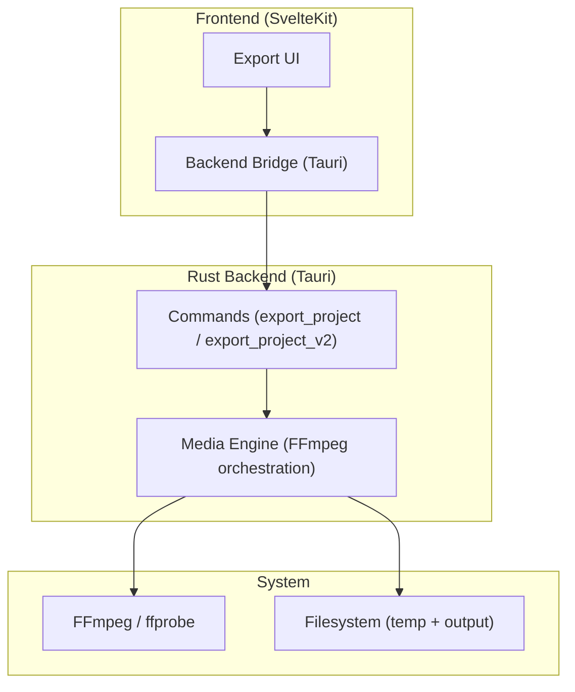
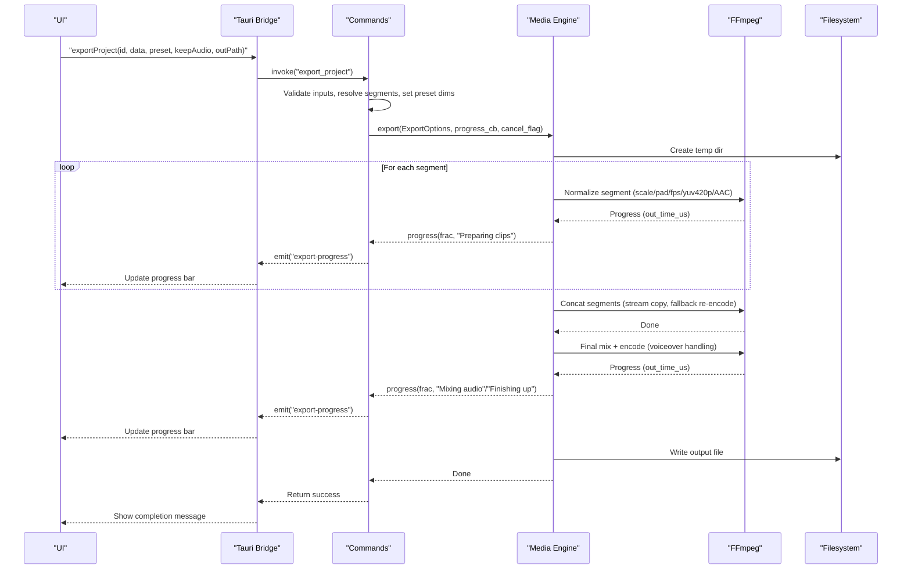
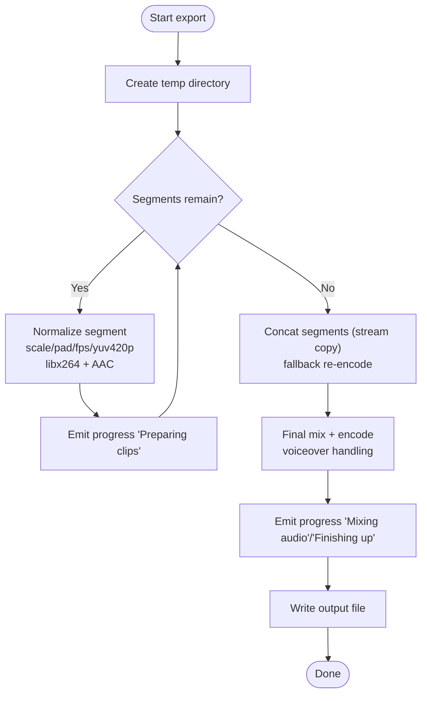
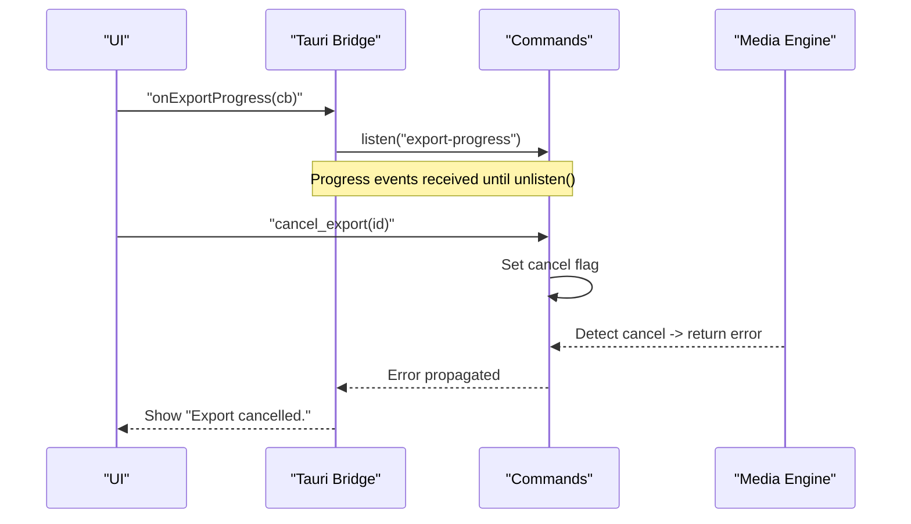
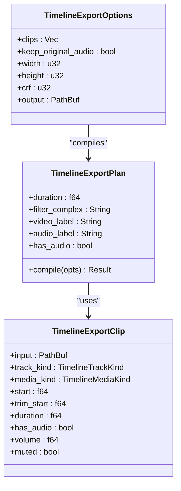
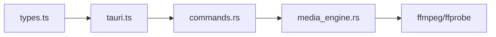

<cite>
**Referenced Files in This Document**
- `apps/shradhapp/README.md`
- `apps/shradhapp/docs/user/05-exporting.md`
- `apps/shradhapp/src-tauri/src/media_engine.rs`
- `apps/shradhapp/src-tauri/src/commands.rs`
- `apps/shradhapp/src/lib/backend/types.ts`
- `apps/shradhapp/src/lib/backend/tauri.ts`
</cite>

## Table of Contents
1. [Introduction](#introduction)
2. [Project Structure](#project-structure)
3. [Core Components](#core-components)
4. [Architecture Overview](#architecture-overview)
5. [Detailed Component Analysis](#detailed-component-analysis)
6. [Dependency Analysis](#dependency-analysis)
7. [Performance Considerations](#performance-considerations)
8. [Troubleshooting Guide](#troubleshooting-guide)
9. [Conclusion](#conclusion)
10. [Appendices](#appendices)

## Introduction
This document explains the ShradhApp export pipeline that converts a project’s clips, trims, and optional voiceover into a single video file using FFmpeg. It covers how presets map to resolution, bitrate quality (CRF), codec selection, and output formats; how progress is streamed back to the UI; how errors are handled; and how background processing enables cancellation and non-blocking exports. It also includes guidance for custom presets, batch workflows, performance tuning, and troubleshooting common issues.

## Project Structure
ShradhApp is a Tauri desktop app with a SvelteKit frontend and a Rust backend. The export pipeline is implemented entirely in the Rust backend, which shells out to FFmpeg/ffprobe through a dedicated media engine module. The frontend invokes typed Tauri commands and listens for progress events.

**Diagram sources**
- `apps/shradhapp/README.md#L43-L79`
- `apps/shradhapp/src-tauri/src/media_engine.rs#L1-L10`
- `apps/shradhapp/src-tauri/src/commands.rs#L1000-L1129`
- `apps/shradhapp/src/lib/backend/tauri.ts#L82-L96`

**Section sources**
- `apps/shradhapp/README.md#L43-L79`

## Core Components
- Media Engine (FFmpeg integration): Discovers FFmpeg/ffprobe, probes media, generates thumbnails/waveforms, cleans audio, and orchestrates segment normalization, concatenation, mixing, and final encoding.
- Tauri Commands: Typed entry points for export, timeline export, cancellation, and settings. They validate inputs, build options, spawn background tasks, emit progress events, and manage cancellation flags.
- Frontend Bridge: TypeScript interface and Tauri bindings that expose export calls, save dialogs, progress event subscription, and cancellation.

Key responsibilities:
- Preset mapping to resolution and CRF.
- Segment normalization to a common canvas and codec.
- Concatenation via concat demuxer with re-encode fallback.
- Optional voiceover mixing with original audio ducking or replacement.
- Streaming progress and cancellable execution.

**Section sources**
- `apps/shradhapp/src-tauri/src/media_engine.rs#L15-L106`
- `apps/shradhapp/src-tauri/src/media_engine.rs#L252-L412`
- `apps/shradhapp/src-tauri/src/commands.rs#L1009-L1129`
- `apps/shradhapp/src/lib/backend/types.ts#L145-L162`
- `apps/shradhapp/src/lib/backend/tauri.ts#L82-L96`

## Architecture Overview
The export flow is a multi-stage pipeline orchestrated by the Rust backend. Each stage emits progress updates to the UI. Cancellation is supported via an atomic flag checked between stages and during FFmpeg progress parsing.

**Diagram sources**
- `apps/shradhapp/src-tauri/src/commands.rs#L1017-L1129`
- `apps/shradhapp/src-tauri/src/media_engine.rs#L305-L412`
- `apps/shradhapp/src-tauri/src/media_engine.rs#L587-L655`
- `apps/shradhapp/src/lib/backend/tauri.ts#L88-L96`

## Detailed Component Analysis

### FFmpeg Integration and Encoding Pipeline
- Discovery: Locates ffmpeg/ffprobe via PATH and platform-specific directories; returns a clear error if missing.
- Probing: Uses ffprobe JSON output to extract duration, width, height, and audio presence.
- Thumbnails/Waveform: Generates small JPEGs from video frames and PNG waveforms for audio files.
- Audio cleanup: Applies highpass, denoise, silence removal, and loudness normalization; outputs AAC M4A.
- Segment normalization: Each clip is trimmed, scaled/padded to target canvas, forced to 30 fps, yuv420p, and encoded with libx264 (preset veryfast, CRF from preset).
- Concatenation: Uses concat demuxer with stream copy; falls back to re-encode if needed.
- Final mix: Mixes voiceover with original audio (ducked at 35% when enabled) or replaces it; encodes final AAC at 160k.
- Progress: Parses ffmpeg -progress pipe output (out_time_us) to compute fraction against expected duration.
- Cancellation: Checks an AtomicBool before/during steps; kills ffmpeg process on cancel.

**Diagram sources**
- `apps/shradhapp/src-tauri/src/media_engine.rs#L305-L412`
- `apps/shradhapp/src-tauri/src/media_engine.rs#L587-L655`

**Section sources**
- `apps/shradhapp/src-tauri/src/media_engine.rs#L15-L106`
- `apps/shradhapp/src-tauri/src/media_engine.rs#L108-L250`
- `apps/shradhapp/src-tauri/src/media_engine.rs#L252-L412`
- `apps/shradhapp/src-tauri/src/media_engine.rs#L587-L655`

### Export Configuration Options and Presets
- Presets:
  - MP4 — Full quality (1080p): 1920×1080, CRF 18, libx264, AAC 160k.
  - MP4 — Small (for WhatsApp): 1280×720, CRF 28, libx264, AAC 160k.
  - MOV: Same full quality settings but container .mov.
- Resolution and Canvas: Target width/height applied per segment with aspect-preserving scaling and padding to avoid stretching.
- Codec Selection: Video uses libx264; audio uses AAC at 44.1 kHz stereo.
- Quality Control: CRF controls visual quality; lower CRF = higher quality/larger size.
- Output Formats: MP4 and MOV containers; faststart enabled for web-friendly playback.

These options are exposed to users as three simple buttons without technical jargon.

**Section sources**
- `apps/shradhapp/README.md#L95-L108`
- `apps/shradhapp/src-tauri/src/commands.rs#L1009-L1014`
- `apps/shradhapp/src-tauri/src/media_engine.rs#L414-L512`

### Progress Tracking and Background Processing
- Progress events: Emitted as { id, percent, stage } over Tauri events. Stages include “Preparing clips”, “Joining clips”, “Mixing audio”, “Finishing up”.
- Background execution: Export runs on a blocking thread via async_runtime::spawn_blocking to keep the UI responsive.
- Cancellation: A per-export AtomicBool flag is stored in AppState; cancel_export sets the flag, and the engine checks it between stages and while reading ffmpeg progress.

**Diagram sources**
- `apps/shradhapp/src-tauri/src/commands.rs#L1254-L1259`
- `apps/shradhapp/src-tauri/src/media_engine.rs#L587-L655`
- `apps/shradhapp/src/lib/backend/tauri.ts#L88-L96`

**Section sources**
- `apps/shradhapp/src-tauri/src/commands.rs#L1089-L1129`
- `apps/shradhapp/src-tauri/src/media_engine.rs#L587-L655`
- `apps/shradhapp/src/lib/backend/tauri.ts#L88-L96`

### Error Handling
- Missing FFmpeg: Clear user-facing message instructing installation.
- Invalid paths: Validates output directory exists before starting.
- Missing media references: Resolves all media IDs upfront; fails early with friendly messages.
- FFmpeg failures: Captures last few stderr lines and surfaces them to the UI.
- Cancelled exports: Returns a specific error string; UI displays “Export cancelled.”

**Section sources**
- `apps/shradhapp/src-tauri/src/media_engine.rs#L72-L106`
- `apps/shradhapp/src-tauri/src/commands.rs#L1081-L1087`
- `apps/shradhapp/src-tauri/src/commands.rs#L1028-L1068`
- `apps/shradhapp/src-tauri/src/media_engine.rs#L640-L655`

### Timeline Export (v2)
Timeline export compiles a filter graph that overlays multiple video/image clips and mixes multiple audio tracks with delays and volume control. It computes total duration, builds overlay and audio filters, and renders in a single pass.

**Diagram sources**
- `apps/shradhapp/src-tauri/src/media_engine.rs#L729-L776`
- `apps/shradhapp/src-tauri/src/media_engine.rs#L801-L876`

**Section sources**
- `apps/shradhapp/src-tauri/src/media_engine.rs#L284-L303`
- `apps/shradhapp/src-tauri/src/media_engine.rs#L514-L583`
- `apps/shradhapp/src-tauri/src/commands.rs#L1131-L1194`

## Dependency Analysis
- Frontend types define the contract for export calls and progress events.
- Tauri bridge maps frontend calls to Rust commands.
- Commands depend on AppState (DB, ffmpeg handle, cancels map) and call Media Engine functions.
- Media Engine depends only on std::process::Command and filesystem APIs.

**Diagram sources**
- `apps/shradhapp/src/lib/backend/types.ts#L145-L162`
- `apps/shradhapp/src/lib/backend/tauri.ts#L82-L96`
- `apps/shradhapp/src-tauri/src/commands.rs#L1000-L1129`
- `apps/shradhapp/src-tauri/src/media_engine.rs#L1-L10`

**Section sources**
- `apps/shradhapp/src/lib/backend/types.ts#L145-L162`
- `apps/shradhapp/src/lib/backend/tauri.ts#L82-L96`
- `apps/shradhapp/src-tauri/src/commands.rs#L1000-L1129`

## Performance Considerations
- Speed vs Quality:
  - Use CRF 18 for archival/full quality; CRF 28 for smaller files and faster exports.
  - libx264 preset “veryfast” prioritizes speed; consider “fast” or “medium” for better compression if time allows.
- I/O Optimization:
  - Temp directory is created under system temp; ensure sufficient disk space.
  - Concat step prefers stream copy for near-instant joining; fallback re-encode ensures robustness.
- CPU Usage:
  - Multi-segment normalization is sequential; long projects will take longer proportionally.
  - Audio cleanup and waveform generation are separate operations and not part of export unless explicitly invoked.
- Network/External Dependencies:
  - FFmpeg must be installed and discoverable; missing binaries cause immediate failure.

[No sources needed since this section provides general guidance]

## Troubleshooting Guide
Common issues and resolutions:
- “Couldn’t find ffmpeg”: Install FFmpeg and ensure it is on PATH or in typical locations.
- “Add at least one clip first”: Ensure the project has at least one valid clip.
- “One of the clips is no longer in the Media Bank…”: Remove the missing clip from the project and retry.
- “The folder you chose for the export doesn’t exist”: Choose a valid destination folder.
- “Export cancelled”: Click Cancel during export; partial files are not kept.
- FFmpeg error tail: Review the last few lines of FFmpeg stderr surfaced by the app.

User-facing guidance is also documented in the user guide.

**Section sources**
- `apps/shradhapp/src-tauri/src/media_engine.rs#L72-L106`
- `apps/shradhapp/src-tauri/src/commands.rs#L1028-L1068`
- `apps/shradhapp/src-tauri/src/commands.rs#L1081-L1087`
- `apps/shradhapp/docs/user/05-exporting.md#L59-L71`

## Conclusion
ShradhApp’s export pipeline provides a robust, user-friendly path from project clips to a finished video. It abstracts FFmpeg complexity behind typed commands, streams progress reliably, supports cancellation, and offers sensible presets for common use cases. For advanced needs, the timeline export v2 supports multi-track composition with precise timing and mixing.

[No sources needed since this section summarizes without analyzing specific files]

## Appendices

### Custom Export Presets
To add a new preset:
- Extend preset_dims to map a new preset key to (width, height, crf).
- Optionally adjust default container behavior if needed (e.g., movflags).
- Expose the preset in the UI and persist it in settings if desired.

Reference implementation pattern:
- Preset mapping function and usage in export command.

**Section sources**
- `apps/shradhapp/src-tauri/src/commands.rs#L1009-L1014`
- `apps/shradhapp/src-tauri/src/commands.rs#L1081-L1104`

### Batch Processing Workflows
While a queue is deferred, you can implement batch exports by:
- Iterating over multiple projects and invoking export_project/export_project_v2 sequentially.
- Subscribing to export-progress events and correlating by id.
- Using cancel_export to stop a running job.

Ensure unique ids per export to avoid collisions in progress events.

**Section sources**
- `apps/shradhapp/src-tauri/src/commands.rs#L1017-L1129`
- `apps/shradhapp/src-tauri/src/commands.rs#L1131-L1194`
- `apps/shradhapp/src/lib/backend/tauri.ts#L88-L96`

### Performance Tuning Tips
- For speed: Keep CRF higher (e.g., 28), use veryfast preset, prefer stream-copy concat.
- For quality: Lower CRF (e.g., 18), consider slower presets if acceptable.
- For large projects: Split into batches to reduce memory pressure and improve responsiveness.
- Ensure adequate disk space and fast storage for temp and output files.

[No sources needed since this section provides general guidance]