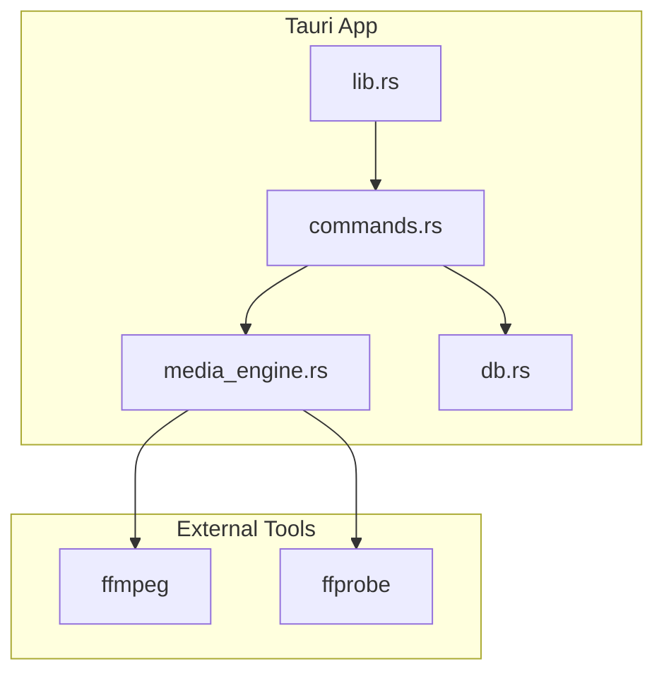
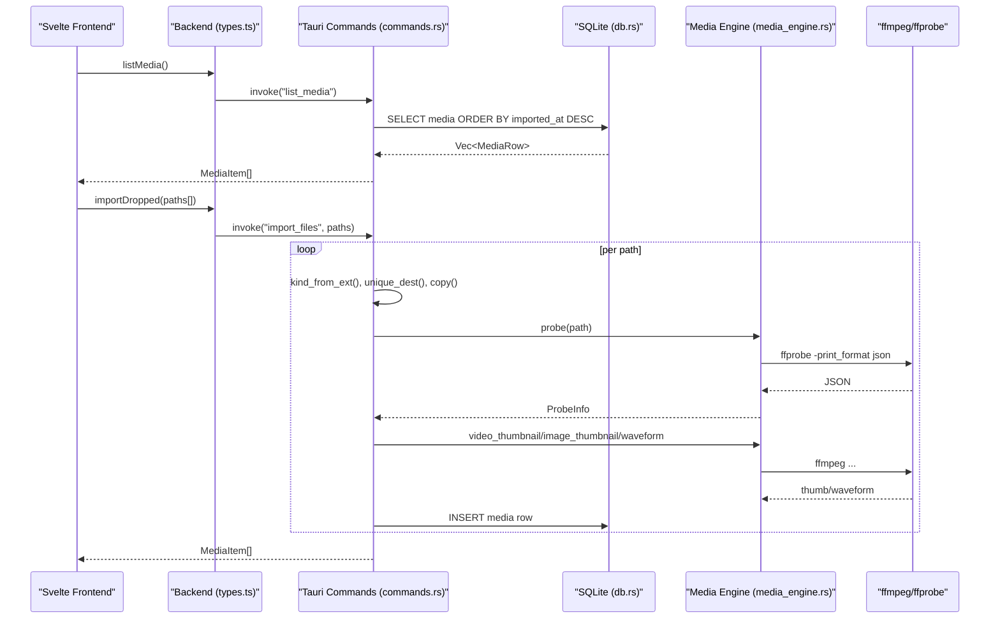
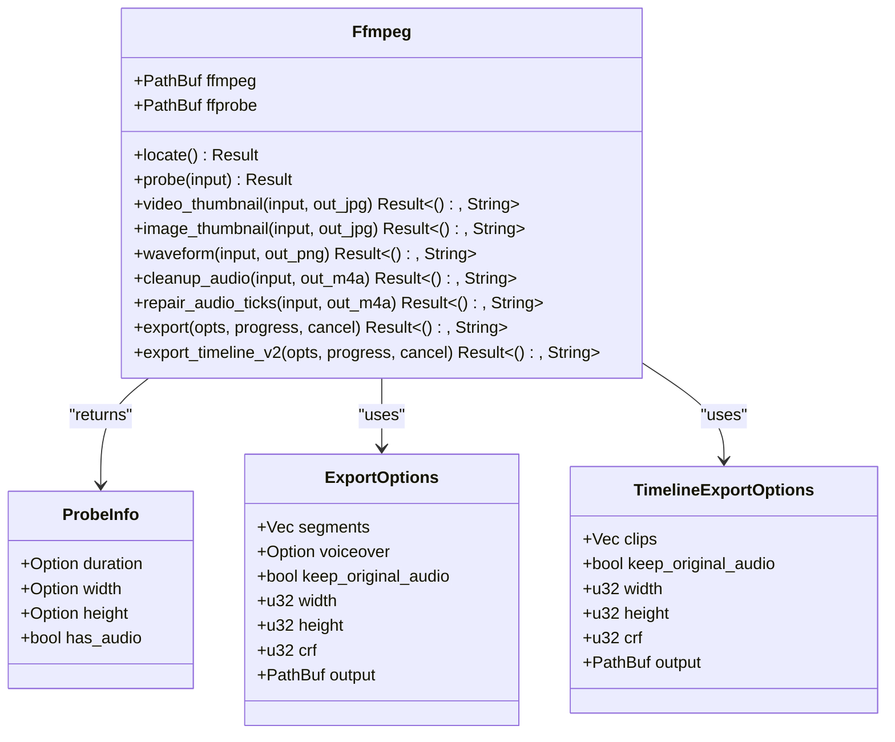
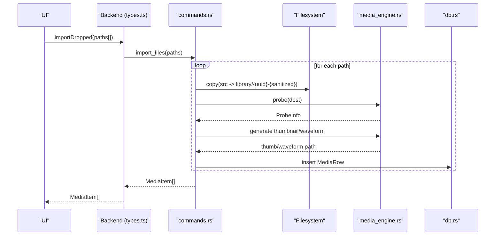
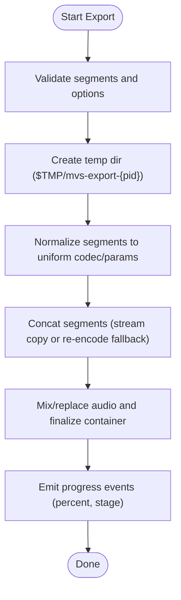
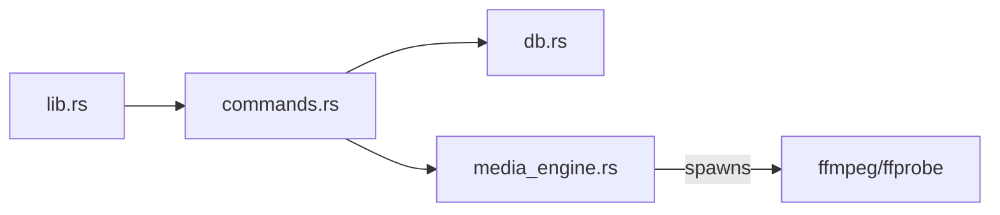

<cite>
**Referenced Files in This Document**
- `apps/shradhapp/src-tauri/src/lib.rs`
- `apps/shradhapp/src-tauri/src/commands.rs`
- `apps/shradhapp/src-tauri/src/media_engine.rs`
- `apps/shradhapp/src-tauri/src/db.rs`
- `apps/shradhapp/src-tauri/Cargo.toml`
- `apps/shradhapp/docs/user/02-media-bank.md`
- `apps/shradhapp/docs/developer/03-rust-backend.md`
- `apps/shradhapp/src/lib/backend/types.ts`
- `apps/shradhapp/src/lib/backend/index.ts`
- `apps/shradhapp/src-tauri/tests/media_engine.rs`
</cite>

## Table of Contents
1. [Introduction](#introduction)
2. [Project Structure](#project-structure)
3. [Core Components](#core-components)
4. [Architecture Overview](#architecture-overview)
5. [Detailed Component Analysis](#detailed-component-analysis)
6. [Dependency Analysis](#dependency-analysis)
7. [Performance Considerations](#performance-considerations)
8. [Troubleshooting Guide](#troubleshooting-guide)
9. [Conclusion](#conclusion)
10. [Appendices](#appendices)

## Introduction
This document explains the media bank management system in ShradhApp, focusing on the Rust backend media engine and the Tauri command surface that connects the Svelte frontend to native file operations, format detection, metadata extraction, thumbnail/waveform generation, and export pipelines. It also covers supported formats, asset organization strategies, API usage examples for importing and organizing assets, and error handling for unsupported or corrupted files.

## Project Structure
ShradhApp’s desktop runtime is a Tauri application with a single Rust crate under apps/shradhapp/src-tauri. The key modules are:
- lib.rs: Application bootstrap, directory setup, database initialization, ffmpeg discovery, and Tauri command registration.
- commands.rs: Typed Tauri commands exposed to the frontend, import pipeline, project CRUD, export orchestration, and cancellation.
- media_engine.rs: The only module that spawns ffmpeg/ffprobe; provides probe, thumbnails, waveform, audio cleanup, and export functions.
- db.rs: SQLite persistence for media items, projects, and settings using rusqlite.

**Diagram sources**
- `apps/shradhapp/src-tauri/src/lib.rs`
- `apps/shradhapp/src-tauri/src/commands.rs`
- `apps/shradhapp/src-tauri/src/media_engine.rs`
- `apps/shradhapp/src-tauri/src/db.rs`

**Section sources**
- `apps/shradhapp/src-tauri/src/lib.rs`
- `apps/shradhapp/docs/developer/03-rust-backend.md`

## Core Components
- Media Engine (media_engine.rs): Encapsulates all ffmpeg/ffprobe interactions. Provides:
  - Probe: duration, width/height, audio presence.
  - Thumbnails: video frame at ~1s, image scaled down.
  - Waveform: audio waveform PNG.
  - Audio cleanup: highpass, denoise, silence trim, loudness normalization.
  - Tick repair: impulsive noise removal.
  - Export: v1 sequential segments and v2 multi-track timeline rendering.
- Commands (commands.rs): Exposes typed Tauri commands for:
  - Media bank CRUD (list, import, rename, tags, notes, delete).
  - Voiceover recording save and processing.
  - Projects (v1 and v2), export, and cancellation.
  - YouTube channel listing and app settings/runtime info.
- Database (db.rs): SQLite schema and helpers for media, projects, and settings.
- Frontend types (types.ts): TypeScript interfaces mirroring Rust types for seamless integration.

**Section sources**
- `apps/shradhapp/src-tauri/src/media_engine.rs`
- `apps/shradhapp/src-tauri/src/commands.rs`
- `apps/shradhapp/src-tauri/src/db.rs`
- `apps/shradhapp/src/lib/backend/types.ts`

## Architecture Overview
The frontend calls Tauri commands via the Backend interface. Commands coordinate between SQLite and the media engine. The media engine shims ffmpeg/ffprobe for probing, thumbnails, waveforms, and exports.

**Diagram sources**
- `apps/shradhapp/src-tauri/src/commands.rs`
- `apps/shradhapp/src-tauri/src/media_engine.rs`
- `apps/shradhapp/src-tauri/src/db.rs`
- `apps/shradhapp/src/lib/backend/types.ts`

## Detailed Component Analysis

### Rust Media Engine (media_engine.rs)
Responsibilities:
- Locate ffmpeg/ffprobe across PATH and platform-specific fallback directories.
- Probe media files for duration, dimensions, and audio presence.
- Generate thumbnails and waveforms.
- Apply audio cleanup chains and tick repair.
- Execute export pipelines with progress and cancellation.

Key methods and behaviors:
- locate(): Discovers executables; returns friendly error if missing.
- probe(): Parses ffprobe JSON to extract duration, width/height, has_audio.
- video_thumbnail()/image_thumbnail(): Scale to 320px width, quality tuned for grid previews.
- waveform(): Generates 320x120 waveform PNG.
- cleanup_audio()/repair_audio_ticks(): Filter chains produce AAC .m4a outputs without modifying originals.
- export()/export_timeline_v2(): Build ffmpeg commands, manage temp files, concat, final muxing, and progress callbacks.

**Diagram sources**
- `apps/shradhapp/src-tauri/src/media_engine.rs`

**Section sources**
- `apps/shradhapp/src-tauri/src/media_engine.rs`

### Tauri Command Surface (commands.rs)
Responsibilities:
- Provide typed commands for media bank operations, voiceover processing, projects, export, and settings.
- Orchestrate imports: validate extension, copy into library/, probe metadata, generate thumbnails, persist rows.
- Manage projects (v1 and v2), including mapping and export.
- Emit export progress events and support cancellation.

Notable helper logic:
- kind_from_ext(): Maps extensions to kinds (video/image/audio).
- sanitize(): Sanitizes filenames for safe storage.
- unique_dest(): Creates UUID-prefixed filenames to avoid collisions.
- thumb_for(): Chooses thumbnail strategy based on kind.

Command highlights:
- list_media(): Returns newest-first media rows.
- import_files(paths[]): Bulk import with partial failure aggregation.
- rename_media(), set_tags(), set_notes(), delete_media(): Metadata updates and deletion.
- save_recording(): Base64-decoded audio saved with waveform and tags.
- cleanup_audio(), repair_audio_ticks(): Produce cleaned/repaired siblings.
- export_project/export_project_v2(): Full export pipelines with progress and cancellation.

**Section sources**
- `apps/shradhapp/src-tauri/src/commands.rs`

### Database Schema and Persistence (db.rs)
Schema:
- media: id, kind, filename, path, imported_at, duration, width, height, tags (JSON), notes, thumb_path.
- projects: id, name, data (versioned JSON), created_at, updated_at.
- settings: key, value, updated_at.

Operations:
- insert_media(), list_media(), get_media(), rename_media(), set_tags(), set_notes(), delete_media().
- upsert_project(), get_project(), delete_project().
- upsert_setting(), get_setting().

WAL mode enabled for concurrency and durability.

**Section sources**
- `apps/shradhapp/src-tauri/src/db.rs`

### Frontend Integration (types.ts, index.ts)
- types.ts defines MediaItem, Clip, ProjectData, ProjectRecord, ExportPreset, CleanupResult, YouTubeVideo, RuntimeInfo, and the Backend interface used by the UI.
- index.ts detects Tauri runtime and exposes the tauriBackend implementation.

Usage patterns:
- listMedia(), pickImport(), importDropped() for media bank operations.
- saveRecording(), cleanupAudio(), repairAudioTicks() for voiceover workflows.
- exportProject(), exportTimelineProject(), onExportProgress(), cancelExport() for rendering.
- getAppSettings(), updateAppSettings(), resetAppSettings(), getRuntimeInfo() for configuration and diagnostics.

**Section sources**
- `apps/shradhapp/src/lib/backend/types.ts`
- `apps/shradhapp/src/lib/backend/index.ts`

### Supported Formats and Asset Organization
Supported formats:
- Video: mp4, mov, mkv, avi, webm, m4v, mpg, mpeg
- Images: png, jpg, jpeg, gif, bmp, webp, heic
- Audio: mp3, wav, m4a, aac, ogg, flac, opus

Asset organization:
- Library directory: $APPDATA/library — copies of imported files stored here.
- Thumbnails directory: $APPDATA/thumbnails — generated previews (.jpg for video/image, .png for audio waveform).
- Filenames use UUID prefix plus sanitized original name to ensure uniqueness and safety.

User guidance:
- Import via button or drag-and-drop; originals remain untouched.
- Use tags and notes to organize; search across names, tags, and notes.
- Detail panel supports preview, renaming, tagging, notes, and removal.

**Section sources**
- `apps/shradhapp/docs/user/02-media-bank.md`
- `apps/shradhapp/src-tauri/src/commands.rs`

### Import Workflow Sequence

**Diagram sources**
- `apps/shradhapp/src-tauri/src/commands.rs`
- `apps/shradhapp/src-tauri/src/media_engine.rs`
- `apps/shradhapp/src-tauri/src/db.rs`

### Export Pipeline Flowchart

**Diagram sources**
- `apps/shradhapp/src-tauri/src/media_engine.rs`

### Error Handling Strategies
- Unsupported formats: kind_from_ext rejects unknown extensions with a user-friendly message.
- Missing ffmpeg: Ffmpeg::locate returns a clear instruction to install ffmpeg.
- Corrupted files: ffprobe errors are captured and surfaced; thumbnails/waveforms gracefully fail and are omitted.
- Export failures: run_with_progress captures stderr tail and returns concise error messages; cancellation yields explicit “Export cancelled”.
- Deletion: delete_media removes DB row and local copies; original files outside the library are preserved.

**Section sources**
- `apps/shradhapp/src-tauri/src/media_engine.rs`
- `apps/shradhapp/src-tauri/src/commands.rs`

## Dependency Analysis
Rust dependencies:
- tauri and tauri-plugin-dialog for UI integration and dialogs.
- serde/serde_json for serialization.
- rusqlite (bundled) for SQLite persistence.
- uuid for unique IDs.
- base64 for decoding recordings.
- reqwest (blocking) for fetching YouTube channel pages.

Module coupling:
- lib.rs wires AppState and registers commands.
- commands.rs depends on db.rs and media_engine.rs.
- media_engine.rs depends only on std and external binaries (ffmpeg/ffprobe).

**Diagram sources**
- `apps/shradhapp/src-tauri/src/lib.rs`
- `apps/shradhapp/src-tauri/src/commands.rs`
- `apps/shradhapp/src-tauri/src/media_engine.rs`
- `apps/shradhapp/src-tauri/Cargo.toml`

**Section sources**
- `apps/shradhapp/src-tauri/Cargo.toml`

## Performance Considerations
- Thumbnail and waveform generation uses small resolutions (320px width) and moderate quality to speed up grid rendering.
- Export normalizes segments to a common codec/params to enable fast stream-copy concatenation where possible.
- Progress parsing uses ffmpeg’s -progress pipe to provide smooth UI feedback without blocking stderr.
- Temp directories are isolated per process and cleaned up automatically to avoid disk bloat.
- Audio cleanup chains are optimized for voice content with targeted filters and AAC encoding at 160 kbps.

[No sources needed since this section provides general guidance]

## Troubleshooting Guide
Common issues and remedies:
- ffmpeg not found: Install ffmpeg and ensure it is on PATH or in a known fallback directory; restart the app.
- Import fails for some files: Check extensions and file integrity; unsupported formats are rejected early.
- No thumbnails/waveforms: If ffprobe cannot read the file, previews will be skipped; verify file accessibility.
- Export stalls or fails: Inspect last few stderr lines from ffmpeg; ensure sufficient disk space and valid output path.
- Cancel export: Use cancelExport(id); the runner kills ffmpeg and returns an explicit cancellation message.

**Section sources**
- `apps/shradhapp/src-tauri/src/media_engine.rs`
- `apps/shradhapp/src-tauri/src/commands.rs`

## Conclusion
ShradhApp’s media bank combines a robust Rust backend with a clean Tauri command surface to deliver reliable file operations, metadata extraction, previews, and export pipelines. The design isolates ffmpeg usage, ensures consistent asset organization, and provides a comprehensive API for the Svelte frontend. With strong error handling and performance-conscious defaults, it offers a solid foundation for personal media assembly workflows.

[No sources needed since this section summarizes without analyzing specific files]

## Appendices

### API Usage Examples
- List media: Call listMedia() to retrieve all items sorted by import time.
- Import files: Use pickImport() or importDropped(paths[]) to add files; results include thumbnails and metadata.
- Organize assets: Update tags and notes via setTags(id, tags[]) and setNotes(id, notes).
- Access properties: MediaItem includes id, kind, filename, path, duration, width/height, tags, notes, and thumb_path.
- Export: For v1 projects, call exportProject(id, data, preset, keepAudio, outPath); for v2 timelines, use exportTimelineProject(id, dataV2, preset, keepAudio, outPath). Listen to onExportProgress(cb) and cancelExport(id) when needed.

**Section sources**
- `apps/shradhapp/src/lib/backend/types.ts`
- `apps/shradhapp/src-tauri/src/commands.rs`

### Test Coverage Highlights
- Integration tests exercise probe, thumbnails, waveform, cleanup, tick repair, full export, timeline v2 export, and cancellation.
- Assertions validate durations, dimensions, and presence/absence of audio streams.

**Section sources**
- `apps/shradhapp/src-tauri/tests/media_engine.rs`