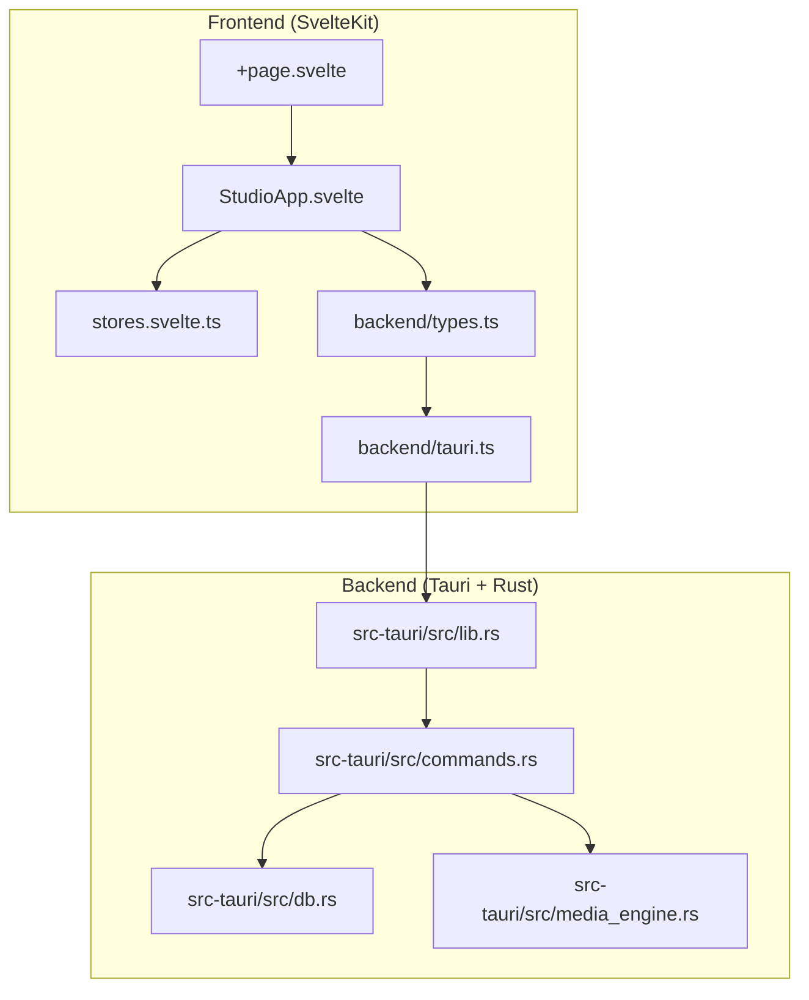
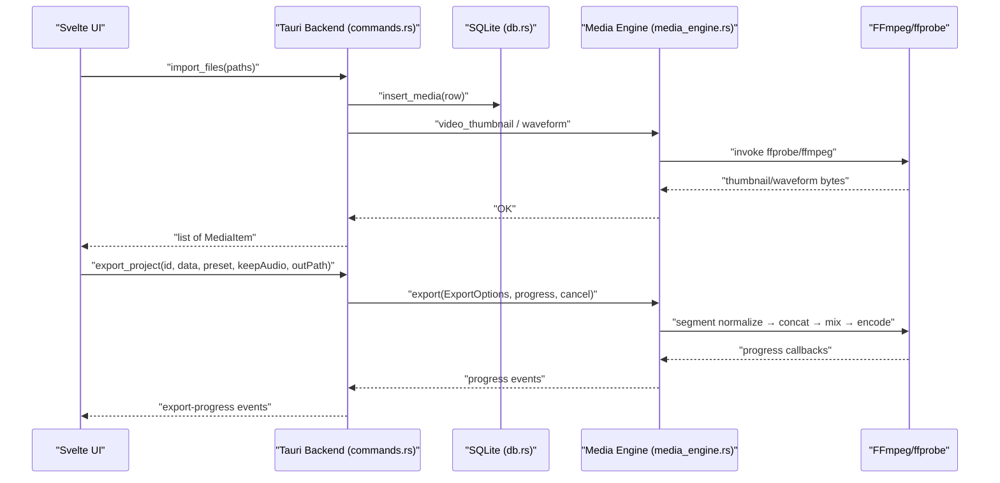
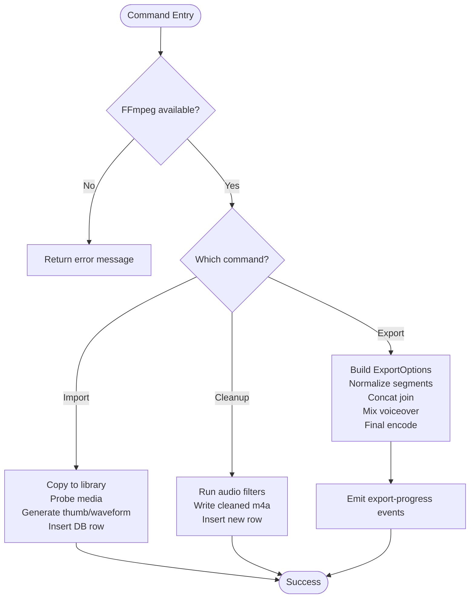
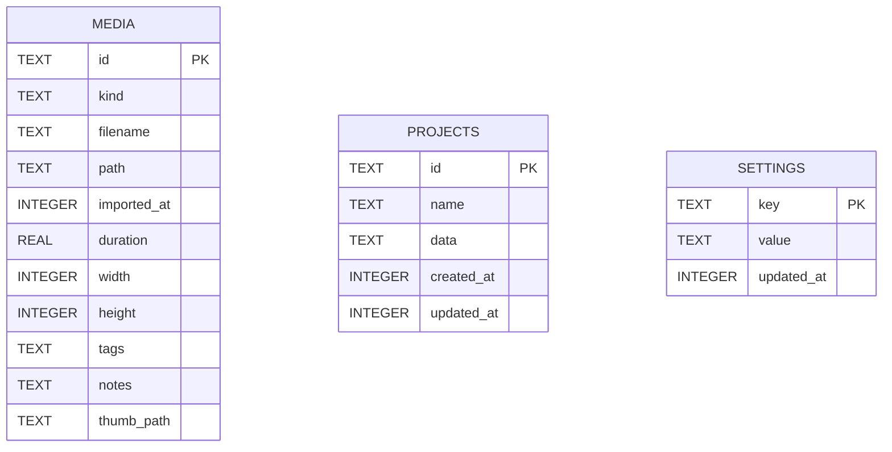
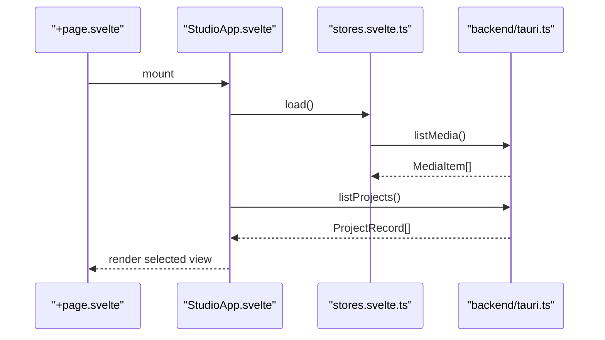
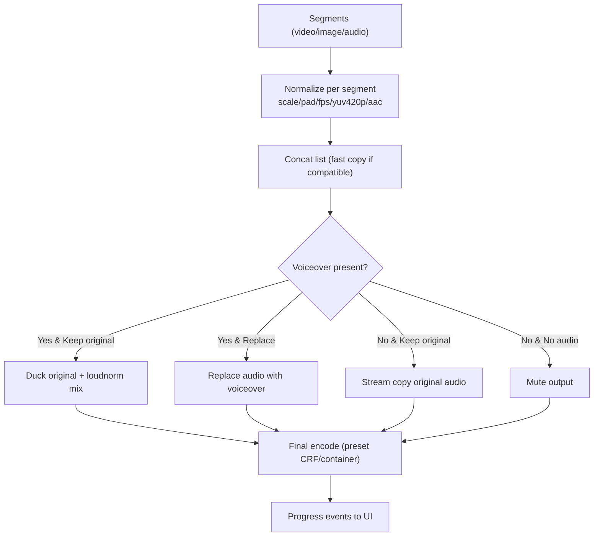
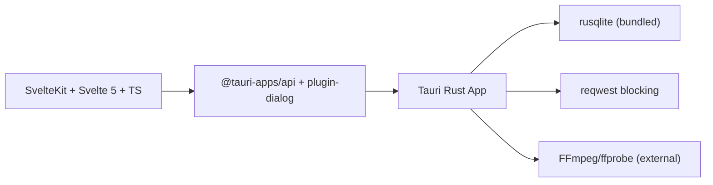

<cite>
**Referenced Files in This Document**
- `apps/shradhapp/README.md`
- `apps/shradhapp/DESIGN.md`
- `apps/shradhapp/package.json`
- `apps/shradhapp/src-tauri/Cargo.toml`
- `apps/shradhapp/src-tauri/tauri.conf.json`
- `apps/shradhapp/src-tauri/src/lib.rs`
- `apps/shradhapp/src-tauri/src/media_engine.rs`
- `apps/shradhapp/src-tauri/src/commands.rs`
- `apps/shradhapp/src-tauri/src/db.rs`
- `apps/shradhapp/src/routes/+page.svelte`
- `apps/shradhapp/src/lib/components/StudioApp.svelte`
- `apps/shradhapp/src/lib/backend/types.ts`
- `apps/shradhapp/src/lib/backend/tauri.ts`
- `apps/shradhapp/src/lib/stores.svelte.ts`
</cite>

## Table of Contents
1. Introduction
2. Project Structure
3. Core Components
4. Architecture Overview
5. Detailed Component Analysis
6. Dependency Analysis
7. Performance Considerations
8. Troubleshooting Guide
9. Conclusion
10. Appendices

## Introduction
ShradhApp is a local-first desktop video editor built with SvelteKit and Tauri. It provides a friendly media bank, one-click voiceover recording with automatic cleanup, a simple clip assembler, and export presets designed for everyday users. The app keeps all data on disk under the user’s app-data directory and uses FFmpeg for media processing. The frontend is a Svelte 5 application; the backend is Rust via Tauri, exposing typed commands to the UI.

Key goals:
- Simple, approachable editing workflow without jargon or cloud dependencies.
- Robust media import, thumbnail/waveform generation, and audio repair.
- Deterministic export pipeline with progress and cancellation.
- Versioned project format persisted in SQLite.

**Section sources**
- `apps/shradhapp/README.md`

## Project Structure
The repository organizes the app into a SvelteKit frontend and a Tauri/Rust backend:
- Frontend (SvelteKit + TypeScript): routes, components, stores, and a typed backend abstraction that calls Tauri commands.
- Backend (Rust/Tauri): command handlers, SQLite persistence, and a dedicated media engine module that invokes FFmpeg/ffprobe.



**Diagram sources**
- `apps/shradhapp/src/routes/+page.svelte`
- `apps/shradhapp/src/lib/components/StudioApp.svelte`
- `apps/shradhapp/src/lib/stores.svelte.ts`
- `apps/shradhapp/src/lib/backend/types.ts`
- `apps/shradhapp/src/lib/backend/tauri.ts`
- `apps/shradhapp/src-tauri/src/lib.rs`
- `apps/shradhapp/src-tauri/src/commands.rs`
- `apps/shradhapp/src-tauri/src/db.rs`
- `apps/shradhapp/src-tauri/src/media_engine.rs`

**Section sources**
- `apps/shradhapp/README.md`
- `apps/shradhapp/package.json`
- `apps/shradhapp/src-tauri/Cargo.toml`
- `apps/shradhapp/src-tauri/tauri.conf.json`

## Core Components
- Media Bank: Import files (picker or drag-drop), list items, generate thumbnails/waveforms, rename, tag, note, delete.
- Voiceover Recorder: Record from microphone, save as audio, optional automatic cleanup/tick repair.
- Project Assembler: Create projects, add clips with trim ranges, pick voiceover, autosave, export with presets.
- Export Pipeline: Segment normalization, concat join, voiceover mixing, final encode with progress and cancel.
- Settings and Runtime Info: Theme, motion, density, default presets, diagnostics, ffmpeg availability.

Data model highlights:
- MediaItem: id, kind, filename, path, imported_at, duration, width/height, tags, notes, thumb_path.
- ProjectData v1: version, name, clips[], voiceover_media_id, timestamps.
- ProjectData v2 (timeline): multi-track timeline model used by advanced export.

Persistence:
- SQLite tables: media, projects, settings.
- Library folder holds copies of imported media; thumbnails stored separately.

**Section sources**
- `apps/shradhapp/README.md`
- `apps/shradhapp/src/lib/backend/types.ts`
- `apps/shradhapp/src-tauri/src/db.rs`

## Architecture Overview
The app follows a clear separation between UI and native capabilities:
- SvelteKit renders the UI and manages state locally.
- A typed backend interface abstracts Tauri commands.
- Rust commands handle file I/O, database operations, and FFmpeg invocations.
- Progress events stream back to the UI during long-running tasks like export.



**Diagram sources**
- `apps/shradhapp/src/lib/backend/tauri.ts`
- `apps/shradhapp/src-tauri/src/commands.rs`
- `apps/shradhapp/src-tauri/src/media_engine.rs`
- `apps/shradhapp/src-tauri/src/db.rs`

## Detailed Component Analysis

### Rust Backend: Media Engine
Responsibilities:
- Locate FFmpeg/ffprobe across platforms.
- Probe media metadata (duration, dimensions, audio presence).
- Generate thumbnails and waveforms.
- Clean up audio (rumble filter, denoise, silence trim, loudness normalization).
- Repair impulsive clicks/ticks non-destructively.
- Export segments and timelines with progress and cancellation.

Key types and flows:
- Ffmpeg struct encapsulates paths and methods.
- ExportSegment variants: Video, Still, AudioOnly.
- TimelineExportPlan compiles a single FFmpeg filter_complex for multi-track rendering.
- run_with_progress parses ffmpeg -progress output and supports cancellation via AtomicBool.

```mermaid
classDiagram
class Ffmpeg {
+locate() Result
+probe(input) ProbeInfo
+video_thumbnail(in, out)
+image_thumbnail(in, out)
+waveform(in, out)
+cleanup_audio(in, out)
+repair_audio_ticks(in, out)
+export(opts, progress, cancel)
+export_timeline_v2(opts, progress, cancel)
-segment_command(seg, opts, out) Command
-timeline_command(opts, plan) Command
-run_with_progress(cmd, expected_secs, cancel, on_frac)
}
class ExportSegment {
<<enum>>
+Video{input, trim_start, trim_end, has_audio}
+Still{input, duration}
+AudioOnly{input, trim_start, trim_end}
+duration() f64
}
class ExportOptions {
+segments : Vec<ExportSegment>
+voiceover : Option<PathBuf>
+keep_original_audio : bool
+width : u32
+height : u32
+crf : u32
+output : PathBuf
}
class TimelineExportClip {
+input : PathBuf
+track_kind : TimelineTrackKind
+media_kind : TimelineMediaKind
+start : f64
+trim_start : f64
+duration : f64
+has_audio : bool
+volume : f64
+muted : bool
}
class TimelineExportOptions {
+clips : Vec<TimelineExportClip>
+keep_original_audio : bool
+width : u32
+height : u32
+crf : u32
+output : PathBuf
}
class TimelineExportPlan {
+duration : f64
+filter_complex : String
+video_label : String
+audio_label : String
+has_audio : bool
+compile(opts) Result
}
Ffmpeg --> ExportOptions : "uses"
Ffmpeg --> ExportSegment : "consumes"
Ffmpeg --> TimelineExportOptions : "uses"
Ffmpeg --> TimelineExportPlan : "compiles"
```

**Diagram sources**
- `apps/shradhapp/src-tauri/src/media_engine.rs`

**Section sources**
- `apps/shradhapp/src-tauri/src/media_engine.rs`

### Rust Backend: Commands and App State
Responsibilities:
- Expose typed Tauri commands for media, projects, voiceover, settings, and export.
- Manage AppState: DB connection, directories, FFmpeg handle, and active export cancellations.
- Implement import flow: copy to library, probe, generate thumbnails/waveforms, persist row.
- Implement project CRUD and version migration helpers.
- Implement export orchestration: build options, emit progress events, support cancel.

Notable behaviors:
- YouTube channel listing via HTTP request and JSON parsing.
- Settings normalization and defaults.
- Runtime info exposure for diagnostics.



**Diagram sources**
- `apps/shradhapp/src-tauri/src/commands.rs`
- `apps/shradhapp/src-tauri/src/lib.rs`

**Section sources**
- `apps/shradhapp/src-tauri/src/commands.rs`
- `apps/shradhapp/src-tauri/src/lib.rs`

### Database Layer (SQLite)
Responsibilities:
- Initialize schema (WAL mode) for media, projects, settings.
- Provide CRUD operations for media rows and projects.
- Upsert settings keyed by string.

Design notes:
- Tags stored as JSON arrays within the media table.
- Projects store versioned JSON blobs.
- Timestamps are epoch milliseconds.



**Diagram sources**
- `apps/shradhapp/src-tauri/src/db.rs`

**Section sources**
- `apps/shradhapp/src-tauri/src/db.rs`

### Frontend: Svelte Application Shell and Navigation
Responsibilities:
- Root page mounts StudioApp.
- StudioApp manages view routing (home, library, record, bank, channel, project, settings).
- Command palette integrates common actions and keyboard shortcuts.
- Theme and motion settings applied to document attributes.

Key interactions:
- In Tauri runtime, loads projects and media from backend; otherwise uses demo data.
- Dispatches studio commands via custom events.



**Diagram sources**
- `apps/shradhapp/src/routes/+page.svelte`
- `apps/shradhapp/src/lib/components/StudioApp.svelte`
- `apps/shradhapp/src/lib/stores.svelte.ts`
- `apps/shradhapp/src/lib/backend/tauri.ts`

**Section sources**
- `apps/shradhapp/src/lib/components/StudioApp.svelte`
- `apps/shradhapp/src/lib/stores.svelte.ts`
- `apps/shradhapp/src/lib/backend/tauri.ts`

### Frontend: Backend Abstraction and Types
Responsibilities:
- Define strongly-typed interfaces for all backend capabilities.
- Implement tauriBackend using @tauri-apps invoke and event listeners.
- Provide URL helpers for media and thumbnails via convertFileSrc.

Highlights:
- Unified ExportProgress listener for real-time feedback.
- File picker integration for import and save dialogs.

**Section sources**
- `apps/shradhapp/src/lib/backend/types.ts`
- `apps/shradhapp/src/lib/backend/tauri.ts`

### Export Pipeline: From Clips to Final Video
Conceptual flow:
- Normalize each segment to target canvas, codec, and audio parameters.
- Concatenate segments (stream copy when possible; fallback re-encode).
- Mix or replace audio based on voiceover selection and original audio preference.
- Encode final output with chosen preset and stream progress to UI.



**Diagram sources**
- `apps/shradhapp/src-tauri/src/media_engine.rs`
- `apps/shradhapp/src-tauri/src/commands.rs`

**Section sources**
- `apps/shradhapp/src-tauri/src/media_engine.rs`
- `apps/shradhapp/src-tauri/src/commands.rs`

### Timeline Editor Interface (Advanced)
Conceptual overview:
- Multi-track timeline supporting video, image, and audio tracks.
- Each clip carries start time, trim, duration, volume, mute flags.
- Timeline export compiles a single FFmpeg filter_complex graph for efficient rendering.

Practical examples:
- Place a video clip at time 0 with a 5-second duration.
- Overlay an image still for 3 seconds starting at 2 seconds.
- Add an audio-only segment trimmed to 4 seconds at time 6.
- Set track volumes and mute states before export.

Note: The advanced timeline is referenced in the app shell and exported via a v2 export command.

**Section sources**
- `apps/shradhapp/src/lib/components/StudioApp.svelte`
- `apps/shradhapp/src-tauri/src/media_engine.rs`

### Media Bank Management
Operations:
- Import files via native picker or drag-and-drop.
- Auto-generate thumbnails for video/images and waveform PNG for audio.
- Rename, tag, add notes, and delete entries.
- URLs for playable media and thumbnails use asset protocol scoped to app-data.

Example workflow:
- Drag multiple photos and videos into the Media Bank.
- Use search and filters to locate assets.
- Preview details and edit metadata.

**Section sources**
- `apps/shradhapp/src-tauri/src/commands.rs`
- `apps/shradhapp/src/lib/backend/tauri.ts`

### Voiceover Recording and Cleanup
Recording:
- Capture microphone input in the browser, base64-encode, and save via backend.
- Probe duration and generate waveform thumbnail.

Cleanup:
- Apply highpass, denoise, silence removal, and loudness normalization.
- Non-destructive tick repair creates a separate repaired file.

Example workflow:
- Record a voiceover, preview, then apply cleanup or tick repair.
- Select the cleaned version for export.

**Section sources**
- `apps/shradhapp/src-tauri/src/commands.rs`
- `apps/shradhapp/src-tauri/src/media_engine.rs`

### Project Management Features
Capabilities:
- Create, duplicate, delete projects.
- Autosave project data (debounced edits).
- Versioned project format (v1 and v2 timeline).
- Open last project or home view based on settings.

Example workflow:
- Create a new project, add clips with trims, attach a voiceover, and export.
- Duplicate a project to iterate on variations.

**Section sources**
- `apps/shradhapp/src-tauri/src/commands.rs`
- `apps/shradhapp/src/lib/components/StudioApp.svelte`

## Dependency Analysis
Frontend dependencies:
- SvelteKit, Svelte 5, Vite, TypeScript.
- Tauri API, dialog plugin, svelte-motion, lucide icons, bits-ui, embla-carousel, fractals-styler, fractalsvelte, mode-watcher, paneforge, svelte-sonner, tailwind-merge.

Backend dependencies:
- Tauri 2, tauri-plugin-dialog, serde/serde_json, rusqlite (bundled), uuid, base64, reqwest (blocking, rustls).

Runtime configuration:
- Tauri config sets window size, asset protocol scope to $APPDATA, and dev/build commands.



**Diagram sources**
- `apps/shradhapp/package.json`
- `apps/shradhapp/src-tauri/Cargo.toml`
- `apps/shradhapp/src-tauri/tauri.conf.json`

**Section sources**
- `apps/shradhapp/package.json`
- `apps/shradhapp/src-tauri/Cargo.toml`
- `apps/shradhapp/src-tauri/tauri.conf.json`

## Performance Considerations
- Prefer stream-copy concatenation when segments share codecs; fallback re-encode ensures robustness.
- Use veryfast preset and appropriate CRF for balanced speed/quality.
- Offload heavy work to Rust threads; avoid blocking the UI thread.
- Generate thumbnails/waveforms lazily and cache them in the thumbnails directory.
- Limit FFmpeg stderr buffering by draining stderr asynchronously to prevent deadlocks.
- Cancel exports promptly via AtomicBool to free resources quickly.

[No sources needed since this section provides general guidance]

## Troubleshooting Guide
Common issues and resolutions:
- FFmpeg not found: Install FFmpeg and ensure it is on PATH or in platform-typical locations; check runtime info in settings.
- Export fails mid-way: Inspect last few lines of FFmpeg stderr surfaced by the backend; verify source media integrity.
- Missing thumbnails/waveforms: Ensure asset protocol scope includes thumbnails directory; confirm file permissions.
- YouTube channel listing disabled: Enable channel feature in settings; network errors may occur due to site changes.

Operational tips:
- Use the command palette to reset settings or show runtime info.
- Delete corrupted media entries and re-import.
- For large projects, prefer v2 timeline export for efficiency.

**Section sources**
- `apps/shradhapp/src-tauri/src/commands.rs`
- `apps/shradhapp/src-tauri/src/media_engine.rs`
- `apps/shradhapp/src/lib/components/StudioApp.svelte`

## Conclusion
ShradhApp combines a clean SvelteKit UI with a powerful Rust backend to deliver a streamlined personal video editing experience. The architecture cleanly separates concerns: UI state management, typed backend abstractions, SQLite persistence, and a robust media engine orchestrating FFmpeg operations. With thoughtful defaults, progress feedback, and cancellation, it remains accessible for beginners while offering enough depth for experienced users to implement custom effects and workflows.

[No sources needed since this section summarizes without analyzing specific files]

## Appendices

### Practical Examples

- Timeline operations:
  - Add a video clip with trim_start=0 and trim_end=5.
  - Insert an image still with duration=3 at start=2.
  - Append an audio-only segment trimmed to 4 seconds at start=6.
  - Adjust volume/mute per clip and export using v2 timeline.

- Media import/export:
  - Drag files into the Media Bank; thumbnails/waveforms generated automatically.
  - Pick a save path and export with a preset; monitor progress and cancel if needed.

- Custom effect implementation:
  - Extend media_engine.rs with new FFmpeg filter chains exposed through commands.
  - Wire up a new backend method and expose it via the typed frontend interface.

[No sources needed since this section provides general guidance]