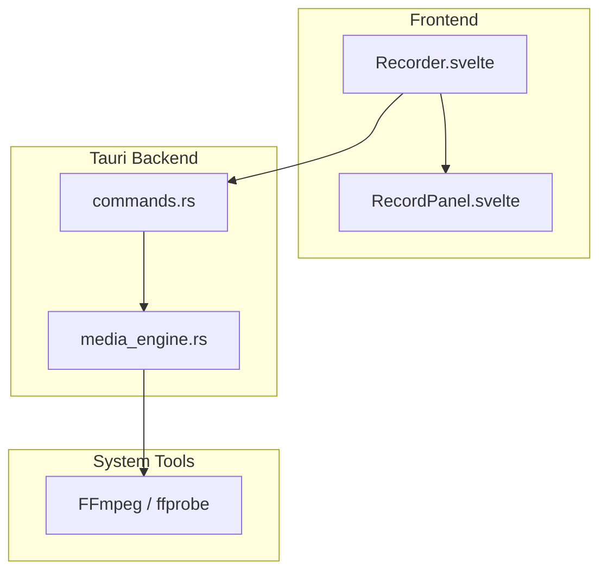
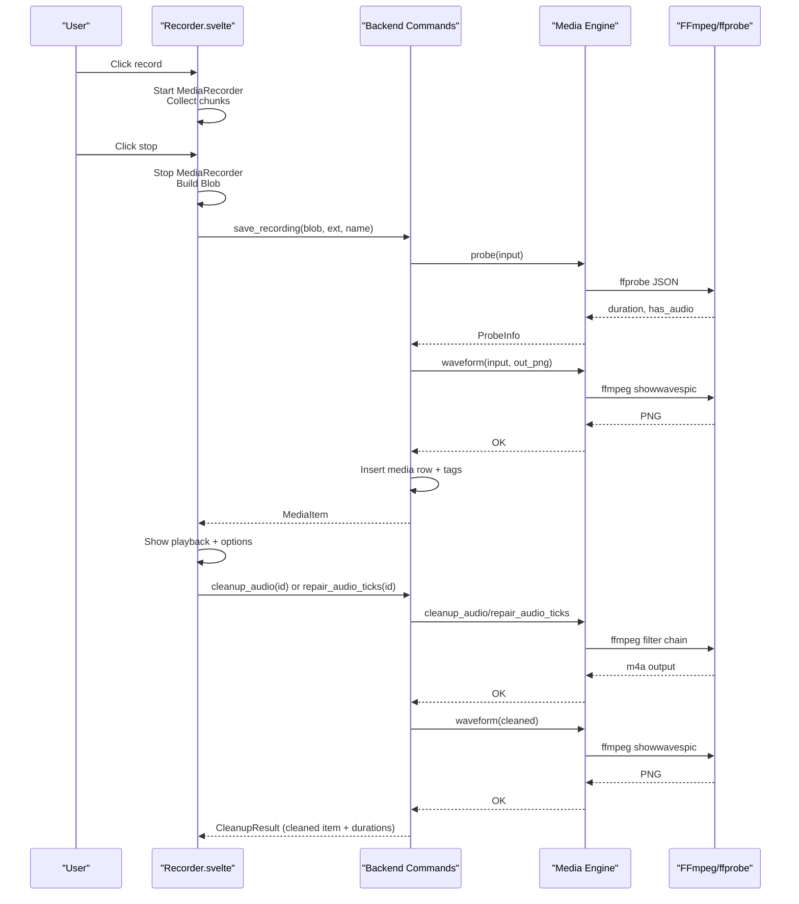
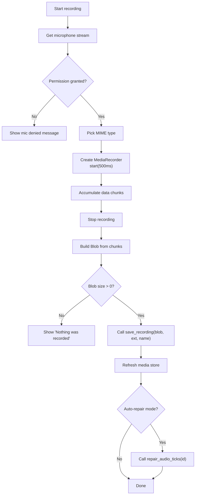
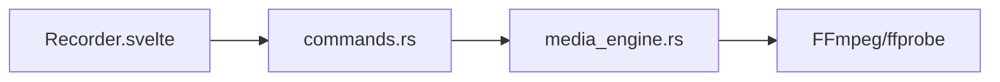

<cite>
**Referenced Files in This Document**
- `apps/shradhapp/src/lib/components/Recorder.svelte`
- `apps/shradhapp/src/lib/components/RecordPanel.svelte`
- `apps/shradhapp/src-tauri/src/commands.rs`
- `apps/shradhapp/src-tauri/src/media_engine.rs`
- `apps/shradhapp/docs/user/03-recording-voiceovers.md`
</cite>

## Table of Contents
1. [Introduction](#introduction)
2. [Project Structure](#project-structure)
3. [Core Components](#core-components)
4. [Architecture Overview](#architecture-overview)
5. [Detailed Component Analysis](#detailed-component-analysis)
6. [Dependency Analysis](#dependency-analysis)
7. [Performance Considerations](#performance-considerations)
8. [Troubleshooting Guide](#troubleshooting-guide)
9. [Conclusion](#conclusion)
10. [Appendices](#appendices)

## Introduction
This document explains the voiceover recording system in ShradhApp. It covers how audio is captured in the browser, saved via Tauri commands, processed with FFmpeg for cleanup and waveform generation, and integrated into the timeline editor for placement in projects. It also provides user guidance for optimal recording conditions, microphone setup, and cross-platform considerations across Windows, macOS, and Linux.

## Project Structure
The voiceover feature spans a small set of focused components:
- Frontend capture and UI: Recorder component and panel
- Backend commands: Tauri commands to save recordings, clean up audio, and repair ticks
- Media engine: FFmpeg-based processing for waveforms, cleanup, and export
- User documentation: Step-by-step guide for recording and cleaning up audio

**Diagram sources**
- `apps/shradhapp/src/lib/components/Recorder.svelte`
- `apps/shradhapp/src/lib/components/RecordPanel.svelte`
- `apps/shradhapp/src-tauri/src/commands.rs`
- `apps/shradhapp/src-tauri/src/media_engine.rs`

**Section sources**
- `apps/shradhapp/src/lib/components/Recorder.svelte`
- `apps/shradhapp/src/lib/components/RecordPanel.svelte`
- `apps/shradhapp/src-tauri/src/commands.rs`
- `apps/shradhapp/src-tauri/src/media_engine.rs`
- `apps/shradhapp/docs/user/03-recording-voiceovers.md`

## Core Components
- Recorder (frontend): Captures audio using the browser’s MediaRecorder API, manages start/stop, timer, error states, and calls backend commands to save and optionally process audio.
- RecordPanel (frontend): Hosts the recorder and provides a voiceover selector for choosing an existing audio item for a project.
- Tauri commands (backend): Provide typed endpoints to save recordings, generate waveforms, perform audio cleanup, and repair impulsive noise.
- Media engine (backend): Encapsulates all FFmpeg invocations for probing media, generating thumbnails/waveforms, and applying audio filters.

Key responsibilities:
- Capture: Browser-native audio capture with format negotiation and blob assembly.
- Persistence: Save raw audio to the library directory and register it in the database with tags and metadata.
- Processing: Generate waveform PNGs and produce cleaned or repaired audio variants without overwriting originals.
- Integration: Make recorded items available to the timeline editor and export pipeline.

**Section sources**
- `apps/shradhapp/src/lib/components/Recorder.svelte`
- `apps/shradhapp/src/lib/components/RecordPanel.svelte`
- `apps/shradhapp/src-tauri/src/commands.rs`
- `apps/shradhapp/src-tauri/src/media_engine.rs`

## Architecture Overview
The recording flow bridges browser APIs with native tooling through Tauri:

**Diagram sources**
- `apps/shradhapp/src/lib/components/Recorder.svelte`
- `apps/shradhapp/src-tauri/src/commands.rs`
- `apps/shradhapp/src-tauri/src/media_engine.rs`

## Detailed Component Analysis

### Frontend Recorder
Responsibilities:
- Request microphone access and negotiate a supported MIME type.
- Manage MediaRecorder lifecycle, chunk accumulation, and a simple elapsed-time counter.
- Persist the recording via a Tauri command and refresh the media store.
- Optionally trigger automatic tick repair based on settings.
- Offer one-click cleanup to produce a cleaned variant and display both versions.

Implementation highlights:
- MIME selection prioritizes Opus-in-WebM when available; falls back to other formats.
- Extension mapping ensures correct file extension for saving.
- Error handling surfaces microphone permission issues and empty recordings.
- UI shows recording state, status messages, and playback controls.

**Diagram sources**
- `apps/shradhapp/src/lib/components/Recorder.svelte`

**Section sources**
- `apps/shradhapp/src/lib/components/Recorder.svelte`

### Frontend Record Panel
Responsibilities:
- Embed the Recorder component.
- Provide a dropdown to select an existing audio item as the project’s voiceover.
- Offer a quick action to review the selected voiceover.

Integration points:
- Receives the list of audio media and current voiceover ID.
- Emits events to update the selected voiceover and open the review view.

**Section sources**
- `apps/shradhapp/src/lib/components/RecordPanel.svelte`

### Tauri Commands (Backend)
Responsibilities:
- save_recording: Decode base64 payload, write file, probe metadata, generate waveform thumbnail, insert media row with tags.
- cleanup_audio: Apply a gentle voiceover cleanup chain and return before/after durations plus the new media row.
- repair_audio_ticks: Detect and repair impulsive clicks/ticks and return results similarly.

Data model interactions:
- Uses a database layer to persist media rows and retrieve paths for processing.
- Generates unique IDs and sanitized filenames to avoid collisions.

Export integration:
- The same media rows are consumed by export commands that build FFmpeg graphs for final rendering.

**Section sources**
- `apps/shradhapp/src-tauri/src/commands.rs`

### Media Engine (FFmpeg Wrapper)
Responsibilities:
- Locate FFmpeg/ffprobe binaries across platforms.
- Probe media files for duration, dimensions, and audio presence.
- Generate image/video thumbnails and audio waveform PNGs.
- Apply audio processing chains for cleanup and click/tick repair.
- Orchestrate complex export pipelines (not directly part of recording but relevant for timeline integration).

Platform-specific behavior:
- Searches PATH first, then common install locations per OS.
- Handles .exe suffix on Windows.

Audio processing details:
- Cleanup applies highpass filtering, denoising, silence trimming, and loudness normalization; outputs AAC in .m4a.
- Tick repair adds a targeted click removal stage before normalization.

Waveform generation:
- Uses a single-frame video filter to render a waveform PNG suitable for thumbnails.

**Section sources**
- `apps/shradhapp/src-tauri/src/media_engine.rs`

## Dependency Analysis
High-level dependencies:
- Recorder depends on browser APIs and calls Tauri commands.
- Commands depend on the media engine for all FFmpeg operations.
- Media engine depends on external FFmpeg/ffprobe executables.

**Diagram sources**
- `apps/shradhapp/src/lib/components/Recorder.svelte`
- `apps/shradhapp/src-tauri/src/commands.rs`
- `apps/shradhapp/src-tauri/src/media_engine.rs`

**Section sources**
- `apps/shradhapp/src/lib/components/Recorder.svelte`
- `apps/shradhapp/src-tauri/src/commands.rs`
- `apps/shradhapp/src-tauri/src/media_engine.rs`

## Performance Considerations
- Recording buffer interval: The recorder buffers audio in short intervals to balance memory usage and latency.
- Waveform generation: Single-pass FFmpeg invocation produces a compact PNG; ensure sufficient disk space in the thumbnail directory.
- Audio cleanup: Filters run synchronously in a blocking task; long recordings may take noticeable time. Avoid concurrent heavy exports if CPU-bound.
- FFmpeg availability: Missing or misconfigured FFmpeg will block waveform and cleanup features. Ensure proper installation and PATH configuration.

[No sources needed since this section provides general guidance]

## Troubleshooting Guide
Common issues and resolutions:
- Microphone blocked: The frontend displays a clear message when permission is denied. Revisit OS privacy settings to allow microphone access for the app.
- Nothing was recorded: If the recording blob is empty, retry and ensure you speak after the timer starts.
- FFmpeg not found: Cleanup and waveform generation rely on FFmpeg. Install it and ensure it is discoverable via PATH or typical install directories.
- Export failures: When exporting timelines, errors include truncated FFmpeg stderr output to aid diagnosis.

User-facing steps:
- Follow the step-by-step recording guide to capture, listen back, and clean up audio.
- Use the “Record another” option to retake without losing previous versions.

**Section sources**
- `apps/shradhapp/src/lib/components/Recorder.svelte`
- `apps/shradhapp/src-tauri/src/commands.rs`
- `apps/shradhapp/src-tauri/src/media_engine.rs`
- `apps/shradhapp/docs/user/03-recording-voiceovers.md`

## Conclusion
ShradhApp’s voiceover recording system combines a simple, accessible frontend with robust backend processing. Browser-native capture ensures broad compatibility, while FFmpeg-powered processing delivers consistent quality improvements and visual feedback. Recorded clips integrate seamlessly into the timeline editor and export pipeline, enabling users to focus on content creation rather than technical setup.

[No sources needed since this section summarizes without analyzing specific files]

## Appendices

### Recording Controls and Quality Settings
- Controls: Big red button toggles recording; a timer indicates elapsed time; playback controls appear after saving.
- Quality options: Automatic tick repair can be enabled via settings; cleanup applies denoising, highpass filtering, silence trimming, and loudness normalization.
- Output formats: Raw recordings use the best available browser-supported format; cleaned outputs are AAC-encoded .m4a files.

**Section sources**
- `apps/shradhapp/src/lib/components/Recorder.svelte`
- `apps/shradhapp/src-tauri/src/commands.rs`
- `apps/shradhapp/src-tauri/src/media_engine.rs`

### Timeline Editor Integration
- Recorded audio items appear in the Media Bank and can be selected as the project’s voiceover.
- The v2 timeline supports separate audio tracks; exported timelines mix voiceover with other media according to project settings.

**Section sources**
- `apps/shradhapp/src/lib/components/RecordPanel.svelte`
- `apps/shradhapp/src-tauri/src/commands.rs`

### Cross-Platform Compatibility Notes
- FFmpeg discovery: Searches PATH and platform-specific directories; Windows includes additional common locations.
- Executable naming: Automatically handles .exe suffix on Windows.
- Audio capture: Relies on standard browser APIs; permissions and device selection follow OS policies.

**Section sources**
- `apps/shradhapp/src-tauri/src/media_engine.rs`

### User Guide: Optimal Recording Conditions
- Environment: Choose a quiet room; minimize background noise sources like fans or air conditioning.
- Microphone setup: Use a dedicated microphone close to your mouth; avoid USB hubs that introduce interference.
- Levels: Speak at a natural volume; avoid clipping by staying within comfortable speaking levels.
- Post-processing: Use “Clean up the sound” to remove hiss, rumble, and silence; consider automatic tick repair if clicks are present.

**Section sources**
- `apps/shradhapp/docs/user/03-recording-voiceovers.md`