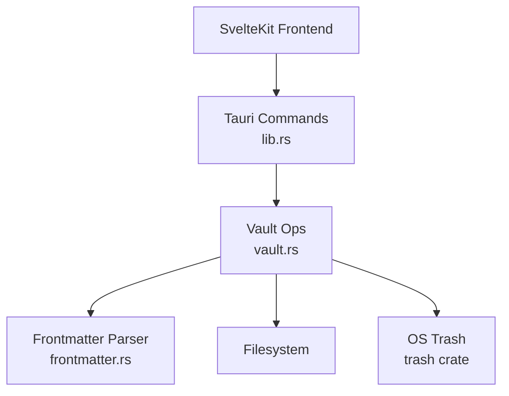
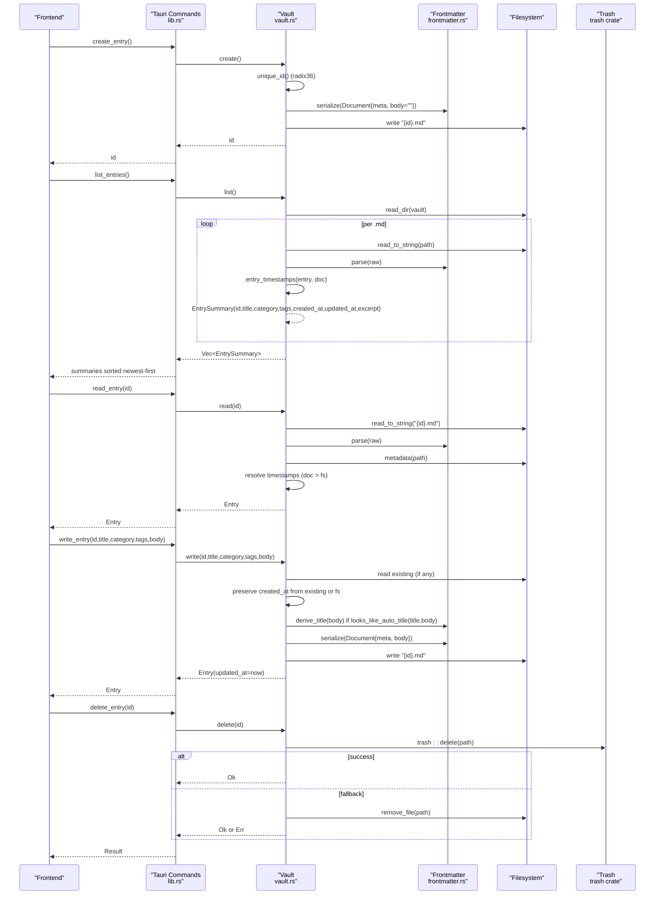
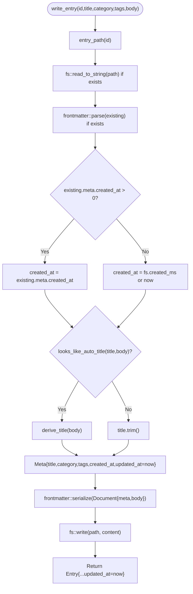
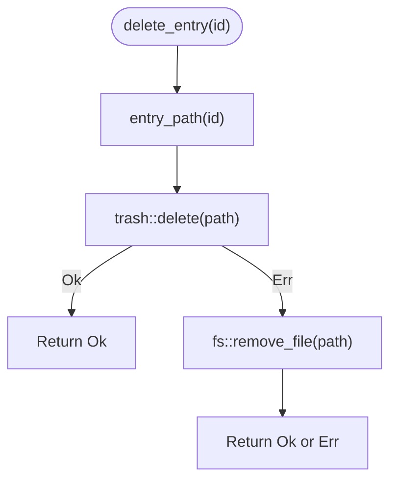
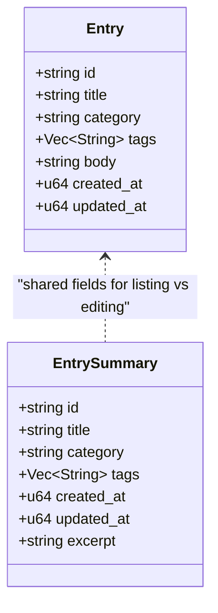
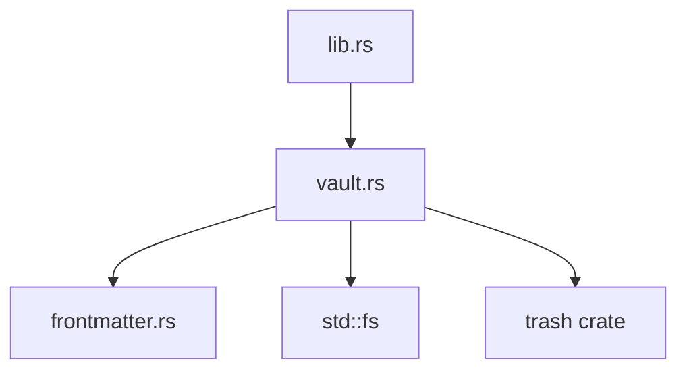

<cite>
**Referenced Files in This Document**
- [lib.rs](../../apps/fracta/src-tauri/src/lib.rs)
- [vault.rs](../../apps/fracta/src-tauri/src/vault.rs)
- [frontmatter.rs](../../apps/fracta/src-tauri/src/frontmatter.rs)
- [workspace.rs](../../apps/fracta/src-tauri/src/workspace.rs)
- [Cargo.toml](../../apps/fracta/src-tauri/Cargo.toml)
</cite>

## Table of Contents
1. [Introduction](#introduction)
2. [Project Structure](#project-structure)
3. [Core Components](#core-components)
4. [Architecture Overview](#architecture-overview)
5. [Detailed Component Analysis](#detailed-component-analysis)
6. [Dependency Analysis](#dependency-analysis)
7. [Performance Considerations](#performance-considerations)
8. [Troubleshooting Guide](#troubleshooting-guide)
9. [Conclusion](#conclusion)

## Introduction
This document explains Fracta’s Entry CRUD operations with a focus on the complete lifecycle: creation with unique ID generation using radix36 encoding, reading with frontmatter parsing and timestamp resolution, updating with automatic title derivation and timestamp preservation, and deletion with OS trash integration. It also details how bulk listing is optimized for performance and clarifies the relationship between Entry and EntrySummary structures for different use cases.

## Project Structure
The Entry CRUD functionality lives in the Tauri Rust backend under apps/fracta/src-tauri. The key modules are:
- lib.rs: Tauri command handlers that expose vault operations to the frontend.
- vault.rs: Core entry persistence logic (create, read, update, delete), ID generation, timestamps, and trash-based deletion.
- frontmatter.rs: Lightweight YAML frontmatter parser/serializer and title derivation utilities.
- workspace.rs: General filesystem helpers used by other features; not directly involved in Entry CRUD but provides context for file handling patterns.



**Diagram sources**
- [lib.rs:67-96](../../apps/fracta/src-tauri/src/lib.rs#L67-L96)
- [vault.rs:128-278](../../apps/fracta/src-tauri/src/vault.rs#L128-L278)
- [frontmatter.rs:145-238](../../apps/fracta/src-tauri/src/frontmatter.rs#L145-L238)
- [Cargo.toml:27](../../apps/fracta/src-tauri/Cargo.toml#L27)

**Section sources**
- [lib.rs:1-10](../../apps/fracta/src-tauri/src/lib.rs#L1-L10)
- [vault.rs:1-10](../../apps/fracta/src-tauri/src/vault.rs#L1-L10)
- [frontmatter.rs:1-10](../../apps/fracta/src-tauri/src/frontmatter.rs#L1-L10)

## Core Components
- Entry: Full entry model returned by read operations, including id, title, category, tags, body, created_at, updated_at.
- EntrySummary: Lightweight summary for listing, excluding body and including an excerpt for sidebar previews.
- Vault: Stateful handle over the chosen vault directory, exposing create, read, write, delete, list, and path validation.
- Frontmatter: Minimal YAML parser/serializer for metadata fields and body separation, plus title derivation and auto-title detection.

Key behaviors:
- Unique IDs are generated via radix36 encoding of epoch milliseconds, with collision suffixes if needed.
- Timestamps prioritize frontmatter values when present; otherwise fall back to filesystem metadata.
- Title derivation occurs automatically when titles are blank or appear auto-generated.
- Deletion attempts OS trash first, falling back to hard removal.

**Section sources**
- [vault.rs:28-52](../../apps/fracta/src-tauri/src/vault.rs#L28-L52)
- [vault.rs:193-278](../../apps/fracta/src-tauri/src/vault.rs#L193-L278)
- [frontmatter.rs:240-290](../../apps/fracta/src-tauri/src/frontmatter.rs#L240-L290)

## Architecture Overview
The Tauri commands expose a simple API surface to the Svelte frontend. Each command delegates to Vault methods which perform filesystem I/O and frontmatter processing.



**Diagram sources**
- [lib.rs:67-96](../../apps/fracta/src-tauri/src/lib.rs#L67-L96)
- [vault.rs:128-278](../../apps/fracta/src-tauri/src/vault.rs#L128-L278)
- [frontmatter.rs:240-290](../../apps/fracta/src-tauri/src/frontmatter.rs#L240-L290)
- [Cargo.toml:27](../../apps/fracta/src-tauri/Cargo.toml#L27)

## Detailed Component Analysis

### Create Operation
- Generates a unique ID using radix36 encoding of current epoch milliseconds. If a collision occurs, appends a numeric suffix until a free name is found.
- Creates a new Markdown file immediately with serialized frontmatter containing created_at and updated_at set to the current time, and an empty body.
- Returns the stable id for subsequent operations.

```mermaid
flowchart TD
Start(["create_entry"]) --> GetDir["Get vault dir"]
GetDir --> GenID["unique_id(dir)<br/>radix36(epoch millis)+suffix"]
GenID --> BuildDoc["Build Document{meta:{created_at,updated_at}, body=\"\"}"]
BuildDoc --> Serialize["frontmatter::serialize(doc)"]
Serialize --> WriteFile["fs::write(\"{id}.md\", content)"]
WriteFile --> ReturnID["Return id"]
```

**Diagram sources**
- [vault.rs:193-208](../../apps/fracta/src-tauri/src/vault.rs#L193-L208)
- [vault.rs:336-367](../../apps/fracta/src-tauri/src/vault.rs#L336-L367)
- [frontmatter.rs:210-238](../../apps/fracta/src-tauri/src/frontmatter.rs#L210-L238)

**Section sources**
- [vault.rs:193-208](../../apps/fracta/src-tauri/src/vault.rs#L193-L208)
- [vault.rs:336-367](../../apps/fracta/src-tauri/src/vault.rs#L336-L367)

### Read Operation
- Reads the Markdown file and parses frontmatter to extract metadata and body.
- Resolves timestamps by prioritizing frontmatter values over filesystem metadata:
  - updated_at = max(frontmatter.updated_at, filesystem.modified_as_millis)
  - created_at = frontmatter.created_at if present, else filesystem.created_as_millis, else falls back to updated_at
- Returns a full Entry object.

```mermaid
flowchart TD
Start(["read_entry(id)"]) --> ResolvePath["entry_path(id) -> \"{id}.md\""]
ResolvePath --> ReadRaw["fs::read_to_string(path)"]
ReadRaw --> ParseFM["frontmatter::parse(raw) -> Document"]
ParseFM --> Meta["fs::metadata(path)"]
Meta --> Updated["updated_at = max(doc.meta.updated_at, fs.modified_ms)"]
Meta --> Created{"doc.meta.created_at > 0?"}
Created --> |Yes| UseCreated["created_at = doc.meta.created_at"]
Created --> |No| FallbackCreated["created_at = fs.created_ms or updated_at"]
UseCreated --> BuildEntry["Build Entry{id,title,category,tags,body,created_at,updated_at}"]
FallbackCreated --> BuildEntry
BuildEntry --> Return["Return Entry"]
```

**Diagram sources**
- [vault.rs:159-189](../../apps/fracta/src-tauri/src/vault.rs#L159-L189)
- [frontmatter.rs:145-178](../../apps/fracta/src-tauri/src/frontmatter.rs#L145-L178)

**Section sources**
- [vault.rs:159-189](../../apps/fracta/src-tauri/src/vault.rs#L159-L189)

### Update Operation
- Preserves created_at from existing frontmatter or filesystem metadata; never rewrites it unless missing.
- Updates updated_at to the current time.
- Handles title derivation:
  - If the provided title appears auto-generated or blank, derives a compact title from the first meaningful line of the body.
  - Otherwise uses the explicit title trimmed.
- Serializes frontmatter with only non-empty optional fields (category/tags omitted if empty).
- Writes the file and returns the updated Entry.



**Diagram sources**
- [vault.rs:212-267](../../apps/fracta/src-tauri/src/vault.rs#L212-L267)
- [frontmatter.rs:240-290](../../apps/fracta/src-tauri/src/frontmatter.rs#L240-L290)

**Section sources**
- [vault.rs:212-267](../../apps/fracta/src-tauri/src/vault.rs#L212-L267)
- [frontmatter.rs:240-290](../../apps/fracta/src-tauri/src/frontmatter.rs#L240-L290)

### Delete Operation
- Attempts to move the entry file to the OS trash using the trash crate.
- Falls back to hard removal if trash is unavailable or fails.
- Ensures best-effort recoverability by preferring trash where possible.



**Diagram sources**
- [vault.rs:269-277](../../apps/fracta/src-tauri/src/vault.rs#L269-L277)
- [Cargo.toml:27](../../apps/fracta/src-tauri/Cargo.toml#L27)

**Section sources**
- [vault.rs:269-277](../../apps/fracta/src-tauri/src/vault.rs#L269-L277)

### Bulk Listing Optimization
- Scans the vault directory for .md files.
- For each file, reads raw content, parses frontmatter, extracts timestamps, computes display title, and builds an EntrySummary with a short excerpt.
- Sorts results by updated_at descending to show newest entries first.
- Avoids loading full bodies into memory for listing; excerpts are derived from the first non-empty line.

```mermaid
flowchart TD
Start(["list_entries"]) --> ReadDir["fs::read_dir(vault)"]
ReadDir --> FilterMD{"extension == \"md\"?"}
FilterMD --> |No| Next["next entry"]
FilterMD --> |Yes| ReadRaw["fs::read_to_string(path)"]
ReadRaw --> ParseFM["frontmatter::parse(raw)"]
ParseFM --> TS["entry_timestamps(entry, doc)"]
TS --> Title["display_title(doc)"]
Title --> Excerpt["excerpt(doc.body)"]
Excerpt --> PushSummary["push EntrySummary"]
PushSummary --> Next
Next --> |End| Sort["sort by updated_at desc"]
Sort --> Return["return Vec<EntrySummary>"]
```

**Diagram sources**
- [vault.rs:128-157](../../apps/fracta/src-tauri/src/vault.rs#L128-L157)
- [frontmatter.rs:280-301](../../apps/fracta/src-tauri/src/frontmatter.rs#L280-L301)

**Section sources**
- [vault.rs:128-157](../../apps/fracta/src-tauri/src/vault.rs#L128-L157)

### Entry vs EntrySummary
- Entry: Used for editing and displaying full content; includes body and all metadata.
- EntrySummary: Used for listing and sidebar previews; excludes body and includes a short excerpt.
- Relationship: Both share id, title, category, tags, created_at, updated_at; Summary adds excerpt for UI efficiency.



**Diagram sources**
- [vault.rs:28-52](../../apps/fracta/src-tauri/src/vault.rs#L28-L52)

**Section sources**
- [vault.rs:28-52](../../apps/fracta/src-tauri/src/vault.rs#L28-L52)

## Dependency Analysis
- Tauri commands in lib.rs delegate to Vault methods.
- Vault depends on frontmatter for parsing/serialization and title derivation.
- Filesystem operations are performed via std::fs.
- OS trash integration uses the trash crate.
- Workspace module provides general file handling patterns but is not directly used by Entry CRUD.



**Diagram sources**
- [lib.rs:67-96](../../apps/fracta/src-tauri/src/lib.rs#L67-L96)
- [vault.rs:1-10](../../apps/fracta/src-tauri/src/vault.rs#L1-L10)
- [Cargo.toml:27](../../apps/fracta/src-tauri/Cargo.toml#L27)

**Section sources**
- [lib.rs:67-96](../../apps/fracta/src-tauri/src/lib.rs#L67-L96)
- [Cargo.toml:17-29](../../apps/fracta/src-tauri/Cargo.toml#L17-L29)

## Performance Considerations
- Listing avoids loading full bodies; excerpts are computed from the first non-empty line.
- Sorting by updated_at ensures efficient rendering of recent entries.
- Radix36 ID generation is O(log base 36 n) and typically yields short, sortable identifiers.
- Timestamp resolution minimizes filesystem calls by caching metadata once per read/write.

[No sources needed since this section provides general guidance]

## Troubleshooting Guide
- Invalid entry IDs: Path traversal checks reject ids with separators, parent references, NUL characters, or dot-prefixes. Ensure ids are bare file stems.
- Missing vault folder: A configured vault must exist; otherwise operations return errors prompting user selection.
- Frontmatter parsing: Unterminated frontmatter blocks are treated as body; ensure proper delimiters.
- Title derivation: If titles appear truncated or unexpected, verify whether looks_like_auto_title triggers derivation; explicit titles override derivation.
- Deletion failures: If trash is unavailable, hard removal is attempted; check permissions and OS trash availability.

**Section sources**
- [vault.rs:115-126](../../apps/fracta/src-tauri/src/vault.rs#L115-L126)
- [frontmatter.rs:38-64](../../apps/fracta/src-tauri/src/frontmatter.rs#L38-L64)
- [vault.rs:269-277](../../apps/fracta/src-tauri/src/vault.rs#L269-L277)

## Conclusion
Fracta’s Entry CRUD system provides robust, efficient operations for managing markdown entries with structured frontmatter. Creation generates stable, collision-resistant IDs; reading resolves timestamps with priority to frontmatter; updating preserves creation timestamps while deriving titles intelligently; and deletion integrates with OS trash for safe removal. The separation between Entry and EntrySummary optimizes both editing and listing workflows.
