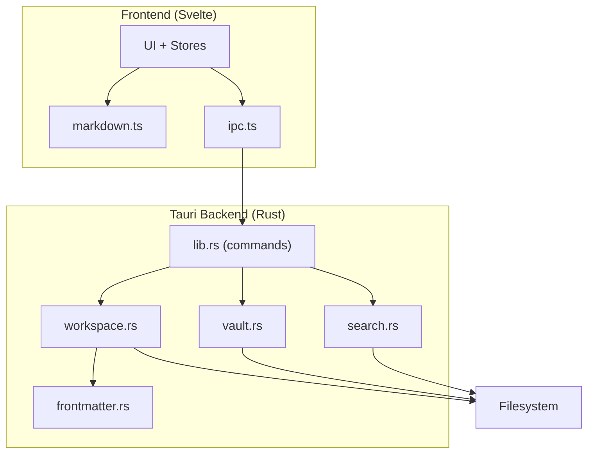
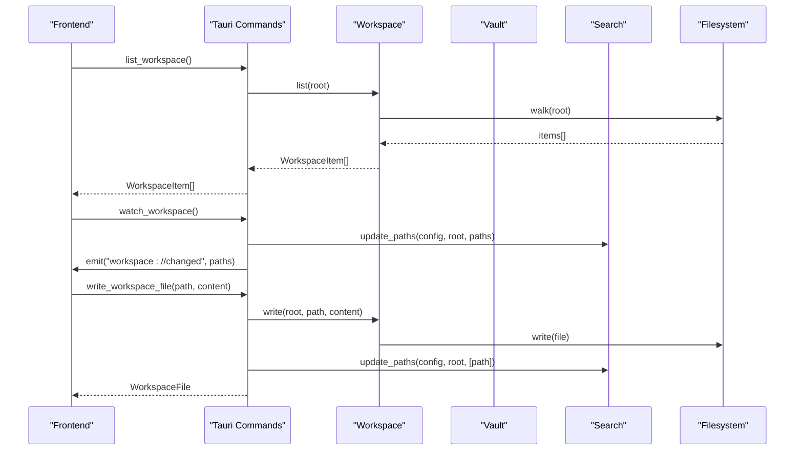
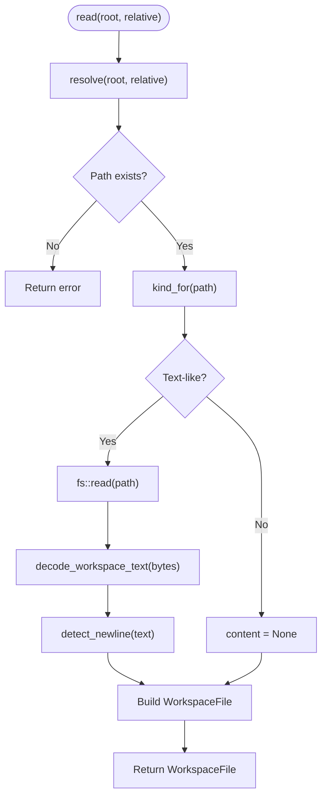
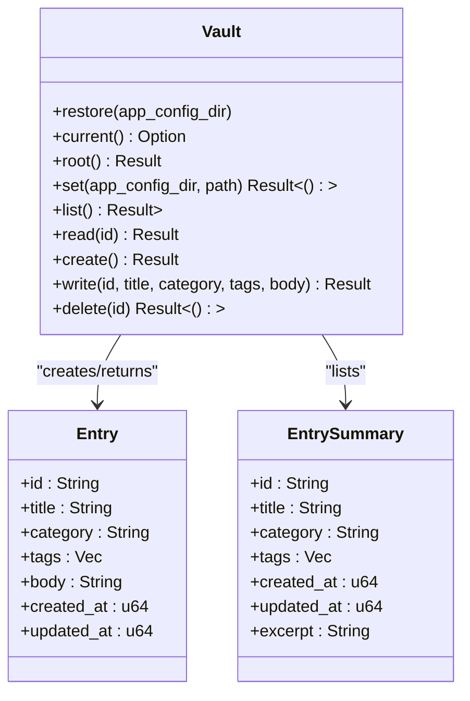
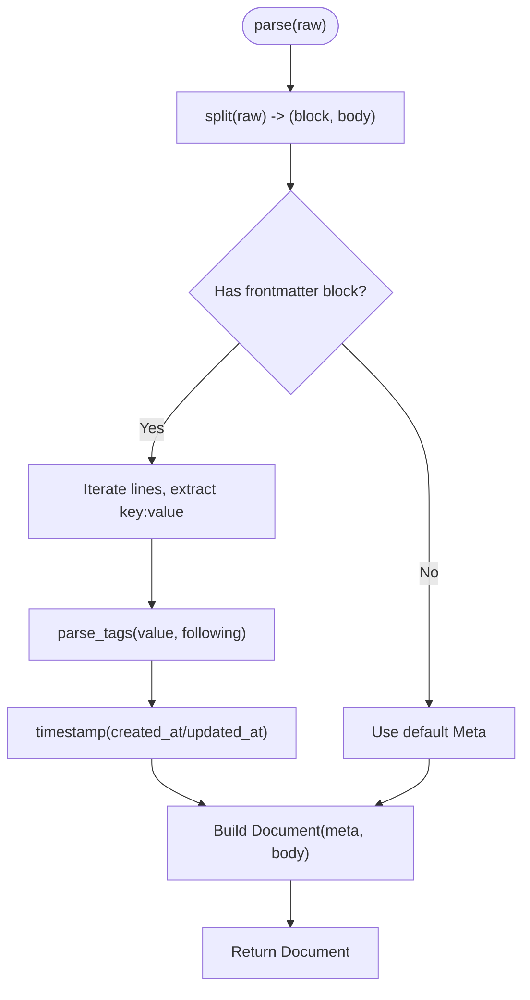
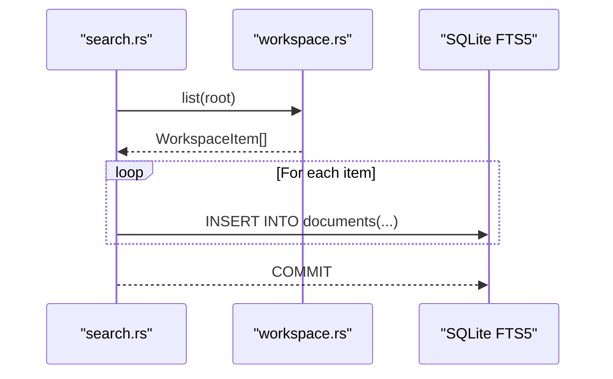
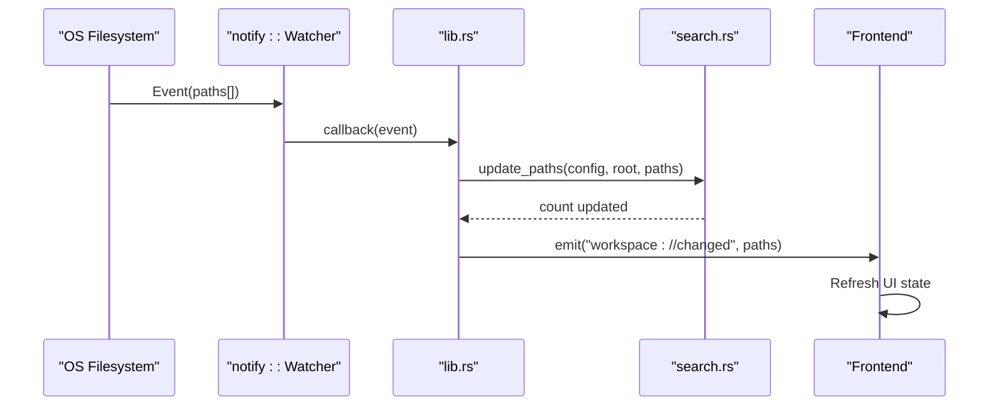
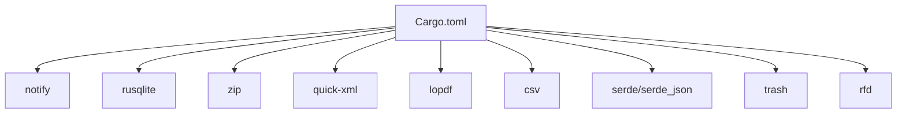

<cite>
**Referenced Files in This Document**
- [workspace.rs](../../apps/fracta/src-tauri/src/workspace.rs)
- [vault.rs](../../apps/fracta/src-tauri/src/vault.rs)
- [frontmatter.rs](../../apps/fracta/src-tauri/src/frontmatter.rs)
- [search.rs](../../apps/fracta/src-tauri/src/search.rs)
- [lib.rs](../../apps/fracta/src-tauri/src/lib.rs)
- [markdown.ts](../../apps/fracta/src/lib/markdown.ts)
- [ipc.ts](../../apps/fracta/src/lib/ipc.ts)
- [Cargo.toml](../../apps/fracta/src-tauri/Cargo.toml)
</cite>

## Table of Contents
1. [Introduction](#introduction)
2. [Project Structure](#project-structure)
3. [Core Components](#core-components)
4. [Architecture Overview](#architecture-overview)
5. [Detailed Component Analysis](#detailed-component-analysis)
6. [Dependency Analysis](#dependency-analysis)
7. [Performance Considerations](#performance-considerations)
8. [Troubleshooting Guide](#troubleshooting-guide)
9. [Conclusion](#conclusion)
10. [Appendices](#appendices)

## Introduction
This document explains the file system operations and workspace management implemented in the project. It covers:
- File watching mechanisms and change detection
- Real-time synchronization patterns between the filesystem and the UI
- Frontmatter parsing, markdown processing, and content indexing strategies
- Examples of file CRUD operations, directory traversal, and metadata extraction
- Cross-platform path handling, permission considerations, and performance optimization for large file trees

The implementation is a Tauri-based desktop application with a Rust backend exposing commands to a Svelte frontend. The backend performs safe, contained file operations within a user-selected vault or workspace root.

## Project Structure
Key modules involved in file system operations and workspace management:
- Workspace module: recursive file listing, read/write, preview, asset handling, CSV/JSON conversion, link/graph analysis
- Vault module: simple entry-per-file Markdown store with frontmatter
- Frontmatter module: YAML-like frontmatter parser and serializer
- Search module: SQLite FTS5 index for fast search across workspace content
- IPC layer: Tauri command bindings and TypeScript interfaces for the frontend
- Markdown utilities: client-side markdown-to-HTML and HTML-to-markdown conversions

**Diagram sources**
- [lib.rs:100-165](../../apps/fracta/src-tauri/src/lib.rs#L100-L165)
- [workspace.rs:175-231](../../apps/fracta/src-tauri/src/workspace.rs#L175-L231)
- [vault.rs:128-157](../../apps/fracta/src-tauri/src/vault.rs#L128-L157)
- [frontmatter.rs:145-178](../../apps/fracta/src-tauri/src/frontmatter.rs#L145-L178)
- [search.rs:24-36](../../apps/fracta/src-tauri/src/search.rs#L24-L36)
- [ipc.ts:144-187](../../apps/fracta/src/lib/ipc.ts#L144-L187)

**Section sources**
- [lib.rs:100-165](../../apps/fracta/src-tauri/src/lib.rs#L100-L165)
- [workspace.rs:175-231](../../apps/fracta/src-tauri/src/workspace.rs#L175-L231)
- [vault.rs:128-157](../../apps/fracta/src-tauri/src/vault.rs#L128-L157)
- [frontmatter.rs:145-178](../../apps/fracta/src-tauri/src/frontmatter.rs#L145-L178)
- [search.rs:24-36](../../apps/fracta/src-tauri/src/search.rs#L24-L36)
- [ipc.ts:144-187](../../apps/fracta/src/lib/ipc.ts#L144-L187)

## Core Components
- Workspace operations: safe path resolution, recursive traversal, read/write with encoding/newline preservation, PDF/DOCX preview, media assets, CSV/JSON conversion, links/graph analysis
- Vault operations: per-entry Markdown files with frontmatter, create/read/list/update/delete, timestamps derived from metadata and frontmatter
- Frontmatter parsing: strict-on-write, permissive-on-read, handles tags flow/block sequences, title derivation and auto-title migration
- Search indexing: SQLite FTS5 index scoped to config directory; incremental updates on filesystem events; BM25 ranking and snippets
- IPC and UI bridge: typed Tauri commands and TypeScript interfaces; watch_workspace emits real-time change events

**Section sources**
- [workspace.rs:124-141](../../apps/fracta/src-tauri/src/workspace.rs#L124-L141)
- [workspace.rs:257-285](../../apps/fracta/src-tauri/src/workspace.rs#L257-L285)
- [workspace.rs:384-430](../../apps/fracta/src-tauri/src/workspace.rs#L384-L430)
- [workspace.rs:687-694](../../apps/fracta/src-tauri/src/workspace.rs#L687-L694)
- [vault.rs:159-189](../../apps/fracta/src-tauri/src/vault.rs#L159-L189)
- [frontmatter.rs:145-178](../../apps/fracta/src-tauri/src/frontmatter.rs#L145-L178)
- [search.rs:157-193](../../apps/fracta/src-tauri/src/search.rs#L157-L193)
- [ipc.ts:144-187](../../apps/fracta/src/lib/ipc.ts#L144-L187)

## Architecture Overview
The architecture separates concerns into clear layers:
- Frontend: UI and markdown utilities
- IPC: Tauri commands bridging frontend to backend
- Backend: workspace and vault modules for file operations, search module for indexing, frontmatter module for metadata parsing
- OS integration: notify watcher for filesystem events, platform-specific open/reveal commands

**Diagram sources**
- [lib.rs:100-165](../../apps/fracta/src-tauri/src/lib.rs#L100-L165)
- [workspace.rs:175-231](../../apps/fracta/src-tauri/src/workspace.rs#L175-L231)
- [search.rs:42-86](../../apps/fracta/src-tauri/src/search.rs#L42-L86)
- [ipc.ts:144-187](../../apps/fracta/src/lib/ipc.ts#L144-L187)

## Detailed Component Analysis

### Workspace Module
Responsibilities:
- Path-safe resolution preventing traversal outside the workspace root
- Recursive directory traversal with ignore rules (.fractaignore)
- Read/write with encoding and newline preservation
- Asset accessors for images, media, PDFs, DOCX embedded images
- Preview extraction for PDF and DOCX
- CSV/JSON conversion helpers
- Link and graph analysis for Markdown documents

Key algorithms and data structures:
- kind_for: maps file extensions to FileKind enum
- resolve: canonicalizes and validates paths against root, blocks symlinks escaping the vault
- walk: depth-first traversal, skipping symlinks and hidden/system folders, applying ignore patterns
- decode_workspace_text/encode_workspace_text: preserves UTF-8 BOM and UTF-16LE/BE round-trips
- detect_csv_delimiter: heuristic delimiter detection based on first record
- validate_csv_quotes: ensures balanced quotes in CSV content

**Diagram sources**
- [workspace.rs:257-285](../../apps/fracta/src-tauri/src/workspace.rs#L257-L285)
- [workspace.rs:124-141](../../apps/fracta/src-tauri/src/workspace.rs#L124-L141)
- [workspace.rs:470-512](../../apps/fracta/src-tauri/src/workspace.rs#L470-L512)
- [workspace.rs:541-551](../../apps/fracta/src-tauri/src/workspace.rs#L541-L551)

Examples of file CRUD operations:
- Create folder: create_folder(root, relative)
- Move path: move_path(root, from, to)
- Delete path: delete_path(root, relative) uses trash::delete
- Duplicate path: duplicate_path(root, relative) generates unique names
- Write text: write(root, relative, content) validates JSON/CSV and preserves encoding
- Read text: read(root, relative) returns content with detected encoding and newline style

Directory traversal:
- list(root) calls walk(root, root, ignored, items), sorts by path

Metadata extraction:
- WorkspaceItem includes size and modified_at from fs::metadata
- WorkspaceFile includes encoding and newline conventions

Cross-platform path handling:
- resolve enforces non-empty, non-absolute, no parent components, canonicalization
- reveal/open_externally use platform-specific commands (open, explorer, xdg-open)

Permission management:
- All operations are confined to the resolved workspace root
- Symlink escapes are rejected
- Writes create parent directories as needed

Performance considerations:
- walk skips symlinks and hidden/system folders
- .fractaignore patterns reduce traversal scope
- Large binary assets are not read into memory unless explicitly requested (PDF bytes, media assets with size limits)

**Section sources**
- [workspace.rs:143-173](../../apps/fracta/src-tauri/src/workspace.rs#L143-L173)
- [workspace.rs:175-231](../../apps/fracta/src-tauri/src/workspace.rs#L175-L231)
- [workspace.rs:257-285](../../apps/fracta/src-tauri/src/workspace.rs#L257-L285)
- [workspace.rs:384-430](../../apps/fracta/src-tauri/src/workspace.rs#L384-L430)
- [workspace.rs:573-636](../../apps/fracta/src-tauri/src/workspace.rs#L573-L636)
- [workspace.rs:638-682](../../apps/fracta/src-tauri/src/workspace.rs#L638-L682)
- [workspace.rs:328-364](../../apps/fracta/src-tauri/src/workspace.rs#L328-L364)

### Vault Module
Responsibilities:
- Manage a single vault directory containing one Markdown file per entry
- Persist app configuration (vault path)
- Provide Entry and EntrySummary types for UI consumption
- Handle creation, reading, listing, writing, and deletion of entries

Frontmatter integration:
- Uses frontmatter::parse and serialize for metadata
- Derives titles automatically when blank
- Maintains created_at and updated_at timestamps from metadata and frontmatter

**Diagram sources**
- [vault.rs:22-52](../../apps/fracta/src-tauri/src/vault.rs#L22-L52)
- [vault.rs:73-111](../../apps/fracta/src-tauri/src/vault.rs#L73-L111)
- [vault.rs:128-157](../../apps/fracta/src-tauri/src/vault.rs#L128-L157)
- [vault.rs:159-189](../../apps/fracta/src-tauri/src/vault.rs#L159-L189)
- [vault.rs:193-267](../../apps/fracta/src-tauri/src/vault.rs#L193-L267)

**Section sources**
- [vault.rs:15-52](../../apps/fracta/src-tauri/src/vault.rs#L15-L52)
- [vault.rs:73-111](../../apps/fracta/src-tauri/src/vault.rs#L73-L111)
- [vault.rs:128-157](../../apps/fracta/src-tauri/src/vault.rs#L128-L157)
- [vault.rs:159-189](../../apps/fracta/src-tauri/src/vault.rs#L159-L189)
- [vault.rs:193-267](../../apps/fracta/src-tauri/src/vault.rs#L193-L267)

### Frontmatter Module
Responsibilities:
- Parse YAML-like frontmatter blocks from Markdown
- Serialize structured documents back to file format
- Derive titles from body content
- Support flow and block sequence tags
- Round-trip special characters safely

Parsing algorithm:
- split(raw): detects leading `---` delimiters, tolerates BOM and CRLF
- parse_tags: supports flow sequences and block sequences
- serialize: omits empty optional fields, quotes scalars when necessary

Title derivation:
- derive_title(body): extracts first meaningful line, strips heading markers and emphasis
- looks_like_auto_title(title, body): recognizes legacy auto titles for migration

**Diagram sources**
- [frontmatter.rs:38-64](../../apps/fracta/src-tauri/src/frontmatter.rs#L38-L64)
- [frontmatter.rs:117-139](../../apps/fracta/src-tauri/src/frontmatter.rs#L117-L139)
- [frontmatter.rs:145-178](../../apps/fracta/src-tauri/src/frontmatter.rs#L145-L178)
- [frontmatter.rs:258-290](../../apps/fracta/src-tauri/src/frontmatter.rs#L258-L290)

**Section sources**
- [frontmatter.rs:38-64](../../apps/fracta/src-tauri/src/frontmatter.rs#L38-L64)
- [frontmatter.rs:117-139](../../apps/fracta/src-tauri/src/frontmatter.rs#L117-L139)
- [frontmatter.rs:145-178](../../apps/fracta/src-tauri/src/frontmatter.rs#L145-L178)
- [frontmatter.rs:258-290](../../apps/fracta/src-tauri/src/frontmatter.rs#L258-L290)

### Search Module
Responsibilities:
- Maintain an SQLite FTS5 index for fast full-text search
- Rebuild index over entire workspace
- Incrementally update index on filesystem events
- Rank results using BM25 and provide snippets

Indexing strategy:
- rebuild(config_dir, root): clears and re-indexes all items via workspace::list
- update_paths(config_dir, root, paths): deletes affected records and re-indexes changed items
- index_item(connection, root, item): extracts text from Markdown/text/PDF/DOCX and stores metadata

Search execution:
- search(config_dir, root, query): queries FTS5 with tokenized terms, returns hits with scores and excerpts

**Diagram sources**
- [search.rs:24-36](../../apps/fracta/src-tauri/src/search.rs#L24-L36)
- [search.rs:88-155](../../apps/fracta/src-tauri/src/search.rs#L88-L155)
- [search.rs:157-193](../../apps/fracta/src-tauri/src/search.rs#L157-L193)

**Section sources**
- [search.rs:24-36](../../apps/fracta/src-tauri/src/search.rs#L24-L36)
- [search.rs:42-86](../../apps/fracta/src-tauri/src/search.rs#L42-L86)
- [search.rs:88-155](../../apps/fracta/src-tauri/src/search.rs#L88-L155)
- [search.rs:157-193](../../apps/fracta/src-tauri/src/search.rs#L157-L193)

### File Watching and Real-Time Synchronization
Mechanism:
- lib.rs initializes a notify::RecommendedWatcher over the workspace root
- On filesystem events, search::update_paths is called to keep the index fresh
- A Tauri event "workspace://changed" is emitted with affected paths
- Frontend listens to this event and refreshes UI state accordingly

Change detection algorithm:
- update_paths checks if any path is ".fractaignore"; if so, triggers full rebuild
- For directories, deletes affected records and re-indexes children
- For files, deletes and re-indexes if they exist

Real-time sync pattern:
- watch_workspace sets up the watcher once per selected project
- Events are advisory; frontend falls back to polling if needed

**Diagram sources**
- [lib.rs:138-165](../../apps/fracta/src-tauri/src/lib.rs#L138-L165)
- [search.rs:42-86](../../apps/fracta/src-tauri/src/search.rs#L42-L86)

**Section sources**
- [lib.rs:138-165](../../apps/fracta/src-tauri/src/lib.rs#L138-L165)
- [search.rs:42-86](../../apps/fracta/src-tauri/src/search.rs#L42-L86)

### Markdown Processing and Content Indexing
Client-side processing:
- markdown.ts provides splitFrontmatter and splitMarkdownDocument for presentation
- markdownToHtml renders Markdown to HTML with Fracta extensions
- htmlToMarkdown converts editor HTML back to Markdown for disk storage

Content indexing:
- search.rs indexes Markdown, Text, CSV, JSON, PDF, and DOCX content
- For Markdown, frontmatter metadata is included in the index
- PDF and DOCX previews are extracted for searchable text

**Section sources**
- [markdown.ts:30-47](../../apps/fracta/src/lib/markdown.ts#L30-L47)
- [markdown.ts:93-114](../../apps/fracta/src/lib/markdown.ts#L93-L114)
- [markdown.ts:204-207](../../apps/fracta/src/lib/markdown.ts#L204-L207)
- [search.rs:88-155](../../apps/fracta/src-tauri/src/search.rs#L88-L155)

## Dependency Analysis
External dependencies used for file system operations:
- notify: cross-platform filesystem watching
- rusqlite: SQLite database for search indexing
- zip: DOCX archive handling
- quick-xml: XML parsing for DOCX structure
- lopdf: PDF text extraction
- csv: CSV parsing and validation
- serde/serde_json: serialization/deserialization
- trash: moving files to system trash
- rfd: native file dialogs

**Diagram sources**
- [Cargo.toml:17-28](../../apps/fracta/src-tauri/Cargo.toml#L17-L28)

**Section sources**
- [Cargo.toml:17-28](../../apps/fracta/src-tauri/Cargo.toml#L17-L28)

## Performance Considerations
- Directory traversal optimization:
  - Skip symlinks to prevent recursion and security issues
  - Ignore hidden/system folders and node_modules
  - Apply .fractaignore patterns early to reduce traversal scope
- Encoding preservation:
  - Detect and preserve UTF-8 BOM and UTF-16 encodings during read/write
  - Avoid destructive guessing for unsupported encodings
- Media asset limits:
  - Inline media limited to 256 MB to prevent memory issues
- Search indexing:
  - Incremental updates avoid full rebuilds on minor changes
  - FTS5 provides efficient full-text search with BM25 ranking
- Large file trees:
  - Use watch_workspace for real-time updates instead of polling
  - Consider lazy loading of large directories in the UI

[No sources needed since this section provides general guidance]

## Troubleshooting Guide
Common issues and resolutions:
- Path traversal errors:
  - Ensure relative paths are non-empty and don't contain parent references
  - Check that symlinks point within the workspace root
- Permission errors:
  - Verify the workspace root is writable
  - Check parent directory creation permissions
- Watcher failures:
  - Some filesystems may not support notifications; fall back to polling
  - Restart watch_workspace if the watcher becomes stale
- Search index inconsistencies:
  - Trigger rebuild_workspace_index to resync the index
  - Check for .fractaignore changes that require full rebuild
- CSV validation errors:
  - Ensure balanced quotes in CSV content
  - Verify delimiter detection matches file format

**Section sources**
- [workspace.rs:143-173](../../apps/fracta/src-tauri/src/workspace.rs#L143-L173)
- [workspace.rs:384-430](../../apps/fracta/src-tauri/src/workspace.rs#L384-L430)
- [search.rs:42-86](../../apps/fracta/src-tauri/src/search.rs#L42-L86)

## Conclusion
The file system operations and workspace management implementation provides a robust, secure, and performant foundation for working with large file trees. Key strengths include:
- Safe path resolution preventing escape from workspace roots
- Efficient recursive traversal with ignore patterns
- Encoding-aware read/write operations preserving file integrity
- Real-time synchronization through filesystem watchers
- Comprehensive search capabilities with SQLite FTS5
- Cross-platform compatibility for file operations and external tool integration

The modular architecture separates concerns effectively, making it maintainable and extensible for future enhancements.

[No sources needed since this section summarizes without analyzing specific files]

## Appendices

### API Reference Summary
Key Tauri commands exposed to the frontend:
- Workspace operations: list_workspace, read_workspace_file, write_workspace_file, create_workspace_folder, move_workspace_path, delete_workspace_path, duplicate_workspace_path, reveal_workspace_path, open_workspace_externally
- Asset operations: read_workspace_pdf_bytes, read_workspace_image_asset, read_workspace_media_asset, read_workspace_docx_image
- Search operations: rebuild_workspace_index, search_workspace
- Real-time updates: watch_workspace

**Section sources**
- [ipc.ts:144-187](../../apps/fracta/src/lib/ipc.ts#L144-L187)
- [lib.rs:100-165](../../apps/fracta/src-tauri/src/lib.rs#L100-L165)
