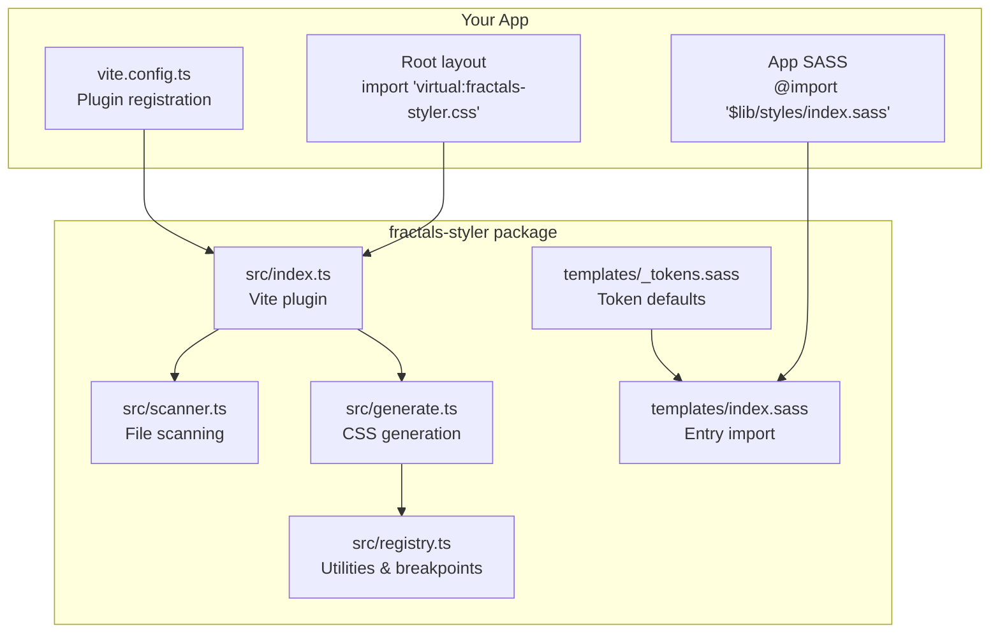
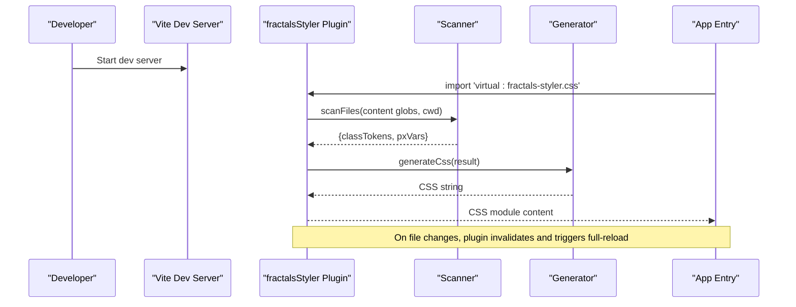
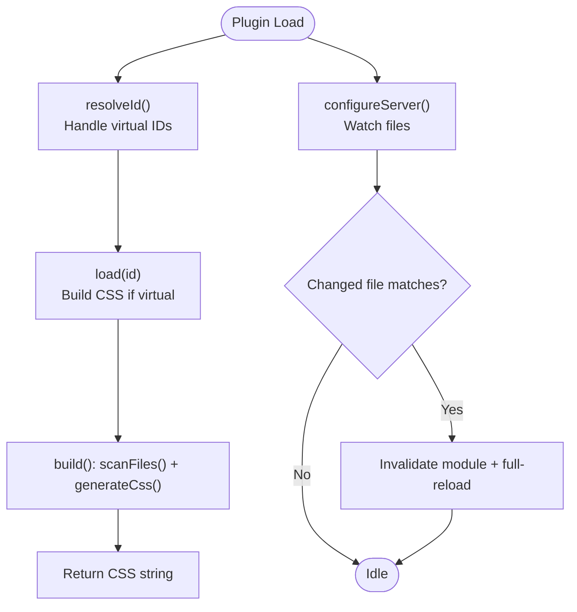
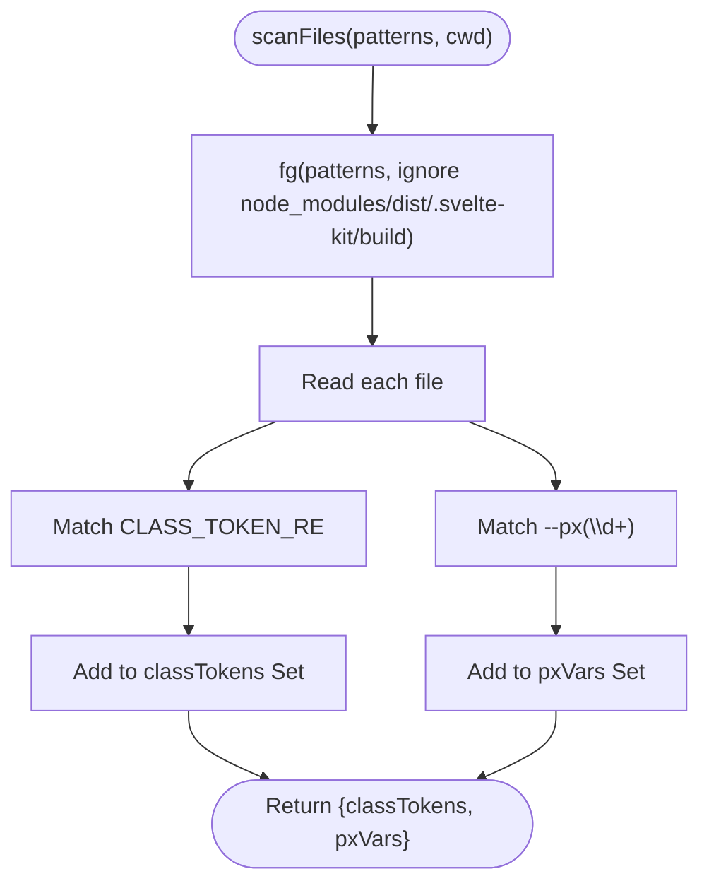
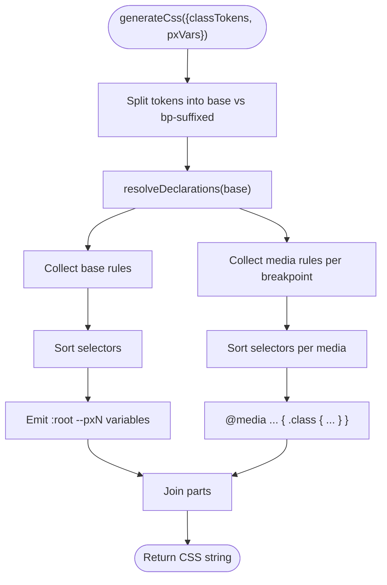
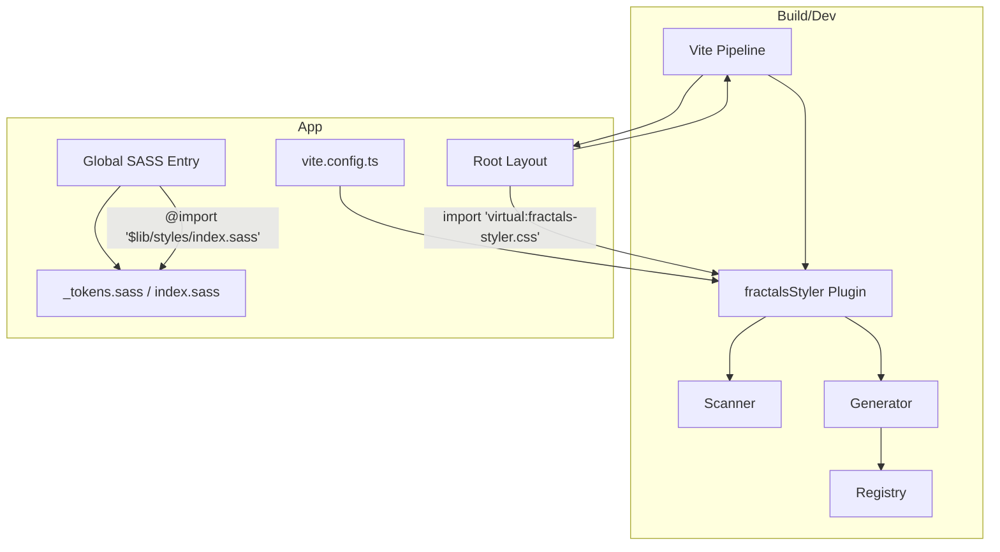
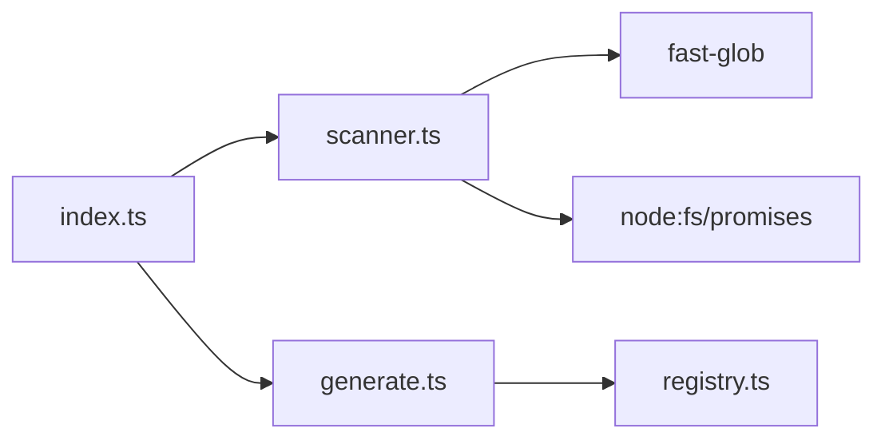

<cite>
**Referenced Files in This Document**
- [package.json](../../packages/fractals-styler/package.json)
- [README.md](../../packages/fractals-styler/README.md)
- [index.ts](../../packages/fractals-styler/src/index.ts)
- [generate.ts](../../packages/fractals-styler/src/generate.ts)
- [scanner.ts](../../packages/fractals-styler/src/scanner.ts)
- [registry.ts](../../packages/fractals-styler/src/registry.ts)
- [_tokens.sass](../../packages/fractals-styler/templates/_tokens.sass)
- [index.sass](../../packages/fractals-styler/templates/index.sass)
- [theme.css](../../sites/fractalhome/theme.css)
</cite>

## Table of Contents
1. [Introduction](#introduction)
2. [Project Structure](#project-structure)
3. [Core Components](#core-components)
4. [Architecture Overview](#architecture-overview)
5. [Detailed Component Analysis](#detailed-component-analysis)
6. [Dependency Analysis](#dependency-analysis)
7. [Performance Considerations](#performance-considerations)
8. [Troubleshooting Guide](#troubleshooting-guide)
9. [Conclusion](#conclusion)
10. [Appendices](#appendices)

## Introduction
Fractal Styler is a Vite plugin and SASS token system designed for SvelteKit (and other Vite-based projects). It provides:
- A JIT numeric utility class generator that emits only the classes you use, including breakpoint-suffixed variants.
- A themeable SASS token layer with sensible defaults and easy overrides.
- Integration points to combine CSS-in-JS patterns (via Svelte’s scoped styles and CSS custom properties) with global design tokens.

The package ships a CLI to scaffold static SASS files into your project, a Vite plugin to generate minimal CSS at dev/build time, and a registry of utilities and breakpoints.

## Project Structure
At a high level, the package exposes:
- A Vite plugin entry point that scans source files and generates a virtual CSS module.
- A scanner that extracts candidate class names and dynamic variable usages from your codebase.
- A generator that turns those candidates into plain CSS rules, including media queries for breakpoint suffixes.
- A registry defining known utilities, breakpoints, and resolution logic.
- Templates for SASS tokens and base styles that you can customize per app.



**Diagram sources**
- [index.ts:1-76](../../packages/fractals-styler/src/index.ts#L1-L76)
- [scanner.ts:1-46](../../packages/fractals-styler/src/scanner.ts#L1-L46)
- [generate.ts:1-62](../../packages/fractals-styler/src/generate.ts#L1-L62)
- [registry.ts:1-94](../../packages/fractals-styler/src/registry.ts#L1-L94)
- [_tokens.sass:1-24](../../packages/fractals-styler/templates/_tokens.sass#L1-L24)
- [index.sass:1-7](../../packages/fractals-styler/templates/index.sass#L1-L7)

**Section sources**
- [package.json:1-45](../../packages/fractals-styler/package.json#L1-L45)
- [README.md:1-124](../../packages/fractals-styler/README.md#L1-L124)

## Core Components
- Vite Plugin (index.ts): Registers a pre-enforced plugin that resolves a virtual CSS module, builds it on demand, and triggers full reloads when watched files change.
- Scanner (scanner.ts): Uses fast-glob to read source files and regex to collect class tokens and --pxN variable usages.
- Generator (generate.ts): Converts collected tokens into CSS, handling breakpoint suffixes and emitting :root variables for --pxN.
- Registry (registry.ts): Defines breakpoints, dynamic prefixes for spacing/sizing, and static utility declarations; resolves a class name to its CSS declarations.
- SASS Templates (_tokens.sass, index.sass): Provide default tokens and an entry file that forwards mixins, typography, globals, primitives, and buttons/links.

Key capabilities:
- JIT numeric utilities like gapN, padN, marginN, heightN, widthN, and their directional variants.
- Breakpoint-suffixed variants for any class the engine knows statically (e.g., .box-sm, .text-lg-xs).
- Dynamic --pxN variables emitted to :root when used anywhere in scanned files.
- Theme overrides via SASS tokens under :root or scoped classes.

**Section sources**
- [index.ts:1-76](../../packages/fractals-styler/src/index.ts#L1-L76)
- [scanner.ts:1-46](../../packages/fractals-styler/src/scanner.ts#L1-L46)
- [generate.ts:1-62](../../packages/fractals-styler/src/generate.ts#L1-L62)
- [registry.ts:1-94](../../packages/fractals-styler/src/registry.ts#L1-L94)
- [_tokens.sass:1-24](../../packages/fractals-styler/templates/_tokens.sass#L1-L24)
- [index.sass:1-7](../../packages/fractals-styler/templates/index.sass#L1-L7)

## Architecture Overview
The styling pipeline integrates tightly with Vite and SvelteKit:
- You register the fractalsStyler plugin in vite.config.ts.
- Import virtual:fractals-styler.css once globally (e.g., root layout).
- The plugin scans configured content globs, collects tokens, and returns generated CSS through a virtual module.
- Your app also imports the SASS token layer once globally to provide theme variables and base styles.



**Diagram sources**
- [index.ts:25-69](../../packages/fractals-styler/src/index.ts#L25-L69)
- [scanner.ts:16-45](../../packages/fractals-styler/src/scanner.ts#L16-L45)
- [generate.ts:13-61](../../packages/fractals-styler/src/generate.ts#L13-L61)

**Section sources**
- [README.md:33-52](../../packages/fractals-styler/README.md#L33-L52)

## Detailed Component Analysis

### Vite Plugin (index.ts)
Responsibilities:
- Define a virtual module id and enforce ordering so Vite’s CSS pipeline doesn’t intercept prematurely.
- Resolve virtual ids including query suffixes for SSR inlining.
- Build CSS by scanning and generating on load.
- Watch source files and trigger full reloads when they change.



**Diagram sources**
- [index.ts:25-69](../../packages/fractals-styler/src/index.ts#L25-L69)

**Section sources**
- [index.ts:1-76](../../packages/fractals-styler/src/index.ts#L1-L76)

### Scanner (scanner.ts)
Responsibilities:
- Glob files using fast-glob with safe ignores.
- Extract all identifier-like tokens and --pxN references.
- Return a compact result with unique sets for deduplication.

Complexity:
- Time: O(F × L), where F is number of files and L is average line length (regex scanning).
- Space: O(U + P), where U is unique class tokens and P is unique --pxN values.



**Diagram sources**
- [scanner.ts:16-45](../../packages/fractals-styler/src/scanner.ts#L16-L45)

**Section sources**
- [scanner.ts:1-46](../../packages/fractals-styler/src/scanner.ts#L1-L46)

### Generator (generate.ts)
Responsibilities:
- Separate base rules and breakpoint-suffixed rules.
- Resolve declarations via registry.
- Emit :root variables for --pxN usage.
- Sort selectors for deterministic output.



**Diagram sources**
- [generate.ts:13-61](../../packages/fractals-styler/src/generate.ts#L13-L61)

**Section sources**
- [generate.ts:1-62](../../packages/fractals-styler/src/generate.ts#L1-L62)

### Registry (registry.ts)
Responsibilities:
- Define breakpoints and their media queries.
- Map dynamic prefixes to CSS properties for JIT utilities.
- Provide static utility declarations for known classes.
- Resolve a base class name to its CSS declarations.

```mermaid
classDiagram
class Registry {
+BREAKPOINTS : Record~Breakpoint,string~
+BREAKPOINT_ORDER : Breakpoint[]
+DYNAMIC_PREFIXES : {prefix : string, prop : string}[]
+STATIC_UTILITIES : Record~string,Declaration[]~
+resolveDeclarations(base) : Declaration[]?
}
class Declaration {
+prop : string
+value : string
}
Registry --> Declaration : "returns"
```

**Diagram sources**
- [registry.ts:1-94](../../packages/fractals-styler/src/registry.ts#L1-L94)

**Section sources**
- [registry.ts:1-94](../../packages/fractals-styler/src/registry.ts#L1-L94)

### SASS Token System (templates)
- _tokens.sass: Default color scales, text/border tokens, and accent colors. Override under :root or scoped classes to implement themes.
- index.sass: Entry that forwards mixins, tokens, typography, globals, primitives, and buttons/links.

Usage pattern:
- Scaffold templates into your project via CLI.
- Import the SASS entry once globally (e.g., root layout).
- Override tokens under :root for global theming or under a class for scoped themes.

**Section sources**
- [_tokens.sass:1-24](../../packages/fractals-styler/templates/_tokens.sass#L1-L24)
- [index.sass:1-7](../../packages/fractals-styler/templates/index.sass#L1-L7)
- [README.md:11-31](../../packages/fractals-styler/README.md#L11-L31)

## Architecture Overview
This section maps how the plugin, scanner, generator, and registry collaborate to produce minimal CSS and how apps integrate both the virtual CSS and SASS tokens.



**Diagram sources**
- [index.ts:25-69](../../packages/fractals-styler/src/index.ts#L25-L69)
- [scanner.ts:16-45](../../packages/fractals-styler/src/scanner.ts#L16-L45)
- [generate.ts:13-61](../../packages/fractals-styler/src/generate.ts#L13-L61)
- [registry.ts:1-94](../../packages/fractals-styler/src/registry.ts#L1-L94)
- [_tokens.sass:1-24](../../packages/fractals-styler/templates/_tokens.sass#L1-L24)
- [index.sass:1-7](../../packages/fractals-styler/templates/index.sass#L1-L7)

## Detailed Component Analysis

### Creating Custom Themes
Approach:
- Use SASS tokens to define color scales and semantic tokens.
- Override tokens under :root for global themes or under a scoped class for component-level themes.
- Combine with Svelte’s CSS custom properties to pass theme values across component boundaries.

Example strategy:
- Define light and dark token sets in your app’s global CSS or SASS.
- Toggle data-theme attributes or class names to switch themes.
- Reference tokens in components via CSS variables.

Reference implementation example (global tokens and dark mode):
- See sites/fractalhome/theme.css for a complete token set and dark-mode override pattern.

**Section sources**
- [_tokens.sass:1-24](../../packages/fractals-styler/templates/_tokens.sass#L1-L24)
- [theme.css:12-61](../../sites/fractalhome/theme.css#L12-L61)

### Implementing Dark Mode Support
Patterns:
- Use CSS custom properties to define light and dark palettes.
- Apply a data-theme attribute or class to root to switch tokens.
- Ensure focus states, selection colors, and shadows adapt to the active theme.

Reference implementation example:
- See sites/fractalhome/theme.css for light/dark token definitions and UI adjustments.

**Section sources**
- [theme.css:12-61](../../sites/fractalhome/theme.css#L12-L61)

### Maintaining Design Consistency
Guidelines:
- Centralize tokens in SASS templates and override only where necessary.
- Prefer semantic tokens (e.g., --text-primary, --border-primary) over raw colors.
- Use the JIT utilities for consistent spacing and sizing, avoiding ad-hoc values.
- Keep breakpoint suffixes limited to classes the engine recognizes; for custom classes, use provided mixins.

**Section sources**
- [README.md:86-109](../../packages/fractals-styler/README.md#L86-L109)
- [_tokens.sass:1-24](../../packages/fractals-styler/templates/_tokens.sass#L1-L24)

### Build-Time Processing and CSS Extraction
How it works:
- The plugin scans source files for class tokens and --pxN usage.
- It generates only the CSS needed, including breakpoint-suffixed variants.
- The virtual module is consumed by Vite’s CSS pipeline; no extra extraction step is required.

Optimization tips:
- Configure content globs to include only what you need.
- Avoid unnecessary large directories in globs to reduce scan time.
- Leverage Vite’s watch behavior for fast feedback during development.

**Section sources**
- [index.ts:25-69](../../packages/fractals-styler/src/index.ts#L25-L69)
- [scanner.ts:16-45](../../packages/fractals-styler/src/scanner.ts#L16-L45)
- [generate.ts:13-61](../../packages/fractals-styler/src/generate.ts#L13-L61)

### Performance Optimizations for Large-Scale Apps
Recommendations:
- Narrow content globs to minimize file reads.
- Exclude heavy directories (node_modules, dist, build artifacts) — already handled by scanner.
- Reuse the same virtual module import across the app to avoid duplication.
- Keep token overrides centralized to prevent redundant CSS.

[No sources needed since this section provides general guidance]

## Dependency Analysis
Internal dependencies:
- index.ts depends on scanner.ts and generate.ts.
- generate.ts depends on registry.ts.
- scanner.ts uses fast-glob and Node fs/promises.

External integration:
- Vite plugin interface and dev server APIs.
- SvelteKit apps import the virtual CSS module and SASS tokens.



**Diagram sources**
- [index.ts:1-76](../../packages/fractals-styler/src/index.ts#L1-L76)
- [scanner.ts:1-46](../../packages/fractals-styler/src/scanner.ts#L1-L46)
- [generate.ts:1-62](../../packages/fractals-styler/src/generate.ts#L1-L62)
- [registry.ts:1-94](../../packages/fractals-styler/src/registry.ts#L1-L94)

**Section sources**
- [package.json:29-36](../../packages/fractals-styler/package.json#L29-L36)

## Performance Considerations
- JIT scanning cost scales with number of files and lines scanned; keep globs tight.
- Output size is proportional to actual usage; unused classes are not emitted.
- Breakpoint suffixes add media blocks only for used classes.
- --pxN variables are emitted once per unique value.

[No sources needed since this section provides general guidance]

## Troubleshooting Guide
Common issues and resolutions:
- Virtual module not resolved: Ensure you import 'virtual:fractals-styler.css' exactly once and that the plugin is registered before other CSS plugins.
- Classes not generated: Verify your content globs include the files where classes are used; the scanner looks for identifier-like tokens broadly.
- Breakpoint suffixes not working: Only classes known statically (from registry) support suffixes; for custom classes, use the provided mixins.
- No --pxN variables: Confirm you reference var(--pxN) in your code; the scanner emits variables only when detected.

**Section sources**
- [README.md:33-52](../../packages/fractals-styler/README.md#L33-L52)
- [index.ts:35-69](../../packages/fractals-styler/src/index.ts#L35-L69)
- [scanner.ts:16-45](../../packages/fractals-styler/src/scanner.ts#L16-L45)
- [generate.ts:40-44](../../packages/fractals-styler/src/generate.ts#L40-L44)

## Conclusion
Fractal Styler delivers a pragmatic, performant styling system for SvelteKit and Vite projects:
- Minimal CSS via JIT scanning and generation.
- Flexible SASS token layer for consistent theming.
- Clear integration points for CSS-in-JS patterns through Svelte’s scoped styles and CSS custom properties.
Adopting these patterns helps maintain design consistency, supports dark mode, and scales efficiently across large applications.

[No sources needed since this section summarizes without analyzing specific files]

## Appendices

### Quick Start Checklist
- Install the package and scaffold templates into your project.
- Register the plugin in vite.config.ts.
- Import the virtual CSS module once globally.
- Import the SASS token entry once globally.
- Override tokens for your themes and use JIT utilities in components.

**Section sources**
- [README.md:11-52](../../packages/fractals-styler/README.md#L11-L52)
