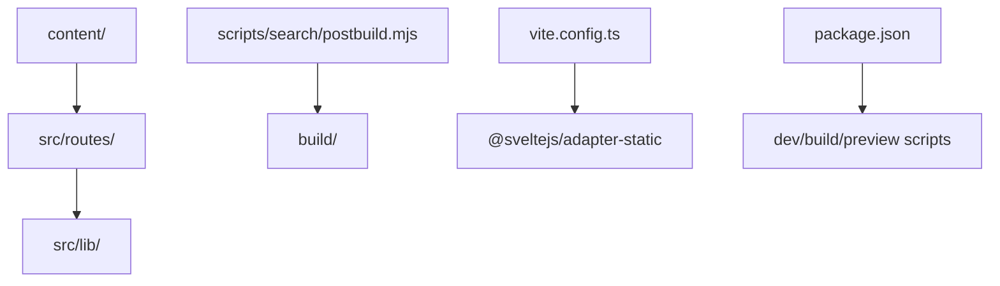
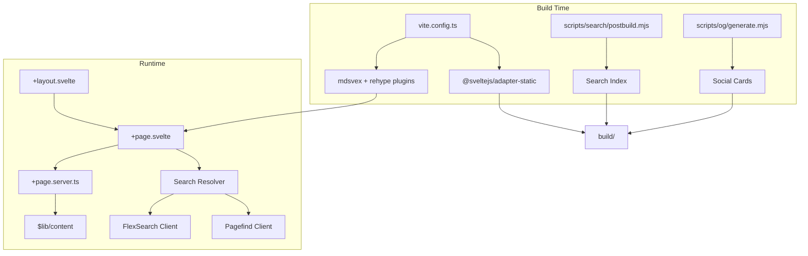
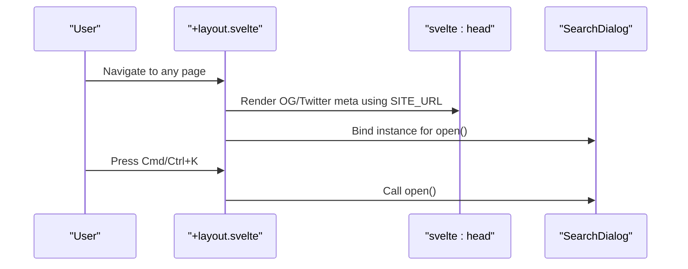
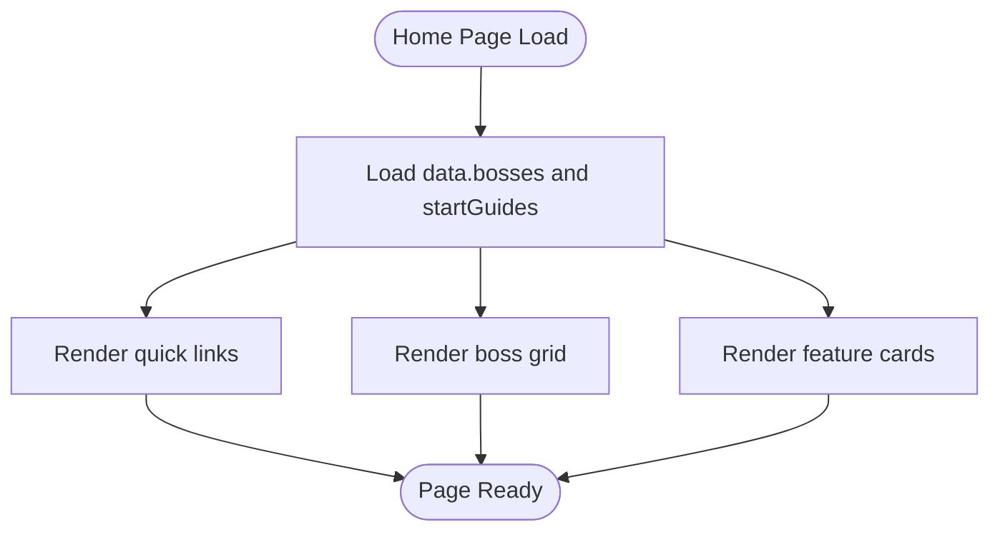
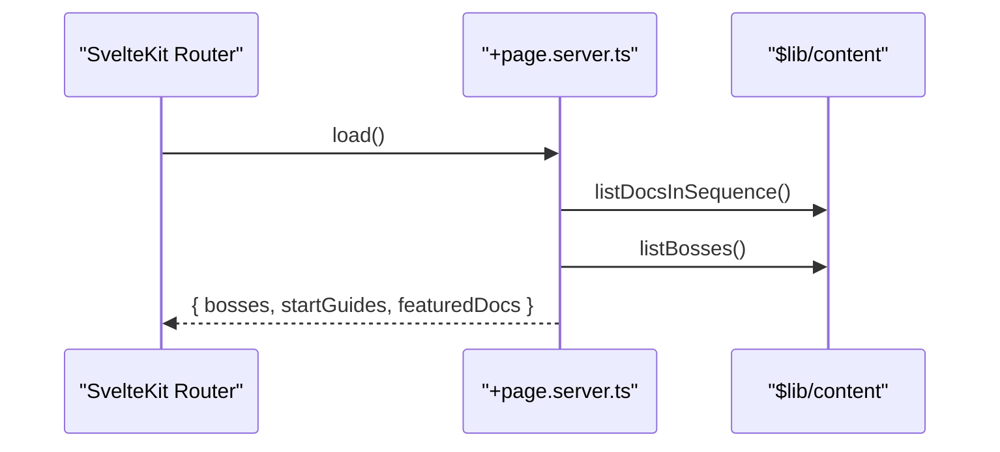
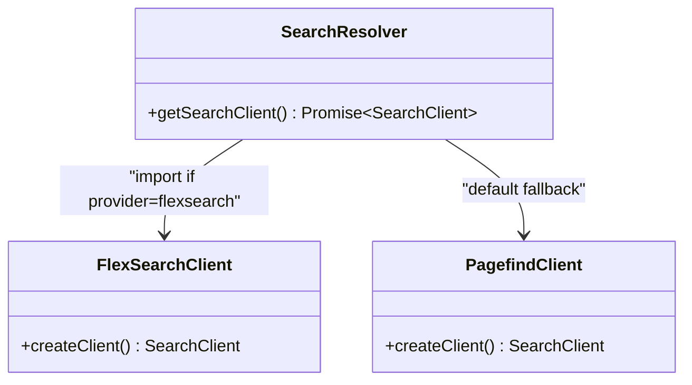
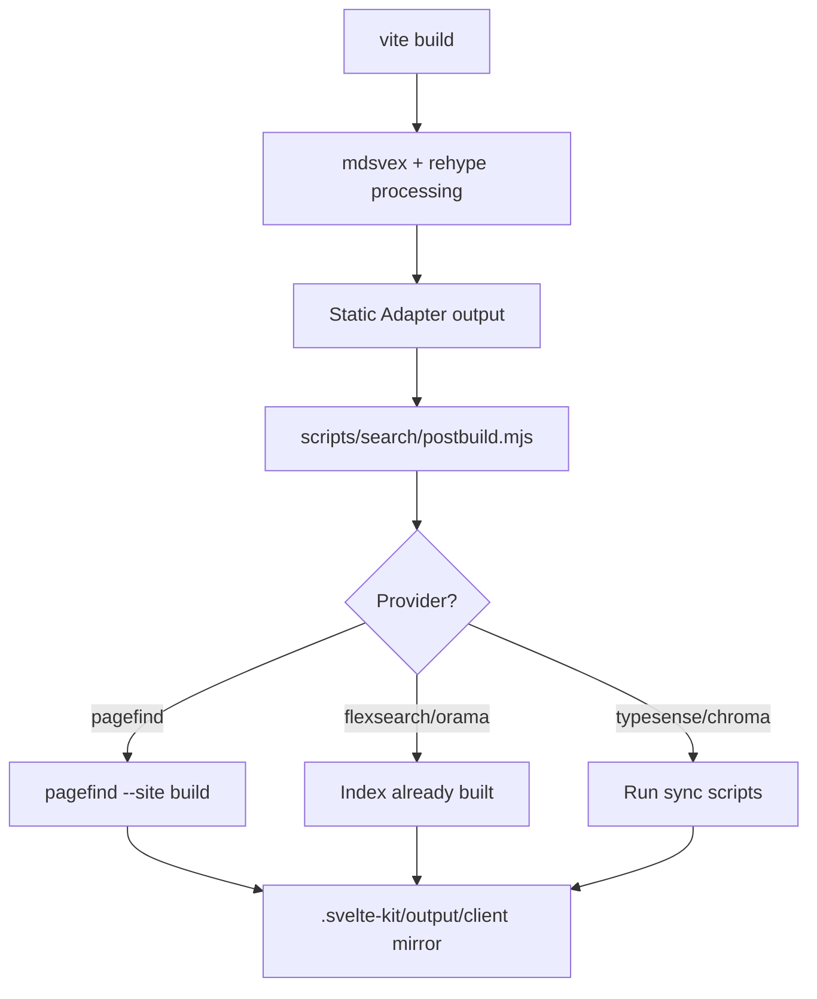
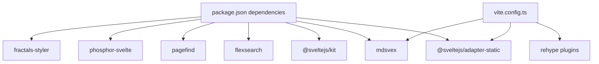

<cite>
**Referenced Files in This Document**
- [package.json](../../sites/fractalagentic/package.json)
- [README.md](../../sites/fractalagentic/README.md)
- [vite.config.ts](../../sites/fractalagentic/vite.config.ts)
- [deno.json](../../sites/fractalagentic/deno.json)
- [src/routes/+layout.svelte](../../sites/fractalagentic/src/routes/+layout.svelte)
- [src/routes/+page.svelte](../../sites/fractalagentic/src/routes/+page.svelte)
- [src/routes/+page.server.ts](../../sites/fractalagentic/src/routes/+page.server.ts)
- [src/lib/site.ts](../../sites/fractalagentic/src/lib/site.ts)
- [src/lib/search/resolver.ts](../../sites/fractalagentic/src/lib/search/resolver.ts)
- [scripts/search/postbuild.mjs](../../sites/fractalagentic/scripts/search/postbuild.mjs)
</cite>

## Table of Contents
1. [Introduction](#introduction)
2. [Project Structure](#project-structure)
3. [Core Components](#core-components)
4. [Architecture Overview](#architecture-overview)
5. [Detailed Component Analysis](#detailed-component-analysis)
6. [Dependency Analysis](#dependency-analysis)
7. [Performance Considerations](#performance-considerations)
8. [Troubleshooting Guide](#troubleshooting-guide)
9. [Conclusion](#conclusion)
10. [Appendices](#appendices)

## Introduction
FractalAgentic is a SvelteKit-based documentation site that powers the knowledge hub for AI agent orchestration. It uses a markdown-first content system with optional metadata files, dynamic routing for docs and agents, and a pluggable search backend. The site integrates with the broader Fractals ecosystem through shared libraries and consistent design tokens, while providing onboarding flows and structured agent documentation.

Key highlights:
- Built with SvelteKit and Svelte 5, TypeScript, and mdsvex for Markdown processing.
- Static deployment via @sveltejs/adapter-static with Vite build pipeline.
- Search index generation supports multiple backends (FlexSearch, Pagefind, Orama, Typesense, Chroma).
- Content-driven routes from the content directory with meta configuration.
- Social media card generation and SEO-friendly metadata.

## Project Structure
The site follows a standard SvelteKit layout with content under a dedicated folder and scripts for post-build tasks. Key directories:
- content/: Markdown pages and optional .meta.json files for metadata.
- src/routes/: SvelteKit route definitions including server-side loaders and page components.
- src/lib/: Shared libraries for search, theming, icons, and utilities.
- scripts/: Post-build scripts for search indexing and social cards.

**Diagram sources**
- [vite.config.ts:134-156](../../sites/fractalagentic/vite.config.ts#L134-L156)
- [package.json:6-17](../../sites/fractalagentic/package.json#L6-L17)

**Section sources**
- [README.md:1-37](../../sites/fractalagentic/README.md#L1-L37)
- [package.json:1-59](../../sites/fractalagentic/package.json#L1-L59)

## Core Components
- Layout and UI Shell: Global header, footer, search dialog, theme toggle, and accessibility features.
- Home Page: Curated navigation to skills, commands, agents, bosses, and orchestrators with featured docs.
- Server Loader: Aggregates boss listings and curated doc summaries for the home page.
- Site Configuration: Centralized site metadata, repository links, and edit URL helpers.
- Search Resolver: Pluggable search client factory supporting multiple backends.

**Section sources**
- [src/routes/+layout.svelte:1-126](../../sites/fractalagentic/src/routes/+layout.svelte#L1-L126)
- [src/routes/+page.svelte:1-145](../../sites/fractalagentic/src/routes/+page.svelte#L1-L145)
- [src/routes/+page.server.ts:1-22](../../sites/fractalagentic/src/routes/+page.server.ts#L1-L22)
- [src/lib/site.ts:1-26](../../sites/fractalagentic/src/lib/site.ts#L1-L26)
- [src/lib/search/resolver.ts:1-27](../../sites/fractalagentic/src/lib/search/resolver.ts#L1-L27)

## Architecture Overview
The site architecture combines SvelteKit routing, static adapter, mdsvex processing, and a flexible search layer. Build-time plugins compute last-updated dates from git history, and post-build scripts generate search indexes and social cards.

**Diagram sources**
- [vite.config.ts:108-132](../../sites/fractalagentic/vite.config.ts#L108-L132)
- [vite.config.ts:134-156](../../sites/fractalagentic/vite.config.ts#L134-L156)
- [scripts/search/postbuild.mjs:1-46](../../sites/fractalagentic/scripts/search/postbuild.mjs#L1-L46)
- [src/lib/search/resolver.ts:12-26](../../sites/fractalagentic/src/lib/search/resolver.ts#L12-L26)

## Detailed Component Analysis

### Layout and UI Shell
The root layout composes global elements: header with branding, search box, theme toggle, and footer with ecosystem links. It injects Open Graph and Twitter metadata when SITE_URL is set, and wires keyboard shortcuts for search.

**Diagram sources**
- [src/routes/+layout.svelte:16-46](../../sites/fractalagentic/src/routes/+layout.svelte#L16-L46)
- [src/routes/+layout.svelte:27-32](../../sites/fractalagentic/src/routes/+layout.svelte#L27-L32)

**Section sources**
- [src/routes/+layout.svelte:1-126](../../sites/fractalagentic/src/routes/+layout.svelte#L1-L126)

### Home Page and Navigation
The home page presents a concise overview of the orchestration model, quick links to Skills, Commands, Agents, Bosses, and Orchestrators, and highlights key guides and features.

**Diagram sources**
- [src/routes/+page.svelte:14-41](../../sites/fractalagentic/src/routes/+page.svelte#L14-L41)
- [src/routes/+page.svelte:43-84](../../sites/fractalagentic/src/routes/+page.svelte#L43-L84)

**Section sources**
- [src/routes/+page.svelte:1-145](../../sites/fractalagentic/src/routes/+page.svelte#L1-L145)

### Server Loader for Home Data
The server loader aggregates boss listings and curates starting guides and featured docs based on slugs.

**Diagram sources**
- [src/routes/+page.server.ts:1-22](../../sites/fractalagentic/src/routes/+page.server.ts#L1-L22)

**Section sources**
- [src/routes/+page.server.ts:1-22](../../sites/fractalagentic/src/routes/+page.server.ts#L1-L22)

### Site Configuration
Centralized constants define site identity, description, production URL, repository link, branch, and helper functions for generating edit URLs.

**Section sources**
- [src/lib/site.ts:1-26](../../sites/fractalagentic/src/lib/site.ts#L1-L26)

### Search Resolver and Backends
The resolver dynamically loads the active search client based on an environment variable, defaulting to FlexSearch or Pagefind. This abstraction allows swapping backends without changing UI code.

**Diagram sources**
- [src/lib/search/resolver.ts:12-26](../../sites/fractalagentic/src/lib/search/resolver.ts#L12-L26)

**Section sources**
- [src/lib/search/resolver.ts:1-27](../../sites/fractalagentic/src/lib/search/resolver.ts#L1-L27)

### Build Pipeline and Post-Build Scripts
Vite config integrates mdsvex, rehype plugins for headings, autolinks, and KaTeX, and sets up the static adapter. Post-build script dispatches indexing for the configured search provider and mirrors assets for preview.

**Diagram sources**
- [vite.config.ts:108-132](../../sites/fractalagentic/vite.config.ts#L108-L132)
- [vite.config.ts:134-156](../../sites/fractalagentic/vite.config.ts#L134-L156)
- [scripts/search/postbuild.mjs:1-46](../../sites/fractalagentic/scripts/search/postbuild.mjs#L1-L46)

**Section sources**
- [vite.config.ts:1-157](../../sites/fractalagentic/vite.config.ts#L1-L157)
- [scripts/search/postbuild.mjs:1-46](../../sites/fractalagentic/scripts/search/postbuild.mjs#L1-L46)

### Onboarding Flow Structure
Onboarding content is organized under a dedicated section with sequential steps and metadata files. Each step includes a markdown file and an accompanying .meta.json for titles, descriptions, and ordering.

- Example structure:
  - content/onboarding/01-introduction.md + .meta.json
  - content/onboarding/02-getting-started.md + .meta.json
  - content/onboarding/03-install.md + .meta.json

This pattern ensures predictable routing and sidebar ordering for guided user journeys.

**Section sources**
- [README.md:26-28](../../sites/fractalagentic/README.md#L26-L28)

### Agent Documentation Organization
Agent-related documentation is grouped under domain-specific routes such as agents, bosses, commands, and skills. Each route typically includes:
- A listing page that enumerates available items.
- Dynamic detail pages for individual agents/bosses/commands/skills.
- Optional meta files to control titles, descriptions, and navigation order.

Contributors should follow the same naming conventions and include .meta.json files to maintain consistency across the knowledge base.

**Section sources**
- [src/routes/+page.svelte:59-83](../../sites/fractalagentic/src/routes/+page.svelte#L59-L83)

### Routing System for Dynamic Content Pages
SvelteKit’s file-based routing maps content files to routes automatically. The presence of .md/.svx files under content/ generates corresponding pages. Metadata files (.meta.json) provide frontmatter-like configuration for titles, descriptions, and navigation hints.

- Route generation: content/<slug>.md -> /<slug>
- Nested sections: content/docs/_meta.json defines hierarchy and ordering.
- Dynamic details: routes like agents/[...slug] render per-item pages.

**Section sources**
- [README.md:26-28](../../sites/fractalagentic/README.md#L26-L28)

### Search Index Generation
Search indexing is handled by postbuild scripts that support multiple providers:
- Pagefind: runs pagefind --site build and mirrors into preview output.
- FlexSearch/Orama: index built during vite build; no extra step needed.
- Typesense/Chroma: custom sync scripts executed via bun.

Environment variable PUBLIC_SVOCS_SEARCH_PROVIDER selects the active backend.

**Section sources**
- [scripts/search/postbuild.mjs:1-46](../../sites/fractalagentic/scripts/search/postbuild.mjs#L1-L46)
- [src/lib/search/resolver.ts:12-26](../../sites/fractalagentic/src/lib/search/resolver.ts#L12-L26)

### Deployment Configuration
Deployment targets are static sites via @sveltejs/adapter-static. Environment variables:
- BASE_PATH: Set for sub-path deployments (e.g., GitHub Pages project sites).
- PUBLIC_SVOCS_SEARCH_PROVIDER: Selects search backend.
- SITE_URL: Used for absolute URLs in llms.txt and social cards.

Scripts:
- dev: Start development server.
- build: Build site and run postbuild indexing and OG generation.
- preview: Preview built site locally.

**Section sources**
- [vite.config.ts:145-150](../../sites/fractalagentic/vite.config.ts#L145-L150)
- [package.json:6-17](../../sites/fractalagentic/package.json#L6-L17)
- [src/lib/site.ts:10-10](../../sites/fractalagentic/src/lib/site.ts#L10-L10)

## Dependency Analysis
The site depends on:
- SvelteKit and adapter-static for routing and static hosting.
- mdsvex and rehype plugins for Markdown processing and enhancements.
- FlexSearch/Pagefind for client-side search indexing.
- Phosphor icons and fractals-styler for UI and styling.
- Git integration for last-updated dates during build.

**Diagram sources**
- [package.json:19-48](../../sites/fractalagentic/package.json#L19-L48)
- [vite.config.ts:108-132](../../sites/fractalagentic/vite.config.ts#L108-L132)

**Section sources**
- [package.json:1-59](../../sites/fractalagentic/package.json#L1-L59)
- [vite.config.ts:1-157](../../sites/fractalagentic/vite.config.ts#L1-L157)

## Performance Considerations
- Last-updated dates are computed once and memoized to avoid repeated git calls.
- Shallow clones may truncate history; logs indicate when dates are missing.
- Client-side search avoids server round-trips; choose appropriate indexer size.
- Static adapter ensures fast delivery; ensure assets are optimized.

[No sources needed since this section provides general guidance]

## Troubleshooting Guide
Common issues and resolutions:
- Missing last-updated dates: Ensure full git history is available; shallow clones cause empty date maps.
- Search not working: Verify PUBLIC_SVOCS_SEARCH_PROVIDER matches installed backend; check build artifacts exist.
- Sub-path deployment: Set BASE_PATH correctly; verify generated paths in build output.
- Preview search index: Mirror pagefind assets into .svelte-kit/output/client for local previews.

**Section sources**
- [vite.config.ts:56-71](../../sites/fractalagentic/vite.config.ts#L56-L71)
- [scripts/search/postbuild.mjs:16-24](../../sites/fractalagentic/scripts/search/postbuild.mjs#L16-L24)

## Conclusion
FractalAgentic provides a robust, extensible documentation platform for AI agent orchestration. Its modular architecture, content-driven routing, and pluggable search make it easy to maintain and scale. Contributors can add new agent documentation following established patterns, ensuring consistency and discoverability across the knowledge base.

[No sources needed since this section summarizes without analyzing specific files]

## Appendices

### Contributor Guidelines
- Add new content under content/ with .md files and optional .meta.json for metadata.
- Follow naming conventions for routes and slugs to maintain predictable URLs.
- Use deno.json or package.json scripts for development, building, and linting.
- Test search functionality locally with the selected provider.
- Deploy with BASE_PATH set appropriately for sub-path hosting.

**Section sources**
- [README.md:26-36](../../sites/fractalagentic/README.md#L26-L36)
- [deno.json:1-12](../../sites/fractalagentic/deno.json#L1-L12)
