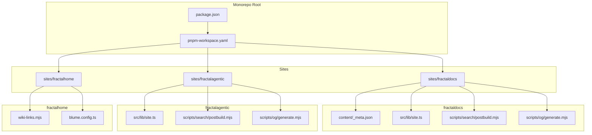
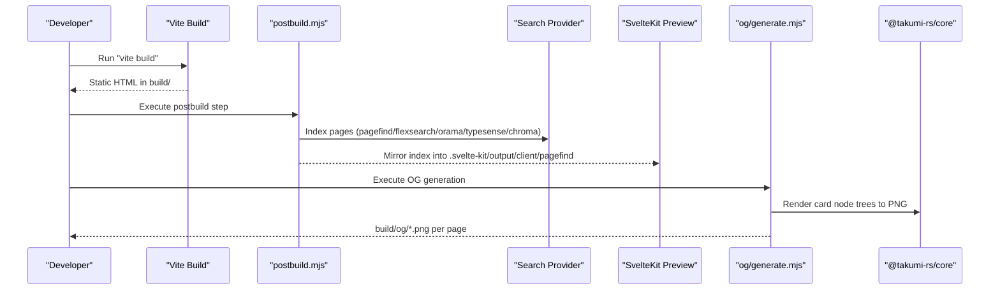
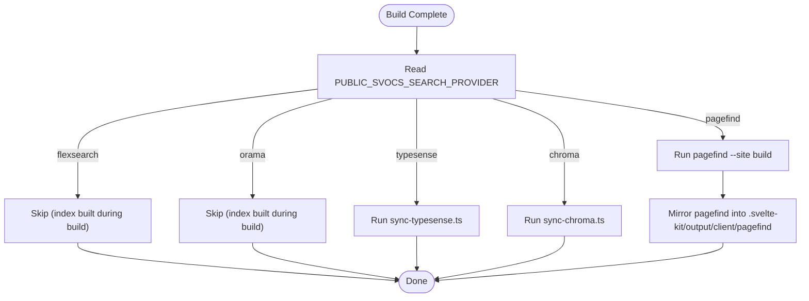
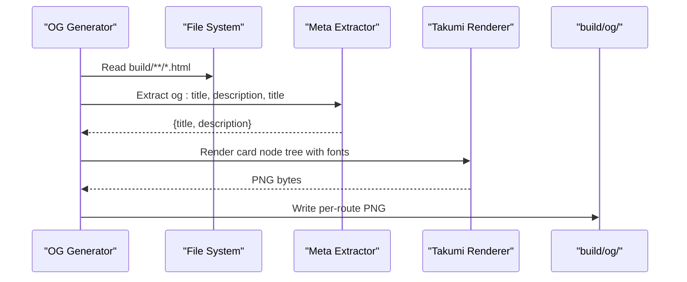
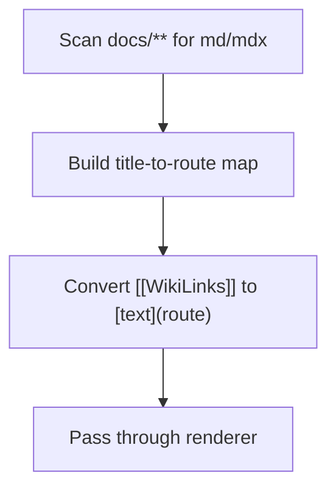
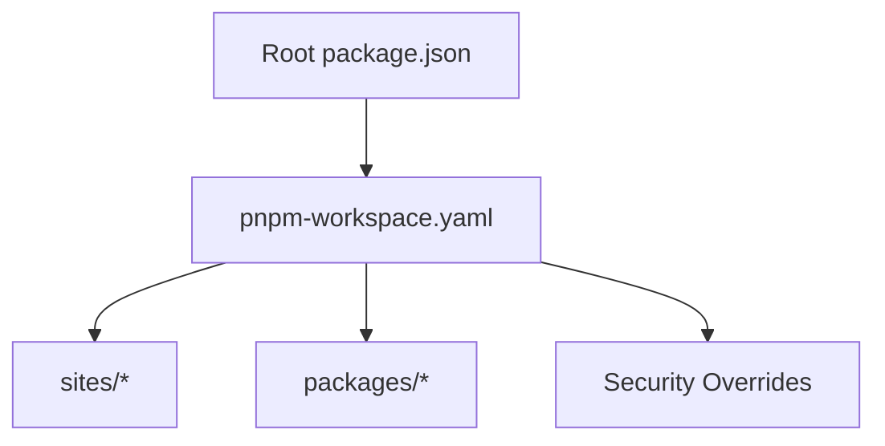

<cite>
**Referenced Files in This Document**
- [README.md](../../README.md)
- [package.json](../../package.json)
- [pnpm-workspace.yaml](../../pnpm-workspace.yaml)
- [sites/fractaldocs/package.json](../../sites/fractaldocs/package.json)
- [sites/fractalagentic/package.json](../../sites/fractalagentic/package.json)
- [sites/fractaldocs/src/lib/site.ts](../../sites/fractaldocs/src/lib/site.ts)
- [sites/fractalagentic/src/lib/site.ts](../../sites/fractalagentic/src/lib/site.ts)
- [sites/fractaldocs/scripts/search/postbuild.mjs](../../sites/fractaldocs/scripts/search/postbuild.mjs)
- [sites/fractaldocs/scripts/og/generate.mjs](../../sites/fractaldocs/scripts/og/generate.mjs)
- [sites/fractalagentic/scripts/search/postbuild.mjs](../../sites/fractalagentic/scripts/search/postbuild.mjs)
- [sites/fractalagentic/scripts/og/generate.mjs](../../sites/fractalagentic/scripts/og/generate.mjs)
- [sites/fractaldocs/content/_meta.json](../../sites/fractaldocs/content/_meta.json)
- [sites/fractalhome/wiki-links.mjs](../../sites/fractalhome/wiki-links.mjs)
- [sites/fractalhome/blume.config.ts](../../sites/fractalhome/blume.config.ts)
</cite>

## Table of Contents
1. Introduction
2. Project Structure
3. Core Components
4. Architecture Overview
5. Detailed Component Analysis
6. Dependency Analysis
7. Performance Considerations
8. Troubleshooting Guide
9. Conclusion
10. Appendices

## Introduction
FractalDocs is the unified documentation hub for the Fractals monorepo, aggregating project documentation across multiple sites and apps. It provides a consistent authoring experience, cross-linking between projects, search, SEO optimization, and Open Graph image generation. The hub is built on SvelteKit with Svelte 5 and TypeScript, styled exclusively with single-tab indented SASS, and packaged via pnpm workspaces.

This document explains:
- Unified documentation architecture and content organization strategy
- Aggregation of different project documentation into a cohesive portal
- Search functionality and supported backends
- Open Graph image generation pipeline
- SEO features (sitemap, robots.txt, meta tags)
- Contributor guidelines for consistency across projects
- Versioning strategies and deployment processes
- Technical infrastructure supporting multiple sources and cross-linking

**Section sources**
- [README.md:1-50](../../README.md#L1-L50)
- [package.json:1-36](../../package.json#L1-L36)
- [pnpm-workspace.yaml:1-30](../../pnpm-workspace.yaml#L1-L30)

## Project Structure
The monorepo organizes documentation under sites/, each site being a SvelteKit application with its own content, scripts, and build configuration. Key directories:
- sites/fractaldocs: Central docs hub with content/_meta.json navigation and shared scripts for search and OG images
- sites/fractalagentic: Documentation site mirroring fractaldocs structure and scripts
- sites/fractalhome: Knowledge base site using Blume with wiki link conversion and frontmatter schema

**Diagram sources**
- [package.json:1-36](../../package.json#L1-L36)
- [pnpm-workspace.yaml:1-30](../../pnpm-workspace.yaml#L1-L30)
- [sites/fractaldocs/package.json:1-53](../../sites/fractaldocs/package.json#L1-L53)
- [sites/fractalagentic/package.json:1-59](../../sites/fractalagentic/package.json#L1-L59)
- [sites/fractaldocs/content/_meta.json:1-19](../../sites/fractaldocs/content/_meta.json#L1-L19)
- [sites/fractaldocs/src/lib/site.ts:1-26](../../sites/fractaldocs/src/lib/site.ts#L1-L26)
- [sites/fractalagentic/src/lib/site.ts:1-26](../../sites/fractalagentic/src/lib/site.ts#L1-L26)
- [sites/fractaldocs/scripts/search/postbuild.mjs:1-46](../../sites/fractaldocs/scripts/search/postbuild.mjs#L1-L46)
- [sites/fractaldocs/scripts/og/generate.mjs:1-259](../../sites/fractaldocs/scripts/og/generate.mjs#L1-L259)
- [sites/fractalagentic/scripts/search/postbuild.mjs:1-46](../../sites/fractalagentic/scripts/search/postbuild.mjs#L1-L46)
- [sites/fractalagentic/scripts/og/generate.mjs:1-259](../../sites/fractalagentic/scripts/og/generate.mjs#L1-L259)
- [sites/fractalhome/wiki-links.mjs:1-98](../../sites/fractalhome/wiki-links.mjs#L1-L98)
- [sites/fractalhome/blume.config.ts:1-52](../../sites/fractalhome/blume.config.ts#L1-L52)

**Section sources**
- [README.md:1-50](../../README.md#L1-L50)
- [pnpm-workspace.yaml:1-30](../../pnpm-workspace.yaml#L1-L30)

## Core Components
- Site metadata and repository integration: Each site defines SITE_NAME, SITE_URL, REPO_URL, REPO_BRANCH, and getEditUrl to enable “Edit on GitHub” links and absolute URLs in llms.txt outputs.
- Content navigation: _meta.json controls sidebar ordering and separators for structured navigation.
- Search indexing: postbuild.mjs dispatches provider-specific indexing (pagefind, flexsearch, orama, typesense, chroma).
- Open Graph generation: og/generate.mjs renders per-page PNG cards from prerendered HTML using @takumi-rs/core.
- Cross-linking: wiki-links.mjs converts [[WikiLinks]] into proper markdown links based on a prebuilt map of titles/routes.

Key responsibilities:
- Consistent site identity and editability
- Author-friendly content organization
- Pluggable search backends
- Automated social media assets
- Inter-document linking across knowledge bases

**Section sources**
- [sites/fractaldocs/src/lib/site.ts:1-26](../../sites/fractaldocs/src/lib/site.ts#L1-L26)
- [sites/fractalagentic/src/lib/site.ts:1-26](../../sites/fractalagentic/src/lib/site.ts#L1-L26)
- [sites/fractaldocs/content/_meta.json:1-19](../../sites/fractaldocs/content/_meta.json#L1-L19)
- [sites/fractaldocs/scripts/search/postbuild.mjs:1-46](../../sites/fractaldocs/scripts/search/postbuild.mjs#L1-L46)
- [sites/fractalagentic/scripts/search/postbuild.mjs:1-46](../../sites/fractalagentic/scripts/search/postbuild.mjs#L1-L46)
- [sites/fractaldocs/scripts/og/generate.mjs:1-259](../../sites/fractaldocs/scripts/og/generate.mjs#L1-L259)
- [sites/fractalagentic/scripts/og/generate.mjs:1-259](../../sites/fractalagentic/scripts/og/generate.mjs#L1-L259)
- [sites/fractalhome/wiki-links.mjs:1-98](../../sites/fractalhome/wiki-links.mjs#L1-L98)

## Architecture Overview
The documentation hub follows a modular, script-driven build pipeline integrated into SvelteKit’s static adapter. Each site builds HTML, then runs postbuild scripts to generate search indexes and Open Graph images. Metadata drives both runtime behavior (edit links, domain resolution) and build-time assets (OG cards).

**Diagram sources**
- [sites/fractaldocs/package.json:1-53](../../sites/fractaldocs/package.json#L1-L53)
- [sites/fractalagentic/package.json:1-59](../../sites/fractalagentic/package.json#L1-L59)
- [sites/fractaldocs/scripts/search/postbuild.mjs:1-46](../../sites/fractaldocs/scripts/search/postbuild.mjs#L1-L46)
- [sites/fractalagentic/scripts/search/postbuild.mjs:1-46](../../sites/fractalagentic/scripts/search/postbuild.mjs#L1-L46)
- [sites/fractaldocs/scripts/og/generate.mjs:1-259](../../sites/fractaldocs/scripts/og/generate.mjs#L1-L259)
- [sites/fractalagentic/scripts/og/generate.mjs:1-259](../../sites/fractalagentic/scripts/og/generate.mjs#L1-L259)

## Detailed Component Analysis

### Site Configuration and Edit Links
Each site exposes site metadata used by layouts and build scripts:
- SITE_NAME: Identifies the site
- SITE_URL: Production domain for absolute URLs
- REPO_URL and REPO_BRANCH: Enable “Edit on GitHub” links
- getEditUrl(sourcePath): Generates blob URL for source files

These values are consumed by layouts and scripts to produce correct links and OG metadata.

**Section sources**
- [sites/fractaldocs/src/lib/site.ts:1-26](../../sites/fractaldocs/src/lib/site.ts#L1-L26)
- [sites/fractalagentic/src/lib/site.ts:1-26](../../sites/fractalagentic/src/lib/site.ts#L1-L26)

### Content Navigation and Organization
Navigation is defined via _meta.json items with order and type fields. Separators and sections help organize large documentation sets consistently across projects.

**Section sources**
- [sites/fractaldocs/content/_meta.json:1-19](../../sites/fractaldocs/content/_meta.json#L1-L19)

### Search Functionality
The postbuild script selects a search backend via PUBLIC_SVOCS_SEARCH_PROVIDER:
- pagefind: Builds client-side index; mirrored into preview output
- flexsearch/orama: Index already built during vite build
- typesense/chroma: Sync scripts invoked via bun

This design allows swapping providers without changing the build command.

**Diagram sources**
- [sites/fractaldocs/scripts/search/postbuild.mjs:1-46](../../sites/fractaldocs/scripts/search/postbuild.mjs#L1-L46)
- [sites/fractalagentic/scripts/search/postbuild.mjs:1-46](../../sites/fractalagentic/scripts/search/postbuild.mjs#L1-L46)

**Section sources**
- [sites/fractaldocs/scripts/search/postbuild.mjs:1-46](../../sites/fractaldocs/scripts/search/postbuild.mjs#L1-L46)
- [sites/fractalagentic/scripts/search/postbuild.mjs:1-46](../../sites/fractalagentic/scripts/search/postbuild.mjs#L1-L46)

### Open Graph Image Generation
The OG generator scans prerendered HTML, extracts meta tags, and renders per-page PNG cards using @takumi-rs/core. It reads accent color and site name from layout and site config to keep visuals consistent.

**Diagram sources**
- [sites/fractaldocs/scripts/og/generate.mjs:1-259](../../sites/fractaldocs/scripts/og/generate.mjs#L1-L259)
- [sites/fractalagentic/scripts/og/generate.mjs:1-259](../../sites/fractalagentic/scripts/og/generate.mjs#L1-L259)

**Section sources**
- [sites/fractaldocs/scripts/og/generate.mjs:1-259](../../sites/fractaldocs/scripts/og/generate.mjs#L1-L259)
- [sites/fractalagentic/scripts/og/generate.mjs:1-259](../../sites/fractalagentic/scripts/og/generate.mjs#L1-L259)

### Cross-Linking Between Projects
The wiki-links module builds a map of titles to routes and converts [[WikiLinks]] into standard markdown links. It supports fallback routing and respects code fences to avoid transforming inline code.

**Diagram sources**
- [sites/fractalhome/wiki-links.mjs:1-98](../../sites/fractalhome/wiki-links.mjs#L1-L98)

**Section sources**
- [sites/fractalhome/wiki-links.mjs:1-98](../../sites/fractalhome/wiki-links.mjs#L1-L98)

### Frontmatter Schema and Tags
Blume configuration extends frontmatter with custom fields like tags, group, supergroup, project, boss, related, sources, and timestamps. This enables rich metadata for search, filtering, and cross-referencing.

**Section sources**
- [sites/fractalhome/blume.config.ts:1-52](../../sites/fractalhome/blume.config.ts#L1-L52)

## Dependency Analysis
The monorepo uses pnpm workspaces to manage dependencies across apps, sites, and packages. Shared tooling includes SvelteKit, mdsvex, rehype plugins, sitemap, and search libraries. Workspace overrides enforce security patches for dompurify, esbuild, and js-yaml.

**Diagram sources**
- [package.json:1-36](../../package.json#L1-L36)
- [pnpm-workspace.yaml:1-30](../../pnpm-workspace.yaml#L1-L30)

**Section sources**
- [package.json:1-36](../../package.json#L1-L36)
- [pnpm-workspace.yaml:1-30](../../pnpm-workspace.yaml#L1-L30)

## Performance Considerations
- Use flexsearch or orama for fast client-side search when possible; pagefind adds an extra indexing step but offers robust offline search.
- Skip OG generation in CI or local dev by setting SVOCS_OG=0 to reduce build time.
- Mirror pagefind index into preview output only when needed; avoid unnecessary filesystem operations.
- Keep content small and well-structured to minimize HTML parsing overhead during OG generation.

[No sources needed since this section provides general guidance]

## Troubleshooting Guide
Common issues and resolutions:
- Unknown search provider error: Ensure PUBLIC_SVOCS_SEARCH_PROVIDER is one of pagefind, orama, flexsearch, typesense, chroma.
- Missing build directory for OG generation: Run vite build before executing og/generate.mjs.
- Preview not finding search index: Verify pagefind is mirrored into .svelte-kit/output/client/pagefind.
- Edit links not appearing: Confirm REPO_URL and REPO_BRANCH are set in site.ts.

**Section sources**
- [sites/fractaldocs/scripts/search/postbuild.mjs:1-46](../../sites/fractaldocs/scripts/search/postbuild.mjs#L1-L46)
- [sites/fractalagentic/scripts/search/postbuild.mjs:1-46](../../sites/fractalagentic/scripts/search/postbuild.mjs#L1-L46)
- [sites/fractaldocs/scripts/og/generate.mjs:1-259](../../sites/fractaldocs/scripts/og/generate.mjs#L1-L259)
- [sites/fractalagentic/scripts/og/generate.mjs:1-259](../../sites/fractalagentic/scripts/og/generate.mjs#L1-L259)
- [sites/fractaldocs/src/lib/site.ts:1-26](../../sites/fractaldocs/src/lib/site.ts#L1-L26)
- [sites/fractalagentic/src/lib/site.ts:1-26](../../sites/fractalagentic/src/lib/site.ts#L1-L26)

## Conclusion
FractalDocs provides a scalable, consistent documentation architecture for the Fractals monorepo. With pluggable search, automated OG generation, strong SEO practices, and cross-linking capabilities, it supports diverse project needs while maintaining uniformity. Contributors can follow established patterns for content organization, metadata, and build scripts to ensure seamless integration across sites.

[No sources needed since this section summarizes without analyzing specific files]

## Appendices

### Contributor Guidelines
- Use SvelteKit + Svelte 5 + TypeScript stack; style with single-tab indented SASS (.sass)
- Maintain content under sites/*/content with _meta.json for navigation
- Set SITE_URL, REPO_URL, REPO_BRANCH in src/lib/site.ts for edit links and absolute URLs
- Choose search provider via PUBLIC_SVOCS_SEARCH_PROVIDER; default is flexsearch
- Generate OG images automatically; skip with SVOCS_OG=0 if needed
- Use wiki-links for cross-project references; prefer [[WikiLinks]] syntax

**Section sources**
- [README.md:1-50](../../README.md#L1-L50)
- [sites/fractaldocs/src/lib/site.ts:1-26](../../sites/fractaldocs/src/lib/site.ts#L1-L26)
- [sites/fractalagentic/src/lib/site.ts:1-26](../../sites/fractalagentic/src/lib/site.ts#L1-L26)
- [sites/fractaldocs/scripts/search/postbuild.mjs:1-46](../../sites/fractaldocs/scripts/search/postbuild.mjs#L1-L46)
- [sites/fractalhome/wiki-links.mjs:1-98](../../sites/fractalhome/wiki-links.mjs#L1-L98)

### Versioning Strategies
- Each site maintains its own version in package.json
- Monorepo lockfile (pnpm-lock.yaml) is canonical and committed
- Use workspace overrides to pin vulnerable dependencies

**Section sources**
- [sites/fractaldocs/package.json:1-53](../../sites/fractaldocs/package.json#L1-L53)
- [sites/fractalagentic/package.json:1-59](../../sites/fractalagentic/package.json#L1-L59)
- [package.json:1-36](../../package.json#L1-L36)
- [pnpm-workspace.yaml:1-30](../../pnpm-workspace.yaml#L1-L30)

### Deployment Processes
- Build static site with vite build
- Run postbuild scripts for search indexing and OG generation
- Deploy build/ directory to hosting platform
- Ensure environment variables (PUBLIC_SVOCS_SEARCH_PROVIDER, SVOCS_OG) are configured appropriately

**Section sources**
- [sites/fractaldocs/package.json:1-53](../../sites/fractaldocs/package.json#L1-L53)
- [sites/fractalagentic/package.json:1-59](../../sites/fractalagentic/package.json#L1-L59)
- [sites/fractaldocs/scripts/search/postbuild.mjs:1-46](../../sites/fractaldocs/scripts/search/postbuild.mjs#L1-L46)
- [sites/fractalagentic/scripts/search/postbuild.mjs:1-46](../../sites/fractalagentic/scripts/search/postbuild.mjs#L1-L46)
- [sites/fractaldocs/scripts/og/generate.mjs:1-259](../../sites/fractaldocs/scripts/og/generate.mjs#L1-L259)
- [sites/fractalagentic/scripts/og/generate.mjs:1-259](../../sites/fractalagentic/scripts/og/generate.mjs#L1-L259)
