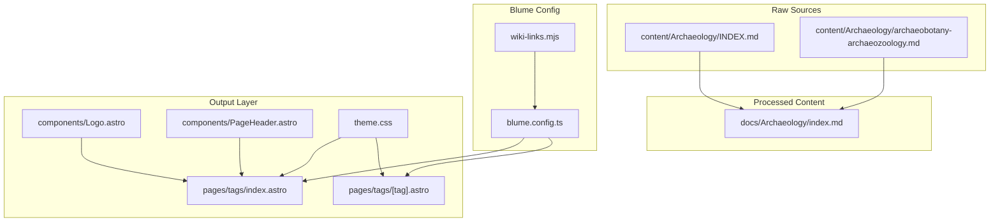
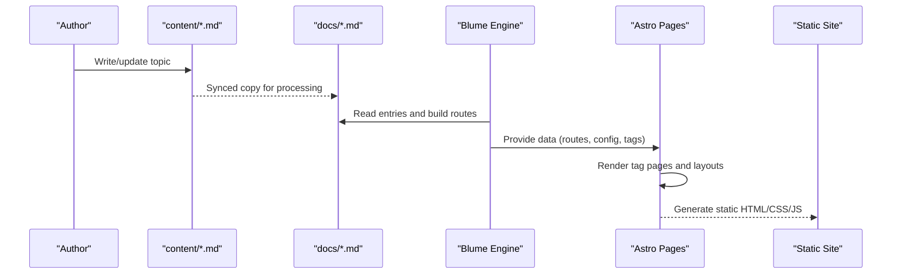
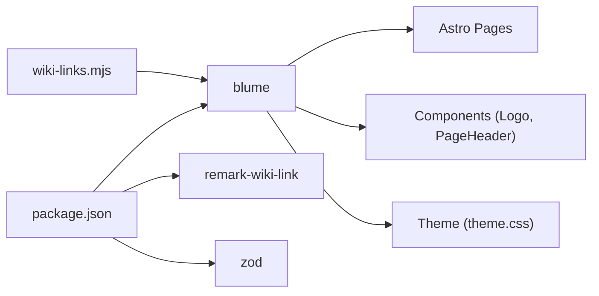

<cite>
**Referenced Files in This Document**
- [blume.config.ts](../../sites/fractalhome/blume.config.ts)
- [package.json](../../sites/fractalhome/package.json)
- [components.ts](../../sites/fractalhome/components.ts)
- [theme.css](../../sites/fractalhome/theme.css)
- [wiki-links.mjs](../../sites/fractalhome/wiki-links.mjs)
- [Logo.astro](../../sites/fractalhome/components/Logo.astro)
- [PageHeader.astro](../../sites/fractalhome/components/PageHeader.astro)
- [tags/index.astro](../../sites/fractalhome/pages/tags/index.astro)
- [tags/[tag].astro](../../../../sites/fractalhome/pages/tags/[tag].astro)
- [content/Archaeology/INDEX.md](../../sites/fractalhome/content/Archaeology/INDEX.md)
- [docs/Archaeology/index.md](../../sites/fractalhome/docs/Archaeology/index.md)
- [content/Archaeology/archaeobotany-archaeozoology.md](../../sites/fractalhome/content/Archaeology/archaeobotany-archaeozoology.md)
</cite>

## Table of Contents
1. [Introduction](#introduction)
2. [Project Structure](#project-structure)
3. [Core Components](#core-components)
4. [Architecture Overview](#architecture-overview)
5. [Detailed Component Analysis](#detailed-component-analysis)
6. [Dependency Analysis](#dependency-analysis)
7. [Performance Considerations](#performance-considerations)
8. [Troubleshooting Guide](#troubleshooting-guide)
9. [Conclusion](#conclusion)
10. [Appendices](#appendices)

## Introduction
FractalHome is a personal knowledge base and wiki built on the Blume framework. It organizes content into three layers:
- Raw/Immutable Sources: Markdown files under content/ that serve as the single source of truth for each topic.
- Wiki/Processed Content: A mirrored docs/ directory used by Blume to generate routes, navigation, and metadata.
- Output/Generated Reports: Astro pages and static assets produced at build time, including tag indexes and rendered documentation.

The system integrates a custom wiki-link processor to convert [[Wiki Links]] into standard markdown links during build, enabling cross-referencing across topics. The UI is themed via CSS tokens and customizable components, while configuration is centralized in blume.config.ts.

## Project Structure
FractalHome follows a clear separation between raw content, processed content, and generated output:
- content/: Immutable source documents organized by topic folders (e.g., Archaeology). Each folder includes an INDEX.md and individual topic files.
- docs/: Mirrored structure consumed by Blume for route generation and site navigation.
- pages/: Custom Astro pages for features like tags indexing and per-tag listings.
- components/: Reusable Astro components injected into Blume’s layout via components.ts.
- theme.css: Global design tokens and component-level styling layered over Blume’s defaults.
- blume.config.ts: Central configuration for title, description, integrations, frontmatter schema, navigation, and theme fonts.
- wiki-links.mjs: Build-time integration that transforms wiki-style links into standard markdown links.

**Diagram sources**
- [blume.config.ts:1-67](../../sites/fractalhome/blume.config.ts#L1-L67)
- [wiki-links.mjs:1-125](../../sites/fractalhome/wiki-links.mjs#L1-L125)
- [components.ts:1-12](../../sites/fractalhome/components.ts#L1-L12)
- [theme.css:1-673](../../sites/fractalhome/theme.css#L1-L673)
- [Logo.astro:1-48](../../sites/fractalhome/components/Logo.astro#L1-L48)
- [PageHeader.astro:1-31](../../sites/fractalhome/components/PageHeader.astro#L1-L31)
- [tags/index.astro:1-74](../../sites/fractalhome/pages/tags/index.astro#L1-L74)
- [tags/[tag].astro:1-61](../../../../sites/fractalhome/pages/tags/[tag].astro#L1-L61)
- [content/Archaeology/INDEX.md:1-88](../../sites/fractalhome/content/Archaeology/INDEX.md#L1-L88)
- [docs/Archaeology/index.md:1-88](../../sites/fractalhome/docs/Archaeology/index.md#L1-L88)
- [content/Archaeology/archaeobotany-archaeozoology.md:1-62](../../sites/fractalhome/content/Archaeology/archaeobotany-archaeozoology.md#L1-L62)

**Section sources**
- [blume.config.ts:1-67](../../sites/fractalhome/blume.config.ts#L1-L67)
- [package.json:1-19](../../sites/fractalhome/package.json#L1-L19)
- [components.ts:1-12](../../sites/fractalhome/components.ts#L1-L12)
- [theme.css:1-673](../../sites/fractalhome/theme.css#L1-L673)
- [wiki-links.mjs:1-125](../../sites/fractalhome/wiki-links.mjs#L1-L125)
- [content/Archaeology/INDEX.md:1-88](../../sites/fractalhome/content/Archaeology/INDEX.md#L1-L88)
- [docs/Archaeology/index.md:1-88](../../sites/fractalhome/docs/Archaeology/index.md#L1-L88)
- [content/Archaeology/archaeobotany-archaeozoology.md:1-62](../../sites/fractalhome/content/Archaeology/archaeobotany-archaeozoology.md#L1-L62)

## Core Components
- Configuration (blume.config.ts): Defines site identity, integrations (including wikiLinks), frontmatter schema extensions, navigation tabs/groups, and font themes.
- Component System (components.ts): Registers Astro components (Logo, PageHeader) into Blume’s layout namespace for reuse across pages.
- Theme (theme.css): Provides design tokens (colors, spacing, typography) and component-level styles for header, sidebar, TOC, prose, search dialog, buttons, tags, and footer.
- Wiki Integration (wiki-links.mjs): Scans docs/, builds a title-to-route map, and converts [[Wiki Links]] into standard markdown links during rendering.

Key responsibilities:
- Frontmatter validation and extension via zod schemas.
- Navigation configuration with featured items and tabbed sections.
- Theme customization through CSS variables and Tailwind utilities.
- Build-time link resolution for internal wiki references.

**Section sources**
- [blume.config.ts:1-67](../../sites/fractalhome/blume.config.ts#L1-L67)
- [components.ts:1-12](../../sites/fractalhome/components.ts#L1-L12)
- [theme.css:1-673](../../sites/fractalhome/theme.css#L1-L673)
- [wiki-links.mjs:1-125](../../sites/fractalhome/wiki-links.mjs#L1-L125)

## Architecture Overview
FractalHome implements a three-layer architecture powered by Blume and Astro:
- Raw/Immutable Sources: Markdown files under content/ define topics and metadata. These are authoritative and not modified by the build process.
- Wiki/Processed Content: docs/ mirrors content/ and is consumed by Blume to generate routes, navigation, and indexable entries.
- Output/Generated Reports: Astro pages render tag indexes and per-tag listings; Blume compiles content into static pages using configured layouts and components.

**Diagram sources**
- [blume.config.ts:1-67](../../sites/fractalhome/blume.config.ts#L1-L67)
- [wiki-links.mjs:1-125](../../sites/fractalhome/wiki-links.mjs#L1-L125)
- [tags/index.astro:1-74](../../sites/fractalhome/pages/tags/index.astro#L1-L74)
- [tags/[tag].astro:1-61](../../../../sites/fractalhome/pages/tags/[tag].astro#L1-L61)

## Detailed Component Analysis

### Blume Configuration and Frontmatter Schema
- Title and description set site identity.
- Integrations include wikiLinks() to enable wiki-style linking.
- Frontmatter extends supported fields (knowledge-bank, tags, sources, related, timestamp, created, updated, project, boss, group, supergroup, links).
- Navigation defines featured items, tabs, and sidebar display mode.
- Theme config specifies fonts and variants.

This configuration centralizes behavior and ensures consistent metadata handling across all pages.

**Section sources**
- [blume.config.ts:1-67](../../sites/fractalhome/blume.config.ts#L1-L67)

### Wiki Link Processor
- Builds a map from document titles to routes by scanning docs/.
- Converts [[Wiki Links]] into standard markdown links during rendering.
- Wraps markdown processors to intercept rendering and apply transformations.
- Falls back to a default route pattern when a page is not found.

This enables seamless cross-referencing within the wiki without manual link maintenance.

**Section sources**
- [wiki-links.mjs:1-125](../../sites/fractalhome/wiki-links.mjs#L1-L125)

### Tag Index and Per-Tag Pages
- tags/index.astro aggregates all tags from indexed entries, groups them alphabetically, and renders a scannable cloud.
- tags/[tag].astro generates static paths for each tag and lists associated entries sorted by title.

These pages provide discoverability and navigation across the knowledge base.

**Section sources**
- [tags/index.astro:1-74](../../sites/fractalhome/pages/tags/index.astro#L1-L74)
- [tags/[tag].astro:1-61](../../../../sites/fractalhome/pages/tags/[tag].astro#L1-L61)

### Layout Components
- Logo.astro renders brand lockup with light/dark wordmark variants controlled by CSS.
- PageHeader.astro displays tags for the current page by querying Blume data and Astro content collection.

These components integrate tightly with Blume’s layout system and theme tokens.

**Section sources**
- [Logo.astro:1-48](../../sites/fractalhome/components/Logo.astro#L1-L48)
- [PageHeader.astro:1-31](../../sites/fractalhome/components/PageHeader.astro#L1-L31)

### Theme Customization
- theme.css defines design tokens for surfaces, accents, code blocks, and motion preferences.
- Overrides Blume’s default styles for header, sidebar, TOC, prose, search dialog, buttons, and tags.
- Uses CSS variables to support light and dark modes consistently.

Customization is achieved by editing tokens and component selectors without modifying Blume internals.

**Section sources**
- [theme.css:1-673](../../sites/fractalhome/theme.css#L1-L673)

### Content Examples and Metadata
- content/Archaeology/INDEX.md provides a comprehensive overview and topic map for the archaeology knowledge bank.
- docs/Archaeology/index.md mirrors this content for Blume processing.
- content/Archaeology/archaeobotany-archaeozoology.md demonstrates structured topic content with rich frontmatter.

These files illustrate how raw sources are authored and mirrored for processing.

**Section sources**
- [content/Archaeology/INDEX.md:1-88](../../sites/fractalhome/content/Archaeology/INDEX.md#L1-L88)
- [docs/Archaeology/index.md:1-88](../../sites/fractalhome/docs/Archaeology/index.md#L1-L88)
- [content/Archaeology/archaeobotany-archaeozoology.md:1-62](../../sites/fractalhome/content/Archaeology/archaeobotany-archaeozoology.md#L1-L62)

## Dependency Analysis
FractalHome’s dependencies are minimal and focused:
- blume: Core framework for content processing, routing, and layout composition.
- remark-wiki-link: Optional library for wiki-style link syntax (used alongside custom processor).
- zod: Runtime validation for extended frontmatter fields.

Build scripts expose commands for development, building, previewing, checking, validating, and doctor diagnostics.

**Diagram sources**
- [package.json:1-19](../../sites/fractalhome/package.json#L1-L19)
- [blume.config.ts:1-67](../../sites/fractalhome/blume.config.ts#L1-L67)
- [wiki-links.mjs:1-125](../../sites/fractalhome/wiki-links.mjs#L1-L125)

**Section sources**
- [package.json:1-19](../../sites/fractalhome/package.json#L1-L19)

## Performance Considerations
- Static Generation: All pages are pre-rendered at build time, minimizing runtime overhead.
- Efficient Tag Indexing: Tags are computed once during build and cached in static outputs.
- Minimal Dependencies: Fewer runtime libraries reduce bundle size and improve load times.
- CSS Tokens: Using CSS variables avoids heavy JS-based theme switching logic.

Recommendations:
- Keep content files lean and avoid large inline assets.
- Use lazy loading for images where appropriate.
- Monitor build times as content grows; consider splitting large collections if needed.

[No sources needed since this section provides general guidance]

## Troubleshooting Guide
Common issues and resolutions:
- Wiki Links Not Resolving: Ensure docs/ contains mirrored content and titles match expected mappings. Check wiki-links.mjs mapping logic and fallback routes.
- Missing Tags: Verify frontmatter tags are present and trimmed; ensure entries are indexable and not hidden in sidebar.
- Theme Not Applying: Confirm theme.css is loaded last and CSS variables are correctly defined for both light and dark modes.
- Build Errors: Run blume check and blume validate to diagnose configuration and content issues.

**Section sources**
- [wiki-links.mjs:1-125](../../sites/fractalhome/wiki-links.mjs#L1-L125)
- [tags/index.astro:1-74](../../sites/fractalhome/pages/tags/index.astro#L1-L74)
- [theme.css:1-673](../../sites/fractalhome/theme.css#L1-L673)
- [package.json:1-19](../../sites/fractalhome/package.json#L1-L19)

## Conclusion
FractalHome leverages Blume to deliver a robust, extensible personal wiki with a clean three-layer architecture. By separating raw sources, processed content, and generated output, it ensures maintainability and performance. The integrated wiki-link processor, flexible frontmatter schema, and customizable theme system empower users to build a scalable knowledge base tailored to their needs.

[No sources needed since this section summarizes without analyzing specific files]

## Appendices

### Getting Started with FractalHome
- Install dependencies and run development server:
  - Use npm/yarn/pnpm to install packages defined in package.json.
  - Start dev server with blume dev.
- Add new content:
  - Create markdown files under content/<Topic>/ with frontmatter.
  - Mirror the same structure under docs/<Topic>/ for Blume processing.
- Customize navigation and theme:
  - Edit blume.config.ts for site identity, integrations, and navigation.
  - Modify theme.css to adjust colors, typography, and component styles.
- Extend components:
  - Register new Astro components in components.ts under the layout namespace.
- Build and preview:
  - Run blume build to generate static site.
  - Use blume preview to view locally.

**Section sources**
- [package.json:1-19](../../sites/fractalhome/package.json#L1-L19)
- [blume.config.ts:1-67](../../sites/fractalhome/blume.config.ts#L1-L67)
- [components.ts:1-12](../../sites/fractalhome/components.ts#L1-L12)
- [theme.css:1-673](../../sites/fractalhome/theme.css#L1-L673)
