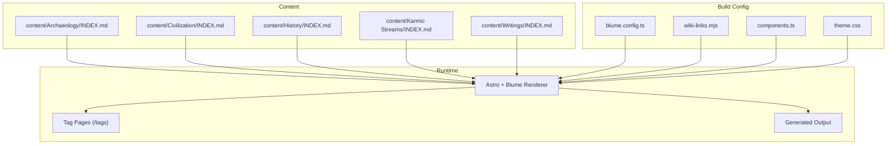
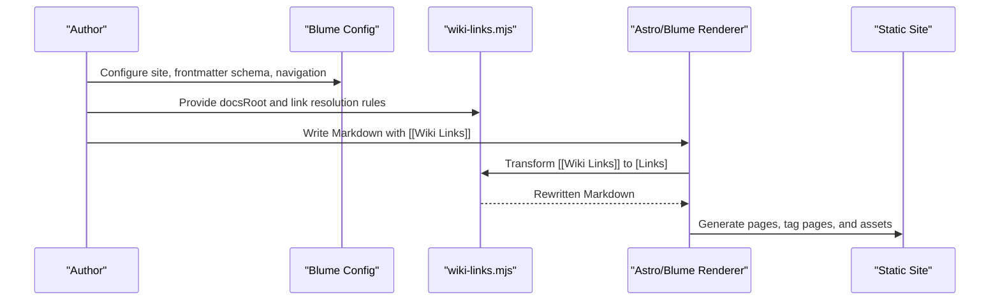
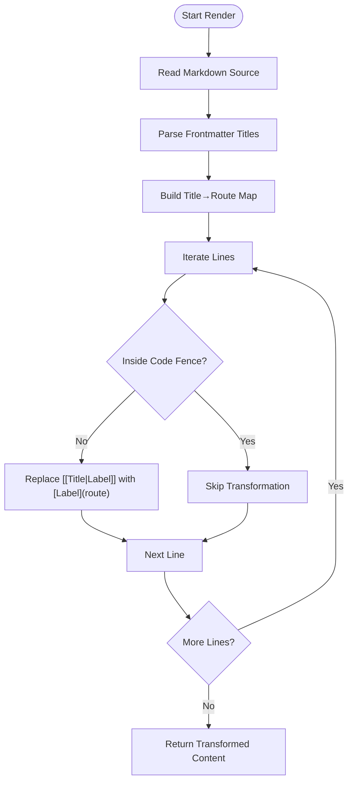
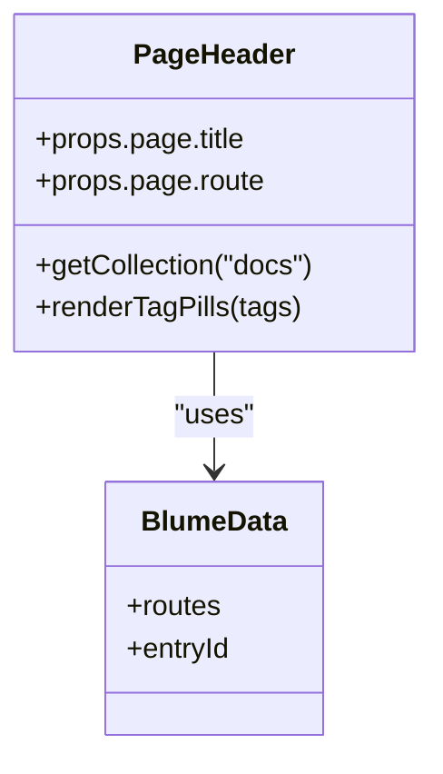
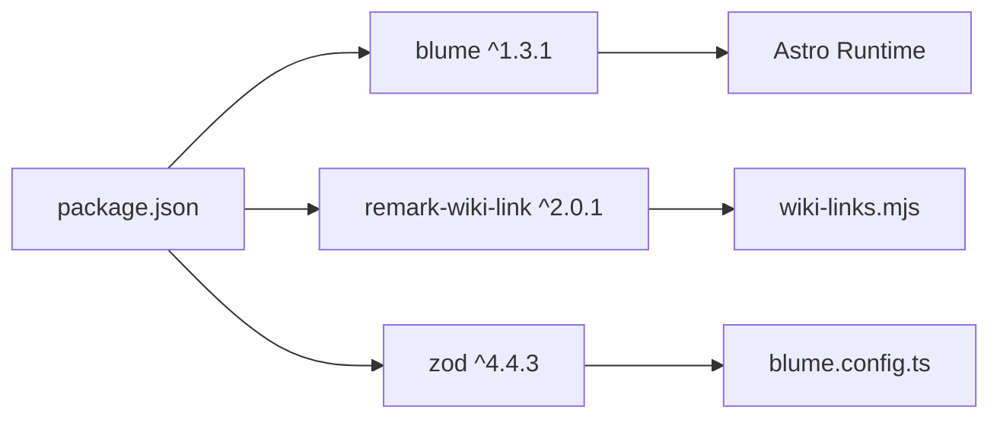

<cite>
**Referenced Files in This Document**
- [blume.config.ts](../../sites/fractalhome/blume.config.ts)
- [wiki-links.mjs](../../sites/fractalhome/wiki-links.mjs)
- [package.json](../../sites/fractalhome/package.json)
- [BLUME-CUSTOMIZATION-BACKEND.md](../../sites/fractalhome/BLUME-CUSTOMIZATION-BACKEND.md)
- [components.ts](../../sites/fractalhome/components.ts)
- [theme.css](../../sites/fractalhome/theme.css)
- [PageHeader.astro](../../sites/fractalhome/components/PageHeader.astro)
- [Archaeology INDEX.md](../../sites/fractalhome/content/Archaeology/INDEX.md)
- [Civilization INDEX.md](../../sites/fractalhome/content/Civilization/INDEX.md)
- [History INDEX.md](../../sites/fractalhome/content/History/INDEX.md)
- [Karmic Streams INDEX.md](../../sites/fractalhome/content/Karmic Streams/INDEX.md)
- [Writings INDEX.md](../../sites/fractalhome/content/Writings/INDEX.md)
- [archaeobotany-archaeozoology.md](../../sites/fractalhome/content/Archaeology/archaeobotany-archaeozoology.md)
</cite>

## Table of Contents
1. [Introduction](#introduction)
2. [Project Structure](#project-structure)
3. [Core Components](#core-components)
4. [Architecture Overview](#architecture-overview)
5. [Detailed Component Analysis](#detailed-component-analysis)
6. [Dependency Analysis](#dependency-analysis)
7. [Performance Considerations](#performance-considerations)
8. [Troubleshooting Guide](#troubleshooting-guide)
9. [Conclusion](#conclusion)
10. [Appendices](#appendices)

## Introduction
FractalHome is a personal wiki built with the Blume framework on top of Astro, designed to organize and publish a growing knowledge base across domains such as Archaeology, Civilization, History, Karmic Streams, and Writings. It follows a three-layer architecture:
- raw/: immutable sources (read-only reference material)
- wiki/: processed content (pages, entities, concepts, synthesis, indexes)
- output/: generated reports and rendered pages

This documentation explains how the wiki-link system connects cross-references, how Blume configuration shapes navigation and frontmatter, and how to manage large repositories with robust organization, migration, backup, and scaling strategies.

## Project Structure
FractalHome organizes content under sites/fractalhome/content by topic categories. Each category has an INDEX.md that acts as a hub, and individual pages provide detailed entries. The build pipeline uses Blume to render Markdown/MDX into static pages, with custom integrations for wiki-style links and tag-based navigation.

**Diagram sources**
- [blume.config.ts:1-67](../../sites/fractalhome/blume.config.ts#L1-L67)
- [wiki-links.mjs:1-125](../../sites/fractalhome/wiki-links.mjs#L1-L125)
- [components.ts:1-12](../../sites/fractalhome/components.ts#L1-L12)
- [theme.css:1-673](../../sites/fractalhome/theme.css#L1-L673)
- [Archaeology INDEX.md:1-88](../../sites/fractalhome/content/Archaeology/INDEX.md#L1-L88)
- [Civilization INDEX.md:1-19](../../sites/fractalhome/content/Civilization/INDEX.md#L1-L19)
- [History INDEX.md:1-89](../../sites/fractalhome/content/History/INDEX.md#L1-L89)
- [Karmic Streams INDEX.md:1-61](../../sites/fractalhome/content/Karmic Streams/INDEX.md#L1-L61)
- [Writings INDEX.md:1-41](../../sites/fractalhome/content/Writings/INDEX.md#L1-L41)

**Section sources**
- [blume.config.ts:1-67](../../sites/fractalhome/blume.config.ts#L1-L67)
- [wiki-links.mjs:1-125](../../sites/fractalhome/wiki-links.mjs#L1-L125)
- [components.ts:1-12](../../sites/fractalhome/components.ts#L1-L12)
- [theme.css:1-673](../../sites/fractalhome/theme.css#L1-L673)
- [Archaeology INDEX.md:1-88](../../sites/fractalhome/content/Archaeology/INDEX.md#L1-L88)
- [Civilization INDEX.md:1-19](../../sites/fractalhome/content/Civilization/INDEX.md#L1-L19)
- [History INDEX.md:1-89](../../sites/fractalhome/content/History/INDEX.md#L1-L89)
- [Karmic Streams INDEX.md:1-61](../../sites/fractalhome/content/Karmic Streams/INDEX.md#L1-L61)
- [Writings INDEX.md:1-41](../../sites/fractalhome/content/Writings/INDEX.md#L1-L41)

## Core Components
- Blume configuration: defines site metadata, frontmatter schema, navigation tabs, sidebar grouping, and theme fonts.
- Wiki-link integration: scans docs to build a title-to-route map and rewrites [[Wiki Links]] into standard Markdown links during rendering.
- Tag system: renders tag pills via PageHeader and supports /tags index pages.
- Theme and components: global tokens and component overrides for Header, Logo, and PageHeader.

Key responsibilities:
- blume.config.ts: central configuration for titles, integrations, frontmatter fields, navigation, and fonts.
- wiki-links.mjs: builds a map from document titles to routes and transforms wiki links at render time.
- components.ts: registers custom Astro components to override Blume layout pieces.
- theme.css: defines design tokens and UI styling for light/dark modes.
- PageHeader.astro: displays tags per page and links to tag detail pages.

**Section sources**
- [blume.config.ts:1-67](../../sites/fractalhome/blume.config.ts#L1-L67)
- [wiki-links.mjs:1-125](../../sites/fractalhome/wiki-links.mjs#L1-L125)
- [components.ts:1-12](../../sites/fractalhome/components.ts#L1-L12)
- [theme.css:1-673](../../sites/fractalhome/theme.css#L1-L673)
- [PageHeader.astro:1-31](../../sites/fractalhome/components/PageHeader.astro#L1-L31)

## Architecture Overview
The wiki uses a clear separation between content, configuration, and runtime rendering:
- Content layer: Markdown files under content/<Category>/ with frontmatter describing tags, sources, related pages, and timestamps.
- Configuration layer: Blume config and custom integration for wiki links; component overrides and theme tokens.
- Rendering layer: Astro + Blume processes content, applies transformations (wiki links), and generates static pages and tag indices.

**Diagram sources**
- [blume.config.ts:1-67](../../sites/fractalhome/blume.config.ts#L1-L67)
- [wiki-links.mjs:1-125](../../sites/fractalhome/wiki-links.mjs#L1-L125)
- [PageHeader.astro:1-31](../../sites/fractalhome/components/PageHeader.astro#L1-L31)

## Detailed Component Analysis

### Wiki-Link System
The wiki-link system enables intuitive cross-referencing using [[Title]] syntax. It scans all Markdown/MDX files to build a map from titles to routes, then rewrites wiki links into standard Markdown links during rendering. If no exact match is found, it falls back to a slugified path under a default namespace.

**Diagram sources**
- [wiki-links.mjs:1-125](../../sites/fractalhome/wiki-links.mjs#L1-L125)

**Section sources**
- [wiki-links.mjs:1-125](../../sites/fractalhome/wiki-links.mjs#L1-L125)

### Blume Configuration and Frontmatter Schema
Blume’s configuration defines:
- Site title and description
- Integrations (including wiki-links)
- Extended frontmatter fields: knowledge-bank, tags, sources, related, timestamp, source, created, updated, project, boss, group, supergroup, links
- Navigation structure: featured items, tabs, and sidebar display mode
- Theme fonts and variants

This schema ensures consistent metadata across pages, enabling powerful filtering, indexing, and cross-linking.

**Section sources**
- [blume.config.ts:1-67](../../sites/fractalhome/blume.config.ts#L1-L67)

### Tag System and PageHeader
Tags are declared in frontmatter and rendered as pills above each article. Clicking a tag navigates to a dedicated tag page listing all entries with that tag. PageHeader reads the current entry’s tags and constructs links to /tags/[tag].

**Diagram sources**
- [PageHeader.astro:1-31](../../sites/fractalhome/components/PageHeader.astro#L1-L31)

**Section sources**
- [PageHeader.astro:1-31](../../sites/fractalhome/components/PageHeader.astro#L1-L31)

### Theme and Customization
Theme tokens define colors, spacing, typography, and component styles for both light and dark modes. Global changes should use CSS variables; component-level markup changes require Astro overrides registered via components.ts.

Key customization points:
- theme.css: global tokens and component selectors
- components.ts: register Astro overrides for Header, Logo, PageHeader
- BLUME-CUSTOMIZATION-BACKEND.md: guidance on when to use CSS vs component overrides

**Section sources**
- [theme.css:1-673](../../sites/fractalhome/theme.css#L1-L673)
- [components.ts:1-12](../../sites/fractalhome/components.ts#L1-L12)
- [BLUME-CUSTOMIZATION-BACKEND.md:1-524](../../sites/fractalhome/BLUME-CUSTOMIZATION-BACKEND.md#L1-L524)

### Content Organization Strategies
Each category includes an INDEX.md that serves as a hub, linking to subtopics and providing context. Examples:
- Archaeology: comprehensive coverage of Indian archaeology topics, with extensive sources and related pages
- Civilization: foundational essays on religion, philosophy, and culture
- History: debates, archaeology, genetics, linguistics, Vedic studies, epics, chronology
- Karmic Streams: reincarnation and karma across cultures, religions, science, and philosophy
- Writings: personal essays spanning dharma, history, philosophy, web development, psychedelics, fiction, whiskey reviews, AI, design, and social commentary

Use frontmatter fields like knowledge-bank, tags, sources, and related to maintain consistency and enable cross-linking.

**Section sources**
- [Archaeology INDEX.md:1-88](../../sites/fractalhome/content/Archaeology/INDEX.md#L1-L88)
- [Civilization INDEX.md:1-19](../../sites/fractalhome/content/Civilization/INDEX.md#L1-L19)
- [History INDEX.md:1-89](../../sites/fractalhome/content/History/INDEX.md#L1-L89)
- [Karmic Streams INDEX.md:1-61](../../sites/fractalhome/content/Karmic Streams/INDEX.md#L1-L61)
- [Writings INDEX.md:1-41](../../sites/fractalhome/content/Writings/INDEX.md#L1-L41)

### Sample Content Entry
A typical content file includes frontmatter with title, description, knowledge-bank, tags, sources, related, timestamp, and source. The body contains structured sections and references to specific volumes or studies.

Example:
- archaeobotany-archaeozoology.md: covers plant and animal remains, subsistence strategies, and specific studies with volume references.

**Section sources**
- [archaeobotany-archaeozoology.md:1-62](../../sites/fractalhome/content/Archaeology/archaeobotany-archaeozoology.md#L1-L62)

## Dependency Analysis
FractalHome’s dependencies include Blume, remark-wiki-link, and Zod for validation. The package scripts expose commands for development, building, previewing, checking, validating, and doctoring the site.

**Diagram sources**
- [package.json:1-19](../../sites/fractalhome/package.json#L1-L19)
- [blume.config.ts:1-67](../../sites/fractalhome/blume.config.ts#L1-L67)
- [wiki-links.mjs:1-125](../../sites/fractalhome/wiki-links.mjs#L1-L125)

**Section sources**
- [package.json:1-19](../../sites/fractalhome/package.json#L1-L19)

## Performance Considerations
- Keep content modular: split large documents into focused pages linked via wiki links to reduce render overhead.
- Use frontmatter efficiently: avoid excessively long arrays in tags/sources; prefer related fields for cross-references.
- Optimize images and assets: store media under static directories and reference them appropriately.
- Leverage Blume’s build optimizations: run checks and validations before publishing to catch issues early.

[No sources needed since this section provides general guidance]

## Troubleshooting Guide
Common issues and resolutions:
- Wiki links not resolving: ensure titles in frontmatter match exactly; check case sensitivity and fallback behavior.
- Tags not appearing: verify frontmatter tags array and that PageHeader is correctly reading data.
- Theme inconsistencies: test both light and dark modes; confirm CSS variables are applied globally.
- Build errors: run blume check and blume validate to identify configuration or content problems.

Best practices:
- Never edit generated files under .blume/, .blume-verify/, or dist/.
- Use components.ts to register overrides rather than editing node_modules.
- Follow the verification checklist in BLUME-CUSTOMIZATION-BACKEND.md after visual changes.

**Section sources**
- [BLUME-CUSTOMIZATION-BACKEND.md:1-524](../../sites/fractalhome/BLUME-CUSTOMIZATION-BACKEND.md#L1-L524)

## Conclusion
FractalHome provides a robust, scalable foundation for managing a personal knowledge base. With Blume’s flexible configuration, a powerful wiki-link system, and a well-structured content organization strategy, it supports growth across diverse domains. By adhering to best practices for migration, backup, and scaling, you can maintain a coherent and accessible repository over time.

[No sources needed since this section summarizes without analyzing specific files]

## Appendices

### Migration from External Sources
- Import external Markdown into content/<Category>/ with consistent frontmatter.
- Normalize titles and paths to align with wiki-link resolution.
- Validate frontmatter using Zod schema defined in blume.config.ts.
- Run blume validate and blume check to ensure integrity.

### Backup Strategies
- Version control content with Git; commit regularly.
- Back up static assets and generated output separately if needed.
- Maintain a snapshot of frontmatter and indexes for quick recovery.

### Scaling Considerations
- Split large categories into subfolders with dedicated INDEX.md hubs.
- Use related fields to create cross-category connections without duplicating content.
- Monitor build times and optimize content structure as the repository grows.

[No sources needed since this section provides general guidance]
