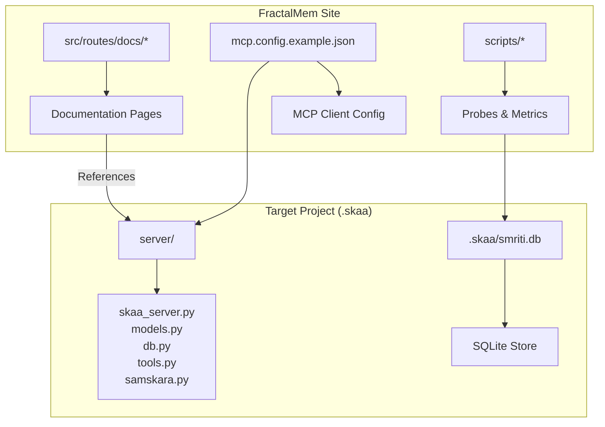
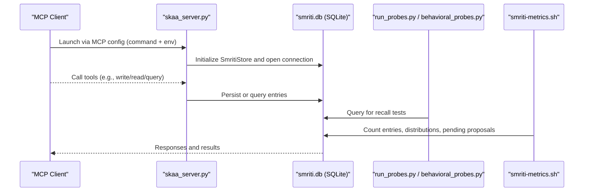
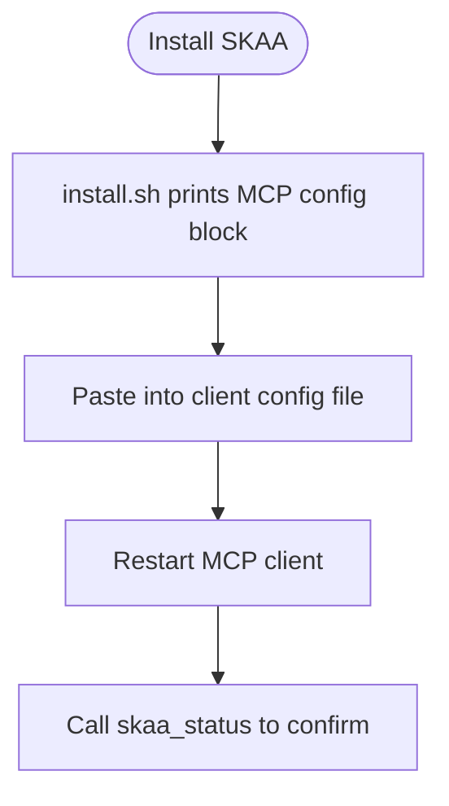
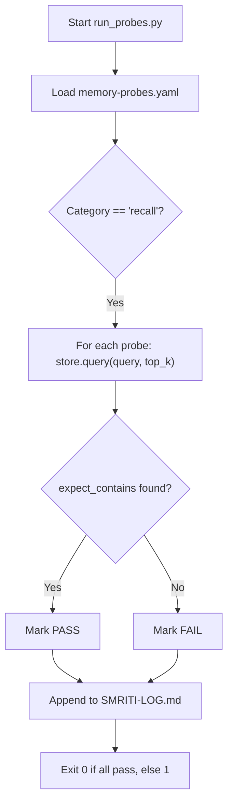
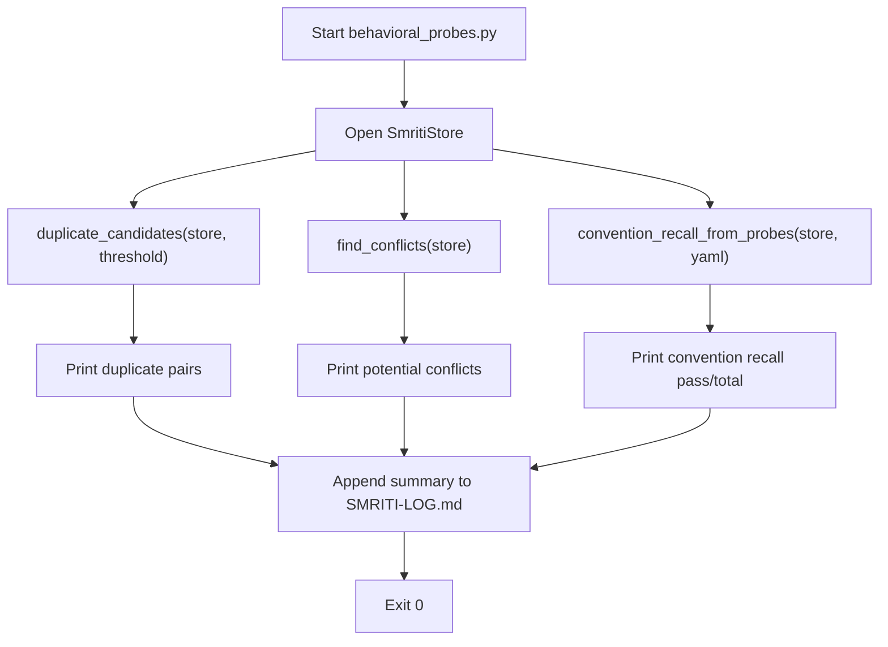
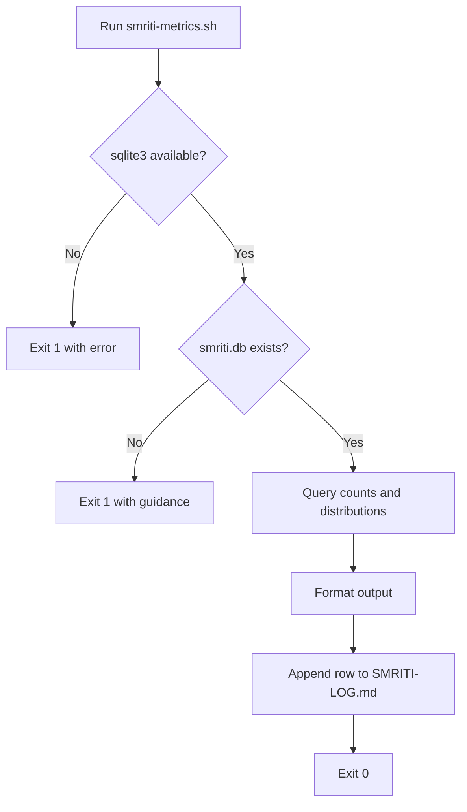
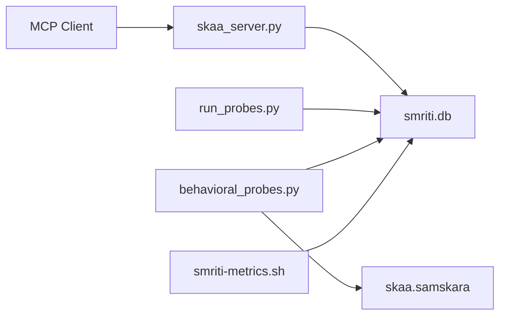

<cite>
**Referenced Files in This Document**
- [README.md](../../sites/fractalmem/README.md)
- [mcp.config.example.json](../../sites/fractalmem/mcp.config.example.json)
- [behavioral_probes.py](../../sites/fractalmem/scripts/behavioral_probes.py)
- [run_probes.py](../../sites/fractalmem/scripts/run_probes.py)
- [memory-probes.yaml](../../sites/fractalmem/scripts/memory-probes.yaml)
- [smriti-metrics.sh](../../sites/fractalmem/scripts/smriti-metrics.sh)
</cite>

## Table of Contents
1. [Introduction](#introduction)
2. [Project Structure](#project-structure)
3. [Core Components](#core-components)
4. [Architecture Overview](#architecture-overview)
5. [Detailed Component Analysis](#detailed-component-analysis)
6. [Dependency Analysis](#dependency-analysis)
7. [Performance Considerations](#performance-considerations)
8. [Troubleshooting Guide](#troubleshooting-guide)
9. [Conclusion](#conclusion)
10. [Appendices](#appendices)

## Introduction
FractalMem (SKAA) is a portable, installable memory harness that provides an AI agent with persistent, structured episodic memory exposed via the Model Context Protocol (MCP). It is backed by a per-project SQLite database and organized around a Sanskrit grammatical ontology: pramana (how the agent knows something), karaka roles (who-did-what-to-whom), and dhatu clusters (action roots). The package includes behavioral probes for testing recall quality, a metrics script for health checks, and a daily log to track trends over time.

Key goals:
- Provide MCP-based access to memory operations for any client.
- Enforce structured memory entries with semantic tags for better retrieval.
- Offer measurement tools to validate recall behavior and detect duplicates or conflicts.
- Persist data in a simple, per-project SQLite file for portability.

**Section sources**
- [README.md](../../sites/fractalmem/README.md)

## Project Structure
The FractalMem site exposes documentation routes and ships scripts for installation, probing, and metrics collection. The server implementation referenced by the README is packaged under a separate directory tree not present in this snapshot; however, the configuration and scripts define how the system is installed, configured, and measured.

[No sources needed since this diagram shows conceptual structure]

## Core Components
- MCP Configuration: Defines how clients launch and connect to the SKAA server process and pass environment variables for database path and session identity.
- Behavioral Probes: Python scripts that exercise the store to check for duplicate work, convention recall, and conflicts.
- Recall Probes Runner: Executes YAML-defined queries against the store and records pass/fail results.
- Metrics Script: A lightweight shell utility to collect basic health stats from SQLite without Python dependencies.

These components together provide a complete loop: configure MCP, persist memories, measure recall quality, and monitor health.

**Section sources**
- [mcp.config.example.json](../../sites/fractalmem/mcp.config.example.json)
- [behavioral_probes.py](../../sites/fractalmem/scripts/behavioral_probes.py)
- [run_probes.py](../../sites/fractalmem/scripts/run_probes.py)
- [smriti-metrics.sh](../../sites/fractalmem/scripts/smriti-metrics.sh)

## Architecture Overview
At runtime, an MCP client launches the SKAA server using the configured command and environment. The server reads/writes to a per-project SQLite file. Measurement scripts interact directly with the same SQLite store to evaluate recall and health.

**Diagram sources**
- [mcp.config.example.json](../../sites/fractalmem/mcp.config.example.json)
- [run_probes.py](../../sites/fractalmem/scripts/run_probes.py)
- [behavioral_probes.py](../../sites/fractalmem/scripts/behavioral_probes.py)
- [smriti-metrics.sh](../../sites/fractalmem/scripts/smriti-metrics.sh)

## Detailed Component Analysis

### MCP Configuration
- Purpose: Tell the MCP client how to start the SKAA server and which environment variables to set.
- Key fields:
  - mcpServers.skaa.command: launcher (uv or python venv)
  - mcpServers.skaa.args: arguments pointing to server entrypoint
  - mcpServers.skaa.env: SKAA_DB_PATH and optional SKAA_SESSION_ID
- Installation flow: install.sh prints a ready-to-paste block into your client’s config file.

**Diagram sources**
- [mcp.config.example.json](../../sites/fractalmem/mcp.config.example.json)
- [README.md](../../sites/fractalmem/README.md)

**Section sources**
- [mcp.config.example.json](../../sites/fractalmem/mcp.config.example.json)
- [README.md](../../sites/fractalmem/README.md)

### Behavioral Probe System
Two complementary scripts test different aspects of memory behavior:

- run_probes.py
  - Loads YAML probe definitions (category=recall).
  - Executes each query against the store and checks if expected content appears in top hits.
  - Prints results and appends a row to the daily SMRITI-LOG.md.
  - Exit code indicates overall pass/fail for CI integration.

- behavioral_probes.py
  - Runs higher-level checks: duplicate candidates, convention recall, conflict detection.
  - Uses shared modules from the server package (SmritiStore, samskara heuristics).
  - Appends a summary row to the daily log.

**Diagram sources**
- [run_probes.py](../../sites/fractalmem/scripts/run_probes.py)
- [memory-probes.yaml](../../sites/fractalmem/scripts/memory-probes.yaml)

**Diagram sources**
- [behavioral_probes.py](../../sites/fractalmem/scripts/behavioral_probes.py)

**Section sources**
- [run_probes.py](../../sites/fractalmem/scripts/run_probes.py)
- [behavioral_probes.py](../../sites/fractalmem/scripts/behavioral_probes.py)
- [memory-probes.yaml](../../sites/fractalmem/scripts/memory-probes.yaml)

### Metrics Collection Infrastructure
- smriti-metrics.sh
  - Dependency-light health check using sqlite3 only.
  - Collects total entries, recent activity (24h/7d), pending proposals, applied rules, pramana distribution, top dhatu_cluster tags, and karma prefixes.
  - Appends a row to the daily SMRITI-LOG.md.

**Diagram sources**
- [smriti-metrics.sh](../../sites/fractalmem/scripts/smriti-metrics.sh)

**Section sources**
- [smriti-metrics.sh](../../sites/fractalmem/scripts/smriti-metrics.sh)

### Memory Persistence and Retrieval Patterns
- Persistence: Per-project SQLite file (smriti.db) stores entries with fields including pramana, karma (karaka roles), dhatu_cluster, and timestamps.
- Retrieval: Token-overlap search implemented in the store’s query method; semantic/embedding search is explicitly noted as future work.
- Samskara layer: Proposal mining and conflict/duplicate heuristics operate on the stored data to support quality control.

Note: The exact schema and methods are defined in the server package referenced by the scripts and README.

**Section sources**
- [README.md](../../sites/fractalmem/README.md)
- [smriti-metrics.sh](../../sites/fractalmem/scripts/smriti-metrics.sh)

## Dependency Analysis
- Scripts depend on:
  - PyYAML for YAML parsing (run_probes.py, behavioral_probes.py).
  - sqlite3 CLI for smriti-metrics.sh.
  - The server package (skaa.db, samskara) imported at runtime by behavioral_probes.py.
- MCP client depends on:
  - The configured launcher (uv or venv python) and absolute paths printed by install.sh.

**Diagram sources**
- [mcp.config.example.json](../../sites/fractalmem/mcp.config.example.json)
- [run_probes.py](../../sites/fractalmem/scripts/run_probes.py)
- [behavioral_probes.py](../../sites/fractalmem/scripts/behavioral_probes.py)
- [smriti-metrics.sh](../../sites/fractalmem/scripts/smriti-metrics.sh)

**Section sources**
- [mcp.config.example.json](../../sites/fractalmem/mcp.config.example.json)
- [run_probes.py](../../sites/fractalmem/scripts/run_probes.py)
- [behavioral_probes.py](../../sites/fractalmem/scripts/behavioral_probes.py)
- [smriti-metrics.sh](../../sites/fractalmem/scripts/smriti-metrics.sh)

## Performance Considerations
- Use token-overlap search today; consider adding embedding-based retrieval later for better recall accuracy.
- Keep smriti.db small and well-tagged (pramana, karma, dhatu_cluster) to improve query effectiveness.
- Schedule metrics and probes regularly (daily/weekly) to catch regressions early.
- Avoid excessive top_k values in probes to reduce IO overhead.

[No sources needed since this section provides general guidance]

## Troubleshooting Guide
Common issues and resolutions:
- No smriti.db found
  - Ensure install.sh was run and the server started at least once to create the database.
- sqlite3 CLI not found
  - Install sqlite3 using your OS package manager before running smriti-metrics.sh.
- PyYAML missing
  - Install pyyaml when running run_probes.py or behavioral_probes.py.
- MCP client cannot connect
  - Confirm the command and args match what install.sh printed; verify SKAA_DB_PATH points to the correct file.
- Probes failing
  - Review memory-probes.yaml expectations; ensure relevant entries exist in smriti.db.

**Section sources**
- [smriti-metrics.sh](../../sites/fractalmem/scripts/smriti-metrics.sh)
- [run_probes.py](../../sites/fractalmem/scripts/run_probes.py)
- [behavioral_probes.py](../../sites/fractalmem/scripts/behavioral_probes.py)
- [mcp.config.example.json](../../sites/fractalmem/mcp.config.example.json)

## Conclusion
FractalMem provides a practical, portable memory system for AI agents with clear MCP integration, structured persistence, and robust measurement tools. By combining YAML-driven recall probes, behavioral checks, and lightweight metrics, teams can maintain high-quality memory retrieval and quickly diagnose issues as the knowledge base grows.

[No sources needed since this section summarizes without analyzing specific files]

## Appendices

### Setup Instructions for Behavioral Probes
- Install SKAA into your project using install.sh and paste the printed MCP config into your client.
- Run weekly behavioral probes:
  - python scripts/behavioral_probes.py --db .skaa/smriti.db --log docs/metrics/SMRITI-LOG.md
- Run recall probes:
  - python scripts/run_probes.py --db .skaa/smriti.db --probes scripts/memory-probes.yaml --log docs/metrics/SMRITI-LOG.md
- Quick health check:
  - ./scripts/smriti-metrics.sh .skaa/smriti.db

**Section sources**
- [README.md](../../sites/fractalmem/README.md)
- [behavioral_probes.py](../../sites/fractalmem/scripts/behavioral_probes.py)
- [run_probes.py](../../sites/fractalmem/scripts/run_probes.py)
- [smriti-metrics.sh](../../sites/fractalmem/scripts/smriti-metrics.sh)

### Interpreting Metrics Data
- Total entries: Overall size of smriti.
- New in last 24h/7 days: Activity velocity.
- Pending proposals: Work items awaiting review/approval.
- Applied rules: Active samskara rules count.
- Pramana distribution: How knowledge is sourced (e.g., direct observation vs inference).
- Top dhatu_cluster tags: Common action themes.
- Karma prefixes: Dominant role patterns.

**Section sources**
- [smriti-metrics.sh](../../sites/fractalmem/scripts/smriti-metrics.sh)

### Extending the Probe System
- Add new recall probes in memory-probes.yaml with id, category=recall, description, query, expect_contains, and top_k.
- For behavioral checks, add categories like duplicate-work, convention-recall, or conflict in memory-probes.yaml and handle them in behavioral_probes.py.
- Integrate with external monitoring:
  - Export SMRITI-LOG.md rows to a dashboard or SIEM.
  - Wrap run_probes.py exit codes in CI pipelines to fail builds on regression.

**Section sources**
- [memory-probes.yaml](../../sites/fractalmem/scripts/memory-probes.yaml)
- [behavioral_probes.py](../../sites/fractalmem/scripts/behavioral_probes.py)
- [run_probes.py](../../sites/fractalmem/scripts/run_probes.py)
