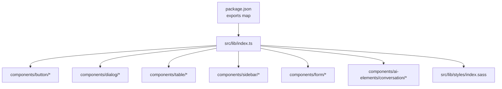
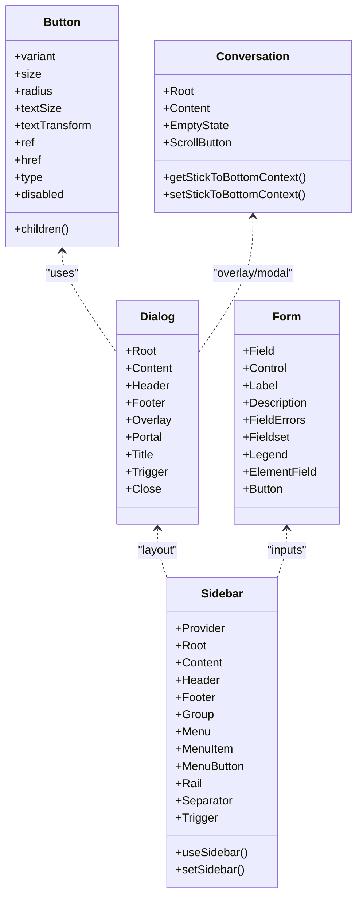
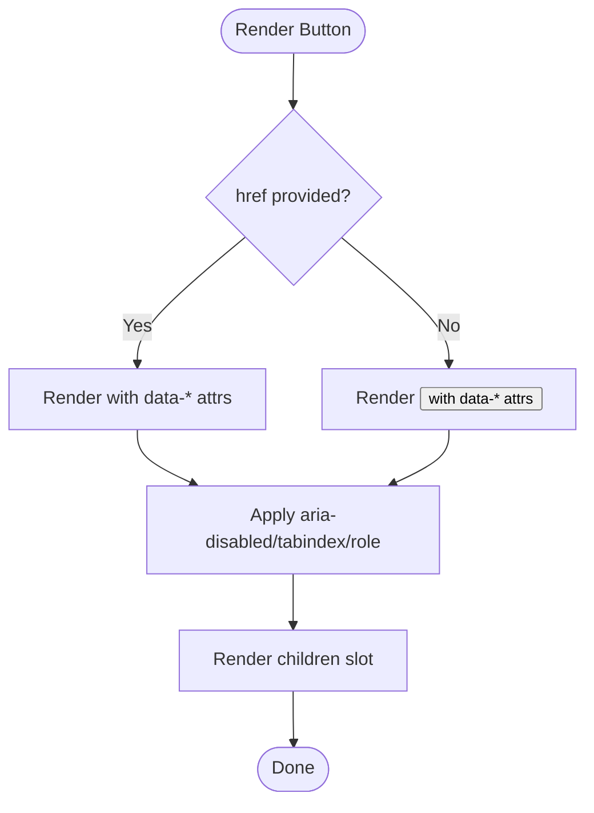
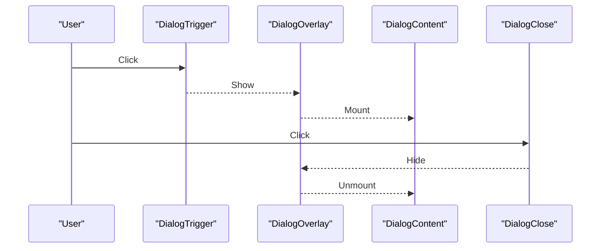
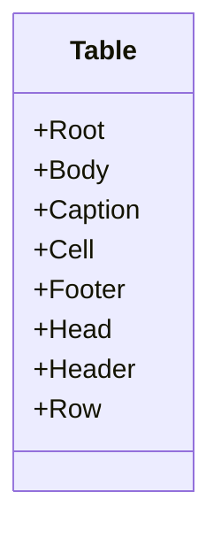
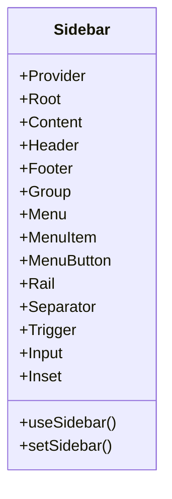
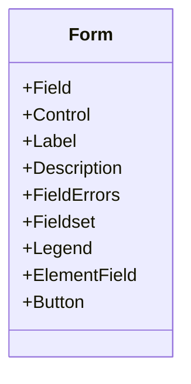
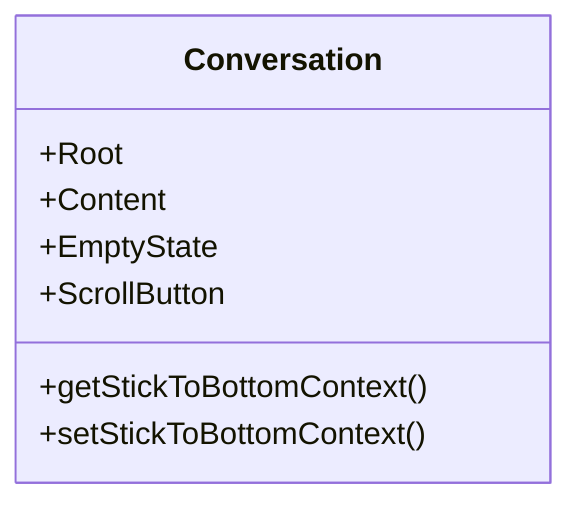

<cite>
**Referenced Files in This Document**
- [package.json](../../packages/fractalsvelte/package.json)
- [index.ts](../../packages/fractalsvelte/src/lib/index.ts)
- [button.svelte](../../packages/fractalsvelte/src/lib/components/button/button.svelte)
- [button index.ts](../../packages/fractalsvelte/src/lib/components/button/index.ts)
- [dialog index.ts](../../packages/fractalsvelte/src/lib/components/dialog/index.ts)
- [table index.ts](../../packages/fractalsvelte/src/lib/components/table/index.ts)
- [sidebar index.ts](../../packages/fractalsvelte/src/lib/components/sidebar/index.ts)
- [form index.ts](../../packages/fractalsvelte/src/lib/components/form/index.ts)
- [conversation index.ts](../../packages/fractalsvelte/src/lib/components/ai-elements/conversation/index.ts)
- [styles index.sass](../../packages/fractalsvelte/src/lib/styles/index.sass)
</cite>

## Table of Contents
1. [Introduction](#introduction)
2. [Project Structure](#project-structure)
3. [Core Components](#core-components)
4. [Architecture Overview](#architecture-overview)
5. [Detailed Component Analysis](#detailed-component-analysis)
6. [Dependency Analysis](#dependency-analysis)
7. [Performance Considerations](#performance-considerations)
8. [Troubleshooting Guide](#troubleshooting-guide)
9. [Conclusion](#conclusion)
10. [Appendices](#appendices)

## Introduction
Fractalsvelte is a comprehensive Svelte 5 component library providing a rich set of UI primitives, form components, layout systems, and AI-specific building blocks. It leverages Svelte 5 runes for reactivity, TypeScript for strong typing, and a single-tab indented SASS styling system. The library ships with a Vite-based build pipeline, modular exports per component, and peer dependency management to keep your app lightweight while ensuring compatibility with core runtime libraries like bits-ui, formsnap, and shiki.

This document explains the complete component catalog, architecture, usage patterns, props APIs, event handling, customization options, and the build and distribution model.

## Project Structure
The Fractalsvelte package organizes components under src/lib/components, each component folder containing its Svelte files, styles, and an index.ts that re-exports typed members. A central styles entry point aggregates design tokens, resets, mixins, and global rules. The package.json defines module exports for every component, enabling tree-shaking and precise imports.

**Diagram sources**
- [package.json:29-429](../../packages/fractalsvelte/package.json#L29-L429)
- [index.ts:1-2](../../packages/fractalsvelte/src/lib/index.ts#L1-L2)
- [button index.ts:1-12](../../packages/fractalsvelte/src/lib/components/button/index.ts#L1-L12)
- [dialog index.ts:1-60](../../packages/fractalsvelte/src/lib/components/dialog/index.ts#L1-L60)
- [table index.ts:1-29](../../packages/fractalsvelte/src/lib/components/table/index.ts#L1-L29)
- [sidebar index.ts:1-121](../../packages/fractalsvelte/src/lib/components/sidebar/index.ts#L1-L121)
- [form index.ts:1-41](../../packages/fractalsvelte/src/lib/components/form/index.ts#L1-L41)
- [conversation index.ts:1-32](../../packages/fractalsvelte/src/lib/components/ai-elements/conversation/index.ts#L1-L32)
- [styles index.sass](../../packages/fractalsvelte/src/lib/styles/index.sass)

**Section sources**
- [package.json:1-486](../../packages/fractalsvelte/package.json#L1-L486)
- [index.ts:1-2](../../packages/fractalsvelte/src/lib/index.ts#L1-L2)

## Core Components
Fractalsvelte provides a broad catalog of components grouped into categories:

- Basic UI elements: button, input, checkbox, switch, badge, kbd, spinner, progress, separator, tooltip, popover, hover-card, menubar, navigation-menu, pagination, resizable, scroll-area, skeleton, slider, toggle, toggle-group
- Complex components: dialog, alert-dialog, dropdown-menu, tabs, table, command, context-menu, sheet, drawer, sidebar
- Form components: form, field, label, textarea, select, native-select, radio-group, input-group, input-otp
- Layout components: card, carousel, aspect-ratio, empty
- AI-specific components: conversation, message, code, artifact, chain-of-thought, checkpoint, confirmation, context, copy-button, image, inline-citation, loader, model-selector, open-in-chat, plan, prompt-input, queue, reasoning, response, shimmer, sources, suggestion, task, tool, web-preview

Each component exposes a consistent API surface via index.ts re-exports, including both default names (e.g., Button) and PascalCase aliases (e.g., Button as Button). Props are strongly typed using TypeScript types exported alongside components.

**Section sources**
- [package.json:29-429](../../packages/fractalsvelte/package.json#L29-L429)
- [button index.ts:1-12](../../packages/fractalsvelte/src/lib/components/button/index.ts#L1-L12)
- [dialog index.ts:1-60](../../packages/fractalsvelte/src/lib/components/dialog/index.ts#L1-L60)
- [table index.ts:1-29](../../packages/fractalsvelte/src/lib/components/table/index.ts#L1-L29)
- [sidebar index.ts:1-121](../../packages/fractalsvelte/src/lib/components/sidebar/index.ts#L1-L121)
- [form index.ts:1-41](../../packages/fractalsvelte/src/lib/components/form/index.ts#L1-L41)
- [conversation index.ts:1-32](../../packages/fractalsvelte/src/lib/components/ai-elements/conversation/index.ts#L1-L32)

## Architecture Overview
Fractalsvelte follows a modular, composable architecture:

- Svelte 5 runes: Components use $props, $state, $derived, $effect, and $bindable for reactive state and prop binding.
- TypeScript integration: Each component declares explicit prop types and re-exports them for consumers.
- Styling system: Single-tab indented SASS with tokens, mixins, and data attributes drive variants and sizes.
- Composition pattern: Complex components are split into sub-components (e.g., Dialog has Root, Content, Header, Footer, Overlay, Portal, Title, Trigger, Close).
- Context sharing: Some components expose context hooks or setters (e.g., Sidebar uses useSidebar/setSidebar; Conversation exposes stick-to-bottom context).

**Diagram sources**
- [button.svelte:1-88](../../packages/fractalsvelte/src/lib/components/button/button.svelte#L1-L88)
- [dialog index.ts:1-60](../../packages/fractalsvelte/src/lib/components/dialog/index.ts#L1-L60)
- [sidebar index.ts:1-121](../../packages/fractalsvelte/src/lib/components/sidebar/index.ts#L1-L121)
- [form index.ts:1-41](../../packages/fractalsvelte/src/lib/components/form/index.ts#L1-L41)
- [conversation index.ts:1-32](../../packages/fractalsvelte/src/lib/components/ai-elements/conversation/index.ts#L1-L32)

## Detailed Component Analysis

### Button
- Purpose: Primary action trigger supporting both button and anchor modes.
- Props API: variant, size, radius, textSize, textTransform, ref, href, type, disabled, children.
- Reactivity: Uses $props and $bindable(ref) for element reference binding.
- Styling: Data attributes (data-variant, data-size, data-radius, data-text-size, data-transform) mapped by nested SASS selectors.
- Events: Pass-through restProps allow standard DOM events (onclick, onkeydown, etc.).

**Diagram sources**
- [button.svelte:1-88](../../packages/fractalsvelte/src/lib/components/button/button.svelte#L1-L88)

**Section sources**
- [button.svelte:1-88](../../packages/fractalsvelte/src/lib/components/button/button.svelte#L1-L88)
- [button index.ts:1-12](../../packages/fractalsvelte/src/lib/components/button/index.ts#L1-L12)

### Dialog
- Purpose: Accessible modal overlay with structured parts.
- Parts: Root, Content, Header, Footer, Overlay, Portal, Title, Trigger, Close.
- Composition: Use Trigger to open, Overlay/Portal for positioning, Content for structure, Close to dismiss.
- Types: Each part exports specific props (e.g., DialogContentProps, DialogTriggerVariant).

**Diagram sources**
- [dialog index.ts:1-60](../../packages/fractalsvelte/src/lib/components/dialog/index.ts#L1-L60)

**Section sources**
- [dialog index.ts:1-60](../../packages/fractalsvelte/src/lib/components/dialog/index.ts#L1-L60)

### Table
- Purpose: Semantic HTML table with composable parts.
- Parts: Root, Body, Caption, Cell, Footer, Head, Header, Row.
- Usage: Compose rows and cells to render tabular data with accessible semantics.

**Diagram sources**
- [table index.ts:1-29](../../packages/fractalsvelte/src/lib/components/table/index.ts#L1-L29)

**Section sources**
- [table index.ts:1-29](../../packages/fractalsvelte/src/lib/components/table/index.ts#L1-L29)

### Sidebar
- Purpose: Full-featured sidebar layout system with groups, menus, and responsive behavior.
- Parts: Provider, Root, Content, Header, Footer, Group, Menu, MenuItem, MenuButton, Rail, Separator, Trigger, Input, Inset, and more.
- State: Exposes useSidebar and setSidebar for programmatic control.

**Diagram sources**
- [sidebar index.ts:1-121](../../packages/fractalsvelte/src/lib/components/sidebar/index.ts#L1-L121)

**Section sources**
- [sidebar index.ts:1-121](../../packages/fractalsvelte/src/lib/components/sidebar/index.ts#L1-L121)

### Form
- Purpose: Accessible form system built on formsnap primitives.
- Parts: Field, Control, Label, Description, FieldErrors, Fieldset, Legend, ElementField, Button.
- Integration: Wraps formsnap.Control and exposes typed props for validation and error display.

**Diagram sources**
- [form index.ts:1-41](../../packages/fractalsvelte/src/lib/components/form/index.ts#L1-L41)

**Section sources**
- [form index.ts:1-41](../../packages/fractalsvelte/src/lib/components/form/index.ts#L1-L41)

### Conversation (AI Elements)
- Purpose: AI chat interface container with content area, empty state, and scroll controls.
- Parts: Root, Content, EmptyState, ScrollButton.
- Context: Provides stick-to-bottom context for auto-scrolling behavior.

**Diagram sources**
- [conversation index.ts:1-32](../../packages/fractalsvelte/src/lib/components/ai-elements/conversation/index.ts#L1-L32)

**Section sources**
- [conversation index.ts:1-32](../../packages/fractalsvelte/src/lib/components/ai-elements/conversation/index.ts#L1-L32)

## Dependency Analysis
Fractalsvelte relies on several key dependencies:

- Runtime peers: svelte (^5.0.0) declared as peerDependencies to ensure compatibility with host apps.
- Dev dependencies: @sveltejs/kit, vite, sass, tailwindcss, shiki, bits-ui, formsnap, sveltekit-superforms, streamdown-svelte, vaul-svelte, paneforge, mode-watcher, embla-carousel-svelte, dompurify, phosphor-svelte, runed, svelte-toolbelt, svelte-sonner.
- Build tools: vite, @sveltejs/package, svelte-kit sync, publint for packaging and linting.

```mermaid
graph TB
fractalsvelte["fractalsvelte"] --> svelte["svelte (peer)"]
fractalsvelte --> bits_ui["bits-ui"]
fractalsvelte --> formsnap["formsnap"]
fractalsvelte --> shiki["shiki"]
fractalsvelte --> superforms["sveltekit-superforms"]
fractalsvelte --> vaul["vaul-svelte"]
fractalsvelte --> embla["embla-carousel-svelte"]
fractalsvelte --> sonner["svelte-sonner"]
fractalsvelte --> paneforge["paneforge"]
fractalsvelte --> mode_watcher["mode-watcher"]
fractalsvelte --> streamdown["streamdown-svelte"]
fractalsvelte --> dompurify["dompurify"]
fractalsvelte --> phosphor["phosphor-svelte"]
fractalsvelte --> runed["runed"]
fractalsvelte --> toolbelt["svelte-toolbelt"]
```

**Diagram sources**
- [package.json:430-485](../../packages/fractalsvelte/package.json#L430-L485)

**Section sources**
- [package.json:430-485](../../packages/fractalsvelte/package.json#L430-L485)

## Performance Considerations
- Tree-shaking: Modular exports per component enable selective imports and reduced bundle size.
- Reactive granularity: Svelte 5 runes provide fine-grained updates without full re-renders.
- Styling efficiency: Data attribute-driven CSS avoids heavy class-string machinery and reduces runtime overhead.
- Lazy rendering: Components like dialogs and drawers mount only when triggered, minimizing initial load.
- Accessibility: Proper ARIA attributes and semantic HTML reduce runtime polyfills and improve performance.

[No sources needed since this section provides general guidance]

## Troubleshooting Guide
- Peer dependency errors: Ensure your app installs svelte ^5.0.0 to satisfy peerDependencies.
- Type mismatches: Verify imported types match component exports from each index.ts.
- Styling conflicts: Confirm single-tab indented SASS (.sass) is used and avoid SCSS syntax.
- Event propagation: For complex components (e.g., Dialog), ensure triggers and closers do not interfere with parent handlers.
- Form validation: When using formsnap, check FieldErrors and Control bindings for correct state synchronization.

**Section sources**
- [package.json:430-485](../../packages/fractalsvelte/package.json#L430-L485)
- [form index.ts:1-41](../../packages/fractalsvelte/src/lib/components/form/index.ts#L1-L41)

## Conclusion
Fractalsvelte delivers a robust, modern component ecosystem tailored for SvelteKit applications. Its rune-based reactivity, TypeScript-first design, and modular architecture make it easy to compose powerful UIs. With a clear build pipeline, precise exports, and thoughtful styling conventions, it supports scalable development and efficient distribution.

[No sources needed since this section summarizes without analyzing specific files]

## Appendices

### Build System and Distribution
- Development: vite dev serves the library with hot reload.
- Build: vite build generates production assets; svelte-package bundles components; publint validates package integrity.
- Exports: package.json maps each component to dist paths, enabling granular imports and type resolution.
- Side effects: .sass and .css files are marked as sideEffects to ensure styles are included correctly.

**Section sources**
- [package.json:1-486](../../packages/fractalsvelte/package.json#L1-L486)

### Styling System
- Entry point: src/lib/styles/index.sass aggregates global styles, tokens, mixins, and resets.
- Conventions: Single-tab indented SASS, data attributes for variants/sizes, and nested selectors for component styling.
- Customization: Override tokens and mixins to adapt themes across components.

**Section sources**
- [styles index.sass](../../packages/fractalsvelte/src/lib/styles/index.sass)
