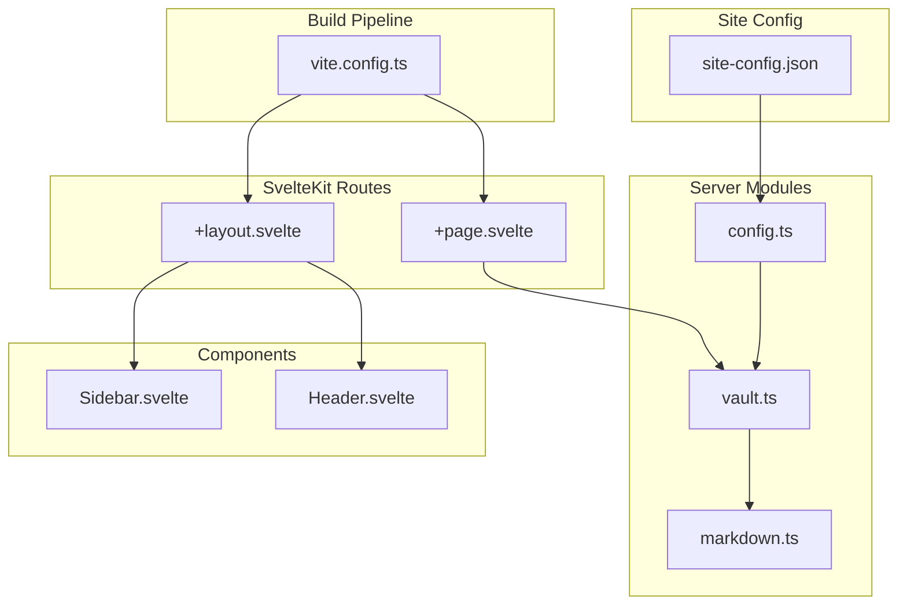
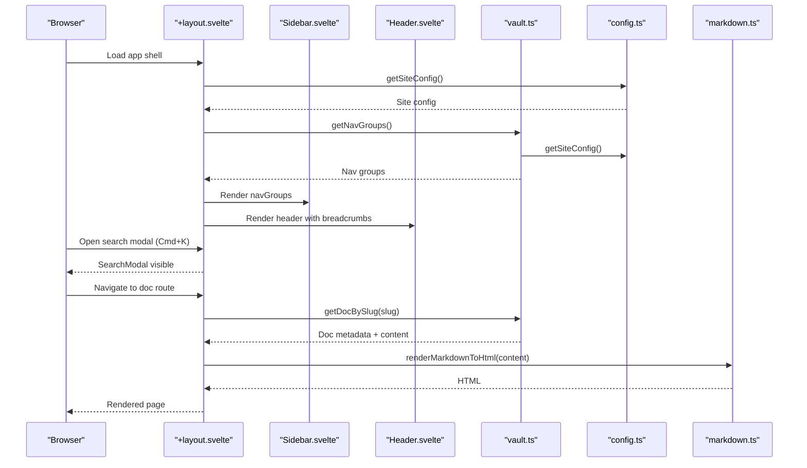
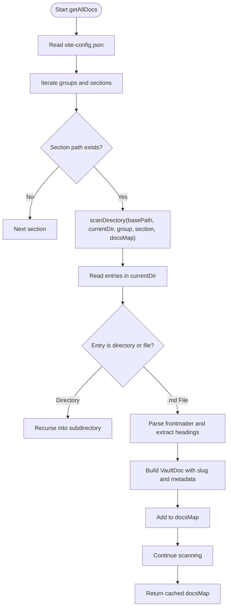
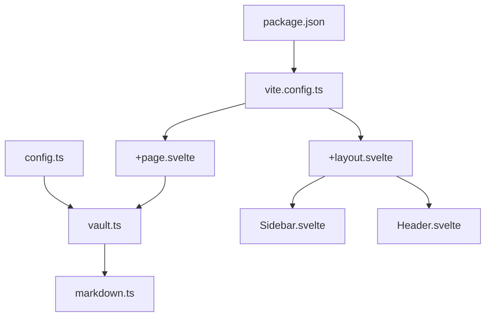

<cite>
**Referenced Files in This Document**
- [README.md](../../sites/fractalwiki/README.md)
- [PLAN.md](../../sites/fractalwiki/PLAN.md)
- [DESIGN.md](../../sites/fractalwiki/DESIGN.md)
- [package.json](../../sites/fractalwiki/package.json)
- [site-config.json](../../sites/fractalwiki/site-config.json)
- [vite.config.ts](../../sites/fractalwiki/vite.config.ts)
- [+layout.svelte](../../sites/fractalwiki/src/routes/+layout.svelte)
- [+page.svelte](../../sites/fractalwiki/src/routes/+page.svelte)
- [vault.ts](../../sites/fractalwiki/src/lib/server/vault.ts)
- [config.ts](../../sites/fractalwiki/src/lib/server/config.ts)
- [markdown.ts](../../sites/fractalwiki/src/lib/server/markdown.ts)
- [Sidebar.svelte](../../sites/fractalwiki/src/lib/components/Sidebar.svelte)
- [Header.svelte](../../sites/fractalwiki/src/lib/components/Header.svelte)
</cite>

## Table of Contents
1. [Introduction](#introduction)
2. [Project Structure](#project-structure)
3. [Core Components](#core-components)
4. [Architecture Overview](#architecture-overview)
5. [Detailed Component Analysis](#detailed-component-analysis)
6. [Dependency Analysis](#dependency-analysis)
7. [Performance Considerations](#performance-considerations)
8. [Troubleshooting Guide](#troubleshooting-guide)
9. [Conclusion](#conclusion)
10. [Appendices](#appendices)

## Introduction
FractalWiki is a SvelteKit-based documentation and knowledge base application that indexes and renders Markdown content from an external vault. It provides:
- A responsive app shell with sidebar navigation, header breadcrumbs, and theme switching
- A dynamic catch-all route for rendering vault documents with frontmatter inspection and table of contents
- Client-side search via a modal triggered by keyboard shortcuts
- A configuration-driven site structure that maps groups and sections to vault directories
- A lightweight markdown renderer and robust link resolution for internal wiki links

The project uses Svelte 5 runes, TypeScript, mdsvex, and a single-tab indented SASS design system powered by fractals-styler. The vault root path points to an external directory containing the knowledge base.

## Project Structure
At a high level, the application consists of:
- Site configuration (site-config.json) defining groups, sections, features, and vault root
- Server-side modules for configuration loading, vault scanning, document indexing, and markdown rendering
- Svelte components for layout, navigation, search, and page rendering
- Vite and mdsvex configuration for preprocessing and build pipeline

**Diagram sources**
- [site-config.json:1-78](../../sites/fractalwiki/site-config.json#L1-L78)
- [config.ts:1-85](../../sites/fractalwiki/src/lib/server/config.ts#L1-L85)
- [vault.ts:1-430](../../sites/fractalwiki/src/lib/server/vault.ts#L1-L430)
- [markdown.ts:1-100](../../sites/fractalwiki/src/lib/server/markdown.ts#L1-L100)
- [+layout.svelte:1-54](../../sites/fractalwiki/src/routes/+layout.svelte#L1-L54)
- [+page.svelte:1-68](../../sites/fractalwiki/src/routes/+page.svelte#L1-L68)
- [Sidebar.svelte:1-77](../../sites/fractalwiki/src/lib/components/Sidebar.svelte#L1-L77)
- [Header.svelte:1-62](../../sites/fractalwiki/src/lib/components/Header.svelte#L1-L62)
- [vite.config.ts:1-24](../../sites/fractalwiki/vite.config.ts#L1-L24)

**Section sources**
- [README.md:1-43](../../sites/fractalwiki/README.md#L1-L43)
- [PLAN.md:1-49](../../sites/fractalwiki/PLAN.md#L1-L49)
- [DESIGN.md:1-169](../../sites/fractalwiki/DESIGN.md#L1-L169)
- [package.json:1-40](../../sites/fractalwiki/package.json#L1-L40)
- [site-config.json:1-78](../../sites/fractalwiki/site-config.json#L1-L78)
- [vite.config.ts:1-24](../../sites/fractalwiki/vite.config.ts#L1-L24)

## Core Components
- Vault indexer and resolver: Scans configured sections under the vault root, parses YAML frontmatter, extracts headings, builds navigation, and resolves wiki links.
- Configuration loader: Reads site-config.json and exposes typed interfaces for site info, features, groups, and sections.
- Markdown renderer: Converts Markdown to HTML with code blocks, lists, tables, headings, and safe escaping.
- App shell and navigation: Provides global layout, sidebar with collapsible groups, header with breadcrumbs and search trigger, and theme toggle.
- Home dashboard: Displays knowledge bank cards grouped by sections with quick links.

Key responsibilities:
- Data loading and caching for docs and navigation
- Safe rendering of user-authored Markdown
- Responsive UI with accessible interactions
- Feature toggles via configuration

**Section sources**
- [vault.ts:1-430](../../sites/fractalwiki/src/lib/server/vault.ts#L1-L430)
- [config.ts:1-85](../../sites/fractalwiki/src/lib/server/config.ts#L1-L85)
- [markdown.ts:1-100](../../sites/fractalwiki/src/lib/server/markdown.ts#L1-L100)
- [+layout.svelte:1-54](../../sites/fractalwiki/src/routes/+layout.svelte#L1-L54)
- [Sidebar.svelte:1-77](../../sites/fractalwiki/src/lib/components/Sidebar.svelte#L1-L77)
- [Header.svelte:1-62](../../sites/fractalwiki/src/lib/components/Header.svelte#L1-L62)
- [+page.svelte:1-68](../../sites/fractalwiki/src/routes/+page.svelte#L1-L68)

## Architecture Overview
The application follows a clear separation between server-side data processing and client-side presentation:
- Server modules load configuration, scan the vault, parse frontmatter, extract headings, and render Markdown.
- SvelteKit routes consume these modules to provide data to components.
- Components manage UI state (sidebar visibility, search modal, theme) and render structured content.

**Diagram sources**
- [+layout.svelte:1-54](../../sites/fractalwiki/src/routes/+layout.svelte#L1-L54)
- [Sidebar.svelte:1-77](../../sites/fractalwiki/src/lib/components/Sidebar.svelte#L1-L77)
- [Header.svelte:1-62](../../sites/fractalwiki/src/lib/components/Header.svelte#L1-L62)
- [vault.ts:1-430](../../sites/fractalwiki/src/lib/server/vault.ts#L1-L430)
- [config.ts:1-85](../../sites/fractalwiki/src/lib/server/config.ts#L1-L85)
- [markdown.ts:1-100](../../sites/fractalwiki/src/lib/server/markdown.ts#L1-L100)

## Detailed Component Analysis

### Vault Indexer and Resolver
Responsibilities:
- Parse YAML frontmatter from Markdown files
- Extract headings for table of contents
- Scan directories recursively to index all documents
- Build navigation groups and sections
- Resolve wiki links and markdown links to canonical routes
- Cache results in memory for performance

Data structures:
- DocFrontmatter: title, description, tags, sources, related, timestamp, source
- HeadingItem: id, text, level
- VaultDoc: slug, filename, group/section identifiers, relative path, frontmatter, content, headings
- VaultNavItem and VaultNavSection: used to construct navigation tree

Algorithms:
- Frontmatter parsing supports key-value pairs and arrays
- Heading extraction uses regex to capture h1-h3 levels
- Directory scanning skips hidden/build directories and processes .md files
- Link resolution normalizes slugs, handles index files, and matches titles or paths

**Diagram sources**
- [vault.ts:136-221](../../sites/fractalwiki/src/lib/server/vault.ts#L136-L221)

**Section sources**
- [vault.ts:1-430](../../sites/fractalwiki/src/lib/server/vault.ts#L1-L430)

### Configuration Loader
Responsibilities:
- Load site-config.json at runtime
- Provide typed interfaces for site info, features, groups, and sections
- Cache configuration in production
- Return sensible fallbacks on errors

Key features:
- Centralized feature flags for search, TOC, frontmatter inspector, wiki links, timestamps, and sources
- Group and section definitions drive navigation and vault scanning

**Section sources**
- [config.ts:1-85](../../sites/fractalwiki/src/lib/server/config.ts#L1-L85)
- [site-config.json:1-78](../../sites/fractalwiki/site-config.json#L1-L78)

### Markdown Renderer
Responsibilities:
- Convert Markdown to HTML safely
- Escape code blocks and inline code
- Generate heading IDs for anchor links
- Support blockquotes, lists, tables, horizontal rules, bold/italic, and paragraphs
- Preserve code formatting and syntax hints

Security considerations:
- Escapes HTML entities in code to prevent XSS
- Processes fenced code blocks before other transformations

**Section sources**
- [markdown.ts:1-100](../../sites/fractalwiki/src/lib/server/markdown.ts#L1-L100)

### App Shell and Navigation
Responsibilities:
- Global layout with sidebar, header, and main content area
- Theme management (light/dark) via class toggling on document element
- Keyboard shortcut handling for search modal (Cmd+K/Ctrl+K)
- Breadcrumb generation from URL path
- Collapsible sidebar groups with active route highlighting

Interactions:
- Sidebar toggles open/close state
- Header triggers search modal and toggles theme
- Active link detection based on current pathname

**Section sources**
- [+layout.svelte:1-54](../../sites/fractalwiki/src/routes/+layout.svelte#L1-L54)
- [Sidebar.svelte:1-77](../../sites/fractalwiki/src/lib/components/Sidebar.svelte#L1-L77)
- [Header.svelte:1-62](../../sites/fractalwiki/src/lib/components/Header.svelte#L1-L62)

### Home Dashboard
Responsibilities:
- Display hero section with site title, subtitle, and description
- Show knowledge bank cards grouped by sections
- Provide quick links to explore sections with item counts
- Highlight search shortcut instructions

**Section sources**
- [+page.svelte:1-68](../../sites/fractalwiki/src/routes/+page.svelte#L1-L68)

## Dependency Analysis
The application has clear dependencies between configuration, server modules, and UI components:
- vite.config.ts integrates mdsvex and fractals-styler for preprocessing
- package.json defines dependencies including SvelteKit, mdsvex, sass, and fractals-styler
- Server modules depend on node:fs and node:path for filesystem operations
- Components depend on Svelte stores and props for state management

**Diagram sources**
- [package.json:1-40](../../sites/fractalwiki/package.json#L1-L40)
- [vite.config.ts:1-24](../../sites/fractalwiki/vite.config.ts#L1-L24)
- [config.ts:1-85](../../sites/fractalwiki/src/lib/server/config.ts#L1-L85)
- [vault.ts:1-430](../../sites/fractalwiki/src/lib/server/vault.ts#L1-L430)
- [markdown.ts:1-100](../../sites/fractalwiki/src/lib/server/markdown.ts#L1-L100)
- [+layout.svelte:1-54](../../sites/fractalwiki/src/routes/+layout.svelte#L1-L54)
- [Sidebar.svelte:1-77](../../sites/fractalwiki/src/lib/components/Sidebar.svelte#L1-L77)
- [Header.svelte:1-62](../../sites/fractalwiki/src/lib/components/Header.svelte#L1-L62)
- [+page.svelte:1-68](../../sites/fractalwiki/src/routes/+page.svelte#L1-L68)

**Section sources**
- [package.json:1-40](../../sites/fractalwiki/package.json#L1-L40)
- [vite.config.ts:1-24](../../sites/fractalwiki/vite.config.ts#L1-L24)

## Performance Considerations
- Memory caching: Documents and navigation are cached in memory after initial scan, improving subsequent lookups
- Production-only caching: Caching is enabled only in production environments to avoid stale data during development
- Efficient scanning: Directory scanning skips hidden and build directories, focusing on relevant .md files
- Lightweight rendering: Custom markdown renderer avoids heavy dependencies while providing essential features
- Client-side search: Search modal operates client-side for fast response times

Optimization opportunities:
- Implement incremental updates for large vaults
- Add pagination or lazy loading for very large sections
- Consider Web Workers for intensive markdown processing
- Use streaming responses for large documents

[No sources needed since this section provides general guidance]

## Troubleshooting Guide
Common issues and solutions:
- Virtual module resolution: Ensure fractalsStyler plugin is active in vite.config.ts for virtual CSS imports
- Sass build errors: Verify sass installation and correct @use/@import paths
- Missing classes: Check that fractals-styler content globs include your files
- Breakpoint suffixes: Use mixins for custom classes instead of relying on JIT for unknown classes
- Theming: Override CSS variables in :root or scoped classes for theme customization

Development workflow:
- Use pnpm scripts for dev, build, preview, check, lint, and format
- Enable runes mode for Svelte 5 components
- Monitor console errors for configuration loading failures

**Section sources**
- [DESIGN.md:85-169](../../sites/fractalwiki/DESIGN.md#L85-L169)
- [vite.config.ts:1-24](../../sites/fractalwiki/vite.config.ts#L1-L24)
- [package.json:1-40](../../sites/fractalwiki/package.json#L1-L40)

## Conclusion
FractalWiki provides a robust foundation for collaborative knowledge management through its modular architecture, configuration-driven navigation, and efficient content processing. The separation of concerns between server-side data handling and client-side presentation enables scalability and maintainability. While the current implementation focuses on static content rendering, the architecture supports future enhancements for real-time collaboration, advanced versioning, and AI-powered assistance.

The design system ensures consistent styling across the application, while the vault-based approach allows teams to organize knowledge in familiar directory structures. The lightweight markdown renderer and robust link resolution provide a solid foundation for content authoring and navigation.

[No sources needed since this section summarizes without analyzing specific files]

## Appendices

### Setup and Development
- Install dependencies using pnpm
- Configure site-config.json with vault root path and navigation structure
- Run development server with npm run dev
- Build production version with npm run build
- Preview production build with npm run preview

### Design System Usage
- Use single-tab indented SASS (.sass) exclusively
- Leverage fractals-styler utility classes for spacing, sizing, and responsive design
- Apply theme variables for consistent color schemes
- Use breakpoint suffixes for responsive component variants

**Section sources**
- [PLAN.md:1-49](../../sites/fractalwiki/PLAN.md#L1-L49)
- [DESIGN.md:1-169](../../sites/fractalwiki/DESIGN.md#L1-L169)
- [README.md:1-43](../../sites/fractalwiki/README.md#L1-L43)
