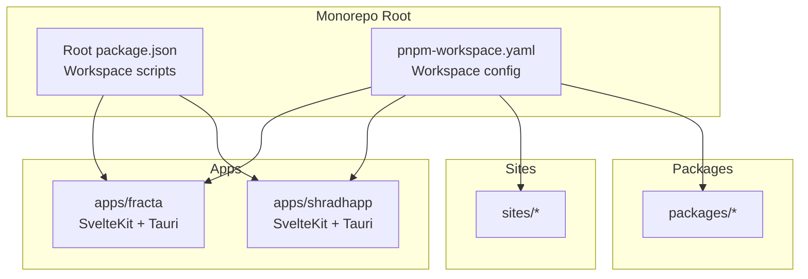
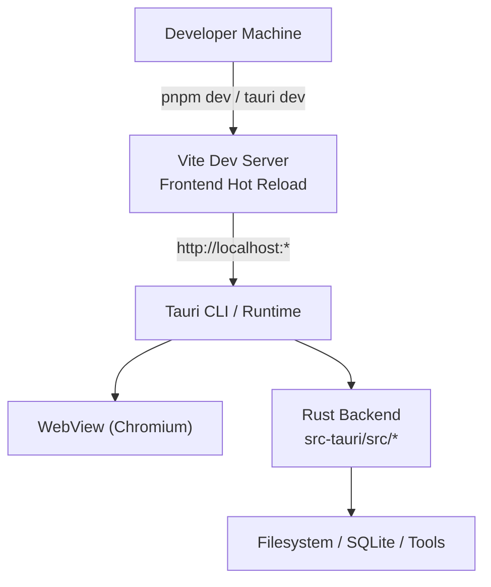
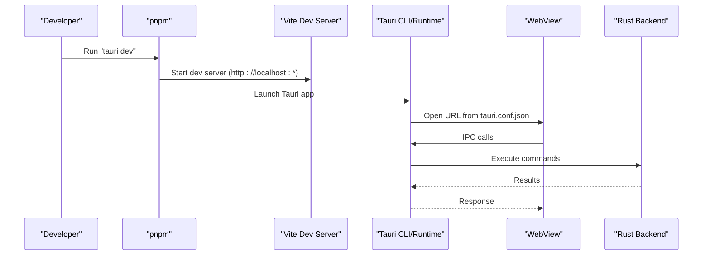
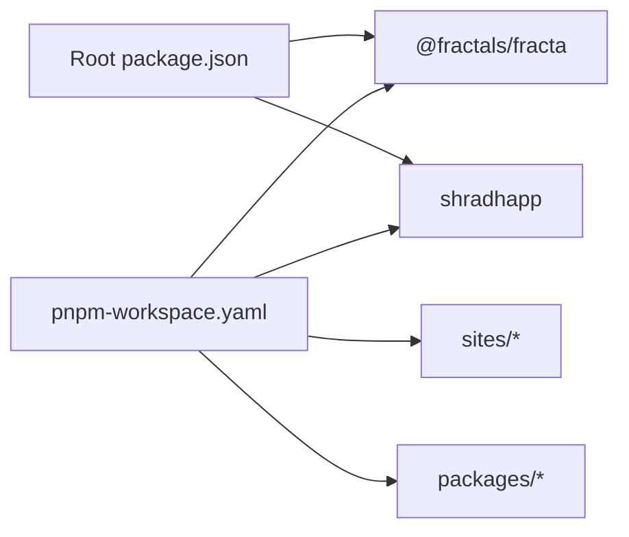

<cite>
**Referenced Files in This Document**
- [README.md](../../README.md)
- [package.json](../../package.json)
- [pnpm-workspace.yaml](../../pnpm-workspace.yaml)
- [apps/fracta/package.json](../../apps/fracta/package.json)
- [apps/fracta/src-tauri/tauri.conf.json](../../apps/fracta/src-tauri/tauri.conf.json)
- [apps/fracta/src-tauri/Cargo.toml](../../apps/fracta/src-tauri/Cargo.toml)
- [apps/fracta/docs/DEVELOPER_GUIDE.md](../../apps/fracta/docs/DEVELOPER_GUIDE.md)
- [apps/shradhapp/package.json](../../apps/shradhapp/package.json)
- [apps/shradhapp/src-tauri/tauri.conf.json](../../apps/shradhapp/src-tauri/tauri.conf.json)
- [apps/shradhapp/src-tauri/Cargo.toml](../../apps/shradhapp/src-tauri/Cargo.toml)
</cite>

## Table of Contents
1. [Introduction](#introduction)
2. [Project Structure](#project-structure)
3. [Core Components](#core-components)
4. [Architecture Overview](#architecture-overview)
5. [Detailed Component Analysis](#detailed-component-analysis)
6. [Dependency Analysis](#dependency-analysis)
7. [Performance Considerations](#performance-considerations)
8. [Troubleshooting Guide](#troubleshooting-guide)
9. [Conclusion](#conclusion)
10. [Appendices](#appendices)

## Introduction
This guide helps you set up and run the Fractals monorepo for the first time. The repository is a pnpm workspace that includes multiple SvelteKit + Tauri desktop apps, sites, and shared packages. You will install prerequisites (Node.js and the Rust toolchain), configure your environment, and learn how to start each app in development mode.

Key points:
- Package manager: pnpm (root lockfile is canonical).
- Stack: SvelteKit 2, Svelte 5, Tauri 2, TypeScript, and indented Sass (.sass).
- Apps include Fracta (notes app with Tauri backend) and Shradhapp (video editor app with Tauri backend).

**Section sources**
- [README.md:1-50](../../README.md#L1-L50)
- [pnpm-workspace.yaml:1-29](../../pnpm-workspace.yaml#L1-L29)

## Project Structure
At a high level:
- apps/: Desktop applications (SvelteKit frontend + Tauri Rust backend).
- sites/: Documentation and showcase sites.
- packages/: Shared libraries and components.
- Root package.json defines workspace scripts for running apps via pnpm filters.

**Diagram sources**
- [package.json:1-36](../../package.json#L1-L36)
- [pnpm-workspace.yaml:1-29](../../pnpm-workspace.yaml#L1-L29)

**Section sources**
- [package.json:1-36](../../package.json#L1-L36)
- [pnpm-workspace.yaml:1-29](../../pnpm-workspace.yaml#L1-L29)

## Core Components
- Fracta (apps/fracta): A notes application built with SvelteKit and Tauri. It uses Vite for the dev server and exposes Tauri commands from a Rust backend.
- Shradhapp (apps/shradhapp): A video editor application built with SvelteKit and Tauri, also using Vite and a Rust backend.

Both apps follow the same pattern:
- Frontend: SvelteKit + Vite (TypeScript, .sass styling).
- Backend: Tauri 2 with Rust code under src-tauri.
- Configuration: tauri.conf.json controls windowing, URLs, and bundling.

**Section sources**
- [apps/fracta/package.json:1-60](../../apps/fracta/package.json#L1-L60)
- [apps/fracta/src-tauri/tauri.conf.json:1-48](../../apps/fracta/src-tauri/tauri.conf.json#L1-L48)
- [apps/shradhapp/package.json:1-48](../../apps/shradhapp/package.json#L1-L48)
- [apps/shradhapp/src-tauri/tauri.conf.json:1-44](../../apps/shradhapp/src-tauri/tauri.conf.json#L1-L44)

## Architecture Overview
The desktop apps use a hybrid architecture:
- SvelteKit serves the UI and handles routing.
- Tauri wraps the web view and exposes Rust commands for system-level operations.
- Vite provides fast development and builds.

**Diagram sources**
- [apps/fracta/src-tauri/tauri.conf.json:1-48](../../apps/fracta/src-tauri/tauri.conf.json#L1-L48)
- [apps/shradhapp/src-tauri/tauri.conf.json:1-44](../../apps/shradhapp/src-tauri/tauri.conf.json#L1-L44)

## Detailed Component Analysis

### Prerequisites and Environment Setup
- Node.js: Required by all SvelteKit apps. Use a recent LTS version.
- pnpm: The monorepo uses pnpm; ensure it is installed or use Corepack.
- Rust toolchain: Required for Tauri apps (fracta and shradhapp). Install rustup and Cargo.
- Tauri platform prerequisites: Follow official Tauri setup for your OS (macOS, Windows, Linux).
- Optional for macOS local GGUF support: llama-server on PATH (e.g., via Homebrew).

Notes:
- The root package.json specifies pnpm as the package manager and includes workspace scripts.
- Each app’s package.json contains its own dev/build scripts.

**Section sources**
- [apps/fracta/docs/DEVELOPER_GUIDE.md:1-98](../../apps/fracta/docs/DEVELOPER_GUIDE.md#L1-L98)
- [package.json:1-36](../../package.json#L1-L36)
- [apps/fracta/package.json:1-60](../../apps/fracta/package.json#L1-L60)
- [apps/shradhapp/package.json:1-48](../../apps/shradhapp/package.json#L1-L48)

### Installing Dependencies
Run at the monorepo root to install dependencies across workspaces:
- pnpm install

If an app requires its own install step, refer to its package.json scripts.

**Section sources**
- [pnpm-workspace.yaml:1-29](../../pnpm-workspace.yaml#L1-L29)
- [package.json:1-36](../../package.json#L1-L36)

### Running Applications

#### Fracta (notes app)
- Start the SvelteKit dev server only: npm run dev (or pnpm --filter @fractals/fracta dev)
- Start the full desktop app with Tauri: npm run tauri dev (or pnpm --filter @fractals/fracta tauri dev)
- Build static frontend: npm run build (or pnpm --filter @fractals/fracta build)
- Type check: npm run check (or pnpm --filter @fractals/fracta check)

Development URL:
- The Tauri config points to http://localhost:5173 for the dev server.

**Section sources**
- [apps/fracta/package.json:1-60](../../apps/fracta/package.json#L1-L60)
- [apps/fracta/src-tauri/tauri.conf.json:1-48](../../apps/fracta/src-tauri/tauri.conf.json#L1-L48)

#### Shradhapp (video editor app)
- Start the SvelteKit dev server only: npm run dev (or pnpm --filter shradhapp dev)
- Start the full desktop app with Tauri: npm run tauri dev (or pnpm --filter shradhapp tauri dev)
- Build static frontend: npm run build (or pnpm --filter shradhapp build)

Development URL:
- The Tauri config points to http://localhost:1420 for the dev server.

**Section sources**
- [apps/shradhapp/package.json:1-48](../../apps/shradhapp/package.json#L1-L48)
- [apps/shradhapp/src-tauri/tauri.conf.json:1-44](../../apps/shradhapp/src-tauri/tauri.conf.json#L1-L44)

### Workspace Scripts at the Monorepo Root
Use pnpm filters to run commands in specific apps:
- fracta:dev, fracta:check, fracta:tauri, fracta:build
- shradhapp: dev and tauri commands are available within the app’s package.json

These scripts delegate to each app’s package.json scripts.

**Section sources**
- [package.json:1-36](../../package.json#L1-L36)

### First-Time Contributor Workflow
1. Clone the repository.
2. Install Node.js and pnpm (or enable Corepack).
3. Install Rust toolchain (rustup, cargo).
4. Install Tauri platform prerequisites for your OS.
5. Run pnpm install at the root.
6. Start an app:
   - For Fracta: pnpm --filter @fractals/fracta dev (browser) or pnpm --filter @fractals/fracta tauri dev (desktop).
   - For Shradhapp: pnpm --filter shradhapp dev (browser) or pnpm --filter shradhapp tauri dev (desktop).
7. Make changes and iterate. Use type checks and linters provided by each app.

**Section sources**
- [apps/fracta/docs/DEVELOPER_GUIDE.md:1-98](../../apps/fracta/docs/DEVELOPER_GUIDE.md#L1-L98)
- [package.json:1-36](../../package.json#L1-L36)

### Platform-Specific Notes

#### macOS
- Ensure Rust toolchain and Tauri prerequisites are installed.
- Optional: Install llama-server on PATH for local GGUF support in Fracta.
- Tauri windows configuration uses Overlay title bar style and traffic light positioning.

**Section sources**
- [apps/fracta/docs/DEVELOPER_GUIDE.md:1-98](../../apps/fracta/docs/DEVELOPER_GUIDE.md#L1-L98)
- [apps/fracta/src-tauri/tauri.conf.json:1-48](../../apps/fracta/src-tauri/tauri.conf.json#L1-L48)

#### Windows
- Install Rust toolchain and Tauri prerequisites per official docs.
- Ensure esbuild override is respected by pnpm (workspace overrides are configured at the root).

**Section sources**
- [pnpm-workspace.yaml:1-29](../../pnpm-workspace.yaml#L1-L29)

#### Linux
- Install Rust toolchain and Tauri prerequisites per official docs.
- Ensure required system libraries for Tauri are present.

**Section sources**
- [pnpm-workspace.yaml:1-29](../../pnpm-workspace.yaml#L1-L29)

### Data Flow: Starting a Tauri App

**Diagram sources**
- [apps/fracta/src-tauri/tauri.conf.json:1-48](../../apps/fracta/src-tauri/tauri.conf.json#L1-L48)
- [apps/shradhapp/src-tauri/tauri.conf.json:1-44](../../apps/shradhapp/src-tauri/tauri.conf.json#L1-L44)

## Dependency Analysis
- Workspace configuration includes apps/*, sites/*, and packages/*.
- Some apps are intentionally excluded (e.g., apps/fractalai) due to separate toolchains.
- Security overrides pin vulnerable transitive dependencies (esbuild, dompurify, js-yaml).

**Diagram sources**
- [package.json:1-36](../../package.json#L1-L36)
- [pnpm-workspace.yaml:1-29](../../pnpm-workspace.yaml#L1-L29)

**Section sources**
- [pnpm-workspace.yaml:1-29](../../pnpm-workspace.yaml#L1-L29)
- [package.json:1-36](../../package.json#L1-L36)

## Performance Considerations
- Prefer browser-only dev (Vite) when testing UI changes without reloading the desktop shell.
- Use pnpm workspaces to avoid redundant installs.
- Keep Rust commands thin and offload heavy logic to native crates where appropriate.
- Avoid unnecessary rebuilds by isolating changes to frontend or backend layers.

[No sources needed since this section provides general guidance]

## Troubleshooting Guide
Common issues and resolutions:
- Tauri dev server port conflicts: Verify the devUrl in tauri.conf.json matches the app’s Vite port.
- Rust build failures: Ensure rustup and target-specific tools are installed per platform.
- Missing system libraries on Linux: Install Tauri prerequisites for your distribution.
- esbuild warnings or vulnerabilities: The workspace overrides enforce safe versions.

**Section sources**
- [apps/fracta/src-tauri/tauri.conf.json:1-48](../../apps/fracta/src-tauri/tauri.conf.json#L1-L48)
- [apps/shradhapp/src-tauri/tauri.conf.json:1-44](../../apps/shradhapp/src-tauri/tauri.conf.json#L1-L44)
- [pnpm-workspace.yaml:1-29](../../pnpm-workspace.yaml#L1-L29)

## Conclusion
You now have the essentials to set up the Fractals monorepo, run Fracta and Shradhapp in development, and understand the project structure and workflows. Use the workspace scripts to navigate between apps efficiently, and consult the developer guides for deeper insights into architecture and best practices.

[No sources needed since this section summarizes without analyzing specific files]

## Appendices

### Quick Commands Reference
- Install dependencies: pnpm install
- Fracta dev (browser): pnpm --filter @fractals/fracta dev
- Fracta desktop: pnpm --filter @fractals/fracta tauri dev
- Shradhapp dev (browser): pnpm --filter shradhapp dev
- Shradhapp desktop: pnpm --filter shradhapp tauri dev

**Section sources**
- [package.json:1-36](../../package.json#L1-L36)
- [apps/fracta/package.json:1-60](../../apps/fracta/package.json#L1-L60)
- [apps/shradhapp/package.json:1-48](../../apps/shradhapp/package.json#L1-L48)
