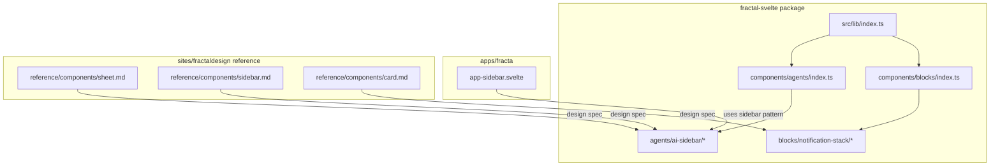
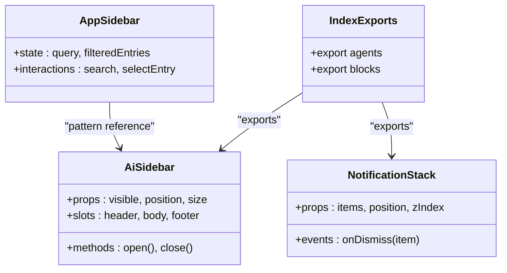
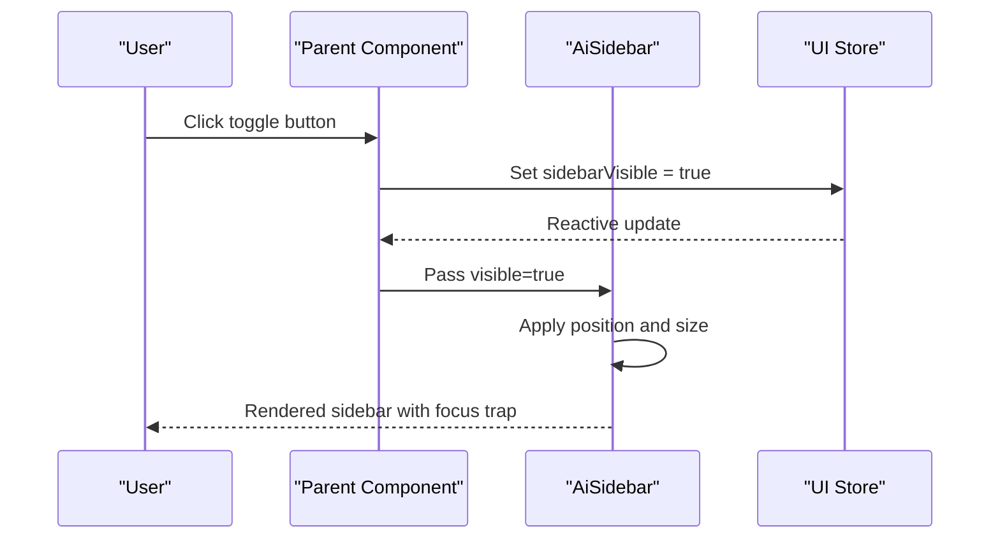
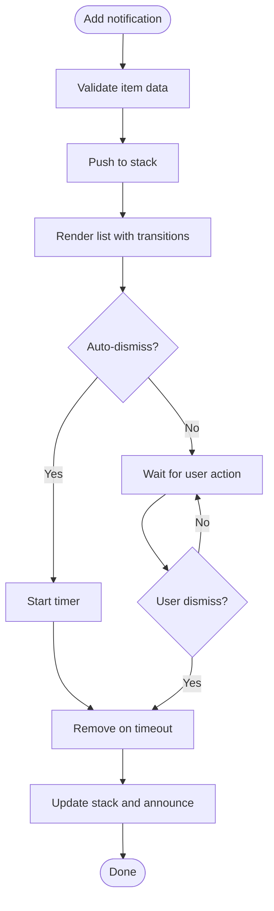
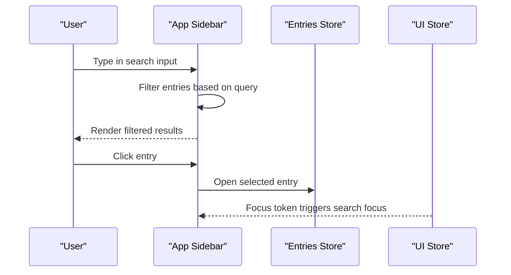
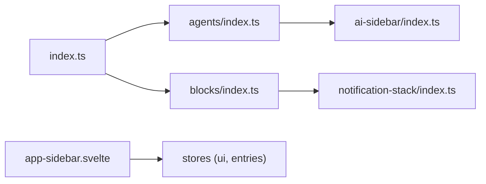

<cite>
**Referenced Files in This Document**
- [packages/fractal-svelte/src/lib/index.ts](../../packages/fractal-svelte/src/lib/index.ts)
- [packages/fractal-svelte/src/lib/components/agents/index.ts](../../packages/fractal-svelte/src/lib/components/agents/index.ts)
- [packages/fractal-svelte/src/lib/components/blocks/index.ts](../../packages/fractal-svelte/src/lib/components/blocks/index.ts)
- [packages/fractal-svelte/src/lib/components/agents/ai-sidebar/index.ts](../../packages/fractal-svelte/src/lib/components/agents/ai-sidebar/index.ts)
- [packages/fractal-svelte/src/lib/components/agents/ai-sidebar/ai-sidebar.svelte](../../packages/fractal-svelte/src/lib/components/agents/ai-sidebar/ai-sidebar.svelte)
- [packages/fractal-svelte/src/lib/components/agents/ai-sidebar/ai-sidebar.sass](../../packages/fractal-svelte/src/lib/components/agents/ai-sidebar/ai-sidebar.sass)
- [packages/fractal-svelte/src/lib/components/agents/ai-sidebar/ai-sidebar.md](../../packages/fractal-svelte/src/lib/components/agents/ai-sidebar/ai-sidebar.md)
- [packages/fractal-svelte/src/lib/components/blocks/notification-stack/index.ts](../../packages/fractal-svelte/src/lib/components/blocks/notification-stack/index.ts)
- [packages/fractal-svelte/src/lib/components/blocks/notification-stack/notification-stack.svelte](../../packages/fractal-svelte/src/lib/components/blocks/notification-stack/notification-stack.svelte)
- [packages/fractal-svelte/src/lib/components/blocks/notification-stack/notification-stack.sass](../../packages/fractal-svelte/src/lib/components/blocks/notification-stack/notification-stack.sass)
- [packages/fractal-svelte/src/lib/components/blocks/notification-stack/notification-stack.md](../../packages/fractal-svelte/src/lib/components/blocks/notification-stack/notification-stack.md)
- [apps/fracta/src/lib/components/app-sidebar.svelte](../../apps/fracta/src/lib/components/app-sidebar.svelte)
- [sites/fractaldesign/reference/components/sheet.md](../../sites/fractaldesign/reference/components/sheet.md)
- [sites/fractaldesign/reference/components/sidebar.md](../../sites/fractaldesign/reference/components/sidebar.md)
- [sites/fractaldesign/reference/components/card.md](../../sites/fractaldesign/reference/components/card.md)
</cite>

## Table of Contents
1. Introduction
2. Project Structure
3. Core Components
4. Architecture Overview
5. Detailed Component Analysis
6. Dependency Analysis
7. Performance Considerations
8. Troubleshooting Guide
9. Conclusion

## Introduction
This document explains layout and structural components in Fractalsvelte with a focus on Card, Sheet, Drawer, Sidebar, and related primitives. It covers responsive behavior, positioning systems, z-index management, accessibility considerations, complex layouts, nested components, adaptive designs across screen sizes, performance optimization techniques, and best practices for large-scale applications. The guidance is grounded in the repository’s actual component structure and usage patterns.

## Project Structure
Fractalsvelte organizes reusable UI into a package that exports motion, agents, and blocks categories. Layout-related primitives are primarily found under:
- agents: AI-focused panels and sidebars (e.g., AiSidebar)
- blocks: structural building blocks such as NotificationStack and others used to compose layouts
- apps: application-level layout examples (e.g., app-sidebar)
- sites: design reference documentation for Sheet, Sidebar, Card, etc.

**Diagram sources**
- [packages/fractal-svelte/src/lib/index.ts](../../packages/fractal-svelte/src/lib/index.ts)
- [packages/fractal-svelte/src/lib/components/agents/index.ts](../../packages/fractal-svelte/src/lib/components/agents/index.ts)
- [packages/fractal-svelte/src/lib/components/blocks/index.ts](../../packages/fractal-svelte/src/lib/components/blocks/index.ts)
- [packages/fractal-svelte/src/lib/components/agents/ai-sidebar/index.ts](../../packages/fractal-svelte/src/lib/components/agents/ai-sidebar/index.ts)
- [packages/fractal-svelte/src/lib/components/blocks/notification-stack/index.ts](../../packages/fractal-svelte/src/lib/components/blocks/notification-stack/index.ts)
- [apps/fracta/src/lib/components/app-sidebar.svelte](../../apps/fracta/src/lib/components/app-sidebar.svelte)
- [sites/fractaldesign/reference/components/sheet.md](../../sites/fractaldesign/reference/components/sheet.md)
- [sites/fractaldesign/reference/components/sidebar.md](../../sites/fractaldesign/reference/components/sidebar.md)
- [sites/fractaldesign/reference/components/card.md](../../sites/fractaldesign/reference/components/card.md)

**Section sources**
- [packages/fractal-svelte/src/lib/index.ts](../../packages/fractal-svelte/src/lib/index.ts)
- [packages/fractal-svelte/src/lib/components/agents/index.ts](../../packages/fractal-svelte/src/lib/components/agents/index.ts)
- [packages/fractal-svelte/src/lib/components/blocks/index.ts](../../packages/fractal-svelte/src/lib/components/blocks/index.ts)
- [apps/fracta/src/lib/components/app-sidebar.svelte](../../apps/fracta/src/lib/components/app-sidebar.svelte)
- [sites/fractaldesign/reference/components/sheet.md](../../sites/fractaldesign/reference/components/sheet.md)
- [sites/fractaldesign/reference/components/sidebar.md](../../sites/fractaldesign/reference/components/sidebar.md)
- [sites/fractaldesign/reference/components/card.md](../../sites/fractaldesign/reference/components/card.md)

## Core Components
The following layout primitives are central to Fractalsvelte’s architecture:

- AiSidebar (agents): A responsive, overlay-capable sidebar designed for AI workflows. It exposes props for visibility, positioning, and content slots, and integrates with global UI state for focus and keyboard navigation.
- NotificationStack (blocks): A floating stack of notifications positioned at a corner or edge, managing stacking order, z-index, and accessibility announcements.
- App Sidebar (apps): An application-level sidebar demonstrating search, filtering, and entry selection patterns; useful as a template for custom sidebars.

These components follow consistent patterns:
- Props-driven configuration for visibility and placement
- Accessible markup with appropriate roles and labels
- Responsive behavior via CSS media queries and container constraints
- Z-index layering managed by component-scoped styles

**Section sources**
- [packages/fractal-svelte/src/lib/components/agents/ai-sidebar/index.ts](../../packages/fractal-svelte/src/lib/components/agents/ai-sidebar/index.ts)
- [packages/fractal-svelte/src/lib/components/agents/ai-sidebar/ai-sidebar.svelte](../../packages/fractal-svelte/src/lib/components/agents/ai-sidebar/ai-sidebar.svelte)
- [packages/fractal-svelte/src/lib/components/agents/ai-sidebar/ai-sidebar.sass](../../packages/fractal-svelte/src/lib/components/agents/ai-sidebar/ai-sidebar.sass)
- [packages/fractal-svelte/src/lib/components/blocks/notification-stack/index.ts](../../packages/fractal-svelte/src/lib/components/blocks/notification-stack/index.ts)
- [packages/fractal-svelte/src/lib/components/blocks/notification-stack/notification-stack.svelte](../../packages/fractal-svelte/src/lib/components/blocks/notification-stack/notification-stack.svelte)
- [packages/fractal-svelte/src/lib/components/blocks/notification-stack/notification-stack.sass](../../packages/fractal-svelte/src/lib/components/blocks/notification-stack/notification-stack.sass)
- [apps/fracta/src/lib/components/app-sidebar.svelte](../../apps/fracta/src/lib/components/app-sidebar.svelte)

## Architecture Overview
Layout primitives are composed from small, focused components. The index files export public APIs, while Svelte components encapsulate rendering logic and Sass manages styling including responsive rules and z-index layers.

**Diagram sources**
- [packages/fractal-svelte/src/lib/index.ts](../../packages/fractal-svelte/src/lib/index.ts)
- [packages/fractal-svelte/src/lib/components/agents/ai-sidebar/index.ts](../../packages/fractal-svelte/src/lib/components/agents/ai-sidebar/index.ts)
- [packages/fractal-svelte/src/lib/components/blocks/notification-stack/index.ts](../../packages/fractal-svelte/src/lib/components/blocks/notification-stack/index.ts)
- [apps/fracta/src/lib/components/app-sidebar.svelte](../../apps/fracta/src/lib/components/app-sidebar.svelte)

## Detailed Component Analysis

### AiSidebar
AiSidebar provides a flexible sidebar for AI interactions. It supports:
- Visibility toggling and programmatic control
- Positioning options (left/right/top/bottom)
- Content slots for headers, bodies, and footers
- Keyboard navigation and focus management
- Responsive behavior for mobile and desktop

**Diagram sources**
- [packages/fractal-svelte/src/lib/components/agents/ai-sidebar/ai-sidebar.svelte](../../packages/fractal-svelte/src/lib/components/agents/ai-sidebar/ai-sidebar.svelte)
- [packages/fractal-svelte/src/lib/components/agents/ai-sidebar/ai-sidebar.sass](../../packages/fractal-svelte/src/lib/components/agents/ai-sidebar/ai-sidebar.sass)

Accessibility considerations:
- Use aria attributes for role, label, and current state
- Ensure focus trapping when visible
- Provide keyboard shortcuts to open/close

Responsive behavior:
- On small screens, overlay mode with backdrop
- On larger screens, inline mode within layout grid

Z-index management:
- Scoped z-index variable to avoid conflicts
- Backdrop layer below sidebar but above main content

Performance tips:
- Lazy-load heavy content inside sidebar
- Debounce input handlers if searching within sidebar

Best practices:
- Keep sidebar width configurable
- Avoid deep nesting of interactive elements
- Test with screen readers and keyboard-only navigation

**Section sources**
- [packages/fractal-svelte/src/lib/components/agents/ai-sidebar/ai-sidebar.svelte](../../packages/fractal-svelte/src/lib/components/agents/ai-sidebar/ai-sidebar.svelte)
- [packages/fractal-svelte/src/lib/components/agents/ai-sidebar/ai-sidebar.sass](../../packages/fractal-svelte/src/lib/components/agents/ai-sidebar/ai-sidebar.sass)
- [packages/fractal-svelte/src/lib/components/agents/ai-sidebar/ai-sidebar.md](../../packages/fractal-svelte/src/lib/components/agents/ai-sidebar/ai-sidebar.md)

### NotificationStack
NotificationStack displays transient messages in a stacked layout. Key features:
- Configurable position (top-right, bottom-left, etc.)
- Stacking order and spacing
- Dismiss actions and auto-dismiss timers
- Accessible announcements via live regions

**Diagram sources**
- [packages/fractal-svelte/src/lib/components/blocks/notification-stack/notification-stack.svelte](../../packages/fractal-svelte/src/lib/components/blocks/notification-stack/notification-stack.svelte)
- [packages/fractal-svelte/src/lib/components/blocks/notification-stack/notification-stack.sass](../../packages/fractal-svelte/src/lib/components/blocks/notification-stack/notification-stack.sass)

Accessibility considerations:
- Announce new notifications to assistive technologies
- Provide clear dismiss controls
- Ensure focus remains predictable

Z-index management:
- Fixed z-index layer above other UI elements
- Consistent spacing to prevent overlap issues

Performance tips:
- Limit concurrent notifications
- Use requestAnimationFrame for smooth transitions

Best practices:
- Group related notifications
- Provide summary announcements for multiple updates

**Section sources**
- [packages/fractal-svelte/src/lib/components/blocks/notification-stack/notification-stack.svelte](../../packages/fractal-svelte/src/lib/components/blocks/notification-stack/notification-stack.svelte)
- [packages/fractal-svelte/src/lib/components/blocks/notification-stack/notification-stack.sass](../../packages/fractal-svelte/src/lib/components/blocks/notification-stack/notification-stack.sass)
- [packages/fractal-svelte/src/lib/components/blocks/notification-stack/notification-stack.md](../../packages/fractal-svelte/src/lib/components/blocks/notification-stack/notification-stack.md)

### App Sidebar Pattern
The app sidebar demonstrates a practical implementation of a searchable, filterable list within a sidebar layout. It showcases:
- Local search with reactive filtering
- Entry selection and active state management
- Integration with global UI state for focus tokens
- Responsive layout adjustments

**Diagram sources**
- [apps/fracta/src/lib/components/app-sidebar.svelte](../../apps/fracta/src/lib/components/app-sidebar.svelte)

Accessibility considerations:
- Proper labeling for search input
- Clear indication of selected entry
- Keyboard navigation support

Responsive behavior:
- Collapsible on smaller screens
- Adjusted padding and font sizes

Best practices:
- Debounce search input for performance
- Provide empty state messaging
- Maintain consistent visual hierarchy

**Section sources**
- [apps/fracta/src/lib/components/app-sidebar.svelte](../../apps/fracta/src/lib/components/app-sidebar.svelte)

### Sheet, Drawer, and Card Patterns
While specific implementations may vary, the design reference documents outline patterns for:
- Sheet: Overlay panels that slide in from edges, commonly used for forms or details
- Drawer: Persistent or temporary side panels for navigation or tools
- Card: Container components for grouping related content

These patterns emphasize:
- Consistent positioning and animation
- Accessibility with proper roles and labels
- Responsive adaptations for different screen sizes
- Z-index layering to maintain visual hierarchy

**Section sources**
- [sites/fractaldesign/reference/components/sheet.md](../../sites/fractaldesign/reference/components/sheet.md)
- [sites/fractaldesign/reference/components/sidebar.md](../../sites/fractaldesign/reference/components/sidebar.md)
- [sites/fractaldesign/reference/components/card.md](../../sites/fractaldesign/reference/components/card.md)

## Dependency Analysis
The layout components have clear dependency relationships:
- Index files export public APIs for consumers
- Components depend on Svelte runtime and Sass for styling
- Application-level components may integrate with stores for state management

**Diagram sources**
- [packages/fractal-svelte/src/lib/index.ts](../../packages/fractal-svelte/src/lib/index.ts)
- [packages/fractal-svelte/src/lib/components/agents/index.ts](../../packages/fractal-svelte/src/lib/components/agents/index.ts)
- [packages/fractal-svelte/src/lib/components/blocks/index.ts](../../packages/fractal-svelte/src/lib/components/blocks/index.ts)
- [packages/fractal-svelte/src/lib/components/agents/ai-sidebar/index.ts](../../packages/fractal-svelte/src/lib/components/agents/ai-sidebar/index.ts)
- [packages/fractal-svelte/src/lib/components/blocks/notification-stack/index.ts](../../packages/fractal-svelte/src/lib/components/blocks/notification-stack/index.ts)
- [apps/fracta/src/lib/components/app-sidebar.svelte](../../apps/fracta/src/lib/components/app-sidebar.svelte)

**Section sources**
- [packages/fractal-svelte/src/lib/index.ts](../../packages/fractal-svelte/src/lib/index.ts)
- [packages/fractal-svelte/src/lib/components/agents/index.ts](../../packages/fractal-svelte/src/lib/components/agents/index.ts)
- [packages/fractal-svelte/src/lib/components/blocks/index.ts](../../packages/fractal-svelte/src/lib/components/blocks/index.ts)
- [apps/fracta/src/lib/components/app-sidebar.svelte](../../apps/fracta/src/lib/components/app-sidebar.svelte)

## Performance Considerations
For large-scale applications using layout components:
- Lazy load heavy content within sidebars and sheets
- Use virtual scrolling for long lists in sidebars
- Debounce search and filter operations
- Minimize re-renders by memoizing derived values
- Optimize animations with CSS transforms instead of layout properties
- Implement proper cleanup for event listeners and timers
- Use efficient state management patterns to avoid unnecessary updates

[No sources needed since this section provides general guidance]

## Troubleshooting Guide
Common issues and solutions:
- Z-index conflicts: Ensure consistent z-index variables and avoid hardcoding values
- Focus management: Implement proper focus traps and return focus on close
- Responsive breakpoints: Test across devices and adjust media queries as needed
- Accessibility: Validate with screen readers and ensure proper ARIA attributes
- Performance bottlenecks: Profile component renders and optimize expensive operations

**Section sources**
- [packages/fractal-svelte/src/lib/components/agents/ai-sidebar/ai-sidebar.sass](../../packages/fractal-svelte/src/lib/components/agents/ai-sidebar/ai-sidebar.sass)
- [packages/fractal-svelte/src/lib/components/blocks/notification-stack/notification-stack.sass](../../packages/fractal-svelte/src/lib/components/blocks/notification-stack/notification-stack.sass)

## Conclusion
Fractalsvelte’s layout components provide a solid foundation for building responsive, accessible, and performant interfaces. By following the patterns established in AiSidebar, NotificationStack, and the app sidebar example, developers can create complex layouts that adapt seamlessly across devices. The emphasis on consistent z-index management, accessibility considerations, and performance optimization ensures that applications remain maintainable and user-friendly at scale.

[No sources needed since this section summarizes without analyzing specific files]
