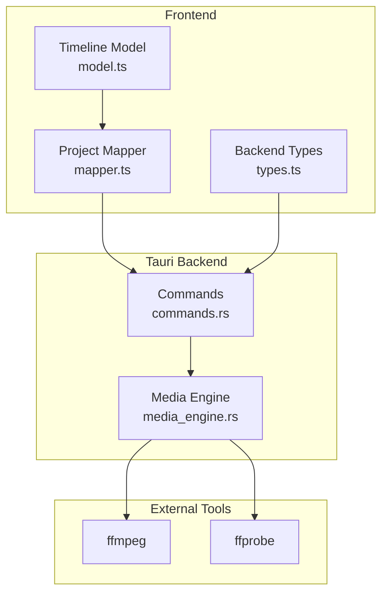
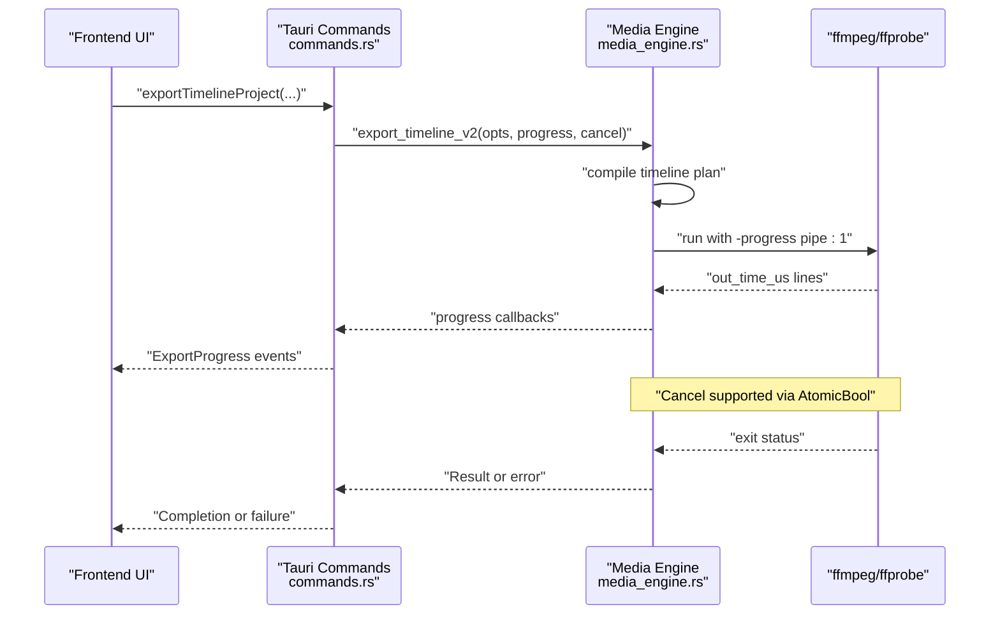
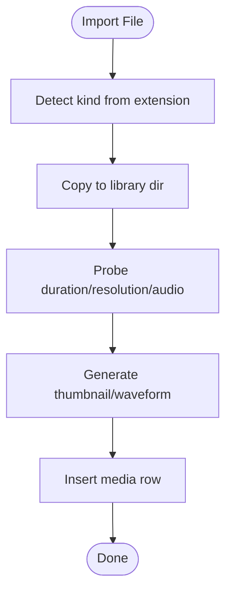
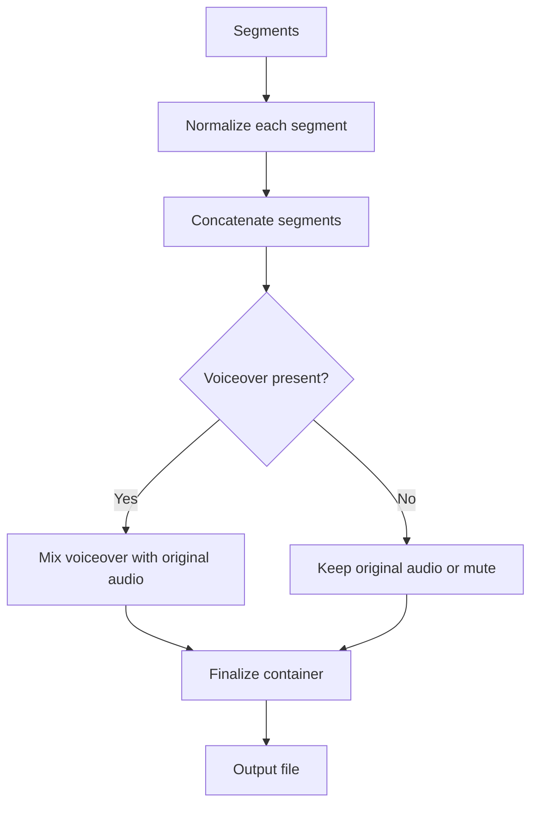
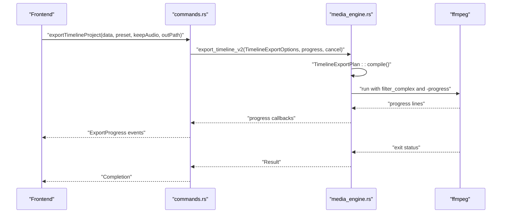
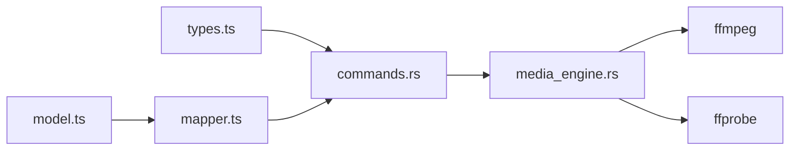

<cite>
**Referenced Files in This Document**
- [media_engine.rs](../../apps/shradhapp/src-tauri/src/media_engine.rs)
- [commands.rs](../../apps/shradhapp/src-tauri/src/commands.rs)
- [model.ts](../../apps/shradhapp/src/lib/timeline/model.ts)
- [mapper.ts](../../apps/shradhapp/src/lib/timeline/mapper.ts)
- [types.ts](../../apps/shradhapp/src/lib/backend/types.ts)
</cite>

## Table of Contents
1. [Introduction](#introduction)
2. [Project Structure](#project-structure)
3. [Core Components](#core-components)
4. [Architecture Overview](#architecture-overview)
5. [Detailed Component Analysis](#detailed-component-analysis)
6. [Dependency Analysis](#dependency-analysis)
7. [Performance Considerations](#performance-considerations)
8. [Troubleshooting Guide](#troubleshooting-guide)
9. [Conclusion](#conclusion)
10. [Appendices](#appendices)

## Introduction
This document explains the media processing engine powering ShradhApp’s video/audio pipelines, format conversion, codec handling, timeline operations, clip manipulation, and export workflows. It covers asset management (import, thumbnails, waveforms), batch processing patterns, memory considerations for large files, background execution, and progress tracking. The backend is implemented in Rust using Tauri commands that orchestrate ffmpeg/ffprobe; the frontend uses TypeScript models and mappers to build timelines and drive exports.

## Project Structure
The media engine spans a small but focused set of modules:
- Backend (Rust/Tauri):
  - media_engine.rs: All ffmpeg/ffprobe interactions, probing, thumbnail/waveform generation, audio cleanup, v1 sequential export, and v2 timeline export with progress and cancellation.
  - commands.rs: Typed Tauri commands exposed to the frontend, including media import, metadata, voiceover recording, cleanup/repair, project CRUD, and export entry points.
- Frontend (TypeScript/SvelteKit):
  - model.ts: Timeline data model (tracks, clips, settings).
  - mapper.ts: Conversion between legacy v1 projects and v2 multi-track timelines, normalization, duration calculation.
  - types.ts: Shared type definitions used by both frontend and backend command contracts.



**Diagram sources**
- [model.ts](../../apps/shradhapp/src/lib/timeline/model.ts)
- [mapper.ts](../../apps/shradhapp/src/lib/timeline/mapper.ts)
- [types.ts](../../apps/shradhapp/src/lib/backend/types.ts)
- [commands.rs](../../apps/shradhapp/src-tauri/src/commands.rs)
- [media_engine.rs](../../apps/shradhapp/src-tauri/src/media_engine.rs)

**Section sources**
- [media_engine.rs](../../apps/shradhapp/src-tauri/src/media_engine.rs)
- [commands.rs](../../apps/shradhapp/src-tauri/src/commands.rs)
- [model.ts](../../apps/shradhapp/src/lib/timeline/model.ts)
- [mapper.ts](../../apps/shradhapp/src/lib/timeline/mapper.ts)
- [types.ts](../../apps/shradhapp/src/lib/backend/types.ts)

## Core Components
- Ffmpeg orchestrator: Locates binaries, probes media, generates thumbnails/waveforms, cleans up audio, and runs export pipelines with progress and cancellation.
- Tauri commands: Provide typed APIs for importing media, saving recordings, cleaning/repairing audio, managing projects, and exporting (v1 and v2).
- Timeline model and mapper: Define v2 timeline structure and convert between v1 and v2 formats, ensuring consistent durations and track semantics.

Key responsibilities:
- Probing: Extract duration, resolution, and audio presence via ffprobe.
- Thumbnails/Waveforms: Generate preview assets for UI.
- Audio cleanup: Apply filters (highpass, denoise, silence trim, loudness normalization) and produce AAC outputs.
- Export v1: Normalize segments, concat, mix optional voiceover, finalize container.
- Export v2: Compile a single ffmpeg filter graph across multiple tracks and render directly.

**Section sources**
- [media_engine.rs](../../apps/shradhapp/src-tauri/src/media_engine.rs)
- [commands.rs](../../apps/shradhapp/src-tauri/src/commands.rs)
- [model.ts](../../apps/shradhapp/src/lib/timeline/model.ts)
- [mapper.ts](../../apps/shradhapp/src/lib/timeline/mapper.ts)

## Architecture Overview
The system follows a clear separation:
- Frontend builds timeline state and export options.
- Tauri commands validate inputs and call into the media engine.
- Media engine constructs ffmpeg commands, streams progress, and handles cancellation.



**Diagram sources**
- [commands.rs](../../apps/shradhapp/src-tauri/src/commands.rs)
- [media_engine.rs](../../apps/shradhapp/src-tauri/src/media_engine.rs)

## Detailed Component Analysis

### Media Engine (Rust)
Responsibilities:
- Binary discovery for ffmpeg/ffprobe with platform fallbacks.
- Probing media metadata.
- Thumbnail and waveform generation.
- Audio cleanup and tick repair.
- Sequential export (v1) with segment normalization, concat, and finalization.
- Multi-track timeline export (v2) compiling a single filter_complex.
- Progress streaming and cancellation.

```mermaid
classDiagram
class Ffmpeg {
+PathBuf ffmpeg
+PathBuf ffprobe
+locate() Result
+probe(input) ProbeInfo
+video_thumbnail(input,out) Result
+image_thumbnail(input,out) Result
+waveform(input,out) Result
+cleanup_audio(input,out) Result
+repair_audio_ticks(input,out) Result
+export(opts,progress,cancel) Result
+export_timeline_v2(opts,progress,cancel) Result
-segment_command(seg,opts,out) Command
-timeline_command(opts,plan) Command
-run_with_progress(cmd,expected_secs,cancel,on_frac) Result
}
class ProbeInfo {
+duration Option<f64>
+width Option<u32>
+height Option<u32>
+has_audio bool
}
class ExportSegment {
<<enum>>
+Video{input,trim_start,trim_end,has_audio}
+Still{input,duration}
+AudioOnly{input,trim_start,trim_end}
+duration() f64
}
class ExportOptions {
+segments Vec<ExportSegment>
+voiceover Option<PathBuf>
+keep_original_audio bool
+width u32
+height u32
+crf u32
+output PathBuf
}
class TimelineExportClip {
+input PathBuf
+track_kind TimelineTrackKind
+media_kind TimelineMediaKind
+start f64
+trim_start f64
+duration f64
+has_audio bool
+volume f64
+muted bool
}
class TimelineExportOptions {
+clips Vec<TimelineExportClip>
+keep_original_audio bool
+width u32
+height u32
+crf u32
+output PathBuf
}
class TimelineExportPlan {
+duration f64
+filter_complex String
+video_label String
+audio_label String
+has_audio bool
+compile(opts) Result
}
Ffmpeg --> ProbeInfo : "returns"
Ffmpeg --> ExportOptions : "uses"
Ffmpeg --> ExportSegment : "iterates"
Ffmpeg --> TimelineExportOptions : "uses"
Ffmpeg --> TimelineExportPlan : "compiles"
```

**Diagram sources**
- [media_engine.rs](../../apps/shradhapp/src-tauri/src/media_engine.rs)

Key implementation highlights:
- Probing parses JSON output from ffprobe to extract duration, width/height, and audio presence.
- Thumbnails use scaled frames; short videos fall back to first frame if seek fails.
- Waveform generation uses showwavespic filter.
- Audio cleanup applies highpass, denoise, silence removal, and loudnorm; outputs AAC M4A.
- Tick repair adds adeclick before denoise and loudnorm.
- v1 export normalizes each segment to a common canvas/codec, concatenates, then mixes optional voiceover and finalizes.
- v2 export compiles a single filter_complex overlaying visuals and mixing audio with delays/volume.
- run_with_progress reads out_time_us/out_time_ms from ffmpeg progress stream and invokes callbacks; supports cancellation via AtomicBool.

**Section sources**
- [media_engine.rs](../../apps/shradhapp/src-tauri/src/media_engine.rs)

### Tauri Commands (Rust)
Responsibilities:
- Expose typed APIs to the frontend for media, voiceover, projects, and export.
- Manage app settings and runtime info.
- Orchestrate imports, probe metadata, generate thumbnails/waveforms, and persist results.
- Provide export endpoints for both v1 and v2 timelines, emitting progress events and supporting cancellation.

Important flows:
- Import files: copy to library, probe, generate thumb/waveform, insert DB row.
- Save recording: write blob, probe, generate waveform, insert DB row.
- Cleanup/Repair audio: create new cleaned/repaired file, probe durations, update DB, return result.
- Export v1: build ExportOptions with segments, call engine.export with progress/cancel.
- Export v2: build TimelineExportOptions, call engine.export_timeline_v2 with progress/cancel.



**Diagram sources**
- [commands.rs](../../apps/shradhapp/src-tauri/src/commands.rs)

**Section sources**
- [commands.rs](../../apps/shradhapp/src-tauri/src/commands.rs)

### Timeline Model and Mapper (TypeScript)
Responsibilities:
- Define v2 timeline schema: tracks, clips, settings, and duration.
- Convert between v1 (sequential clips) and v2 (multi-track) projects.
- Normalize clips and compute timeline duration.

Key concepts:
- Track kinds: video, audio.
- Clip properties: timeline start/duration, source trim range, volume, muted flag.
- V1-to-V2 mapping places clips on a primary video track and optionally adds a voiceover audio track.
- V2-to-V1 mapping extracts ordered primary clips and identifies voiceover media.

```mermaid
classDiagram
class TimelineClip {
+id string
+trackId string
+mediaId string
+kind string
+name string|null
+timeline {start : number; duration : number}
+source {trimStart : number; trimEnd : number}
+volume number
+muted boolean
}
class TimelineTrack {
+id string
+kind string
+name string
+clips TimelineClip[]
+muted boolean
+locked boolean
}
class ProjectDataV2 {
+version 2
+name string
+timeline {tracks : TimelineTrack[]; duration : number; settings : TimelineSettings}
+created_at number
+updated_at number
+legacy? {voiceover_media_id? : string}
}
class ProjectDataV1 {
+version 1
+name string
+clips Clip[]
+voiceover_media_id string|null
+created_at number
+updated_at number
}
ProjectDataV2 --> TimelineTrack : "contains"
TimelineTrack --> TimelineClip : "contains"
ProjectDataV1 <--> ProjectDataV2 : "mapped"
```

**Diagram sources**
- [model.ts](../../apps/shradhapp/src/lib/timeline/model.ts)
- [mapper.ts](../../apps/shradhapp/src/lib/timeline/mapper.ts)

**Section sources**
- [model.ts](../../apps/shradhapp/src/lib/timeline/model.ts)
- [mapper.ts](../../apps/shradhapp/src/lib/timeline/mapper.ts)

### Export Workflows

#### v1 Sequential Export
- Normalizes each segment to a common canvas and codec.
- Concatenates normalized segments (stream copy when possible; fallback re-encode).
- Optionally mixes voiceover and finalizes container.



**Diagram sources**
- [media_engine.rs](../../apps/shradhapp/src-tauri/src/media_engine.rs)

#### v2 Timeline Export
- Compiles a single ffmpeg filter_complex across all tracks.
- Overlays visual clips at correct timestamps and scales/pads to target canvas.
- Delays and volumes audio clips, mixes them, and renders to output.



**Diagram sources**
- [media_engine.rs](../../apps/shradhapp/src-tauri/src/media_engine.rs)
- [commands.rs](../../apps/shradhapp/src-tauri/src/commands.rs)

**Section sources**
- [media_engine.rs](../../apps/shradhapp/src-tauri/src/media_engine.rs)
- [commands.rs](../../apps/shradhapp/src-tauri/src/commands.rs)

## Dependency Analysis
- Frontend depends on shared types and timeline models to construct export requests.
- Tauri commands depend on the media engine for all heavy lifting.
- Media engine depends on external ffmpeg/ffprobe binaries discovered via PATH and platform-specific locations.



**Diagram sources**
- [model.ts](../../apps/shradhapp/src/lib/timeline/model.ts)
- [mapper.ts](../../apps/shradhapp/src/lib/timeline/mapper.ts)
- [types.ts](../../apps/shradhapp/src/lib/backend/types.ts)
- [commands.rs](../../apps/shradhapp/src-tauri/src/commands.rs)
- [media_engine.rs](../../apps/shradhapp/src-tauri/src/media_engine.rs)

**Section sources**
- [media_engine.rs](../../apps/shradhapp/src-tauri/src/media_engine.rs)
- [commands.rs](../../apps/shradhapp/src-tauri/src/commands.rs)
- [model.ts](../../apps/shradhapp/src/lib/timeline/model.ts)
- [mapper.ts](../../apps/shradhapp/src/lib/timeline/mapper.ts)
- [types.ts](../../apps/shradhapp/src/lib/backend/types.ts)

## Performance Considerations
- Memory usage:
  - ffmpeg processes handle I/O and decoding/encoding; avoid loading entire files into memory in Rust.
  - Use stream copy where possible during concat to minimize CPU and memory.
  - Temporary files are created in a per-export temp directory and cleaned up after completion.
- CPU usage:
  - v1 export normalizes every segment; consider batching or pre-normalizing large libraries.
  - v2 export compiles a single filter graph; complex overlays/mixes increase CPU load.
- I/O:
  - Prefer fast storage for library and temp directories.
  - Avoid excessive thumbnail/waveform regeneration; cache paths in DB.
- Concurrency:
  - Each export runs in its own process; ensure OS limits allow concurrent ffmpeg instances.
  - Cancel support prevents resource leaks by killing ffmpeg when requested.

[No sources needed since this section provides general guidance]

## Troubleshooting Guide
Common issues and resolutions:
- ffmpeg not found:
  - Ensure ffmpeg/ffprobe are installed and discoverable via PATH or platform-specific locations.
  - Runtime info exposes availability and path/message.
- Export failures:
  - Check stderr tail captured by run_quiet/run_with_progress for last error lines.
  - Validate input paths, codecs, and target canvas dimensions.
- Progress not updating:
  - Confirm ffmpeg is invoked with -progress pipe:1 and expected duration is provided.
  - Verify cancel flag is not prematurely set.
- Audio quality issues:
  - Review cleanup chains (highpass, denoise, silence trim, loudnorm) and tick repair filters.
  - Compare before/after durations returned by cleanup/repair commands.

**Section sources**
- [media_engine.rs](../../apps/shradhapp/src-tauri/src/media_engine.rs)
- [commands.rs](../../apps/shradhapp/src-tauri/src/commands.rs)

## Conclusion
ShradhApp’s media processing engine centralizes all ffmpeg/ffprobe interactions behind typed Tauri commands, providing robust media ingestion, thumbnail/waveform generation, audio cleanup, and two export pathways (v1 sequential and v2 multi-track timeline). The design emphasizes progress reporting, cancellation, and clean separation between frontend models and backend execution. For large-scale or high-performance scenarios, consider pre-normalization, caching strategies, and careful filter complexity management.

[No sources needed since this section summarizes without analyzing specific files]

## Appendices

### Example: Asset Management Workflow
- Import files → copy to library → probe metadata → generate thumbnails/waveforms → persist to DB.
- Delete media → remove library copy and thumbnail; originals outside library remain untouched.

**Section sources**
- [commands.rs](../../apps/shradhapp/src-tauri/src/commands.rs)

### Example: Batch Processing Patterns
- Iterate over imported files and invoke import_one for each; aggregate successes and failures.
- For bulk cleanup/repair, queue jobs and emit progress per item.

**Section sources**
- [commands.rs](../../apps/shradhapp/src-tauri/src/commands.rs)

### Example: Background Processing and Progress Tracking
- Use run_with_progress to parse out_time_us/out_time_ms and map to 0..1 fraction.
- Emit ExportProgress events to the frontend; support cancellation via AtomicBool.

**Section sources**
- [media_engine.rs](../../apps/shradhapp/src-tauri/src/media_engine.rs)
- [types.ts](../../apps/shradhapp/src/lib/backend/types.ts)
