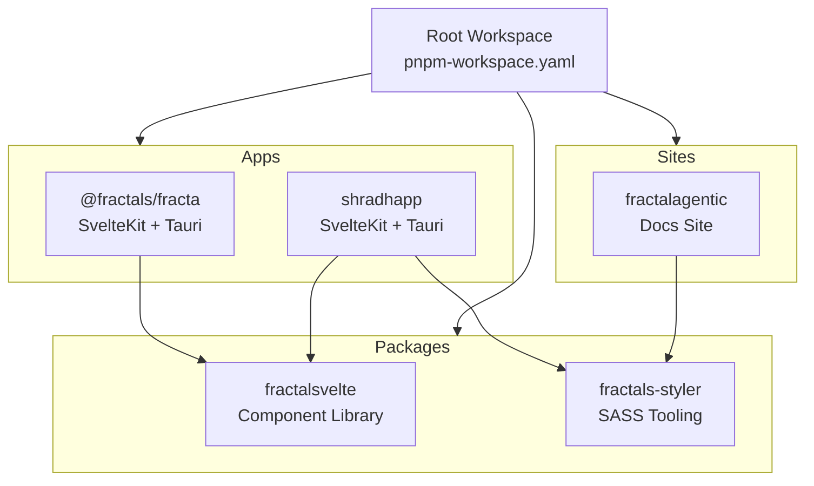
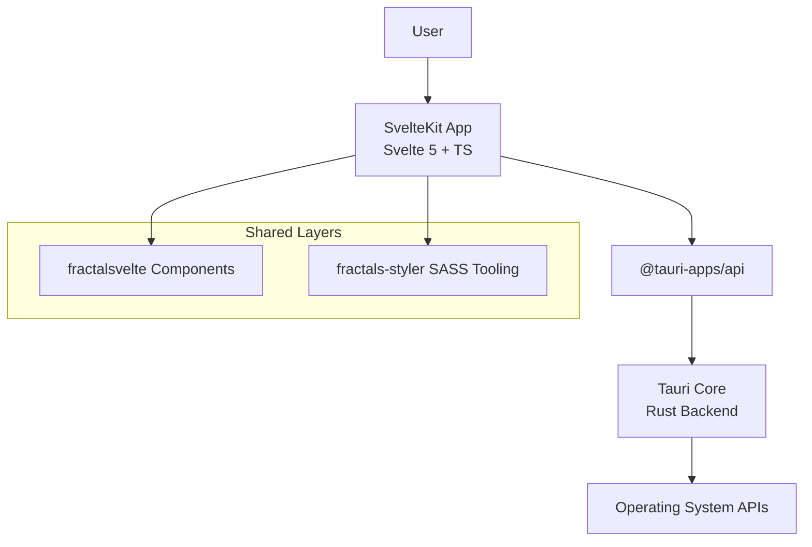
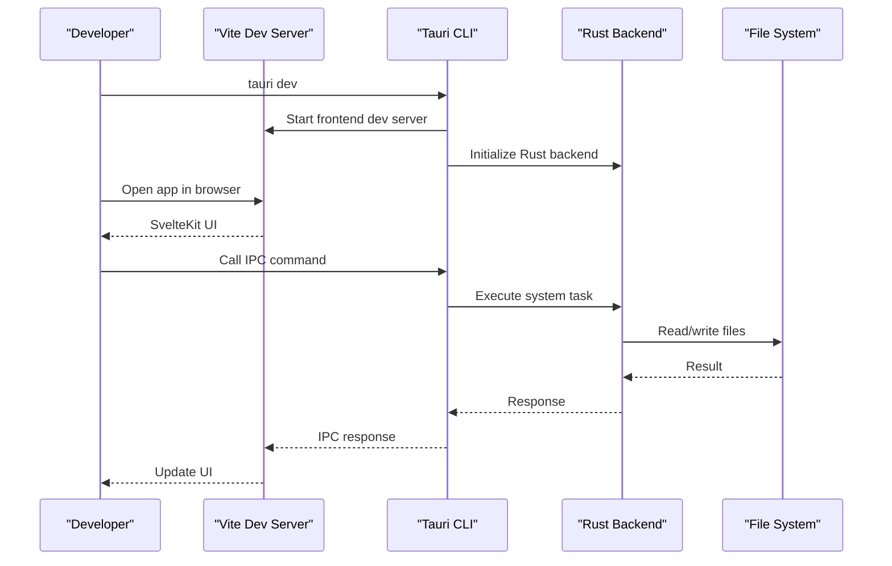
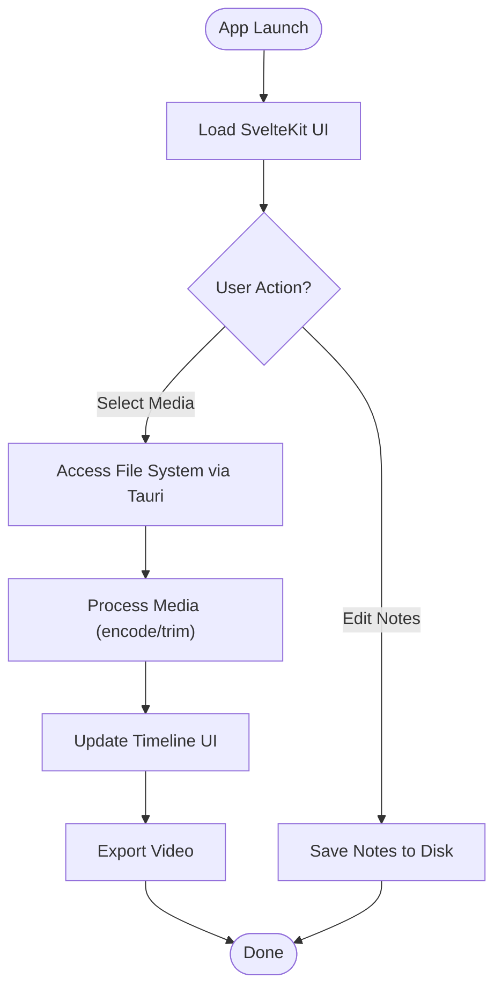
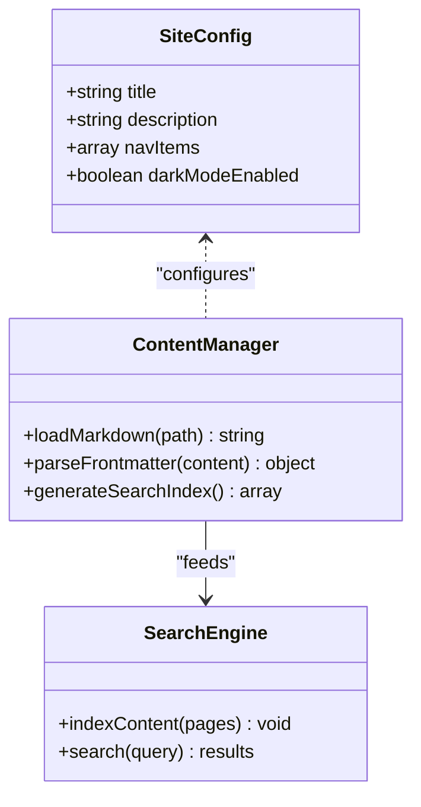
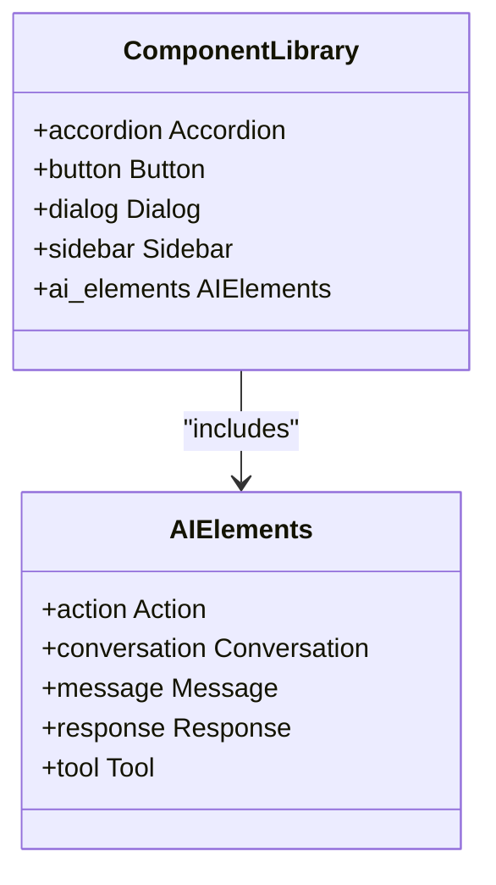
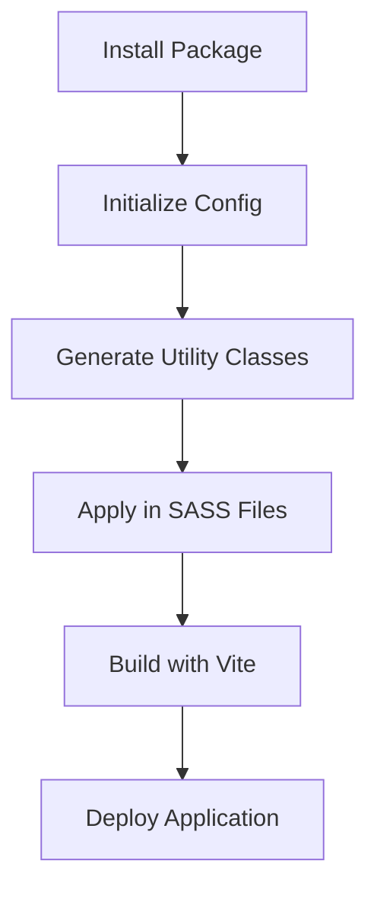
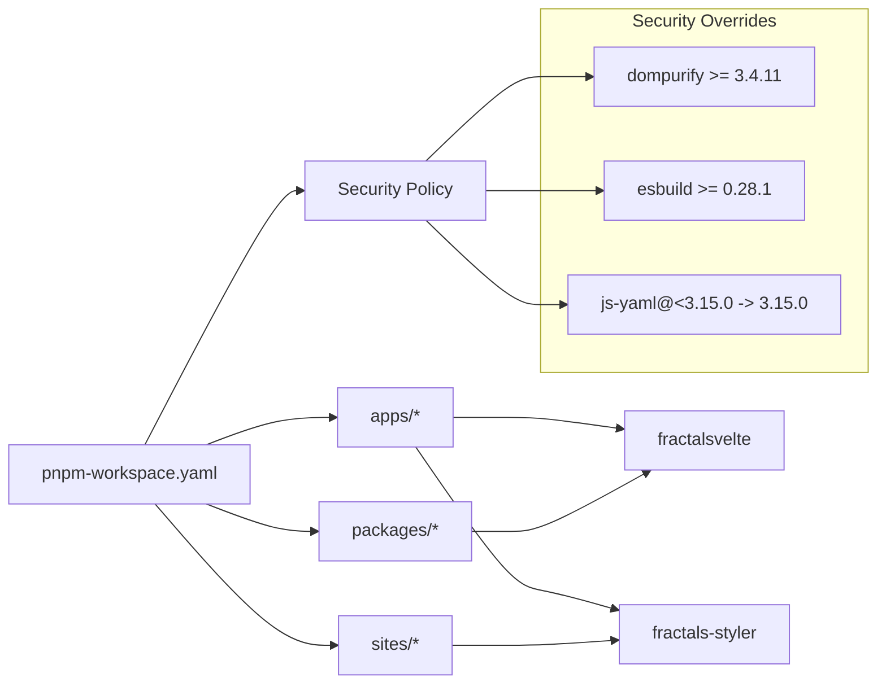

<cite>
**Referenced Files in This Document**
- [README.md](../../README.md)
- [package.json](../../package.json)
- [pnpm-workspace.yaml](../../pnpm-workspace.yaml)
- [apps/fracta/package.json](../../apps/fracta/package.json)
- [apps/fracta/src-tauri/tauri.conf.json](../../apps/fracta/src-tauri/tauri.conf.json)
- [apps/shradhapp/package.json](../../apps/shradhapp/package.json)
- [apps/shradhapp/src-tauri/tauri.conf.json](../../apps/shradhapp/src-tauri/tauri.conf.json)
- [sites/fractalagentic/package.json](../../sites/fractalagentic/package.json)
- [packages/fractalsvelte/package.json](../../packages/fractalsvelte/package.json)
- [packages/fractals-styler/package.json](../../packages/fractals-styler/package.json)
</cite>

## Table of Contents
1. [Introduction](#introduction)
2. [Project Structure](#project-structure)
3. [Core Components](#core-components)
4. [Architecture Overview](#architecture-overview)
5. [Detailed Component Analysis](#detailed-component-analysis)
6. [Dependency Analysis](#dependency-analysis)
7. [Performance Considerations](#performance-considerations)
8. [Troubleshooting Guide](#troubleshooting-guide)
9. [Conclusion](#conclusion)

## Introduction
This monorepo is a unified development ecosystem that brings together desktop applications, documentation sites, and shared packages under one workspace. It is built with SvelteKit + Svelte 5 + Tauri + TypeScript, and uses pnpm workspaces for dependency management and consistent builds across all projects. Styling follows a strict convention: single-tab indented SASS (.sass), without SCSS syntax or braces/semicolons.

The repository includes:
- Desktop apps (SvelteKit frontends packaged as native apps via Tauri)
- Documentation and marketing sites (SvelteKit-based content sites)
- Shared packages (UI components, styling tooling, icons, and utilities)

Beginners can think of this as a “one repo to rule them all” for building modern UIs, publishing docs, and shipping cross-platform desktop apps. Experienced developers will appreciate the clear separation between apps, sites, and packages, along with standardized tooling and build scripts.

**Section sources**
- [README.md:1-50](../../README.md#L1-L50)

## Project Structure
At the root level, the monorepo is organized into three primary categories:
- apps: Desktop applications powered by SvelteKit and Tauri
- sites: Documentation and content sites built with SvelteKit
- packages: Reusable libraries and tooling consumed by apps and sites

A root-level pnpm-workspace.yaml defines which directories are part of the workspace and enforces security policies for dependency builds. The root package.json centralizes common scripts for running and building each project using pnpm filters.

**Diagram sources**
- [pnpm-workspace.yaml:1-29](../../pnpm-workspace.yaml#L1-L29)
- [package.json:1-36](../../package.json#L1-L36)

**Section sources**
- [pnpm-workspace.yaml:1-29](../../pnpm-workspace.yaml#L1-L29)
- [package.json:1-36](../../package.json#L1-L36)

## Core Components
This section highlights the key building blocks across the monorepo:

- Desktop Applications
  - Fracta: A notes app combining SvelteKit UI with Tauri backend capabilities.
  - Shradhapp: A media-focused app leveraging SvelteKit and Tauri for local file operations and media processing.

- Documentation Sites
  - Fractalagentic: A comprehensive documentation site showcasing agents, skills, commands, and more.

- Shared Packages
  - fractalsvelte: A component library offering reusable UI primitives for SvelteKit apps.
  - fractals-styler: A CLI and utility package that scaffolds SASS-based styling conventions and theme tokens.

Each app and site declares its own dependencies and scripts, while sharing common patterns like TypeScript configuration extending SvelteKit’s generated tsconfig.

**Section sources**
- [apps/fracta/package.json:1-60](../../apps/fracta/package.json#L1-L60)
- [apps/shradhapp/package.json:1-48](../../apps/shradhapp/package.json#L1-L48)
- [sites/fractalagentic/package.json:1-59](../../sites/fractalagentic/package.json#L1-L59)
- [packages/fractalsvelte/package.json:1-504](../../packages/fractalsvelte/package.json#L1-L504)
- [packages/fractals-styler/package.json:1-45](../../packages/fractals-styler/package.json#L1-L45)

## Architecture Overview
The architecture blends web technologies with native capabilities:
- Frontend: SvelteKit + Svelte 5 + TypeScript for reactive UIs and routing
- Backend: Tauri (Rust) for secure system access and performance-critical tasks
- Styling: Single-tab SASS (.sass) with optional utility generators from fractals-styler
- Distribution: Tauri bundles the SvelteKit build into native installers for macOS, Windows, and Linux

**Diagram sources**
- [apps/fracta/package.json:1-60](../../apps/fracta/package.json#L1-L60)
- [apps/fracta/src-tauri/tauri.conf.json:1-48](../../apps/fracta/src-tauri/tauri.conf.json#L1-L48)
- [packages/fractalsvelte/package.json:1-504](../../packages/fractalsvelte/package.json#L1-L504)
- [packages/fractals-styler/package.json:1-45](../../packages/fractals-styler/package.json#L1-L45)

## Detailed Component Analysis

### Fracta Desktop App
Fracta is a SvelteKit application wrapped with Tauri to provide native desktop functionality. It integrates rich text editing, markdown rendering, and PDF viewing through well-known libraries.

Key aspects:
- Development server runs on Vite; Tauri dev mode proxies to localhost
- Tauri config defines window properties, CSP, and bundle targets
- Dependencies include TipTap for editor, Mermaid for diagrams, and KaTeX for math

**Diagram sources**
- [apps/fracta/package.json:1-60](../../apps/fracta/package.json#L1-L60)
- [apps/fracta/src-tauri/tauri.conf.json:1-48](../../apps/fracta/src-tauri/tauri.conf.json#L1-L48)

**Section sources**
- [apps/fracta/package.json:1-60](../../apps/fracta/package.json#L1-L60)
- [apps/fracta/src-tauri/tauri.conf.json:1-48](../../apps/fracta/src-tauri/tauri.conf.json#L1-L48)

### Shradhapp Desktop App
Shradhapp focuses on media handling and video editing workflows. It leverages SvelteKit for the UI and Tauri for accessing local media files and performing operations.

Highlights:
- Uses @ariefsn/svelte-video-editor for timeline-based editing
- Integrates Embla Carousel for smooth media browsing
- Tauri config enables asset protocol for app data access

**Diagram sources**
- [apps/shradhapp/package.json:1-48](../../apps/shradhapp/package.json#L1-L48)
- [apps/shradhapp/src-tauri/tauri.conf.json:1-44](../../apps/shradhapp/src-tauri/tauri.conf.json#L1-L44)

**Section sources**
- [apps/shradhapp/package.json:1-48](../../apps/shradhapp/package.json#L1-L48)
- [apps/shradhapp/src-tauri/tauri.conf.json:1-44](../../apps/shradhapp/src-tauri/tauri.conf.json#L1-L44)

### Fractalagentic Documentation Site
The fractalagentic site serves as a knowledge hub for agents, skills, commands, and workflows. It uses SvelteKit for routing and MDsVex for content processing.

Features:
- Search indexing with Pagefind
- Markdown rendering with KaTeX support
- Static site generation optimized for performance

**Diagram sources**
- [sites/fractalagentic/package.json:1-59](../../sites/fractalagentic/package.json#L1-L59)

**Section sources**
- [sites/fractalagentic/package.json:1-59](../../sites/fractalagentic/package.json#L1-L59)

### Shared Package: fractalsvelte
The fractalsvelte package provides a comprehensive set of Svelte components designed for modern UI development. It follows shadcn-svelte principles but avoids Tailwind dependencies.

Capabilities:
- Extensive component library with AI-specific elements
- Peer dependencies for optional features like syntax highlighting
- Published with proper exports and type definitions

**Diagram sources**
- [packages/fractalsvelte/package.json:1-504](../../packages/fractalsvelte/package.json#L1-L504)

**Section sources**
- [packages/fractalsvelte/package.json:1-504](../../packages/fractalsvelte/package.json#L1-L504)

### Shared Package: fractals-styler
The fractals-styler package offers JIT numeric utility classes and a themeable SASS token system for SvelteKit projects.

Benefits:
- CLI tool for scaffolding consistent styling
- Generates utility classes like gapN, padN, marginN
- Supports breakpoint-suffixed variants

**Diagram sources**
- [packages/fractals-styler/package.json:1-45](../../packages/fractals-styler/package.json#L1-L45)

**Section sources**
- [packages/fractals-styler/package.json:1-45](../../packages/fractals-styler/package.json#L1-L45)

## Dependency Analysis
The monorepo maintains clear separation between applications, sites, and packages while allowing controlled sharing of dependencies.

Key dependency patterns:
- All projects extend SvelteKit’s generated tsconfig for consistent TypeScript settings
- Tauri apps depend on @tauri-apps/api for system integration
- UI components are shared through the fractalsvelte package
- Styling consistency is enforced via fractals-styler

**Diagram sources**
- [pnpm-workspace.yaml:1-29](../../pnpm-workspace.yaml#L1-L29)

**Section sources**
- [pnpm-workspace.yaml:1-29](../../pnpm-workspace.yaml#L1-L29)

## Performance Considerations
- Use static site generation for documentation sites to minimize runtime overhead
- Leverage Tauri’s efficient Rust backend for CPU-intensive tasks
- Implement code splitting in SvelteKit routes for faster initial loads
- Utilize fractals-styler’s JIT utilities to reduce CSS bundle size
- Enable tree shaking and optimize dependencies through pnpm’s strict dependency resolution

[No sources needed since this section provides general guidance]

## Troubleshooting Guide
Common issues and solutions:
- Tauri development server not starting: Ensure Vite dev server is running on the correct port
- Dependency conflicts: Use pnpm’s workspace feature to manage shared dependencies
- SASS compilation errors: Verify single-tab indentation and avoid SCSS syntax
- Type checking failures: Run svelte-kit sync before type checking
- Security policy violations: Check pnpm-workspace.yaml overrides for required versions

**Section sources**
- [pnpm-workspace.yaml:17-29](../../pnpm-workspace.yaml#L17-L29)

## Conclusion
The Fractals monorepo represents a mature, production-ready ecosystem for building modern desktop applications and documentation sites. By combining SvelteKit’s reactive UI capabilities with Tauri’s native performance, it provides a powerful foundation for both web and desktop development. The shared packages ensure consistency across projects, while the pnpm workspace setup streamlines dependency management and builds.

Whether you’re developing a notes app, creating documentation, or building complex media tools, this monorepo provides the tools and patterns needed for success. The strict coding standards and comprehensive tooling make it accessible to newcomers while satisfying the needs of experienced developers.

[No sources needed since this section summarizes without analyzing specific files]
