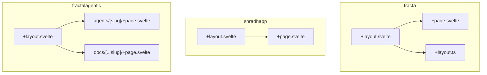
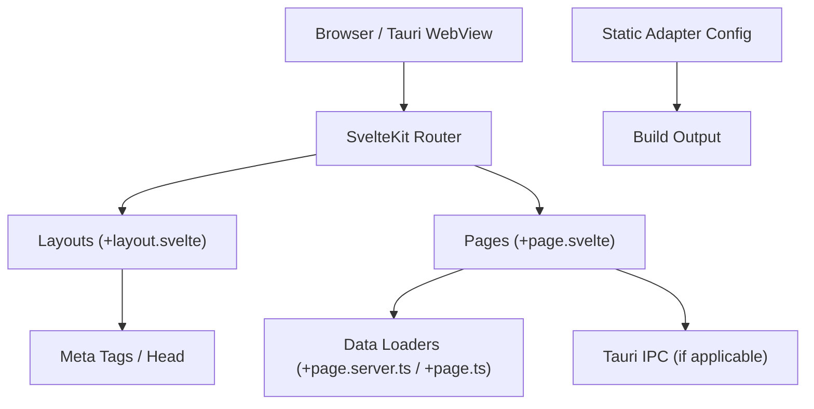
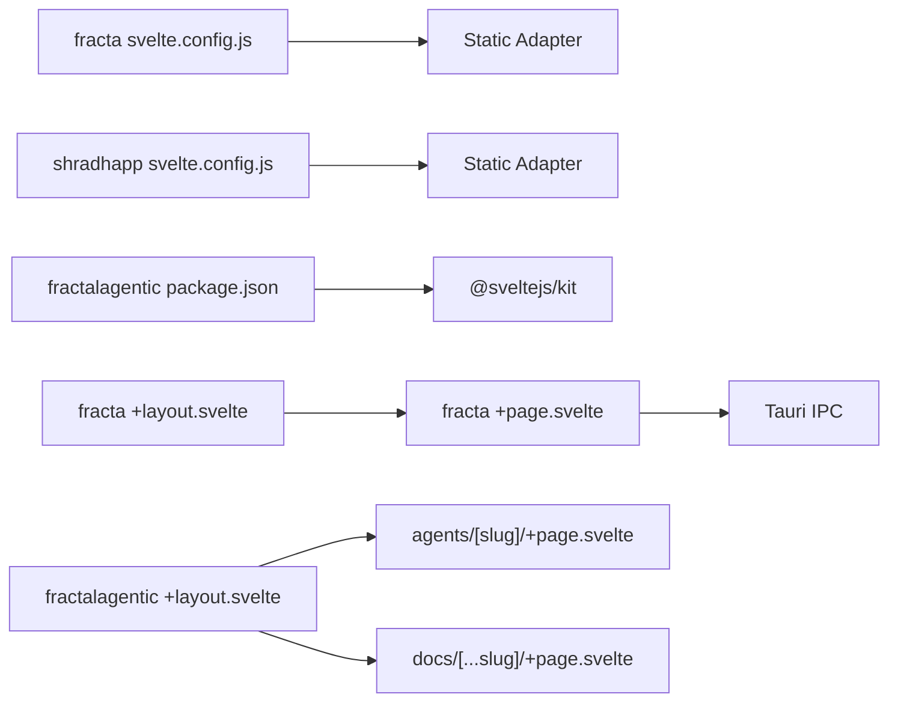

<cite>
**Referenced Files in This Document**
- [svelte.config.js](../../apps/fracta/svelte.config.js)
- [svelte.config.js](../../apps/shradhapp/svelte.config.js)
- [package.json](../../sites/fractalagentic/package.json)
- [+layout.svelte](../../apps/fracta/src/routes/+layout.svelte)
- [+page.svelte](../../apps/fracta/src/routes/+page.svelte)
- [+layout.ts](../../apps/fracta/src/routes/+layout.ts)
- [+layout.svelte](../../apps/shradhapp/src/routes/+layout.svelte)
- [+layout.svelte](../../sites/fractalagentic/src/routes/+layout.svelte)
- [+page.svelte](../../sites/fractalagentic/src/routes/agents/[slug]/+page.svelte)
- [+page.svelte](../../sites/fractalagentic/src/routes/docs/[...slug]/+page.svelte)
- [ipc.ts](../../apps/fracta/src/lib/ipc.ts)
</cite>

## Table of Contents
1. Introduction
2. Project Structure
3. Core Components
4. Architecture Overview
5. Detailed Component Analysis
6. Dependency Analysis
7. Performance Considerations
8. Troubleshooting Guide
9. Conclusion

## Introduction
This document explains SvelteKit routing and navigation patterns as implemented across the monorepo’s applications, with a focus on:
- File-based routing structure (routes folders, layouts, pages)
- Dynamic routes and catch-all segments
- Nested layouts and shared UI via layout files
- Route parameters and data loading patterns
- Client-side navigation, programmatic routing, and shallow routing
- Integration with Tauri desktop features (window management, IPC)
- Deep linking and browser history behavior
- Protected routes, lazy loading, and route-based code splitting
- SEO considerations, meta tags management, and accessibility features such as keyboard navigation and screen reader support

The examples are grounded in actual source files from the fracta, shradhapp, and fractalagentic apps within this repository.

## Project Structure
SvelteKit uses file-based routing under src/routes. Each folder maps to a URL path; +layout.svelte defines nested layouts, and +page.svelte defines page content. Data loaders can be colocated as +page.server.ts or +page.ts.

Observed patterns in this repo:
- Root layouts provide global shell, theme, and accessibility scaffolding.
- Feature folders group related routes (e.g., agents, docs).
- Dynamic routes use [param] segments; catch-all routes use [...slug].
- Static adapter configuration is set per app for SPA/static builds.

**Diagram sources**
- [+layout.svelte](../../apps/fracta/src/routes/+layout.svelte)
- [+page.svelte](../../apps/fracta/src/routes/+page.svelte)
- [+layout.ts](../../apps/fracta/src/routes/+layout.ts)
- [+layout.svelte](../../apps/shradhapp/src/routes/+layout.svelte)
- [+layout.svelte](../../sites/fractalagentic/src/routes/+layout.svelte)
- [+page.svelte](../../sites/fractalagentic/src/routes/agents/[slug]/+page.svelte)
- [+page.svelte](../../sites/fractalagentic/src/routes/docs/[...slug]/+page.svelte)

**Section sources**
- [svelte.config.js](../../apps/fracta/svelte.config.js)
- [svelte.config.js](../../apps/shradhapp/svelte.config.js)
- [package.json](../../sites/fractalagentic/package.json)

## Core Components
- Root layouts:
  - fracta root layout sets responsive width state and applies theme attributes to the document element.
  - shradhapp root layout injects global styles and a toast container.
  - fractalagentic root layout manages social meta tags, skip-to-content link, search dialog, and main content region.
- Pages:
  - fracta root page initializes workspace state and integrates Tauri window controls.
  - fractalagentic dynamic pages render content based on route parameters and metadata.

Key responsibilities:
- Layouts encapsulate shared chrome, global stores, and accessibility elements.
- Pages handle route-specific logic and rendering.
- Configuration files define build adapters and prerendering behavior.

**Section sources**
- [+layout.svelte](../../apps/fracta/src/routes/+layout.svelte)
- [+page.svelte](../../apps/fracta/src/routes/+page.svelte)
- [+layout.svelte](../../apps/shradhapp/src/routes/+layout.svelte)
- [+layout.svelte](../../sites/fractalagentic/src/routes/+layout.svelte)
- [+page.svelte](../../sites/fractalagentic/src/routes/agents/[slug]/+page.svelte)
- [+page.svelte](../../sites/fractalagentic/src/routes/docs/[...slug]/+page.svelte)

## Architecture Overview
Routing architecture combines SvelteKit’s client-side router with static/SPA deployment via the static adapter. For desktop apps, Tauri provides native window capabilities and IPC bridges.

**Diagram sources**
- [svelte.config.js](../../apps/fracta/svelte.config.js)
- [svelte.config.js](../../apps/shradhapp/svelte.config.js)
- [+layout.svelte](../../sites/fractalagentic/src/routes/+layout.svelte)
- [+page.svelte](../../apps/fracta/src/routes/+page.svelte)
- [ipc.ts](../../apps/fracta/src/lib/ipc.ts)

## Detailed Component Analysis

### File-Based Routing and Nested Layouts
- Root layouts provide consistent application shell, global styles, and accessibility hooks.
- Feature-level layouts can be added by creating additional +layout.svelte files inside route folders.
- The fractalagentic site demonstrates a rich root layout that computes Open Graph images based on current pathname and renders social meta tags.

Practical implications:
- Use nested layouts to share navigation, breadcrumbs, and common UI.
- Keep page components focused on route-specific content and data binding.

**Section sources**
- [+layout.svelte](../../apps/fracta/src/routes/+layout.svelte)
- [+layout.svelte](../../apps/shradhapp/src/routes/+layout.svelte)
- [+layout.svelte](../../sites/fractalagentic/src/routes/+layout.svelte)

### Dynamic Routes and Catch-All Segments
- Dynamic segments like [slug] enable parameterized routes.
- Catch-all segments like [...slug] allow recursive paths, ideal for documentation sites.

Examples in this repo:
- agents/[slug] displays agent detail pages using route parameters.
- docs/[...slug] renders documentation pages for arbitrary nested slugs.

Best practices:
- Validate and sanitize route parameters before use.
- Provide fallback UI when content is missing.

**Section sources**
- [+page.svelte](../../sites/fractalagentic/src/routes/agents/[slug]/+page.svelte)
- [+page.svelte](../../sites/fractalagentic/src/routes/docs/[...slug]/+page.svelte)

### Programmatic Navigation and Shallow Routing
- Standard anchor elements work out-of-the-box with SvelteKit’s client-side router.
- Programmatic navigation uses goto() from $app/navigation.
- Shallow routing updates the URL without triggering load functions via pushState/replaceState.
- Preloading strategies include hover, tap, viewport, and off modes.

Recommended patterns:
- Use goto() for non-anchor navigations (e.g., after form submission).
- Employ shallow routing for filters, tabs, and view toggles.
- Leverage preloadData() to prefetch linked resources proactively.

[No sources needed since this section provides general guidance]

### Route Parameters and Data Loading
- Route parameters are available through $page.params in SvelteKit.
- Data loaders can be colocated with pages to fetch and transform data.
- Combine params with loader functions to compute derived values safely.

Implementation tips:
- Centralize parameter parsing and validation in shared utilities.
- Cache frequently accessed data at the layout level to avoid redundant loads.

[No sources needed since this section provides general guidance]

### Protected Routes and Route Guards
- Implement guards in layout or page load functions to check authentication or permissions.
- Redirect unauthorized users using goto() with replacestate to avoid back-button issues.
- Surface meaningful error states via +error.svelte.

Common approach:
- Check session or token validity in server-side loaders for SSR protection.
- On the client, guard navigation with beforeNavigate to prevent entering protected areas.

[No sources needed since this section provides general guidance]

### Lazy Loading and Route-Based Code Splitting
- SvelteKit automatically splits code per route; each route becomes its own chunk.
- Use dynamic imports for heavy components within pages to further reduce initial bundle size.
- Combine with preloading strategies to balance performance and interactivity.

Optimization checklist:
- Identify large third-party libraries and defer their import until needed.
- Use skeleton placeholders during async operations.

[No sources needed since this section provides general guidance]

### Tauri Desktop Integration and Navigation
- The fracta app integrates Tauri for window dragging, maximizing, and IPC calls.
- IPC bridge exposes methods for workspace operations, file reading/writing, and media handling.
- Detect Tauri environment using a runtime flag to conditionally invoke native APIs.

Integration highlights:
- Window control handlers guard against non-Tauri environments.
- IPC methods return typed promises for predictable error handling.

**Section sources**
- [+page.svelte](../../apps/fracta/src/routes/+page.svelte)
- [ipc.ts](../../apps/fracta/src/lib/ipc.ts)

### Deep Linking and Browser History Management
- Anchor links and goto() update the browser history seamlessly.
- Use replacestate to avoid cluttering history for transient views.
- Ensure deep links resolve correctly by validating route parameters and providing fallbacks.

Accessibility considerations:
- Maintain focus management after navigation.
- Announce route changes to screen readers using aria-live regions where appropriate.

[No sources needed since this section provides general guidance]

### SEO and Meta Tags Management
- The fractalagentic root layout dynamically sets Open Graph and Twitter card meta tags based on the current path.
- Use svelte:head to inject title and description per page.
- Generate sitemap and search indexes during build for discoverability.

Best practices:
- Derive og:image URLs from SITE_URL to ensure absolute references.
- Include structured data for articles or documentation pages.

**Section sources**
- [+layout.svelte](../../sites/fractalagentic/src/routes/+layout.svelte)

### Accessibility Features
- Skip-to-content links improve keyboard navigation.
- Keyboard shortcuts enhance productivity (e.g., command+K for search).
- Semantic HTML and ARIA attributes support screen readers.

Implementation examples:
- Global keydown listeners trigger dialogs or actions.
- Focus management ensures logical tab order.

**Section sources**
- [+layout.svelte](../../sites/fractalagentic/src/routes/+layout.svelte)
- [+page.svelte](../../apps/fracta/src/routes/+page.svelte)

## Dependency Analysis
Routing dependencies span configuration, layouts, pages, and platform integrations.

**Diagram sources**
- [svelte.config.js](../../apps/fracta/svelte.config.js)
- [svelte.config.js](../../apps/shradhapp/svelte.config.js)
- [package.json](../../sites/fractalagentic/package.json)
- [+layout.svelte](../../apps/fracta/src/routes/+layout.svelte)
- [+page.svelte](../../apps/fracta/src/routes/+page.svelte)
- [+layout.svelte](../../sites/fractalagentic/src/routes/+layout.svelte)
- [+page.svelte](../../sites/fractalagentic/src/routes/agents/[slug]/+page.svelte)
- [+page.svelte](../../sites/fractalagentic/src/routes/docs/[...slug]/+page.svelte)
- [ipc.ts](../../apps/fracta/src/lib/ipc.ts)

**Section sources**
- [svelte.config.js](../../apps/fracta/svelte.config.js)
- [svelte.config.js](../../apps/shradhapp/svelte.config.js)
- [package.json](../../sites/fractalagentic/package.json)

## Performance Considerations
- Prefer static adapter builds for faster deployments and caching.
- Enable prerendering where possible to reduce client-side work.
- Use preload strategies judiciously to avoid over-fetching.
- Defer heavy computations and large assets until needed.

[No sources needed since this section provides general guidance]

## Troubleshooting Guide
Common issues and resolutions:
- SPA fallback not applied: Verify adapter fallback configuration matches your build output.
- Tauri IPC errors: Ensure isTauri() checks guard native calls and handle promise rejections gracefully.
- Missing meta tags: Confirm SITE_URL is defined and og:image paths resolve correctly.
- Route parameter mismatches: Validate slug formats and provide fallback UI for invalid inputs.

Debugging steps:
- Inspect network requests for failed data loaders.
- Use browser devtools to verify history entries and shallow routing state.
- Log IPC responses to identify backend errors.

**Section sources**
- [svelte.config.js](../../apps/fracta/svelte.config.js)
- [svelte.config.js](../../apps/shradhapp/svelte.config.js)
- [ipc.ts](../../apps/fracta/src/lib/ipc.ts)
- [+layout.svelte](../../sites/fractalagentic/src/routes/+layout.svelte)

## Conclusion
This repository demonstrates robust SvelteKit routing and navigation patterns across multiple apps:
- Clear separation of concerns between layouts and pages
- Effective use of dynamic and catch-all routes
- Seamless integration with Tauri for desktop capabilities
- Strong emphasis on SEO and accessibility
- Practical strategies for performance optimization

Adopt these patterns to build scalable, maintainable, and user-friendly applications.
