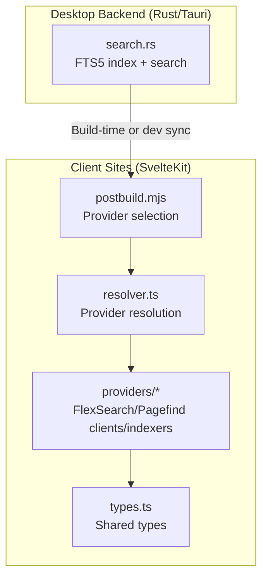
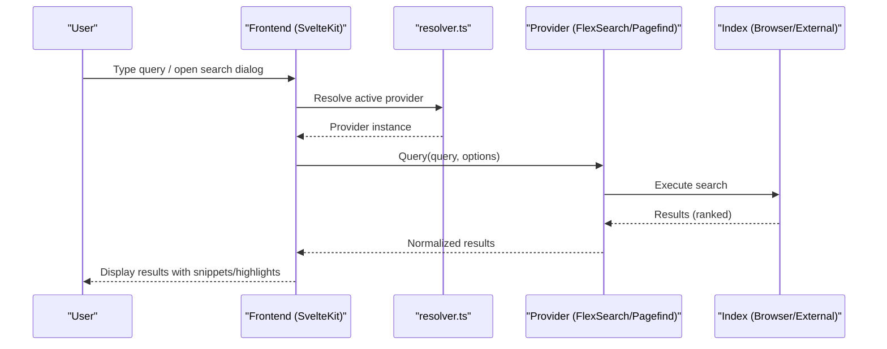
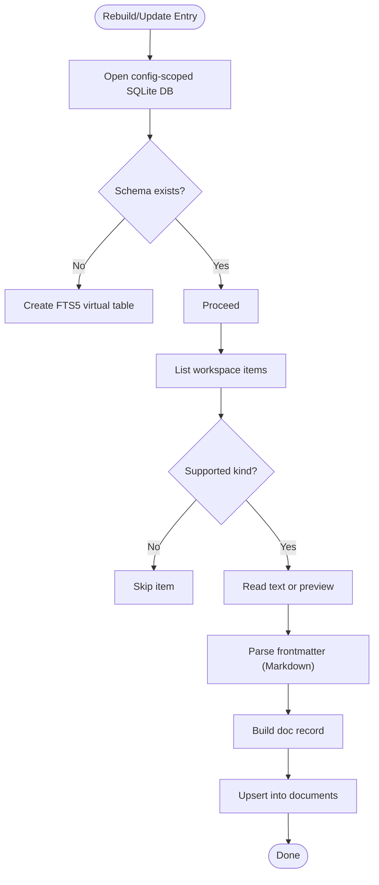
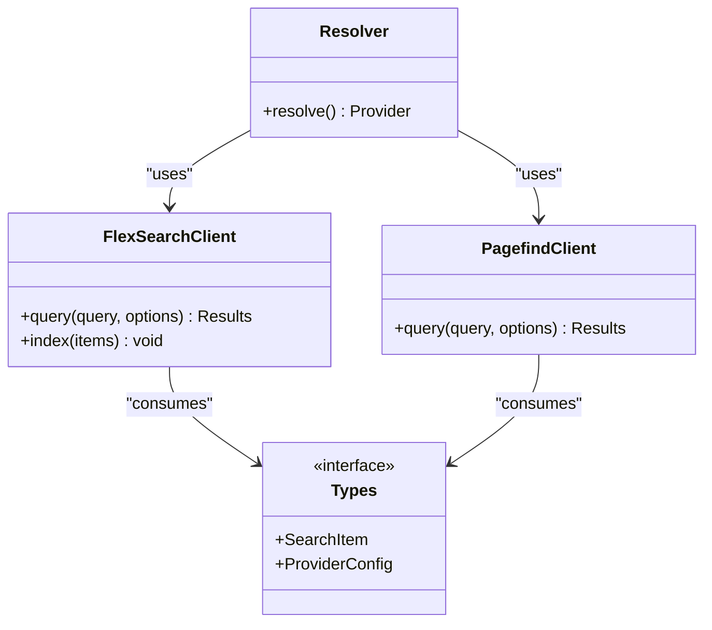
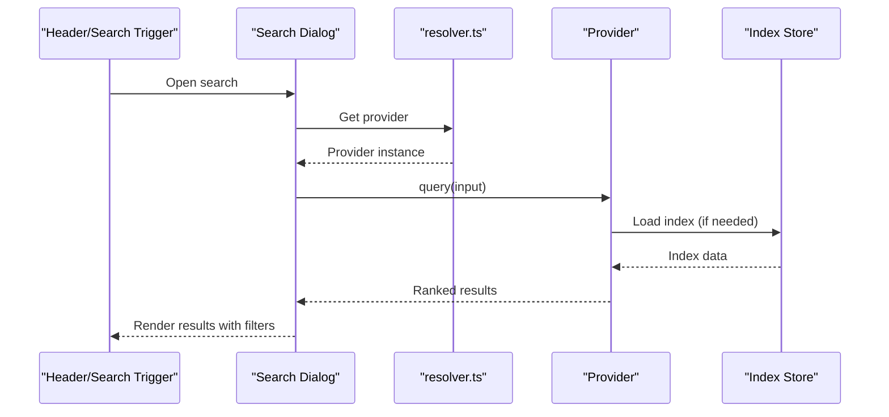
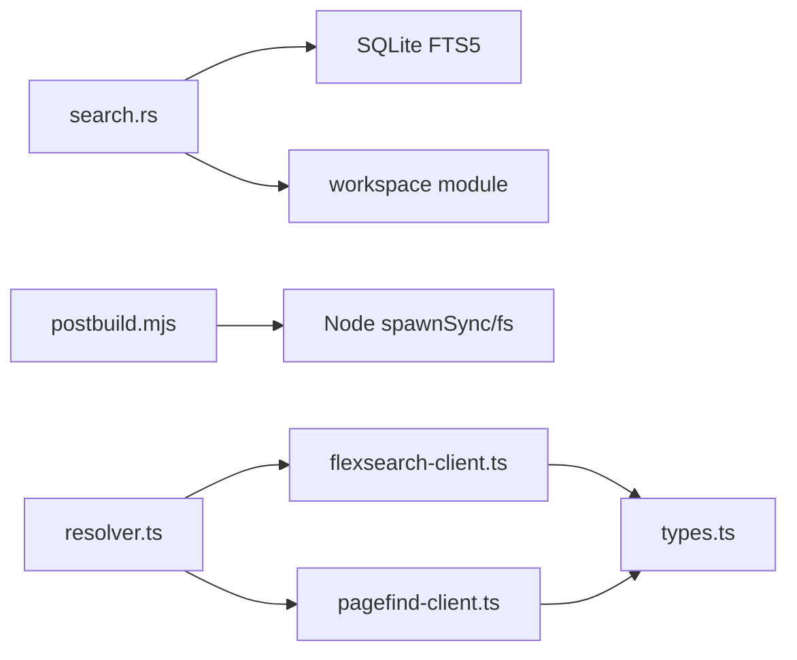

<cite>
**Referenced Files in This Document**
- [search.rs](../../apps/fracta/src-tauri/src/search.rs)
- [postbuild.mjs (fractalagentic)](../../sites/fractalagentic/scripts/search/postbuild.mjs)
- [postbuild.mjs (fractaldocs)](../../sites/fractaldocs/scripts/search/postbuild.mjs)
- [flexsearch-client.ts](../../sites/fractalagentic/src/lib/search/providers/flexsearch-client.ts)
- [flexsearch-config.ts](../../sites/fractalagentic/src/lib/search/providers/flexsearch-config.ts)
- [flexsearch-indexer.ts](../../sites/fractalagentic/src/lib/search/providers/flexsearch-indexer.ts)
- [pagefind-client.ts](../../sites/fractalagentic/src/lib/search/providers/pagefind-client.ts)
- [resolver.ts](../../sites/fractalagentic/src/lib/search/resolver.ts)
- [types.ts](../../sites/fractalagentic/src/lib/search/types.ts)
- [scan-system.json](../../sites/fractalhome/.repograph/scan-system.json)
</cite>

## Table of Contents
1. [Introduction](#introduction)
2. [Project Structure](#project-structure)
3. [Core Components](#core-components)
4. [Architecture Overview](#architecture-overview)
5. [Detailed Component Analysis](#detailed-component-analysis)
6. [Dependency Analysis](#dependency-analysis)
7. [Performance Considerations](#performance-considerations)
8. [Troubleshooting Guide](#troubleshooting-guide)
9. [Conclusion](#conclusion)
10. [Appendices](#appendices)

## Introduction
This document describes the search and indexing functionality across the repository, covering both the desktop backend index (SQLite FTS5) and the client-side search providers used by the SvelteKit sites. It explains how queries are processed, how full-text search is implemented, how indexes are built and maintained, and how results are scored and filtered. It also provides guidance on query syntax, result formats, and integration patterns with the frontend.

## Project Structure
Search-related code spans two primary areas:
- Desktop backend (Tauri/Rust): SQLite FTS5 index for vault content, exposed via functions to rebuild, update, and search.
- Client-side (SvelteKit sites): Pluggable search providers (FlexSearch, Pagefind, Orama, Typesense, Chroma) orchestrated by a postbuild script and provider resolver.

**Diagram sources**
- [search.rs:1-346](../../apps/fracta/src-tauri/src/search.rs#L1-L346)
- [postbuild.mjs (fractalagentic):1-46](../../sites/fractalagentic/scripts/search/postbuild.mjs#L1-L46)
- [postbuild.mjs (fractaldocs):1-46](../../sites/fractaldocs/scripts/search/postbuild.mjs#L1-L46)
- [resolver.ts](../../sites/fractalagentic/src/lib/search/resolver.ts)
- [types.ts](../../sites/fractalagentic/src/lib/search/types.ts)

**Section sources**
- [search.rs:1-346](../../apps/fracta/src-tauri/src/search.rs#L1-L346)
- [postbuild.mjs (fractalagentic):1-46](../../sites/fractalagentic/scripts/search/postbuild.mjs#L1-L46)
- [postbuild.mjs (fractaldocs):1-46](../../sites/fractaldocs/scripts/search/postbuild.mjs#L1-L46)

## Core Components
- Rust FTS5 indexer and searcher: Builds and maintains an SQLite FTS5 virtual table per vault, supports incremental updates, and returns ranked results with excerpts.
- Postbuild orchestrator: Selects the active search provider and runs the appropriate indexing step after Vite build.
- Provider layer: Implements FlexSearch and Pagefind clients/indexers; additional providers can be wired through the resolver.
- Shared types: Define common interfaces for search items and configuration.

Key responsibilities:
- Tokenization and query processing: FTS5 tokenizes input; client providers use their own tokenizers.
- Index maintenance: Full rebuilds and incremental updates based on filesystem events.
- Ranking and filtering: BM25 scoring in FTS5; client-side filters (e.g., chips) applied after retrieval.

**Section sources**
- [search.rs:1-346](../../apps/fracta/src-tauri/src/search.rs#L1-L346)
- [postbuild.mjs (fractalagentic):1-46](../../sites/fractalagentic/scripts/search/postbuild.mjs#L1-L46)
- [postbuild.mjs (fractaldocs):1-46](../../sites/fractaldocs/scripts/search/postbuild.mjs#L1-L46)
- [flexsearch-client.ts](../../sites/fractalagentic/src/lib/search/providers/flexsearch-client.ts)
- [flexsearch-config.ts](../../sites/fractalagentic/src/lib/search/providers/flexsearch-config.ts)
- [flexsearch-indexer.ts](../../sites/fractalagentic/src/lib/search/providers/flexsearch-indexer.ts)
- [pagefind-client.ts](../../sites/fractalagentic/src/lib/search/providers/pagefind-client.ts)
- [resolver.ts](../../sites/fractalagentic/src/lib/search/resolver.ts)
- [types.ts](../../sites/fractalagentic/src/lib/search/types.ts)

## Architecture Overview
The system supports multiple search backends:
- Desktop backend uses SQLite FTS5 for fast local full-text search over vault content.
- Web sites use a pluggable provider model to index and query content entirely in the browser (or via external services).

**Diagram sources**
- [resolver.ts](../../sites/fractalagentic/src/lib/search/resolver.ts)
- [flexsearch-client.ts](../../sites/fractalagentic/src/lib/search/providers/flexsearch-client.ts)
- [pagefind-client.ts](../../sites/fractalagentic/src/lib/search/providers/pagefind-client.ts)

## Detailed Component Analysis

### Rust FTS5 Search and Indexing
- Index schema: Virtual table documents with columns path, title, metadata, body, kind (UNINDEXED). Metadata includes parsed frontmatter fields for Markdown files.
- Rebuild: Clears and re-indexes all supported file kinds from the workspace root.
- Incremental update: Deletes affected records and re-indexes changed paths; triggers full rebuild if .fractaignore changes or root-relative path issues occur.
- Search: Uses FTS5 MATCH with a tokenizer that splits on whitespace and applies prefix matching per term; returns top results with snippet excerpts and BM25 scores.
- Scoring: BM25 parameters tuned in the query; higher score indicates better relevance.

**Diagram sources**
- [search.rs:24-86](../../apps/fracta/src-tauri/src/search.rs#L24-L86)
- [search.rs:88-155](../../apps/fracta/src-tauri/src/search.rs#L88-L155)
- [search.rs:195-219](../../apps/fracta/src-tauri/src/search.rs#L195-L219)

Query processing details:
- Tokenization: Terms split by whitespace; each term wrapped with quotes and a wildcard suffix to enable prefix matching.
- Ranking: BM25 with fixed weights; results ordered by descending score and limited to a fixed count.
- Excerpts: Snippets generated around matches with custom markers.

Result format:
- Fields include path, title, excerpt, kind, and score.

Integration notes:
- The database file is stored under a config directory scoped to the vault root using a hash of the canonical root path, ensuring isolation per vault.

**Section sources**
- [search.rs:15-22](../../apps/fracta/src-tauri/src/search.rs#L15-L22)
- [search.rs:24-36](../../apps/fracta/src-tauri/src/search.rs#L24-L36)
- [search.rs:42-86](../../apps/fracta/src-tauri/src/search.rs#L42-L86)
- [search.rs:88-155](../../apps/fracta/src-tauri/src/search.rs#L88-L155)
- [search.rs:157-193](../../apps/fracta/src-tauri/src/search.rs#L157-L193)
- [search.rs:195-219](../../apps/fracta/src-tauri/src/search.rs#L195-L219)
- [search.rs:221-227](../../apps/fracta/src-tauri/src/search.rs#L221-L227)

### Client-Side Search Providers (FlexSearch and Pagefind)
Providers are selected at build time via environment variables and executed by a postbuild script. The resolver abstracts provider instantiation, while typed contracts ensure consistent interfaces.

Postbuild orchestration:
- Reads PUBLIC_SVOCS_SEARCH_PROVIDER to choose provider.
- For pagefind, runs the pagefind CLI against the build output and mirrors assets into preview output.
- For flexsearch/orama, assumes index is already built during Vite build.
- Supports additional providers (typesense, chroma) via separate scripts.

Provider resolution:
- Central resolver selects the correct provider implementation based on configuration.
- Clients expose a unified query interface returning normalized results.

Types:
- Shared types define structures for search items and provider configurations.

**Diagram sources**
- [resolver.ts](../../sites/fractalagentic/src/lib/search/resolver.ts)
- [flexsearch-client.ts](../../sites/fractalagentic/src/lib/search/providers/flexsearch-client.ts)
- [pagefind-client.ts](../../sites/fractalagentic/src/lib/search/providers/pagefind-client.ts)
- [types.ts](../../sites/fractalagentic/src/lib/search/types.ts)

**Section sources**
- [postbuild.mjs (fractalagentic):1-46](../../sites/fractalagentic/scripts/search/postbuild.mjs#L1-L46)
- [postbuild.mjs (fractaldocs):1-46](../../sites/fractaldocs/scripts/search/postbuild.mjs#L1-L46)
- [resolver.ts](../../sites/fractalagentic/src/lib/search/resolver.ts)
- [types.ts](../../sites/fractalagentic/src/lib/search/types.ts)
- [flexsearch-client.ts](../../sites/fractalagentic/src/lib/search/providers/flexsearch-client.ts)
- [flexsearch-config.ts](../../sites/fractalagentic/src/lib/search/providers/flexsearch-config.ts)
- [flexsearch-indexer.ts](../../sites/fractalagentic/src/lib/search/providers/flexsearch-indexer.ts)
- [pagefind-client.ts](../../sites/fractalagentic/src/lib/search/providers/pagefind-client.ts)

### Frontend Integration Patterns
- Search dialog component integrates with the chosen provider via the resolver.
- Queries are sent to the provider; results are displayed with highlights/snippets where available.
- Filtering chips allow narrowing results by category/bank after retrieval.

[No sources needed since this diagram shows conceptual workflow, not actual code structure]

## Dependency Analysis
- Rust backend depends on rusqlite and workspace utilities to list/read files and parse frontmatter.
- Client-side providers depend on shared types and configuration; postbuild script depends on Node.js child process and filesystem APIs.
- The scan system captures runtime flows including search interactions and provider usage.

**Diagram sources**
- [search.rs:1-346](../../apps/fracta/src-tauri/src/search.rs#L1-L346)
- [postbuild.mjs (fractalagentic):1-46](../../sites/fractalagentic/scripts/search/postbuild.mjs#L1-L46)
- [resolver.ts](../../sites/fractalagentic/src/lib/search/resolver.ts)
- [flexsearch-client.ts](../../sites/fractalagentic/src/lib/search/providers/flexsearch-client.ts)
- [pagefind-client.ts](../../sites/fractalagentic/src/lib/search/providers/pagefind-client.ts)
- [types.ts](../../sites/fractalagentic/src/lib/search/types.ts)

**Section sources**
- [scan-system.json:220-235](../../sites/fractalhome/.repograph/scan-system.json#L220-L235)
- [scan-system.json:296-302](../../sites/fractalhome/.repograph/scan-system.json#L296-L302)

## Performance Considerations
- FTS5 indexing:
  - Use incremental updates to avoid full rebuilds when possible; only affected paths are re-indexed unless ignore files change.
  - BM25 tuning balances precision/recall; adjust weights if necessary.
  - Limit result set size to reduce payload and rendering cost.
- Client-side providers:
  - FlexSearch builds indices during Vite build; keep index size manageable by selecting relevant fields.
  - Pagefind requires mirroring assets for preview environments; ensure build outputs are correctly served.
  - Debounce user input to minimize repeated queries.
- General:
  - Cache indices in memory for interactive sessions.
  - Preload indices on idle to reduce first-query latency.

[No sources needed since this section provides general guidance]

## Troubleshooting Guide
Common issues and resolutions:
- Empty results after initial search:
  - Ensure the index has been rebuilt; the searcher will auto-rebuild if the index is empty.
- Stale results after renames/deletes:
  - Use the incremental update function to remove stale entries; verify .fractaignore edits trigger full rebuilds.
- Preview environment missing index:
  - For pagefind, mirror the index into the preview client directory after build.
- Unknown provider error:
  - Validate PUBLIC_SVOCS_SEARCH_PROVIDER value; supported values include pagefind, orama, flexsearch, typesense, chroma.

**Section sources**
- [search.rs:157-193](../../apps/fracta/src-tauri/src/search.rs#L157-L193)
- [search.rs:42-86](../../apps/fracta/src-tauri/src/search.rs#L42-L86)
- [postbuild.mjs (fractalagentic):16-30](../../sites/fractalagentic/scripts/search/postbuild.mjs#L16-L30)
- [postbuild.mjs (fractaldocs):16-30](../../sites/fractaldocs/scripts/search/postbuild.mjs#L16-L30)

## Conclusion
The search and indexing subsystem combines a robust desktop backend with flexible client-side providers. The Rust FTS5 engine offers efficient local full-text search with strong ranking and incremental maintenance, while the SvelteKit sites support multiple providers for browser-based search experiences. By following the integration patterns and performance recommendations outlined here, you can implement responsive, accurate search features tailored to your application’s needs.

## Appendices

### Query Syntax and Examples
- Desktop FTS5:
  - Term splitting on whitespace; prefix matching enabled per term.
  - Example queries:
    - Single term: native ferns
    - Multi-term: garden plan tags
- Client providers:
  - FlexSearch: Supports substring and fuzzy matching depending on configuration.
  - Pagefind: Natural language queries with phrase support.

[No sources needed since this section provides general guidance]

### Result Formats
- Desktop FTS5 result fields:
  - path: relative file path within the vault
  - title: extracted or inferred title
  - excerpt: highlighted snippet around matches
  - kind: file type (Markdown, Text, Csv, Json, Pdf, Docx)
  - score: BM25 relevance score
- Client providers:
  - Normalized result objects defined in shared types; may include title, url, snippet, and metadata.

**Section sources**
- [search.rs:15-22](../../apps/fracta/src-tauri/src/search.rs#L15-L22)
- [types.ts](../../sites/fractalagentic/src/lib/search/types.ts)

### Index Maintenance Strategies
- Full rebuild:
  - Clear and re-index all supported files from the workspace root.
- Incremental updates:
  - Delete affected records and re-index changed paths; full rebuild on ignore file changes.
- Build-time indexing:
  - Postbuild script runs provider-specific indexing steps after Vite build.

**Section sources**
- [search.rs:24-36](../../apps/fracta/src-tauri/src/search.rs#L24-L36)
- [search.rs:42-86](../../apps/fracta/src-tauri/src/search.rs#L42-L86)
- [postbuild.mjs (fractalagentic):26-45](../../sites/fractalagentic/scripts/search/postbuild.mjs#L26-L45)
- [postbuild.mjs (fractaldocs):26-45](../../sites/fractaldocs/scripts/search/postbuild.mjs#L26-L45)
