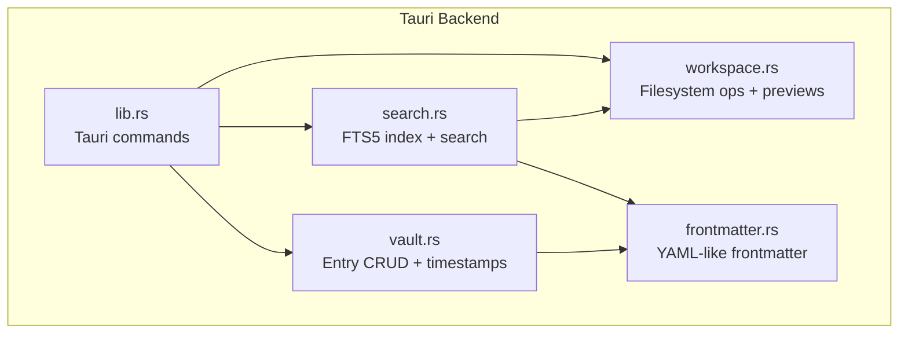
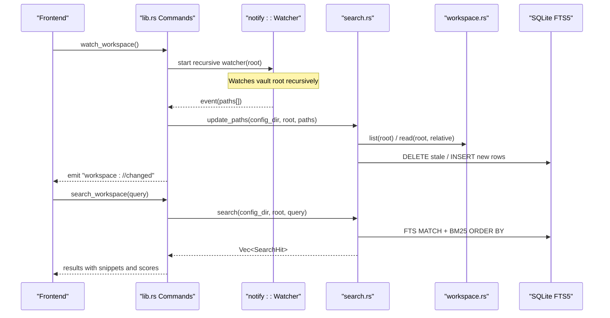
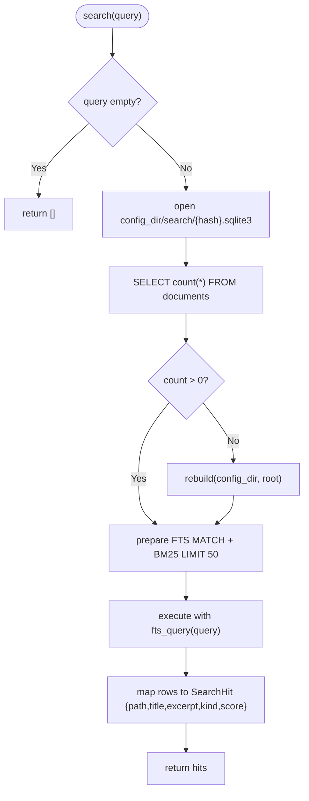
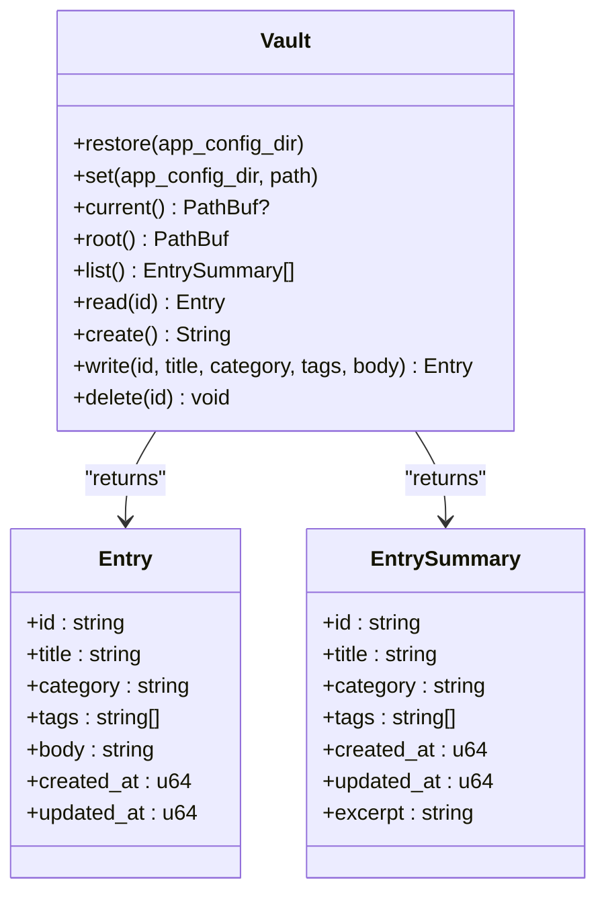
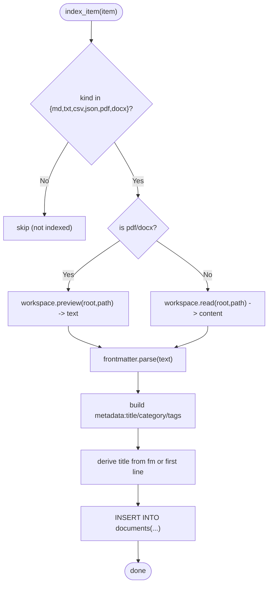
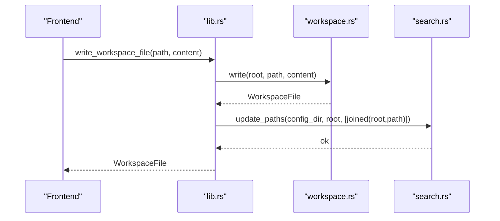
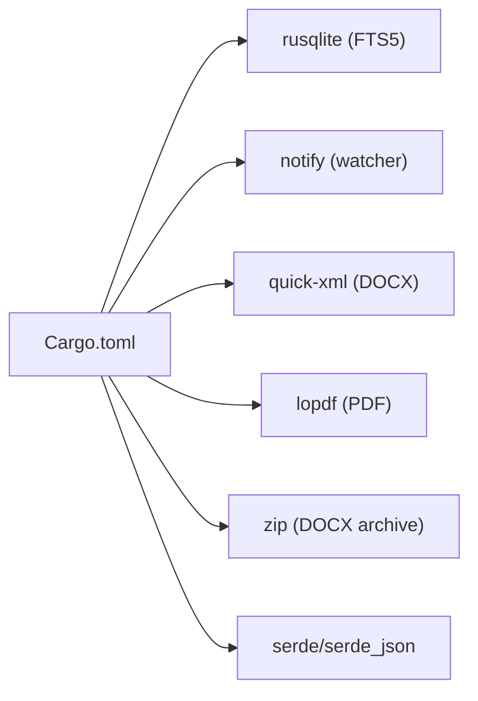

<cite>
**Referenced Files in This Document**
- [search.rs](../../apps/fracta/src-tauri/src/search.rs)
- [vault.rs](../../apps/fracta/src-tauri/src/vault.rs)
- [workspace.rs](../../apps/fracta/src-tauri/src/workspace.rs)
- [frontmatter.rs](../../apps/fracta/src-tauri/src/frontmatter.rs)
- [lib.rs](../../apps/fracta/src-tauri/src/lib.rs)
- [Cargo.toml](../../apps/fracta/src-tauri/Cargo.toml)
</cite>

## Table of Contents
1. Introduction
2. Project Structure
3. Core Components
4. Architecture Overview
5. Detailed Component Analysis
6. Dependency Analysis
7. Performance Considerations
8. Troubleshooting Guide
9. Conclusion

## Introduction
This document explains Fracta’s search and indexing system for vault entries. It covers how the system indexes content from a user’s vault folder, performs full-text search across titles, categories, tags, and body text, processes queries, ranks results, and keeps the index synchronized with real-time file changes. It also documents performance optimizations for large vaults, caching strategies, example queries, result formatting, and troubleshooting guidance.

## Project Structure
The search subsystem is implemented in Rust within the Tauri backend and integrates with the vault and workspace modules:
- search.rs implements an SQLite FTS5 index per vault, rebuild/update logic, query processing, and ranking via BM25.
- vault.rs manages entry files (Markdown), frontmatter parsing/serialization, and entry lifecycle operations.
- workspace.rs provides safe, recursive filesystem operations, content reading, preview extraction for PDF/DOCX, and encoding handling.
- frontmatter.rs parses and serializes YAML-like frontmatter fields used by search metadata.
- lib.rs exposes Tauri commands that wire the frontend to search, rebuild, and watch functionality.

**Diagram sources**
- [lib.rs:430-498](../../apps/fracta/src-tauri/src/lib.rs#L430-L498)
- [search.rs:1-346](../../apps/fracta/src-tauri/src/search.rs#L1-L346)
- [vault.rs:1-495](../../apps/fracta/src-tauri/src/vault.rs#L1-L495)
- [workspace.rs:1-800](../../apps/fracta/src-tauri/src/workspace.rs#L1-L800)
- [frontmatter.rs:1-425](../../apps/fracta/src-tauri/src/frontmatter.rs#L1-L425)

**Section sources**
- [lib.rs:430-498](../../apps/fracta/src-tauri/src/lib.rs#L430-L498)
- [search.rs:1-346](../../apps/fracta/src-tauri/src/search.rs#L1-L346)
- [vault.rs:1-495](../../apps/fracta/src-tauri/src/vault.rs#L1-L495)
- [workspace.rs:1-800](../../apps/fracta/src-tauri/src/workspace.rs#L1-L800)
- [frontmatter.rs:1-425](../../apps/fracta/src-tauri/src/frontmatter.rs#L1-L425)

## Core Components
- SQLite FTS5 virtual table “documents” stores path, title, metadata, body, and kind. The database lives under the app config directory, not the vault, keeping content portable.
- Rebuild scans the entire workspace and inserts indexed rows for supported file kinds.
- Incremental update handles create/rename/delete events, removing stale records and re-indexing affected items.
- Query processing tokenizes input into quoted prefix terms joined by AND; BM25 scoring returns ranked results with snippet excerpts.
- Vault integration ensures entries are created, updated, and deleted on disk; search updates are triggered by file watchers and explicit write commands.

Key data structures:
- SearchHit: path, title, excerpt, kind, score.
- WorkspaceItem: path, name, kind, size, modified_at.
- Document/Meta: parsed frontmatter fields used as searchable metadata.

**Section sources**
- [search.rs:15-22](../../apps/fracta/src-tauri/src/search.rs#L15-L22)
- [search.rs:24-36](../../apps/fracta/src-tauri/src/search.rs#L24-L36)
- [search.rs:42-86](../../apps/fracta/src-tauri/src/search.rs#L42-L86)
- [search.rs:157-193](../../apps/fracta/src-tauri/src/search.rs#L157-L193)
- [workspace.rs:34-41](../../apps/fracta/src-tauri/src/workspace.rs#L34-L41)
- [frontmatter.rs:10-30](../../apps/fracta/src-tauri/src/frontmatter.rs#L10-L30)

## Architecture Overview
The search pipeline combines filesystem scanning, content extraction, and SQLite FTS5 indexing. Real-time updates are driven by OS-level file watchers.

**Diagram sources**
- [lib.rs:137-165](../../apps/fracta/src-tauri/src/lib.rs#L137-L165)
- [lib.rs:331-342](../../apps/fracta/src-tauri/src/lib.rs#L331-L342)
- [search.rs:42-86](../../apps/fracta/src-tauri/src/search.rs#L42-L86)
- [search.rs:157-193](../../apps/fracta/src-tauri/src/search.rs#L157-L193)
- [workspace.rs:175-181](../../apps/fracta/src-tauri/src/workspace.rs#L175-L181)

## Detailed Component Analysis

### Search Index Engine (search.rs)
Responsibilities:
- Open or create a per-vault SQLite FTS5 database under the app config directory.
- Full rebuild: delete all rows, scan workspace, parse content/metadata, insert into FTS5.
- Incremental update: handle rename/delete/create by deleting affected rows and re-indexing changed items; triggers full rebuild if .fractaignore changes or root is touched.
- Query processing: tokenize input into quoted prefix terms joined by AND; execute FTS MATCH with BM25 scoring; return top 50 hits with snippet excerpts.

Index schema and storage:
- Virtual table “documents” columns: path, title, metadata, body, kind (UNINDEXED).
- Database path derived from hashing the canonical vault root to isolate indices per vault.

Query processing and ranking:
- fts_query splits on whitespace, wraps each term in quotes with a trailing wildcard, joins with AND.
- BM25 parameters tuned in SQL call; snippet generation highlights matches.

Performance characteristics:
- Incremental updates avoid full rescans unless necessary.
- FTS5 leverages inverted indexes for fast matching.
- Limit clause caps result set size.

**Diagram sources**
- [search.rs:157-193](../../apps/fracta/src-tauri/src/search.rs#L157-L193)
- [search.rs:24-36](../../apps/fracta/src-tauri/src/search.rs#L24-L36)
- [search.rs:221-227](../../apps/fracta/src-tauri/src/search.rs#L221-L227)

**Section sources**
- [search.rs:195-219](../../apps/fracta/src-tauri/src/search.rs#L195-L219)
- [search.rs:24-36](../../apps/fracta/src-tauri/src/search.rs#L24-L36)
- [search.rs:42-86](../../apps/fracta/src-tauri/src/search.rs#L42-L86)
- [search.rs:157-193](../../apps/fracta/src-tauri/src/search.rs#L157-L193)
- [search.rs:221-227](../../apps/fracta/src-tauri/src/search.rs#L221-L227)

### Vault Integration (vault.rs)
Responsibilities:
- Manage vault folder selection and persistence.
- Create/read/write/delete Markdown entries with frontmatter.
- Derive titles when blank; compute created_at/updated_at timestamps.

Integration points with search:
- Writes trigger search updates through Tauri command wiring.
- Deletions remove files; subsequent watcher events cause incremental index updates.

**Diagram sources**
- [vault.rs:22-54](../../apps/fracta/src-tauri/src/vault.rs#L22-L54)
- [vault.rs:128-189](../../apps/fracta/src-tauri/src/vault.rs#L128-L189)
- [vault.rs:193-267](../../apps/fracta/src-tauri/src/vault.rs#L193-L267)

**Section sources**
- [vault.rs:73-111](../../apps/fracta/src-tauri/src/vault.rs#L73-L111)
- [vault.rs:128-189](../../apps/fracta/src-tauri/src/vault.rs#L128-L189)
- [vault.rs:193-267](../../apps/fracta/src-tauri/src/vault.rs#L193-L267)

### Workspace Operations (workspace.rs)
Responsibilities:
- Safe recursive listing with ignore patterns (.fractaignore).
- Read text files with encoding detection (UTF-8, UTF-8 BOM, UTF-16LE/BE).
- Preview extraction for PDF and DOCX to obtain searchable text.
- Asset accessors for images/media with strict validation.

Relevance to search:
- Provides content for indexing (text, CSV, JSON, Markdown) and preview text for binary formats (PDF, DOCX).
- Ensures vault containment and prevents traversal outside the selected root.

**Diagram sources**
- [search.rs:88-155](../../apps/fracta/src-tauri/src/search.rs#L88-L155)
- [workspace.rs:257-285](../../apps/fracta/src-tauri/src/workspace.rs#L257-L285)
- [workspace.rs:687-767](../../apps/fracta/src-tauri/src/workspace.rs#L687-L767)
- [frontmatter.rs:145-178](../../apps/fracta/src-tauri/src/frontmatter.rs#L145-L178)

**Section sources**
- [workspace.rs:175-181](../../apps/fracta/src-tauri/src/workspace.rs#L175-L181)
- [workspace.rs:257-285](../../apps/fracta/src-tauri/src/workspace.rs#L257-L285)
- [workspace.rs:687-767](../../apps/fracta/src-tauri/src/workspace.rs#L687-L767)

### Frontmatter Parsing (frontmatter.rs)
Responsibilities:
- Parse minimal YAML-like frontmatter for title, category, tags, created_at, updated_at.
- Serialize back to file with quoting rules to preserve special characters.
- Derive titles from first meaningful line when blank.

Relevance to search:
- Metadata fields are concatenated into a single searchable metadata column during indexing.

**Section sources**
- [frontmatter.rs:10-30](../../apps/fracta/src-tauri/src/frontmatter.rs#L10-L30)
- [frontmatter.rs:145-178](../../apps/fracta/src-tauri/src/frontmatter.rs#L145-L178)
- [frontmatter.rs:210-238](../../apps/fracta/src-tauri/src/frontmatter.rs#L210-L238)
- [frontmatter.rs:258-290](../../apps/fracta/src-tauri/src/frontmatter.rs#L258-L290)

### Tauri Command Wiring (lib.rs)
Responsibilities:
- Expose commands for vault operations, workspace operations, search, and rebuild.
- Start a recursive file watcher; on events, call search::update_paths and emit change events.
- On write_workspace_file, perform write then update search index.

**Diagram sources**
- [lib.rs:278-288](../../apps/fracta/src-tauri/src/lib.rs#L278-L288)
- [lib.rs:137-165](../../apps/fracta/src-tauri/src/lib.rs#L137-L165)
- [search.rs:42-86](../../apps/fracta/src-tauri/src/search.rs#L42-L86)

**Section sources**
- [lib.rs:137-165](../../apps/fracta/src-tauri/src/lib.rs#L137-L165)
- [lib.rs:278-288](../../apps/fracta/src-tauri/src/lib.rs#L278-L288)
- [lib.rs:331-342](../../apps/fracta/src-tauri/src/lib.rs#L331-L342)

## Dependency Analysis
- External dependencies relevant to search/indexing:
  - rusqlite (bundled): SQLite driver enabling FTS5 virtual tables.
  - notify: OS-level file watching for incremental updates.
  - quick-xml, lopdf, zip: Used by workspace preview for DOCX/PDF text extraction.
  - serde/serde_json: Serialization/deserialization for structured data.

**Diagram sources**
- [Cargo.toml:17-29](../../apps/fracta/src-tauri/Cargo.toml#L17-L29)

**Section sources**
- [Cargo.toml:17-29](../../apps/fracta/src-tauri/Cargo.toml#L17-L29)

## Performance Considerations
- Index storage isolation: Per-vault SQLite file under app config avoids cross-vault interference and simplifies cleanup.
- Incremental updates: update_paths deletes only affected rows and re-indexes changed items; full rebuild occurs only on .fractaignore edits or root changes.
- FTS5 efficiency: Inverted indexes provide fast full-text matching; BM25 ranking computed in SQL reduces post-processing overhead.
- Result limiting: Queries cap at 50 results to bound payload size and rendering cost.
- Content extraction: PDF/DOCX preview extracts text locally without exposing host paths; large media assets are guarded by size limits elsewhere in workspace.
- Encoding safety: Text encodings are detected and preserved; invalid encodings are rejected to prevent corruption.

[No sources needed since this section provides general guidance]

## Troubleshooting Guide
Common issues and resolutions:
- Empty search results after initial use:
  - Cause: Index may be missing or empty.
  - Resolution: Trigger rebuild_workspace_index; ensure vault is configured and contains indexed files.
- Stale results after renaming/deleting files:
  - Cause: File watcher missed events or batched events out-of-order.
  - Resolution: Ensure watch_workspace is active; verify update_paths is called; if .fractaignore changed, expect full rebuild.
- Slow searches on large vaults:
  - Cause: Large number of indexed documents or heavy content extraction.
  - Resolution: Use targeted queries; rely on FTS5; consider excluding non-indexable kinds via ignore patterns.
- Unexpected full rebuilds:
  - Cause: Editing .fractaignore or touching root path triggers rebuild.
  - Resolution: Avoid editing .fractaignore frequently; batch changes where possible.
- Unicode/encoding problems:
  - Cause: Non-UTF-8 files with unsupported encodings cannot be edited safely.
  - Resolution: Convert files to UTF-8 or UTF-8 BOM/UTF-16 with proper BOM; editor will reject unsafe encodings.

**Section sources**
- [search.rs:42-86](../../apps/fracta/src-tauri/src/search.rs#L42-L86)
- [search.rs:157-193](../../apps/fracta/src-tauri/src/search.rs#L157-L193)
- [workspace.rs:470-512](../../apps/fracta/src-tauri/src/workspace.rs#L470-L512)

## Conclusion
Fracta’s search and indexing system delivers fast, accurate full-text search over vault entries using SQLite FTS5 with BM25 ranking. It balances correctness and performance through incremental updates, robust content extraction, and safe filesystem operations. The design keeps derived state (the index) separate from user content, ensuring portability and resilience. With real-time synchronization via file watchers and clear upgrade paths for schema changes, the system scales well for large vaults while remaining simple and maintainable.
