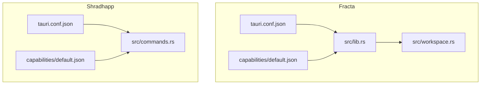
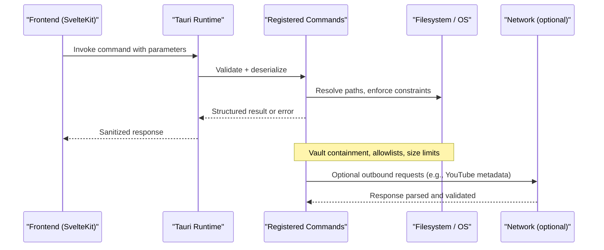
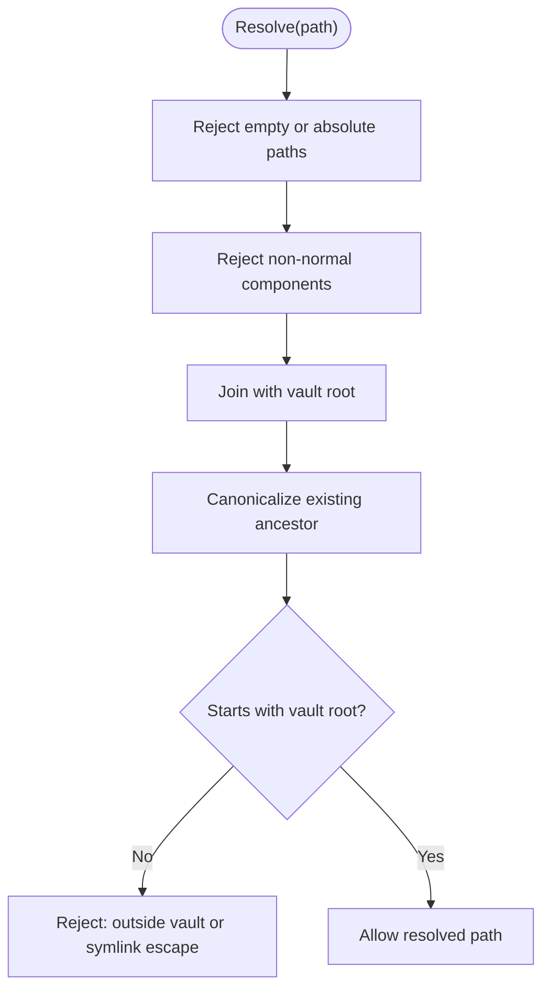
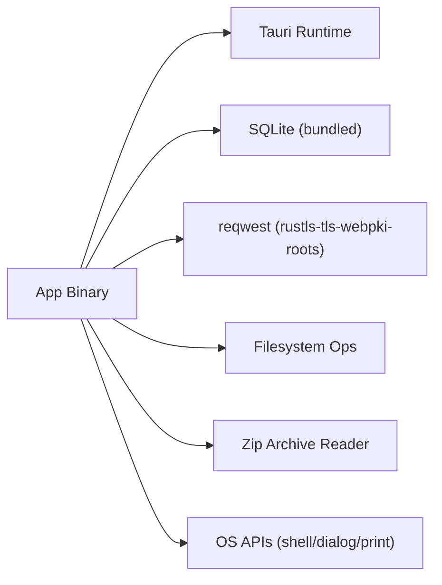

<cite>
**Referenced Files in This Document**
- [fracta tauri.conf.json](../../apps/fracta/src-tauri/tauri.conf.json)
- [fracta default capability](../../apps/fracta/src-tauri/capabilities/default.json)
- [shradhapp tauri.conf.json](../../apps/shradhapp/src-tauri/tauri.conf.json)
- [shradhapp default capability](../../apps/shradhapp/src-tauri/capabilities/default.json)
- [fracta lib.rs](../../apps/fracta/src-tauri/src/lib.rs)
- [fracta workspace.rs](../../apps/fracta/src-tauri/src/workspace.rs)
- [shradhapp commands.rs](../../apps/shradhapp/src-tauri/src/commands.rs)
- [fracta Cargo.toml](../../apps/fracta/src-tauri/Cargo.toml)
- [shradhapp Cargo.toml](../../apps/shradhapp/src-tauri/Cargo.toml)
</cite>

## Table of Contents
1. Introduction
2. Project Structure
3. Core Components
4. Architecture Overview
5. Detailed Component Analysis
6. Dependency Analysis
7. Performance Considerations
8. Troubleshooting Guide
9. Conclusion

## Introduction
This document provides a comprehensive security guide for the Tauri applications in this repository. It focuses on capability-based permissions, command whitelisting, input validation, secure file access patterns, data encryption at rest considerations, and protection against common vulnerabilities such as path traversal and injection attacks. It also includes examples of secure command implementations, error sanitization, logging best practices, cross-platform differences, sandboxing limitations, and practical audit procedures for desktop applications.

## Project Structure
Two Tauri applications are present:
- Fracta: A vault/workspace editor with rich file operations and a terminal-like command runner.
- Shradhapp: A media-focused app with import, processing, and export workflows.

Key configuration and capability files define the security posture:
- CSP and asset protocol settings in tauri.conf.json
- Capability definitions in capabilities/default.json
- Rust backend entry points and command registrations in src/lib.rs and src/commands.rs
- Dependencies declared in Cargo.toml

**Diagram sources**
- [fracta tauri.conf.json:1-48](../../apps/fracta/src-tauri/tauri.conf.json#L1-L48)
- [fracta default capability:1-15](../../apps/fracta/src-tauri/capabilities/default.json#L1-L15)
- [fracta lib.rs:430-498](../../apps/fracta/src-tauri/src/lib.rs#L430-L498)
- [fracta workspace.rs:143-173](../../apps/fracta/src-tauri/src/workspace.rs#L143-L173)
- [shradhapp tauri.conf.json:1-44](../../apps/shradhapp/src-tauri/tauri.conf.json#L1-L44)
- [shradhapp default capability:1-18](../../apps/shradhapp/src-tauri/capabilities/default.json#L1-L18)
- [shradhapp commands.rs:1-120](../../apps/shradhapp/src-tauri/src/commands.rs#L1-L120)

**Section sources**
- [fracta tauri.conf.json:1-48](../../apps/fracta/src-tauri/tauri.conf.json#L1-L48)
- [fracta default capability:1-15](../../apps/fracta/src-tauri/capabilities/default.json#L1-L15)
- [shradhapp tauri.conf.json:1-44](../../apps/shradhapp/src-tauri/tauri.conf.json#L1-L44)
- [shradhapp default capability:1-18](../../apps/shradhapp/src-tauri/capabilities/default.json#L1-L18)

## Core Components
- Capability-based permissions: Each app declares minimal required permissions per window to reduce attack surface.
- Command whitelisting: Only explicitly registered Tauri commands are exposed to the frontend.
- Secure file access: Path resolution enforces vault containment, symlink checks, and extension allowlists.
- Input validation: Strict parsing and normalization for JSON, CSV, user-provided names, and base64 payloads.
- Process execution controls: Terminal commands run with timeouts, bounded output, and restricted shells.

**Section sources**
- [fracta default capability:1-15](../../apps/fracta/src-tauri/capabilities/default.json#L1-L15)
- [shradhapp default capability:1-18](../../apps/shradhapp/src-tauri/capabilities/default.json#L1-L18)
- [fracta lib.rs:454-494](../../apps/fracta/src-tauri/src/lib.rs#L454-L494)
- [fracta workspace.rs:143-173](../../apps/fracta/src-tauri/src/workspace.rs#L143-L173)
- [shradhapp commands.rs:229-252](../../apps/shradhapp/src-tauri/src/commands.rs#L229-L252)

## Architecture Overview
The Tauri architecture separates the webview (frontend) from the native backend (Rust). The frontend invokes commands via the Tauri IPC channel; the backend validates inputs, performs operations under strict policies, and returns sanitized results.

**Diagram sources**
- [fracta lib.rs:454-494](../../apps/fracta/src-tauri/src/lib.rs#L454-L494)
- [fracta workspace.rs:143-173](../../apps/fracta/src-tauri/src/workspace.rs#L143-L173)
- [shradhapp commands.rs:584-589](../../apps/shradhapp/src-tauri/src/commands.rs#L584-L589)

## Detailed Component Analysis

### Capability-Based Permissions
- Fracta grants core window management and state persistence features only.
- Shradhapp adds dialog and webview defaults for file selection and messaging.

Recommendations:
- Keep capabilities scoped to specific windows.
- Remove unused permissions regularly.
- Prefer explicit allow-lists over broad defaults.

**Section sources**
- [fracta default capability:1-15](../../apps/fracta/src-tauri/capabilities/default.json#L1-L15)
- [shradhapp default capability:1-18](../../apps/shradhapp/src-tauri/capabilities/default.json#L1-L18)

### Command Whitelisting
- All commands must be explicitly listed in the handler registration.
- Avoid dynamic command exposure; use typed structs for request/response.

Secure implementation patterns observed:
- Explicit function signatures with typed parameters.
- Centralized registration list to prevent accidental exposure.

**Section sources**
- [fracta lib.rs:454-494](../../apps/fracta/src-tauri/src/lib.rs#L454-L494)

### Secure File Access Patterns
- Path resolution enforces:
  - Non-empty, project-relative paths
  - No path traversal components
  - Symlink containment within the selected root
- Asset reading is constrained by allowed extensions and MIME types.
- Media assets include size limits to avoid memory exhaustion.

**Diagram sources**
- [fracta workspace.rs:143-173](../../apps/fracta/src-tauri/src/workspace.rs#L143-L173)

**Section sources**
- [fracta workspace.rs:143-173](../../apps/fracta/src-tauri/src/workspace.rs#L143-L173)
- [fracta workspace.rs:290-364](../../apps/fracta/src-tauri/src/workspace.rs#L290-L364)

### Input Validation Strategies
- JSON writes are validated before persisting.
- CSV content is validated for quotes and delimiter consistency.
- User-provided filenames are sanitized to safe characters and length-limited.
- Base64 payloads are decoded with error handling and size checks.

Examples:
- JSON parse validation on write.
- CSV quote validation and delimiter detection.
- Filename sanitization and uniqueness generation.

**Section sources**
- [fracta workspace.rs:384-430](../../apps/fracta/src-tauri/src/workspace.rs#L384-L430)
- [fracta workspace.rs:553-571](../../apps/fracta/src-tauri/src/workspace.rs#L553-L571)
- [shradhapp commands.rs:229-252](../../apps/shradhapp/src-tauri/src/commands.rs#L229-L252)
- [shradhapp commands.rs:658-672](../../apps/shradhapp/src-tauri/src/commands.rs#L658-L672)

### Protection Against Path Traversal and Injection
- Path traversal is blocked by rejecting non-normal path components and enforcing canonical containment.
- Shell command execution uses platform-appropriate interpreters with bounded runtime and output.
- External tool invocations are limited to known binaries and flags.

Best practices:
- Never pass untrusted strings directly to shell without escaping or parameterization.
- Use allowlists for executable names and arguments where possible.
- Enforce timeouts and output size limits.

**Section sources**
- [fracta workspace.rs:143-173](../../apps/fracta/src-tauri/src/workspace.rs#L143-L173)
- [fracta lib.rs:193-267](../../apps/fracta/src-tauri/src/lib.rs#L193-L267)

### Data Encryption at Rest
- Current implementations do not encrypt vault contents or library files.
- Recommendations:
  - Encrypt sensitive fields in SQLite using application-level encryption.
  - Consider OS keychain integration for keys; never hardcode secrets.
  - For large files, consider encrypted containers or per-file encryption with authenticated encryption.

[No sources needed since this section provides general guidance]

### Error Sanitization and Logging Best Practices
- Errors returned to the frontend should be user-friendly and free of stack traces or internal paths.
- Log detailed diagnostics server-side only; avoid leaking sensitive information.
- Normalize error messages and avoid exposing raw IO errors or system details.

Observed patterns:
- Human-readable error strings for invalid inputs and filesystem issues.
- Bounded output truncation to prevent excessive log sizes.

**Section sources**
- [fracta lib.rs:193-267](../../apps/fracta/src-tauri/src/lib.rs#L193-L267)
- [shradhapp commands.rs:658-672](../../apps/shradhapp/src-tauri/src/commands.rs#L658-L672)

### Cross-Platform Security Differences
- Shell invocation differs by OS: cmd on Windows, sh on Unix-like systems.
- File reveal/open uses platform-specific commands (open, explorer, xdg-open).
- CSP allows ipc and localhost URLs for development; ensure production builds restrict connect-src appropriately.

Mitigations:
- Validate and sanitize all user-supplied command strings.
- Limit external process lifetimes and resource usage.
- Review CSP for production builds to minimize allowed origins.

**Section sources**
- [fracta lib.rs:193-207](../../apps/fracta/src-tauri/src/lib.rs#L193-L207)
- [fracta workspace.rs:638-682](../../apps/fracta/src-tauri/src/workspace.rs#L638-L682)
- [fracta tauri.conf.json:32-34](../../apps/fracta/src-tauri/tauri.conf.json#L32-L34)

### Sandboxing Limitations
- Tauri does not provide full OS-level sandboxing; capabilities limit API surface but not filesystem access beyond configured roots.
- Asset protocol scoping can restrict accessible directories.

Recommendations:
- Use narrow capability sets.
- Restrict asset protocol scope to necessary directories.
- Treat the app as running with user privileges; avoid granting elevated permissions.

**Section sources**
- [shradhapp tauri.conf.json:31-36](../../apps/shradhapp/src-tauri/tauri.conf.json#L31-L36)
- [fracta default capability:1-15](../../apps/fracta/src-tauri/capabilities/default.json#L1-L15)

### Security Audit Procedures for Desktop Applications
- Inventory all Tauri commands and capabilities; remove unused ones.
- Review path resolution and file access logic for containment and allowlists.
- Inspect network calls for TLS, certificate pinning, and origin restrictions.
- Validate all user inputs with strict schemas and allowlists.
- Test for path traversal, injection, and DoS vectors (large inputs, long-running processes).
- Ensure error messages do not leak internals; add structured logging for diagnostics.
- Verify CSP and asset protocol configurations for production builds.

[No sources needed since this section provides general guidance]

## Dependency Analysis
Dependencies influence security posture:
- Network client uses rustls with WebPKI roots for TLS.
- SQLite is bundled for local storage.
- Zip extraction is used with controlled paths.
- Clipboard and macOS-specific APIs are gated by target cfg.

**Diagram sources**
- [fracta Cargo.toml:17-29](../../apps/fracta/src-tauri/Cargo.toml#L17-L29)
- [shradhapp Cargo.toml:15-24](../../apps/shradhapp/src-tauri/Cargo.toml#L15-L24)

**Section sources**
- [fracta Cargo.toml:17-29](../../apps/fracta/src-tauri/Cargo.toml#L17-L29)
- [shradhapp Cargo.toml:15-24](../../apps/shradhapp/src-tauri/Cargo.toml#L15-L24)

## Performance Considerations
- Large media inline reads are capped to prevent memory spikes.
- Terminal command outputs are truncated to avoid excessive payload sizes.
- Watchers are advisory; frontend retains polling fallbacks for reliability.

Recommendations:
- Stream large files instead of loading entirely into memory when feasible.
- Use pagination for large directory listings.
- Monitor and cap CPU time for long-running tasks.

**Section sources**
- [fracta workspace.rs:328-364](../../apps/fracta/src-tauri/src/workspace.rs#L328-L364)
- [fracta lib.rs:229-267](../../apps/fracta/src-tauri/src/lib.rs#L229-L267)

## Troubleshooting Guide
Common issues and mitigations:
- Invalid JSON/CSV: Ensure schema validation and clear error messages.
- Path traversal errors: Confirm relative paths and vault containment.
- Network failures: Verify TLS configuration and endpoint availability.
- Shell command timeouts: Adjust limits and handle termination gracefully.

Diagnostic steps:
- Enable verbose logs in development builds only.
- Reproduce with minimal inputs to isolate issues.
- Validate CSP and capability changes incrementally.

**Section sources**
- [fracta workspace.rs:384-430](../../apps/fracta/src-tauri/src/workspace.rs#L384-L430)
- [fracta lib.rs:193-267](../../apps/fracta/src-tauri/src/lib.rs#L193-L267)

## Conclusion
The applications implement strong foundational security practices: capability scoping, explicit command whitelisting, robust path resolution, and careful input validation. To further harden the apps, adopt encryption at rest, tighten CSP for production, and perform regular security audits focusing on input handling, process execution, and network interactions. These measures collectively reduce the risk of path traversal, injection, and other common vulnerabilities in desktop applications built with Tauri.
