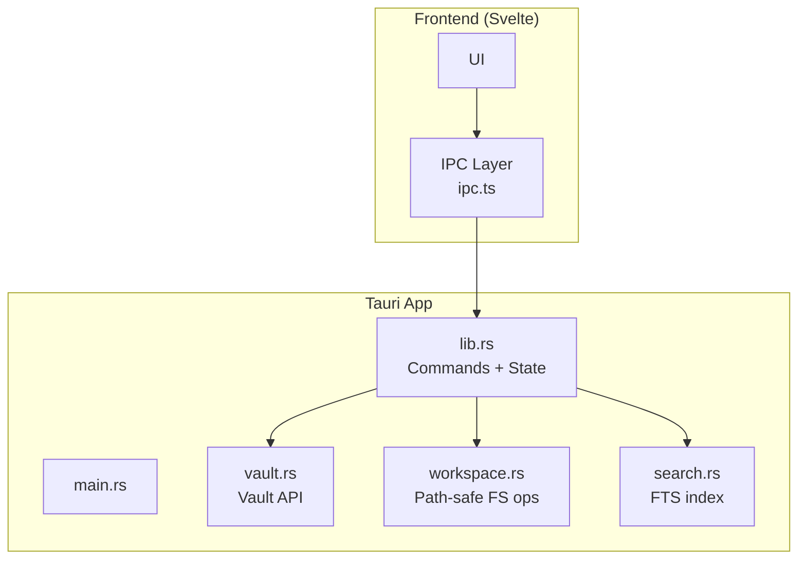
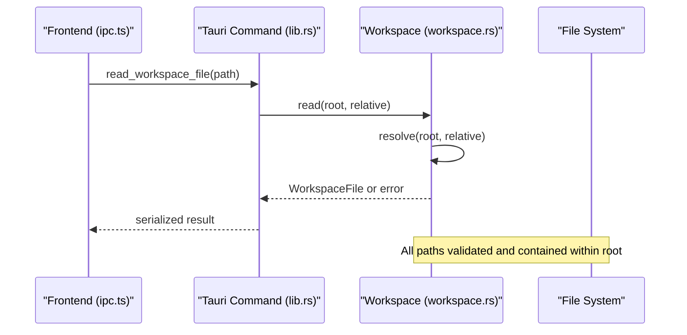
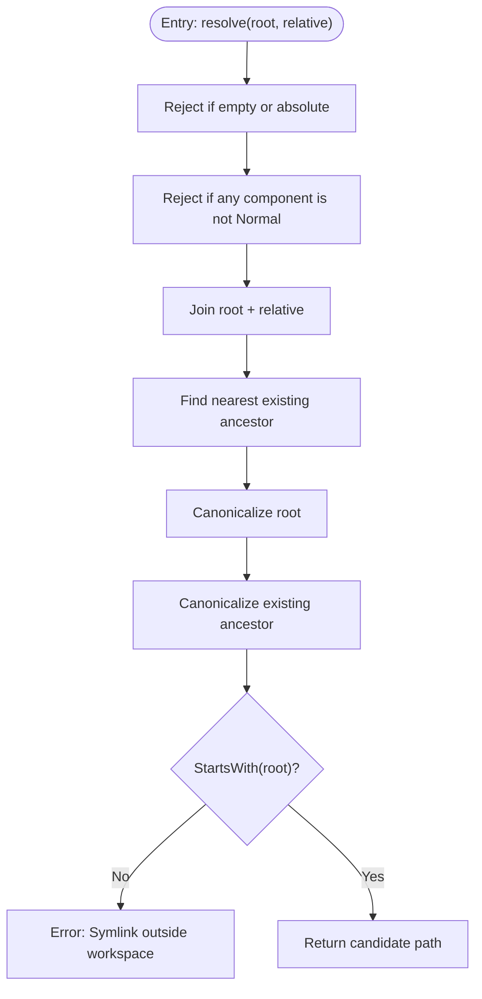
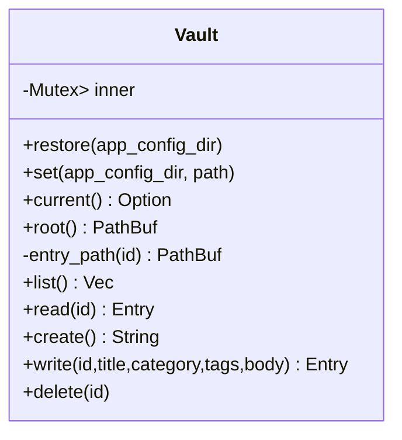
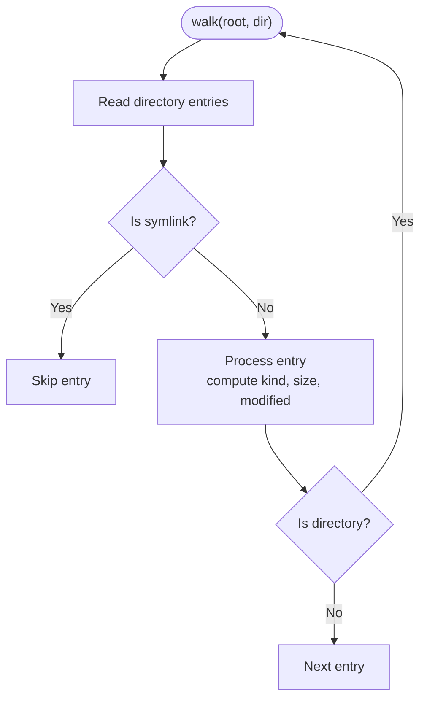
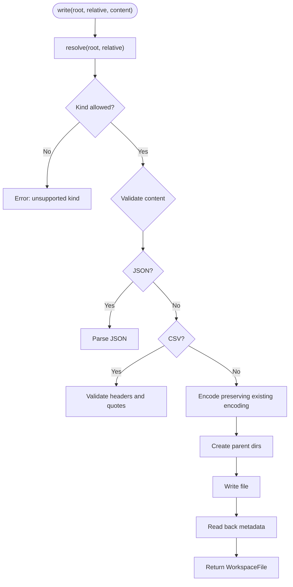
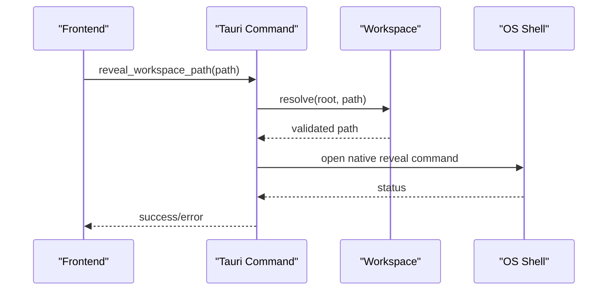
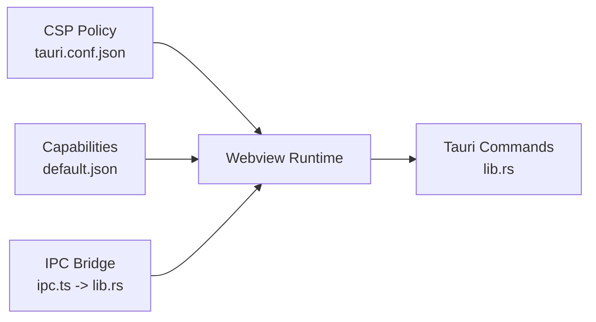
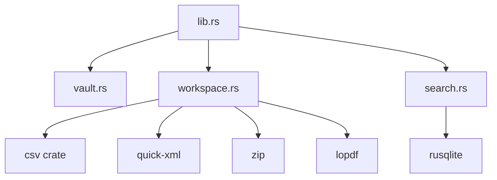

<cite>
**Referenced Files in This Document**
- [vault.rs](../../apps/fracta/src-tauri/src/vault.rs)
- [workspace.rs](../../apps/fracta/src-tauri/src/workspace.rs)
- [lib.rs](../../apps/fracta/src-tauri/src/lib.rs)
- [main.rs](../../apps/fracta/src-tauri/src/main.rs)
- [tauri.conf.json](../../apps/fracta/src-tauri/tauri.conf.json)
- [default.json](../../apps/fracta/src-tauri/capabilities/default.json)
- [ipc.ts](../../apps/fracta/src/lib/ipc.ts)
- [search.rs](../../apps/fracta/src-tauri/src/search.rs)
</cite>

## Table of Contents
1. [Introduction](#introduction)
2. [Project Structure](#project-structure)
3. [Core Components](#core-components)
4. [Architecture Overview](#architecture-overview)
5. [Detailed Component Analysis](#detailed-component-analysis)
6. [Dependency Analysis](#dependency-analysis)
7. [Performance Considerations](#performance-considerations)
8. [Troubleshooting Guide](#troubleshooting-guide)
9. [Conclusion](#conclusion)

## Introduction
This document explains the security and sandboxing mechanisms that Fracta uses to safely operate on user files. It focuses on path resolution security, symlink protection, vault containment strategies, and Tauri IPC/webview isolation. It also documents how the resolve function validates inputs, prevents escape attempts, and enforces permissions for cross-platform operations.

## Project Structure
Fracta’s Rust backend exposes a small set of Tauri commands that perform all file system operations. The frontend calls these commands via a typed IPC layer. Security-critical logic lives in:
- Vault module: strict containment for Markdown entries with id-based access control.
- Workspace module: safe recursive workspace operations with robust path validation and symlink handling.
- Tauri configuration: CSP and capability scoping to limit webview privileges.

**Diagram sources**
- [main.rs:1-7](../../apps/fracta/src-tauri/src/main.rs#L1-L7)
- [lib.rs:432-497](../../apps/fracta/src-tauri/src/lib.rs#L432-L497)
- [vault.rs:1-120](../../apps/fracta/src-tauri/src/vault.rs#L1-L120)
- [workspace.rs:143-173](../../apps/fracta/src-tauri/src/workspace.rs#L143-L173)
- [search.rs:195-219](../../apps/fracta/src-tauri/src/search.rs#L195-L219)

**Section sources**
- [main.rs:1-7](../../apps/fracta/src-tauri/src/main.rs#L1-L7)
- [lib.rs:432-497](../../apps/fracta/src-tauri/src/lib.rs#L432-L497)
- [tauri.conf.json:32-34](../../apps/fracta/src-tauri/tauri.conf.json#L32-L34)
- [default.json:1-15](../../apps/fracta/src-tauri/capabilities/default.json#L1-L15)

## Core Components
- Vault: Enforces that every entry is addressed by a stable id (file stem). All paths are constructed inside the chosen vault directory; traversal or special characters are rejected.
- Workspace: Provides path-safe operations over an arbitrary project tree under the vault root. The resolve function rejects absolute paths, disallows non-normal components, canonicalizes roots, and validates symlinks against the root.
- Tauri IPC: Commands accept only validated parameters and never expose raw filesystem handles to the webview.
- Search: Uses a local SQLite FTS5 index stored under app config, not the vault, to avoid polluting user content.

**Section sources**
- [vault.rs:113-126](../../apps/fracta/src-tauri/src/vault.rs#L113-L126)
- [workspace.rs:143-173](../../apps/fracta/src-tauri/src/workspace.rs#L143-L173)
- [lib.rs:454-494](../../apps/fracta/src-tauri/src/lib.rs#L454-L494)
- [search.rs:195-219](../../apps/fracta/src-tauri/src/search.rs#L195-L219)

## Architecture Overview
The application follows a strict separation of concerns:
- Webview runs untrusted UI code.
- Tauri commands act as the single source of truth for file operations.
- Path validation and containment occur before any I/O.
- Assets and media are returned as bytes with explicit MIME types; no host paths are exposed to JS.

**Diagram sources**
- [ipc.ts:149-150](../../apps/fracta/src/lib/ipc.ts#L149-L150)
- [lib.rs:106-108](../../apps/fracta/src-tauri/src/lib.rs#L106-L108)
- [workspace.rs:257-285](../../apps/fracta/src-tauri/src/workspace.rs#L257-L285)

## Detailed Component Analysis

### Path Resolution Security (resolve)
The resolve function is the central gatekeeper for all workspace operations:
- Rejects empty or absolute paths.
- Disallows non-normal path components (e.g., parent references).
- Canonicalizes the root and checks existing ancestors to detect symlinks pointing outside the root.
- Returns a candidate path only if it remains within the canonical root.

**Diagram sources**
- [workspace.rs:143-173](../../apps/fracta/src-tauri/src/workspace.rs#L143-L173)

**Section sources**
- [workspace.rs:143-173](../../apps/fracta/src-tauri/src/workspace.rs#L143-L173)

### Vault Containment Strategies
- Entry ids are bare file stems; they cannot contain separators, nulls, dot-prefixes, or parent references.
- All entry paths are constructed by joining the vault directory with the sanitized id plus extension.
- Vault selection persists a canonicalized path; restore ignores invalid directories.

**Diagram sources**
- [vault.rs:21-24](../../apps/fracta/src-tauri/src/vault.rs#L21-L24)
- [vault.rs:73-126](../../apps/fracta/src-tauri/src/vault.rs#L73-L126)

**Section sources**
- [vault.rs:73-126](../../apps/fracta/src-tauri/src/vault.rs#L73-L126)
- [vault.rs:128-157](../../apps/fracta/src-tauri/src/vault.rs#L128-L157)
- [vault.rs:159-189](../../apps/fracta/src-tauri/src/vault.rs#L159-L189)
- [vault.rs:193-208](../../apps/fracta/src-tauri/src/vault.rs#L193-L208)
- [vault.rs:212-267](../../apps/fracta/src-tauri/src/vault.rs#L212-L267)
- [vault.rs:269-277](../../apps/fracta/src-tauri/src/vault.rs#L269-L277)

### Symlink Protection
- During listing, symlinks are skipped to prevent recursion and external escapes.
- resolve validates symlinks by canonicalizing the nearest existing ancestor and ensuring it starts with the canonical root.
- DOCX image extraction restricts archive paths to word/media/ and normal components only.

**Diagram sources**
- [workspace.rs:183-231](../../apps/fracta/src-tauri/src/workspace.rs#L183-L231)
- [workspace.rs:698-740](../../apps/fracta/src-tauri/src/workspace.rs#L698-L740)

**Section sources**
- [workspace.rs:183-231](../../apps/fracta/src-tauri/src/workspace.rs#L183-L231)
- [workspace.rs:698-740](../../apps/fracta/src-tauri/src/workspace.rs#L698-L740)

### Escape Prevention and Input Validation
- Vault entry ids reject separators, nulls, dot-prefixes, and parent references.
- Workspace write/read validate file kinds and content formats (JSON parse, CSV header/quote validation).
- Media assets enforce allowed extensions and maximum sizes; PDFs require exact kind match.
- Terminal execution is bounded by timeout and output size limits.

**Diagram sources**
- [workspace.rs:384-430](../../apps/fracta/src-tauri/src/workspace.rs#L384-L430)
- [workspace.rs:466-539](../../apps/fracta/src-tauri/src/workspace.rs#L466-L539)
- [workspace.rs:553-571](../../apps/fracta/src-tauri/src/workspace.rs#L553-L571)

**Section sources**
- [workspace.rs:384-430](../../apps/fracta/src-tauri/src/workspace.rs#L384-L430)
- [workspace.rs:466-539](../../apps/fracta/src-tauri/src/workspace.rs#L466-L539)
- [workspace.rs:553-571](../../apps/fracta/src-tauri/src/workspace.rs#L553-L571)

### Permission Handling and Cross-Platform Considerations
- Reveal/open externally use platform-specific commands (open, explorer, xdg-open) after resolving paths safely.
- Trash deletion is used where available; fallback to hard delete ensures recoverability.
- Newline and encoding preservation ensure consistent behavior across platforms.

**Diagram sources**
- [workspace.rs:638-659](../../apps/fracta/src-tauri/src/workspace.rs#L638-L659)

**Section sources**
- [workspace.rs:638-659](../../apps/fracta/src-tauri/src/workspace.rs#L638-L659)
- [workspace.rs:661-682](../../apps/fracta/src-tauri/src/workspace.rs#L661-L682)
- [workspace.rs:593-599](../../apps/fracta/src-tauri/src/workspace.rs#L593-L599)

### Tauri Security Best Practices
- CSP restricts script/style/img/font/connect sources and forbids object-src.
- Capabilities grant minimal required permissions to the main window.
- IPC is strictly typed; the frontend invokes commands through a small, auditable interface.

**Diagram sources**
- [tauri.conf.json:32-34](../../apps/fracta/src-tauri/tauri.conf.json#L32-L34)
- [default.json:1-15](../../apps/fracta/src-tauri/capabilities/default.json#L1-L15)
- [ipc.ts:1-10](../../apps/fracta/src/lib/ipc.ts#L1-L10)
- [lib.rs:454-494](../../apps/fracta/src-tauri/src/lib.rs#L454-L494)

**Section sources**
- [tauri.conf.json:32-34](../../apps/fracta/src-tauri/tauri.conf.json#L32-L34)
- [default.json:1-15](../../apps/fracta/src-tauri/capabilities/default.json#L1-L15)
- [ipc.ts:149-178](../../apps/fracta/src/lib/ipc.ts#L149-L178)

## Dependency Analysis
- lib.rs wires Tauri commands and state (Vault, AutoTag, GgufEngine), exposing a controlled surface to the webview.
- workspace.rs depends on standard library path utilities and crates for CSV, XML, ZIP, and PDF parsing.
- search.rs depends on rusqlite for FTS indexing and uses workspace APIs to read content safely.
- vault.rs depends on serde, trash, and std fs/path.

**Diagram sources**
- [lib.rs:1-6](../../apps/fracta/src-tauri/src/lib.rs#L1-L6)
- [workspace.rs:7-16](../../apps/fracta/src-tauri/src/workspace.rs#L7-L16)
- [search.rs:4-13](../../apps/fracta/src-tauri/src/search.rs#L4-L13)
- [Cargo.toml:17-28](../../apps/fracta/src-tauri/Cargo.toml#L17-L28)

**Section sources**
- [lib.rs:1-6](../../apps/fracta/src-tauri/src/lib.rs#L1-L6)
- [workspace.rs:7-16](../../apps/fracta/src-tauri/src/workspace.rs#L7-L16)
- [search.rs:4-13](../../apps/fracta/src-tauri/src/search.rs#L4-L13)
- [Cargo.toml:17-28](../../apps/fracta/src-tauri/Cargo.toml#L17-L28)

## Performance Considerations
- Listing uses a simple walk with ignored patterns; large trees may benefit from incremental updates via notify events.
- Search rebuilds on demand and supports targeted updates for changed paths; .fractaignore changes trigger full rebuilds.
- Media asset reads enforce size limits to avoid memory pressure.
- Terminal output is bounded to prevent excessive buffering.

[No sources needed since this section provides general guidance]

## Troubleshooting Guide
Common errors and their causes:
- “A non-empty project-relative path is required.”: Absolute or empty paths passed to workspace operations.
- “Path traversal is not allowed.”: Non-normal components like “..” detected.
- “Symlinks outside the selected workspace are not allowed.”: Canonicalization revealed an external target.
- “Only Markdown, TXT, CSV/TSV, and JSON files can be edited in Fracta.”: Unsupported kind for write.
- “Invalid JSON / Invalid CSV headers / Unbalanced quotes”: Content validation failures.
- “Could not resolve workspace root/path”: Root does not exist or cannot be canonicalized.

Mitigations:
- Ensure paths are relative and normalized.
- Avoid symlinks pointing outside the vault root.
- Validate content locally before writing.
- Use the provided IPC functions which encapsulate validation.

**Section sources**
- [workspace.rs:143-173](../../apps/fracta/src-tauri/src/workspace.rs#L143-L173)
- [workspace.rs:384-430](../../apps/fracta/src-tauri/src/workspace.rs#L384-L430)
- [workspace.rs:466-539](../../apps/fracta/src-tauri/src/workspace.rs#L466-L539)
- [workspace.rs:553-571](../../apps/fracta/src-tauri/src/workspace.rs#L553-L571)

## Conclusion
Fracta’s security model centers on strict path validation, vault containment, and minimal IPC exposure. The resolve function and vault id constraints prevent path traversal and symlink escapes. Tauri CSP and capabilities further isolate the webview. Together, these measures provide a robust foundation for safe file operations across platforms while maintaining usability and performance.

[No sources needed since this section summarizes without analyzing specific files]
