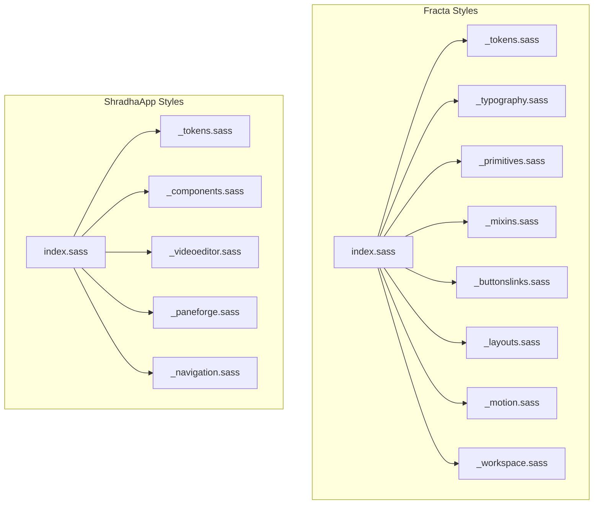
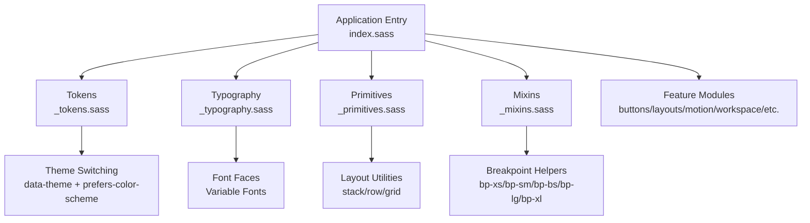
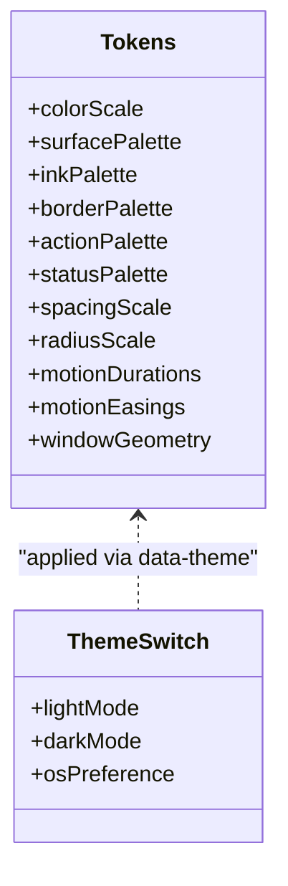
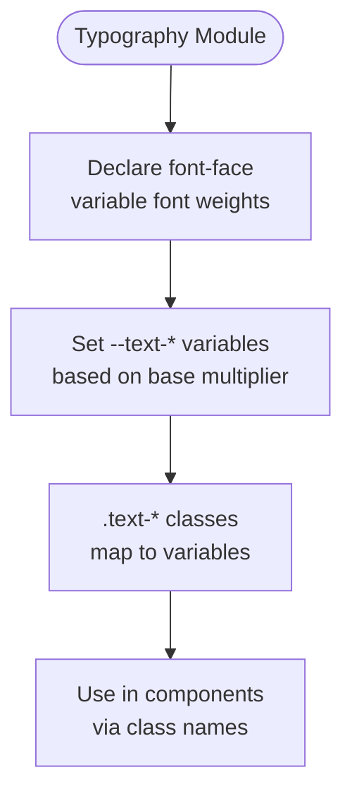
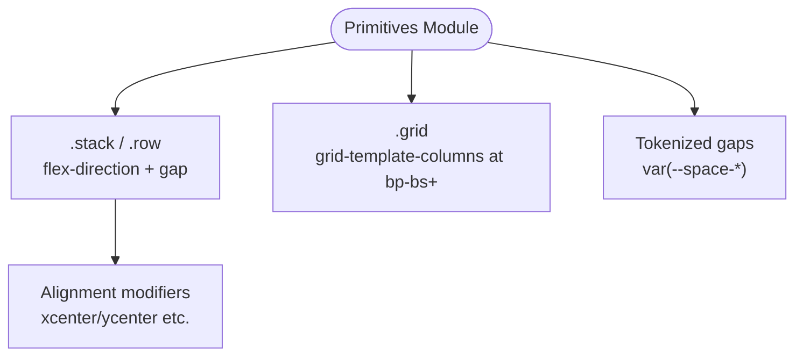
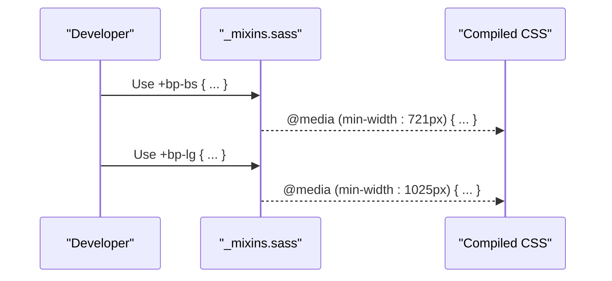
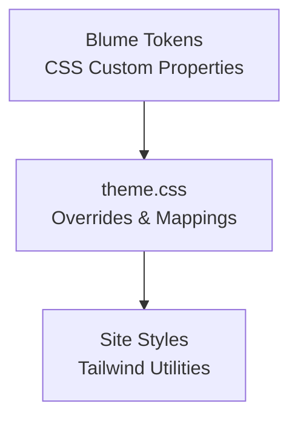
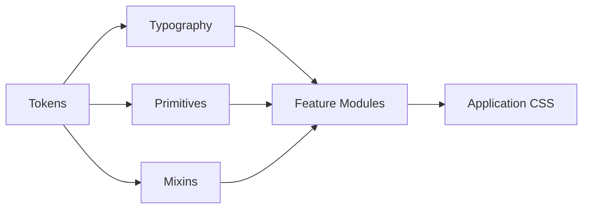

<cite>
**Referenced Files in This Document**
- [apps/fracta/src/lib/styles/index.sass](../../apps/fracta/src/lib/styles/index.sass)
- [apps/fracta/src/lib/styles/_tokens.sass](../../apps/fracta/src/lib/styles/_tokens.sass)
- [apps/fracta/src/lib/styles/_primitives.sass](../../apps/fracta/src/lib/styles/_primitives.sass)
- [apps/fracta/src/lib/styles/_typography.sass](../../apps/fracta/src/lib/styles/_typography.sass)
- [apps/fracta/src/lib/styles/_mixins.sass](../../apps/fracta/src/lib/styles/_mixins.sass)
- [apps/shradhapp/src/lib/styles/index.sass](../../apps/shradhapp/src/lib/styles/index.sass)
- [apps/shradhapp/src/lib/styles/_tokens.sass](../../apps/shradhapp/src/lib/styles/_tokens.sass)
- [sites/fractalhome/theme.css](../../sites/fractalhome/theme.css)
- [sites/fractalhome/BLUME-CUSTOMIZATION-BACKEND.md](../../sites/fractalhome/BLUME-CUSTOMIZATION-BACKEND.md)
</cite>

## Table of Contents
1. [Introduction](#introduction)
2. [Project Structure](#project-structure)
3. [Core Components](#core-components)
4. [Architecture Overview](#architecture-overview)
5. [Detailed Component Analysis](#detailed-component-analysis)
6. [Dependency Analysis](#dependency-analysis)
7. [Performance Considerations](#performance-considerations)
8. [Troubleshooting Guide](#troubleshooting-guide)
9. [Conclusion](#conclusion)

## Introduction
This document describes the exclusive SASS styling system used across the project’s applications and sites. It explains the .sass file structure, single-tab indentation conventions, CSS-in-SASS patterns, design tokens (colors, typography, spacing), responsive strategies with media queries, mobile-first approaches, cross-platform compatibility, component-specific styles, theme switching, dark mode implementation, and performance optimization techniques such as CSS extraction, critical CSS inlining, and bundle size reduction.

The system is built on:
- Single-tab indented SASS (.sass) exclusively (no SCSS braces or semicolons).
- Token-driven design with semantic variables for colors, spacing, motion, and layout primitives.
- Modular SASS composition via @use/@forward to keep styles organized and reusable.
- Responsive utilities and mixins for consistent breakpoints.
- Theme switching using data attributes and prefers-color-scheme.

## Project Structure
Each application and site organizes its styles under a lib/styles directory with an index.sass entry that composes modular partials. The pattern is consistent:
- index.sass: central entry point that imports all modules.
- _tokens.sass: global design tokens (colors, spacing, motion, fonts).
- _typography.sass: font-face declarations and text scale utilities.
- _primitives.sass: foundational layout classes (flexbox/grid stacks).
- _mixins.sass: breakpoint helpers and shared logic.
- Feature-specific partials (e.g., buttonslinks, layouts, motion, workspace, components).



**Diagram sources**
- [apps/fracta/src/lib/styles/index.sass](../../apps/fracta/src/lib/styles/index.sass)
- [apps/shradhapp/src/lib/styles/index.sass](../../apps/shradhapp/src/lib/styles/index.sass)

**Section sources**
- [apps/fracta/src/lib/styles/index.sass](../../apps/fracta/src/lib/styles/index.sass)
- [apps/shradhapp/src/lib/styles/index.sass](../../apps/shradhapp/src/lib/styles/index.sass)

## Core Components
- Token layer: Centralized variables for color scales, surfaces, borders, typography, spacing, motion durations/easings, radii, z-index, and window geometry.
- Typography layer: Font-face declarations and a scalable type scale driven by a base multiplier variable.
- Primitives: Reusable layout classes for flex stacks, rows, grids, and utility spacing.
- Mixins: Breakpoint helpers to encapsulate responsive rules consistently.
- Feature modules: Domain-specific styles (buttons, layouts, motion, workspace, video editor, paneforge, navigation).

Key responsibilities:
- Consistency: All visual values flow through tokens.
- Modularity: Each concern lives in its own partial; index.sass wires them together.
- Responsiveness: Breakpoints are centralized in mixins and reused across modules.
- Theming: Light/dark modes via data-theme attribute and OS preference.

**Section sources**
- [apps/fracta/src/lib/styles/_tokens.sass](../../apps/fracta/src/lib/styles/_tokens.sass)
- [apps/fracta/src/lib/styles/_typography.sass](../../apps/fracta/src/lib/styles/_typography.sass)
- [apps/fracta/src/lib/styles/_primitives.sass](../../apps/fracta/src/lib/styles/_primitives.sass)
- [apps/fracta/src/lib/styles/_mixins.sass](../../apps/fracta/src/lib/styles/_mixins.sass)
- [apps/shradhapp/src/lib/styles/_tokens.sass](../../apps/shradhapp/src/lib/styles/_tokens.sass)

## Architecture Overview
The styling architecture follows a layered approach:
- Entry points compose modules.
- Tokens define the design language.
- Typography defines fonts and scales.
- Primitives provide low-level layout building blocks.
- Mixins standardize responsive behavior.
- Feature modules implement component/domain styles.



**Diagram sources**
- [apps/fracta/src/lib/styles/index.sass](../../apps/fracta/src/lib/styles/index.sass)
- [apps/fracta/src/lib/styles/_tokens.sass](../../apps/fracta/src/lib/styles/_tokens.sass)
- [apps/fracta/src/lib/styles/_typography.sass](../../apps/fracta/src/lib/styles/_typography.sass)
- [apps/fracta/src/lib/styles/_primitives.sass](../../apps/fracta/src/lib/styles/_primitives.sass)
- [apps/fracta/src/lib/styles/_mixins.sass](../../apps/fracta/src/lib/styles/_mixins.sass)

## Detailed Component Analysis

### Token System and Color Palettes
- Fracta tokens define a quiet paper palette with a single interactive green family and semantic aliases for surfaces, ink, lines, actions, and status.
- ShradhaApp tokens define app-wide surfaces, text, borders, accents, and semantic roles for sidebar, popover, and tooltips.
- Both apps expose light/dark themes via data-theme and respect prefers-color-scheme.



**Diagram sources**
- [apps/fracta/src/lib/styles/_tokens.sass](../../apps/fracta/src/lib/styles/_tokens.sass)
- [apps/shradhapp/src/lib/styles/_tokens.sass](../../apps/shradhapp/src/lib/styles/_tokens.sass)

**Section sources**
- [apps/fracta/src/lib/styles/_tokens.sass](../../apps/fracta/src/lib/styles/_tokens.sass)
- [apps/shradhapp/src/lib/styles/_tokens.sass](../../apps/shradhapp/src/lib/styles/_tokens.sass)

### Typography Scale and Fonts
- Variable fonts are declared with appropriate weight ranges and display swap.
- Type scale uses a base multiplier to compute sizes from a base unit.
- Utility classes map directly to tokenized sizes and common text properties.



**Diagram sources**
- [apps/fracta/src/lib/styles/_typography.sass](../../apps/fracta/src/lib/styles/_typography.sass)

**Section sources**
- [apps/fracta/src/lib/styles/_typography.sass](../../apps/fracta/src/lib/styles/_typography.sass)

### Layout Primitives and Spacing Utilities
- Flex-based stack and row utilities provide alignment and distribution.
- Grid utilities offer column counts at larger breakpoints.
- Spacing is tokenized via --space-* variables and applied consistently.



**Diagram sources**
- [apps/fracta/src/lib/styles/_primitives.sass](../../apps/fracta/src/lib/styles/_primitives.sass)

**Section sources**
- [apps/fracta/src/lib/styles/_primitives.sass](../../apps/fracta/src/lib/styles/_primitives.sass)

### Responsive Strategy and Breakpoints
- Breakpoint mixins encapsulate max/min width conditions.
- Mobile-first approach: default styles target small screens; enhancements apply at larger breakpoints.
- Consistent naming: bp-xs, bp-sm, bp-bs, bp-lg, bp-xl.



**Diagram sources**
- [apps/fracta/src/lib/styles/_mixins.sass](../../apps/fracta/src/lib/styles/_mixins.sass)

**Section sources**
- [apps/fracta/src/lib/styles/_mixins.sass](../../apps/fracta/src/lib/styles/_mixins.sass)

### Theme Switching and Dark Mode
- Data-theme attribute controls light/dark palettes.
- OS preference fallback via prefers-color-scheme.
- Reduced motion support via prefers-reduced-motion.

```mermaid
stateDiagram-v2
[*] --> Default
Default --> Light : "data-theme='light'"
Default --> Dark : "data-theme='dark'"
Default --> AutoDark : "prefers-color-scheme : dark"
AutoDark --> Dark
Light --> Dark : "Toggle theme"
Dark --> Light : "Toggle theme"
```

**Diagram sources**
- [apps/fracta/src/lib/styles/_tokens.sass](../../apps/fracta/src/lib/styles/_tokens.sass)
- [apps/shradhapp/src/lib/styles/_tokens.sass](../../apps/shradhapp/src/lib/styles/_tokens.sass)

**Section sources**
- [apps/fracta/src/lib/styles/_tokens.sass](../../apps/fracta/src/lib/styles/_tokens.sass)
- [apps/shradhapp/src/lib/styles/_tokens.sass](../../apps/shradhapp/src/lib/styles/_tokens.sass)

### Cross-Platform Compatibility
- Uses oklch color spaces for perceptual consistency.
- Respects reduced motion preferences.
- Applies color-scheme for native UI elements.
- Ensures input font sizes meet accessibility thresholds.

**Section sources**
- [apps/fracta/src/lib/styles/_tokens.sass](../../apps/fracta/src/lib/styles/_tokens.sass)
- [apps/shradhapp/src/lib/styles/_tokens.sass](../../apps/shradhapp/src/lib/styles/_tokens.sass)

### Component-Specific Styles
- Feature modules encapsulate domain styles (buttons, layouts, motion, workspace, video editor, paneforge, navigation).
- Composition via index.sass ensures predictable load order and dependency management.

**Section sources**
- [apps/fracta/src/lib/styles/index.sass](../../apps/fracta/src/lib/styles/index.sass)
- [apps/shradhapp/src/lib/styles/index.sass](../../apps/shradhapp/src/lib/styles/index.sass)

### Blume Integration and Global Tokens (Sites)
- Sites like fractalhome use Blume’s CSS custom properties for global tokens.
- theme.css overrides Blume tokens to establish editorial tone and dark mode.
- Mapping between tokens and utility names is documented for maintainability.



**Diagram sources**
- [sites/fractalhome/theme.css](../../sites/fractalhome/theme.css)
- [sites/fractalhome/BLUME-CUSTOMIZATION-BACKEND.md](../../sites/fractalhome/BLUME-CUSTOMIZATION-BACKEND.md)

**Section sources**
- [sites/fractalhome/theme.css](../../sites/fractalhome/theme.css)
- [sites/fractalhome/BLUME-CUSTOMIZATION-BACKEND.md](../../sites/fractalhome/BLUME-CUSTOMIZATION-BACKEND.md)

## Dependency Analysis
- index.sass files orchestrate module dependencies using @use/@forward.
- Tokens are foundational; other modules depend on them.
- Mixins centralize responsive logic consumed by feature modules.
- No circular dependencies observed; composition is linear and explicit.



**Diagram sources**
- [apps/fracta/src/lib/styles/index.sass](../../apps/fracta/src/lib/styles/index.sass)
- [apps/shradhapp/src/lib/styles/index.sass](../../apps/shradhapp/src/lib/styles/index.sass)

**Section sources**
- [apps/fracta/src/lib/styles/index.sass](../../apps/fracta/src/lib/styles/index.sass)
- [apps/shradhapp/src/lib/styles/index.sass](../../apps/shradhapp/src/lib/styles/index.sass)

## Performance Considerations
- CSS Extraction: Ensure build pipelines extract SASS into standalone CSS files rather than inline styles per component to reduce payload duplication.
- Critical CSS Inlining: Inline above-the-fold CSS in HTML head to improve first paint; defer non-critical styles.
- Bundle Size Reduction:
  - Remove unused selectors via tree-shaking-friendly tooling.
  - Avoid deep nesting and excessive specificity.
  - Prefer tokenized variables over repeated values.
  - Minify CSS in production builds.
- Motion Optimization: Respect prefers-reduced-motion; avoid heavy animations on frequent interactions.
- Font Loading: Use font-display: swap and subset fonts to reduce blocking and payload.

[No sources needed since this section provides general guidance]

## Troubleshooting Guide
- Theme not applying:
  - Verify data-theme attribute is set on root element.
  - Check prefers-color-scheme fallback and ensure no overriding styles.
- Colors look off:
  - Confirm token definitions match intended palette.
  - Validate oklch usage and browser support.
- Responsive issues:
  - Ensure breakpoints align with mixin definitions.
  - Check mobile-first defaults vs. min-width enhancements.
- Accessibility problems:
  - Ensure focus states use box-shadow rings respecting radius.
  - Verify input font sizes prevent iOS zoom.
  - Respect reduced motion preferences.

**Section sources**
- [apps/fracta/src/lib/styles/_tokens.sass](../../apps/fracta/src/lib/styles/_tokens.sass)
- [apps/shradhapp/src/lib/styles/_tokens.sass](../../apps/shradhapp/src/lib/styles/_tokens.sass)
- [apps/fracta/src/lib/styles/_mixins.sass](../../apps/fracta/src/lib/styles/_mixins.sass)

## Conclusion
The styling system is a cohesive, token-driven SASS architecture that enforces single-tab indentation, modular composition, and consistent responsive patterns. It supports robust theme switching, accessible typography and spacing, and cross-platform compatibility. By adhering to these principles and optimizing CSS delivery, teams can maintain a scalable, performant, and visually consistent design system across applications and sites.

[No sources needed since this section summarizes without analyzing specific files]
