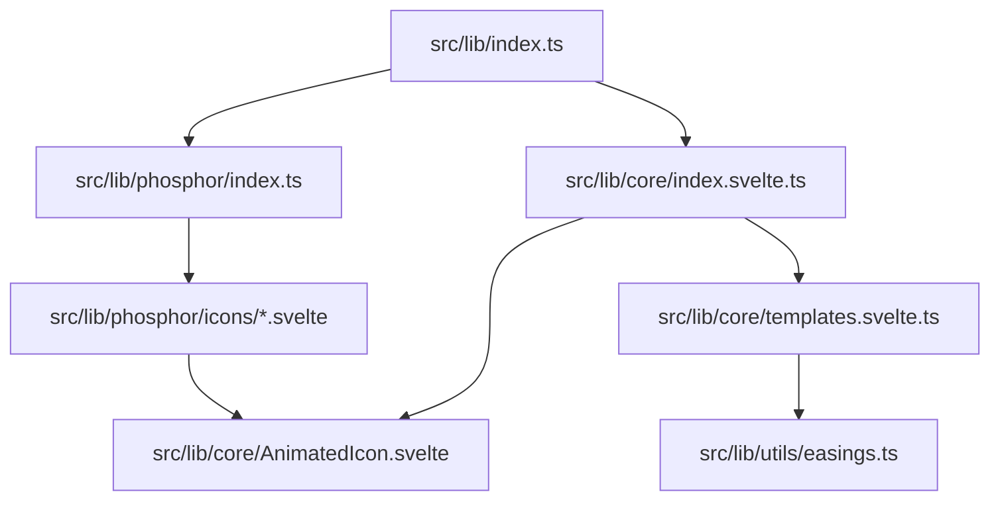
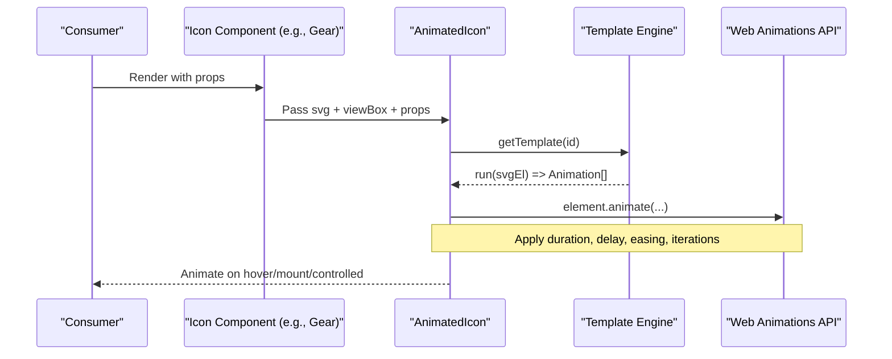
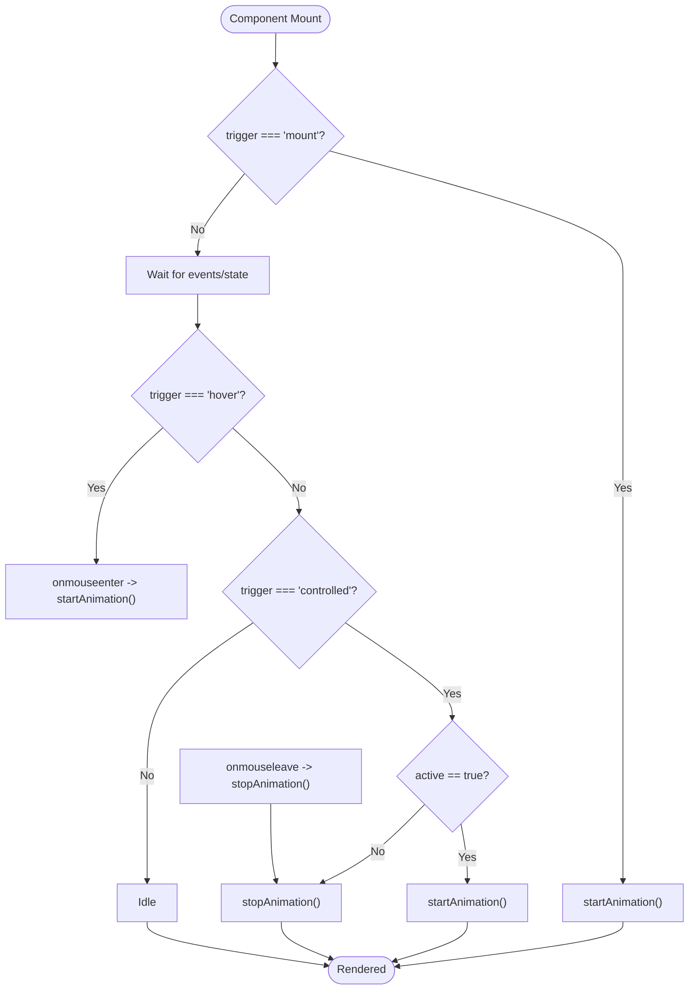
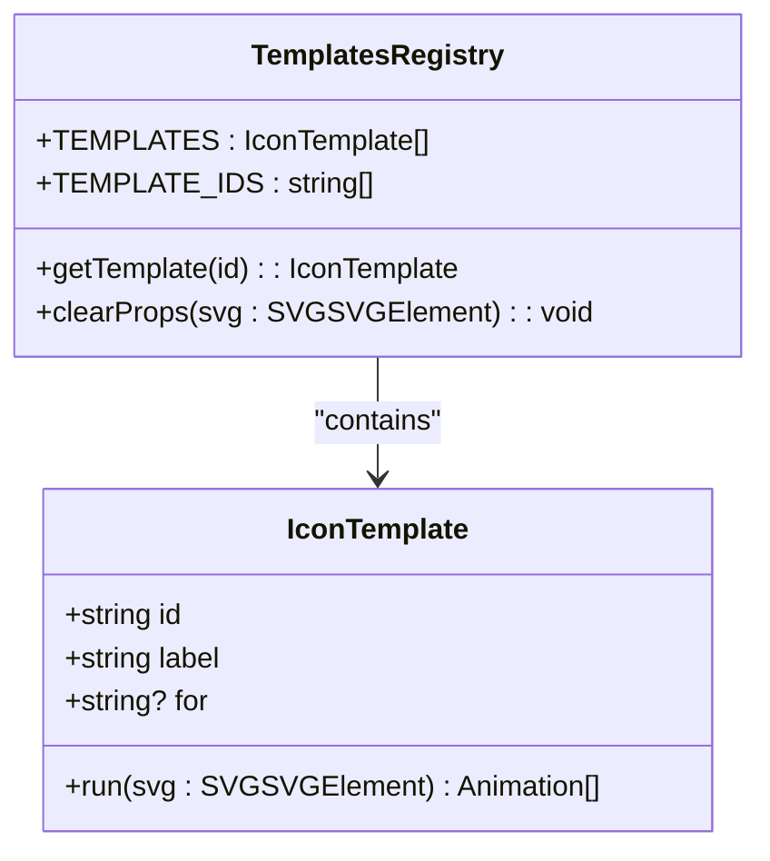
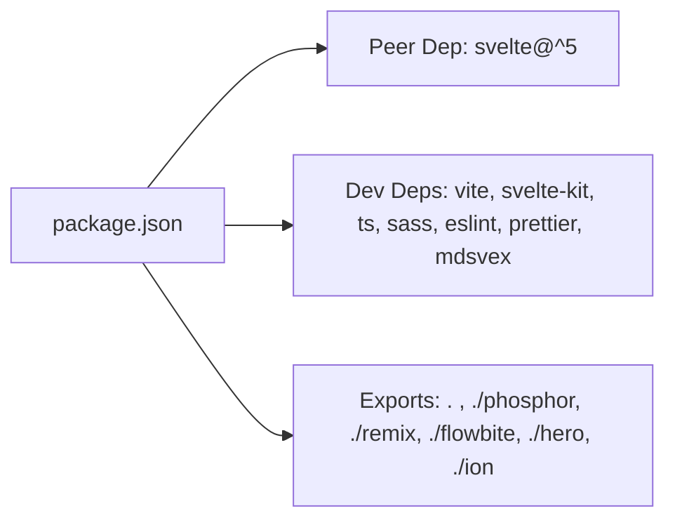

<cite>
**Referenced Files in This Document**
- [package.json](../../packages/svelte-animated-icon/package.json)
- [README.md](../../packages/svelte-animated-icon/README.md)
- [index.ts](../../packages/svelte-animated-icon/src/lib/index.ts)
- [index.svelte.ts](../../packages/svelte-animated-icon/src/lib/core/index.svelte.ts)
- [AnimatedIcon.svelte](../../packages/svelte-animated-icon/src/lib/core/AnimatedIcon.svelte)
- [templates.svelte.ts](../../packages/svelte-animated-icon/src/lib/core/templates.svelte.ts)
- [easings.ts](../../packages/svelte-animated-icon/src/lib/utils/easings.ts)
- [phosphor/index.ts](../../packages/svelte-animated-icon/src/lib/phosphor/index.ts)
- [Gear.svelte](../../packages/svelte-animated-icon/src/lib/phosphor/icons/Gear.svelte)
</cite>

## Table of Contents
1. [Introduction](#introduction)
2. [Project Structure](#project-structure)
3. [Core Components](#core-components)
4. [Architecture Overview](#architecture-overview)
5. [Detailed Component Analysis](#detailed-component-analysis)
6. [Dependency Analysis](#dependency-analysis)
7. [Performance Considerations](#performance-considerations)
8. [Troubleshooting Guide](#troubleshooting-guide)
9. [Conclusion](#conclusion)
10. [Appendices](#appendices)

## Introduction
Svelte Animated Icon is a Svelte 5 animated icon library that provides tree-shakeable, multi-library icon components powered by the native Web Animations API. It offers a unified animation framework with structure-agnostic templates, multiple trigger modes, and built-in easing presets. The package exposes a core AnimatedIcon component and prebuilt icon components for popular libraries such as Phosphor, Remix, Flowbite, Hero, and Ion via subpath exports.

Key highlights:
- Zero external animation dependencies; uses WAAPI directly for performance and compatibility.
- Template-driven animations that work across different icon sets without per-icon authoring.
- Flexible triggers: hover, mount, or controlled mode driven by props.
- Configurable speed, loop, and easing overrides.
- Tree-shakeable exports and TypeScript support.

**Section sources**
- [README.md](../../packages/svelte-animated-icon/README.md)
- [package.json](../../packages/svelte-animated-icon/package.json)

## Project Structure
The package is organized into clear layers:
- Core runtime: AnimatedIcon component and template engine.
- Templates: Animation definitions using WAAPI.
- Utilities: Easing presets and helpers.
- Icon libraries: Generated Svelte components for each icon set (Phosphor, etc.).
- Package entry: Re-exports core APIs and types.

**Diagram sources**
- [index.ts](../../packages/svelte-animated-icon/src/lib/index.ts)
- [index.svelte.ts](../../packages/svelte-animated-icon/src/lib/core/index.svelte.ts)
- [AnimatedIcon.svelte](../../packages/svelte-animated-icon/src/lib/core/AnimatedIcon.svelte)
- [templates.svelte.ts](../../packages/svelte-animated-icon/src/lib/core/templates.svelte.ts)
- [easings.ts](../../packages/svelte-animated-icon/src/lib/utils/easings.ts)
- [phosphor/index.ts](../../packages/svelte-animated-icon/src/lib/phosphor/index.ts)

**Section sources**
- [package.json](../../packages/svelte-animated-icon/package.json)
- [README.md](../../packages/svelte-animated-icon/README.md)

## Core Components
- AnimatedIcon: The central component that renders an SVG and applies template-based animations based on props and triggers.
- Templates: A registry of animation behaviors (draw, cascade, pop, spin, jelly, orbit, assemble, trace, tada, flip, swing, wave, march, boil, glitch, native-draw, wipe, rise, iris, split, drop, stamp). Each template defines how to animate SVG elements using WAAPI.
- Easings: Presets and helpers for CSS cubic-bezier easing strings compatible with WAAPI.
- Icon Library Exports: Prebuilt icon components (e.g., Phosphor icons) that wrap AnimatedIcon with specific SVG content and viewBox.

Key capabilities:
- Trigger modes: hover, mount, controlled.
- Looping and speed control.
- Easing override per instance.
- Imperative start/stop methods exposed from AnimatedIcon.

**Section sources**
- [index.ts](../../packages/svelte-animated-icon/src/lib/index.ts)
- [index.svelte.ts](../../packages/svelte-animated-icon/src/lib/core/index.svelte.ts)
- [AnimatedIcon.svelte](../../packages/svelte-animated-icon/src/lib/core/AnimatedIcon.svelte)
- [templates.svelte.ts](../../packages/svelte-animated-icon/src/lib/core/templates.svelte.ts)
- [easings.ts](../../packages/svelte-animated-icon/src/lib/utils/easings.ts)

## Architecture Overview
The system composes a lightweight runtime around WAAPI:
- Icon components render raw SVG inner content into AnimatedIcon.
- AnimatedIcon selects a template and runs it against the SVG element.
- Templates manipulate SVG attributes and styles through WAAPI animations.
- Easing presets provide standardized timing curves.

**Diagram sources**
- [AnimatedIcon.svelte](../../packages/svelte-animated-icon/src/lib/core/AnimatedIcon.svelte)
- [templates.svelte.ts](../../packages/svelte-animated-icon/src/lib/core/templates.svelte.ts)
- [phosphor/index.ts](../../packages/svelte-animated-icon/src/lib/phosphor/index.ts)
- [Gear.svelte](../../packages/svelte-animated-icon/src/lib/phosphor/icons/Gear.svelte)

## Detailed Component Analysis

### AnimatedIcon Component
AnimatedIcon encapsulates rendering and lifecycle management of icon animations:
- Props include svg content, viewBox, template id, size, trigger mode, active state, loop, speed, easing, class, color, and standard HTML div attributes.
- Triggers:
  - hover: starts on mouseenter, stops on mouseleave.
  - mount: runs once when mounted.
  - controlled: parent controls via active prop; stop/cleanup on unmount or mode change.
- Imperative API:
  - startAnimation(): cancels previous animations, runs selected template, applies loop/easing/speed overrides.
  - stopAnimation(): cancels all running animations and clears inline properties.
- Rendering:
  - Wraps SVG in a div with role="img".
  - Applies color via style binding.
  - Forwards rest attributes and event handlers.

**Diagram sources**
- [AnimatedIcon.svelte](../../packages/svelte-animated-icon/src/lib/core/AnimatedIcon.svelte)

**Section sources**
- [AnimatedIcon.svelte](../../packages/svelte-animated-icon/src/lib/core/AnimatedIcon.svelte)

### Template Engine
Templates define animation behaviors independent of icon structure:
- Common utilities:
  - shapes(svg): selects target SVG elements (paths, circles, lines, polylines, polygons, ellipses, rects).
  - totalLength(el): computes geometry length where available.
  - clearProps(svg): resets inline styles and attributes set by templates.
- Template interface:
  - id: unique identifier.
  - label: human-readable name.
  - for: optional hint ('line' or 'fill') indicating suitability.
  - run(svgEl): returns WAAPI Animation[] instances.
- Notable templates:
  - draw/native-draw: stroke dash offset animations for line art.
  - cascade/pop/orbit/assemble: staggered transforms and opacity changes.
  - spin/jelly/swing/wave/march/boil/glitch: continuous or one-shot effects.
  - wipe/rise/iris/split: clip-path reveals for fill icons.
  - drop/stamp: bounce-like entrance effects.

**Diagram sources**
- [templates.svelte.ts](../../packages/svelte-animated-icon/src/lib/core/templates.svelte.ts)

**Section sources**
- [templates.svelte.ts](../../packages/svelte-animated-icon/src/lib/core/templates.svelte.ts)

### Easing Utilities
Easing presets are provided as cubic-bezier arrays and converted to CSS strings compatible with WAAPI:
- EASING_PRESETS: grouped by category (CSS standard, Sine, Quad, Cubic, Quart, Quint, Expo, Circ, Back).
- EASING_GROUPS: aggregated presets for UI selection.
- bezierCss(b): converts Bezier tuple to CSS string.
- matchPreset(b): finds matching preset within tolerance.
- DEFAULT_BEZIER: default curve equivalent to CSS ease.

Usage:
- Override AnimatedIcon’s easing prop with any CSS easing string or use presets to derive values.

**Section sources**
- [easings.ts](../../packages/svelte-animated-icon/src/lib/utils/easings.ts)

### Icon Library Integration (Phosphor Example)
Each icon is a small Svelte component that passes its SVG content and viewBox to AnimatedIcon:
- Variants: Some icons expose variants (e.g., regular, light, fill) mapped to different SVG strings.
- Props forwarding: Accepts variant and spreads rest props to AnimatedIcon.
- Export index: Central re-export file lists all icon components for convenient imports.

Example flow:
- Consumer imports a specific icon component.
- Icon component renders AnimatedIcon with svg and viewBox.
- AnimatedIcon applies template animations based on props.

**Section sources**
- [phosphor/index.ts](../../packages/svelte-animated-icon/src/lib/phosphor/index.ts)
- [Gear.svelte](../../packages/svelte-animated-icon/src/lib/phosphor/icons/Gear.svelte)

## Dependency Analysis
The package has minimal runtime dependencies and leverages Svelte 5 features:
- Peer dependency: svelte ^5.0.0.
- Dev dependencies include Vite, SvelteKit, TypeScript, Sass, ESLint, Prettier, mdsvex, and packaging tools.
- Subpath exports enable selective imports for icon libraries (phosphor, remix, flowbite, hero, ion).

**Diagram sources**
- [package.json](../../packages/svelte-animated-icon/package.json)

**Section sources**
- [package.json](../../packages/svelte-animated-icon/package.json)

## Performance Considerations
- WAAPI-native animations avoid heavy JS animation loops and leverage browser optimizations.
- Tree-shaking: Only imported icon components and templates are bundled.
- Efficient cleanup: stopAnimation cancels running animations and clears inline styles to prevent memory leaks and visual glitches.
- Speed multiplier: Adjusts duration and delay proportionally rather than recomputing keyframes.
- Looping: Uses WAAPI iterations for continuous effects without extra scheduling.
- Avoid excessive DOM queries: Templates operate on known element sets and reuse computed lengths where possible.

Best practices:
- Prefer controlled mode for complex state-driven animations to avoid redundant restarts.
- Use appropriate templates for icon type (line vs fill) to minimize unnecessary property changes.
- Keep speed reasonable to maintain smoothness on low-power devices.
- Reuse icon components instead of regenerating SVG content frequently.

[No sources needed since this section provides general guidance]

## Troubleshooting Guide
Common issues and resolutions:
- Animations not starting:
  - Ensure svg prop contains valid inner SVG content (no <svg> wrapper).
  - Verify trigger mode and active state for controlled animations.
  - Check that the SVG element is mounted before calling startAnimation.
- Stutter or flicker:
  - Clear leftover inline styles by ensuring stopAnimation is called before restarting.
  - Avoid rapid toggling of active in controlled mode; debounce if necessary.
- Incorrect sizing:
  - Set viewBox correctly for the icon set (e.g., 256 for Phosphor, 24 for Remix/Lucide).
  - Confirm size prop matches desired display dimensions.
- Easing not applied:
  - Provide a valid CSS easing string; null keeps template’s default.
  - Use easings.ts presets to ensure compatibility with WAAPI.

Operational tips:
- Use imperative startAnimation/stopAnimation for precise control.
- Inspect Animation objects’ effect timing to verify duration/delay adjustments.
- Validate SVG geometry for totalLength-dependent templates (native-draw).

**Section sources**
- [AnimatedIcon.svelte](../../packages/svelte-animated-icon/src/lib/core/AnimatedIcon.svelte)
- [templates.svelte.ts](../../packages/svelte-animated-icon/src/lib/core/templates.svelte.ts)
- [easings.ts](../../packages/svelte-animated-icon/src/lib/utils/easings.ts)

## Conclusion
Svelte Animated Icon delivers a robust, dependency-free animation framework tailored for icon components. Its template-driven approach enables consistent, performant animations across diverse icon libraries while offering flexible configuration for triggers, speed, looping, and easing. By leveraging WAAPI and Svelte 5’s reactive model, it achieves smooth transitions with minimal overhead and strong tree-shaking support.

[No sources needed since this section summarizes without analyzing specific files]

## Appendices

### API Reference Summary
- AnimatedIcon props:
  - svg: string (inner SVG content)
  - viewBox?: string
  - template?: string
  - size?: number
  - trigger?: 'hover' | 'mount' | 'controlled'
  - active?: boolean
  - loop?: boolean
  - speed?: number
  - easing?: string | null
  - class?: string
  - color?: string
- Methods:
  - startAnimation(): void
  - stopAnimation(): void
- Template registry:
  - TEMPLATES: IconTemplate[]
  - TEMPLATE_IDS: string[]
  - getTemplate(id): IconTemplate
  - clearProps(svg): void
- Easing utilities:
  - EASING_PRESETS, EASING_GROUPS, bezierCss, matchPreset, DEFAULT_BEZIER

**Section sources**
- [index.svelte.ts](../../packages/svelte-animated-icon/src/lib/core/index.svelte.ts)
- [AnimatedIcon.svelte](../../packages/svelte-animated-icon/src/lib/core/AnimatedIcon.svelte)
- [templates.svelte.ts](../../packages/svelte-animated-icon/src/lib/core/templates.svelte.ts)
- [easings.ts](../../packages/svelte-animated-icon/src/lib/utils/easings.ts)

### Creating Custom Animations
Steps:
- Define a new IconTemplate with id, label, for, and run function.
- In run(svg), select relevant elements and apply WAAPI animations.
- Register the template in the TEMPLATES array.
- Use the template id in AnimatedIcon’s template prop.

Guidelines:
- Use shapes(svg) to target common SVG elements.
- Respect for hints ('line' vs 'fill') to optimize behavior.
- Ensure clearProps can reset all inline modifications.

**Section sources**
- [templates.svelte.ts](../../packages/svelte-animated-icon/src/lib/core/templates.svelte.ts)

### Integrating New Icon Libraries
Approach:
- Generate or write Svelte components for each icon that pass svg and viewBox to AnimatedIcon.
- Create an index file exporting all icon components.
- Add a subpath export in package.json for the library namespace.

Example pattern:
- Icon component accepts variant prop mapping to different SVG strings.
- Spreads rest props to AnimatedIcon for flexibility.

**Section sources**
- [phosphor/index.ts](../../packages/svelte-animated-icon/src/lib/phosphor/index.ts)
- [Gear.svelte](../../packages/svelte-animated-icon/src/lib/phosphor/icons/Gear.svelte)
- [package.json](../../packages/svelte-animated-icon/package.json)

### Responsive Behavior
Recommendations:
- Bind size prop to responsive breakpoints or container measurements.
- Use viewBox consistently to scale icons without distortion.
- Avoid overly aggressive animations on small screens; consider reducing speed or disabling loops.

[No sources needed since this section provides general guidance]
