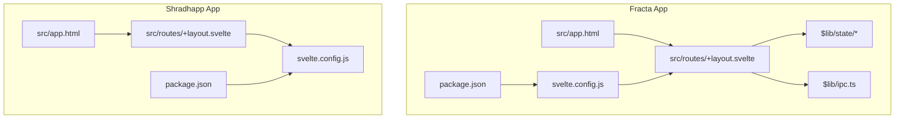
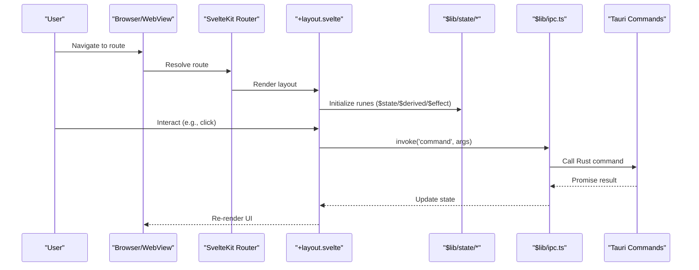
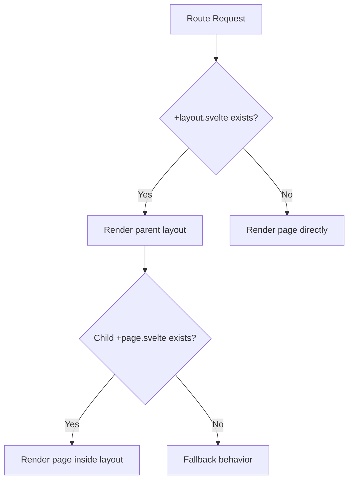
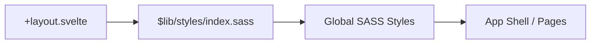
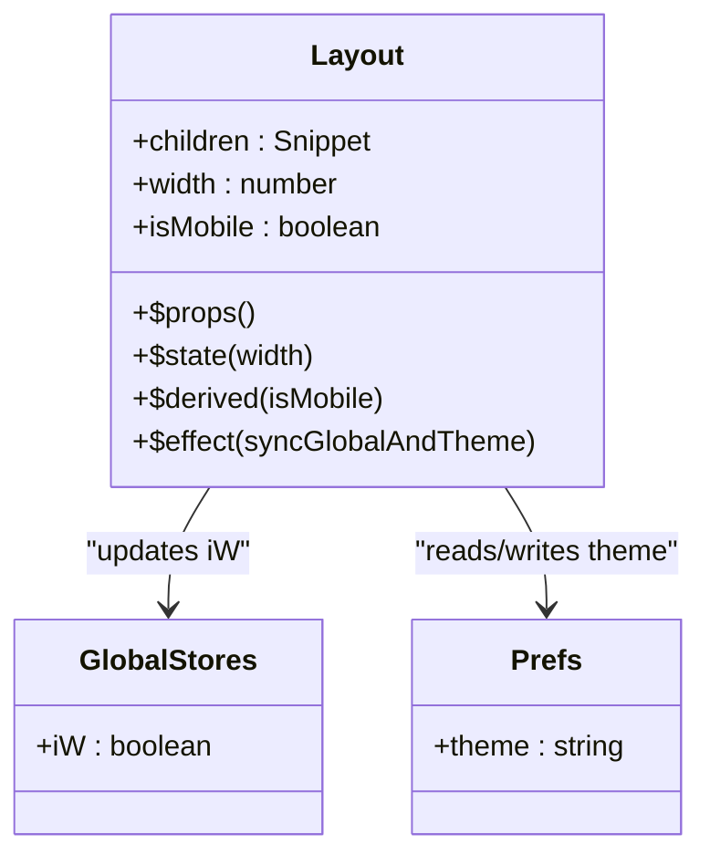
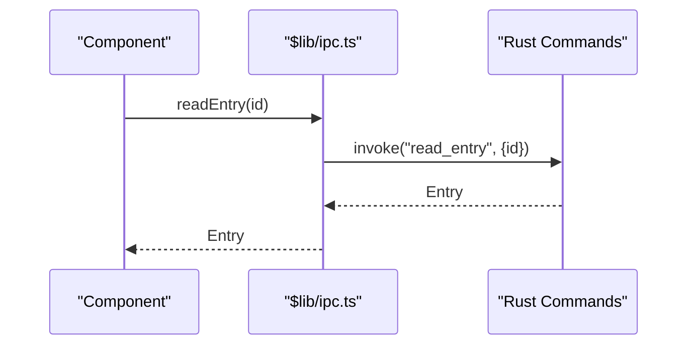
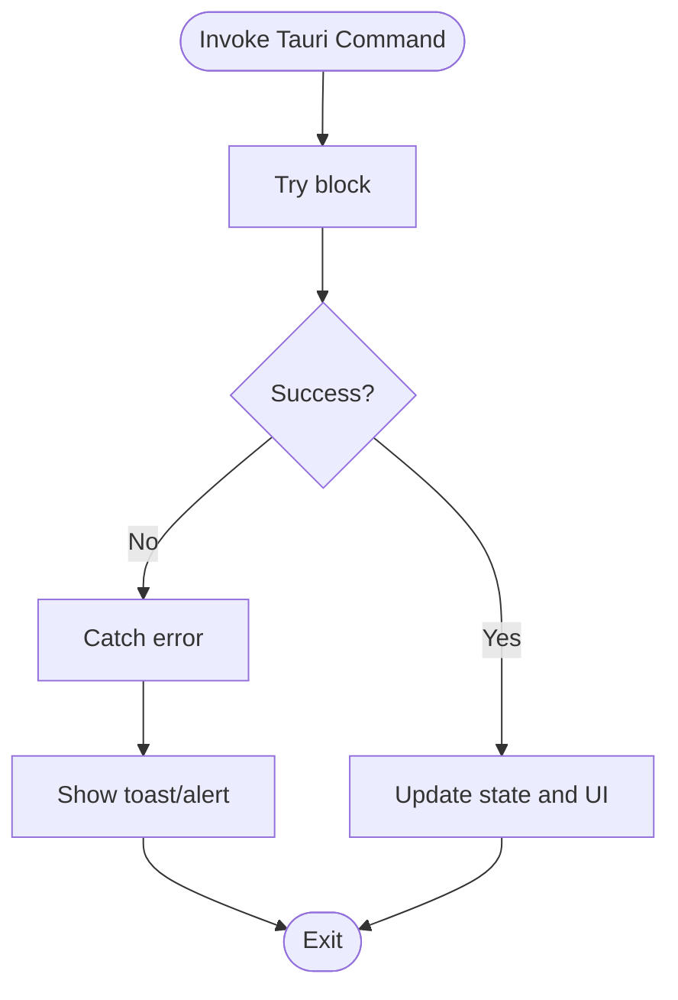
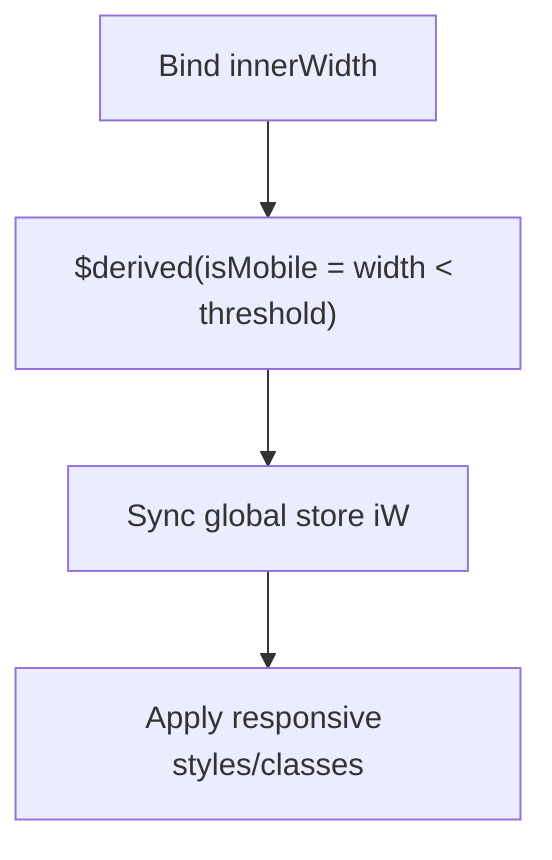
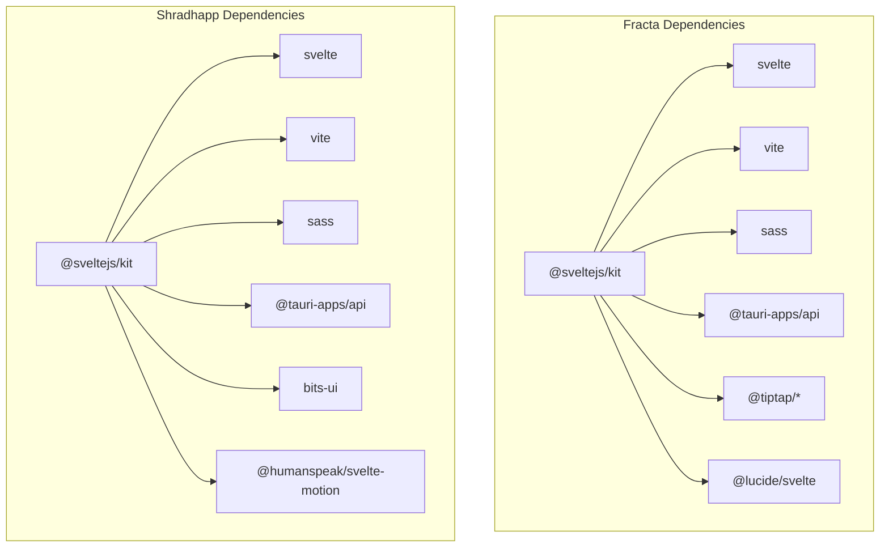

<cite>
**Referenced Files in This Document**
- [package.json](../../apps/fracta/package.json)
- [svelte.config.js](../../apps/fracta/svelte.config.js)
- [app.html](../../apps/fracta/src/app.html)
- [+layout.svelte](../../apps/fracta/src/routes/+layout.svelte)
- [ipc.ts](../../apps/fracta/src/lib/ipc.ts)
- [globalstores.ts](../../apps/fracta/src/lib/state/globalstores.ts)
- [prefs.svelte.ts](../../apps/fracta/src/lib/state/prefs.svelte.ts)
- [package.json](../../apps/shradhapp/package.json)
- [svelte.config.js](../../apps/shradhapp/svelte.config.js)
- [app.html](../../apps/shradhapp/src/app.html)
- [+layout.svelte](../../apps/shradhapp/src/routes/+layout.svelte)
</cite>

## Table of Contents
1. Introduction
2. Project Structure
3. Core Components
4. Architecture Overview
5. Detailed Component Analysis
6. Dependency Analysis
7. Performance Considerations
8. Troubleshooting Guide
9. Conclusion

## Introduction
This document explains the SvelteKit frontend architecture across two SvelteKit applications in the monorepo: apps/fracta and apps/shradhapp. It focuses on component-based architecture using Svelte 5 runes for reactive state management, routing patterns, layout composition, styling with SASS (.sass), Tauri integration via commands, error handling patterns, and performance optimization techniques. It also covers accessibility considerations, cross-browser compatibility, and mobile responsiveness.

## Project Structure
Both applications follow a standard SvelteKit structure:
- src/app.html defines the HTML shell.
- src/routes contains page and layout components following file-based routing conventions.
- src/lib holds shared libraries, components, styles, and state modules.
- Configuration is centralized in svelte.config.js and package.json.

**Diagram sources**
- [app.html:1-14](../../apps/fracta/src/app.html#L1-L14)
- [+layout.svelte:1-29](../../apps/fracta/src/routes/+layout.svelte#L1-L29)
- [ipc.ts:1-237](../../apps/fracta/src/lib/ipc.ts#L1-L237)
- [svelte.config.js:1-23](../../apps/fracta/svelte.config.js#L1-L23)
- [package.json:1-60](../../apps/fracta/package.json#L1-L60)
- [app.html:1-12](../../apps/shradhapp/src/app.html#L1-L12)
- [+layout.svelte:1-16](../../apps/shradhapp/src/routes/+layout.svelte#L1-L16)
- [svelte.config.js:1-24](../../apps/shradhapp/svelte.config.js#L1-L24)
- [package.json:1-48](../../apps/shradhapp/package.json#L1-L48)

**Section sources**
- [app.html:1-14](../../apps/fracta/src/app.html#L1-L14)
- [svelte.config.js:1-23](../../apps/fracta/svelte.config.js#L1-L23)
- [package.json:1-60](../../apps/fracta/package.json#L1-L60)
- [app.html:1-12](../../apps/shradhapp/src/app.html#L1-L12)
- [svelte.config.js:1-24](../../apps/shradhapp/svelte.config.js#L1-L24)
- [package.json:1-48](../../apps/shradhapp/package.json#L1-L48)

## Core Components
- Root layouts compose global UI, import global styles, and render child routes via snippets.
- Fracta’s root layout manages responsive width and theme data attributes; it uses Svelte 5 runes to derive mobile state and update global stores.
- Shradhapp’s root layout injects global head metadata and renders a Toaster instance alongside child routes.

Key responsibilities:
- Layout composition: +layout.svelte files define shared chrome and render children via {@render children()}.
- Global styles: imported from $lib/styles/index.sass (SASS-only).
- Reactive state: Svelte 5 runes ($props, $state, $derived, $effect) drive reactivity without legacy stores.

**Section sources**
- [+layout.svelte:1-29](../../apps/fracta/src/routes/+layout.svelte#L1-L29)
- [+layout.svelte:1-16](../../apps/shradhapp/src/routes/+layout.svelte#L1-L16)

## Architecture Overview
The system combines SvelteKit routing, Svelte 5 runes, and Tauri IPC for native capabilities.

**Diagram sources**
- [+layout.svelte:1-29](../../apps/fracta/src/routes/+layout.svelte#L1-L29)
- [ipc.ts:1-237](../../apps/fracta/src/lib/ipc.ts#L1-L237)

## Detailed Component Analysis

### Routing Patterns and Layout Composition
- File-based routing: +page.svelte for pages, +layout.svelte for nested layouts, +error.svelte for error boundaries.
- Layout composition: Use Snippet typing and {@render children()} to nest content.
- Global head and body setup: app.html provides base markup; layouts can add <svelte:head> or global components like Toaster.

[No sources needed since this diagram shows conceptual workflow, not actual code structure]

**Section sources**
- [+layout.svelte:1-29](../../apps/fracta/src/routes/+layout.svelte#L1-L29)
- [+layout.svelte:1-16](../../apps/shradhapp/src/routes/+layout.svelte#L1-L16)
- [app.html:1-14](../../apps/fracta/src/app.html#L1-L14)
- [app.html:1-12](../../apps/shradhapp/src/app.html#L1-L12)

### Styling Approach with SASS (.sass)
- All styles are written exclusively in single-tab indented SASS (.sass).
- Global styles are imported at the layout level from $lib/styles/index.sass.
- Scoped CSS within .svelte files remains available, but project-wide styling follows SASS conventions.

**Diagram sources**
- [+layout.svelte:1-29](../../apps/fracta/src/routes/+layout.svelte#L1-L29)

**Section sources**
- [+layout.svelte:1-29](../../apps/fracta/src/routes/+layout.svelte#L1-L29)

### State Management with Svelte 5 Runes
- Fracta’s root layout demonstrates:
  - $props for typed props (children snippet).
  - $state for local reactive variables (width).
  - $derived for computed values (isMobile).
  - $effect for side effects (syncing global store and theme dataset).
- Shared state modules under $lib/state use .svelte.ts files to encapsulate reactive logic with runes.

**Diagram sources**
- [+layout.svelte:1-29](../../apps/fracta/src/routes/+layout.svelte#L1-L29)
- [globalstores.ts](../../apps/fracta/src/lib/state/globalstores.ts)
- [prefs.svelte.ts](../../apps/fracta/src/lib/state/prefs.svelte.ts)

**Section sources**
- [+layout.svelte:1-29](../../apps/fracta/src/routes/+layout.svelte#L1-L29)
- [globalstores.ts](../../apps/fracta/src/lib/state/globalstores.ts)
- [prefs.svelte.ts](../../apps/fracta/src/lib/state/prefs.svelte.ts)

### Tauri Integration and Command Handling
- The IPC layer centralizes all Tauri invocations through @tauri-apps/api/core invoke.
- Functions expose strongly-typed interfaces for workspace operations, vault management, auto-tagging, and GGUF model loading/unloading.
- Environment detection helper determines if running inside Tauri webview.

**Diagram sources**
- [ipc.ts:1-237](../../apps/fracta/src/lib/ipc.ts#L1-L237)

**Section sources**
- [ipc.ts:1-237](../../apps/fracta/src/lib/ipc.ts#L1-L237)

### Error Handling Patterns
- SvelteKit supports +error.svelte per-route or global error boundary.
- For Tauri calls, wrap invoke promises with try/catch and surface user-friendly messages via toast or alert components.
- Validate inputs before invoking commands to reduce backend errors.

[No sources needed since this diagram shows conceptual workflow, not actual code structure]

### Accessibility Considerations
- Ensure semantic HTML elements and proper ARIA attributes in components.
- Manage focus when opening modals/toasts; trap focus within modal dialogs.
- Provide keyboard navigation and screen reader labels for interactive elements.
- Respect prefers-reduced-motion and provide alternatives for animations.

[No sources needed since this section doesn't analyze specific files]

### Cross-Browser Compatibility
- Polyfills and feature detection where necessary for older browsers.
- Avoid experimental APIs; prefer stable Web APIs exposed by Tauri.
- Test on major desktop browsers and WebView engines used by Tauri.

[No sources needed since this section doesn't analyze specific files]

### Mobile Responsiveness Strategies
- Derive breakpoints reactively using $derived from window width.
- Apply responsive classes or conditional rendering based on isMobile.
- Use fluid typography and spacing; test touch interactions.

**Diagram sources**
- [+layout.svelte:1-29](../../apps/fracta/src/routes/+layout.svelte#L1-L29)

**Section sources**
- [+layout.svelte:1-29](../../apps/fracta/src/routes/+layout.svelte#L1-L29)

## Dependency Analysis
- Fracta depends on SvelteKit, Vite, Sass, Tauri API, and various editor and visualization libraries.
- Shradhapp includes additional UI primitives and animation libraries.
- Both apps configure static adapters for deployment and use TypeScript.

**Diagram sources**
- [package.json:1-60](../../apps/fracta/package.json#L1-L60)
- [package.json:1-48](../../apps/shradhapp/package.json#L1-L48)

**Section sources**
- [package.json:1-60](../../apps/fracta/package.json#L1-L60)
- [package.json:1-48](../../apps/shradhapp/package.json#L1-L48)

## Performance Considerations
- Prefer $state.raw() for large immutable datasets to avoid deep proxy overhead.
- Use $derived for computed values instead of manual subscriptions.
- Minimize heavy work in $effect; offload to workers or debounce/throttle as needed.
- Lazy-load heavy components and assets; leverage SvelteKit’s route-level imports.
- Keep IPC calls batched and memoized where possible; cache results in runes.

[No sources needed since this section provides general guidance]

## Troubleshooting Guide
- Tauri invocation failures: check environment detection and ensure commands are registered in Rust; log payloads and responses.
- Style issues: verify SASS compilation and ensure global styles are imported once at the layout level.
- State inconsistencies: audit rune dependencies; ensure derived values do not mutate source state.
- Build configuration: confirm adapter fallback and preprocessors are correctly set in svelte.config.js.

**Section sources**
- [svelte.config.js:1-23](../../apps/fracta/svelte.config.js#L1-L23)
- [svelte.config.js:1-24](../../apps/shradhapp/svelte.config.js#L1-L24)

## Conclusion
The SvelteKit frontend leverages Svelte 5 runes for fine-grained reactivity, file-based routing for clear structure, and SASS for consistent styling. Tauri integration is centralized through a typed IPC layer, enabling robust native interactions. By adhering to the outlined patterns—runes-driven state, modular layouts, scoped and global SASS styles, and disciplined error handling—the applications achieve maintainable, performant, and accessible user experiences across platforms.
