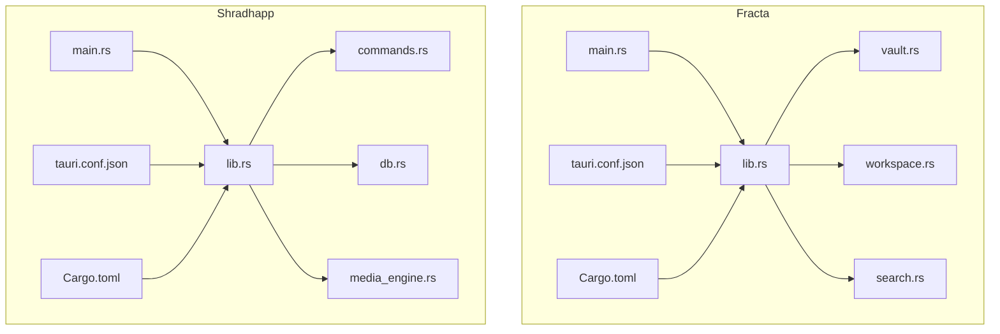
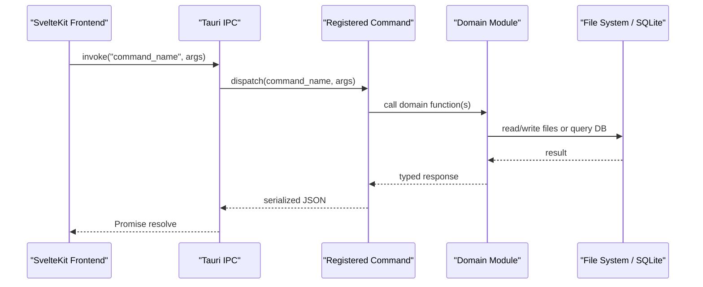
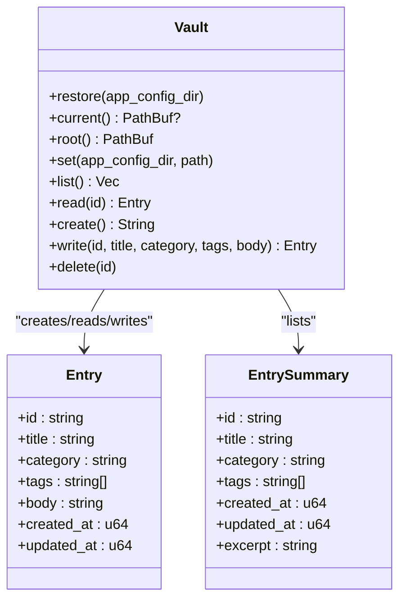
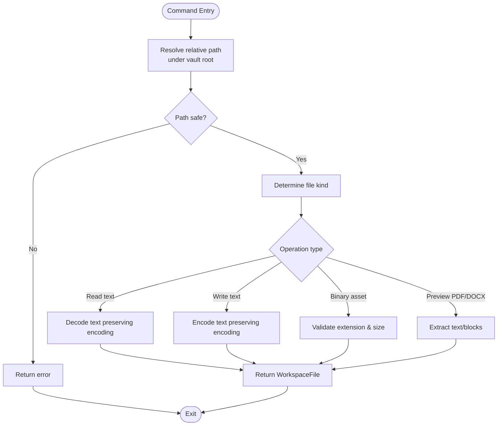
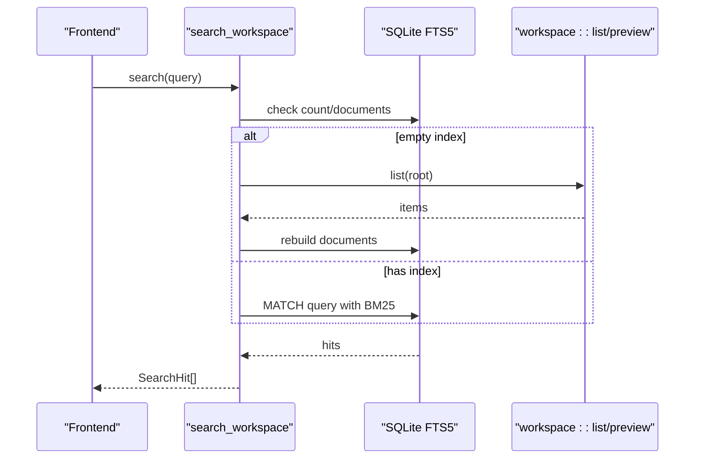
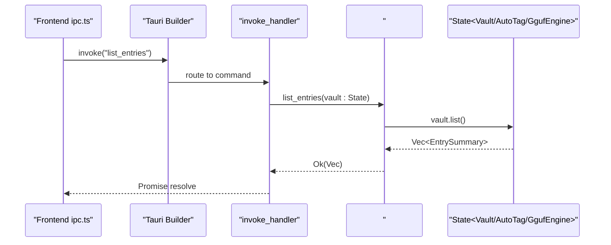
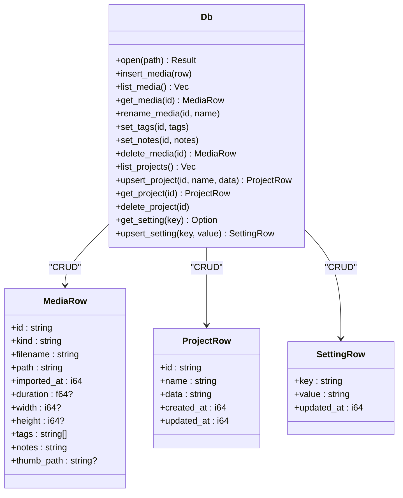
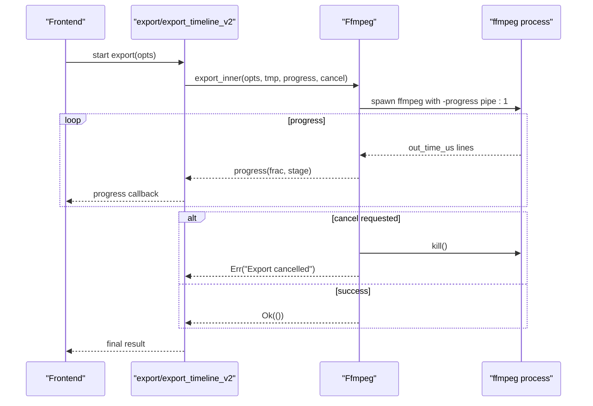
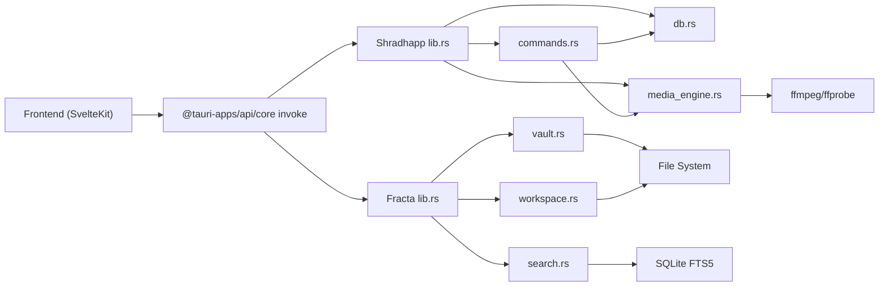

<cite>
**Referenced Files in This Document**
- [Cargo.toml (fracta)](../../apps/fracta/src-tauri/Cargo.toml)
- [main.rs (fracta)](../../apps/fracta/src-tauri/src/main.rs)
- [lib.rs (fracta)](../../apps/fracta/src-tauri/src/lib.rs)
- [vault.rs](../../apps/fracta/src-tauri/src/vault.rs)
- [workspace.rs](../../apps/fracta/src-tauri/src/workspace.rs)
- [search.rs](../../apps/fracta/src-tauri/src/search.rs)
- [tauri.conf.json (fracta)](../../apps/fracta/src-tauri/tauri.conf.json)
- [ipc.ts](../../apps/fracta/src/lib/ipc.ts)
- [Cargo.toml (shradhapp)](../../apps/shradhapp/src-tauri/Cargo.toml)
- [main.rs (shradhapp)](../../apps/shradhapp/src-tauri/src/main.rs)
- [lib.rs (shradhapp)](../../apps/shradhapp/src-tauri/src/lib.rs)
- [commands.rs](../../apps/shradhapp/src-tauri/src/commands.rs)
- [db.rs](../../apps/shradhapp/src-tauri/src/db.rs)
- [media_engine.rs](../../apps/shradhapp/src-tauri/src/media_engine.rs)
- [tauri.conf.json (shradhapp)](../../apps/shradhapp/src-tauri/tauri.conf.json)
</cite>

## Table of Contents
1. [Introduction](#introduction)
2. [Project Structure](#project-structure)
3. [Core Components](#core-components)
4. [Architecture Overview](#architecture-overview)
5. [Detailed Component Analysis](#detailed-component-analysis)
6. [Dependency Analysis](#dependency-analysis)
7. [Performance Considerations](#performance-considerations)
8. [Troubleshooting Guide](#troubleshooting-guide)
9. [Conclusion](#conclusion)

## Introduction
This document explains the Rust-based Tauri 2 backend architecture across two applications:
- Fracta: a vault and workspace editor with search, auto-tagging, and local LLM integration.
- Shradhapp: a personal video assembly app with media management, audio processing, and project export.

The documentation covers command registration patterns, IPC communication between SvelteKit frontend and Rust backend, module organization, security model, file system access patterns, cross-platform considerations, database integration with SQLite, background task management, and plugin architecture patterns.

## Project Structure
Each Tauri application follows a consistent layout:
- A minimal main.rs that delegates to a library entry point.
- A lib.rs that configures Tauri, manages state, registers commands, and wires plugins.
- Feature modules encapsulating domain logic (e.g., vault, workspace, search, commands, db, media engine).
- tauri.conf.json for windowing, asset protocol, and CSP settings.
- Cargo.toml declaring dependencies and target-specific features.

**Diagram sources**
- [main.rs (fracta):1-7](../../apps/fracta/src-tauri/src/main.rs#L1-L7)
- [lib.rs (fracta):431-497](../../apps/fracta/src-tauri/src/lib.rs#L431-L497)
- [tauri.conf.json (fracta):1-48](../../apps/fracta/src-tauri/tauri.conf.json#L1-L48)
- [Cargo.toml (fracta):1-44](../../apps/fracta/src-tauri/Cargo.toml#L1-L44)
- [main.rs (shradhapp):1-7](../../apps/shradhapp/src-tauri/src/main.rs#L1-L7)
- [lib.rs (shradhapp):10-66](../../apps/shradhapp/src-tauri/src/lib.rs#L10-L66)
- [tauri.conf.json (shradhapp):1-44](../../apps/shradhapp/src-tauri/tauri.conf.json#L1-L44)
- [Cargo.toml (shradhapp):1-27](../../apps/shradhapp/src-tauri/Cargo.toml#L1-L27)

**Section sources**
- [main.rs (fracta):1-7](../../apps/fracta/src-tauri/src/main.rs#L1-L7)
- [lib.rs (fracta):431-497](../../apps/fracta/src-tauri/src/lib.rs#L431-L497)
- [tauri.conf.json (fracta):1-48](../../apps/fracta/src-tauri/tauri.conf.json#L1-L48)
- [Cargo.toml (fracta):1-44](../../apps/fracta/src-tauri/Cargo.toml#L1-L44)
- [main.rs (shradhapp):1-7](../../apps/shradhapp/src-tauri/src/main.rs#L1-L7)
- [lib.rs (shradhapp):10-66](../../apps/shradhapp/src-tauri/src/lib.rs#L10-L66)
- [tauri.conf.json (shradhapp):1-44](../../apps/shradhapp/src-tauri/tauri.conf.json#L1-L44)
- [Cargo.toml (shradhapp):1-27](../../apps/shradhapp/src-tauri/Cargo.toml#L1-L27)

## Core Components
- Fracta core modules:
  - Vault: on-disk .md entries with frontmatter, safe id resolution, and trash-aware deletion.
  - Workspace: recursive file operations, encoding preservation, CSV/JSON validation, PDF/DOCX preview, asset extraction, and OS integration helpers.
  - Search: SQLite FTS5 index scoped to configuration directory; incremental updates via filesystem events.
  - Auto-tagging: clipboard source detection and rule-based tagging.
  - GGUF engine: local LLM server lifecycle management.
- Shradhapp core modules:
  - Commands: typed Tauri commands for media, projects, settings, YouTube listing, and exports.
  - Database: SQLite schema for media, projects, and settings with WAL mode.
  - Media engine: ffmpeg/ffprobe orchestration for probing, thumbnails, waveform, cleanup, repair, and timeline export.

**Section sources**
- [vault.rs:1-495](../../apps/fracta/src-tauri/src/vault.rs#L1-L495)
- [workspace.rs:1-800](../../apps/fracta/src-tauri/src/workspace.rs#L1-L800)
- [search.rs:1-346](../../apps/fracta/src-tauri/src/search.rs#L1-L346)
- [lib.rs (fracta):431-497](../../apps/fracta/src-tauri/src/lib.rs#L431-L497)
- [commands.rs:1-800](../../apps/shradhapp/src-tauri/src/commands.rs#L1-L800)
- [db.rs:1-334](../../apps/shradhapp/src-tauri/src/db.rs#L1-L334)
- [media_engine.rs:1-800](../../apps/shradhapp/src-tauri/src/media_engine.rs#L1-L800)

## Architecture Overview
Tauri 2 is used as the native runtime. The frontend calls typed commands via @tauri-apps/api/core invoke. Commands are registered in lib.rs using tauri::generate_handler! and receive shared state managed by tauri::Builder.manage.

**Diagram sources**
- [lib.rs (fracta):454-494](../../apps/fracta/src-tauri/src/lib.rs#L454-L494)
- [lib.rs (shradhapp):39-63](../../apps/shradhapp/src-tauri/src/lib.rs#L39-L63)
- [ipc.ts:1-237](../../apps/fracta/src/lib/ipc.ts#L1-L237)

## Detailed Component Analysis

### Fracta: Vault Management
Vault provides secure CRUD over .md entries with frontmatter metadata. It enforces path safety by validating ids and canonicalizing paths within the chosen vault root. Deletion uses OS Trash when available.

**Diagram sources**
- [vault.rs:22-54](../../apps/fracta/src-tauri/src/vault.rs#L22-L54)
- [vault.rs:73-278](../../apps/fracta/src-tauri/src/vault.rs#L73-L278)

**Section sources**
- [vault.rs:1-495](../../apps/fracta/src-tauri/src/vault.rs#L1-L495)

### Fracta: Workspace Operations
Workspace exposes safe, recursive file operations under the selected project root. It validates paths, preserves encodings, validates CSV/JSON, extracts assets, previews PDF/DOCX, and integrates with OS shell for open/reveal/print.

**Diagram sources**
- [workspace.rs:143-173](../../apps/fracta/src-tauri/src/workspace.rs#L143-L173)
- [workspace.rs:257-285](../../apps/fracta/src-tauri/src/workspace.rs#L257-L285)
- [workspace.rs:384-430](../../apps/fracta/src-tauri/src/workspace.rs#L384-L430)
- [workspace.rs:687-767](../../apps/fracta/src-tauri/src/workspace.rs#L687-L767)

**Section sources**
- [workspace.rs:1-800](../../apps/fracta/src-tauri/src/workspace.rs#L1-L800)

### Fracta: Search Functionality
Search maintains an SQLite FTS5 index stored under the app’s configuration directory. Rebuild scans the workspace; update_paths applies incremental changes based on filesystem events. Queries use BM25 scoring and snippet generation.

**Diagram sources**
- [search.rs:157-193](../../apps/fracta/src-tauri/src/search.rs#L157-L193)
- [search.rs:24-36](../../apps/fracta/src-tauri/src/search.rs#L24-L36)
- [search.rs:42-86](../../apps/fracta/src-tauri/src/search.rs#L42-L86)

**Section sources**
- [search.rs:1-346](../../apps/fracta/src-tauri/src/search.rs#L1-L346)

### Fracta: IPC and Command Registration
Commands are declared with #[tauri::command] and registered in a single handler. Shared state (Vault, AutoTag, GgufEngine) is injected via State. Filesystem watchers emit events to the frontend.

**Diagram sources**
- [lib.rs (fracta):454-494](../../apps/fracta/src-tauri/src/lib.rs#L454-L494)
- [ipc.ts:1-237](../../apps/fracta/src/lib/ipc.ts#L1-L237)

**Section sources**
- [lib.rs (fracta):1-497](../../apps/fracta/src-tauri/src/lib.rs#L1-L497)
- [ipc.ts:1-237](../../apps/fracta/src/lib/ipc.ts#L1-L237)

### Shradhapp: Commands and Database
Commands expose typed APIs for media import, renaming, tagging, notes, project CRUD, settings, and YouTube channel listing. The database layer initializes tables with WAL mode and persists media rows, projects, and settings.

**Diagram sources**
- [db.rs:38-82](../../apps/shradhapp/src-tauri/src/db.rs#L38-L82)
- [db.rs:86-192](../../apps/shradhapp/src-tauri/src/db.rs#L86-L192)
- [db.rs:196-303](../../apps/shradhapp/src-tauri/src/db.rs#L196-L303)

**Section sources**
- [commands.rs:1-800](../../apps/shradhapp/src-tauri/src/commands.rs#L1-L800)
- [db.rs:1-334](../../apps/shradhapp/src-tauri/src/db.rs#L1-L334)

### Shradhapp: Media Engine and Background Tasks
The media engine centralizes all ffmpeg/ffprobe usage. It locates binaries, probes media, generates thumbnails and waveforms, cleans up audio, repairs ticks, and exports timelines with progress callbacks and cancellation support.

**Diagram sources**
- [media_engine.rs:256-412](../../apps/shradhapp/src-tauri/src/media_engine.rs#L256-L412)
- [media_engine.rs:587-655](../../apps/shradhapp/src-tauri/src/media_engine.rs#L587-L655)

**Section sources**
- [media_engine.rs:1-800](../../apps/shradhapp/src-tauri/src/media_engine.rs#L1-L800)

### Cross-Platform Considerations
- Shell execution: Windows uses cmd, others use sh.
- Open/reveal: macOS uses open, Windows uses explorer, Linux uses xdg-open.
- FFmpeg discovery: PATH first, then platform-specific fallback directories.
- Window state plugin enabled on desktop platforms only.

**Section sources**
- [lib.rs (fracta):194-207](../../apps/fracta/src-tauri/src/lib.rs#L194-L207)
- [workspace.rs:638-682](../../apps/fracta/src-tauri/src/workspace.rs#L638-L682)
- [media_engine.rs:29-70](../../apps/shradhapp/src-tauri/src/media_engine.rs#L29-L70)
- [lib.rs (fracta):435-438](../../apps/fracta/src-tauri/src/lib.rs#L435-L438)

### Security Model and File System Access Patterns
- Vault id validation prevents traversal attacks; only .md files under the configured vault are accessible.
- Workspace resolve ensures paths remain within the project root and rejects symlinks outside it.
- Asset exposure limited to allowed MIME types and sizes; binary bytes never leak host paths to JS.
- CSP restricts script/style/object sources; asset protocol scope limited to $APPDATA where applicable.

**Section sources**
- [vault.rs:115-126](../../apps/fracta/src-tauri/src/vault.rs#L115-L126)
- [workspace.rs:143-173](../../apps/fracta/src-tauri/src/workspace.rs#L143-L173)
- [workspace.rs:290-364](../../apps/fracta/src-tauri/src/workspace.rs#L290-L364)
- [tauri.conf.json (fracta):32-34](../../apps/fracta/src-tauri/tauri.conf.json#L32-L34)
- [tauri.conf.json (shradhapp):31-36](../../apps/shradhapp/src-tauri/tauri.conf.json#L31-L36)

### Plugin Architecture Patterns
- Desktop-only window state plugin for persistence of window geometry.
- Dialog plugin for native file dialogs in Shradhapp.
- Custom state management via tauri::Builder.manage for long-lived services (Vault, AutoTag, GgufEngine, AppState).

**Section sources**
- [lib.rs (fracta):435-438](../../apps/fracta/src-tauri/src/lib.rs#L435-L438)
- [lib.rs (shradhapp):13-14](../../apps/shradhapp/src-tauri/src/lib.rs#L13-L14)
- [lib.rs (fracta):441-443](../../apps/fracta/src-tauri/src/lib.rs#L441-L443)
- [lib.rs (shradhapp):29-36](../../apps/shradhapp/src-tauri/src/lib.rs#L29-L36)

## Dependency Analysis

**Diagram sources**
- [lib.rs (fracta):454-494](../../apps/fracta/src-tauri/src/lib.rs#L454-L494)
- [lib.rs (shradhapp):39-63](../../apps/shradhapp/src-tauri/src/lib.rs#L39-L63)
- [search.rs:195-219](../../apps/fracta/src-tauri/src/search.rs#L195-L219)
- [media_engine.rs:75-106](../../apps/shradhapp/src-tauri/src/media_engine.rs#L75-L106)

**Section sources**
- [lib.rs (fracta):454-494](../../apps/fracta/src-tauri/src/lib.rs#L454-L494)
- [lib.rs (shradhapp):39-63](../../apps/shradhapp/src-tauri/src/lib.rs#L39-L63)

## Performance Considerations
- Indexing: Full rebuild on demand; incremental updates avoid rescanning unchanged content.
- I/O: Text encoding preserved to avoid re-encoding overhead; CSV/JSON validated before write.
- Export pipeline: Normalization phase followed by stream-copy concat when possible; fallback re-encode for robustness.
- Progress feedback: ffmpeg progress parsed from stdout to provide granular UI updates without blocking.
- Output bounding: Terminal output capped to prevent memory spikes.

[No sources needed since this section provides general guidance]

## Troubleshooting Guide
- No vault configured: Use pick_vault to set the vault directory; ensure the path exists and is readable.
- Search returns no results: Trigger rebuild_workspace_index; verify .fractaignore does not exclude content.
- FFmpeg missing: Install ffmpeg/ffprobe and ensure PATH includes their location; check get_runtime_info for status.
- Export failures: Inspect last few stderr lines returned by ffmpeg; confirm input media validity and permissions.
- Print dialog unavailable: Use window.print() fallback if native print fails.

**Section sources**
- [lib.rs (fracta):182-188](../../apps/fracta/src-tauri/src/lib.rs#L182-L188)
- [search.rs:24-36](../../apps/fracta/src-tauri/src/search.rs#L24-L36)
- [media_engine.rs:75-106](../../apps/shradhapp/src-tauri/src/media_engine.rs#L75-L106)
- [media_engine.rs:587-655](../../apps/shradhapp/src-tauri/src/media_engine.rs#L587-L655)

## Conclusion
The Tauri 2 backend is organized into clear, focused modules that enforce security, maintain performance, and provide rich functionality across vault management, workspace operations, search, and media processing. IPC is typed and centralized, enabling predictable interactions between the SvelteKit frontend and Rust backend. SQLite-backed persistence and ffmpeg-driven media pipelines are integrated through well-defined commands and stateful services, ensuring scalability and reliability across platforms.
