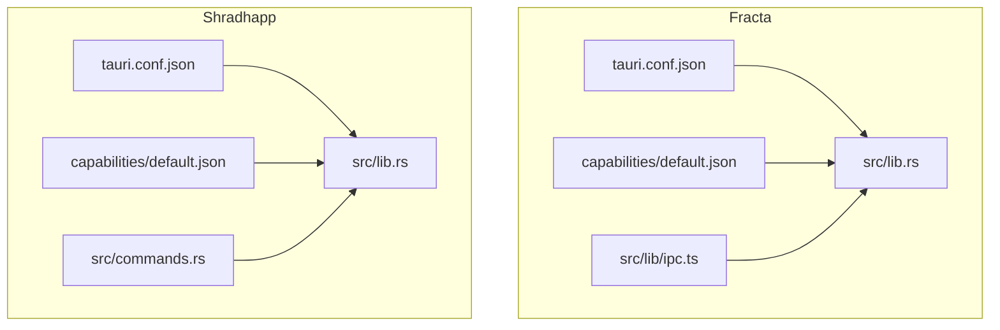
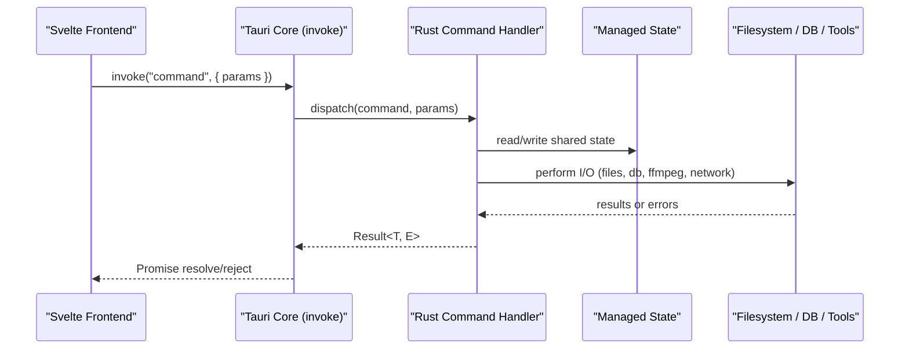
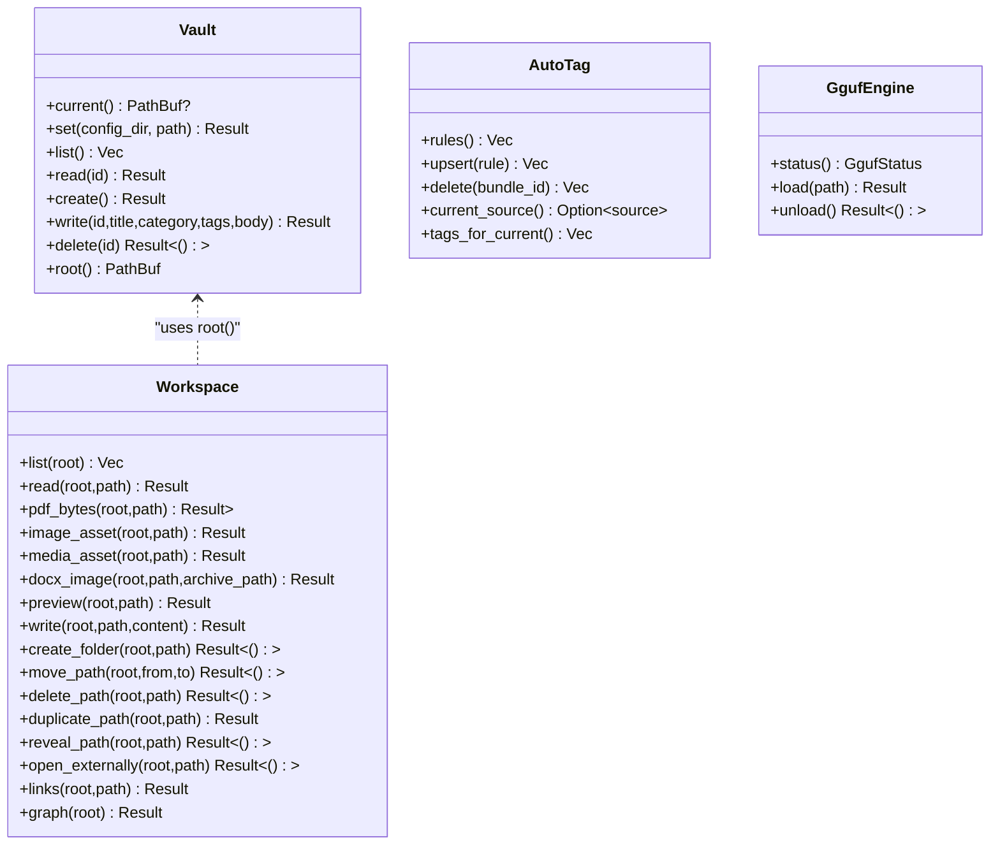
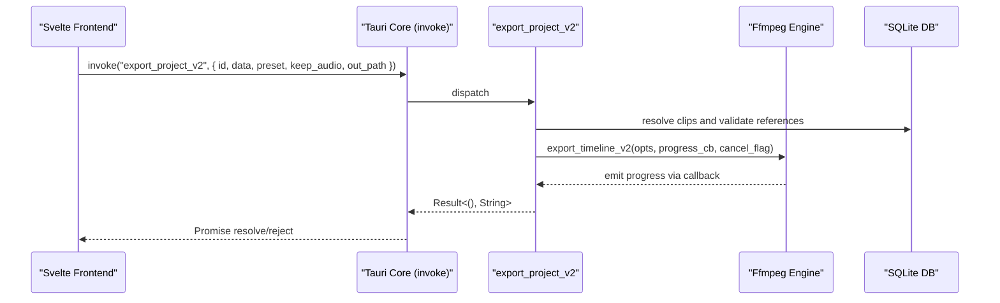
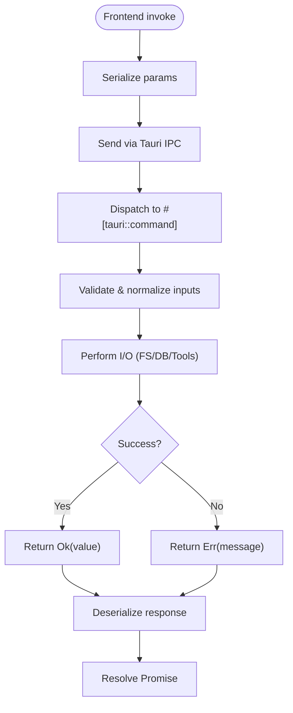
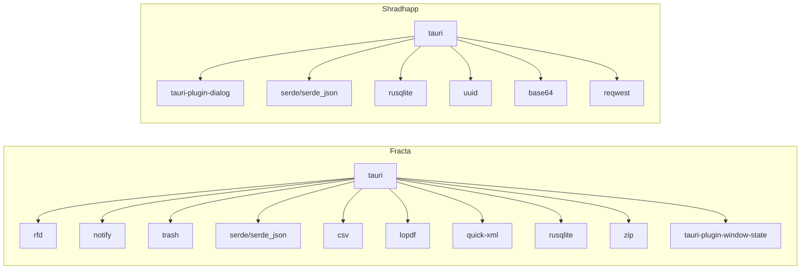

<cite>
**Referenced Files in This Document**
- [apps/fracta/src-tauri/src/lib.rs](../../apps/fracta/src-tauri/src/lib.rs)
- [apps/fracta/src/lib/ipc.ts](../../apps/fracta/src/lib/ipc.ts)
- [apps/fracta/src-tauri/tauri.conf.json](../../apps/fracta/src-tauri/tauri.conf.json)
- [apps/fracta/src-tauri/capabilities/default.json](../../apps/fracta/src-tauri/capabilities/default.json)
- [apps/shradhapp/src-tauri/src/lib.rs](../../apps/shradhapp/src-tauri/src/lib.rs)
- [apps/shradhapp/src-tauri/src/commands.rs](../../apps/shradhapp/src-tauri/src/commands.rs)
- [apps/shradhapp/src-tauri/tauri.conf.json](../../apps/shradhapp/src-tauri/tauri.conf.json)
- [apps/shradhapp/src-tauri/capabilities/default.json](../../apps/shradhapp/src-tauri/capabilities/default.json)
</cite>

## Table of Contents
1. [Introduction](#introduction)
2. [Project Structure](#project-structure)
3. [Core Components](#core-components)
4. [Architecture Overview](#architecture-overview)
5. [Detailed Component Analysis](#detailed-component-analysis)
6. [Dependency Analysis](#dependency-analysis)
7. [Performance Considerations](#performance-considerations)
8. [Troubleshooting Guide](#troubleshooting-guide)
9. [Conclusion](#conclusion)

## Introduction
This document provides API documentation for Tauri commands that expose backend functionality to the frontend across two applications: Fracta (knowledge workspace) and Shradhapp (media and video assembly). It covers command registration patterns, parameter validation, error handling strategies, security considerations, and IPC communication protocols. It also includes examples of how commands are defined in Rust and invoked from TypeScript/Svelte components, along with guidance on command lifecycle, state management, and authentication/authorization mechanisms where applicable.

## Project Structure
The repository contains two Tauri-based applications:
- Fracta: A knowledge workspace app with file system operations, search indexing, auto-tagging, and local GGUF model management.
- Shradhapp: A media bank and video assembly app with SQLite-backed metadata, FFmpeg-based processing, project timeline export, and YouTube channel listing.

**Diagram sources**
- [apps/fracta/src-tauri/tauri.conf.json:1-48](../../apps/fracta/src-tauri/tauri.conf.json#L1-L48)
- [apps/fracta/src-tauri/capabilities/default.json:1-15](../../apps/fracta/src-tauri/capabilities/default.json#L1-L15)
- [apps/fracta/src-tauri/src/lib.rs:431-497](../../apps/fracta/src-tauri/src/lib.rs#L431-L497)
- [apps/fracta/src/lib/ipc.ts:1-237](../../apps/fracta/src/lib/ipc.ts#L1-L237)
- [apps/shradhapp/src-tauri/tauri.conf.json:1-44](../../apps/shradhapp/src-tauri/tauri.conf.json#L1-L44)
- [apps/shradhapp/src-tauri/capabilities/default.json:1-18](../../apps/shradhapp/src-tauri/capabilities/default.json#L1-L18)
- [apps/shradhapp/src-tauri/src/lib.rs:10-66](../../apps/shradhapp/src-tauri/src/lib.rs#L10-L66)
- [apps/shradhapp/src-tauri/src/commands.rs:1-1357](../../apps/shradhapp/src-tauri/src/commands.rs#L1-L1357)

**Section sources**
- [apps/fracta/src-tauri/tauri.conf.json:1-48](../../apps/fracta/src-tauri/tauri.conf.json#L1-L48)
- [apps/fracta/src-tauri/capabilities/default.json:1-15](../../apps/fracta/src-tauri/capabilities/default.json#L1-L15)
- [apps/fracta/src-tauri/src/lib.rs:431-497](../../apps/fracta/src-tauri/src/lib.rs#L431-L497)
- [apps/fracta/src/lib/ipc.ts:1-237](../../apps/fracta/src/lib/ipc.ts#L1-L237)
- [apps/shradhapp/src-tauri/tauri.conf.json:1-44](../../apps/shradhapp/src-tauri/tauri.conf.json#L1-L44)
- [apps/shradhapp/src-tauri/capabilities/default.json:1-18](../../apps/shradhapp/src-tauri/capabilities/default.json#L1-L18)
- [apps/shradhapp/src-tauri/src/lib.rs:10-66](../../apps/shradhapp/src-tauri/src/lib.rs#L10-L66)
- [apps/shradhapp/src-tauri/src/commands.rs:1-1357](../../apps/shradhapp/src-tauri/src/commands.rs#L1-L1357)

## Core Components
- Command Registration:
  - Fracta registers commands via tauri::generate_handler! in its entry point, exposing vault, workspace, auto-tag, and GGUF operations.
  - Shradhapp registers commands similarly, exposing media, projects, settings, and export operations.
- State Management:
  - Fracta uses managed singletons like Vault, AutoTag, and GgufEngine.
  - Shradhapp manages AppState containing a database handle, directories, ffmpeg availability, and cancellation tokens.
- IPC Layer:
  - Fracta exposes typed TypeScript functions in ipc.ts that call invoke('command_name', { params }).
  - Shradhapp’s commands are invoked through Tauri’s core invoke mechanism; types are aligned with Rust structs.

Key patterns:
- #[tauri::command] macros define handlers.
- State is injected via State<T>.
- Errors are returned as Result<T, String> or custom result wrappers.
- Long-running tasks use async_runtime::spawn_blocking to avoid blocking the UI thread.

**Section sources**
- [apps/fracta/src-tauri/src/lib.rs:42-497](../../apps/fracta/src-tauri/src/lib.rs#L42-L497)
- [apps/fracta/src/lib/ipc.ts:1-237](../../apps/fracta/src/lib/ipc.ts#L1-L237)
- [apps/shradhapp/src-tauri/src/lib.rs:10-66](../../apps/shradhapp/src-tauri/src/lib.rs#L10-L66)
- [apps/shradhapp/src-tauri/src/commands.rs:1-1357](../../apps/shradhapp/src-tauri/src/commands.rs#L1-L1357)

## Architecture Overview
The Tauri architecture connects the Svelte frontend to Rust backend commands over an IPC channel. Commands encapsulate business logic, access filesystems, databases, and external tools, and return structured results or errors.

**Diagram sources**
- [apps/fracta/src-tauri/src/lib.rs:454-494](../../apps/fracta/src-tauri/src/lib.rs#L454-L494)
- [apps/shradhapp/src-tauri/src/lib.rs:39-64](../../apps/shradhapp/src-tauri/src/lib.rs#L39-L64)
- [apps/fracta/src/lib/ipc.ts:1-237](../../apps/fracta/src/lib/ipc.ts#L1-L237)

## Detailed Component Analysis

### Fracta Commands
Fracta exposes commands for vault management, recursive workspace operations, auto-tagging rules, and local GGUF model loading.

- Vault commands:
  - vault_status, pick_vault, list_entries, read_entry, create_entry, write_entry, delete_entry
- Workspace commands:
  - list_workspace, read_workspace_file, read_workspace_pdf_bytes, read_workspace_image_asset, read_workspace_media_asset, read_workspace_docx_image
  - watch_workspace, run_workspace_terminal, print_workspace
  - preview_workspace_document, write_workspace_file, create_workspace_folder, move_workspace_path, delete_workspace_path, duplicate_workspace_path, reveal_workspace_path, open_workspace_externally
  - workspace_links, workspace_graph, rebuild_workspace_index, search_workspace
  - convert_csv_to_json, convert_json_to_csv
- Auto-tag commands:
  - list_app_rules, upsert_app_rule, delete_app_rule, current_clipboard_source, autotags_now
- GGUF commands:
  - gguf_status, pick_gguf, gguf_load, gguf_unload

Parameter validation and error handling:
- Input sanitization and checks occur within handlers (e.g., empty command guard for terminal).
- Errors are returned as strings or wrapped result types; some commands return custom result structures.
- Long-running operations (terminal execution, GGUF load) use spawn_blocking to keep UI responsive.

State management:
- Managed states include Vault, AutoTag, and GgufEngine.
- File watcher is stored globally and updated per workspace selection.

Security considerations:
- Terminal execution runs with bounded runtime and output size limits.
- CSP configured to restrict script/styles/connect sources.
- Native dialogs used for user-initiated actions (folder picker, GGUF file picker).

Frontend invocation:
- Typed functions in ipc.ts wrap invoke calls with strongly-typed parameters and return types.

**Diagram sources**
- [apps/fracta/src-tauri/src/lib.rs:42-396](../../apps/fracta/src-tauri/src/lib.rs#L42-L396)

**Section sources**
- [apps/fracta/src-tauri/src/lib.rs:42-396](../../apps/fracta/src-tauri/src/lib.rs#L42-L396)
- [apps/fracta/src/lib/ipc.ts:1-237](../../apps/fracta/src/lib/ipc.ts#L1-L237)
- [apps/fracta/src-tauri/tauri.conf.json:32-34](../../apps/fracta/src-tauri/tauri.conf.json#L32-L34)
- [apps/fracta/src-tauri/capabilities/default.json:8-13](../../apps/fracta/src-tauri/capabilities/default.json#L8-L13)

### Shradhapp Commands
Shradhapp exposes commands for media management, voiceover recording, audio cleanup, project CRUD, timeline export, and YouTube channel listing.

- Settings:
  - get_app_settings, update_app_settings, reset_app_settings, get_runtime_info
- Media:
  - list_media, import_files, rename_media, set_tags, set_notes, delete_media
- Voiceover:
  - save_recording, cleanup_audio, repair_audio_ticks
- Projects:
  - list_projects, create_project, update_project, map_project_v1_to_v2, delete_project, duplicate_project
- Export:
  - export_project, export_project_v2, cancel_export
- YouTube:
  - list_youtube_channel_videos

Parameter validation and error handling:
- Strong normalization and defaulting for settings.
- Input sanitization for filenames and tags.
- Robust error messages for missing files, unsupported formats, and corrupted data.
- Long-running exports use spawn_blocking and emit progress events.

State management:
- AppState holds database connection, directories, ffmpeg status, and cancellation tokens keyed by export id.

Security considerations:
- Asset protocol scope restricted to $APPDATA/**.
- External network requests use a controlled user agent and blocking client.

Frontend invocation:
- Commands are invoked via Tauri core invoke; types align with Rust structs defined in commands.rs.

**Diagram sources**
- [apps/shradhapp/src-tauri/src/commands.rs:1132-1194](../../apps/shradhapp/src-tauri/src/commands.rs#L1132-L1194)

**Section sources**
- [apps/shradhapp/src-tauri/src/commands.rs:1-1357](../../apps/shradhapp/src-tauri/src/commands.rs#L1-L1357)
- [apps/shradhapp/src-tauri/src/lib.rs:10-66](../../apps/shradhapp/src-tauri/src/lib.rs#L10-L66)
- [apps/shradhapp/src-tauri/tauri.conf.json:31-36](../../apps/shradhapp/src-tauri/tauri.conf.json#L31-L36)
- [apps/shradhapp/src-tauri/capabilities/default.json:6-16](../../apps/shradhapp/src-tauri/capabilities/default.json#L6-L16)

### Command Lifecycle and IPC Protocol
- Registration:
  - Commands are registered in the Tauri builder using generate_handler!.
- Invocation:
  - Frontend calls invoke('command', params) which serializes arguments and sends them over IPC.
- Execution:
  - The Rust handler receives parameters, validates inputs, accesses state, performs I/O, and returns a Result.
- Response:
  - Results are deserialized back into TypeScript types; errors propagate as rejected promises.

[No sources needed since this diagram shows conceptual workflow, not actual code structure]

## Dependency Analysis
- Fracta dependencies:
  - tauri, rfd, trash, notify, serde, csv, lopdf, quick-xml, rusqlite, zip, window-state plugin.
- Shradhapp dependencies:
  - tauri, tauri-plugin-dialog, serde, serde_json, rusqlite, uuid, base64, reqwest.

**Diagram sources**
- [apps/fracta/src-tauri/Cargo.toml:17-44](../../apps/fracta/src-tauri/Cargo.toml#L17-L44)
- [apps/shradhapp/src-tauri/Cargo.toml:15-27](../../apps/shradhapp/src-tauri/Cargo.toml#L15-L27)

**Section sources**
- [apps/fracta/src-tauri/Cargo.toml:17-44](../../apps/fracta/src-tauri/Cargo.toml#L17-L44)
- [apps/shradhapp/src-tauri/Cargo.toml:15-27](../../apps/shradhapp/src-tauri/Cargo.toml#L15-L27)

## Performance Considerations
- Avoid blocking the UI thread:
  - Use tauri::async_runtime::spawn_blocking for CPU-bound or long-running tasks (GGUF load, terminal execution, exports).
- Limit resource usage:
  - Terminal output bounded to prevent memory spikes.
  - Timeouts enforced for shell commands.
- Efficient I/O:
  - Use streaming readers for stdout/stderr concurrently.
  - Cache or index data where appropriate (workspace search index).
- Event-driven updates:
  - Emit workspace changes and export progress events to keep the UI reactive without polling.

[No sources needed since this section provides general guidance]

## Troubleshooting Guide
Common issues and resolutions:
- Command not found:
  - Ensure the command is registered in generate_handler! and matches the name invoked from the frontend.
- Permission denied:
  - Check capabilities configuration for required permissions (dialog, window-state, webview).
- CSP errors:
  - Verify tauri.conf.json security.csp allows necessary connect-src domains and protocols.
- Database errors:
  - Validate SQLite paths and ensure directories exist; check error messages returned by commands.
- FFmpeg not available:
  - Inspect get_runtime_info to confirm ffmpeg availability and message; install or locate binary accordingly.
- Export failures:
  - Confirm referenced media still exists; verify output directory validity; review progress events and cancellation flags.

**Section sources**
- [apps/fracta/src-tauri/tauri.conf.json:32-34](../../apps/fracta/src-tauri/tauri.conf.json#L32-L34)
- [apps/fracta/src-tauri/capabilities/default.json:8-13](../../apps/fracta/src-tauri/capabilities/default.json#L8-L13)
- [apps/shradhapp/src-tauri/tauri.conf.json:31-36](../../apps/shradhapp/src-tauri/tauri.conf.json#L31-L36)
- [apps/shradhapp/src-tauri/capabilities/default.json:6-16](../../apps/shradhapp/src-tauri/capabilities/default.json#L6-L16)
- [apps/shradhapp/src-tauri/src/commands.rs:204-216](../../apps/shradhapp/src-tauri/src/commands.rs#L204-L216)

## Conclusion
The Tauri commands in Fracta and Shradhapp provide robust, secure, and efficient bridges between the Svelte frontend and native backend capabilities. By following consistent registration patterns, validating inputs, returning structured errors, and leveraging async execution, these apps deliver responsive user experiences while maintaining strong security boundaries. For future enhancements, consider adding explicit authorization checks, expanding capability scopes judiciously, and standardizing error models across commands.
