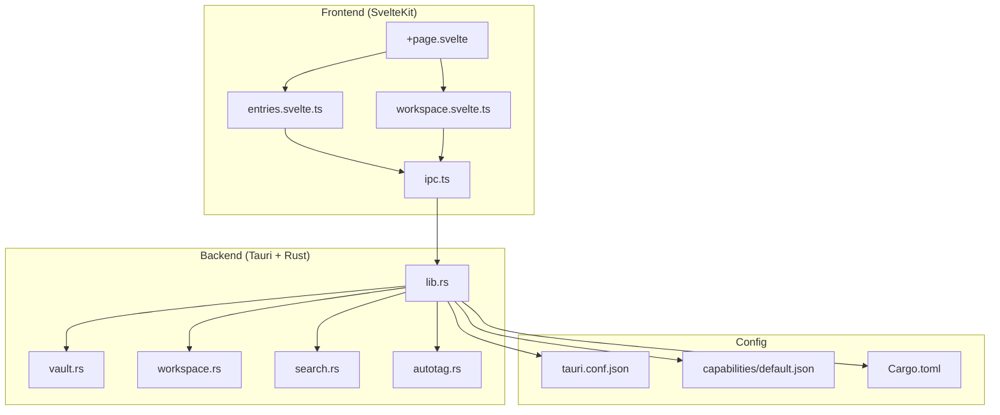
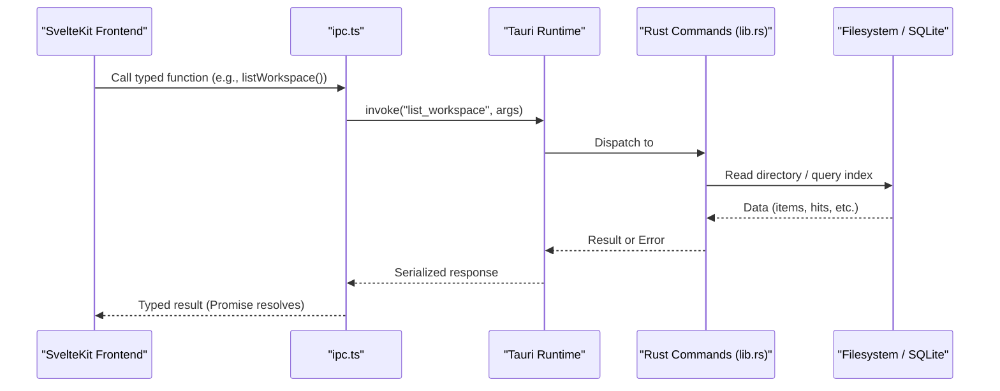
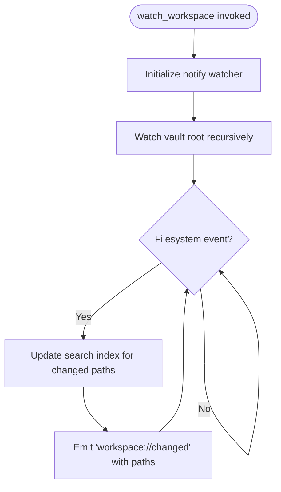
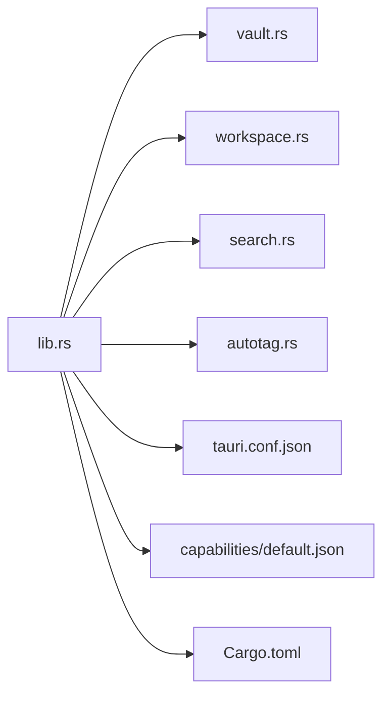

<cite>
**Referenced Files in This Document**
- [ipc.ts](../../apps/fracta/src/lib/ipc.ts)
- [lib.rs](../../apps/fracta/src-tauri/src/lib.rs)
- [vault.rs](../../apps/fracta/src-tauri/src/vault.rs)
- [workspace.rs](../../apps/fracta/src-tauri/src/workspace.rs)
- [search.rs](../../apps/fracta/src-tauri/src/search.rs)
- [autotag.rs](../../apps/fracta/src-tauri/src/autotag.rs)
- [tauri.conf.json](../../apps/fracta/src-tauri/tauri.conf.json)
- [default.json](../../apps/fracta/src-tauri/capabilities/default.json)
- [Cargo.toml](../../apps/fracta/src-tauri/Cargo.toml)
- [+page.svelte](../../apps/fracta/src/routes/+page.svelte)
- [entries.svelte.ts](../../apps/fracta/src/lib/state/entries.svelte.ts)
- [workspace.svelte.ts](../../apps/fracta/src/lib/state/workspace.svelte.ts)
</cite>

## Table of Contents
1. Introduction
2. Project Structure
3. Core Components
4. Architecture Overview
5. Detailed Component Analysis
6. Dependency Analysis
7. Performance Considerations
8. Troubleshooting Guide
9. Conclusion

## Introduction
This document explains how the SvelteKit frontend integrates with the Rust backend via Tauri. It covers IPC communication patterns, command registration and serialization, file system operations, search indexing, background tasks, event-driven updates, error handling, async/await usage, security and permissions, and debugging techniques for cross-process communication.

## Project Structure
The project is a Tauri application with:
- Frontend (SvelteKit): TypeScript state modules and UI components that call Tauri commands through a thin IPC wrapper.
- Backend (Rust): Tauri commands exposing workspace, vault, search, auto-tagging, and GGUF engine capabilities.
- Configuration: Tauri app configuration, capabilities, and Cargo dependencies.

**Diagram sources**
- [ipc.ts](../../apps/fracta/src/lib/ipc.ts)
- [lib.rs](../../apps/fracta/src-tauri/src/lib.rs)
- [vault.rs](../../apps/fracta/src-tauri/src/vault.rs)
- [workspace.rs](../../apps/fracta/src-tauri/src/workspace.rs)
- [search.rs](../../apps/fracta/src-tauri/src/search.rs)
- [autotag.rs](../../apps/fracta/src-tauri/src/autotag.rs)
- [tauri.conf.json](../../apps/fracta/src-tauri/tauri.conf.json)
- [default.json](../../apps/fracta/src-tauri/capabilities/default.json)
- [Cargo.toml](../../apps/fracta/src-tauri/Cargo.toml)

**Section sources**
- [ipc.ts](../../apps/fracta/src/lib/ipc.ts)
- [lib.rs](../../apps/fracta/src-tauri/src/lib.rs)
- [tauri.conf.json](../../apps/fracta/src-tauri/tauri.conf.json)
- [default.json](../../apps/fracta/src-tauri/capabilities/default.json)
- [Cargo.toml](../../apps/fracta/src-tauri/Cargo.toml)

## Core Components
- IPC Wrapper (frontend): Centralized functions calling Tauri invoke() with typed payloads and return types.
- Command Registry (backend): #[tauri::command] functions registered via tauri::generate_handler! and exposed to the webview.
- State Modules (frontend): entries.svelte.ts and workspace.svelte.ts orchestrate async flows, autosave, error handling, and UI state.
- Domain Modules (backend): vault.rs (Markdown entry store), workspace.rs (recursive file operations), search.rs (SQLite FTS5 index), autotag.rs (clipboard source tagging).

Key responsibilities:
- ipc.ts defines all RPC endpoints and data shapes used by the frontend.
- lib.rs wires commands, manages global state (Vault, AutoTag, GgufEngine), and emits events.
- vault.rs persists Markdown entries with frontmatter and safe path resolution.
- workspace.rs provides secure file operations, previews, conversions, and asset access.
- search.rs maintains an incremental FTS5 index keyed by workspace root.
- autotag.rs detects clipboard source on macOS and applies rules.

**Section sources**
- [ipc.ts](../../apps/fracta/src/lib/ipc.ts)
- [lib.rs](../../apps/fracta/src-tauri/src/lib.rs)
- [vault.rs](../../apps/fracta/src-tauri/src/vault.rs)
- [workspace.rs](../../apps/fracta/src-tauri/src/workspace.rs)
- [search.rs](../../apps/fracta/src-tauri/src/search.rs)
- [autotag.rs](../../apps/fracta/src-tauri/src/autotag.rs)

## Architecture Overview
The frontend calls into Tauri commands using @tauri-apps/api/core.invoke. Commands are implemented in Rust and can perform filesystem I/O, spawn processes, and emit events back to the webview. The app config enforces CSP and window capabilities; capabilities define allowed features per window.

**Diagram sources**
- [ipc.ts](../../apps/fracta/src/lib/ipc.ts)
- [lib.rs](../../apps/fracta/src-tauri/src/lib.rs)

## Detailed Component Analysis

### IPC Layer (Frontend)
- Provides strongly-typed wrappers around Tauri invoke().
- Detects runtime environment via isTauri() to gracefully degrade in browser preview.
- Exposes methods for vault operations, workspace CRUD, search, conversions, auto-tagging, and GGUF engine control.

Typical usage pattern:
- Import the method from ipc.ts.
- Call it within async functions.
- Handle errors and update UI state accordingly.

**Section sources**
- [ipc.ts](../../apps/fracta/src/lib/ipc.ts)

### Command Registration and Serialization (Backend)
- All public commands are annotated with #[tauri::command].
- Commands are registered in a single handler array via tauri::generate_handler!.
- Arguments and return values are serialized/deserialized using serde.
- Global state is injected via State<T>, e.g., Vault, AutoTag, GgufEngine.

Examples of categories:
- Vault commands: status, pick, list, read, create, write, delete.
- Workspace commands: list, read, write, move, delete, duplicate, reveal, open externally, links, graph, rebuild index, search, convert CSV/JSON, preview documents.
- Auto-tag commands: list/upsert/delete rules, current source, tags for paste.
- GGUF commands: status, pick model, load/unload.

**Section sources**
- [lib.rs](../../apps/fracta/src-tauri/src/lib.rs)

### Vault Module (Markdown Entries)
- Stores entries as .md files under a user-selected vault folder.
- Enforces safe id-to-path mapping to prevent traversal.
- Persists frontmatter metadata and derives titles when needed.
- Uses OS trash where available; otherwise falls back to hard delete.

Security considerations:
- Rejects invalid ids containing separators, parent references, NUL, or dot-prefix.
- Canonicalizes paths and validates containment.

**Section sources**
- [vault.rs](../../apps/fracta/src-tauri/src/vault.rs)

### Workspace Module (Recursive File Operations)
- Provides a strict subset of filesystem operations scoped to the selected workspace root.
- Validates paths against traversal and symlink escape attempts.
- Supports reading/writing text files with encoding preservation (UTF-8, UTF-8 BOM, UTF-16 LE/BE).
- Validates JSON and CSV content before writing.
- Extracts PDF text and DOCX structure for read-only previews.
- Safely extracts embedded DOCX images via archive path validation.
- Limits inline media size and whitelists MIME types.
- Offers conversion utilities between CSV and JSON.

Error handling:
- Returns descriptive string errors for invalid inputs, missing files, unsupported formats, and IO failures.

**Section sources**
- [workspace.rs](../../apps/fracta/src-tauri/src/workspace.rs)

### Search Indexing (SQLite FTS5)
- Maintains a per-workspace FTS5 index stored under the app config directory.
- Supports full rebuild and incremental updates based on filesystem events.
- Indexes title, metadata (from frontmatter), and body text.
- Returns ranked results with snippets.

Performance characteristics:
- Incremental updates avoid rescanning unchanged subtrees.
- BM25 scoring provides relevance ranking.

**Section sources**
- [search.rs](../../apps/fracta/src-tauri/src/search.rs)

### Auto-Tagging (Clipboard Source Attribution)
- On macOS, polls NSPasteboard changeCount and queries the frontmost app to attribute clipboard content.
- Maintains rules keyed by bundle id with optional tags and active flag.
- Merges rule tags into the active entry on paste.

Cross-platform behavior:
- Non-macOS builds compile a no-op watcher; rules simply never match.

**Section sources**
- [autotag.rs](../../apps/fracta/src-tauri/src/autotag.rs)

### Frontend State Management and Async Patterns
- entries.svelte.ts:
  - Initializes vault status and lists entries.
  - Manages draft lifecycle and autosave with debounced flush.
  - Serializes writes via a promise chain to avoid races.
  - Applies source tags on paste.
- workspace.svelte.ts:
  - Loads workspace tree and graph.
  - Opens files, handles recovery of invalid JSON drafts via localStorage.
  - Performs save, refresh, rename, move, delete, duplicate, external open/reveal.
  - Converts CSV/JSON and creates templates.
  - Debounces search and rebuilds index on demand.

Error handling:
- Catches backend errors and surfaces them as UI notices.
- Retries failed autosaves by re-setting dirty flags.

**Section sources**
- [entries.svelte.ts](../../apps/fracta/src/lib/state/entries.svelte.ts)
- [workspace.svelte.ts](../../apps/fracta/src/lib/state/workspace.svelte.ts)

### Event-Driven Updates and Background Tasks
- Filesystem watcher emits "workspace://changed" with affected paths.
- Frontend should listen for this event to refresh listings or invalidate caches.
- Terminal execution runs commands with bounded output and timeout; stdout/stderr are drained concurrently.

**Diagram sources**
- [lib.rs](../../apps/fracta/src-tauri/src/lib.rs)

**Section sources**
- [lib.rs](../../apps/fracta/src-tauri/src/lib.rs)

### Security and Permissions
- CSP configured in tauri.conf.json restricts script/style/image/connect sources.
- Capabilities default.json enables core and window-state features and specific window actions.
- Path resolution and kind checks ensure only allowed operations occur within the workspace root.
- Media and assets are limited by type and size; binary attachments are validated.
- Terminal commands run with explicit timeouts and bounded output.

**Section sources**
- [tauri.conf.json](../../apps/fracta/src-tauri/tauri.conf.json)
- [default.json](../../apps/fracta/src-tauri/capabilities/default.json)
- [workspace.rs](../../apps/fracta/src-tauri/src/workspace.rs)
- [lib.rs](../../apps/fracta/src-tauri/src/lib.rs)

### Debugging Techniques
- Use Tauri devtools (enabled/disabled via config) to inspect IPC calls and logs.
- Log backend errors returned to the frontend; they propagate as Promise rejections.
- For filesystem watchers, verify event emission and index updates.
- In browser preview mode, isTauri() guards backend calls; ensure graceful fallbacks.

**Section sources**
- [tauri.conf.json](../../apps/fracta/src-tauri/tauri.conf.json)
- [ipc.ts](../../apps/fracta/src/lib/ipc.ts)

## Dependency Analysis
The backend depends on:
- tauri for IPC, state management, and plugin integration.
- rusqlite for FTS5 search indexing.
- notify for filesystem watching.
- rfd for native dialogs.
- zip/lopdf/quick_xml for document parsing.
- trash for OS-aware deletion.

**Diagram sources**
- [lib.rs](../../apps/fracta/src-tauri/src/lib.rs)
- [Cargo.toml](../../apps/fracta/src-tauri/Cargo.toml)
- [tauri.conf.json](../../apps/fracta/src-tauri/tauri.conf.json)
- [default.json](../../apps/fracta/src-tauri/capabilities/default.json)

**Section sources**
- [Cargo.toml](../../apps/fracta/src-tauri/Cargo.toml)
- [lib.rs](../../apps/fracta/src-tauri/src/lib.rs)

## Performance Considerations
- Autosave batching: entries.svelte.ts uses a timer and a write chain to serialize saves and reduce redundant disk writes.
- Incremental search updates: search.rs avoids full rebuilds unless necessary (e.g., .fractaignore changes).
- Output bounding: terminal command outputs are truncated to prevent memory spikes.
- Asset limits: media inline size capped at 256 MB; image/media kinds restricted to known extensions.
- Sorting and listing: workspace.rs sorts items deterministically; vault.rs sorts summaries by updated_at.

[No sources needed since this section provides general guidance]

## Troubleshooting Guide
Common issues and resolutions:
- IPC invocation fails in browser preview: Ensure isTauri() guard is present; backend calls are skipped in non-Tauri environments.
- Workspace operations blocked: Verify path is within the selected root and not a symlink escape; check kind restrictions for editable files.
- Search returns stale results: Trigger rebuild or confirm watch events are emitted; check .fractaignore edits.
- Save errors: Inspect JSON/CSV validation messages; recover invalid JSON drafts from localStorage if prompted.
- Clipboard source attribution not working: Only supported on macOS; other platforms will have no-op watcher.

**Section sources**
- [ipc.ts](../../apps/fracta/src/lib/ipc.ts)
- [workspace.svelte.ts](../../apps/fracta/src/lib/state/workspace.svelte.ts)
- [entries.svelte.ts](../../apps/fracta/src/lib/state/entries.svelte.ts)
- [workspace.rs](../../apps/fracta/src-tauri/src/workspace.rs)
- [search.rs](../../apps/fracta/src-tauri/src/search.rs)
- [autotag.rs](../../apps/fracta/src-tauri/src/autotag.rs)

## Conclusion
The Tauri integration follows a clear separation of concerns: a typed IPC layer in the frontend, robust Rust commands for domain logic, and strict security boundaries for filesystem and process access. Async/await and promise-based communication provide responsive UIs, while event-driven updates and background tasks enable efficient synchronization. Adhering to the documented patterns ensures reliability, performance, and safety across platforms.
