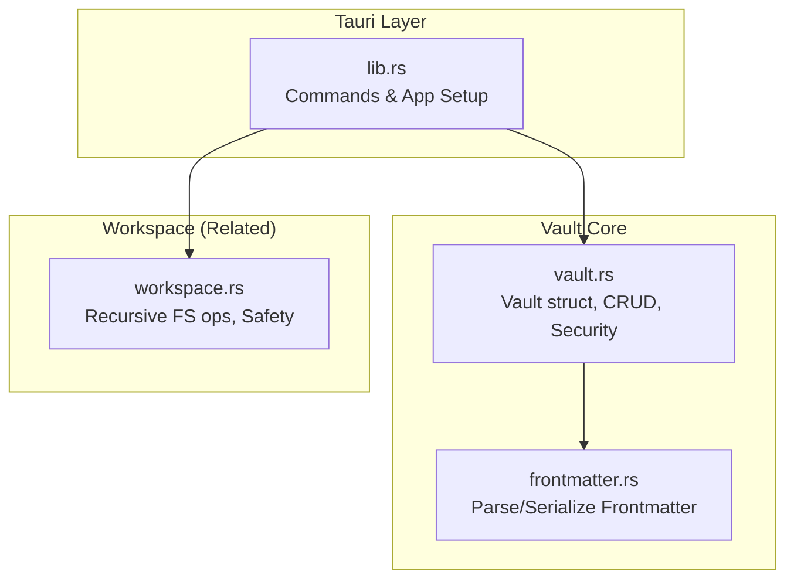
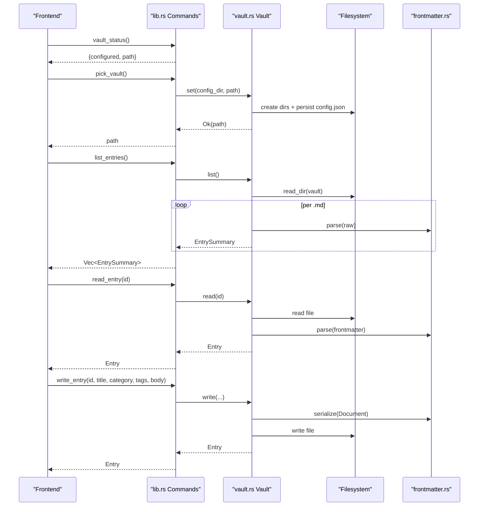
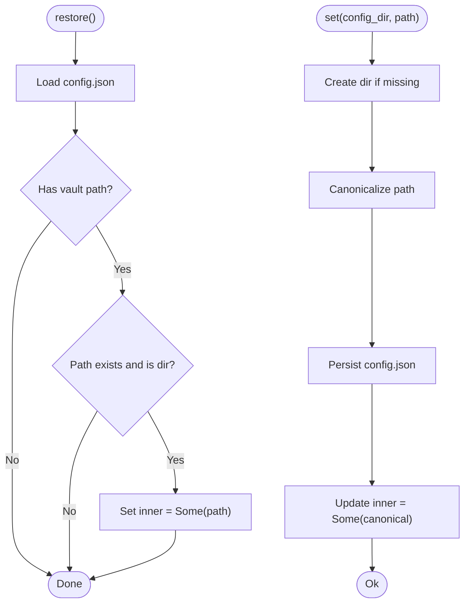
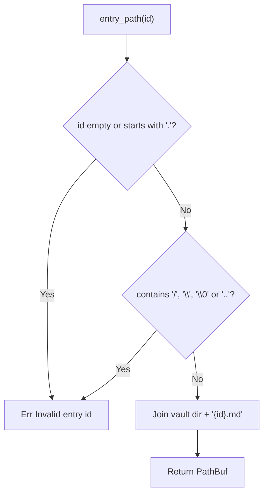
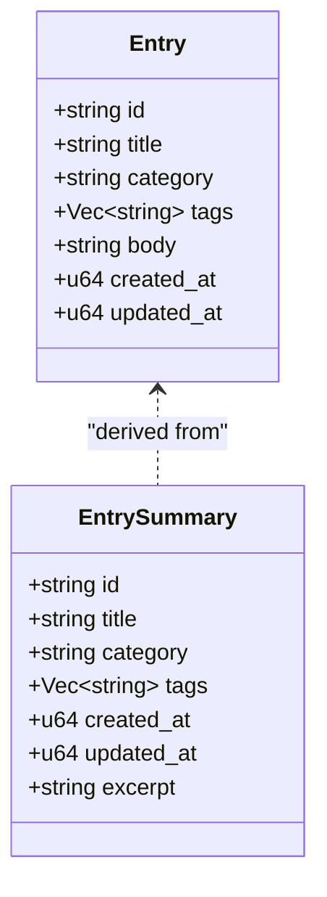
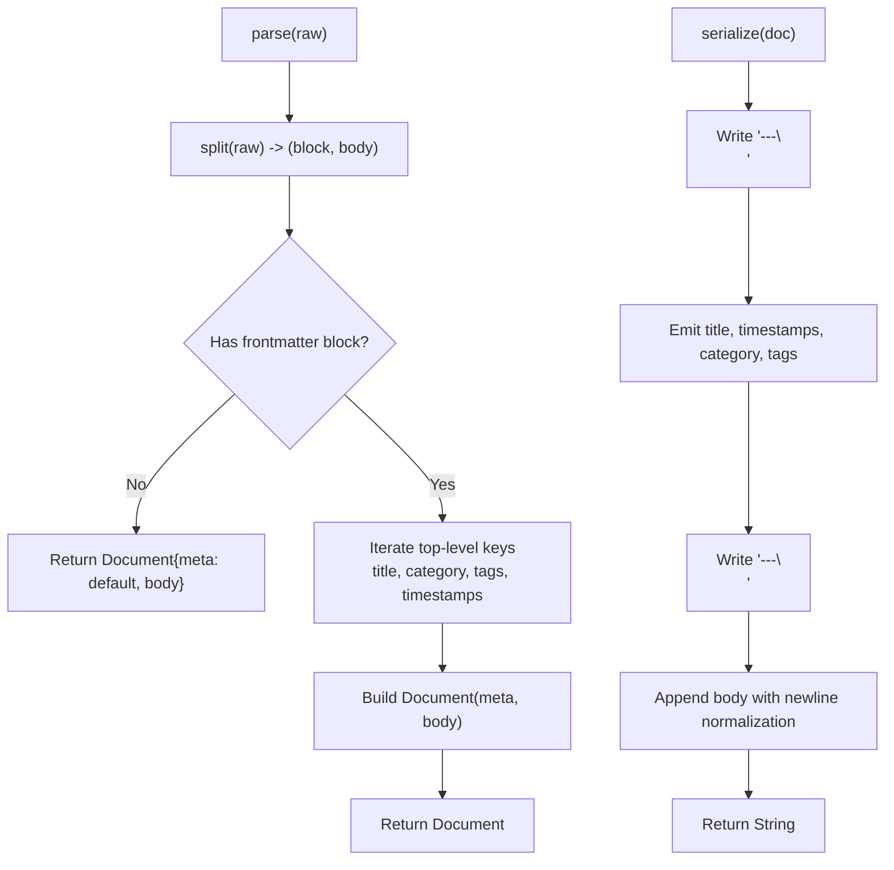
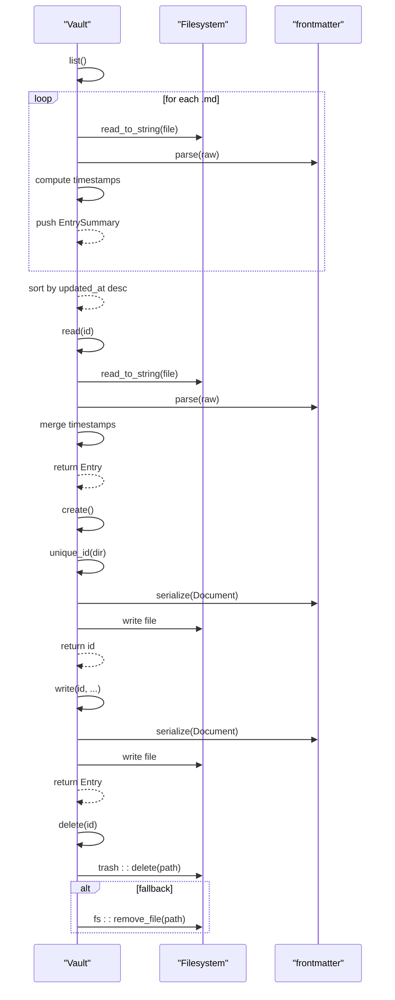
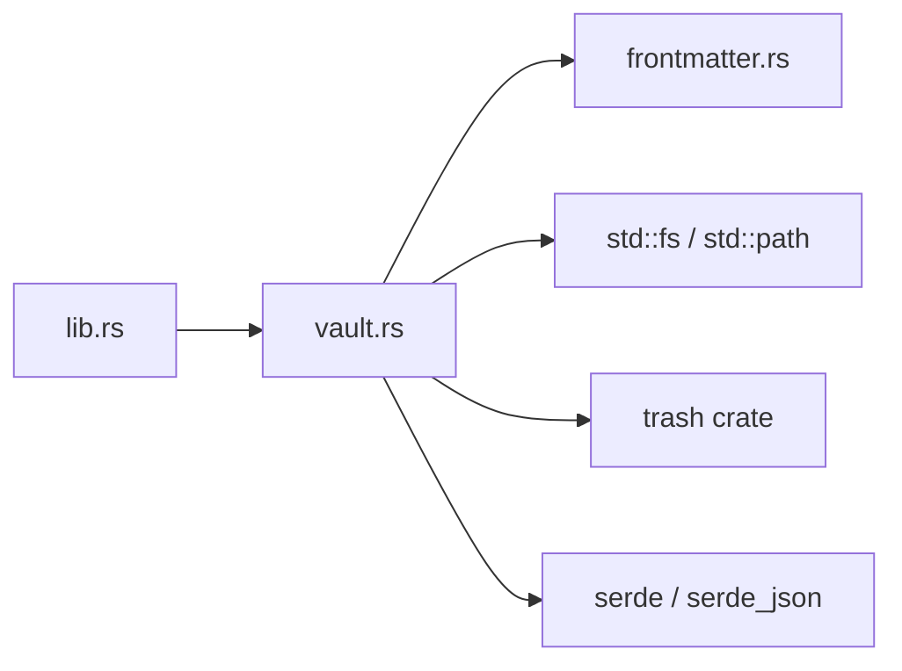

<cite>
**Referenced Files in This Document**
- [vault.rs](../../apps/fracta/src-tauri/src/vault.rs)
- [frontmatter.rs](../../apps/fracta/src-tauri/src/frontmatter.rs)
- [lib.rs](../../apps/fracta/src-tauri/src/lib.rs)
- [workspace.rs](../../apps/fracta/src-tauri/src/workspace.rs)
- [Cargo.toml](../../apps/fracta/src-tauri/Cargo.toml)
</cite>

## Table of Contents
1. [Introduction](#introduction)
2. [Project Structure](#project-structure)
3. [Core Components](#core-components)
4. [Architecture Overview](#architecture-overview)
5. [Detailed Component Analysis](#detailed-component-analysis)
6. [Dependency Analysis](#dependency-analysis)
7. [Performance Considerations](#performance-considerations)
8. [Troubleshooting Guide](#troubleshooting-guide)
9. [Conclusion](#conclusion)

## Introduction
The Fracta Vault Management System provides a secure, file-based note storage architecture. It manages a user-chosen folder containing .md entries, where each entry is a single file with YAML frontmatter metadata and a markdown body. The system exposes Tauri commands for listing, reading, creating, writing, and deleting entries, while ensuring path safety and persistence of the selected vault location.

## Project Structure
At the core of the vault subsystem are three Rust modules:
- vault.rs: Implements the Vault struct, lifecycle operations, path validation, and security checks.
- frontmatter.rs: Parses and serializes YAML frontmatter for entries.
- lib.rs: Registers Tauri commands that expose vault operations to the frontend and initializes the vault on startup.

**Diagram sources**
- [lib.rs:440-496](../../apps/fracta/src-tauri/src/lib.rs#L440-L496)
- [vault.rs:1-120](../../apps/fracta/src-tauri/src/vault.rs#L1-L120)
- [frontmatter.rs:1-80](../../apps/fracta/src-tauri/src/frontmatter.rs#L1-L80)
- [workspace.rs:1-60](../../apps/fracta/src-tauri/src/workspace.rs#L1-L60)

**Section sources**
- [vault.rs:1-120](../../apps/fracta/src-tauri/src/vault.rs#L1-L120)
- [frontmatter.rs:1-80](../../apps/fracta/src-tauri/src/frontmatter.rs#L1-L80)
- [lib.rs:440-496](../../apps/fracta/src-tauri/src/lib.rs#L440-L496)

## Core Components
- Vault struct: Thread-safe handle holding the current vault directory; exposes restore, set, list, read, create, write, delete, and root accessors.
- Entry and EntrySummary: Data models for full entry content and lightweight summaries used by the sidebar.
- Config persistence: A small config.json under the app’s config directory stores the chosen vault path.
- Frontmatter parsing: Lightweight parser for YAML frontmatter supporting title, category, tags, created_at, updated_at, and body.

Key responsibilities:
- Path validation and traversal protection for entry ids.
- Safe creation and updates of .md files with consistent frontmatter.
- Efficient listing via EntrySummary without loading full bodies.
- Robust timestamp handling using both filesystem metadata and frontmatter fields.

**Section sources**
- [vault.rs:21-54](../../apps/fracta/src-tauri/src/vault.rs#L21-L54)
- [vault.rs:56-111](../../apps/fracta/src-tauri/src/vault.rs#L56-L111)
- [frontmatter.rs:10-31](../../apps/fracta/src-tauri/src/frontmatter.rs#L10-L31)

## Architecture Overview
The vault integrates with Tauri as an application state object. On startup, the app restores any previously configured vault path. Users can pick a new folder via a native dialog, which persists the path and updates the in-memory state. All entry operations go through the Vault methods, which enforce strict path safety before touching the filesystem.

**Diagram sources**
- [lib.rs:43-96](../../apps/fracta/src-tauri/src/lib.rs#L43-L96)
- [vault.rs:73-111](../../apps/fracta/src-tauri/src/vault.rs#L73-L111)
- [vault.rs:128-189](../../apps/fracta/src-tauri/src/vault.rs#L128-L189)
- [vault.rs:212-267](../../apps/fracta/src-tauri/src/vault.rs#L212-L267)
- [frontmatter.rs:145-178](../../apps/fracta/src-tauri/src/frontmatter.rs#L145-L178)
- [frontmatter.rs:210-238](../../apps/fracta/src-tauri/src/frontmatter.rs#L210-L238)

## Detailed Component Analysis

### Vault Struct and Lifecycle
- Initialization and restoration:
  - restore(app_config_dir): Loads persisted config.json and sets the vault if the path exists.
  - current(): Returns the active vault path or None.
  - root(): Exposes the vault root for workspace operations.
- Path selection:
  - set(app_config_dir, path): Creates the directory if needed, canonicalizes the path, persists config.json, and updates in-memory state.
- Error handling:
  - dir(): Ensures a vault is configured before proceeding.
  - entry_path(id): Validates id to prevent traversal attacks and constructs safe paths.

**Diagram sources**
- [vault.rs:73-111](../../apps/fracta/src-tauri/src/vault.rs#L73-L111)

**Section sources**
- [vault.rs:73-111](../../apps/fracta/src-tauri/src/vault.rs#L73-L111)

### Security Measures Against Path Traversal
- entry_path(id) enforces:
  - Non-empty id
  - No leading dot
  - No path separators (/ or \)
  - No null bytes
  - No parent references ("..")
- Resulting path is constructed as vault_root.join(format!("{id}.md")), ensuring containment within the vault.

**Diagram sources**
- [vault.rs:115-126](../../apps/fracta/src-tauri/src/vault.rs#L115-L126)

**Section sources**
- [vault.rs:115-126](../../apps/fracta/src-tauri/src/vault.rs#L115-L126)

### Data Structures: Entry vs EntrySummary
- Entry: Full representation including id, title, category, tags, body, created_at, updated_at. Used when opening an entry for editing.
- EntrySummary: Lightweight version excluding body, adding excerpt (first non-empty line trimmed), used for sidebar listings.

**Diagram sources**
- [vault.rs:28-52](../../apps/fracta/src-tauri/src/vault.rs#L28-L52)

**Section sources**
- [vault.rs:28-52](../../apps/fracta/src-tauri/src/vault.rs#L28-L52)

### Frontmatter Parsing and Serialization
- parse(raw): Splits frontmatter block and body, tolerates BOM and CRLF, supports flow and block sequences for tags, and extracts scalar values safely.
- serialize(doc): Writes YAML frontmatter with proper quoting rules, omits empty optional fields, and ensures stable formatting.
- derive_title(body): Generates compact titles from the first meaningful line, trimming markdown markers and limiting length.
- looks_like_auto_title(title, body): Detects auto-generated titles to allow migration to current limits.

**Diagram sources**
- [frontmatter.rs:38-64](../../apps/fracta/src-tauri/src/frontmatter.rs#L38-L64)
- [frontmatter.rs:145-178](../../apps/fracta/src-tauri/src/frontmatter.rs#L145-L178)
- [frontmatter.rs:210-238](../../apps/fracta/src-tauri/src/frontmatter.rs#L210-L238)

**Section sources**
- [frontmatter.rs:145-178](../../apps/fracta/src-tauri/src/frontmatter.rs#L145-L178)
- [frontmatter.rs:210-238](../../apps/fracta/src-tauri/src/frontmatter.rs#L210-L238)
- [frontmatter.rs:258-290](../../apps/fracta/src-tauri/src/frontmatter.rs#L258-L290)

### Vault Operations: List, Read, Create, Write, Delete
- list(): Scans vault directory for .md files, parses frontmatter, computes timestamps, builds EntrySummary sorted by updated_at descending.
- read(id): Resolves safe path, reads file, parses frontmatter, merges timestamps from metadata and frontmatter, returns Entry.
- create(): Generates unique id, writes initial Document with timestamps, returns id.
- write(id, title, category, tags, body): Merges existing metadata, derives title if needed, serializes Document, writes file, returns Entry.
- delete(id): Attempts OS trash deletion; falls back to hard remove.

**Diagram sources**
- [vault.rs:128-189](../../apps/fracta/src-tauri/src/vault.rs#L128-L189)
- [vault.rs:193-267](../../apps/fracta/src-tauri/src/vault.rs#L193-L267)
- [vault.rs:269-277](../../apps/fracta/src-tauri/src/vault.rs#L269-L277)

**Section sources**
- [vault.rs:128-189](../../apps/fracta/src-tauri/src/vault.rs#L128-L189)
- [vault.rs:193-267](../../apps/fracta/src-tauri/src/vault.rs#L193-L267)
- [vault.rs:269-277](../../apps/fracta/src-tauri/src/vault.rs#L269-L277)

### Configuration Persistence
- config_path(app_config_dir): Derives config.json path.
- load_config(app_config_dir): Reads and deserializes config.json; defaults if missing.
- save_config(app_config_dir, config): Persists pretty-printed JSON; creates directories as needed.

**Section sources**
- [vault.rs:56-71](../../apps/fracta/src-tauri/src/vault.rs#L56-L71)

### Tauri Integration and Commands
- vault_status: Reports whether a vault is configured and its path.
- pick_vault: Opens native folder picker, persists selection, updates state.
- list_entries, read_entry, create_entry, write_entry, delete_entry: Thin wrappers over Vault methods.

**Section sources**
- [lib.rs:43-96](../../apps/fracta/src-tauri/src/lib.rs#L43-L96)

## Dependency Analysis
The vault module depends on:
- serde and serde_json for serialization/deserialization of config and frontmatter.
- std::fs and std::path for filesystem operations and path handling.
- trash crate for OS-aware deletion.
- frontmatter module for YAML parsing and serialization.

**Diagram sources**
- [Cargo.toml:17-29](../../apps/fracta/src-tauri/Cargo.toml#L17-L29)
- [vault.rs:7-12](../../apps/fracta/src-tauri/src/vault.rs#L7-L12)

**Section sources**
- [Cargo.toml:17-29](../../apps/fracta/src-tauri/Cargo.toml#L17-L29)
- [vault.rs:7-12](../../apps/fracta/src-tauri/src/vault.rs#L7-L12)

## Performance Considerations
- Listing uses EntrySummary to avoid loading full bodies, keeping large vaults responsive.
- Timestamps are computed efficiently by combining frontmatter and filesystem metadata.
- Unique id generation uses base36 encoding of epoch millis with collision suffixes, minimizing overhead.
- Sorting by updated_at ensures predictable ordering without heavy computation.

[No sources needed since this section provides general guidance]

## Troubleshooting Guide
Common issues and resolutions:
- No vault configured:
  - Cause: Missing or invalid config.json or non-existent path.
  - Resolution: Use pick_vault to select a folder; ensure the path exists.
- Invalid entry id errors:
  - Cause: Id contains path separators, dots, null bytes, or "..".
  - Resolution: Ensure ids are simple file stems without special characters.
- Could not read/write entry:
  - Cause: File permissions or I/O errors.
  - Resolution: Check file permissions and disk space; verify path containment.
- Deletion failures:
  - Cause: OS trash unavailable.
  - Resolution: Falls back to hard remove; check permissions.

**Section sources**
- [vault.rs:115-126](../../apps/fracta/src-tauri/src/vault.rs#L115-L126)
- [vault.rs:159-189](../../apps/fracta/src-tauri/src/vault.rs#L159-L189)
- [vault.rs:269-277](../../apps/fracta/src-tauri/src/vault.rs#L269-L277)

## Conclusion
The Fracta Vault Management System provides a robust, secure, and efficient file-based note storage solution. By enforcing strict path validation, leveraging lightweight summaries for performance, and persisting configuration reliably, it offers a solid foundation for managing markdown entries. The integration with Tauri enables seamless interaction between the frontend and backend, ensuring a smooth user experience.

[No sources needed since this section summarizes without analyzing specific files]
