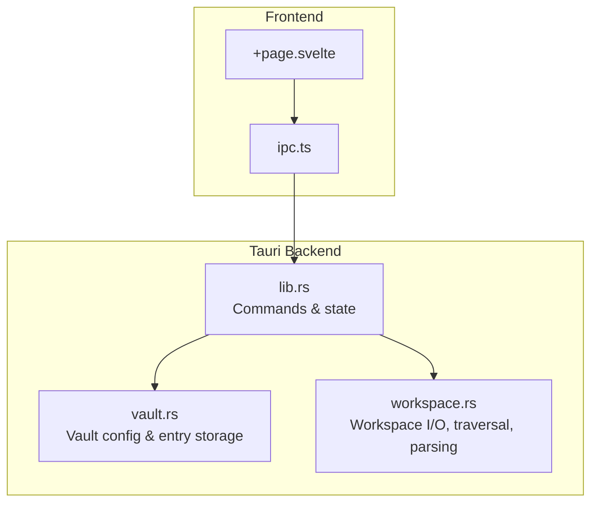
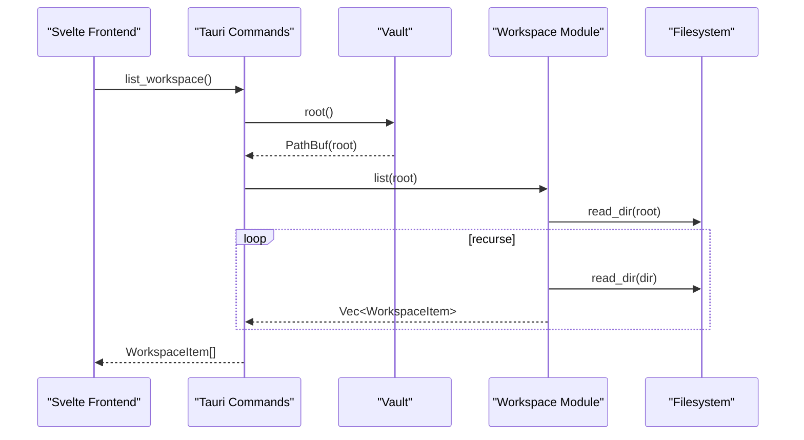
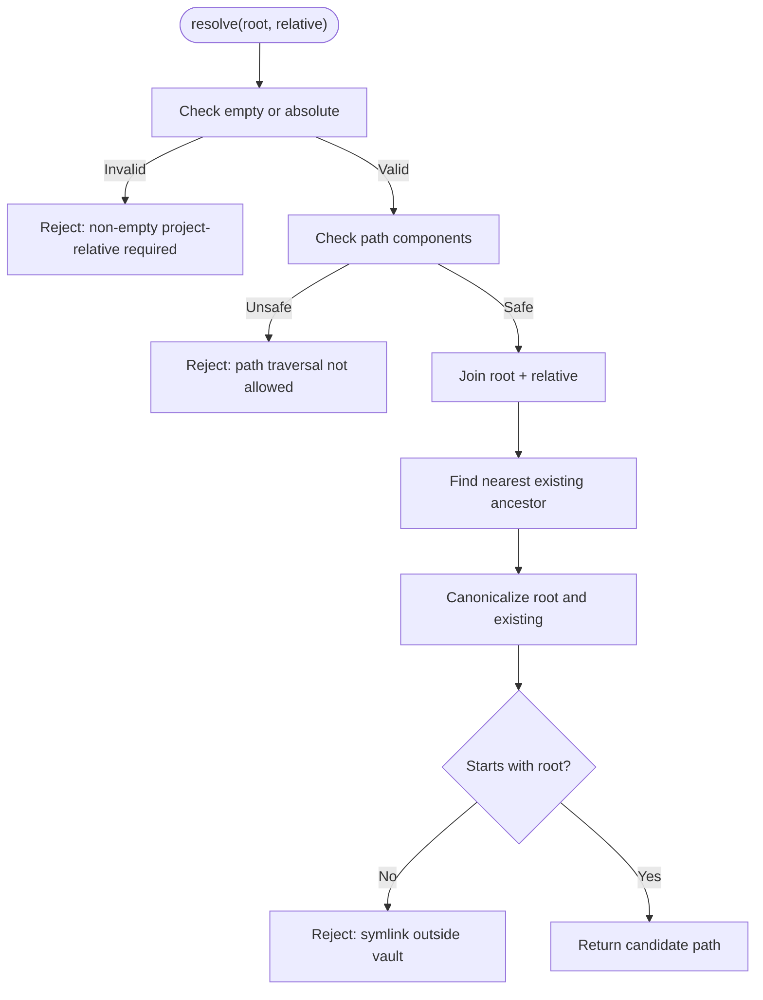
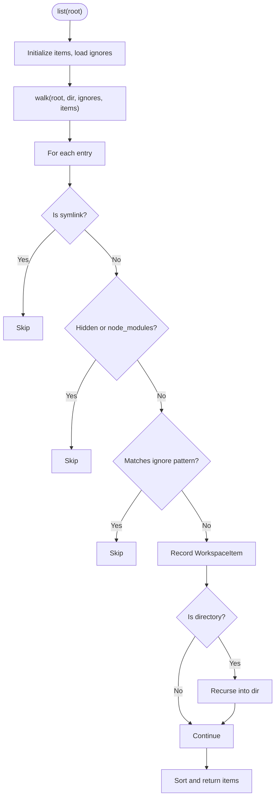
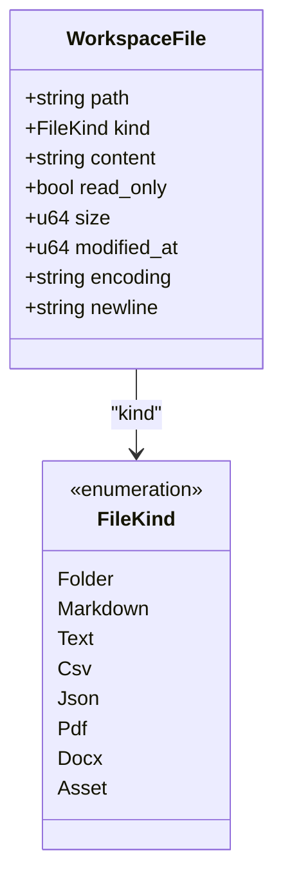
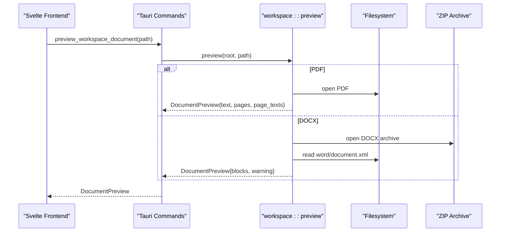
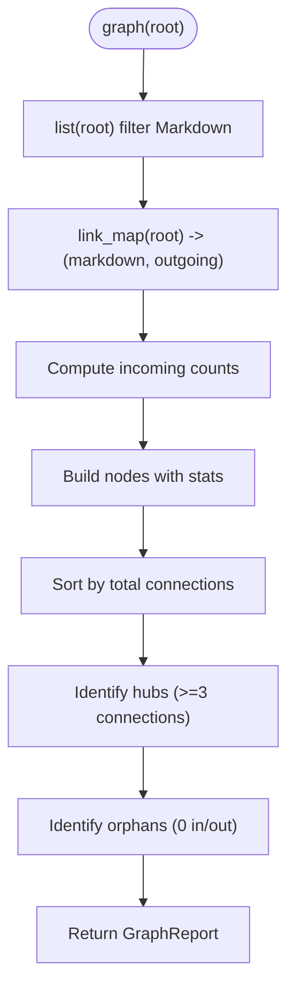
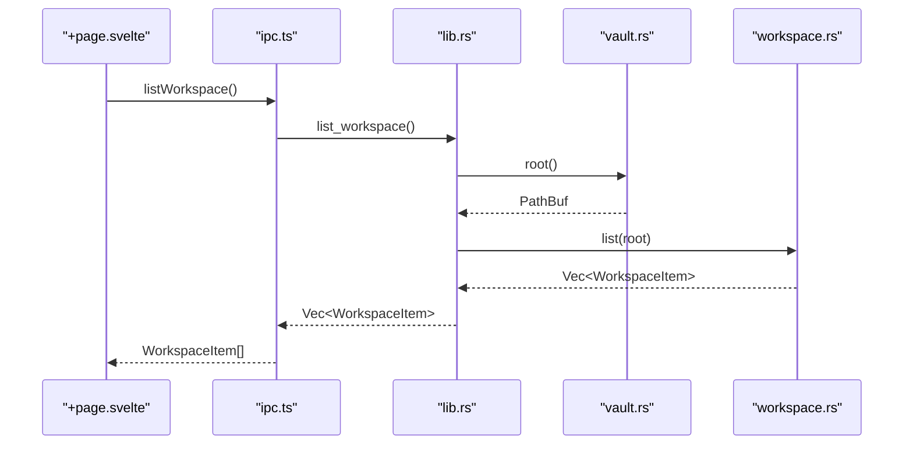
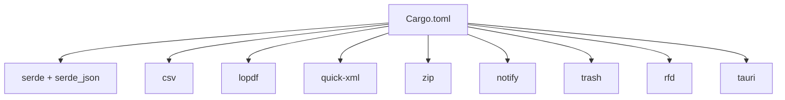

<cite>
**Referenced Files in This Document**
- [workspace.rs](../../apps/fracta/src-tauri/src/workspace.rs)
- [vault.rs](../../apps/fracta/src-tauri/src/vault.rs)
- [lib.rs](../../apps/fracta/src-tauri/src/lib.rs)
- [ipc.ts](../../apps/fracta/src/lib/ipc.ts)
- [+page.svelte](../../apps/fracta/src/routes/+page.svelte)
- [Cargo.toml](../../apps/fracta/src-tauri/Cargo.toml)
</cite>

## Table of Contents
1. [Introduction](#introduction)
2. [Project Structure](#project-structure)
3. [Core Components](#core-components)
4. [Architecture Overview](#architecture-overview)
5. [Detailed Component Analysis](#detailed-component-analysis)
6. [Dependency Analysis](#dependency-analysis)
7. [Performance Considerations](#performance-considerations)
8. [Troubleshooting Guide](#troubleshooting-guide)
9. [Conclusion](#conclusion)

## Introduction
This document explains how Fracta manages workspaces: the workspace root concept, path resolution and vault containment, directory traversal, file kind detection, and operations for reading, writing, previewing, and organizing content. It also covers security measures (symlink protection, path traversal prevention), performance strategies for large workspaces, and memory management considerations. The system is implemented as a Tauri backend with Rust modules and exposed to the SvelteKit frontend via typed IPC calls.

## Project Structure
Fracta’s workspace functionality lives primarily in the Tauri backend:
- Vault configuration and persistence are handled by a small config store and a runtime handle.
- Workspace operations (list, read, write, preview, links/graph, assets) are implemented in a dedicated module.
- Tauri commands expose these capabilities to the frontend.
- The frontend defines TypeScript interfaces and invokes commands through an IPC layer.

**Diagram sources**
- [+page.svelte:1-72](../../apps/fracta/src/routes/+page.svelte#L1-L72)
- [ipc.ts:1-237](../../apps/fracta/src/lib/ipc.ts#L1-L237)
- [lib.rs:1-498](../../apps/fracta/src-tauri/src/lib.rs#L1-L498)
- [vault.rs:1-495](../../apps/fracta/src-tauri/src/vault.rs#L1-L495)
- [workspace.rs:1-1553](../../apps/fracta/src-tauri/src/workspace.rs#L1-L1553)

**Section sources**
- [lib.rs:1-498](../../apps/fracta/src-tauri/src/lib.rs#L1-L498)
- [vault.rs:1-495](../../apps/fracta/src-tauri/src/vault.rs#L1-L495)
- [workspace.rs:1-1553](../../apps/fracta/src-tauri/src/workspace.rs#L1-L1553)
- [ipc.ts:1-237](../../apps/fracta/src/lib/ipc.ts#L1-L237)
- [+page.svelte:1-72](../../apps/fracta/src/routes/+page.svelte#L1-L72)

## Core Components
- WorkspaceItem: Represents a single item in the workspace tree with path, name, kind, size, and modification time.
- FileKind: Enumerates supported kinds such as folder, markdown, text, csv, json, pdf, docx, asset.
- WorkspaceFile: A readable/writable file representation including kind, optional content, encoding, newline convention, and metadata.
- Vault: Holds the configured project root and persists it; provides safe id-to-path mapping for entries.
- Tauri Commands: Expose workspace operations to the frontend (list, read, write, preview, assets, links/graph, search).

Key responsibilities:
- Path safety and vault containment for all operations.
- Safe traversal with symlink exclusion and ignore patterns.
- Robust text encoding preservation and CSV/JSON validation.
- Read-only previews for PDF and DOCX with local extraction.

**Section sources**
- [workspace.rs:21-141](../../apps/fracta/src-tauri/src/workspace.rs#L21-L141)
- [workspace.rs:257-330](../../apps/fracta/src-tauri/src/workspace.rs#L257-L330)
- [vault.rs:14-126](../../apps/fracta/src-tauri/src/vault.rs#L14-L126)
- [lib.rs:98-188](../../apps/fracta/src-tauri/src/lib.rs#L98-L188)

## Architecture Overview
The workspace architecture enforces strict boundaries between the webview and the filesystem:
- All paths are resolved relative to the configured vault root.
- Path traversal attempts are rejected early.
- Symlinks are ignored during traversal to prevent escape or recursion.
- Asset accessors validate extensions and sizes before returning bytes.
- Search and link graph computations run locally on the Rust side.

**Diagram sources**
- [lib.rs:100-108](../../apps/fracta/src-tauri/src/lib.rs#L100-L108)
- [vault.rs:89-111](../../apps/fracta/src-tauri/src/vault.rs#L89-L111)
- [workspace.rs:175-231](../../apps/fracta/src-tauri/src/workspace.rs#L175-L231)

## Detailed Component Analysis

### Workspace Root and Path Resolution
- The vault stores the canonical root path and ensures it exists.
- resolve(root, relative) validates that:
  - relative is non-empty and not absolute.
  - No parent components (..) or other unsafe components exist.
  - Canonicalized existing ancestors do not escape the vault (symlink containment).
- All workspace operations use this resolver to guarantee containment.

**Diagram sources**
- [workspace.rs:143-173](../../apps/fracta/src-tauri/src/workspace.rs#L143-L173)

**Section sources**
- [vault.rs:73-111](../../apps/fracta/src-tauri/src/vault.rs#L73-L111)
- [workspace.rs:143-173](../../apps/fracta/src-tauri/src/workspace.rs#L143-L173)

### Directory Traversal and Ignoring Patterns
- list(root) performs a recursive walk:
  - Skips symlinks to avoid escape/recursion.
  - Skips hidden/system folders (dot-prefixed) and node_modules.
  - Applies .fractaignore rules (simple grammar: exact names, prefixes ending with /, and * suffix).
  - Records WorkspaceItem with kind derived from extension and metadata.
- Sorting is stable by relative path for deterministic output.

**Diagram sources**
- [workspace.rs:175-231](../../apps/fracta/src-tauri/src/workspace.rs#L175-L231)
- [workspace.rs:233-255](../../apps/fracta/src-tauri/src/workspace.rs#L233-L255)

**Section sources**
- [workspace.rs:175-255](../../apps/fracta/src-tauri/src/workspace.rs#L175-L255)

### File Kind Detection System
- kind_for(path, is_dir) classifies files based on extension:
  - Markdown (.md, .mdx), Text (.txt), CSV/TSV (.csv, .tsv), JSON (.json), PDF (.pdf), DOCX (.docx), Asset (others).
- Used consistently across read/write/preview/asset endpoints to gate behavior.

**Section sources**
- [workspace.rs:124-141](../../apps/fracta/src-tauri/src/workspace.rs#L124-L141)

### Reading, Writing, and Encoding Preservation
- read(root, relative):
  - Resolves path, checks kind, reads text encodings (UTF-8, UTF-8 BOM, UTF-16 LE/BE).
  - Detects newline conventions and returns WorkspaceFile with metadata.
- write(root, relative, content):
  - Validates kind (Markdown, TXT, CSV/TSV, JSON only).
  - Validates JSON structure and CSV quotes/delimiter inference.
  - Preserves original encoding/newlines when rewriting.
- Asset writers:
  - image_asset and media_asset enforce allowed extensions and size limits.
  - write_asset handles binary attachments safely within vault.

**Diagram sources**
- [workspace.rs:21-57](../../apps/fracta/src-tauri/src/workspace.rs#L21-L57)
- [workspace.rs:124-141](../../apps/fracta/src-tauri/src/workspace.rs#L124-L141)

**Section sources**
- [workspace.rs:257-330](../../apps/fracta/src-tauri/src/workspace.rs#L257-L330)
- [workspace.rs:369-430](../../apps/fracta/src-tauri/src/workspace.rs#L369-L430)
- [workspace.rs:466-539](../../apps/fracta/src-tauri/src/workspace.rs#L466-L539)

### Previewing PDF and DOCX Locally
- preview(root, relative):
  - PDF: extracts page count and per-page text; warns about layout limitations.
  - DOCX: parses XML to extract paragraphs, headings, lists, tables, and embedded images; exposes relationships for image retrieval.
- docx_image(root, relative, archive_path):
  - Validates archive path prefix and normalizes component traversal.
  - Returns bytes with MIME type for in-memory rendering.

**Diagram sources**
- [workspace.rs:687-767](../../apps/fracta/src-tauri/src/workspace.rs#L687-L767)
- [workspace.rs:769-923](../../apps/fracta/src-tauri/src/workspace.rs#L769-L923)
- [workspace.rs:698-740](../../apps/fracta/src-tauri/src/workspace.rs#L698-L740)

**Section sources**
- [workspace.rs:687-767](../../apps/fracta/src-tauri/src/workspace.rs#L687-L767)
- [workspace.rs:769-923](../../apps/fracta/src-tauri/src/workspace.rs#L769-L923)

### Link Graph and Backlinks
- links(root, relative):
  - Builds a map of Markdown files and their outgoing wiki-links and standard markdown links.
  - Computes forward/backlinks, dead links, orphan status, and suggestions.
- graph(root):
  - Aggregates nodes with incoming/outgoing counts, edges, hubs, and orphans.

**Diagram sources**
- [workspace.rs:1012-1058](../../apps/fracta/src-tauri/src/workspace.rs#L1012-L1058)
- [workspace.rs:1060-1072](../../apps/fracta/src-tauri/src/workspace.rs#L1060-L1072)

**Section sources**
- [workspace.rs:971-1010](../../apps/fracta/src-tauri/src/workspace.rs#L971-L1010)
- [workspace.rs:1012-1058](../../apps/fracta/src-tauri/src/workspace.rs#L1012-L1058)

### Data Conversion Utilities
- csv_to_json(content, delimiter, infer_types):
  - Validates headers uniqueness and records; infers types if requested.
- json_to_csv(content, delimiter):
  - Requires top-level array of objects; flattens keys across rows.

**Section sources**
- [workspace.rs:1138-1191](../../apps/fracta/src-tauri/src/workspace.rs#L1138-L1191)
- [workspace.rs:1193-1240](../../apps/fracta/src-tauri/src/workspace.rs#L1193-L1240)

### Tauri Command Layer and Frontend Integration
- lib.rs registers Tauri commands for workspace operations, wiring them to vault.root() and workspace functions.
- ipc.ts defines TypeScript interfaces and invoke wrappers for the frontend.
- +page.svelte initializes the workspace mode and triggers vault selection if not configured.

**Diagram sources**
- [lib.rs:100-108](../../apps/fracta/src-tauri/src/lib.rs#L100-L108)
- [ipc.ts:144-148](../../apps/fracta/src/lib/ipc.ts#L144-L148)
- [vault.rs:89-111](../../apps/fracta/src-tauri/src/vault.rs#L89-L111)
- [workspace.rs:175-181](../../apps/fracta/src-tauri/src/workspace.rs#L175-L181)

**Section sources**
- [lib.rs:98-188](../../apps/fracta/src-tauri/src/lib.rs#L98-L188)
- [ipc.ts:52-187](../../apps/fracta/src/lib/ipc.ts#L52-L187)
- [+page.svelte:14-60](../../apps/fracta/src/routes/+page.svelte#L14-L60)

## Dependency Analysis
- External crates used by the workspace subsystem:
  - serde/serde_json for serialization.
  - csv for CSV parsing/validation.
  - lopdf for PDF text extraction.
  - quick-xml for DOCX XML parsing.
  - zip for DOCX archive handling.
  - notify for filesystem watching.
  - trash for moving items to OS Trash.
  - rfd for native folder picker.
  - tauri for command registration and app lifecycle.

**Diagram sources**
- [Cargo.toml:17-28](../../apps/fracta/src-tauri/Cargo.toml#L17-L28)

**Section sources**
- [Cargo.toml:17-28](../../apps/fracta/src-tauri/Cargo.toml#L17-L28)

## Performance Considerations
- Traversal efficiency:
  - Symlink skipping avoids expensive canonicalization loops and prevents recursion.
  - Simple ignore patterns reduce unnecessary processing.
- Memory management:
  - Media asset reads enforce a maximum inline size (e.g., 256 MB) to prevent excessive memory usage.
  - Output truncation for terminal commands avoids unbounded string growth.
- Indexing and search:
  - Watcher updates search index incrementally on file changes.
  - Rebuild index on demand to keep search results fresh without full rescans.
- Sorting and caching:
  - Workspace listing sorts by path deterministically; consider client-side pagination for very large trees.
  - Avoid loading full bodies for listings; use summaries where possible.

[No sources needed since this section provides general guidance]

## Troubleshooting Guide
Common issues and resolutions:
- Path traversal errors:
  - Ensure relative paths do not contain .. or absolute segments.
  - Verify no symlinks point outside the vault; remove or relocate them.
- Invalid JSON/CSV writes:
  - Validate JSON structure before saving.
  - Ensure CSV has unique, non-empty headers and balanced quotes.
- Unsupported encodings:
  - Only UTF-8, UTF-8 BOM, and UTF-16 LE/BE are editable; others are read-only.
- Large media assets:
  - Inline media must be under the enforced limit; open larger files externally.
- Missing .fractaignore:
  - Add patterns to exclude build artifacts or generated files from traversal.

**Section sources**
- [workspace.rs:143-173](../../apps/fracta/src-tauri/src/workspace.rs#L143-L173)
- [workspace.rs:395-430](../../apps/fracta/src-tauri/src/workspace.rs#L395-L430)
- [workspace.rs:466-539](../../apps/fracta/src-tauri/src/workspace.rs#L466-L539)
- [workspace.rs:328-364](../../apps/fracta/src-tauri/src/workspace.rs#L328-L364)

## Conclusion
Fracta’s workspace management provides a secure, efficient, and user-friendly way to manage projects directly on disk. By enforcing vault containment, validating inputs, preserving encodings, and offering robust traversal and preview capabilities, it balances usability with safety. The modular design separates concerns between vault configuration, workspace operations, and Tauri command exposure, enabling scalable growth and clear maintenance paths.
