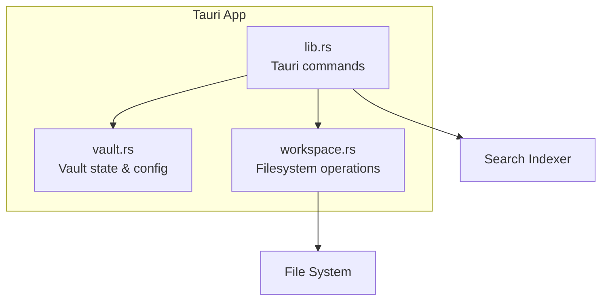
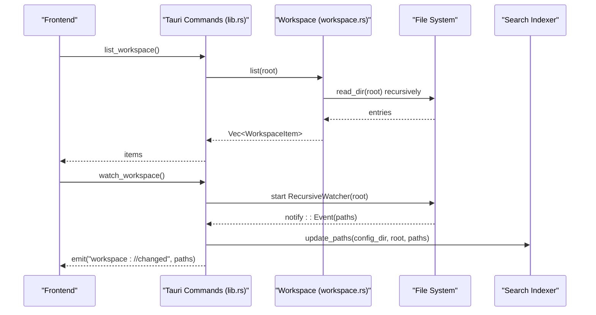
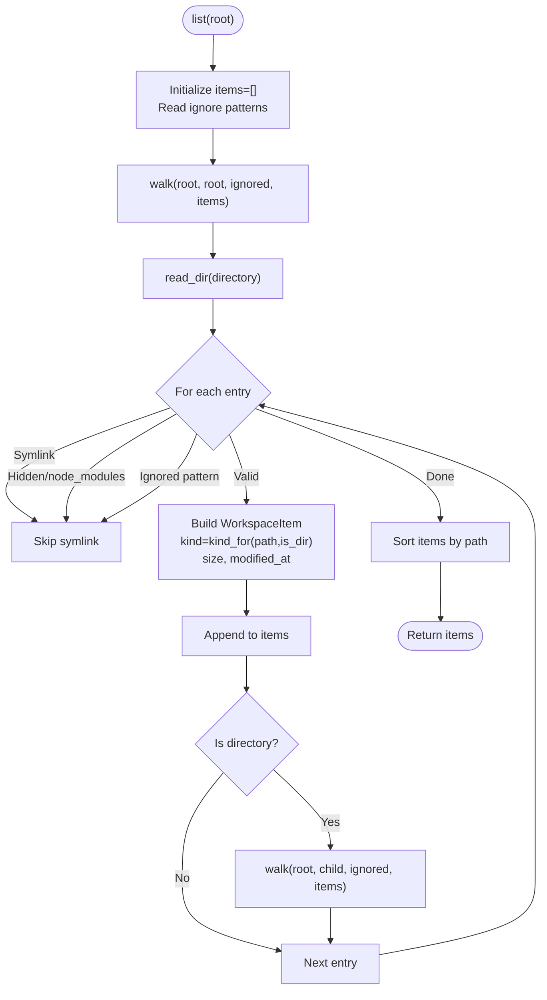
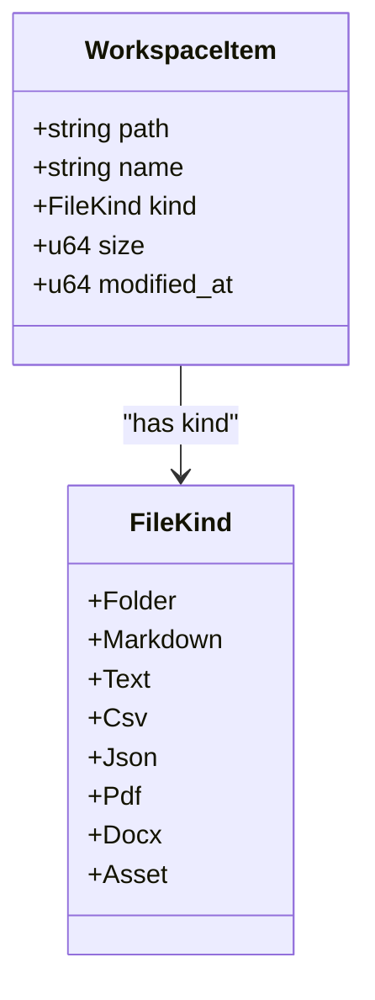
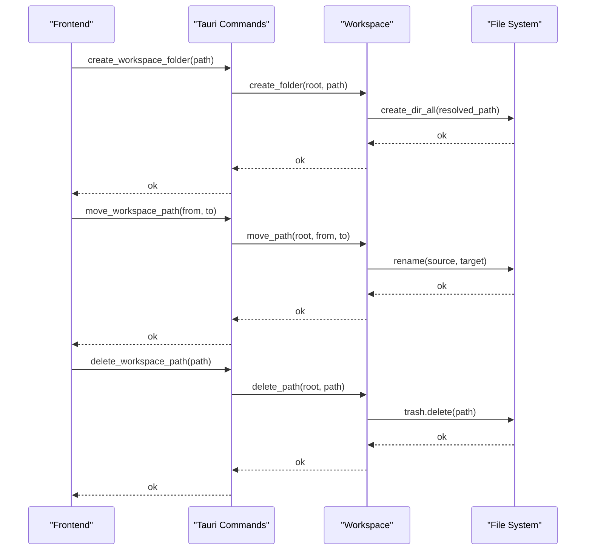
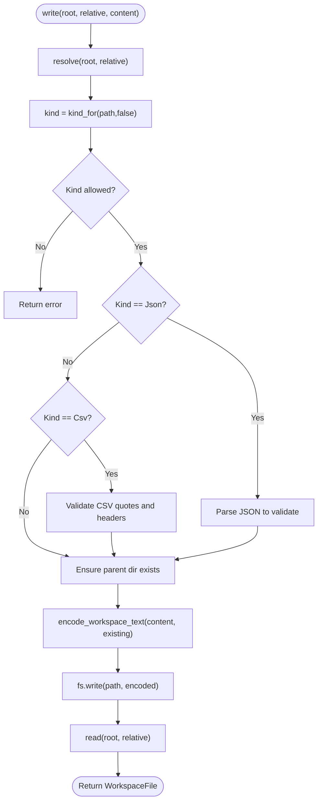
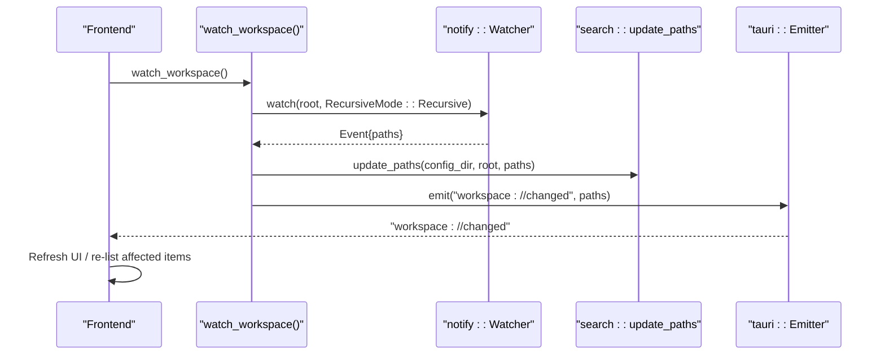
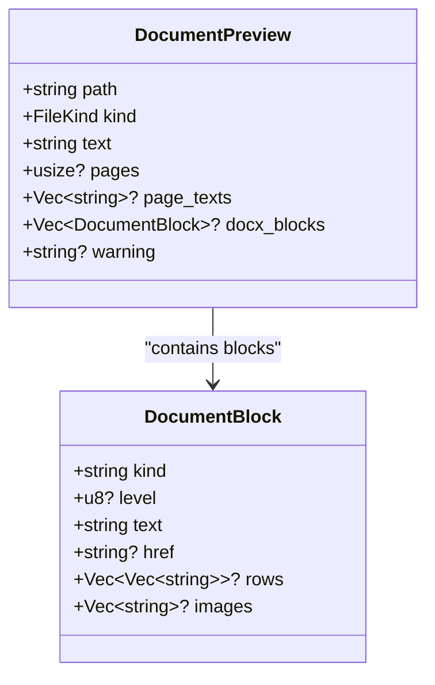
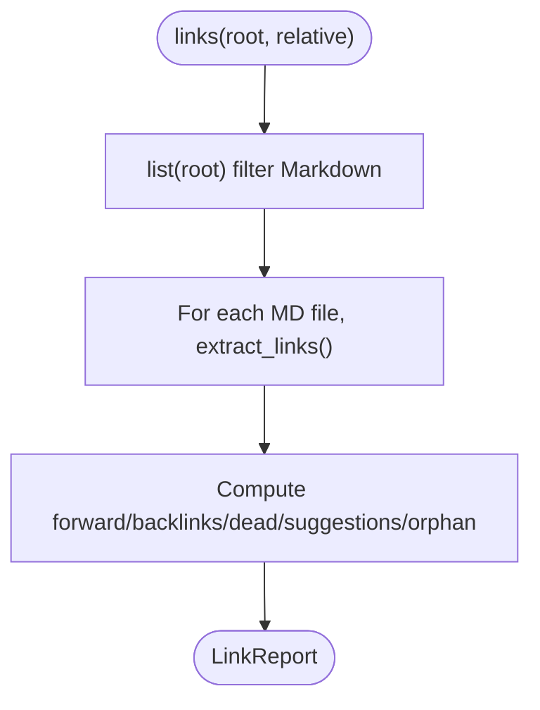
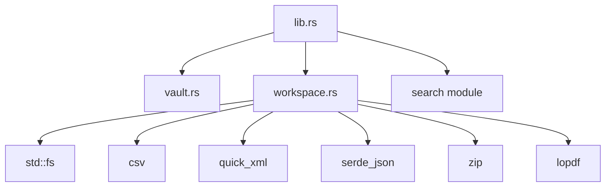

<cite>
**Referenced Files in This Document**
- [workspace.rs](../../apps/fracta/src-tauri/src/workspace.rs)
- [lib.rs](../../apps/fracta/src-tauri/src/lib.rs)
- [vault.rs](../../apps/fracta/src-tauri/src/vault.rs)
</cite>

## Table of Contents
1. [Introduction](#introduction)
2. [Project Structure](#project-structure)
3. [Core Components](#core-components)
4. [Architecture Overview](#architecture-overview)
5. [Detailed Component Analysis](#detailed-component-analysis)
6. [Dependency Analysis](#dependency-analysis)
7. [Performance Considerations](#performance-considerations)
8. [Troubleshooting Guide](#troubleshooting-guide)
9. [Conclusion](#conclusion)

## Introduction
This document describes the workspace file system operations exposed by the Tauri backend for Fracta. It covers recursive directory scanning, file type detection, workspace item management, change detection via filesystem watchers, and synchronization between workspace state and the underlying file system. It also provides examples of common operations and error handling patterns used across the API surface.

## Project Structure
The workspace functionality is implemented in Rust and exposed to the Svelte frontend through Tauri commands. The key modules are:
- Vault: manages the selected project root and persists configuration.
- Workspace: implements path-safe file system operations, including listing, reading, writing, previewing, and asset access.
- Tauri command layer: wires workspace functions to Tauri commands and integrates with a filesystem watcher for live updates.

**Diagram sources**
- [lib.rs:100-165](../../apps/fracta/src-tauri/src/lib.rs#L100-L165)
- [vault.rs:73-111](../../apps/fracta/src-tauri/src/vault.rs#L73-L111)
- [workspace.rs:175-231](../../apps/fracta/src-tauri/src/workspace.rs#L175-L231)

**Section sources**
- [lib.rs:100-165](../../apps/fracta/src-tauri/src/lib.rs#L100-L165)
- [vault.rs:73-111](../../apps/fracta/src-tauri/src/vault.rs#L73-L111)
- [workspace.rs:175-231](../../apps/fracta/src-tauri/src/workspace.rs#L175-L231)

## Core Components
- FileKind: Enumerates supported file types (Folder, Markdown, Text, Csv, Json, Pdf, Docx, Asset).
- WorkspaceItem: Represents a single entry in the workspace tree with path, name, kind, size, and modified timestamp.
- WorkspaceFile: Represents an editable or read-only file with content metadata such as encoding and newline convention.
- LinkReport/GraphReport: Provide link analysis and graph data for Markdown documents within the workspace.
- DocumentPreview: Provides safe text extraction for PDF and DOCX files without exposing raw paths to the webview.

Key behaviors:
- Path safety: All operations validate and canonicalize paths to prevent traversal outside the workspace root.
- Type detection: FileKind is inferred from extension and directory status.
- Encoding preservation: Reads and writes preserve UTF-8, UTF-8 BOM, and UTF-16 encodings; newline conventions are detected and preserved.
- Asset restrictions: Inline image and media assets are restricted to known extensions and sizes.

**Section sources**
- [workspace.rs:21-141](../../apps/fracta/src-tauri/src/workspace.rs#L21-L141)
- [workspace.rs:257-285](../../apps/fracta/src-tauri/src/workspace.rs#L257-L285)
- [workspace.rs:470-551](../../apps/fracta/src-tauri/src/workspace.rs#L470-L551)
- [workspace.rs:290-364](../../apps/fracta/src-tauri/src/workspace.rs#L290-L364)

## Architecture Overview
The Tauri command layer exposes workspace operations to the frontend. Each command resolves the vault root and delegates to workspace functions. A filesystem watcher emits events when files change, allowing the UI to synchronize its view.

**Diagram sources**
- [lib.rs:100-165](../../apps/fracta/src-tauri/src/lib.rs#L100-L165)
- [workspace.rs:175-231](../../apps/fracta/src-tauri/src/workspace.rs#L175-L231)

**Section sources**
- [lib.rs:100-165](../../apps/fracta/src-tauri/src/lib.rs#L100-L165)
- [workspace.rs:175-231](../../apps/fracta/src-tauri/src/workspace.rs#L175-L231)

## Detailed Component Analysis

### Recursive Directory Scanning
- Functionality: Recursively lists all non-hidden, non-symlinked entries under the workspace root, applying ignore patterns from .fractaignore.
- Output: Sorted list of WorkspaceItem objects with relative paths normalized to forward slashes.
- Safety: Skips symlinks to avoid recursion and escapes; ignores dot-prefixed names and node_modules.

**Diagram sources**
- [workspace.rs:175-231](../../apps/fracta/src-tauri/src/workspace.rs#L175-L231)

**Section sources**
- [workspace.rs:175-231](../../apps/fracta/src-tauri/src/workspace.rs#L175-L231)

### File Type Detection
- Functionality: Determines FileKind based on extension and whether the entry is a directory.
- Supported kinds: Folder, Markdown (.md/.mdx), Text (.txt), Csv (.csv/.tsv), Json (.json), Pdf (.pdf), Docx (.docx), Asset (others).

**Diagram sources**
- [workspace.rs:21-41](../../apps/fracta/src-tauri/src/workspace.rs#L21-L41)
- [workspace.rs:124-141](../../apps/fracta/src-tauri/src/workspace.rs#L124-L141)

**Section sources**
- [workspace.rs:124-141](../../apps/fracta/src-tauri/src/workspace.rs#L124-L141)

### Workspace Item Management
- Create folder: Validates path safety and creates directories as needed.
- Move path: Validates source and target, ensures destination does not exist, and renames.
- Delete path: Moves item to OS Trash where possible; otherwise hard deletes.
- Duplicate path: Creates a copy with “ copy” suffixes until a unique name is found; folders cannot be duplicated this way.
- Reveal/Open externally: Uses platform-specific commands to reveal or open items.

**Diagram sources**
- [workspace.rs:573-659](../../apps/fracta/src-tauri/src/workspace.rs#L573-L659)
- [lib.rs:290-318](../../apps/fracta/src-tauri/src/lib.rs#L290-L318)

**Section sources**
- [workspace.rs:573-659](../../apps/fracta/src-tauri/src/workspace.rs#L573-L659)
- [lib.rs:290-318](../../apps/fracta/src-tauri/src/lib.rs#L290-L318)

### Reading and Writing Files
- Read: Resolves path, checks kind, reads text content for supported types, detects encoding and newline convention, returns WorkspaceFile.
- Write: Validates kind, validates JSON and CSV content, preserves existing encoding/newline, writes bytes, returns updated WorkspaceFile.
- Assets: pdf_bytes, image_asset, media_asset return bytes with MIME types after validation and size checks.

**Diagram sources**
- [workspace.rs:384-430](../../apps/fracta/src-tauri/src/workspace.rs#L384-L430)
- [workspace.rs:257-285](../../apps/fracta/src-tauri/src/workspace.rs#L257-L285)
- [workspace.rs:470-551](../../apps/fracta/src-tauri/src/workspace.rs#L470-L551)

**Section sources**
- [workspace.rs:384-430](../../apps/fracta/src-tauri/src/workspace.rs#L384-L430)
- [workspace.rs:257-285](../../apps/fracta/src-tauri/src/workspace.rs#L257-L285)
- [workspace.rs:470-551](../../apps/fracta/src-tauri/src/workspace.rs#L470-L551)

### Change Detection and Synchronization
- Watcher: Starts a recursive watcher on the workspace root; on changes, updates search index and emits an event with changed paths.
- Frontend sync: The UI listens for the event and re-lists or refreshes affected items using normal contained commands.

**Diagram sources**
- [lib.rs:137-165](../../apps/fracta/src-tauri/src/lib.rs#L137-L165)

**Section sources**
- [lib.rs:137-165](../../apps/fracta/src-tauri/src/lib.rs#L137-L165)

### Document Preview and Asset Access
- PDF preview: Extracts page count and per-page text; warns about layout limitations.
- DOCX preview: Parses XML to extract paragraphs, headings, lists, tables, and embedded images; returns blocks and warnings.
- Embedded images: Reads specific archive-relative paths safely; returns bytes and MIME type.

**Diagram sources**
- [workspace.rs:92-116](../../apps/fracta/src-tauri/src/workspace.rs#L92-L116)
- [workspace.rs:687-767](../../apps/fracta/src-tauri/src/workspace.rs#L687-L767)
- [workspace.rs:769-923](../../apps/fracta/src-tauri/src/workspace.rs#L769-L923)

**Section sources**
- [workspace.rs:687-767](../../apps/fracta/src-tauri/src/workspace.rs#L687-L767)
- [workspace.rs:769-923](../../apps/fracta/src-tauri/src/workspace.rs#L769-L923)

### Link Analysis and Graph
- Links: Builds a map of Markdown files and extracts wiki-style [[link]] and standard markdown links; computes forward/backlinks, dead links, suggestions, and orphan status.
- Graph: Computes nodes with incoming/outgoing counts, edges, hubs (>=3 connections), and orphans.

**Diagram sources**
- [workspace.rs:971-1010](../../apps/fracta/src-tauri/src/workspace.rs#L971-L1010)
- [workspace.rs:1060-1136](../../apps/fracta/src-tauri/src/workspace.rs#L1060-L1136)

**Section sources**
- [workspace.rs:971-1010](../../apps/fracta/src-tauri/src/workspace.rs#L971-L1010)
- [workspace.rs:1060-1136](../../apps/fracta/src-tauri/src/workspace.rs#L1060-L1136)

## Dependency Analysis
- lib.rs depends on vault.rs for root resolution and persistence, and on workspace.rs for file operations.
- workspace.rs uses std fs, csv, quick_xml, serde_json, zip, and lopdf for parsing and binary handling.
- Search integration is triggered on write and watcher events.

**Diagram sources**
- [lib.rs:1-21](../../apps/fracta/src-tauri/src/lib.rs#L1-L21)
- [workspace.rs:7-16](../../apps/fracta/src-tauri/src/workspace.rs#L7-L16)

**Section sources**
- [lib.rs:1-21](../../apps/fracta/src-tauri/src/lib.rs#L1-L21)
- [workspace.rs:7-16](../../apps/fracta/src-tauri/src/workspace.rs#L7-L16)

## Performance Considerations
- Recursive listing sorts results; consider pagination for very large workspaces.
- Watcher events trigger incremental search updates; avoid excessive rebuilds by batching changes if needed.
- Media asset reads enforce a maximum size to prevent memory spikes.
- CSV delimiter detection scans only the first record to minimize overhead.

[No sources needed since this section provides general guidance]

## Troubleshooting Guide
Common errors and resolutions:
- Path traversal or absolute paths: resolve rejects these; ensure relative paths within the workspace root.
- Symlink escape: resolve checks canonicalized ancestors; avoid symlinks pointing outside the workspace.
- Unsupported file kind for editing: only Markdown, TXT, CSV/TSV, and JSON can be edited; use write_asset for other binaries.
- Invalid JSON or CSV: write validates content; fix syntax or quoting issues before saving.
- Encoding issues: legacy encodings beyond UTF-8/UTF-16 are read-only; convert files to supported encodings.
- Media too large: inline media limited to 256 MB; open larger files externally.

**Section sources**
- [workspace.rs:143-173](../../apps/fracta/src-tauri/src/workspace.rs#L143-L173)
- [workspace.rs:384-430](../../apps/fracta/src-tauri/src/workspace.rs#L384-L430)
- [workspace.rs:328-364](../../apps/fracta/src-tauri/src/workspace.rs#L328-L364)
- [workspace.rs:470-551](../../apps/fracta/src-tauri/src/workspace.rs#L470-L551)

## Conclusion
The workspace API provides a secure, efficient interface for managing files within a chosen project root. It enforces path safety, supports multiple file types, preserves encodings and newlines, and synchronizes with the file system via watchers. Use the documented commands for listing, reading, writing, previewing, and analyzing links and graphs, while adhering to the constraints and error patterns described here.
