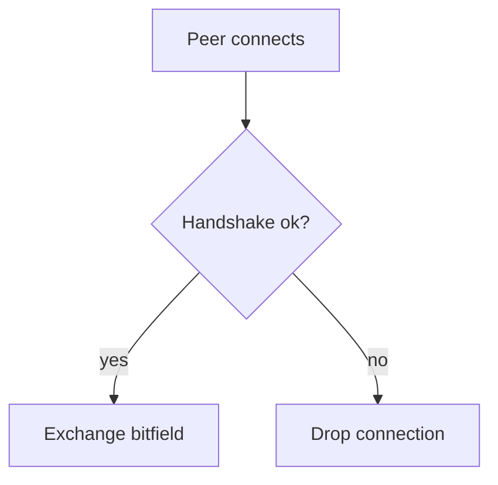

The peer starts as `choked` until the remote side grants upload capacity.

## Allocation, not punishment

Choking controls upload capacity; it does not close the connection.

| State | Meaning |
| --- | --- |
| `choked` | Piece requests are paused. |
| `interested` | Remote wants data. |
| `unchoked` | Requests may flow. |

### Wire sketch

```ts filename="src/peer.ts" lineNumbers highlight="2-4" focus="1-5"
export type PeerState = 'choked' | 'interested' | 'unchoked';

export function canRequest(state: PeerState): boolean {
  return state === 'unchoked';
}
```

Long lines can wrap when the reader toggles wrap on the code frame.

```bash
pnpm exec acrolls validate ./examples/starter/article.md
```

### Handshake flow


