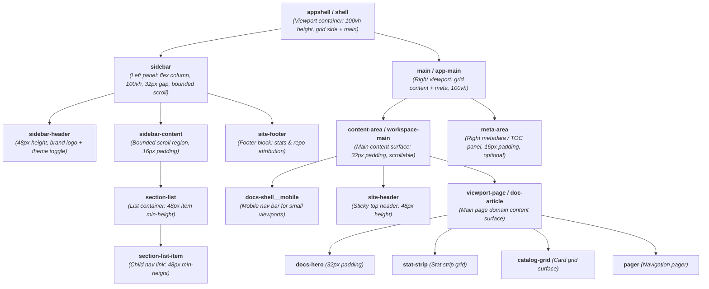
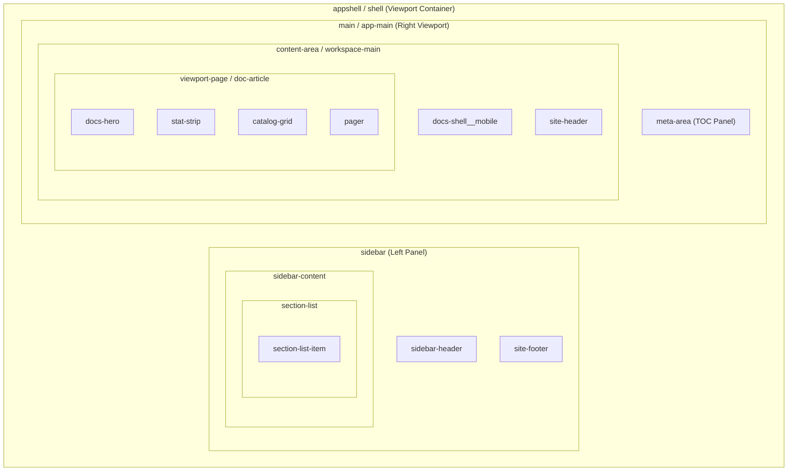

# SASS Rules

## Mandatory Documentation

You must maintain for the overall site layout, this kind of map at the bottom of this doc:

```
`shell`
├── `shell-header` / `app-header` (optional fixed header)
├── `shell-main` / `app-main` (the remaining viewport)
│   └── `workspace` (one or more resizable surfaces)
│       ├── `sidebar` (optional, collapsible/resizable)
│       │   ├── `sidebar-header` (optional)
│       │   └── `sidebar-content` (bounded scroll region)
│       ├── `workspace-resizer` (optional)
│       ├── `workspace-main` (the central bounded viewport)
│       │   └── `viewport-page` or domain surface
│       ├── `workspace-resizer` (optional)
│       └── `sidebar` (optional, collapsible/resizable)
│           └── nested `workspace` when a surface itself splits
└── optional footer
```

you must give clear picture on what container classes are parents, what classes are child classes inside them, and that is the overall layout.


## Gaps 

smallest items have tight gaps: 8px
- .nav-item, .pill
	gap: 8px
	padding: 8px, or 4px 8px

standard row items, list items: 16px
- .list-item, .section-item
	gap: 16px
	padding: 16px, or 8px 16px

large, outer containers: 32px
- .section, .sidebar, .appshell
	gap: 32px
	padding: 32px

## Heights and Sizes

three height scales for icons or tight buttons
- .icon-sm, .btn-sm
	height: 16px
- .icon-md, .btn-md
	height: 24px
-.icon-lg, .btn-lg
	height: 32px
- inputs, buttons standard, base height
	height: 32px
- min-height for larger containers than buttons, but inside big items like sidebar etc
	.section-list, .sidebar-item
		height: 48px
- breathing and spacing - height: 64px

## Only border-radius of either 5px or 10px not more, can be less

## Typography - use scale and classes of `_typography.sass`
	- no other sizes allowed
	- smallest text - metadata text, muted headings etc. - .text-xs
	- body standard - .text-bs

## Level-zero rules

- Body copy uses a 1.5 line-height; headings use 1.1.
- Do not create new classes that apply to a single element. Use existing classes, primitives etc as much as possible.
- If you have to create a new class, try to define it such that it generalises a type, and can be used for other elements also. Ex: if defining ".sidebar-list-item" define it such that if there is a right sidebar, left sidebar, or any list, the same class can be used for items in it.

## Architecture scheme

The system is deliberately layered. A lower layer never reaches upward, and a screen must compose patterns from these families instead of creating one-off styling.

1. `tokens` — the single source for semantic colour, spacing, type scale, radius, elevation, and motion values.
2. `globals` — fonts, reset, document defaults, focus ring, and reduced-motion guardrails.
3. `typography` — text hierarchy and the small existing typography utility set.
4. `primitives` — existing flex/grid helpers, retained for legacy screens only. New studio work should compose layouts instead.
5. `buttonslinks` — the shared control and link family.
6. `layouts` — shell, workspace, and page frames.
7. You can Domain modules if needed — `navigation`, `projectstudio`, `media`, `recorder`, `settings`, and `command-palette` etc.

## Universal styling vocabulary

The system is intentionally compositional. A screen should first assemble from these reusable families before introducing a semantic component name.

- Layout: `flex`, `row`, `col`, `grid`, `wrap`, and if needed create more like these..
- Alignment: existing `xleft`, `xcenter`, `xright`, `ycenter`, `ytop`, `ybot`, `xbetween`, and `xevenly` modifiers compose with `row` or `box`.
- Borders and motion: `border`, `border-transparent`, `bordtop`, `bordbot`, `bordleft`, `radius-sm`, `radius-md`, `pointer`, and `trans-std`.
- Controls and links: `control` is the shared interaction base; `button`, `button-primary`, `button-quiet`, `icon-button`, and `link` are the public control family.

## Fractals Styler

Any `{prefix}{N}` for any non-negative integer `N`:

| Class | CSS |
|---|---|
| `.gapN` | `gap: Npx` |
| `.cgapN` | `column-gap: Npx` |
| `.rgapN` | `row-gap: Npx` |
| `.padN` | `padding: Npx` |
| `.padtopN` | `padding-top: Npx` |
| `.padbotN` | `padding-bottom: Npx` |
| `.padleftN` | `padding-left: Npx` |
| `.padrightN` | `padding-right: Npx` |
| `.marginN` | `margin: Npx` |
| `.margintopN` | `margin-top: Npx` |
| `.marginbotN` | `margin-bottom: Npx` |
| `.marginleftN` | `margin-left: Npx` |
| `.marginrightN` | `margin-right: Npx` |
| `.heightN` | `height: Npx` |
| `.widthN` | `width: Npx` |

e.g. `class="gap1 pad24 margintop128"`.

But use the scale defined: gap4, gap8, gap64, pad32 etc. are permitted.
pad36, gap11, etc. are not. only px values allowed are  - 4, 8, 16, 24, 32, 48, 64, 80 and beyond


## Site Layout Container Map

```
`appshell` / `shell` (Viewport container: 100vh height, grid side + main)
├── `sidebar` (Left panel: flex column, 100vh height, 32px gap, 32px padding, bounded scroll)
│   ├── `sidebar-header` (Header row: 48px height, brand logo/title + theme toggle)
│   ├── `sidebar-content` (Bounded scroll region: 16px padding, 32px section gap)
│   │   └── `section-list` (List container: 48px item min-height, 8px gap)
│   │       └── `section-list-item` (Child nav link: 48px min-height, 16px gap, 8px 16px padding)
│   └── `site-footer` (Footer block: stats & repo attribution)
└── `main` / `app-main` (Right viewport: grid content-area + meta-area, 100vh height)
    ├── `content-area` / `workspace-main` (Main content surface: 32px padding, scrollable)
    │   ├── `docs-shell__mobile` (Mobile navigation bar for small viewports)
    │   ├── `site-header` (Sticky top header: 48px height, 16px padding, site nav)
    │   └── `viewport-page` / `doc-article` / `section` (Main page domain content surface)
    │       ├── `docs-hero` (Hero container: 32px padding, 16px gap)
    │       ├── `stat-strip` (Stat strip grid: 16px gap)
    │       ├── `catalog-grid` (Card grid surface: 16px card gap)
    │       └── `pager` (Navigation pager: 32px top margin, 16px gap)
    └── `meta-area` (Right metadata / TOC panel: 16px padding, optional)
```





### Container Class Hierarchy:
- **Parent**: `.appshell` or `.shell`
  - **Child**: `.sidebar`
    - **Subchildren**: `.sidebar-header`, `.sidebar-content`, `.site-footer`
      - **Grandchild**: `.section-list-item`
  - **Child**: `.main` or `.app-main`
    - **Subchildren**: `.content-area` (or `.workspace-main`), `.meta-area`
      - **Grandchildren inside `.content-area`**: `.docs-shell__mobile`, `.site-header`, `.doc-article` / `.section` / `.docs-hero` / `.catalog-grid` / `.pager`


