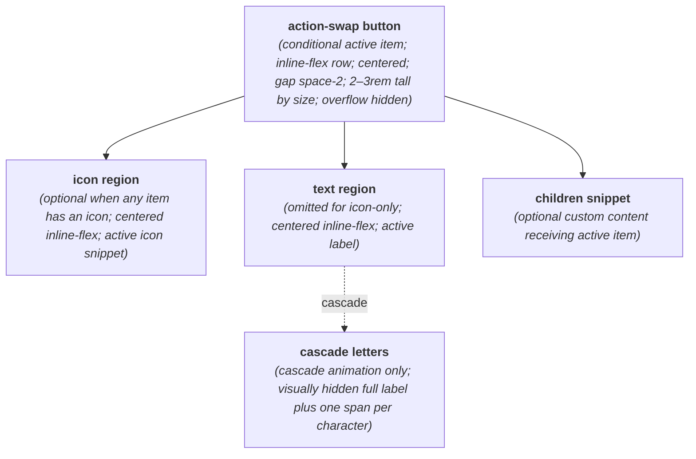
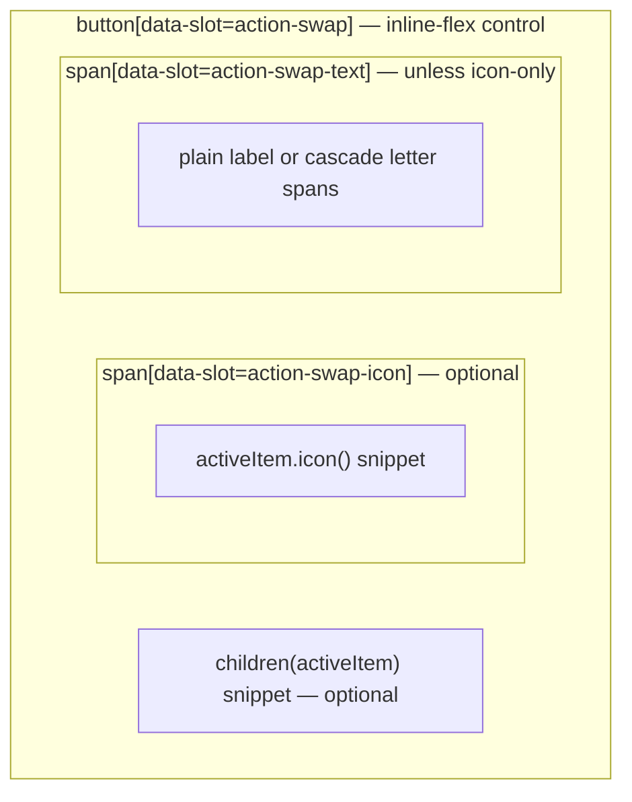

# ActionSwap Layout Capture

**Source component:** `action-swap.svelte`  
**Sibling styles:** `action-swap.sass`

## Diagram 1 — UI architecture and layout flow

## Diagram 2 — DOM and CSS containment

## Layout breakdown

- `AS_ROOT` / `AS_BUTTON_BOX` is the only outer layout boundary: an inline flex row with centered children, tokenized gap and horizontal padding, fixed size-variant heights, and clipped animated content.
- `AS_ICON` and `AS_TEXT` map to sibling spans; each is independently centered and replaced when the active item changes.
- `AS_CASCADE` expands only the text branch into a hidden accessible label and an inline sequence generated by an `{#each}` block.
- `AS_CHILD` is an optional caller-provided snippet inside the same button row; there are no viewport breakpoints, sidebars, sticky/fixed regions, or scroll containers.
