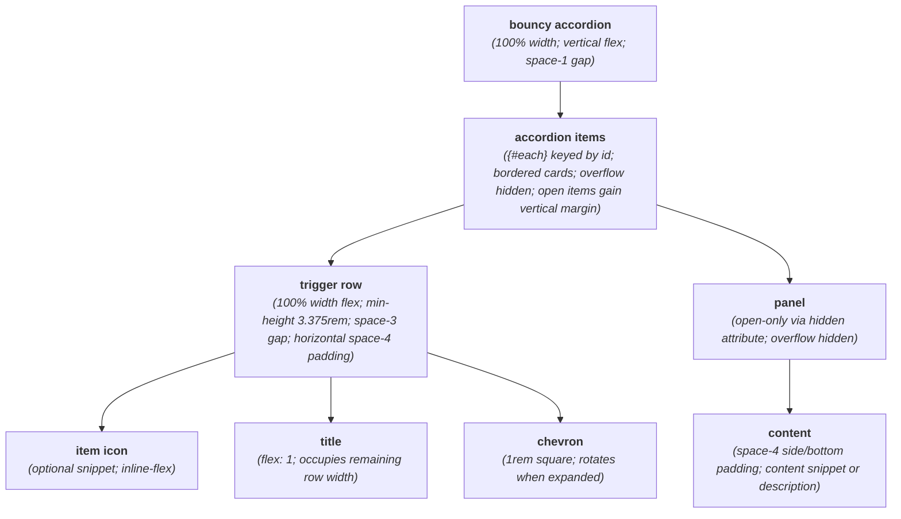
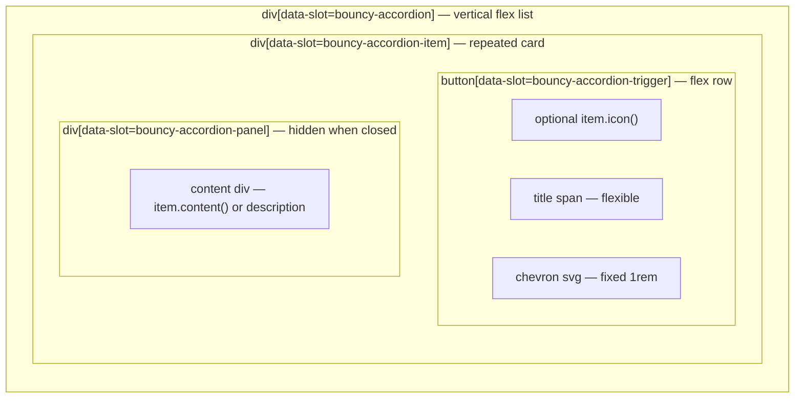

# BouncyAccordion Layout Capture

**Source component:** `bouncy-accordion.svelte`  
**Sibling styles:** `bouncy-accordion.sass`

## Diagram 1 — UI architecture and layout flow

## Diagram 2 — DOM and CSS containment

## Layout breakdown

- `BA_ROOT` / `BA_ACCORDION_BOX` establishes a full-width vertical stack; `BA_LOOP` / `BA_ITEM_BOX` represents every keyed item generated by `{#each}`.
- `BA_TRIGGER` is a horizontal flex boundary containing the optional icon, flexible title, and fixed chevron in that order.
- `BA_PANEL` remains the content boundary but is hidden when closed; `BA_CONTENT` chooses between the item snippet and description text.
- Open-state margins alter spacing around an item. No breakpoint-specific, sticky, fixed, grid, or scrolling layout is defined.
