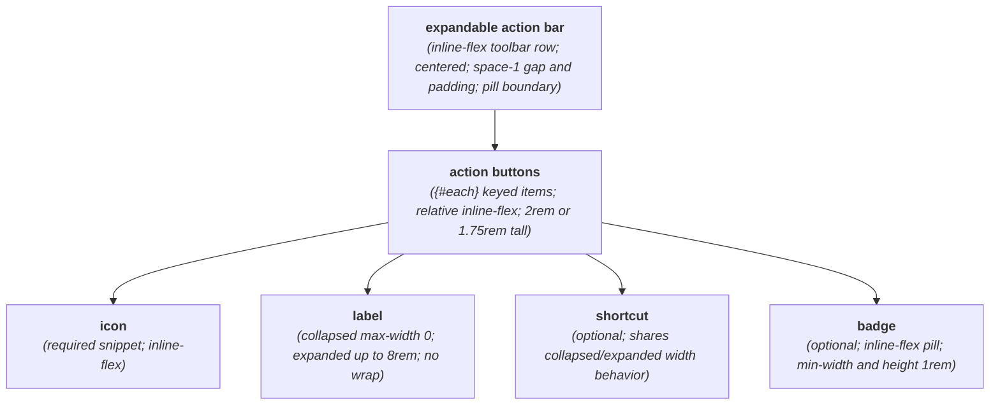
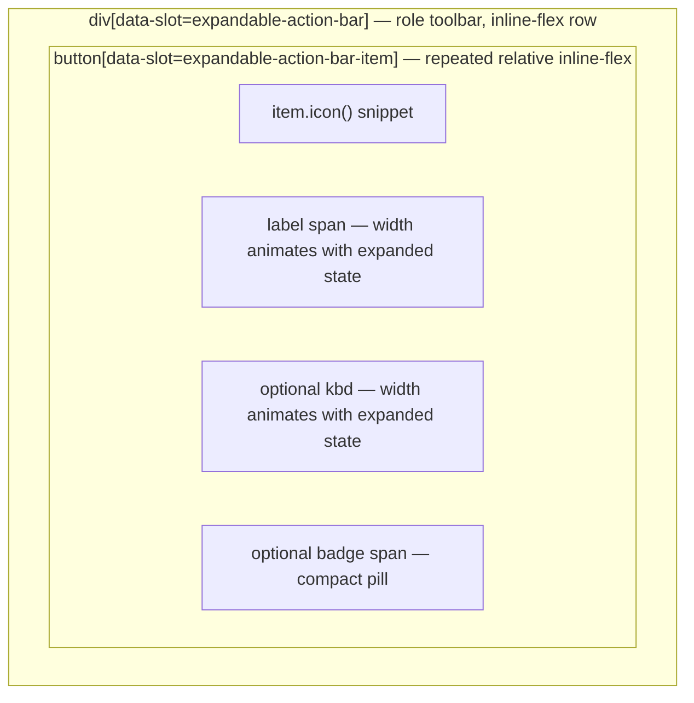

# ExpandableActionBar Layout Capture

**Source component:** `expandable-action-bar.svelte`  
**Sibling styles:** `expandable-action-bar.sass`

## Diagram 1 — UI architecture and layout flow

## Diagram 2 — DOM and CSS containment

## Layout breakdown

- `EA_ROOT` / `EA_TOOLBAR_BOX` is one non-wrapping inline flex toolbar; expansion changes descendant gaps but does not create another row.
- `EA_LOOP` / `EA_ITEM_BOX` repeats one button per item and contains all item-level regions horizontally.
- `EA_LABEL` and `EA_SHORTCUT` stay in the DOM while collapsed, using zero maximum width, hidden overflow, and zero opacity; expanded state allows up to `8rem` each.
- `EA_BADGE` remains visible independently of expansion. The small size variant reduces button dimensions; no viewport breakpoint, sidebar, fixed/sticky, or scroll region exists.
